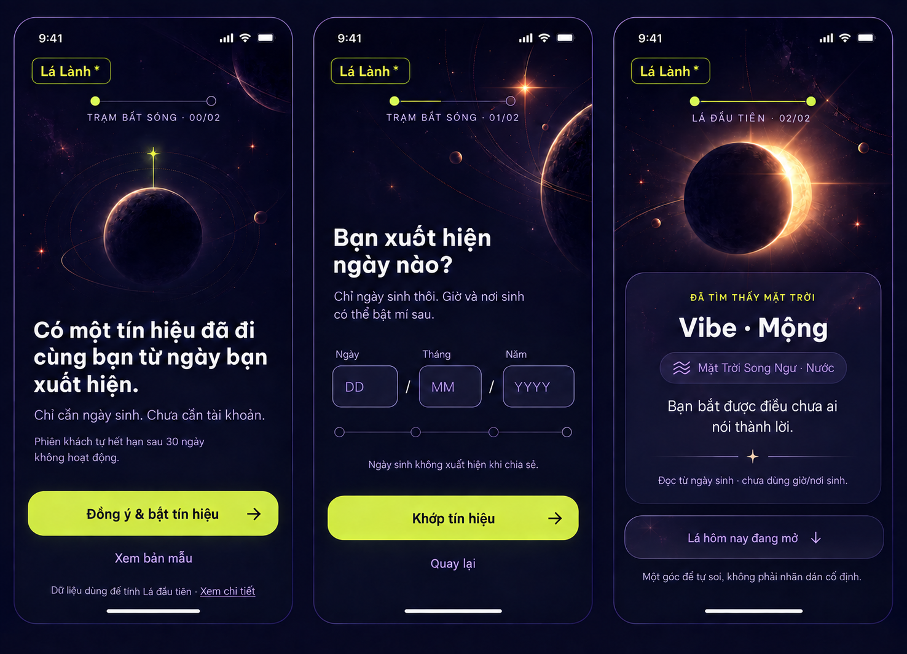
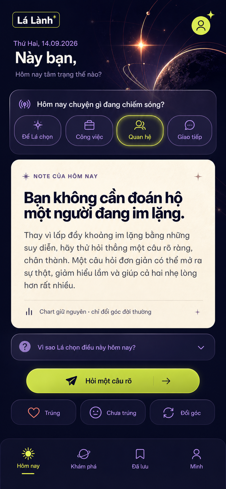
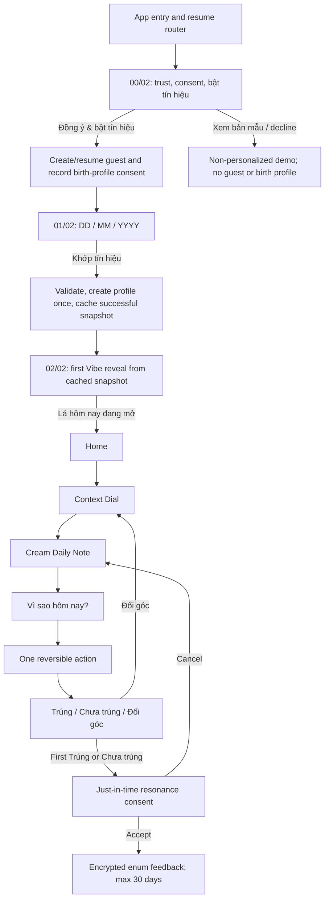

# Signal Note Experience — selected references

Status: **canonical design direction for US-01–US-03 as of 2026-09-14**. The resolved implementation authority is `docs/plans/2026-09-14-2047-feat-signal-note-experience-plan.md`. These boards are review references, not runtime UI assets.

## Reference boards

### Onboarding — Trạm Bắt Sóng

Source capture: 1476×1065 PNG. It shows the three connected app states `00/02 → 01/02 → 02/02`.

### Home — Personal Signal Daily Note

Source capture: 853×1844 PNG. It fixes the content hierarchy and interaction order; it is not a literal copy deck or a substitute for responsive implementation.

## Canonical journey

- The first personalized reveal needs exactly two affirmative decisions: consent, then DOB submit. There is no carousel, feature tour, account wall, second compute screen, or artificial minimum wait.
- Existing routes may remain for resume, Back and deep links, but all three acts use one station shell and one state vocabulary. `/welcome` and `/consent` must not become two separate affirmative screens.
- The reveal reuses the snapshot returned by the successful create. Refresh/retry resumes the saved onboarding state and must not create or fetch a duplicate profile.
- The reveal-to-Home control is a real primary transition, visually quieter than the Vibe. Optional Birth Card creation remains outside the required onboarding path.

## Screen hierarchy

### `00/02` — invitation and consent

1. Brand.
2. Station progress `TRẠM BẮT SÓNG · 00/02`.
3. Atmospheric celestial art.
4. One trust thesis: only DOB is needed; no account is needed.
5. Retention/control summary: guest data expires after at most 30 inactive days; the user can decline and delete.
6. Primary `Đồng ý & bật tín hiệu`.
7. Secondary `Xem bản mẫu`.
8. Quiet privacy-detail link; opening/closing it does not imply consent.

Consent is recorded before any DOB input or request. Declining opens a clearly labelled, fixed demo and creates no guest, birth profile or personalized event.

### `01/02` — DOB tuning

1. Brand and progress `TRẠM BẮT SÓNG · 01/02`.
2. Headline and date-only limitation.
3. Semantic composite field `DD / MM / YYYY`.
4. Quiet privacy assurance.
5. Primary `Khớp tín hiệu`; Back is secondary.

Validation is strict calendar validation: complete DD/MM/YYYY, real date, not future, user at least 18, and no more than 120 years ago. The server is the date authority. DOB stays in form memory until submitted through a private body and never enters a URL, history, browser persistence, logs, analytics or public artifacts.

### `02/02` — first Vibe reveal

1. Brand and progress `LÁ ĐẦU TIÊN · 02/02`.
2. Reduced-motion-safe eclipse reveal.
3. `Vibe · <3–5 chữ>`.
4. Factual Sun/element provenance and date-only limitation; cusp uncertainty is shown, never guessed.
5. One short, non-deterministic interpretation.
6. Primary transition `Lá hôm nay đang mở` to Home.
7. Adjacent disclaimer: `Một góc để tự soi, không phải chỉ dẫn cố định.`

### Home — Personal Signal

At 390×844 the first scan must read in this order:

1. Date and greeting.
2. Context Dial: bốn góc scan nhanh `Để Lá chọn`, `Công việc`, `Quan hệ`, `Giao tiếp`; disclosure `Thêm 2 góc` mở `Năng lượng` và `Chăm mình` mà không làm rối lần nhìn đầu.
3. Dominant opaque cream Note: one thesis, short body, and quiet boundary `Chart giữ nguyên · chỉ đổi góc đời thường`.
4. Collapsed `Vì sao hôm nay?` disclosure with evidence, precision and version provenance.
5. One acid-lime, reversible micro-action.
6. Feedback: `Trúng`, `Chưa trúng`, `Đổi góc`.
7. Secondary Mood section, then bottom navigation `Hôm nay / Khám phá / Đã lưu / Mình`.

Cream paper is reserved for the interpretation. Smoky-lilac glass is for context, disclosure, feedback and navigation. Acid lime is reserved for the current selection and single primary action. Be Vietnam Pro is the only product typeface. Atmospheric raster art stays behind content; the screenshots themselves are never shipped as interface images.

## Context and feedback boundary

- Context allowlist: `auto`, `work`, `relationships`, `communication`, `energy`, `self_care`. It travels only in a private POST body and is not inferred from profile/history.
- Changing context may change only the everyday manifestation and micro-action. Chart snapshot, selected factors, evidence references, hero factors, precision and confidence remain byte-for-byte/semantically invariant under their defined contracts.
- The current choice is component-memory state by default. No implicit preference is written to localStorage, Capacitor Preferences, analytics, URL or public/share payloads. A reproducible server reading revision may retain the lens only when owner-scoped, versioned and encrypted.
- `Trúng` and `Chưa trúng` require first-use disclosure and affirmative consent purpose/version `reading-resonance-v1`. Only the enum, lens, note/revision identity and server timestamps are allowed; there is no free text.
- Feedback writes are owner-bound, CSRF/trusted-origin protected and idempotent per note/revision. Values are encrypted at rest and expire within 30 days. They are not a vote that astrology is true and are not used for diagnosis, inferred traits, ranking or hidden adaptation in this release.
- `Đổi góc` stores nothing and needs no consent. It focuses/opens the Context Dial; cancelling keeps the existing note.
- `Mình` shows personalization status. `Reset feedback` deletes feedback but retains consent; `Tắt phản hồi` deletes feedback and revokes consent. Whole-guest deletion cascades through consent, birth/profile, readings, feedback, saves/shares and device caches.

## Acceptance and release gates

- Visual: verify 320/390/430px, 200% text, Vietnamese diacritics, safe areas, 44×44 CSS px targets, visible focus, screen-reader names, Reduce Motion/transparency, and no clipped action/navigation.
- Interaction: every visible primary/navigation control reaches a working surface; loading, selected/pressed, success, error, disabled, offline, retry and resume states are defined.
- Trust: representative users can distinguish fixed chart evidence from context-dependent framing and explain why today’s Note is relevant.
- Privacy/security: inspect network requests, URLs/history, logs, crash reports, analytics fixtures, caches and public/share payloads for DOB, token, context, feedback and private prose. Private responses are `no-store`; mutations prove owner, CSRF/trusted Origin, enum-only validation, idempotency and deletion cascade.
- App first: `apps/web` is the shared UI source, but Capacitor iOS/Android are the release product. Web is QA only. A release requires final web assets synced into both native shells plus real iOS Simulator and Android build/runtime smoke of onboarding, private context, feedback/reset, offline-resume, lifecycle, keyboard and safe areas. An unavailable native toolchain is a release **No-Go**, not a web pass.
- Store/legal: reconcile runtime behavior with the iOS Privacy Manifest/App Privacy and Android Data Safety declarations. Treat resonance as linked product interaction for app functionality/personalization, not tracking. Qualified Vietnamese legal review remains required for impact-assessment and cross-border-processing obligations.

## Official references

- [Vietnam Personal Data Protection Law 91/2025/QH15](https://vanban.chinhphu.vn/?docid=214590&pageid=27160) — effective 2026-01-01.
- [Decree 356/2025/NĐ-CP implementing the law](https://vanban.chinhphu.vn/default.aspx?docid=216387&pageid=27160) — effective 2026-01-01.
- [OWASP MASVS](https://mas.owasp.org/MASVS/) — mobile storage, cryptography, network, platform and privacy verification baseline.
- [Apple: User Privacy and Data Use](https://developer.apple.com/app-store/user-privacy-and-data-use/).
- [Apple: Describing data use in privacy manifests](https://developer.apple.com/documentation/bundleresources/describing-data-use-in-privacy-manifests).
- [Capacitor Preferences](https://capacitorjs.com/docs/apis/preferences) — unencrypted key/value persistence and therefore not an approved store for DOB, context preference or feedback history.
