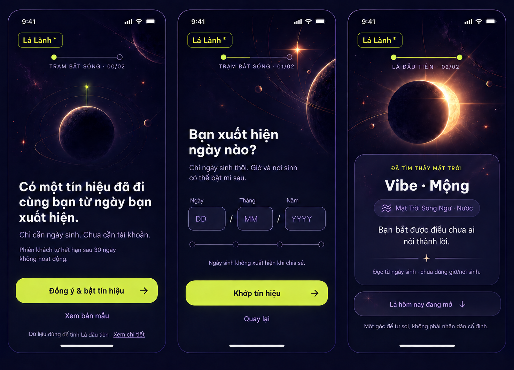

# Trạm Bắt Sóng — static review checkpoint

Integrated authority: [`../signal-note-2026-09-14/README.md`](../signal-note-2026-09-14/README.md). The 2026-09-14 direction preserves this visual choice and resolves its interaction contract with the selected Daily Note reference.

## Selected direction

- Visual authority: Cosmic Glass Signal.
- Product metaphor: Trạm Bắt Sóng.
- Reveal treatment: Nhật Thực Hé Mở.
- Release surface: iOS/Android app through Capacitor; web is the QA surface.
- Typeface: Be Vietnam Pro only.

## Review board

The board shows three key states at app proportions:

1. Invitation and affirmative birth-data consent before any DOB field appears.
2. Semantic DD/MM/YYYY tuning after consent.
3. The after-reveal state, where the opened Vibe flows into Home without another required decision.

## Interaction notes

- The journey has exactly two affirmative decisions before the personalized reveal: `Đồng ý & bật tín hiệu`, then `Khớp tín hiệu`. `/welcome` and `/consent` may remain resume-capable routes but must render one `00/02` consent act, not a carousel or an extra decision.
- Successful DOB create supplies and caches the reveal snapshot. There is no artificial minimum wait, duplicate fetch, duplicate loading phase or profile creation on refresh/retry.
- The pre-reveal treatment may conceal the Vibe with the eclipse. Tap and haptic are optional enhancements; content cannot depend on drag.
- Reduce Motion replaces orbit travel and eclipse movement with a short fade or an immediate state change.
- The thin `Lá hôm nay đang mở` strip is the single real reveal-to-Home transition. It remains visually quieter than the Vibe and does not count as a pre-reveal decision.
- Privacy detail and demo remain separate neutral surfaces; they do not inherit playful consent mechanics.
- Optional Birth Card creation stays outside the required onboarding path.

## QA result

- Pass: selected palette, one-font hierarchy, restrained lime, warm star highlight and glass depth match Cosmic Glass Signal.
- Pass: each state has one clear decision and materially more negative space than the previous onboarding.
- Pass: consent copy remains visible and direct; DOB is absent before consent.
- Pass: the revealed state has one functional transition to Home and no competing CTA.
- Implementation check: validate all text at 200% scale and do not copy the rendered board as a runtime image.
- App-first gate: web is the shared QA source, but release requires synced assets and runtime smoke in both Capacitor iOS and Android; a missing native toolchain is a release No-Go.
