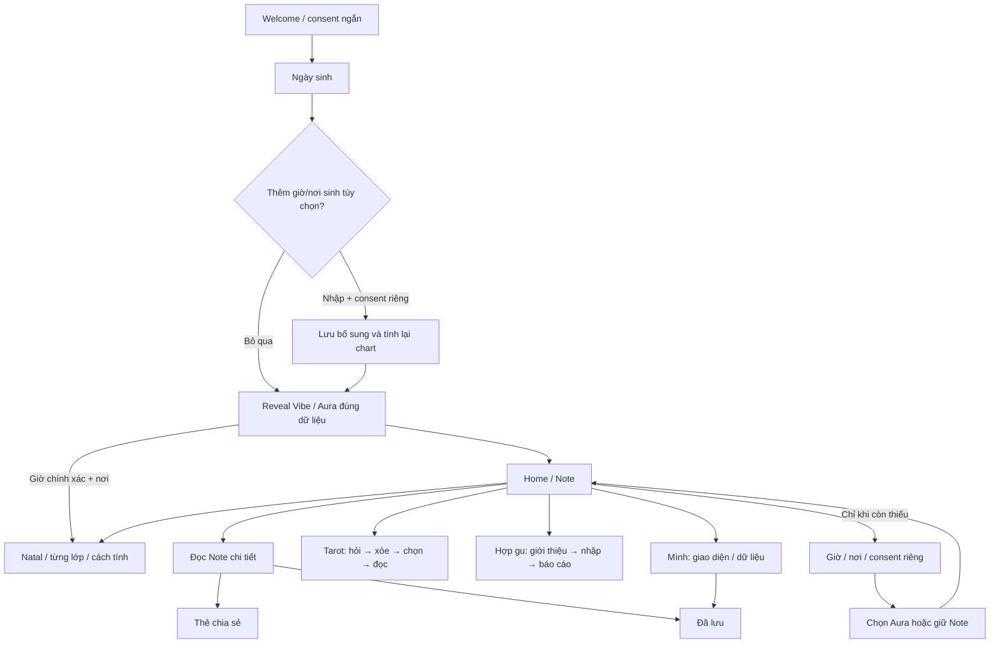

# Ultraviolet Paper — hướng UI được chọn, 06/10/2026

## Material refinement 07/10/2026

Người dùng chọn tăng chiều sâu tím như **bề mặt hành tinh, thật subtle**: vân khoáng và vùng lõm mềm, ánh sáng một phía, không background sao/animation. Giữ nền kem, card tím và lime, cùng typography/layout đã chọn. Texture version mới dùng trên các violet focus card, không phủ form hoặc toàn màn. Onboarding được mở rộng bằng một disclosure tùy chọn giờ/nơi sinh, không thêm bước bắt buộc. [Contract chi tiết](../../plans/2026-10-07-optional-birth-details-planet-surface.md).

## Quyết định và phạm vi

Nguồn chuẩn là `reference.png`, ảnh Home người dùng đính kèm ở yêu cầu hiện tại. Tiếp tục bố cục này trên các màn khách hàng đang có trong router; không mở thêm một vòng chọn concept, không tự deploy. Hướng này thay thế Cosmic Glass về **trình bày**, không thay AC nghiệp vụ, độ chính xác chart hoặc consent trong US-01…19.

Sản phẩm chính vẫn là app. Lần này sửa bản web mobile-first hiện có để review ở 390 × 844; không phải một bản build native iOS/Android mới.

## Quy tắc dùng lại

| Thành phần | Quy tắc |
|---|---|
| Nền | Kem `#f7f4eb`; không ảnh vũ trụ phủ toàn màn |
| Vùng trọng tâm | Một card giấy tím `#4b278f`, chữ kem `#fff9e9`; texture raster dùng lại |
| Hành động | Lime `#dfff4f` với chữ tím đậm; không chữ lime trên nền kem |
| Chữ | Be Vietnam Pro duy nhất; body 16px, helper 13px, tiêu đề trang 30px, tiêu đề Note 28px |
| Form | Nhãn đọc rõ, input sáng, nhóm trường theo nhiệm vụ; không xếp nhiều card trang trí |
| Bản đọc | Tóm tắt nổi bật; phần dài trên giấy sáng; bằng chứng mở theo yêu cầu; disclaimer có vùng riêng |
| Minh họa | Nhỏ, hỗ trợ điều hướng; không đặt chữ hoặc form vào ảnh |
| CTA | Một hành động chính; lựa chọn giọng đọc nằm trong disclosure, không chiếm toàn form |
| Màu tối | Giữ toggle trong Mình và lựa chọn đã lưu; mặc định sáng với người mới |
| Home | Note trước; cảm xúc bằng icon; Đọc thêm + thumbs + share trong card; hai lối Tarot/Radar |

CSS mới được import **sau global.css trong main.tsx**. Không chuyển nó về AppShell: thứ tự cũ làm CSS Cosmic Glass ghi đè card chia sẻ. Các override chỉ áp dụng trong `.ultraviolet-app`; CMS là workspace riêng. Bottom sheet dùng chung cũng nhận cùng token.

Không được cắt phần cuối câu bằng fixed-height/absolute-position để ép card ngắn. Khi nội dung dài, card phải tăng chiều cao; ảnh chia sẻ tự co chữ theo toàn bộ nội dung.

## Màn hình hiện có và thay đổi

“Dùng hệ chung” không có nghĩa mọi trạng thái dữ liệu đã được kiểm thử thủ công. Xem báo cáo QA đi kèm để biết các nhánh đã chạy.

| Màn / trạng thái | Route | Trọng tâm và hành động |
|---|---|---|
| Điểm vào | `/` | Nối phiên hiện tại hoặc đi Welcome; không thêm màn |
| Bắt đầu / consent ngắn | `/welcome`, `/consent` | Minh họa nhỏ, tiến độ, một CTA bắt đầu; xem mẫu/quyền riêng tư là phụ |
| Chi tiết dữ liệu | `/privacy` | Danh sách giải thích dễ đọc, giữ đầy đủ quyền và nơi xử lý dữ liệu |
| Bản mẫu | `/demo` | Giữ mẫu không cần nhập dữ liệu; Note tím, nhãn riêng không đè chữ; link quyền riêng tư mở `/privacy` |
| Nhập ngày sinh | `/birth` | Ngày/tháng/năm bắt buộc; disclosure giờ/nơi sinh tùy chọn, consent riêng, có Bỏ qua |
| Reveal lớp đầu | `/reveal` | Vibe/Aura theo dữ liệu thật; mở Note và tổng quan nếu có chart chính xác |
| Mở lớp cá nhân | `/birth-time` — prompt | Lợi ích và quyền chọn “Để sau” |
| Giờ sinh | `/birth-time` — time | Hai select giờ/phút; giữ nhánh gần đúng/không rõ; không tự điền phút |
| Nơi sinh | `/birth-time` — place | Tìm tỉnh/thành, danh mục 34 đơn vị, chọn địa điểm rõ ràng |
| Kiểm tra và consent | `/birth-time` — review/success | Xem lại dữ liệu, consent riêng không tích sẵn, tính chart |
| Chọn lớp mới | `/aura-cutover`, `/reveal/aura` | Giữ quyền dùng Aura hay giữ Note; receipt là nhóm phụ |
| Home | `/home` | Một Note tím, lời nhắc riêng, feedback/share, hai lối Tarot/Radar; đổi góc qua moon, Natal/Sky nằm trong Khám phá |
| Note chi tiết | `/note/today` | Bản đọc có cấp độ, thử nghiệm hành vi, bằng chứng/disclaimer tách riêng |
| Bản đồ / Natal | `/insights`, `/natal` | Tóm tắt tím, danh sách từng lớp; bỏ nhãn domain tiếng Anh dư thừa |
| Đọc từng lớp / tổng hòa | `/insights/:claimId`, gồm `/insights/synthesis` | Summary tím, phần dài sáng; dữ liệu kỹ thuật mở theo yêu cầu |
| Cài đặt chart | `/insights/settings` | Hệ nhà/ayanamsa theo hệ; selected tím, CTA áp dụng lime |
| Bầu trời hiện tại | `/insights/current-sky` | Bảng hành tinh rõ, nhãn Việt, giờ quan sát và quay lại |
| Hỏi Tarot | `/tarot` | Câu hỏi đầu tiên, chủ đề phụ, một control 1/3/5 lá và CTA xòe |
| Xòe/chọn bài | `/tarot/:sessionId` — drawing | Tiến độ số lá, các vị trí, bộ bài ngang; card tím |
| Kết quả Tarot | `/tarot/:sessionId` — reading | Lá riêng nhỏ hơn, vị trí/ý nghĩa/câu hỏi rõ cấp độ; không font khổng lồ |
| Giới thiệu Hợp gu | `/radar`, alias `/vong-la` | Minh họa đôi, một hero tím, lợi ích và CTA check; tiến độ chỉ xuất hiện khi bắt đầu form |
| Check riêng / lịch sử | `/radar/start` | Thông tin người quen, giờ có/không rõ, địa điểm, consent; giọng đọc mở khi cần |
| Tạo lời mời | `/radar/invite`, alias `/vong-la/setup` | Nhập tên/context, giọng đọc phụ, tạo link và theo dõi |
| Người nhận lời mời | `/radar/i/:token` | Shell cùng hệ; giữ giới hạn token, tự nhập và đồng ý riêng |
| Nối chart của người nhận | `/radar/continue` | Kiểm tra điều kiện/consent, không bỏ gate dữ liệu |
| Kết quả người nhận | `/radar/receipt` | Bản đọc và quyền kiểm soát kết quả |
| Báo cáo Hợp gu | `/radar/result/:requestId` | Signature tím, ba chỉ báo, mục lục và các chương mở rộng |
| Tạo thẻ Note | `/card` | Preview tím, chọn tỷ lệ, share/link/download; bỏ absolute text chồng nhau |
| Thẻ khai sinh | `/birth-card` | Preview dùng palette chung; giữ hành vi xuất hiện có |
| Xem thẻ công khai | `/share/:token` | Không thêm dữ liệu sinh; dùng cùng hierarchy và token |
| Note đã lưu | `/saved` | Một danh sách có separator, mở đúng revision và bỏ lưu/hoàn tác |
| Mình | `/profile` | Thông tin lớp, giao diện sáng/tối, **lối vào Đã lưu**, quản lý dữ liệu/phản hồi |
| Đăng nhập đúng lúc — placeholder hiện tại | `/existing-user` | Không ép đăng nhập; chỉ cập nhật trình bày, không tuyên bố auth đã hoàn thiện |
| Dữ liệu Lá Chứng cũ | `/la-chung/history`, `/la-chung/result/:requestId`, `/la-chung/manage-response` | Nhận hệ chung; giữ quản lý/rút quyền cũ, không kích hoạt thu thập mới |
| Lá Chứng đã dừng | `/la-chung/*`, `/la-chung/i/:token` | Thông báo sáng, lối quản lý quyền cũ; không hồi sinh tính năng |
| Lỗi route / dữ liệu chưa có | Error boundary + trạng thái từng màn | Shell sáng, tiêu đề dễ đọc, đường quay lại/thử lại |
| CMS | `/studio` | **Ngoài redesign khách hàng**, vẫn là workspace riêng |

Vòng ghép người lạ, chat, mutual pool không được mở lại. Các component matching tồn tại trong code không đồng nghĩa đã có route khách hàng hoạt động.

## Minh họa và nguồn

Ba asset ImageGen dùng ảnh reference thật làm nguồn phong cách, không phải ba concept UI mới. Prompt chung: tài sản minh họa độc lập, trong suốt, cream/violet/lime, không chữ, không thiết bị, không UI.

- Moon — 512 × 512 target: “ivory-to-violet cratered moon, thin lime orbit and one lime star; warm paper/violet editorial app style”.
- Tarot — 640 × 480 target: “three fanned deep-violet tarot backs, restrained cream/gold star and moon motifs”.
- Pair — 640 × 480 target: “ivory front-left and violet back-right planets, thin violet orbit and a small lime star”.

Original PNG nằm cạnh tài liệu (`*-source.png`). Runtime dùng WebP 480px với alpha: moon 23,222B, tarot 24,846B, pair 16,620B — tổng khoảng 65KB; không đưa 3MB PNG vào bản web.

## Luồng cập nhật 07/10/2026

QA và ảnh màn hình: `../../reviews/ultraviolet-paper-2026-10-06/README.md`.

QA của phần bổ sung và chất liệu mới: [07/10/2026](../../reviews/optional-birth-planet-2026-10-07/README.md). Feedback màu được sửa: nền tím `#4c2e8e` lấy từ reference, texture phủ riêng opacity 0.09 và `luminosity`, không dùng soft-light làm cả card tối/ngả xanh. Không dùng ảnh thô làm nền chữ. Không ghi đè nguồn đã chọn bằng screenshot runtime.
