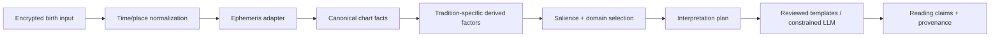

# Lá Lành — Astrology Calculation & Interpretation Engine Specification

> Status: implementation contract v1.0-draft · Updated: 2026-09-04  
> Owner: Astro Engine + Content Platform · Consumers: US-02/03/07/12–18  
> Principle: **Engine calculates facts; Rules rank evidence; Content verbalizes. An LLM never calculates a chart.**

## 1. Purpose

This document replaces scattered Sun/Moon-centric calculation assumptions with one versioned source of truth for:

- Western Tropical and Vedic/Jyotish Sidereal chart computation;
- natal, transit, transit×natal, synastry and composite chart facts;
- optional Jyotish D1/D9, nakshatra and Vimshottari data contracts;
- uncertainty caused by missing/approximate birth time or place;
- factor derivation, salience ranking, synthesis and sentence-level provenance;
- accuracy, security, privacy, licensing, observability and release gates.

Astrology is offered as a reflective/entertainment framework, not scientifically validated prediction. The engine must never produce medical, legal, financial, safety-critical or deterministic claims.

## 2. Product language and the two switches

The product must not call this one generic “chart type” switch. There are two independent concepts.

### 2.1. Switch A — Hệ đọc (reading tradition)

| Preset | Product label | Astronomical basis | Interpretation semantics |
|---|---|---|---|
| `western_tropical_v1` | Western | Tropical zodiac | Western aspects, planets including outer planets, Western rulership/element/modality layers |
| `jyotish_sidereal_lahiri_v1` | Jyotish | Sidereal zodiac, Lahiri ayanāṁśa | Classical grahas + Rahu/Ketu, Rāśi/bhava, nakshatra and graha drishti; outer planets optional modern overlay |

Each preset creates its own immutable snapshot. Switching does not mutate birth data and must never relabel tropical longitudes as sidereal signs.

### 2.2. Switch B — Cách tính (calculation mode)

- `recommended`: locks the versioned product preset and is the default.
- `custom`: exposes only supported combinations, reviews their impact and creates a new config hash/snapshot.

Custom settings:

| Setting | Western | Jyotish | Rule |
|---|---|---|---|
| Zodiac | Tropical, locked | Sidereal, locked | Hybrid is out of launch scope. |
| Ayanāṁśa | N/A | Lahiri default; Raman/Krishnamurti advanced | Always recorded as ID + computed value. |
| House/bhava | Whole Sign default; Placidus/Equal custom | Whole-sign Rāśi default | Placidus requires exact time/place and may fail at high latitude. |
| Lunar nodes | True default; Mean optional | True default; Mean optional | `true` là preset v1 đã chốt; Rahu/Ketu đối đỉnh; provenance states mode. |
| Aspect model | Western ecliptic aspects | Classical graha drishti | No silent mixing. |
| Outer planets | Core on | Classical core off; `modern_overlay` optional | Overlay cannot change classical Jyotish core score. |
| Center | Geocentric | Geocentric | Topocentric is research-only. |

## 3. Source-of-truth boundaries



| Layer | May do | Must not do |
|---|---|---|
| Input/Profile | Collect/normalize consented birth data | Calculate placements in clients |
| Ephemeris adapter | Time scales, positions, speeds, houses | Write interpretations |
| Derived factors | Aspects/drishti, dignity, patterns, uncertainty | Call LLM or infer missing birth facts |
| Ranking | Select non-redundant salient evidence | Change astronomical facts |
| Content | Verbalize supplied interpretation plan | Invent placements, scores, dates or provenance |
| Client | Render returned facts/settings/readings | Recalculate, upgrade precision or blend traditions |

## 4. Supported chart products

| Chart | ID | Required input | Launch use | Precision gate |
|---|---|---|---|---|
| Natal | `natal` | Birth date; time/place optional | US-02/03/07 | Scope degrades with uncertainty |
| Transit snapshot | `transit` | Exact evaluation instant | Daily/global sky | No user birth data |
| Transit × Natal | `transit_natal` | Natal snapshot + instant | US-03/07 | Houses require exact time/place |
| Synastry | `synastry` | Two natal snapshots same tradition/config family | US-12–17 | No cross-tradition comparison by default |
| Midpoint composite | `composite_midpoint` | Two exact-enough natal charts | US-13/future | Exact time strongly required; no houses when unsupported |
| Davison relationship | `davison` | Two exact birth instants/places | Future | Feature flag, expert review |
| D1 Rāśi | `jyotish_d1` | Jyotish natal | US-07 | Same as natal |
| D9 Navāṁśa | `jyotish_d9` | Exact-enough birth instant | Future deep layer | Locked for approximate/unknown time |
| Vimshottari | `jyotish_vimshottari` | Stable Moon sidereal longitude/nakshatra | Future timeline | No output if Moon interval crosses boundary |

Progressions, solar returns, horary and electional charts are out of scope until separately specified and expert-reviewed.

## 5. Input contract and normalization

### 5.1. Canonical input

```json
{
  "birth_input_version": "uuid",
  "local_date": "1998-07-12",
  "time_mode": "exact|approx_window|unknown",
  "local_time": "08:15",
  "approx_window": {"start": "06:00", "end": "11:59", "version": "vn-v1"},
  "place_ref": "opaque-private-id",
  "timezone_id": "Asia/Ho_Chi_Minh",
  "latitude": 10.7769,
  "longitude": 106.7009,
  "geo_confidence": "high",
  "calendar": "gregorian"
}
```

Raw date/time/place/coordinates are encrypted, never supplied by public client URLs and never sent to content/LLM providers.

### 5.2. Validation

- Date must be a real supported calendar date, not future, and inside product age policy/ephemeris range.
- Exact time is strict `HH:mm[:ss]`; `00:00` valid. Never interpret blank time as noon.
- Timezone is an IANA TZ identifier pinned to `tzdb_version`; UTC offset alone is insufficient for historical computation.
- Place coordinates are server-derived, WGS84, longitude east-positive, latitude north-positive; validate ranges and geocoder confidence.
- Historical DST fold/gap must resolve deterministically with stored `offset_seconds`, `resolution_method` and user review when ambiguous.
- Calendar conversion, leap seconds, UT/TT/Delta-T policy and ephemeris flags are recorded.

### 5.3. Precision classes

| Class | Meaning | Allowed outputs |
|---|---|---|
| `date_only` | Local birth date only | Stable sign placements across a defined uncertainty interval; no angles/houses |
| `time_window` | Date + approximate range, optionally place | Only placements/factors stable across sampled interval; houses/angles normally withheld |
| `exact_time_no_place` | Exact clock but no historical zone/place | No houses/angles; do not pretend UTC known |
| `exact_time_place` | Date/time/place/timezone resolved | Full eligible chart |

The old assumption “DOB is enough for exact Venus/Mars” is unsafe near ingress/retrograde boundaries. If birthplace/timezone is known, date-only uses that zone's full civil-day UTC interval. If timezone is absent, use the conservative global envelope from `D 00:00 at UTC+14` (`D-1 10:00Z`) through `D 23:59:59 at UTC−12` (`D+1 11:59:59Z`). Never assume server/device timezone. Publish only facts proven stable over the selected interval and record `uncertainty_zone_policy`.

## 6. Astronomical computation pipeline

1. Load normalized private input and requested `CalculationConfig`.
2. Convert local civil time/window to one or more UTC instants with pinned IANA tzdb.
3. Convert to Julian day UT; ephemeris computes required TT/ET with its versioned Delta-T model.
4. Compute geocentric apparent ecliptic longitude/latitude, distance and speed for supported bodies using explicit flags.
5. For sidereal, call/set explicit ayanāṁśa before sidereal body and house calculations; never rely on library default.
6. Compute angles/cusps only with eligible exact time/place and supported house algorithm.
7. Normalize longitude to `[0,360)`; derive sign/rāśi and degree-within-sign.
8. Compute motion state, nodes, aspects/drishti and tradition-specific factors.
9. For uncertain input, repeat across interval samples and aggregate stability/confidence.
10. Validate invariants, serialize immutable snapshot, then atomically activate it.

### 6.1. Bodies and points

Canonical body facts include Sun, Moon, Mercury, Venus, Mars, Jupiter, Saturn, Uranus, Neptune, Pluto, True/Mean North Node and South Node; optional Chiron only behind a separate config. Angles: Ascendant, MC, Descendant, IC; optional Vertex is display-only. Jyotish classical core uses Sun, Moon, Mars, Mercury, Jupiter, Venus, Saturn, Rahu and Ketu.

Every body output includes longitude, latitude, distance, longitudinal speed, sign/rāśi, degree, motion (`direct/retrograde/stationary`), and uncertainty range/stability when applicable.

### 6.2. Houses

- Whole Sign: house 1 is the entire sign containing the Ascendant; subsequent signs map sequentially. Do not describe it as “divide equally from Ascendant degree”.
- Equal: 30° cusps from exact Ascendant degree.
- Placidus: library calculation; failure/polar fallback is surfaced as a typed error. Porphyry fallback from a library must never be accepted silently.
- A planet-on-cusp policy and epsilon must be centralized/versioned; default half-open intervals `[cusp_n,cusp_n+1)` after normalization.
- House placements are recomputed per house system and stored under that config only.

## 7. Tradition-specific factor models

### 7.1. Western Tropical v1

Derived factors:

- sign + house placement for all core planets;
- conjunction, opposition, square, trine, sextile; optional quincunx behind config;
- applying/separating, exactness/orb and aspect phase;
- angularity and proximity to ASC/MC/DSC/IC;
- chart ruler and dispositor chain (versioned rulership table);
- element and modality distribution weighted by body class, never a raw count only;
- retrograde/station emphasis;
- aspect patterns such as T-square/grand trine only with explicit detection tests;
- dignities only as an optional reviewed layer; no value judgement.

Orb rules are centralized by aspect × body class × use case. The engine always emits exact angular separation and orb; rules decide eligibility. Recommended v1 maximum orbs are product conventions, versioned and expert-reviewable:

| Use case | Conjunction/opposition | Square/trine | Sextile | Note |
|---|---:|---:|---:|---|
| Natal, Sun/Moon involved | 8° | 7° | 5° | Wider luminary allowance |
| Natal, other planets | 6° | 6° | 4° | Outer planets do not receive wider orb by default |
| Transit to natal, Moon | 3° | 3° | 2° | “Today” timing also records exact crossing |
| Transit to natal, Mercury–Mars | 2.5° | 2.5° | 2° | Medium-cycle layer |
| Transit to natal, Jupiter–Pluto | 2° | 2° | 1.5° | Multi-pass windows required |
| Synastry | 5° | 4° | 3° | Score uses continuous orb strength, not binary eligibility only |

Let `separation = min(abs(a-b), 360-abs(a-b))`; then `orb = abs(separation - exact_angle)`. Aspect strength defaults to a monotonic curve from 1 at exact to 0 at max orb; the exact curve is config-versioned. Applying/separating compares deviation at `t` with a short forward recompute at `t+Δt` using actual speeds; it must not be guessed from body labels. Regression fixtures cover 0°/360°, exact hits and stations.

### 7.2. Jyotish Sidereal v1

Classical core:

- D1 Rāśi placements using explicit Lahiri ayanāṁśa by default;
- Lagna and whole-sign bhava when exact time/place are eligible;
- 27 nakshatras and 4 padas from sidereal longitude; boundary uncertainty can withhold output;
- sign lordship/dispositor and classical dignity tables, versioned;
- classical graha drishti v1 is sign-distance based: every graha fully aspects the 7th sign from its occupied Rāśi; Mars additionally aspects 4th/8th, Jupiter 5th/9th, Saturn 3rd/10th. Count the occupied sign as 1, normalize modulo 12, and emit source/target sign and affected graha/bhava. Degree-strength variants are excluded from v1 pending domain-expert approval;
- Rahu/Ketu mode/version explicit; node special aspects are excluded from v1 unless separately expert-approved;
- D9/Navāṁśa fact generation behind exact-time and feature gates;
- Vimshottari dasha contract from Moon nakshatra behind content/expert gate.

Do not import Western ecliptic aspect orbs, outer-planet rulership or Western dignity weights into classical core. If `modern_overlay=true`, store those factors in a distinct namespace and never let them silently alter classical ranking.

### 7.3. Deterministic formulas and boundary rules

- Tropical sign index: `floor(normalize(longitude)/30)`.
- Sidereal longitude: `normalize(tropical_longitude - explicit_ayanamsha_at_instant)`. Production uses the library sidereal flag; this equation is an invariant check.
- Motion: direct/retrograde from signed longitude speed; `stationary` uses per-body threshold + minimum duration in versioned `MotionConfig`, not one global epsilon.
- Nakshatra: 27 half-open spans of `13°20′`; pada: four half-open subdivisions of `3°20′`. A value exactly on a boundary belongs to the new interval after normalization.
- Navāṁśa D9: divide every Rāśi into nine `3°20′` parts. Start from the same sign for movable Rāśi, the 9th sign for fixed Rāśi and the 5th sign for dual Rāśi; advance one sign per part. Golden tests cover all 108 cells.
- Vimshottari order/year weights: Ketu 7, Venus 20, Sun 6, Moon 10, Mars 7, Rahu 18, Jupiter 16, Saturn 19, Mercury 17, total 120. Starting lord follows Moon nakshatra; remaining first period is proportional to the untraversed fraction. Calendar/year-length and sub-period rounding conventions must be versioned before UI launch.
- Rahu/Ketu invariant: Ketu longitude equals normalized Rahu longitude +180° under the same True/Mean Node mode.

All classifications use integer/decimal-safe boundary helpers. Display rounding happens after classification, never before.

## 8. Transit engine

### 8.1. Facts

Transit snapshot is calculated for an exact UTC instant and can be reused globally only for identical config/instant bucket. User impact joins it to the natal snapshot:

- transit body sign/rāśi, speed and station state;
- transit-to-natal body/angle aspect or Jyotish transit semantics;
- transit house/bhava only when natal angles are eligible;
- applying/exact/separating and exact-hit times;
- ingress, station and retrograde multi-pass windows;
- start/peak/end based on actual orb crossings, not template guesses.

### 8.2. Ranking

Priority uses a versioned function, not “smallest orb wins”:

`salience = exactness × body_weight × natal_target_weight × angularity × repetition × duration_relevance × domain_relevance × confidence`

Normalize scores within a chart/use case. Slow transits may rank high for background themes; fast Moon transits may rank for “today” but must not overwrite long-cycle context. Select at most 3 current-sky claims and include at least one longer-cycle factor when eligible.

## 9. Synastry and composite

- Inputs must use compatible tradition/config families; a cross-system comparison is rejected unless a future explicit research mode exists.
- Synastry calculates bidirectional inter-chart facts, including A→B and B→A houses only when both are eligible.
- Compatibility is multidimensional (`communication`, `emotional`, `relating`, `drive`, `growth`, `friction`), not a single astrological truth score.
- Missing data lowers confidence and removes house/angle factors; it must not be filled by Sun-sign tables.
- Midpoint composite handles circular means correctly across 0°; houses require a documented ARMC/obliquity method and golden fixtures.
- Any matching score also includes non-astrological consented product factors separately; astrology score provenance remains inspectable.

Runtime v1 relationship methods:

- Western Synastry uses `synastry-orbs-v2`, emits exactness strength and dimension tags, and calculates A→B/B→A overlays only when both house sets exist.
- Midpoint Composite emits midpoint points plus internal aspects. Composite houses remain withheld.
- Davison `uncorrected_temporal_geographic_midpoint_v1` uses the arithmetic midpoint of both UTC instants and latitude/longitude. Corrected Davison parity is not claimed.
- Jyotish D9/Navāṁśa emits factual positions only and remains ineligible for generated relationship interpretation until expert sign-off.
- The legacy Moon/Venus/Mars scalar helper is non-display/deprecated. New matching work must consume the multidimensional relationship bundle.

## 10. Uncertainty engine

For `date_only` or `time_window`, compute over the allowed UTC interval:

- solve all relevant ingress, nakshatra, aspect, station and retrograde event boundaries using bracketed root-finding over ephemeris functions; endpoints/adaptive samples may optimize discovery but cannot prove absence of a crossing;
- each fact receives `stability_proof=interval|sampled`, `value_set`, min/max longitude, covered sub-intervals and reason codes;
- an uncaveated categorical fact requires `stability_proof=interval`, one value over 100% of the interval and successful boundary solver completion;
- sampled-only results are always `limited` and cannot be promoted to exact/stable even when all samples agree;
- solver timeout/error withholds the affected fact; facts with multiple values are withheld or shown as explicit alternatives, never midpoint truth;
- no Ascendant/house/D9 with unknown time; approximate time can only expose them under a future deliberately designed uncertainty UI.

## 11. Interpretation orchestration

### 11.1. Factor graph

Canonical facts become `DerivedFactor` nodes with domain tags, strength, confidence and evidence references. Higher-order nodes may combine placements/aspects/patterns but must retain child references. Circular or duplicate evidence is deduplicated.

### 11.2. Reading plan

For each requested domain:

1. filter by tradition, use case, precision, safety and content coverage;
2. rank by salience;
3. diversify so one planet/aspect does not dominate every claim;
4. detect reinforcing and tension pairs;
5. produce 1–3 structured claims with `headline_intent`, `evidence_refs`, `confidence`, `allowed_language`, `forbidden_language`;
6. render through reviewed deterministic templates or constrained LLM JSON schema;
7. reject any output containing unverifiable planet/sign/house/date claims.

### 11.3. Aura v2

`Aura` is a compact editorial label, not a chart fact. `aura-v2` may use the top stable cross-domain factors, weighted element/modality and chart ruler, but must:

- be deterministic for chart/config/rules version;
- output one approved 3–5 character Vietnamese label;
- include factor provenance and confidence;
- fall back to `Vibe` when insufficient data;
- never be derived from dominant element alone.

## 12. Core schemas

```json
{
  "schema_version": "astro-chart/v2",
  "snapshot_id": "uuid",
  "birth_input_version": "uuid-private-ref",
  "chart_kind": "natal",
  "tradition": "jyotish_sidereal",
  "calculation_config": {
    "preset": "jyotish_sidereal_lahiri_v1",
    "zodiac": "sidereal",
    "ayanamsha": {"id": "lahiri", "degrees": 24.2},
    "house_system": "whole_sign",
    "node_mode": "true",
    "aspect_model": "jyotish_graha_drishti_v1",
    "outer_planets_layer": false,
    "config_hash": "sha256"
  },
  "time_context": {"utc": "...", "jd_ut": 0, "tzdb_version": "...", "delta_t_model": "..."},
  "precision": {"class": "exact_time_place", "confidence": "high"},
  "bodies": [],
  "angles": {},
  "houses": [],
  "aspects_or_drishti": [],
  "derived_factors": [],
  "provenance": {"engine_version": "...", "ephemeris": "...", "ephemeris_data": "...", "computed_at": "..."}
}
```

```json
{
  "schema_version": "astro-reading/v2",
  "reading_id": "uuid",
  "chart_snapshot_id": "uuid",
  "rules_version": "western-reading-v1",
  "content_version": "vi-VN-v1",
  "domain": "relating",
  "claims": [{
    "claim_id": "opaque",
    "headline": "...",
    "body": "...",
    "factor_refs": ["factor:..."],
    "confidence": "high",
    "confidence_reason_codes": ["EXACT_BIRTH_INPUT", "REINFORCED_FACTORS"]
  }]
}
```

No consumer receives `birth_input_version` resolution rights unless explicitly authorized. Public/share schemas use separate allowlisted DTOs, never these private schemas.

## 13. Versioning, caching and reproducibility

Snapshot identity derives from HMAC/canonical hash of private normalized input version + config + engine/ephemeris/tzdb versions. Never put raw/hashable DOB-place combinations in cache keys visible to operators.

Every release stores a reproducibility manifest: source revision, build/container digest, architecture/runtime, Swiss Ephemeris library + data-file digests, tzdb artifact digest, Delta-T/config/rule bundle digests, schema + canonical serializer version and rounding policy. Required artifacts are retained in access-controlled immutable storage for the product retention horizon. `computed_at`, generated IDs and operational metadata are excluded from canonical-fact equivalence.

- Facts are immutable; a new engine/config/tzdb version creates a new snapshot.
- Active pointer changes atomically after successful compute.
- Content cache key includes snapshot/factor-plan hash, locale, rules/content/safety versions.
- Western/Jyotish caches are isolated namespaces.
- Stored snapshots remain reproducible with provenance; migrations never rewrite facts in place.
- Recompute jobs are idempotent, resumable and bounded; stale results cannot overwrite a newer birth input version.

## 14. Accuracy and verification

### 14.1. Golden corpus

Include at least:

- 100 exact birth fixtures across centuries, hemispheres, longitudes, DST regimes and near-midnight cases;
- sign/house/nakshatra/aspect/cusp boundaries;
- retrograde stations and multi-pass transits;
- high-latitude house failures;
- tropical + Lahiri/Raman/Krishnamurti + True/Mean Node;
- synastry circular longitude and composite 0° crossing;
- date-only/time-window uncertainty fixtures.

### 14.2. Oracles and tolerances

- Primary implementation: licensed Swiss Ephemeris adapter with pinned data/version.
- Independent position check: NASA/JPL Horizons for supported geocentric bodies under aligned frame/time settings.
- Adapter parity check: official Swiss Ephemeris `swetest` with identical flags; this verifies integration but is explicitly **not** an independent oracle.
- Houses and tradition-derived factors: a separately produced, expert-reviewed fixture corpus using documented worked examples and, where licensing permits, a second implementation. The fixture generator cannot import production adapter code; shared-convention disagreements are adjudicated and recorded, not majority-voted.
- Product tolerance target: body longitude difference ≤0.01° and angle/cusp ≤0.05° under identical supported settings; stricter library regression fixtures use machine-level expected values. Any looser exception must be body/date-specific and approved.
- Invariants: Ketu exactly opposite Rahu; longitudes normalized; 12 houses ordered; no aspect references missing body; deterministic repeated result.

Golden expected values are reviewed artifacts, not generated by the function under test in the same test run.

## 15. Performance and reliability SLOs

| Operation | Target |
|---|---|
| Exact natal fact compute p95 | ≤500 ms warmed, ≤2 s cold |
| Dual-preset compute p95 | ≤3 s with progress/resume |
| Transit snapshot | Batch before local content window; deterministic retry |
| Reading retrieval cached p95 | ≤250 ms API |
| Availability | 99.9% monthly is a production SLO after HA deployment/measurement exists; current local MVP cannot clear it |

CPU-heavy work uses bounded workers; no geocoder/LLM call inside ephemeris calculation transaction. Circuit breakers preserve prior active snapshot. Resource limits guard abusive custom recompute.

## 16. Security requirements

- Engine is internal only; clients call authorized product APIs, not arbitrary ephemeris functions.
- Object-level authorization on birth input, snapshot, reading, save and operation; owner from credential, never request body.
- Encrypt raw birth data, coordinates and private chart snapshots at rest; TLS in transit; keys in managed KMS/keystore with rotation.
- No sensitive values in logs, traces, metrics labels, URLs, crash reports, push, clipboard or analytics.
- HMAC private cache keys; tenant/user cache isolation; no sequential IDs.
- Strict input ranges, enums, array size and compute quotas; custom configs allowlisted to prevent resource exhaustion.
- Signed/versioned content/rule bundles; audit changes and prevent unreviewed runtime formula edits.
- LLM receives only minimal derived factor plan, never DOB/time/place/coordinates/name/user ID; validate output schema and fact references.
- Supply-chain scanning, reproducible build evidence and ephemeris file integrity checks are release gates.
- Mobile implementation follows OWASP MASVS storage, crypto, auth, network, platform and privacy controls.

## 17. Privacy and data governance

Birth date/time/place and the derived chart/readings are personal data because they relate to an identifiable user; a chart can also help infer source birth details. Treat derived data with the same access/deletion discipline.

| Data | Purpose | Default retention | Delete/withdraw behavior |
|---|---|---|---|
| Pre-consent draft | Explain/complete current flow | Current session/short secure TTL | Purge on cancel/expiry |
| Raw birth input/place | Compute user-requested charts | While profile active | Delete on user request; invalidate derived access |
| Immutable chart snapshot | Reproducible readings | While needed for active/saved product | Delete/anonymize per policy; no orphan public projection |
| Reading/save | User history | Until unsave/delete/account policy | Remove private projection and caches |
| Operational audit | Security/legal | Minimal fixed period | Pseudonymize; no raw birth data |

- Consent is purpose-specific, informed, affirmative and withdrawable; Western↔Jyotish switch does not require new raw-data collection, but new processing purpose/third party would.
- Data minimization: city-level place; no GPS permission/full address; coordinates private and never shared.
- Export/delete controls must include raw and derived data, cache invalidation and downstream copies.
- Apple App Privacy and Google Play Data Safety declarations must match actual SDK/storage/transmission behavior.
- No chart/reading data for ads, sale, data brokerage or model training without a new lawful basis and explicit product/legal review.
- Public release requires qualified Vietnam privacy/legal review, including impact-assessment and cross-border processing obligations.

## 18. Observability and audit

Allowed metrics: operation latency/status, tradition/preset enum, precision class, safe error code, cache hit, engine version. Prohibited: birth values, coordinates, placements, factor IDs, reading text, token or raw user/profile IDs.

Audit events record actor pseudonymous ID, authorized action, object type, config/version and result; access is restricted and retention-bound. Alert on repeated custom compute, enumeration, cross-owner denial spikes, ephemeris integrity mismatch and deletion failures.

## 19. Failure model

Typed errors include `INPUT_INVALID`, `TIMEZONE_AMBIGUOUS`, `PLACE_CONFIDENCE_LOW`, `INSUFFICIENT_PRECISION`, `UNSUPPORTED_CONFIG`, `HOUSE_CALCULATION_FAILED`, `EPHEMERIS_OUT_OF_RANGE`, `EPHEMERIS_UNAVAILABLE`, `STALE_BIRTH_INPUT`, `CONTENT_FACT_MISMATCH`, `RATE_LIMITED`.

No low-level library path/error or private input appears in client copy. Failure never activates a partial snapshot. Retry is safe through operation/idempotency IDs; prior active snapshot remains readable.

## 20. Acceptance Criteria

- **AE01:** Same canonical input/config/version/reproducibility manifest returns byte-equivalent canonical facts, excluding declared operational fields such as generated IDs and `computed_at`.
- **AE02:** Western and Jyotish produce independent snapshots with explicit zodiac/ayanāṁśa/house/aspect metadata.
- **AE03:** No code path relies on Swiss Ephemeris default sidereal mode; Lahiri is explicit.
- **AE04:** Full eligible chart computes all declared bodies, angles, houses, motion and tradition-specific relations.
- **AE05:** Transit×natal includes real timing/orb/phase and never fabricates houses without eligible natal angles.
- **AE06:** Date-only/time-window publishes only stable factors; no midpoint masquerades as exact.
- **AE07:** Every reading claim references existing factors and versions; hallucinated fact output is rejected.
- **AE08:** Aura v2 uses multi-factor plan with provenance, not dominant element alone.
- **AE09 (US-12/13 activation, not core-launch blocker):** Synastry/composite compatibility, missing-data degradation and circular math have golden tests before either consumer is enabled.
- **AE10:** Recompute is immutable, idempotent, rollback-safe and stale-write protected.
- **AE11:** Independent body-position checks, adapter-parity checks and separately produced expert fixtures meet tolerances and cover boundary/high-latitude/timezone cases; no same-library check is labelled independent.
- **AE12:** Authorization, encryption, redaction, quotas, cache isolation, deletion/export and LLM minimization pass security/privacy tests.
- **AE13:** App/web displays tradition, precision and provenance without exposing source birth data publicly.
- **AE14:** No production/public deployment while ephemeris license or legal/privacy release gate is unresolved.

## 21. Definition of Done

- CalculationConfig, canonical schemas, adapters and migrations are versioned and code-generated where practical.
- Western Tropical v1 and Jyotish Lahiri v1 golden suites pass, including uncertainty and switch flows.
- Natal/transit/transit×natal production paths pass; synastry/composite contracts have golden fixtures before consumer release.
- Factor graph, ranking and claim provenance pass deterministic, content safety and hallucination rejection tests.
- Security threat model, privacy data map, deletion/export tests, native secure storage and store declarations are approved.
- Operational dashboards/alerts use only allowed metadata.
- Swiss Ephemeris license model is signed/recorded before distribution or public service activation.
- Jyotish algorithms/content receive domain-expert review; unresolved interpretive conventions stay feature-flagged.

## 22. Conflicts and migration from current docs/code

The following older assumptions are superseded and must not be silently retained:

| Old assumption | New decision |
|---|---|
| “Western only for six months” | Core Western Tropical and core Jyotish Sidereal are both launch requirements and separately versioned presets. Feature flags apply only to deferred D9/Vimshottari layers. |
| “DOB gives Sun/Venus/Mars” | Date-only gives only factors stable across uncertainty interval. |
| “Level 2 time opens exact Moon” | Moon exactness is determined by interval stability; time without resolvable place/timezone may still be insufficient. |
| “Whole Sign divides equally from Ascendant” | Whole Sign begins at 0° of the Ascendant sign; Equal House starts at Ascendant degree. |
| “Pick transit with smallest orb” | Multi-factor salience ranking with duration/domain/confidence. |
| “Aura = dominant element” | Aura v2 is a versioned multi-factor editorial summary. |
| “Sun/Moon template cache represents full reading” | Full reading cache key is based on selected factor-plan hash + versions. |

Until PRD/SRS are fully rewritten, this document is authoritative for Astro Engine v2 and US-07+ calculation behavior.

## 23. Release gates and open decisions

### Blockers

1. Choose Swiss Ephemeris AGPL-compatible release or signed Professional License.
2. Lock exact Swiss Ephemeris/data/tzdb versions and independent golden corpus.
3. Domain-expert sign-off on launch-visible Jyotish D1/nakshatra/drishti/dignity conventions.
4. Vietnam privacy/legal sign-off and final Apple/Google data declarations.
5. Native app evidence for secure storage, deep links, deletion and accessibility.
6. Provision production KMS/keystore and a version-aware data-key provider that retains decrypt access to required historical key versions; the current static single-key provider is preview-only.
7. Define production topology, health routing and cached-snapshot degradation before treating the 99.9% SLO as active.
8. Choose launch platform(s) and native architecture, then create a real iOS/Android target; the current repository has web/PWA only.

### Non-blocking product decisions before Jyotish public rollout

- Whether advanced ayanāṁśa choices are visible to all users or behind “Nâng cao”.
- Whether custom Placidus changes only chart detail or all future automated readings; v1 recommendation is that each reading binds to the selected snapshot and states it.

### Feature-activation gates after core launch

- D9/Navāṁśa UI requires 108-cell golden fixtures, exact-time gating and domain-expert sign-off.
- Vimshottari UI requires year-length/sub-period rounding convention, boundary/uncertainty tests and domain-expert content sign-off.
- Synastry/composite consumers US-12/13 require their own golden suite before activation; they do not block core natal/transit engine completion.

## 24. Primary references verified 2026-09-04

- [Swiss Ephemeris programmer documentation](https://www.astro.com/swisseph/swephprg.htm) — explicit ephemeris flags, sidereal modes, ayanāṁśa and house APIs.
- [Swiss Ephemeris general documentation](https://www.astro.com/swisseph/swisseph.htm) — time/house methods, sidereal calculation background and high-latitude behavior.
- [Swiss Ephemeris official information and licensing](https://www.astro.com/swisseph/swephinfo_e.htm) — JPL basis and AGPL/Professional dual-license gate.
- [Indian Astronomical Ephemeris, Government of India](https://mausam.imd.gov.in/responsive/indianAstronomicalEphemeris.php) — official ephemeris context; Swiss Ephemeris documents Lahiri mode against IAE usage.
- [IANA Time Zone Database](https://www.iana.org/time-zones) — canonical historical timezone source.
- [USNO Terrestrial Time](https://aa.usno.navy.mil/faq/TT) and [NASA/JPL Horizons](https://ssd.jpl.nasa.gov/horizons/) — time-scale context and independent astronomical position checks.
- [OWASP MASVS](https://mas.owasp.org/MASVS/) and [OWASP API Security Top 10](https://owasp.org/API-Security/editions/2023/en/0x11-t10/) — mobile/API security verification baseline.
- [Vietnam Decree 13/2023/ND-CP, official legal database](https://vbpl.vn/TW/Pages/vbpq-toanvan.aspx?ItemID=161106) — purpose limitation, minimization, protection, retention and demonstrable consent duties.
- [Apple App Privacy Details](https://developer.apple.com/app-store/app-privacy-details/) and [Google Play User Data policy](https://support.google.com/googleplay/android-developer/answer/10144311) — store disclosure, sensitive data, secure handling and deletion obligations.

These sources define computation interfaces, security/privacy baselines and official ephemeris context. Interpretive choices remain product conventions and require expert review; they are not represented as scientific findings.
