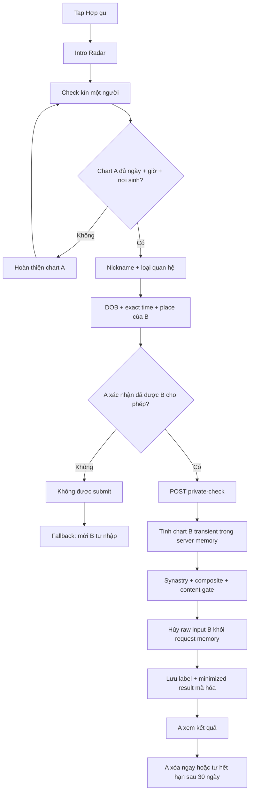

# Lá Lành — Radar hợp gu 1:1

**Status:** Active MVP scope  
**Version:** `radar-authorized-input-v1` / `radar-pair-v1` / `radar-result-v2` / `radar-living-dossier-v1`  
**Product decision:** Check kín bằng dữ liệu do người dùng tự nhập là flow chính. Lời mời tự nhập là fallback khi người dùng chưa được phép nhập hộ. Pool matching/Vòng Ghép chưa thuộc scope này.

## 1. Product promise

Radar giúp một người hiểu tương tác với người họ đã biết: chỗ dễ nói chuyện, dễ rung động, nhịp hành động hợp nhau và chỗ dễ cấn. Radar hiển thị ba chỉ báo độc lập trên thang 0–100 (`Bắt sóng`, `Dễ phối hợp`, `Lực cấn`) để người dùng so sánh các lớp trong chính cặp này; chúng không cộng thành 100, không phải điểm tổng hay xác suất thành công. Radar không kết luận soulmate/red flag và không suy ra ý định hoặc độ an toàn của người kia.

**“Check kín” nghĩa là:** Lá Lành không gửi link/thông báo cho người kia, không tạo hồ sơ cho họ và không đưa họ vào pool. “Kín” không có nghĩa là được phép dùng lén dữ liệu. Người nhập phải xác nhận người kia đã cho phép dùng thông tin sinh cho mục đích này.

## 2. Hai mode

| Mode | Khi nào dùng | Ai nhập dữ liệu B | Kết quả | Dữ liệu B |
|---|---|---|---|---|
| `private_check` — chính | A đã được B cho phép dùng thông tin sinh | A nhập trong một phiên tính | A nhận ngay | DOB/time/place chỉ ở server memory; không lưu vào Radar |
| `consented_invite` — phụ | A chưa được phép nhập hộ hoặc B muốn tự kiểm soát | B mở link, tự nhập chart và consent riêng | A và B nhận bản đọc rút gọn | Lưu trong birth profile mã hóa của B theo consent của B |

Không được tự động chuyển từ mode này sang mode kia. CTA chính luôn là `Check kín ngay`; `Mời họ tự nhập` chỉ xuất hiện dưới cổng quyền sử dụng dữ liệu.

## 3. Screen map

| Route | Screen | Primary job | Data action |
|---|---|---|---|
| `/radar` | Intro / bước 1 | Nói rõ USP, “kín” là gì, giới hạn; bắt đầu mới hoặc mở lịch sử | Read-only |
| `/radar/start` | Check kín / bước 2 | Nhập nickname/context + exact DOB/time/place + attestation; xem lại lịch sử | Tính transient; chỉ lưu result/label mã hóa |
| `/radar/result/:id` | Kết quả riêng / bước 3 | Đọc, mở evidence, check người khác, xem lịch sử hoặc xóa kết quả | Owner-bound read/delete |
| `/radar/invite` | Fallback invite | Tạo link khi A chưa có quyền nhập hộ | Capability 7 ngày |
| `/radar/i/:token` | Public preview | B hiểu mục đích/quyền trước khi nhập | Safe capability continuation |
| `/radar/continue` | Pair consent | B consent riêng và chạy hai chart | Derived pair result |
| `/radar/receipt` | Kết quả phía người nhận | B mở lại trong 7 ngày hoặc rút chart khỏi kết quả | HttpOnly receipt-bound read/withdraw |

Ba bước `Bắt đầu → Thông tin → Bản đọc` phải xuất hiện nhất quán trên flow chính và flow lời mời. Màn kết quả không được là ngõ cụt: owner luôn có đường `Check thêm một người`, `Xem các lần check` và điều hướng chính; recipient mở lại bằng receipt trên đúng thiết bị trong 7 ngày, có thể rút chart và luôn có đường về Radar. Kết quả hết hạn/đã xóa phải hiển thị terminal state có CTA quay lại thay vì một trang trống.

## 4. Primary user flow

## 5. Field contract

| Field | Type | Validation | Persistence |
|---|---|---|---|
| `recipient_label` | text | trim/collapse; 1–40 chars; escaped on render | AES-GCM only |
| `context` | enum | `crush`, `friend`, `partner`, `someone` | Plain enum |
| `birth_date` | ISO date | 18–120 years old | Never persisted by Radar |
| `birth_time_local` | `HH:MM` | exact 24-hour time | Never persisted by Radar |
| `place_id` | local allow-list ID | must resolve in local place index | Never persisted by Radar |

Local place index dùng catalog `vn-admin-2025-07-01`: browse 34 tỉnh/thành hiện hành và nhận 29 tên tỉnh cũ cho dữ liệu nơi sinh lịch sử. Kết quả tên cũ phải hiện mapping mới; không gọi geocoder ngoài, không xin GPS và không lưu query.
| `authorization_attested` | boolean | must be exactly `true` | Only attestation timestamp + version |
| `consent_version` | fixed version | `radar-authorized-input-v1` | Stored for accountability |

Inputs must not enter URL, localStorage/sessionStorage, analytics, logs, error text or page metadata. React state is cleared on unmount. The backend schema intentionally has no columns for B DOB/time/place in `private_check`.

## 6. Data and retention

| Data | Storage | Retention | User control |
|---|---|---|---|
| Raw B DOB/time/place in private mode | Request memory only | One computation | No history/profile created |
| Nickname | AES-GCM, request-bound context | Max 30 days | Owner delete |
| Minimized Radar result | AES-GCM | Max 30 days | Owner delete |
| Permission attestation | Version + timestamp | Same request lifetime | Deleted with result |
| Invite capability | Hash + temporary encrypted copy | 7 days or terminal state | Revoke |
| B birth profile in invite mode | Existing encrypted birth domain | Existing guest policy | B withdraw/delete |
| Recipient result receipt | HttpOnly, SameSite=Strict capability cookie | 7 days | B withdraw; inaccessible after expiry |

No contact upload, phone/email, GPS, current city, precise distance, IP fingerprint, mood, chat, advertising ID or model-training use belongs in Radar.

## 7. Security and privacy controls

- Owner mutation requires owner session tied to the same guest, trusted Origin and CSRF.
- Private result read/delete is owner-bound; guessed UUID returns the same not-found behavior.
- Pydantic rejects extra fields; time/date/place use strict server validation.
- Birthplace resolves from a local allow-list, so the query is not sent to a map provider.
- Raw B birth input is passed directly to a transient chart calculation and is not written to DB, cache, event stream or application log.
- Result projection excludes raw date/time/place/coordinates and scalar compatibility score. Ba chỉ báo độc lập chỉ được tạo từ evidence contribution có thể truy ngược và không được dùng để rank người.
- Public invite trả về `request_id` không bí mật để bind đúng consent action với đúng lời mời đang hiển thị. Accept/decline phải gửi lại binding này; receipt withdrawal cũng phải gửi đúng `request_id`. Cookie và request binding lệch nhau bị từ chối để một tab cũ không thể tác động lên lời mời/kết quả vừa mở ở tab khác.
- Web giữ expected `request_id` theo từng tab trong session storage; `/radar/continue` chỉ hiện consent khi expected ID trùng invitation cookie hiện tại. Không lưu token, ngày sinh, giờ sinh hoặc nơi sinh ở đây.
- Owner history/result cache is keyed by server-confirmed guest session epoch. Khi phiên đổi hoặc người dùng xóa dữ liệu, cache history/result/place-search bị xóa trước khi UI có thể render lại.
- Recipient projection được lưu chung trong encrypted result envelope nhưng chỉ mở bằng receipt riêng; owner và recipient nhận hai projection đổi chiều nên đại từ và góc nhìn không bị lẫn.
- Stored nickname/result use separate envelope-encryption contexts.
- Result is inaccessible after TTL and physically deletable. Production requires a scheduled physical purge of expired rows.
- Secondary invite retains 256-bit capability tokens, safe public headers, consent, revoke and recipient withdrawal.
- Attestation reduces misuse but is not proof that valid consent exists. Public launch requires Vietnamese privacy counsel to review lawful basis, notice, evidence and third-party-data handling.

## 8. Content and engine contract

- Inputs: two exact Western Tropical natal charts with matching `CalculationConfig`.
- Calculation: Swiss Ephemeris → natal facts → synastry contacts → bidirectional house overlays → midpoint composite → evidence motifs → Pair Signature.
- Synastry đọc cách hai chức năng của A/B kích hoạt nhau; overlay giữ rõ chiều A→B/B→A và chỉ dùng khi precision đủ; Composite chỉ mô tả pattern chung, không gán thành tính cách của một người.
- Pair Signature mở đầu bằng một mâu thuẫn có nghĩa của đúng cặp, ví dụ dễ bắt sóng nhưng cũng dễ nóng lên. Không chọn một contact rồi bỏ các evidence trái chiều.
- Compatibility Map gồm `Bắt sóng`, `Dễ phối hợp`, `Lực cấn`. Mỗi chỉ báo nhận contribution riêng; square/opposition có thể làm cả `Bắt sóng` và `Lực cấn` cùng cao.
- Mỗi chỉ báo giữ riêng evidence receipts đã thực sự đóng góp vào con số; UI đặt chúng sau disclosure `Vì sao có con số này?`, không biến chỉ báo thành điểm tổng.
- Bốn chương bắt buộc: `Điểm hợp`, `Điểm dễ cấn`, `Hai phía có thể thấy khác nhau`, `Đem ra đời thật`.
- Renderer `radar-living-dossier-v1` gom các contact liên quan thành theme cluster trước khi chọn luận điểm. Mỗi chapter giữ `title/body/evidence` để tương thích ngược và có thể thêm `topics`, `highlights`, `scene`, `perspectives`, `observation`; mọi highlight phải truy được về evidence ID.
- Outer-planet/Node/Chiron contact chỉ được đưa vào luận điểm khi nó chạm một hành tinh cá nhân hoặc social planet; contact chỉ giữa hai điểm thế hệ bị loại khỏi Dossier vì không đủ khả năng phân biệt đúng cặp. Quy tắc tương tự áp dụng khi chọn Composite aspect cho main copy.
- Độ dài báo cáo đi theo lượng evidence thật. Chapter có ít evidence được phép ngắn; không tạo filler, không lặp cùng một nhu cầu ở hai vế và không đổi synonym để giả cảm giác cá nhân hóa.
- Nếu chỉ còn một cluster và không có friction đủ mạnh, chapter cấn phải nói rõ giới hạn thay vì dùng chính evidence fit để chế thêm mâu thuẫn. Nếu không còn contact đủ riêng sau content gate, Radar vẫn trả một low-signal report ngắn thay vì lỗi hoặc bịa đủ bốn luận điểm.
- `Hai phía có thể thấy khác nhau` tách A→B, B→A và nhịp chung khi có overlay/composite phù hợp. Nếu thiếu một lớp evidence, UI không được bịa đủ ba phía.
- UI giữ Pair Signature và ba chỉ báo ở lớp scan nhanh, sau đó là mục lục bốn chương. Chương đầu mở sẵn; phần giải thích đời thường đứng trước, chart mechanics nằm sau disclosure `Vì sao Lá đọc vậy?`.
- Với consented invite, hệ thống tính projection A→B để lưu cho chủ lời mời và projection B→A để trả ngay cho người nhận. Vì vậy `bạn/người kia` luôn đi theo người đang đọc; raw chart và nickname riêng của chủ lời mời không bị gửi sang phía kia.
- Context `crush/friend/partner/someone` chỉ thay ví dụ và micro-experiment. Nó không thay chart evidence, evidence ID hoặc ba chỉ báo.
- Mỗi chương có evidence receipt giải thích bằng đời thường và metadata kỹ thuật tối thiểu. Payload lưu `knowledge_version`, `renderer_version`, `gate_version`, `chart_config_version`, `evidence_ids` và `concept_ids`.
- `scalar_score_eligible=false` vẫn là hard invariant; không tạo điểm tổng, soulmate/red-flag verdict hoặc xác suất dài hạn.
- Every interpretation is conditional and traceable to evidence IDs.
- Copy may help the user notice/ask/verify; it must not advise stalking, testing, manipulating, confronting, dating or leaving someone.
- Disclaimer stays near the reading: this is a reflection tool, not proof of intent, compatibility, consent or safety.

### Backward read

- Kết quả mới tiếp tục được ghi bằng `radar-result-v2`; Dossier là phần mở rộng additive, không phải một loại kết quả hay mục đích xử lý mới.
- Web nhận biết các field Dossier optional. Kết quả v2 cũ chỉ có `title/body/evidence` vẫn render bằng card cũ và không cần migration.
- API và web vẫn đọc `radar-result-v1` đã mã hóa cho tới khi tự hết hạn 30 ngày; không migrate hoặc giải mã hàng loạt dữ liệu cũ.
- Không bổ sung cột dữ liệu cá nhân và không gửi chart facts tới provider ngoài.

## 9. Edge cases

| Case | Required behavior |
|---|---|
| A has no exact chart | 409; send A to own birth-time flow and return to Radar |
| B is under 18 or over 120 | Reject before chart compute |
| Invalid time/place | Reject; do not guess timezone or nearest city |
| A does not attest permission | CTA disabled; API also rejects |
| A has information but no permission | Show only `Mời họ tự nhập`; do not offer bypass |
| Double tap | UI lock; production also needs idempotency key |
| Engine fails/busy | Generic retry; do not persist partial input/result |
| User leaves form | Discard state; no draft in browser storage |
| Result expires | Return terminal/not found; purge job deletes ciphertext |
| Owner deletes | Hard-delete request row and encrypted result |
| Recipient reloads result | Reopen `/radar/receipt` with HttpOnly receipt for at most 7 days |
| Recipient withdraw fails | Keep result unchanged; show explicit retry rather than claiming success |
| Two invite tabs cross | Block consent when tab-bound request ID differs from current invite cookie |

## 10. Release gates

| Gate | Internal review | Public/native release |
|---|---|---|
| Direct private check | Implemented + automated | Device E2E and accessibility |
| Raw-input non-persistence | Schema/test evidence | Log/APM redaction verification |
| Consent/attestation | Implemented | Legal review under VN Law 91/2025/QH15 and Decree 356/2025/NĐ-CP |
| Retention | Access TTL + manual delete | Scheduled physical purge + DSAR evidence |
| Engine/content | Real calculation, no mock/score | Editorial/safety sampling and monitoring |
| Abuse | Permission gate | Rate limit, abuse reporting and operations runbook |

Primary references checked 2026-09-21:

- [Vietnam Law 91/2025/QH15 on Personal Data Protection](https://vanban.chinhphu.vn/?classid=1&docid=214590&pageid=27160&typegroupid=3), effective 2026-01-01.
- [Decree 356/2025/NĐ-CP implementing the Personal Data Protection Law](https://vanban.chinhphu.vn/?classid=1&docid=216387&pageid=27160), effective 2026-01-01.
- [Google Play User Data policy](https://support.google.com/googleplay/android-developer/answer/10144311?hl=en-GB).
- [Apple App Privacy Details](https://developer.apple.com/app-store/app-privacy-details/).
- [OWASP MASVS Privacy controls](https://mas.owasp.org/MASVS/controls/MASVS-PRIVACY-1/).
