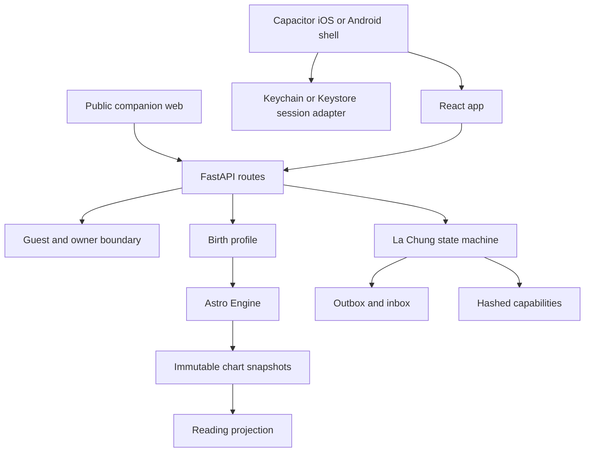
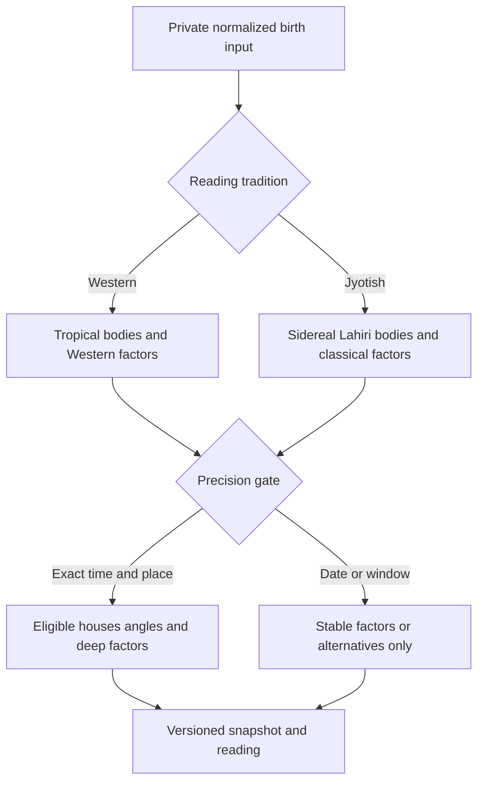
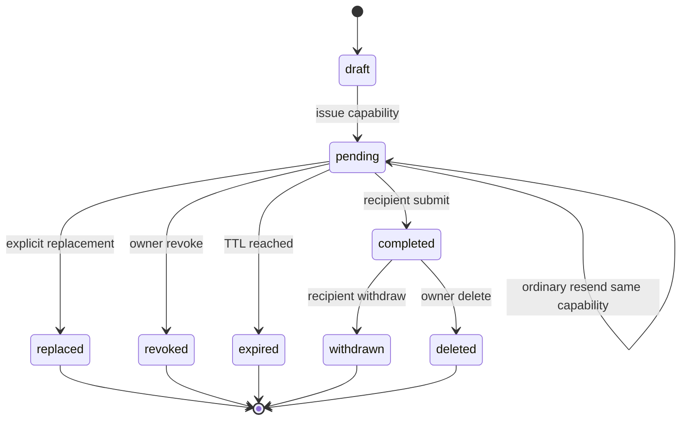

# US07-US09 App and Astrology Engine - Plan

## Goal Capsule

- **Objective:** Người dùng có thể khám phá Bản đồ Lá sâu, tạo lời mời Lá Chứng và hoàn tất phản hồi an toàn trong một sản phẩm app-first chạy được.
- **Means:** Mở rộng Astro Engine thành snapshot Western/Jyotish có version; xây các state machine US-07–09 trên API hiện tại; dựng UI Cosmic Glass Signal; đóng gói mobile bằng Capacitor trong khi giữ public companion trên web.
- **Authority:** Các user story và Astro Engine Spec trong `origin` là contract hành vi. Plan chỉ quyết định cách triển khai.
- **Execution profile:** Deep; cross-cutting FastAPI, PostgreSQL/SQLite, React, native shell, public capability links, personal data and astronomy calculations.
- **Stop conditions:** Không gọi bản build là production-ready nếu Swiss Ephemeris licensing, account identity provider, native signing, Universal/App Links hoặc privacy-store declarations chưa hoàn tất.

---

## Product Contract

### Summary

Plan hoàn thiện US-07–09 thành một vertical slice dùng được trên local app/web runtime. US-07 đọc tổng hòa natal và transit từ snapshot có provenance thay vì Sun/Moon hard-code. US-08–09 dùng capability link, lifecycle hữu hạn và anonymous-first response. Public recipient flow vẫn chạy trên HTTPS web để người nhận không cần cài app.

### Problem Frame

Repository đã có US-01–06, Swiss Ephemeris native adapter và web/PWA. Tuy nhiên engine chỉ tính tropical natal cơ bản, chưa có hai hệ đọc, chưa có reading snapshot, chưa có domain Lá Chứng, và chưa có target mobile thật. US-08 còn phụ thuộc account ownership trong khi runtime hiện chỉ có guest session. Nếu chỉ thêm ba màn hình, sản phẩm sẽ hiển thị thiết kế đẹp trên dữ liệu giả và vi phạm chính contract đã viết.

### Requirements

**Astrology and US-07**

- R1. Astro Engine tạo immutable snapshot riêng cho Western Tropical và Jyotish Sidereal; client không relabel hoặc trộn hai hệ.
- R2. Hai switch độc lập là `Hệ đọc` và `Cách tính`; mỗi combination có config hash, provenance và eligibility riêng.
- R3. Western launch tính đủ core bodies, nodes, houses đủ điều kiện, aspects và transit-to-natal; Jyotish launch tính D1, Lahiri, whole-sign bhava, Rahu/Ketu, nakshatra/pada và classical graha drishti.
- R4. Input thiếu hoặc xấp xỉ chỉ công bố factor ổn định theo precision policy; không suy ra house, angle hoặc D9 khi không đủ dữ liệu.
- R5. Reading overview là synthesis 4–6 claim có factor references, confidence và disclaimer; domain detail có thể rút gọn theo ngữ cảnh. Engine không viết claim và content layer không tự tính placement.

**Ownership and US-08**

- R6. Giá trị US-01–07 vẫn guest-first; account ownership chỉ xuất hiện khi người dùng tạo lời mời Lá Chứng.
- R7. Local MVP có owner-session boundary và guest-to-owner claim atomic; production identity provider là release gate, không được giả là đã hoàn tất.
- R8. Invite draft, preview, creation, copy/native share, pending, ordinary resend, explicit replacement, revoke và expiry tuân theo state machine US-08. Ordinary resend khôi phục cùng capability còn hiệu lực; replacement tạo capability mới và vô hiệu capability cũ.
- R9. Capability secret có ít nhất 128 bit entropy, chỉ xuất hiện trong initial capability URL hoặc owner-authorized resend response, lưu hash và envelope ciphertext có TTL, bị redaction ở CDN/WAF/app logs, không vào analytics và không tạo read/delivery receipt.

**Public response and US-09**

- R10. Người nhận mở public companion, chọn 3–5 approved frozen statements và submit một lần mà không cần account, app, birth data hoặc danh bạ.
- R11. Identity mặc định anonymous; alias là opt-in và được validate/sanitize; owner chỉ thấy privacy-safe projection.
- R12. Submit, notification materialization, withdraw và delete idempotent; revoke/expiry/concurrent completion thắng race theo transaction.
- R13. Public routes dùng generic terminal states, no-store, no-referrer, strict origin/CSP posture, rate limits và không có third-party tracker.

**Design, app and quality**

- R14. US-07–09 dùng Direction 2 Cosmic Glass Signal, một font Be Vietnam Pro, một primary CTA mỗi màn và semantic light/dark tokens.
- R15. Mobile targets dùng cùng API/contracts và UI bundle với web; native shell không lưu raw birth input hoặc capability secret vào WebView storage.
- R16. Các flow có loading, empty, error, offline, retry, revoked, expired, already-completed và reduced-motion states; tap target tối thiểu 44 px và text scale 200% không mất chức năng.
- R17. Documentation, security and privacy evidence phải được cập nhật cùng runtime behavior; không còn P0/P1 trước release.
- R18. Raw birth input, complete chart payload, capability and receipt credentials phải được encrypted hoặc purpose-projected theo lớp; không cache chúng trong browser storage hoặc gửi vào analytics/crash reporting.
- R19. Một stable principal ID sở hữu dữ liệu sau claim; claim phải thu hồi guest credential, xoay CSRF/session, chống replay và không đổi khóa/AAD theo guest ID. SQLite chỉ dùng dev/test; các race guarantee phát hành phải được chứng minh trên PostgreSQL.
- R20. Native app dùng production API base URL và transport riêng; bearer/session secret chỉ nằm trong iOS Keychain/Android Keystore qua secure-storage adapter, không ở WebView storage. Web tiếp tục dùng HttpOnly cookie + CSRF.

### Key Flows

- F1. Guest có active birth snapshot mở US-07, chọn tradition/config, nhận snapshot hoặc gated precision state, đọc claim và provenance, rồi quay Home.
- F2. Owner bắt đầu US-08 từ Home, claim ownership tại action quan trọng, tạo draft, preview, phát hành capability link và quản lý pending/revoked/expired state.
- F3. Recipient mở link, xem disclosure, chọn statement và identity, review, submit, nhận receipt và có thể withdraw trong cửa sổ hợp lệ.
- F4. Owner nhận một inbox item, mở individual result, hide/delete; recipient dùng public report/withdraw path không cần account. Hệ thống không aggregate hoặc dùng response cho matching.

### Acceptance Examples

- AE1. Given một birth profile exact time/place, when user đổi từ Western recommended sang Jyotish recommended, then API trả snapshot khác có Lahiri provenance và UI không giữ label tropical cũ. Covers R1–R5.
- AE2. Given date-only input gần boundary, when US-07 loads, then unstable facts bị withheld hoặc hiển thị alternatives; houses và angles không xuất hiện. Covers R4.
- AE3. Given guest mở Lá Chứng, when user xác nhận owner checkpoint, then existing birth/daily state được claim một lần và draft tiếp tục không nhân bản. Covers R6–R8.
- AE4. Given native share sheet bị hủy, when user quay lại, then request vẫn `pending` và không bị đánh dấu delivered/read. Covers R8–R9.
- AE5. Given capability token revoked, expired hoặc random, when public preview/submit runs, then response là generic terminal state và không lộ sender/request metadata. Covers R9, R12–R13.
- AE6. Given valid selection and a lost success response, when recipient retries with the same idempotency key, then one response and one inbox item exist and the same withdrawal capability is restored. Covers R10–R12.
- AE7. Given anonymous identity, when owner opens result, then alias, IP, device and contact channel are absent and the result remains individual. Covers R11–R13.
- AE8. Given app build and public web build, when privacy/runtime scanners run, then raw DOB/time/place/coordinates and receipt secret are absent from URLs, logs, analytics and local browser storage; invite secret chỉ có ở initial capability URL, được redaction trước access logs và không được persist/copy sang history sau bootstrap. Covers R9, R13, R15, R17–R20.

### Scope Boundaries

#### In scope

- Western Tropical and Jyotish Sidereal launch calculations required by US-07.
- US-07 reading projection and screens.
- Local owner-session claim sufficient to exercise US-08/09 end to end.
- US-08 invite lifecycle, US-09 response/withdraw/result lifecycle and transactional outbox/inbox materialization.
- Capacitor iOS/Android project scaffold and runtime smoke path around the existing React application.
- Public companion web route for recipient links.

#### Deferred to Follow-Up Work

- Production Sign in with Apple/Google/passkey provider and account recovery.
- Push provider delivery; authenticated inbox polling is the launch fallback for this slice.
- D9, Vimshottari, Davison, progressions, solar returns, horary and electional charts.
- Production domain association files, code signing, store submission and penetration test by an independent party.

#### Outside this product's identity

- Medical, legal, financial or deterministic prediction.
- Free-text anonymous feedback, public rankings and social-proof scoring.
- Using Lá Chứng responses for ads, model training or matching without a new product contract and consent.

### Success Criteria

- A local user completes F1–F4 without mock runtime data.
- Engine golden fixtures prove both traditions and reject silent fallbacks.
- Contract, API, web unit/e2e, privacy scanner, iOS/Android sync and production web build pass.
- Every in-scope US-07–09 AC is mapped to automated or named manual evidence; production-only AC phụ thuộc provider/domain/signing được gắn `release-blocked`, không được tính pass.

---

## Planning Contract

### Key Technical Decisions

- KTD1. **Capacitor 8 wraps the existing React runtime.** This creates iOS and Android targets without forking US-01–09 UI logic; public capability routes remain ordinary HTTPS pages. (session-settled: user-approved — chosen over treating the PWA as the finished app because the user repeatedly required app as the primary product.) Governs R14–R16.
- KTD2. **Astro facts remain server-owned.** Extend the existing native Swiss Ephemeris adapter with explicit sidereal configuration and immutable projection models; clients only select supported configs and render results. Governs R1–R5.
- KTD3. **Tradition presets are separate snapshot families.** Cache and persistence keys include tradition, config hash, engine version, ephemeris set and input version. Governs R1–R4.
- KTD4. **US-08/09 use database state machines and transactional ownership checks.** Invite creation, replacement, revoke, submit and withdrawal are atomic transitions, not UI flags. Governs R7–R12.
- KTD5. **Secrets use hash-at-rest plus bounded replay envelopes.** Plain invite/receipt credentials never become identifiers, queryable analytics fields or log context. Governs R9, R12–R13.
- KTD6. **The local owner session is an integration boundary, not a production identity claim.** It proves guest-to-owner transfer and authorization locally while keeping the production provider replaceable. Governs R6–R8 and the release stop condition.
- KTD7. **Cosmic Glass is a token/component contract.** Reuse current semantic theme primitives and implement the approved US-07–09 boards with opaque content surfaces, restrained lime/coral signals and one font. (session-settled: user-directed — chosen over the other four design directions after reviewing generated options.) Governs R14–R16.
- KTD8. **Swiss Ephemeris licensing is a hard distribution gate.** Local engineering may use the vendored AGPL assets; public hosted service or distributed binary requires an approved AGPL-compatible posture or professional license before activation. Governs R17.
- KTD9. **A US-07 chart preference affects US-07 only.** Daily Note, matching and later consumers bind their own supported preset so a custom chart view cannot silently change unrelated content. Governs R1–R5.
- KTD10. **Swiss configuration is process-global and batch-locked.** Sidereal/tropical mode, ephemeris flags and every call in one snapshot computation execute dưới cùng một adapter lock; không thả lock giữa các body/house call. Governs R1–R4.
- KTD11. **Capability bootstrap acknowledges the URL-secret boundary.** Public link dùng token ở path only for initial bootstrap because that is the capability; edge/app access logs must redact the path before persistence, response is `no-store/no-referrer`, and the browser immediately replaces history with a token-free route after exchanging for a narrow HttpOnly capability cookie. Governs R9, R12–R13.
- KTD12. **Existing plaintext chart rows are purged and recomputed in this development database.** No dual-read plaintext fallback is introduced. Any environment containing user data requires a separately rehearsed encrypted migration before this migration can run. Governs R18.

### Assumptions

- Product naming and StatementBank Vietnamese copy in the user stories are approved for local MVP; content-safety sign-off remains a production gate.
- Capacitor 8 is compatible with the repository Node 22 baseline; native platform toolchain availability is verified during implementation.
- The existing dirty US-01–06 worktree is the baseline to preserve. Work does not rewrite unrelated files or commit user-owned changes.
- The local owner-session has no account recovery. Losing its secure cookie loses owner access in this development slice; UI must say this before creation and production mode must reject the mechanism.

### High-Level Technical Design

#### Component and data flow



#### Chart configuration flow



#### Invite and response lifecycle



### Output Structure

```text
apps/
  api/app/domains/
    astro/
    readings/
    identity/
    la_chung/
  mobile/
    android/
    ios/
apps/web/src/features/
  insights/
  la-chung/
```

---

## Implementation Units

### U1. Extend Astro Engine v2 fact computation

- **Goal:** Produce versioned Western and Jyotish facts required by US-07 without client calculations.
- **Requirements:** R1–R5; KTD2–KTD3, KTD8.
- **Dependencies:** None.
- **Files:** `apps/api/app/domains/astro/models.py`, `apps/api/app/domains/astro/engine.py`, `apps/api/app/domains/astro/ffi/swisseph.py`, `apps/api/app/domains/astro/aspects.py`, `apps/api/app/domains/astro/profiles/*`, `apps/api/tests/astro/test_engine_golden.py`, `apps/api/tests/astro/test_engine_traditions.py`.
- **Approach:** Add explicit calculation config, zodiac/tradition enums, ayanamsa provenance, South Node invariant, whole-sign/equal/Placidus eligibility, nakshatra/pada and classical drishti. Keep outer planets outside the Jyotish classical namespace. Add transit-to-natal projection keyed by observation instant/time standard/cache bucket/expiry and precision-safe withholding. Hold the Swiss adapter lock for the complete config-scoped calculation batch.
- **Patterns to follow:** Existing ctypes lock, ephemeris checksum verification, frozen Pydantic models and golden fixture style.
- **Execution note:** Extend golden and invariant tests before changing chart serialization.
- **Test scenarios:**
  - Western recommended returns tropical positions, True Node, aspects and whole-sign houses for exact input.
  - Jyotish Lahiri returns sidereal positions, Rahu/Ketu 180 degrees apart, nakshatra/pada and classical drishti.
  - Switching tradition changes snapshot/config hash and never relabels an existing longitude set.
  - Date-only and time-window inputs withhold unstable factor and all ineligible angles/houses.
  - Placidus failure at unsupported latitude returns a typed error without silent fallback.
  - Transit-to-natal ranks only eligible factors and records exact source snapshot IDs.
  - Raman/Krishnamurti ayanamsa, Equal houses, Mean Node, DST fold/gap, historical timezone and near-midnight fixtures either calculate with explicit provenance or fail with typed validation; no silent normalization.
  - Parallel tropical/sidereal computations never contaminate each other's global Swiss mode.
  - Missing/corrupt ephemeris assets and non-Swiss fallback flags fail closed.
- **Verification:** Golden fixtures, boundary invariants and serialization snapshots pass for both traditions.

### U2. Persist chart and reading snapshots for US-07

- **Goal:** Store immutable calculation snapshots and privacy-safe reading projections.
- **Requirements:** R1–R5, R17–R18; KTD2–KTD3, KTD9.
- **Dependencies:** U1.
- **Files:** `apps/api/app/domains/readings/*`, `apps/api/app/domains/birth/models.py`, `apps/api/app/domains/birth/tables.py`, `apps/api/app/domains/birth/postgres.py`, `apps/api/app/api/v1/routes/insights.py`, `apps/api/app/api/v1/router.py`, `apps/api/migrations/versions/*`, `apps/api/tests/readings/*`, `apps/api/tests/integration/test_local_product_flow.py`, `packages/contracts/openapi/v1.json`, `packages/contracts/src/v1.ts`.
- **Approach:** Purge/recompute existing development plaintext chart rows, encrypt complete chart payloads at rest and expose purpose-specific projections. Activate one US-07 preference per tradition/config/input version without changing other consumers. Build deterministic reading claims from factor references and reviewed Vietnamese templates. Expose overview, detail, provenance, feedback/save, current-sky and supported-config endpoints.
- **Patterns to follow:** Birth snapshot activation transaction, repository/service separation and generated OpenAPI contracts.
- **Test scenarios:**
  - Covers AE1. Two tradition snapshots coexist and the requested one becomes active without deleting the other.
  - Covers AE2. Limited precision response contains reason codes and no ineligible claims.
  - Snapshot recomputation after US-06 input update creates a new version and leaves history immutable.
  - Reading overview has 4–6 claims, factor refs, confidence and entertainment disclaimer.
  - Cross-owner snapshot and raw birth-input resolution are denied.
  - Database inspection cannot read complete chart payloads without the scoped envelope key; API overview never returns raw private input references.
  - Concurrent duplicate compute requests converge on one config/input snapshot.
- **Verification:** Migration, API integration and contract generation prove deterministic, owner-safe US-07 responses.

### U3. Add the owner-session claim boundary

- **Goal:** Require ownership at the important US-08 action without moving login to onboarding.
- **Requirements:** R6–R8; KTD4, KTD6.
- **Dependencies:** None.
- **Files:** `apps/api/app/domains/identity/*`, `apps/api/app/api/v1/routes/identity.py`, `apps/api/app/domains/guest/*`, `apps/api/app/main.py`, `apps/api/migrations/versions/*`, `apps/api/tests/identity/*`, `apps/api/tests/guest/*`, `apps/web/src/features/account/*`, `apps/web/src/shared/api/client.ts`, `packages/contracts/openapi/v1.json`, `packages/contracts/src/v1.ts`.
- **Approach:** Introduce a stable principal independent of guest/session credentials. Create a development owner session with secure opaque credential and atomic re-parenting of all affected guest resources. On successful claim revoke the guest credential, rotate CSRF/session material and reject replay. Keep the identity adapter compatible with a later production provider. Web uses HttpOnly/Secure/SameSite cookies plus CSRF; native transport is isolated behind a secure-storage-backed bearer adapter.
- **Patterns to follow:** Guest token hash/envelope issuance, CSRF service and ownership-scoped repositories.
- **Test scenarios:**
  - Covers AE3. Claim transfers all guest-owned records once and resumes the US-08 draft.
  - Guest can complete US-01–07 without owner session.
  - A second owner cannot claim or read the same guest resources.
  - Replay with the same idempotency key returns the same owner session; changed payload conflicts.
  - Replayed guest credentials fail after claim; pre-claim CSRF tokens fail and encrypted birth data remains decryptable through stable record/principal AAD.
  - Logout/revoked/expired owner credential loses access without deleting owned data.
  - Production mode refuses the local-only identity mechanism unless explicitly configured.
- **Verification:** Authorization tests prove delayed ownership and zero duplicate resources.

### U4. Implement the La Chung domain and public capability protocol

- **Goal:** Make US-08/09 lifecycle, validation, notification and withdrawal server-authoritative.
- **Requirements:** R8–R13, R17–R18; KTD4–KTD5.
- **Dependencies:** U3.
- **Files:** `apps/api/app/domains/la_chung/*`, `apps/api/app/api/v1/routes/la_chung.py`, `apps/api/app/main.py`, `apps/api/migrations/versions/*`, `apps/api/tests/la_chung/*`, `apps/api/tests/integration/test_la_chung_flow.py`, `packages/contracts/openapi/v1.json`, `packages/contracts/src/v1.ts`, `scripts/verify-privacy.mjs`.
- **Approach:** Add frozen StatementBank, request/response tables, hashed capability and receipt credentials, replay envelopes expiring no later than the underlying capability/withdrawal window, outbox/inbox tables and atomic transitions. Public endpoints derive relationships server-side. A same-origin public entrypoint plus edge/static-host config applies CSP, no-store, no-referrer and path redaction before access-log persistence; application middleware is defense in depth.
- **Patterns to follow:** Share artifact token hashing, idempotent repository transactions, envelope cipher and problem responses.
- **Execution note:** Build state-transition and race tests before the route layer.
- **Test scenarios:**
  - Invite creation/replay yields one request and one capability; plaintext is absent from persistence.
  - Ordinary resend restores the same still-valid capability without extending TTL; explicit replacement invalidates the prior capability; revoke and expiry produce uniform terminal projection.
  - Covers AE4. Cancelling native share does not mutate server lifecycle state.
  - Covers AE5. Random, expired and revoked tokens reveal no private metadata.
  - Selection rejects fewer than 3, more than 5, duplicates, retired statements and wrong bank version.
  - Covers AE6. Lost response retry restores the same receipt and produces one response/inbox item.
  - Revoke-submit and concurrent recipient races allow one valid terminal transition.
  - Covers AE7. Anonymous result excludes alias and technical metadata; no aggregation fields exist.
  - Withdraw and owner delete invalidate owner projection and receipt capability idempotently.
  - Public endpoints emit no-store/no-referrer and redact capability/receipt values from logs.
  - Terminal lifecycle/retention worker purges capability and receipt ciphertext on completed/revoked/expired/withdrawn/delete deadlines and is idempotent.
  - Receipt cookie is `HttpOnly; Secure; SameSite=Strict`, scoped to the receipt route, and expires at the withdrawal deadline.
  - PostgreSQL concurrency tests prove one winner for submit/revoke/replace; SQLite is explicitly non-authoritative for release evidence.
  - Owner IDOR attempts across history, detail, replacement, revoke and result endpoints return uniform denial without decrypting token envelopes.
- **Verification:** Domain, integration, contract and privacy tests cover every lifecycle state and race.

### U5. Build US-07 Cosmic Glass app screens

- **Goal:** Deliver Bản đồ Lá overview, reading detail and calculation settings from real API data.
- **Requirements:** R2–R5, R14–R16; KTD1–KTD3, KTD7.
- **Dependencies:** U2.
- **Files:** `apps/web/src/features/insights/*`, `apps/web/src/app/router.tsx`, `apps/web/src/shared/api/client.ts`, `apps/web/src/shared/styles/global.css`, `apps/web/src/shared/ui/*`, `apps/web/src/features/insights/InsightsPage.test.tsx`, `apps/web/tests/e2e/us07-us09.spec.ts`.
- **Approach:** Implement all S30–S35: overview, domain detail, progressive provenance, first-switch education, calculation settings and Current Sky. Add save and useful/not-useful feedback. Use one prominent insight bento, compact switch controls and precision gate states. Never hand an active chart preference to Daily Note or other consumers. Reuse semantic theme tokens and app navigation.
- **Patterns to follow:** Existing React Query fetch states, Profile settings toggles, one-font theme and responsive route shell.
- **Test scenarios:**
  - Covers AE1. Switching tradition shows pending state, then replaces all labels/facts from the returned snapshot.
  - Covers AE2. Missing precision shows unlock explanation and never renders houses/angles.
  - Custom calculation validates only supported combinations and offers reset to recommended.
  - First tradition switch explains that wording and facts change; provenance identifies tradition, calculation config, engine and snapshot time.
  - Current Sky shows observation instant/staleness and transit-to-natal factors; save/feedback are idempotent and privacy-safe.
  - Moderated comprehension test: at least 4/5 target participants correctly identify what changed after switching, why a factor is unavailable, and that content is interpretive rather than deterministic; failures block design sign-off.
  - Loading, offline cached, stale, compute error and retry states preserve the last valid snapshot label.
  - Keyboard, screen reader, 320/390/430 px, 200% text, light/dark and reduced motion remain usable.
- **Verification:** Component and browser tests show real US-07 data and visual comparison follows the approved board.

### U6. Build US-08 owner invite screens

- **Goal:** Deliver intro, draft, preview, share-ready and lifecycle management in the app surface.
- **Requirements:** R6–R9, R14–R16; KTD1, KTD4–KTD7.
- **Dependencies:** U3, U4.
- **Files:** `apps/web/src/features/la-chung/InviteStartPage.tsx`, `apps/web/src/features/la-chung/InvitePreviewPage.tsx`, `apps/web/src/features/la-chung/InviteHistoryPage.tsx`, `apps/web/src/features/la-chung/components/*`, `apps/web/src/app/router.tsx`, `apps/web/src/shared/api/client.ts`, `apps/web/tests/e2e/us07-us09.spec.ts`.
- **Approach:** Implement S36–S40 with owner checkpoint at issue time, privacy preview before creation, native share/copy/contact-picker actions and server-derived lifecycle chips. Checkpoint explains why ownership is needed, what is preserved, local recovery limitation, cancel and retry behavior; cancel returns to the intact preview. Contact picker handles available/denied/cancelled/unavailable without requesting or uploading the full address book. Never infer delivery from share-sheet completion.
- **Patterns to follow:** Current card preview/share fallback, delayed account page and Cosmic Glass bento hierarchy.
- **Test scenarios:**
  - Guest draft survives owner checkpoint and resumes once.
  - Invalid recipient label/context stays local and cannot create a request.
  - Covers AE4. Share cancellation keeps pending state and UI copy avoids delivered/read language.
  - Contact picker returns only an OS share target transiently; denial/cancel/unavailable keeps share and copy available with no contact persistence.
  - Copy success/failure has accessible feedback without exposing token to analytics.
  - Replacement, revoke, expiry and offline retry render correct server state.
  - Theme, text scale and narrow-screen tests keep primary action visible without oversized CTA.
- **Verification:** Browser e2e completes US-08 from Home to pending management using the real API.

### U7. Build US-09 public response and owner result screens

- **Goal:** Let a recipient respond safely and let the owner view one privacy-safe result.
- **Requirements:** R10–R16; KTD1, KTD4–KTD5, KTD7.
- **Dependencies:** U4, U6.
- **Files:** `apps/web/src/features/la-chung/PublicLandingPage.tsx`, `apps/web/src/features/la-chung/StatementSelectionPage.tsx`, `apps/web/src/features/la-chung/ResponseReviewPage.tsx`, `apps/web/src/features/la-chung/ResponseReceiptPage.tsx`, `apps/web/src/features/la-chung/ResultPage.tsx`, `apps/web/src/features/la-chung/components/*`, `apps/web/src/app/router.tsx`, `apps/web/src/shared/api/client.ts`, `apps/web/tests/e2e/us07-us09.spec.ts`.
- **Approach:** Implement S41–S48. Public route uses a separate lightweight/token-free entrypoint after capability bootstrap, anonymous default, stable per-request statement order, review-before-submit and withdrawal management. Owner inbox/history has empty, pending, completed, hidden, withdrawn and deleted projections; result detail exposes only hide/delete. Recipient report/withdraw stays public and account-free. Owner result remains individual and factual.
- **Patterns to follow:** Public share route safe projection, form validation and shared semantic status components.
- **Test scenarios:**
  - Valid landing explains sender, task, visibility and no-account requirement before selection.
  - Counter enforces 3–5 unique statements and selection is not color-only.
  - Alias is opt-in, sanitized and omitted when anonymous.
  - Covers AE5–AE7. Terminal states, retry, concurrent completion, receipt restoration and owner projection match server state.
  - Recipient report and withdrawal work without account; losing receipt returns safe unavailable state. Owner cannot impersonate recipient report.
  - Public route contains no third-party scripts, referrer leakage or client-stored capability copy.
  - Opening a capability route offline shows a neutral retry state and never replays cached sender/request content from the service worker.
  - Accessibility and responsive tests cover every screen and validation state.
- **Verification:** A recipient completes US-09 without install/login and the owner sees one privacy-safe result.

### U8. Add native shells and release evidence

- **Goal:** Make the React product installable as real iOS/Android app targets and document honest release readiness.
- **Requirements:** R14–R18; KTD1, KTD7–KTD8.
- **Dependencies:** U5–U7.
- **Files:** `apps/mobile/package.json`, `apps/mobile/capacitor.config.ts`, `apps/mobile/ios/*`, `apps/mobile/android/*`, `package.json`, `pnpm-workspace.yaml`, `docs/reference/data-inventory-us07-us09.md`, `docs/legal/privacy-security-flow-notes.md`, `docs/legal/swiss-ephemeris-release-gate.md`, `docs/reviews/us07-us09-implementation-review-2026-09-04.md`, `design-qa.md`, `scripts/verify-privacy.mjs`.
- **Approach:** Configure Capacitor to consume the production web bundle, restrict navigation, use a production API base URL and native session adapter backed by iOS Keychain/Android Keystore, and keep public capability links on the verified domain. Do not put bearer/session secrets in Preferences, localStorage or sessionStorage. Add native privacy/security checklists. Record signing, associated-domain, production identity, production KMS and Swiss licensing as release gates rather than hiding them.
- **Execution note:** Prefer platform sync/build smoke evidence; do not claim store readiness from a web e2e pass.
- **Test scenarios:**
  - iOS and Android projects sync the same production assets and reject arbitrary remote navigation.
  - Covers AE8. Birth data and capability secrets are absent from localStorage, sessionStorage, browser history, crash payload fixtures and generated app config.
  - Universal/App Link parsing accepts only allowlisted HTTPS host/path and treats malformed values as inert navigation.
  - Native logout/expiry removes secure-storage credentials; device backup/restore does not export them; screenshots/app-switcher snapshots obscure private chart and result surfaces.
  - Theme, safe areas, keyboard, back navigation and native share cancellation work in simulator/emulator smoke runs where toolchains are available.
  - App privacy/Data Safety inventory matches the actual API, storage and SDK behavior.
- **Verification:** Web production build and available native smoke builds pass; every unavailable signing/store test is listed as a release blocker.

---

## Verification Contract

| Surface | Evidence | Covers | Done signal |
|---|---|---|---|
| Astro facts | API unit/golden tests and ephemeris asset verification | U1–U2 | Western/Jyotish fixtures and invariants pass with no fallback |
| Ownership | Identity, claim and authorization integration tests | U3 | Delayed claim is atomic and cross-owner access fails |
| Capability protocol | Domain race/idempotency/header/redaction/retention tests on PostgreSQL | U4 | Lifecycle, secrets, purge jobs and generic terminal states pass |
| UI flows | React unit tests and Playwright mobile flows | U5–U7 | F1–F4 complete from real API responses |
| Privacy/security | `scripts/verify-privacy.mjs`, data inventory and targeted review | U1–U8 | No P0/P1; sensitive fields absent from prohibited surfaces |
| App packaging | Capacitor sync plus available iOS/Android smoke build | U8 | Native projects consume production bundle and safe navigation policy |
| Repository | `pnpm check` | U1–U8 | Contracts, runtime guard, lint, typecheck and tests pass |
| AC traceability | Generated matrix in implementation review | U1–U8 | Every US-07–09 AC/DoD row names automated evidence, manual evidence or an explicit release blocker |

Manual evidence is required for screen reader, 200% text, reduced motion, native share cancellation, store privacy declarations and simulator safe-area behavior. A skipped native platform check is a recorded blocker, not a pass.

---

## System-Wide Impact

- Chart persistence grows from one tropical snapshot shape to configuration-keyed snapshot families.
- Birth input remains private, but derived chart facts and social-response data add retention and deletion obligations.
- Delayed ownership introduces a new authorization boundary that future matching and chat must reuse.
- Capability links create a public attack surface and require CDN/WAF/log redaction before deployment.
- Capacitor turns web storage, deep links, screenshots, backups and crash SDKs into mobile privacy surfaces.
- Product, content, legal and operations reviewers must approve StatementBank, interpretation templates, Swiss licensing and store declarations.

---

## Risks and Dependencies

| Risk | Mitigation or gate |
|---|---|
| Swiss Ephemeris uses AGPL or a professional license | Block distribution and public service until legal selects an AGPL-compatible posture or signed professional license |
| Local owner-session has no production recovery or identity proof | Keep production mode closed; replace through the identity boundary before external launch |
| Jyotish semantics could accidentally reuse Western factors | Separate namespaces/config families and require expert-reviewed golden fixtures |
| Current complete chart JSON is reconstructable personal profile data | Purge/recompute plaintext rows in dev; block non-dev migration until an encrypted migration rehearsal and rollback are approved |
| Forwarded or guessed public links can be abused | High-entropy hash-at-rest capabilities, generic errors, rate limits, expiry/revoke and monitoring |
| Revoke, expiry and submit can race | Database-locked transition with one terminal winner and transaction-bound outbox |
| WebView, service worker or crash SDK could retain secrets | No-store/no-referrer routes, capability-specific offline shell, storage scanner and SDK inventory |
| Capability necessarily appears in the initial share URL | Redact edge logs before persistence, bootstrap once into a narrow HttpOnly cookie, replace browser history, and never copy it into telemetry/referrers |
| Production key management is not configured | Static development key is preview-only; production refuses startup until a KMS/keystore-backed provider and rotation policy are configured |
| iOS/Android toolchains may be absent locally | Record platform-specific build gaps as release blockers; never substitute a web pass |
| Existing US-01–06 work overlaps shared files | Preserve the dirty baseline, make narrow edits and verify the full prior product flow |

---

## Sources and Research

- `docs/foundation/la-lanh-astro-engine-spec.md` owns calculation, uncertainty and provenance rules.
- `docs/user-stories/US-07-mo-insight-sau.md`, `docs/user-stories/US-08-gui-loi-moi-la-chung.md` and `docs/user-stories/US-09-phan-hoi-va-nhan-la-chung.md` own flow, AC, validation and privacy behavior.
- Swiss Ephemeris programmer documentation defines explicit sidereal mode, ayanamsa, house APIs and dual AGPL/professional licensing: `https://www.astro.com/swisseph-download/doc/swephprg.pdf`.
- OWASP MASVS storage, authentication, network, platform and privacy controls shape the native release checks: `https://mas.owasp.org/MASVS/`.
- Vietnam Personal Data Protection Law 91/2025/QH15 has been effective since 2026-01-01; legal review must replace the repository's Nghị định-only posture: `https://quochoi.vn/tintuc/Pages/tin-hoat-dong-cua-quoc-hoi.aspx?ItemID=94817`.
- Apple Universal Links require two-way domain association and validation of all incoming parameters: `https://developer.apple.com/documentation/xcode/allowing-apps-and-websites-to-link-to-your-content`.
- Apple App Privacy and Google Play Data Safety require declarations that match app, WebView and SDK collection behavior: `https://developer.apple.com/app-store/app-privacy-details/` and `https://support.google.com/googleplay/android-developer/answer/10787469`.
- Capacitor 8 is the current official native runtime for wrapping an existing web application: `https://capacitorjs.com/docs`.
- No applicable repository learning exists under `docs/solutions/`; this implementation should produce a durable learning after verification.

---

## Definition of Done

- U1–U8 are implemented without replacing existing US-01–06 behavior or introducing mock runtime data.
- F1–F4 work against persisted API state, including all terminal and retry paths.
- Western/Jyotish snapshots, reading provenance, capability secrets, ownership and deletion rules pass automated tests.
- Approved US-07–09 Cosmic Glass screens use one font and pass responsive/accessibility checks.
- `pnpm check` passes and native sync/build evidence is recorded for every available platform.
- Documentation states sources checked, findings fixed, unresolved production gates and exact AC/DoD residuals.
- Production distribution remains blocked until identity, Swiss licensing, domain association, signing, content safety, store declarations and independent security review are complete.
