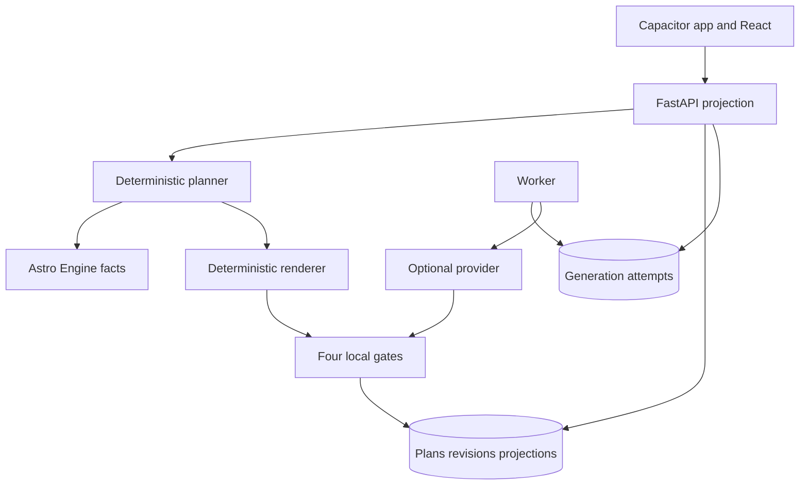
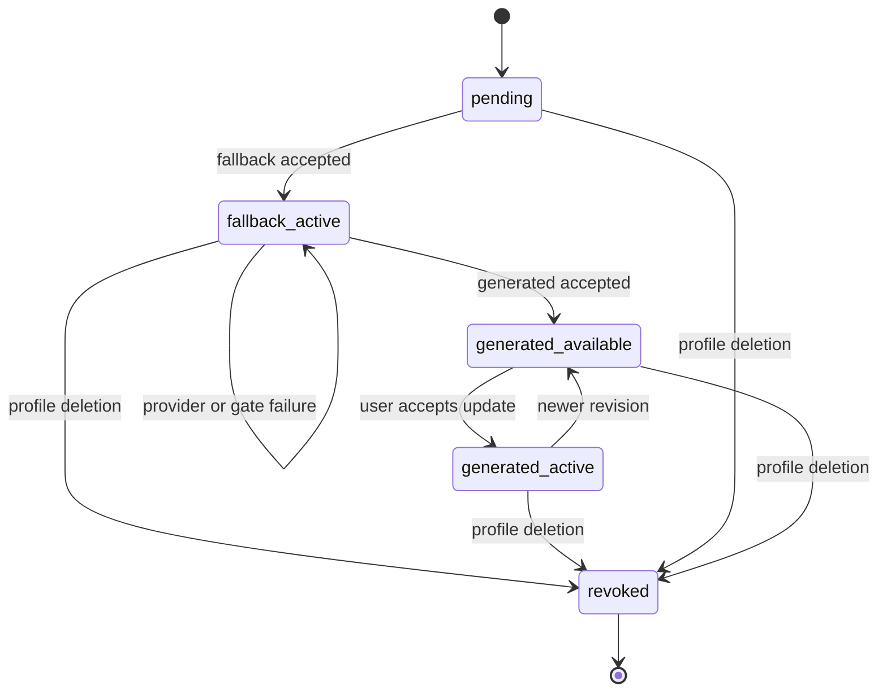
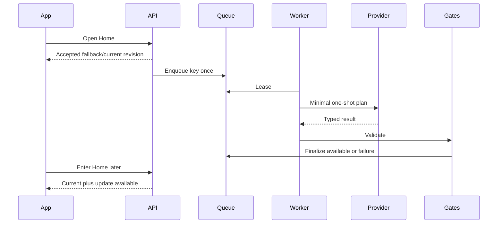
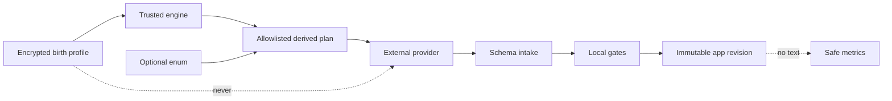
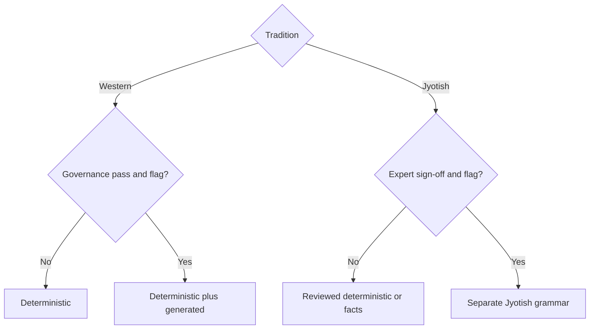

# Lá Lành Chart Synthesis Agent - Plan

## Goal Capsule

- **Objective:** Người dùng nhận được một lời đọc birth chart đủ riêng, dễ hiểu và hữu ích để nhận ra một pattern của mình, hiểu điều gì đang chạm pattern đó hôm nay nếu có tín hiệu đủ điều kiện và biết một việc nhỏ có thể thử.
- **Means:** Astro Engine tạo sự thật và `ReadingPlan`; renderer deterministic hoặc provider-neutral viết; bốn gate quyết định xuất bản; mọi màn app đọc cùng một revision bất biến. (KTD1–KTD7)
- **Authority:** Product Contract quyết định hành vi. `docs/foundation/la-lanh-astro-engine-spec.md` quyết định phép tính. Planning Contract quyết định cơ chế.
- **Execution:** Deep, app-first, có migration, external provider tùy chọn và privacy/security release gate.
- **Stop conditions:** Không bật provider production trước governance review. Không bật generated Jyotish trước expert sign-off. Không publish candidate fail gate.
- **Tail:** Sau triển khai, chạy `ce-compound` cho immutable revision, Vietnamese safety gate và provider boundary.

---

## Product Contract

### Summary

Lá Lành thay copy ghép placement bằng pipeline tổng hợp toàn chart cho Daily Note, Aura, Reading Detail và personalized Sky. Người dùng thấy một nhận định rõ, biểu hiện đời thường, transit đủ mạnh khi có, một thử nghiệm nhỏ và bằng chứng astro có thể mở xem.

### Problem Frame

Engine đã tính hành tinh, house, aspect và transit-to-natal nhưng nội dung hiện tại chỉ dùng một phần. Daily, Aura, Moon detail và Sky còn có các nguồn copy riêng nên cùng chart có thể cho trải nghiệm rời rạc hoặc trùng ý. Người mới cần hiểu ý nghĩa đời thường, nhưng hệ thống không được phán tính cách, chẩn đoán hoặc xúi quyết định.

### Primary Actor and Job

Người dùng chính là Gen Z Việt Nam 18+ tò mò về astrology nhưng không có kiến thức chuyên môn. Họ muốn thấy một pattern đủ riêng mà không phải tự giải mã dữ liệu chart.

### Key Decisions

- **KD1 — Synthesis over rewrite:** Phải kết nối nhiều factor, không viết lại tuần tự placement. Governs R1–R4.
- **KD2 — One voice, controlled pipeline:** Một giọng đọc bên ngoài, các bước bằng chứng, viết và kiểm tra độc lập bên trong. Governs R8–R10, R14–R16.
- **KD3 — Evidence is UX:** “Vì sao Lá nói vậy?” là phần của trải nghiệm. Governs R2, R14–R15.
- **KD4 — Optional content earns its place:** Phần bổ sung chỉ tồn tại khi thêm giá trị. Governs R13.
- **KD5 — Reflective, not decisive:** Không chatbot, chẩn đoán, tiên tri hoặc chỉ đạo quyết định quan trọng. Governs R11–R12. (session-settled: user-directed — chosen over open chatbot: giảm nguy cơ phụ thuộc và xúi giục)
- **KD6 — Existing consent enables stated purpose:** Không hỏi consent lại mỗi màn; provider hoặc mục đích mới vẫn cần disclosure/governance. Governs R20–R24.
- **KD7 — Minimal AI input:** Provider không nhận raw birth, tọa độ hoặc identity. Governs R20, R22–R24.
- **KD8 — One Vietnamese voice:** Hiện đại, gần, hơi cợt nhả, không meme cưỡng ép hoặc văn chữa lành sáo. Governs R8–R10.
- **KD9 — Stable-first composition:** Có transit đủ điều kiện thì mục tiêu 70% natal/30% transit; nếu không thì 100% natal. Governs R3, R5, R9. (session-settled: user-directed — chosen over daily-horoscope-first: giữ nội dung gần gũi nhưng không giật gân)
- **KD10 — Background is context, not proof:** Context tùy chọn chỉ điều chỉnh ví dụ, không là bằng chứng. Governs R2, R4, R14, R20. (session-settled: user-approved — chosen over narrative-led personalization: tránh giả cảm giác đoán trúng)
- **KD11 — Four gates plus subtle disclaimer:** Evidence, Anti-influence, Editorial và Privacy phải pass; copy là “Lá gợi một góc nhìn — quyền quyết định vẫn ở bạn.” Governs R11–R16, R20–R25. (session-settled: user-directed — chosen over disclaimer-only safety: chặn nội dung trước phát hành)
- **KD12 — Western generation first:** Giữ computation/switch Jyotish nhưng generated prose chờ expert gate. Governs R6. (session-settled: user-approved — chosen over shipping both grammars together: không phát hành grammar chưa được duyệt)

### Requirements

**Reading intelligence**

- R1. Pipeline nhận `ReadingPlan` đã xác thực gồm tradition, purpose, precision, factor refs, roles, salience, confidence, timing phase và language limits.
- R2. Hero insight dựa trên ít nhất hai factor độc lập hoặc một higher-order factor có child evidence đầy đủ.
- R3. Planner chọn central negotiation, reinforcement hoặc active tension thay vì tóm tắt placement.
- R4. Reading có ít nhất một biểu hiện đời thường trong quan hệ, giao tiếp, công việc, năng lượng hoặc tự chăm sóc.
- R5. Daily tách natal khỏi transit; chỉ nêu phase engine cung cấp, không bịa ngày hoặc thời lượng.
- R6. Western và Jyotish dùng grammar/factor plan riêng và không trộn tradition.
- R7. Precision không đủ thì bỏ House, angle hoặc factor không ổn định.

**Content and voice**

- R8. Home có hook và takeaway đọc trong 3–5 giây; giải thích dài ở Detail.
- R9. Detail theo thứ tự: điều đáng chú ý, biểu hiện, điều chạm pattern hôm nay nếu có, một việc nhỏ để thử.
- R10. Mỗi section tối đa một nhịp hài; loại slang cưỡng ép và văn “vũ trụ thì thầm”.
- R11. Không khẳng định tuyệt đối, phán cố định, chẩn đoán, dự đoán tai nạn/tử vong hoặc hướng dẫn y tế, pháp lý, tài chính, an toàn.
- R12. CTA/disclaimer không lấn át insight; giới hạn ngắn ở surface và đầy đủ trong disclosure.
- R13. Bonus lặp hero hoặc không đủ salience không được render.

**Truth and quality**

- R14. Mọi factual astrology claim truy được về factor refs trong plan.
- R15. Planet, sign, house, aspect, orb, phase hoặc date ngoài plan làm candidate bị reject.
- R16. Hệ thống chấm genericness, specificity, usefulness, repetition, tone và safety bằng rubric có version; model self-score không có quyền publish.
- R17. Cùng generation key trả accepted content tương ứng thay vì sinh lại tùy hứng.
- R18. Reading lưu được mang content/rules/grammar/renderer/prompt version, factor-plan hash, confidence và review state.
- R19. Feedback chỉ có “trúng”, “chung chung”, “khó hiểu”, “không hữu ích”; không free text.

**Privacy, security and operations**

- R20. Provider không nhận raw birth, coordinates, tên, contact, account/session ID hoặc nội dung riêng không cần thiết.
- R21. Chart-derived data, plan, attempt và reading theo vòng đời profile; full deletion xóa dữ liệu khỏi first-party stores và thiết bị, revoke share và chặn worker muộn. Provider retention là release constraint riêng theo R23 và governance review.
- R22. Logs, analytics, traces, crash reports và push không chứa raw birth, placements, factor refs, chart IDs, prompt hoặc reading text.
- R23. Provider không dùng input/output để train nếu chưa có lawful basis, disclosure và approval mới.
- R24. Untrusted text không được sửa factor plan, safety policy, provider controls hoặc data access.
- R25. Timeout, refusal, incomplete, schema/fact/gate/provider failure trả reviewed deterministic fallback; không lộ lỗi nội bộ.

_Preservation note:_ R16 được làm rõ từ “agent tự chấm” thành hệ thống đánh giá deterministic. Mục tiêu chất lượng và fallback không đổi.

### Key Flows

- F1. **Full-chart Daily Note:** Engine → planner → accepted deterministic revision → optional queue → update available ở lần vào Home sau → user chủ động chọn mở bản mới. Home không chờ provider và detail không hot-swap. Covers R1–R18, R25.
- F2. **Deep Reading:** Server lấy exact revision; app giải nghĩa đời thường trước, thuật ngữ/evidence sau. Covers R2–R4, R6–R16.
- F3. **No extra signal:** Không có transit/secondary factor đủ mạnh thì planner tạo natal-only và UI không render bonus. Covers R3, R5, R9, R13.
- F4. **Generate and review:** Worker lease job; provider trả typed result; schema intake rồi bốn gate; pass thành available, fail giữ fallback. Covers R14–R18, R20–R25.
- F5. **Save/share/delete:** Save/share khóa exact revision; offline queue giữ last intent; deletion epoch chặn worker cũ và revoke share. Covers R18–R25.

### Acceptance Examples

- AE1. Exact Western chart tạo hero kết nối ít nhất hai factor và biểu hiện đời thường. Covers R2–R4.
- AE2. Eligible transit chỉ là phần phụ, nêu phase/chủ đề và không bịa timing. Covers R5, R9.
- AE3. Secondary signal lặp hoặc dưới ngưỡng thì response/UI không có bonus. Covers R13.
- AE4. Candidate nhắc House/date ngoài plan bị Evidence gate reject và fallback giữ active. Covers R14–R15.
- AE5. Date-only/approximate không có Rising, House hoặc unstable angle claim. Covers R7.
- AE6. Switch tradition dựng plan mới; generated Jyotish bị chặn và không giữ thuật ngữ Western. Covers R6.
- AE7. Provider payload/telemetry không có raw birth, identity/session hoặc free text. Covers R20–R24.
- AE8. Provider/gate failure vẫn trả readable fallback và không hiện lỗi kỹ thuật. Covers R25.
- AE9. Vietnamese hook scan được, slang đúng giới hạn, không sáo hoặc meme cưỡng ép. Covers R8–R12.
- AE10. Generated revision hoàn tất khi detail đang mở không làm màn đổi; Home sau mới báo update. Covers R17–R18.
- AE11. Save/share revision A vẫn mở A sau khi B active. Covers R18, R21.
- AE12. Delete guest khi worker chạy khiến finalize fail, private data cascade và share revoked. Covers R21–R22.
- AE13. Background lens không xuất hiện trong evidence và không thỏa two-factor rule. Covers R2, R14, R20.

### Success Criteria

- 0 unsupported fact trong golden/adversarial suite.
- Ít nhất 80% người test nói lại được một takeaway; ít nhất 70% đánh giá “riêng với chart này”; “chung chung” dưới 15%.
- Không P0/P1 về personal data, injection, cross-user leakage hoặc high-stakes claim.
- Home scan 3–5 giây và không tăng visual clutter.
- Zero-provider configuration vẫn chạy full app flow bằng deterministic content.

### Scope Boundaries

**In scope:** Daily, Aura, natal deep reading, personalized Sky; Western generated grammar; immutable revision/queue/cache/save/share/feedback/deletion; four Vietnamese gates.

**Deferred to Follow-Up Work:** Transit start/peak/end và multi-pass windows; generated Jyotish; latency/cost tuning sau shadow metrics.

**Deferred for later:** Chatbot/memory/tools; fine-tuning; Synastry, Composite, Lá Ghép và matching content.

**Outside this product's identity:** AI therapist/thầy bói quyết định thay người dùng; GPS/current full address ngoài mục đích; quảng cáo, bán dữ liệu hoặc training ngầm.

### Dependencies and Assumptions

- Astro engine spec là nguồn sự thật; US-03/05/06/07 giữ flow hiện hành.
- Visual direction vẫn là Cosmic Glass Signal và app-first Capacitor.
- Deterministic renderer là sản phẩm thật, không phải mock; OpenAI Responses chỉ là adapter đầu tiên.
- Người dùng mục tiêu là 18+; trẻ vị thành niên cần review riêng.

### Deferred Questions

- Model snapshot, budget và timeout production chốt bằng benchmark tiếng Việt.
- Nguồn astrology và expert workflow chốt trước generated Jyotish.
- Provider production chỉ mở sau DPA/retention/region/subprocessor/cross-border review; nếu không đạt, deterministic path vẫn là production đầy đủ.

---

## Planning Contract

### Key Technical Decisions

- KTD1. **Deterministic truth/planner:** Thêm immutable `DerivedFactor`/`ReadingPlan`; engine cung cấp fact, planner sở hữu rank/diversity/composition/evidence, renderer không tính chart. Implements R1–R7, R14–R15.
- KTD2. **Provider-neutral one-shot:** `GenerationProvider` có closed result union; deterministic default; Responses adapter non-streaming, stateless, `store=false`, không tools/files/retrieval/conversation/background API. Implements R20–R25. (session-settled: user-directed — chosen over chatbot runtime: giảm state, privacy và persuasion risk)
- KTD3. **Immutable revision/projection:** Revision bất biến theo generation key; projection theo guest/date/purpose/tradition; save/share trỏ exact revision. Implements R17–R18, R21.
- KTD4. **DB-backed jobs:** Attempt có lease, CAS, bounded retry và deletion epoch; network ngoài transaction; một key có một accepted winner. Implements R17, R21, R25.
- KTD5. **Deterministic composition:** Tối đa một transit section; 70/30 ±10 điểm phần trăm, loại evidence/CTA/disclaimer; không eligible thì 100/0. Implements R3, R5, R9, R13.
- KTD6. **Four executable gates:** Terminal/schema intake trước, rồi Evidence → Anti-influence → Editorial → Privacy; mỗi gate có version/code/fallback. Chỉ publish sau khi cả bốn gate pass. Implements R11–R16, R20–R25.
- KTD7. **One server artifact:** Daily/Aura/Reading Detail/personalized Sky dùng cùng revision; global Current Sky riêng; xóa hard-coded Moon và transient copy. Implements R8–R18.
- KTD8. **Structured optional context:** Nullable enum chỉ chọn ví dụ allowlisted, không là evidence hoặc salience. Implements R2, R4, R14, R20.
- KTD9. **Fail-closed governance:** Production provider và generated Jyotish mặc định off; pin tested SDK/model; review lifecycle khi đổi và mỗi quý. Implements R6, R20–R25.
- KTD10. **Safe cache/telemetry:** Cache gồm session epoch, snapshot, date, tradition, purpose, content identity; telemetry chỉ version, bucket, count và enum. Implements R17–R25.

### High-Level Technical Design

Các sơ đồ mô tả ranh giới bắt buộc, không phải code prescription.

### System-Wide Impact

- API gains revision identity, source/state, sections, evidence, disclaimer và safe fallback enum; old fields remain during migration.
- Persistence gains plans, revisions, projections, attempts and enum feedback with uniqueness/cascade constraints.
- Guest deletion and supplement removal invalidate projections, clear device cache and defeat late workers.
- Query/memory keys replace broad `daily-note`; open detail keeps exact revision across refetch/midnight.
- Home stays compact; detail gains explanation/evidence; no content hot-swap.
- Provider call runs outside request transaction; CSRF, ownership and encrypted birth storage remain authoritative.

### Sequencing and Rollout

1. Planner, deterministic renderer, gate contract and corpus.
2. Immutable persistence/projection migration with dual read/write.
3. DB queue and provider adapter in shadow/off mode.
4. App surfaces, save/share and deletion move to exact revision.
5. Internal generated Western exposure only after quality/privacy/security gates.
6. Rollback disables queue/provider and points projections to deterministic revisions; saved/shared snapshots remain.

### Risks and Mitigations

- Fluent but generic → contrastive corpus and Editorial gate.
- Invented facts → server-owned labels and factor-subset Evidence gate.
- Persuasion/injection → no free text/tools and local Vietnamese rules.
- Duplicate/late writes → unique key, lease, CAS and deletion epoch.
- Cross-border risk → provider off until governance; deterministic full path.
- Migration/content drift → expand-migrate-contract and immutable save/share.
- Timing scope creep → phase-only launch.

### Sources and Research

- `docs/foundation/la-lanh-astro-engine-spec.md` and US-03/05/06/07.
- [OpenAI data controls](https://developers.openai.com/api/docs/guides/your-data), [Responses](https://developers.openai.com/api/reference/resources/responses/methods/create), [Structured Outputs](https://developers.openai.com/api/docs/guides/structured-outputs), [deprecations](https://developers.openai.com/api/docs/deprecations).
- [NIST AI 600-1](https://nvlpubs.nist.gov/nistpubs/ai/NIST.AI.600-1.pdf).
- [Vietnam Personal Data Protection Law](https://vanban.chinhphu.vn/?classid=1&docid=214590&orggroupid=1&pageid=27160).
- [Apple App Privacy](https://developer.apple.com/app-store/app-privacy-details/) and [Google Play Data Safety](https://support.google.com/googleplay/android-developer/answer/10787469).

---

## Implementation Units

### U1. Versioned factor planning

- **Goal:** Tạo canonical `ReadingPlan` cho mọi purpose mà không cần provider.
- **Requirements:** R1–R7, R13–R15; F1–F3; AE1–AE6, AE13; KTD1, KTD5, KTD8.
- **Files:** Modify `apps/api/app/domains/readings/models.py`, `service.py`, `apps/api/app/domains/astro/models.py`; add `planner.py`, `composition.py`; clarify engine spec.
- **Approach:** Stable factor IDs, rank/diversity/precision/tradition/composition trước renderer; không raw birth/identity.
- **Tests:** Exact Western multi-factor; date-only và approximate không có House, Rising, Ascendant hoặc unstable angle; eligible 70/30; ineligible 100/0; threshold deterministic; lens not evidence; Jyotish isolation.
- **Verification:** Add `apps/api/tests/readings/test_planner.py`; existing astro golden/tradition tests stay green.
- **Dependencies:** None.

### U2. Deterministic renderer and four gates

- **Goal:** Full Vietnamese product content works without external model.
- **Requirements:** R2–R16, R19, R25; AE1–AE9, AE13; KTD5–KTD6.
- **Files:** Add `readings/renderers.py`, `gates.py`, `evaluation.py`, `apps/api/tests/fixtures/readings/` and focused tests.
- **Approach:** Structured hook/thesis/manifestation/transit/action/evidence; schema intake then four versioned gates; typed failure keeps fallback.
- **Tests:** Unsupported facts; certainty/dependency/diagnosis/guilt/high-stakes; Vietnamese diacritics/negation; repetitive/flowery/slang; fallback itself passes; disclaimer excluded from ratio.
- **Verification:** 0 unsupported fact and per-rule false-positive/negative thresholds in reviewed corpus.
- **Dependencies:** U1.

### U3. Provider-neutral adapter

- **Goal:** Optional generation without vendor leakage or reliability dependency.
- **Requirements:** R16–R18, R20, R22–R25; F4; AE4, AE7–AE9; KTD2, KTD6, KTD9–KTD10.
- **Files:** Add `apps/api/app/infrastructure/generation/{base,openai,__init__}.py`; modify config, API pyproject/lock; add infrastructure tests.
- **Approach:** Closed result union; static strict schema; `store=false`; no tools/state; explicit timeout and one retry owner; redact errors.
- **Tests:** No config/kill switch; outbound allowlist; refusal/incomplete; timeout matrix; unknown fields; redacted exception; Jyotish closed.
- **Verification:** Fake transport tests; tested SDK/model pin and governance evidence are release gates.
- **Dependencies:** U1–U2.

### U4. Immutable storage and DB queue

- **Goal:** Persist revisions/projections/jobs safely and prevent late writes.
- **Requirements:** R17–R18, R21, R25; F1, F4–F5; AE8, AE10–AE12; KTD3–KTD4.
- **Files:** Add readings repository/postgres/tables/worker and Alembic revision; modify DB base, main and daily tables; add repository/worker tests.
- **Approach:** Separate plan/revision/projection/attempt; accepted fallback before queue; network ngoài transaction; lease/CAS/deletion epoch; dual read existing daily rows.
- **Tests:** Same-key concurrency; lease recovery; timeout-after-send; available-not-hot-swap; profile identity change; deletion defeats finalize; PostgreSQL concurrency.
- **Verification:** Disposable migration up/down, constraints/cascade and integration tests.
- **Dependencies:** U1–U3.

### U5. Unified API projections

- **Goal:** Daily, Aura, Reading Detail và personalized Sky dùng cùng server revision.
- **Requirements:** R8–R18, R25; F1–F4; AE1–AE10, AE13; KTD3, KTD7.
- **Files:** Modify daily domain/routes, insights route, main; add enum feedback storage/route; regenerate `packages/contracts`.
- **Approach:** Backward-compatible fields then client migration; update available without auto-activation; global Sky remains separate; feedback idempotently replaces selection.
- **Tests:** Cache miss immediate fallback/one queue; later update; stable detail; absent bonus; shared evidence; feedback replace; no provider internals; contracts compile.
- **Verification:** Daily/readings/integration tests and `pnpm contracts:check`.
- **Dependencies:** U2, U4.

### U6. Save/share/offline/deletion lifecycle

- **Goal:** Freeze exact revision and honor deletion/session boundaries.
- **Requirements:** R18–R25; F5; AE7, AE11–AE12; KTD3–KTD4, KTD10.
- **Files:** Modify saved/share/guest/birth domains and routes; migration; update local saved cache/clear; add `savedNoteMutationQueue.ts` and tests.
- **Approach:** Revision ID for save/share with migration compatibility; last-intent-wins queue keyed session epoch+revision; supplement invalidation; full cascade/revoke/cache clear.
- **Tests:** Save A then B active; immutable share; offline save→unsave; old session never replays; supplement removal; full deletion and late worker; share allowlist.
- **Verification:** API lifecycle tests, storage tests and E2E delete/offline replay.
- **Dependencies:** U4–U5.

### U7. App-first content migration

- **Goal:** Capacitor app/web render rich revision consistently in Cosmic Glass Signal without clutter.
- **Requirements:** R8–R13, R17–R19, R25; F1–F3; AE2–AE3, AE8–AE10, AE13; KTD7–KTD8, KTD10.
- **Files:** Modify Home/NoteDetail/Insights/ReadingDetail/CurrentSky/Saved/Card, API client, note cache and global CSS; delete `moonFieldNotes.ts`; update Vitest/Playwright and Capacitor assets.
- **Approach:** Compact Home; structured detail and collapsed evidence; cache before skeleton; identity-rich queries; update affordance, enum feedback, optional context; server prose only.
- **Tests:** Date-only vs full visibly differ; offline cache first; no cross-tradition/profile/session cache; midnight stable; update activation; no empty bonus; disclaimer secondary; one font and Cosmic Glass at 390px/mobile.
- **Verification:** Component, Playwright and iOS/Android simulator smoke.
- **Dependencies:** U5–U6.

### U8. Release gates and documentation

- **Goal:** Evaluate and roll out provider content without weakening reliability/privacy/quality.
- **Requirements:** R14–R25; AE4, AE7–AE9, AE12; KTD6, KTD9–KTD10.
- **Files:** Modify runtime/privacy scripts, AGENTS, legal/privacy notes and data inventories; add runbook and final QA artifact.
- **Approach:** Payload/log canaries, shadow metrics, flag matrix, governance checklist, provider lifecycle and rollback. No reading text in analytics.
- **Tests:** Forbidden-data rejection; governance fail closed; kill switch; deprecated endpoint gate; shadow no publish; rollback preserves snapshots; store disclosures match flow.
- **Verification:** Repo check, QA smoke, security/privacy sign-off and Western corpus Go/No-Go.
- **Dependencies:** U1–U7.

---

## Verification Contract

| Gate | Command/evidence | Passing signal |
|---|---|---|
| API focused | `uv run --directory apps/api pytest tests/readings tests/daily tests/saved tests/share tests/guest tests/birth` | Domain/lifecycle scenarios pass |
| Astro | `uv run --directory apps/api pytest tests/astro` | Golden/tradition/precision unchanged |
| API full | `pnpm api:lint && pnpm api:typecheck && pnpm api:test` | Ruff, mypy strict, pytest pass |
| Contracts | `pnpm contracts:generate && pnpm contracts:check` | OpenAPI/TS no drift |
| Web | `pnpm web:lint && pnpm web:typecheck && pnpm web:test` | ESLint, TS, Vitest pass |
| Privacy/runtime | `pnpm verify:runtime` | Runtime and canaries pass |
| Product | `pnpm web:e2e && pnpm qa:test` | App flow and QA build pass |
| Full repo | `pnpm check` | All repository gates pass |
| Mobile | Capacitor sync/build plus iOS/Android simulator smoke | Launch, safe area, routes, fallback pass |
| Behavioral | Reviewed Vietnamese golden/contrastive/adversarial corpus | 0 unsupported fact; per-rule thresholds pass |
| Release | DPA, retention, sharing, residency, subprocessors, cross-border and store disclosure evidence | Signed Go/No-Go before provider production flag |

PostgreSQL is required for U4 concurrency/lease evidence; SQLite alone does not close the unit.

---

## Definition of Done

- U1: Every precision/tradition produces canonical evidence/composition.
- U2: Deterministic Vietnamese content passes all four gates and full flow works provider-free.
- U3: Provider is one-shot, minimized, typed, redacted, kill-switchable and production-off by default.
- U4: Revisions immutable, jobs idempotent, PostgreSQL concurrency proven, deletion defeats late workers.
- U5: All private content surfaces consume one revision and generated contracts compile.
- U6: Save/share exact revision, offline intent session-safe, deletion/revocation first-party complete và provider-retention constraint được disclosure đúng.
- U7: App-first flow follows Cosmic Glass Signal, one font, and passes web/mobile UX tests.
- U8: Shadow, rollback, observability, lifecycle, documentation, security and privacy gates execute.
- All R1–R25 and AE1–AE13 have automated or named review evidence.
- Provider outage/timeout/kill switch/absence never breaks Daily Note.
- No client hard-coded placement prose or invented astro labels remain.
- Guest deletion clears private/device data, revokes share and blocks stale workers.
- Generated Western waits for quality/governance; generated Jyotish waits for expert sign-off.
- `pnpm check`, E2E, QA and mobile smoke pass.
- Dead experiments, superseded copy paths, unused flags and abandoned provider code are removed.

---

## Appendix

- `store=false` does not equal zero retention; default abuse monitoring may retain content up to 30 days.
- Singapore storage does not prove Singapore-only Responses inference; ASEAN-only policy keeps adapter off.
- Structured Outputs guarantees shape, not astrology truth or Vietnamese safety.
- Provider moderation does not cover Lá Lành-specific determinism, dependency, diagnosis or persuasion rules.
- SDK/model support changes; pin tested versions and re-run lifecycle review.
