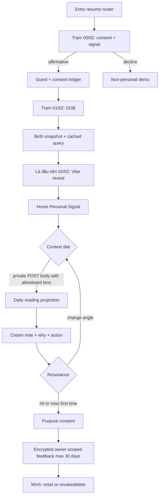

# feat: Integrate Trạm Bắt Sóng and Personal Signal Daily Note

## Goal Capsule

- **Objective:** Người mới đi từ tin tưởng tới Lá đầu tiên trong một hành trình ngắn, sau đó hiểu ngay vì sao Note hôm nay liên quan tới mình và có thể chủ động chọn góc đời thường muốn nghe.
- **Means:** Thay entry hiện tại bằng nghi thức ba hồi Trạm Bắt Sóng; đưa Daily Note về hierarchy “context dial → cream note → why today → action → bounded feedback”; nối lựa chọn context vào reading planner mà không đổi chart facts/confidence.
- **App authority:** Capacitor iOS/Android là sản phẩm phát hành; React web là cùng codebase để QA và không được có behavior riêng.
- **Stop conditions:** Không phát hành nếu DOB/context/feedback lọt vào URL, log hoặc analytics; consent không diễn ra trước DOB; context làm thay đổi evidence/confidence; feedback không reset/xóa được; hoặc app shell không đồng bộ được từ build web.

## Summary

Baseline đã có engine, versioned reading projection, guest ownership, CSRF, encrypted snapshots, offline cache và Capacitor wrapper. Khoảng trống không nằm ở việc tạo thêm một app riêng mà ở khâu tích hợp: onboarding vẫn là carousel và route rời; compute cố tình chờ 1,2 giây rồi Reveal fetch lại; `BackgroundLens` đã có trong planner nhưng chưa đi qua API; resonance feedback chưa có persistence/consent; Home chưa theo reference đã chốt.

Product Contract preservation: Trạm Bắt Sóng plan và US-01–US-03 được giữ nguyên ý nghĩa; plan này hợp nhất implementation của onboarding và Daily Note, đồng thời thêm context/resonance theo quyết định phiên hiện tại.

---

## Problem Frame

UI hiện hành kể đúng những mảnh của sản phẩm nhưng chưa tạo một trải nghiệm liền mạch: người dùng bấm qua nhiều lời hứa, gặp hai lần loading, rồi tới Home nơi mood check-in chiếm vị trí mà reference mới dành cho “Hôm nay chuyện gì đang chiếm sóng?”. Nội dung có provenance nhưng bề mặt chưa cho thấy phần nào đến từ chart, phần nào chỉ là cách diễn đạt gần đời sống. Người dùng cũng chưa có cách nói “trúng/chưa trúng/đổi góc” với ranh giới dữ liệu rõ ràng.

---

## Requirements

- **R1.** Entry mới là ba hồi trên cùng design language: consent + bật tín hiệu, DOB, first Vibe reveal; tối đa hai affirmative decisions trước reveal và không login wall.
- **R2.** Consent phải đứng trước mọi DOB input/request, nói rõ purpose, guest TTL 30 ngày, quyền từ chối/xóa và mở demo không cá nhân hóa nếu từ chối.
- **R3.** DOB validation giữ DD/MM/YYYY, 18+, ngày thật, không tương lai, không quá 120 năm; DOB không vào URL, browser persistence, log, analytics hoặc public artifacts.
- **R4.** Compute không có delay giả và không double-fetch/double-loading; Reveal dùng snapshot đã cache từ successful create, có retry/resume an toàn.
- **R5.** Reveal hiển thị Vibe + Sun/provenance/date-only limitation, xử lý cusp không đoán; hoàn tất onboarding và đi vào Home bằng một primary action có thật.
- **R6.** Home theo reference: Cosmic Glass Signal, Be Vietnam Pro duy nhất, context dial nổi bật, dominant cream note, “Vì sao hôm nay?” disclosure, một CTA thực hành và ba feedback action; scan 3–5 giây ở 390×844.
- **R7.** Context allowlist gồm auto/work/relationships/communication/energy/self-care; lựa chọn chỉ đổi manifestation và micro-action. Planner, evidence, hero factors, confidence và chart facts giữ nguyên.
- **R8.** Context mặc định là ephemeral trong memory; server có thể giữ nó trong owner-scoped encrypted/versioned reading revision để tái lập output, nhưng client không lưu preference ngầm.
- **R9.** Resonance lưu trữ chỉ gồm hit/miss, không free text, giữ tối đa 30 ngày và lần đầu cần disclosure + affirmative consent riêng `reading-resonance-v1`. “Đổi góc” không lưu và không cần consent: nó đưa focus về Context Dial để người dùng tự chọn lens khác.
- **R10.** Resonance được owner-bind, CSRF-protect, idempotent theo note/revision, không phải vote về tính đúng của astrology và chưa được dùng để chẩn đoán/infer personality.
- **R11.** Mình cho xem trạng thái personalization, reset feedback nhưng giữ consent, hoặc tắt/xóa feedback và revoke consent. Guest deletion cascade xóa tất cả.
- **R12.** Mọi navigation/primary action nhìn thấy trong journey Welcome → Consent → Birth → Reveal → Home → Note/Mình phải đi tới surface hoạt động, có loading/error/offline/focus/reduced-motion states.

---

## Key Technical Decisions

- **KTD1. Giữ một React app và sync vào Capacitor.** (session-settled: user-directed — chosen over web-first divergence: app là sản phẩm chính, web chỉ là QA reference.) `apps/web` là source UI; `scripts/sync-mobile.mjs` chứng minh native artifacts nhận cùng build.
- **KTD2. Shared station shell trên các route hiện có.** (session-settled: user-directed — chosen over carousel onboarding: người dùng chọn ba hồi Trạm Bắt Sóng.) Giữ URL để resume/back/deep-link ổn định, nhưng dùng chung visual/state vocabulary và bỏ slide trung gian.
- **KTD3. Body-bounded context thay vì URL/profile inference.** (session-settled: user-directed — chosen over silent context guessing: context chỉ đổi góc đời thường.) `BackgroundLens` đi qua private POST body dùng enum đóng tới planner; config/plan/projection scope tạo phiên riêng, không sửa chart snapshot và không để chủ đề quan hệ/công việc xuất hiện trong URL, history hoặc access log.
- **KTD4. Resonance là domain riêng, không tái sử dụng Mood.** Mood mô tả trạng thái hiện tại; resonance hit/miss đánh giá framing và được giữ tối đa 30 ngày. Tách table/service/API tránh trộn purpose, retention và semantics; “Đổi góc” là hành động không lưu.
- **KTD5. Consent ledger hiện hữu là authority.** Thêm purpose/version vào `consents`, endpoint reset/revoke và cascade hiện có; không tạo local consent flag làm nguồn sự thật.
- **KTD6. Migration additive và rollback-safe.** Chỉ thêm bảng/index/constraint; không rewrite hoặc drop dữ liệu hiện có trong dirty baseline.
- **KTD7. Không mở rộng adaptive ranking trong release này.** Feedback được thu tối thiểu và user-controlled; dùng feedback để tự động thay đổi nội dung cần một quality/privacy experiment riêng. “Đổi góc” đổi context do user chọn ngay, không học ngầm.

---

## High-Level Technical Design

---

## Architecture & Implementation Patterns

- Route resume pattern: `apps/web/src/features/entry/EntryPage.tsx` and `GuestSessionRecord.onboarding_status`.
- Owner + CSRF mutation pattern: `apps/api/app/api/v1/routes/daily_notes.py`, `MoodService`, `PostgresMoodRepository`.
- Deterministic evidence boundary: `apps/api/app/domains/readings/application.py` → `ReadingPlanner` → renderer → gates → immutable projection.
- Context already modeled: `apps/api/app/domains/readings/models.py::BackgroundLens` and `apps/api/app/domains/readings/planner.py`.
- Privacy cleanup pattern: `apps/web/src/shared/storage/clearPersonalData.ts`, guest cascade, `docs/reference/data-inventory-us01-us06.md`.
- App sync/release pattern: `apps/mobile/capacitor.config.ts`, `scripts/sync-mobile.mjs`, `scripts/verify-mobile-config.mjs`.
- UI changes use new focused components/CSS rather than broad rewrites of the already-dirty global stylesheet.

---

## Design Acceptance Criteria

- **DA1.** At 390×844, the first viewport communicates in this order: date/greeting, Context Dial, cream Note; controls and decoration do not compete with the note thesis.
- **DA2.** The onboarding reads as three connected reveals with progress `00/02 → 01/02 → 02/02`; no carousel dots, feature tour, login prompt or second calculation screen appears.
- **DA3.** Cosmic artwork is atmospheric raster imagery behind content, never a CSS-drawn substitute or a screenshot used as the interface. Text and controls remain legible over every crop.
- **DA4.** Be Vietnam Pro is the only product typeface. Heading/body/button sizes follow one compact scale and tolerate Vietnamese diacritics, 320–430px widths and 200% text zoom without clipping.
- **DA5.** Cream paper is reserved for the daily interpretation. Glass surfaces are reserved for context controls, provenance/disclosure, feedback and navigation; acid lime is reserved for selection and the single primary action.
- **DA6.** Every visible control has loading, pressed/selected, success, error, disabled and keyboard/focus behavior where applicable; tap targets are at least 44×44 CSS px.
- **DA7.** The note uses plain contemporary Vietnamese: one specific thesis, one explanation grounded in current evidence, one reversible action. It avoids fate claims, vague “vũ trụ bảo” language and commands that pressure consequential decisions.
- **DA8.** The disclaimer is adjacent and quiet: “Một góc để tự soi, không phải chỉ dẫn cố định.” Provenance expands on request instead of occupying equal visual weight with the reading.

---

## Implementation Units

### U1. Align Product Contract and Data Inventory

**Goal:** Make US-01–US-03, onboarding authority, data inventory and privacy flow describe one product.

**Requirements:** R1–R12.

**Dependencies:** None.

**Files:**

- `docs/user-stories/US-01-bat-dau-che-do-khach.md`
- `docs/user-stories/US-02-khai-ngay-sinh-reveal-la-khai-sinh.md`
- `docs/user-stories/US-03-doc-note-hom-nay.md`
- `docs/reference/data-inventory-us01-us06.md`
- `docs/legal/privacy-security-flow-notes.md`
- `docs/design-directions/tram-bat-song-2026-09-08/README.md`

**Approach:** Add a canonical delta section covering the chosen screen hierarchy, context boundaries, resonance consent/reset/delete, and traceability to existing AC/DoD. Mark adaptive ranking and free-text feedback out of scope.

**Test expectation:** none — documentation alignment is verified against the implemented API/UI and generated contracts in U6.

### U7. Validate the Native Vertical Slice Early

**Goal:** Prove the checked-in Capacitor shells can build and carry the private guest flow before the interface work accumulates around invalid native assumptions.

**Requirements:** R1–R4, R12.

**Dependencies:** None.

**Files:**

- `apps/mobile/capacitor.config.ts`
- `apps/mobile/ios/App/App.xcodeproj/project.pbxproj`
- `scripts/verify-mobile-config.mjs`
- `scripts/verify-mobile-config.test.mjs`

**Approach:** Validate the Capacitor iOS navigation scheme independently from the Xcode target/scheme (they are different concepts), compile Android debug and an unsigned iOS Simulator build using the checked-in native project, then smoke guest creation, cookie/CSRF transport, resume and process-kill recovery using the smallest current journey. Treat an unavailable native toolchain as an explicit release No-Go, not as a web pass.

**Test scenarios:**

1. Android debug and iOS Simulator targets compile from a clean generated-assets sync.
2. Guest creation and a CSRF-protected mutation work inside each WebView.
3. Background/foreground and process-kill recovery return to the correct onboarding status without exposing private content in the app switcher.

**Verification:** Record native build/smoke evidence before U4 begins; repeat the builds with final assets in U6.

### U2. Add Purpose-Bound Resonance Domain

**Goal:** Persist bounded feedback with owner authorization, separate consent and complete reset/revoke deletion.

**Requirements:** R9–R11.

**Dependencies:** None; execute alongside U1.

**Files:**

- `apps/api/app/domains/resonance/models.py`
- `apps/api/app/domains/resonance/repository.py`
- `apps/api/app/domains/resonance/postgres.py`
- `apps/api/app/domains/resonance/service.py`
- `apps/api/app/domains/resonance/tables.py`
- `apps/api/app/infrastructure/crypto.py`
- `apps/api/app/domains/guest/repository.py`
- `apps/api/app/domains/guest/postgres.py`
- `apps/api/app/domains/guest/service.py`
- `apps/api/app/api/v1/routes/daily_notes.py`
- `apps/api/app/main.py`
- `apps/api/app/db/base.py`
- `apps/api/migrations/versions/20260914_0015_resonance_feedback.py`
- `apps/api/tests/resonance/test_service.py`
- `apps/api/tests/daily/test_daily_api.py`
- `apps/api/tests/privacy/test_deletion.py`

**Approach:** Mirror Mood’s service boundary but use one database unit of work for ownership check, consent acceptance and feedback upsert, and another atomic transition for clear + optional revocation. Persist note/revision IDs and timestamps as ownership/idempotency metadata; encrypt hit/miss plus optional lens with the existing record-bound envelope mechanism. Purge rows older than 30 days and include expiry in status/count behavior. Verify note ownership before any consent or feedback write.

**Test scenarios:**

1. Owner submits hit or miss with valid CSRF and consent; upsert returns bounded projection while the raw row does not contain choice/lens plaintext.
2. Missing/wrong consent, CSRF, origin, note ownership or unknown enum fails without row creation.
3. Reset removes feedback and keeps consent active; revoke removes feedback and marks consent revoked.
4. Guest deletion cascades feedback and consent; responses/logs expose no prose, DOB or token.
5. Duplicate submit for the same note/revision is idempotent; rows older than 30 days are purged and absent from status.
6. Fault injection between consent and upsert, and between clear and revoke, rolls back the entire transition.

**Verification:** Migration upgrades from current head; API tests prove ownership, consent lifecycle, deletion and bounded schema.

### U3. Thread Context Through Reading Projection

**Goal:** Make the selected life context produce a distinct, reproducible manifestation/action without changing evidence.

**Requirements:** R7–R8.

**Dependencies:** None; execute alongside U1.

**Files:**

- `apps/api/app/api/v1/routes/daily_notes.py`
- `apps/api/app/domains/readings/application.py`
- `apps/api/app/domains/readings/knowledge.py`
- `apps/api/app/domains/readings/renderers.py`
- `apps/api/app/domains/readings/models.py`
- `apps/api/app/domains/readings/postgres.py`
- `apps/api/app/domains/readings/tables.py`
- `apps/api/app/domains/readings/planner.py`
- `apps/api/migrations/versions/20260914_0016_context_projection_variant.py`
- `apps/api/tests/readings/test_application.py`
- `apps/api/tests/readings/test_knowledge.py`
- `apps/api/tests/readings/test_planner.py`
- `apps/api/tests/readings/test_renderers.py`
- `apps/api/tests/readings/test_revision_repository.py`
- `apps/api/tests/daily/test_daily_api.py`

**Approach:** Add a private context projection endpoint whose body accepts only `BackgroundLens`; pass it into planner; retain factor selection and evidence identity while renderer selects approved manifestation/action. Add an opaque lens variant to the projection persistence identity and migration while preserving existing auto scope keys. Extend the approved knowledge/rendering catalog so date-only, cusp, limited and full-synthesis plans all produce visibly distinct context manifestations/actions without inventing facts. Keep the existing GET as the context-free default so no personal context is serialized into URLs.

**Test scenarios:**

1. Same chart/date with auto and relationships keeps factor refs/confidence identical but changes manifestation/action.
2. Same lens is deterministic and replays the same revision.
3. Unknown lens returns validation error before synthesis.
4. Date-only, cusp and limited modes change approved manifestation/action for every lens while remaining one-factor and never inventing Moon/house/transit.
5. A populated database stores auto and multiple context projections without collision or cross-context replay.

**Verification:** Planner/application tests compare semantic fields, hashes and evidence across contexts.

### U4. Replace Onboarding with Three-Act Trạm Bắt Sóng

**Goal:** Implement the selected consent/date/reveal reference as a short, recoverable app-first flow.

**Requirements:** R1–R5, R12.

**Dependencies:** U7; execute documentation work in U1 alongside this unit.

**Files:**

- `apps/web/src/features/welcome/WelcomePage.tsx`
- `apps/web/src/features/consent/ConsentPage.tsx`
- `apps/web/src/features/birth/BirthDatePage.tsx`
- `apps/web/src/features/reveal/RevealPage.tsx`
- `apps/web/src/features/entry/EntryPage.tsx`
- `apps/web/src/shared/ui/SignalStationFrame.tsx`
- `apps/web/src/shared/styles/signal-experience.css`
- `apps/web/src/main.tsx`
- `apps/web/src/features/welcome/WelcomePage.test.tsx`
- `apps/web/src/features/birth/BirthDatePage.test.tsx`
- `apps/web/tests/e2e/product-flow.spec.ts`

**Approach:** Keep resume-capable routes but share station progress/visual shell. Welcome becomes one trust screen; consent is affirmative and demo remains available. Remove artificial wait; write successful birth response to query cache so Reveal does not repeat loading. Reveal uses one primary transition and reduced-motion-safe eclipse treatment.

**Test scenarios:**

1. New guest reaches reveal with consent + DOB only; no carousel/login.
2. Decline opens demo without creating guest/profile.
3. Invalid/under-18 DOB never calls birth endpoint and focus/error are announced.
4. Slow/error/retry and refresh resume without duplicate profile.
5. Reveal reuses created snapshot, handles cusp and completes onboarding.
6. 320/390/430px, 200% text, keyboard, VoiceOver semantics and Reduce Motion preserve all content/actions.

**Verification:** Component tests and Playwright cover all three acts and network call counts.

### U5. Build Personal Signal Home and Feedback UX

**Goal:** Match the selected Daily Note hierarchy and make every visible control functional.

**Requirements:** R6–R12.

**Dependencies:** U2, U3, U4.

**Files:**

- `apps/web/src/features/home/HomePage.tsx`
- `apps/web/src/features/home/NoteDetailPage.tsx`
- `apps/web/src/features/profile/ProfilePage.tsx`
- `apps/web/src/shared/ui/SignalContextPicker.tsx`
- `apps/web/src/shared/ui/ResonanceFeedback.tsx`
- `apps/web/src/shared/ui/ReadingContent.tsx`
- `apps/web/src/shared/api/client.ts`
- `apps/web/src/shared/storage/clearPersonalData.ts`
- `apps/web/src/shared/styles/signal-experience.css`
- `apps/web/src/features/home/HomePage.test.tsx`
- `apps/web/src/features/home/NoteDetailPage.test.tsx`
- `apps/web/src/features/profile/ProfilePage.test.tsx`
- `apps/web/tests/e2e/product-flow.spec.ts`

**Approach:** Context picker calls the private body endpoint and keeps the chosen lens only in component memory; cream card shows one thesis and a short body; disclosure opens provenance; CTA presents the single micro-action. Hit/miss first opens just-in-time consent, then stores the encrypted enum. “Đổi góc” never writes feedback: it focuses/opens the Context Dial and waits for an explicit lens tap; cancelling preserves the current note. Profile exposes status, reset and revoke/delete. Keep Mood check-in as a secondary section below the note/feedback hierarchy so it remains useful without competing with Context Dial.

**Test scenarios:**

1. Context chip updates manifestation/action while the evidence disclosure remains unchanged.
2. First hit/miss requires consent; cancel writes nothing; accept sends only enum/lens/note/revision.
3. Hit/miss state is announced; change-angle focuses the picker, cancel preserves state, and an explicit new lens visibly changes note framing.
4. Reset and revoke/delete from Mình update UI and server state; whole-guest deletion clears any device state.
5. Why disclosure, primary action, Mood section, share/save, nav and profile controls all reach working surfaces.
6. Offline/cached/error state never claims context-specific content was freshly generated when it was not.

**Verification:** RTL and E2E assertions cover content hierarchy, interactions, focus, live regions and API payloads.

### U6. Contracts, Mobile Sync and Release Gates

**Goal:** Prove web QA and native app ship the same complete journey with current documentation/security/privacy controls.

**Requirements:** R1–R12.

**Dependencies:** U2–U5.

**Files:**

- `packages/contracts/openapi/v1.json`
- `packages/contracts/src/v1.ts`
- `apps/mobile/ios/App/App/PrivacyInfo.xcprivacy`
- `scripts/verify-privacy.mjs`
- `scripts/verify-mobile-config.mjs`
- `scripts/verify-mobile-config.test.mjs`
- `docs/reviews/2026-09-14-signal-note-release-review.md`

**Approach:** Regenerate API contracts; classify resonance as linked product interaction used for app functionality/personalization and not tracking; verify no API response caching, URL/log/analytics leaks, or native-only gap. Sync built web assets to Capacitor after all tests pass, then compile and run the production journey on both iOS Simulator and Android emulator/device.

**Test scenarios:**

1. OpenAPI drift check passes and client types reject unknown lens/feedback values.
2. Privacy verifier detects forbidden DOB/context/feedback in analytics/log/public projection fixtures.
3. Mobile guard proves `webDir`, API allowlist and synced assets are correct.
4. Full QA journey runs against the production build in both native targets, including launch, onboarding, private context POST, feedback/reset, offline-resume, keyboard, safe areas and all visible nav/primary actions.

**Verification:** Build, lint, typecheck, API/web tests, E2E smoke, privacy/runtime checks, Capacitor sync and actual native build/runtime smokes complete with a review receipt. An unavailable platform toolchain is recorded as a release No-Go.

---

## System-Wide Impact

- **API/data:** additive feedback table and new enum endpoints; the existing Daily Note GET stays context-free while contextualization uses a private POST body.
- **Reading engine:** no new astrology facts; only existing `BackgroundLens` becomes caller-controlled.
- **Client/cache:** cache and React Query keys must include context to prevent cross-context stale display; DOB remains volatile.
- **Mobile:** same built assets; privacy manifest and store declarations need to describe bounded product-interaction feedback.
- **Operations:** monitor validation/authorization failures and resonance endpoint errors only as aggregate categories; no user-level event stream.

---

## Risk Analysis & Mitigation

- **Dirty-worktree collision:** touch only scoped files, inspect diffs before/after and never reset/reformat unrelated files.
- **Projection collision across contexts:** include background lens in plan/config hash and test distinct deterministic scopes.
- **Consent dark pattern:** feedback tap opens a short disclosure; only explicit confirm writes. Decline keeps reading usable.
- **Behavioral profiling:** store no free text or inferred trait, encrypt bounded feedback, purge after 30 days and expose reset/revoke/delete.
- **Native leakage:** no feedback queue or context preference in localStorage; keep private API responses `no-store`; run MASVS-oriented storage/log checks.
- **Visual regression:** new scoped CSS layer, one font, opaque cream reading surface, 44px targets, 200% text and reduced-motion checks.

---

## Scope Boundaries

### In Scope

- US-01–US-03 entry through Daily Note, context dial, why/action, resonance and Profile controls.
- Existing Save/Share, Explore, Saved, Profile navigation remains reachable and functional.
- API contracts, migration, docs, privacy manifest and Capacitor sync.

### Deferred to Follow-Up Work

- Automatic ranking/adaptation from resonance history.
- Free-text journaling, chatbot, push-notification personalization and analytics SDKs.
- Redesign of US-07+ feature interiors beyond keeping their existing navigation entry working.

### Out of Scope

- Changing astrology calculations, chart truth, confidence, account/auth strategy or public share semantics.
- Separate native UI implementation diverging from the shared Capacitor app.

---

## Sources & Research

- Existing implementation: `apps/web/src/features/home/HomePage.tsx`, `apps/web/src/features/welcome/WelcomePage.tsx`, `apps/api/app/domains/readings/application.py`, `apps/api/app/domains/readings/planner.py`.
- Existing product authority: `plans/2026-09-08-1845-feat-tram-bat-song-onboarding-plan.md`, `docs/user-stories/US-01-bat-dau-che-do-khach.md`, `docs/user-stories/US-02-khai-ngay-sinh-reveal-la-khai-sinh.md`, `docs/user-stories/US-03-doc-note-hom-nay.md`.
- Vietnam Personal Data Protection Law 91/2025/QH15, effective 2026-01-01: https://vanban.chinhphu.vn/?docid=214590&pageid=27160
- Decree 356/2025/NĐ-CP implementing the law, effective 2026-01-01: https://vanban.chinhphu.vn/default.aspx?docid=216387&pageid=27160
- OWASP MASVS Storage and Privacy control groups: https://mas.owasp.org/MASVS/
- Apple App Privacy and privacy-manifest guidance: https://developer.apple.com/app-store/user-privacy-and-data-use/ and https://developer.apple.com/documentation/bundleresources/describing-data-use-in-privacy-manifests
- Capacitor Preferences is unencrypted key/value storage and therefore not a store for birth data or feedback history: https://capacitorjs.com/docs/apis/preferences

---

## Verification Contract

### Automated gates

- API domain, route, ownership, CSRF, consent, migration and deletion tests pass against the repository-supported database configurations.
- Reading invariant tests prove that changing context or requesting “Đổi góc” leaves chart snapshot, selected factors, evidence references, precision and confidence unchanged.
- Generated OpenAPI and TypeScript contracts match runtime routes; unknown context/feedback values and extra body fields are rejected.
- Web unit tests and the production-build E2E journey cover fresh guest, consent decline, valid/invalid DOB, first reveal, contextual note, provenance, action, resonance, reset/revoke, save/share and all four bottom-nav destinations.
- Privacy/no-mock/mobile guards pass; production web assets are synced into the Capacitor iOS and Android projects.

### Visual and accessibility gates

- Capture and compare Welcome, Birth, Reveal and Home against the two selected references at 390×844; record deviations and only accept ones needed for real data, platform safe areas or accessibility.
- Smoke-check 320, 390 and 430px widths, 200% text zoom, keyboard traversal, visible focus, screen-reader names, reduced motion/transparency and light/dark setting behavior.
- Verify the cream note remains the dominant content surface, the primary CTA stays within reach, and no bottom navigation or disclosure is clipped by safe areas.
- Before production release, ask representative target users to explain without prompting why the Note is relevant and which parts are fixed chart evidence versus context-dependent framing; a majority must distinguish both correctly or the hierarchy/copy returns to iteration.

### Security and privacy gates

- Inspect requests, URLs, browser history, logs, analytics fixtures, caches and public/share payloads for DOB, time/place, guest token, chosen context, feedback history and private reading prose.
- Prove note ownership before consent or feedback mutation, `no-store` on private responses, enum-only bodies, CSRF/trusted-origin enforcement, idempotent feedback writes and complete guest-deletion cascade.
- Review iOS Privacy Manifest/App Privacy and Android data disclosure against actual runtime collection; legal counsel remains the production release gate for impact-assessment and cross-border-processing obligations.

---

## Definition of Done

- U1–U7 are implemented without reverting unrelated dirty-worktree changes.
- A new user reaches a useful Vibe after exactly two affirmative actions and without an account wall, carousel or duplicate loading phase.
- Home matches the selected Context Dial composition and every visible CTA/navigation item performs its promised action with real API/state behavior.
- Context produces a visibly different, specific manifestation/action while all astrology facts and evidence remain demonstrably identical.
- Resonance is optional, purpose-consented, bounded to three choices, never free text, and can be reset, revoked and deleted from Mình.
- Product docs, user stories, data inventory, privacy notes, OpenAPI/contracts and runtime behavior agree.
- Production web QA build passes, Capacitor assets are synced for both platforms, and the release review records any environment-only No-Go items instead of claiming them complete.

## Assumptions

- The current feature branch and dirty working tree are the intended integration baseline.
- “Đổi góc” is immediate user-directed context rotation, not hidden learning.
- Existing `consents` table remains the legal/technical consent ledger; qualified Vietnamese legal review remains a release gate.
