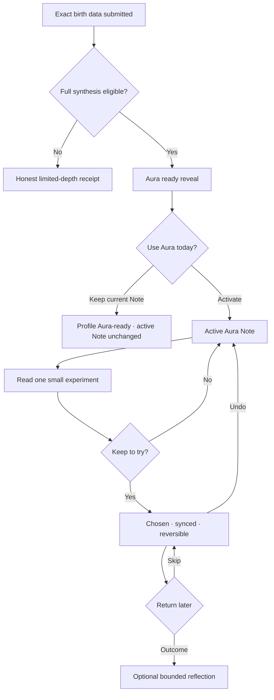
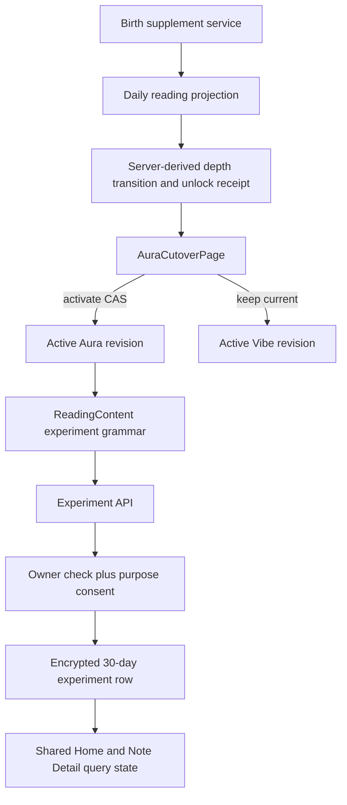

# Aura Cutover and One Small Experiment - Plan

## Goal Capsule

- **Objective:** Khi dữ liệu giờ và nơi sinh mở được bản đọc sâu, người dùng nhận ra ngay giá trị mới, tự quyết định có đổi Note hôm nay hay không, rồi có thể giữ một thử nghiệm nhỏ đủ rõ để quay lại đánh giá.
- **Means:** Kết hợp Aura Cutover Reveal với One Small Experiment thành một hành trình liên tục nhưng giữ hai quyết định độc lập.
- **Product authority:** Ứng dụng iOS/Android là sản phẩm chính; web dùng cùng source để QA và không có hành vi riêng.
- **Open blockers:** Không có quyết định sản phẩm nào còn chặn planning.

---

## Product Contract

### Summary

Sau khi tính được full chart, Lá Lành mở một màn “Aura đã sẵn sàng” để cho thấy đúng lớp thông tin vừa được mở và cho người dùng chọn có dùng bản đọc mới hôm nay hay không. Khi Aura đã active, Note đề xuất một thử nghiệm nhỏ gồm việc cần thử, điều cần để ý và quyền dừng; người dùng có thể giữ, bỏ giữ hoặc phản hồi sau mà không bị tạo áp lực hoàn thành.

### Problem Frame

Luồng hiện tại đã tính được chart sâu và tạo revision Aura nhưng payoff trên giao diện quá yếu: người dùng có thể quay về Home vẫn thấy Note cũ, khó phân biệt giá trị của giờ và nơi sinh. CTA “Mình thử việc này” chỉ đổi một state cục bộ, biến mất khi đổi màn hoặc đổi góc và không nói rõ cú chạm vừa làm gì.

Hai khoảng trống này làm đứt cùng một vòng giá trị: dữ liệu nhạy cảm không tạo ra khoảnh khắc mở khóa đủ thuyết phục, còn insight mới không chuyển thành một hành động nhỏ có thể kiểm chứng trong đời sống.

### Key Decisions

- **Aura reveal và thử nghiệm nhỏ là một journey nhưng hai consent riêng.** (session-settled: user-directed — chosen over implementing Aura reveal or action CTA in isolation: user chose option 1 combined with option 3 so the unlock has an immediate but optional everyday payoff.) Governs R1, R5, R8.
- **Profile depth và active Note depth là hai trạng thái khác nhau.** Người dùng có thể đã Aura-ready nhưng vẫn giữ Note Vibe hôm nay. Governs R2, R4.
- **Giữ để thử không có nghĩa là đã làm xong.** Outcome chỉ phản ánh độ hữu ích của thử nghiệm, không xác nhận chiêm tinh đúng hay sai. Governs R9, R11.
- **App-first, one-codebase.** Hành vi trên web QA và Capacitor phải đồng nhất. Governs R14.

### Requirements

**Aura unlock and activation**

- R1. Khi bổ sung giờ và nơi sinh tạo được `full_synthesis`, ứng dụng phải mở Aura Cutover Reveal trước khi quay về Home.
- R2. Hệ thống phải công bố `profile_readiness`; active và available depth tiếp tục được suy ra từ `active.mode` và `available_update.content.mode` để profile có thể Aura-ready mà Note hiện tại vẫn là Vibe mà không tạo nguồn sự thật thứ hai.
- R3. Reveal chỉ nêu các lớp thực sự có trong kết quả đã tính, dùng allowlist như tổ hợp đa-factor, House arena, Rising/angles và current-sky phase; lớp không đủ evidence không được xuất hiện.
- R4. Reveal phải cho xem preview có ý nghĩa và hai lựa chọn rõ: “Dùng Aura hôm nay” kích hoạt revision mới; “Giữ Note hiện tại” giữ nguyên active revision nhưng không làm mất trạng thái Aura-ready.
- R5. Kích hoạt Aura không được tự động giữ hoặc bắt đầu thử nghiệm nhỏ; thử nghiệm là quyết định riêng sau khi người dùng đọc Note mới.
- R6. Nếu activation conflict, app phải bỏ preview stale, refetch trạng thái mới nhất và phân biệt: revision đã active, revision mới đã thay thế, profile bị hạ precision hoặc dữ liệu đã bị xóa.
- R7. Nếu dữ liệu chỉ tạo được chart limited hoặc không đủ điều kiện full synthesis, ứng dụng phải báo trung thực phần đã cải thiện và không dùng nhãn “Aura đã sẵn sàng”.

**One Small Experiment**

- R8. Note Aura active phải trả một experiment projection có cấu trúc server-owned gồm `action_key`, hành vi reversible, dấu hiệu cần quan sát và quyền bỏ qua hoặc dừng; client không được parse prose để tự tạo các phần này.
- R9. CTA “Giữ để thử hôm nay” phải tạo trạng thái `chosen` được gắn với daily note, active revision, lens và action key; trạng thái này đồng bộ giữa Home và Note Detail.
- R10. Người dùng phải có thể “Bỏ giữ” ngay; việc bỏ giữ xóa trạng thái đang giữ và không được tạo streak, cảnh báo hay thông điệp gây tội lỗi.
- R11. Card “việc đang giữ” cho phép người dùng chủ động mở phần nhìn lại và chọn `Chưa thử`, `Có ích`, `Không khác`, `Không hợp lúc này`; app không tự bật prompt, outcome đóng experiment và tách khỏi Resonance `Trúng/Chưa trúng`.
- R12. Mỗi guest chỉ có một experiment chưa đóng; chọn experiment khác phải xác nhận thay thế và dùng expected experiment identity/version để không ghi đè ngầm giữa thiết bị.

**Privacy, safety, and lifecycle**

- R13. Experiment không nhận text do người dùng hoặc client tự viết; API chỉ nhận bounded action key/revision/lens và server hydrate nội dung từ accepted revision. Dữ liệu không đi vào URL, log, analytics hoặc public share; mutation được owner-bind, trusted-origin + CSRF-protect, mã hóa khi lưu, purge vật lý sau tối đa 30 ngày và xóa theo guest deletion.
- R14. UI phải hoạt động ở mobile viewport 320–430px, dùng Be Vietnam Pro và Cosmic Glass Signal; native app và web QA dùng cùng contract, loading, error, offline và reduced-motion behavior.
- R15. Copy không được xúi giục quyết định quan trọng về sức khỏe, tiền bạc, công việc hoặc quan hệ; disclaimer tinh tế đặt gần thử nghiệm và luôn giữ quyền quyết định cho người dùng.
- R16. Lựa chọn “Giữ Note hiện tại” phải được acknowledge bền vững theo transition identity để không ép mở lại fullscreen sau restart; available Aura vẫn có lối vào rõ ở Home và Note Detail.
- R17. Khi giờ/nơi sinh bị thu hồi hoặc current chart snapshot thay đổi, hệ thống phải vô hiệu hóa available Aura cũ và xóa mọi experiment phụ thuộc revision cũ trong cùng privacy lifecycle.

### Key Flows

- F1. Aura becomes ready
  - **Trigger:** Người dùng submit giờ và nơi sinh đủ chính xác; engine tạo full-synthesis revision.
  - **Steps:** Profile chuyển Aura-ready → app mở cutover → receipt liệt kê lớp vừa mở → preview Note Aura → người dùng chọn activate hoặc giữ Note hiện tại.
  - **Outcome:** Trạng thái profile và active Note luôn minh bạch; không có hot-swap.
  - **Covers:** R1–R7.

- F2. Keep one experiment
  - **Trigger:** Người dùng đang xem active Aura Note và đọc micro-experiment.
  - **Steps:** Xem hành vi + observation cue + quyền dừng → chạm “Giữ để thử hôm nay” → state đồng bộ Home và Note Detail → có thể bỏ giữ.
  - **Outcome:** Cú chạm tạo một ý định có thể quay lại, không giả là đã hoàn thành.
  - **Covers:** R5, R8–R10, R12.

- F3. Reflect without pressure
  - **Trigger:** Người dùng quay lại khi một experiment vẫn còn hiệu lực và chủ động mở card “việc đang giữ”.
  - **Steps:** App mở bốn outcome đóng → người dùng chọn hoặc đóng card → outcome được lưu riêng khỏi Resonance và experiment chuyển sang `reflected`.
  - **Outcome:** Sản phẩm học về usefulness của action mà không biến nó thành bằng chứng cho astrology.
  - **Covers:** R11, R13, R15.

### Acceptance Examples

- AE1. **Covers R1, R2, R4, R5.** Given một user đang có active Vibe Note, when exact time/place tạo được full synthesis, then app mở Aura Cutover, profile báo Aura-ready và active Note chỉ đổi sau khi user chạm “Dùng Aura hôm nay”; không experiment nào tự được giữ.
- AE2. **Covers R3, R7.** Given chart không có eligible House hoặc current-sky evidence, when receipt được render, then receipt không được nêu lớp đó và không nâng nhãn vượt quá kết quả engine.
- AE3. **Covers R4, R6.** Given available revision đã stale hoặc được activate ở thiết bị khác, when user activate, then app refetch và hiển thị trạng thái hiện tại mà không tạo revision sai hoặc mất active Note.
- AE4. **Covers R8–R10.** Given Aura Note đang active, when user giữ structured experiment, then Home và Note Detail cùng hiển thị hành vi, observation cue và quyền dừng; when user bỏ giữ, state biến mất ở cả hai nơi mà không có streak hoặc guilt copy.
- AE5. **Covers R11.** Given experiment đang giữ, when user chủ động mở phần nhìn lại và chọn `Không hợp lúc này`, then experiment đóng và outcome không thay đổi Resonance.
- AE6. **Covers R12.** Given user đã giữ một experiment rồi đổi lens, when user muốn giữ action mới, then app nói rõ sẽ thay experiment đang giữ, gửi expected identity/version và chỉ thay khi server CAS thành công.
- AE7. **Covers R13, R17.** Given mutation thiếu CSRF hoặc client gửi text/action key sai, then request bị từ chối không ghi consent/data; given precision bị thu hồi, then row/ciphertext/cache phụ thuộc bị xóa.
- AE8. **Covers R14–R15.** Given app ở 320/390/430px, 200% text, Reduce Motion hoặc Reduce Transparency, when user đi hết flow, then target 44px, copy, focus, live announcements và layout vẫn dùng được, không gây áp lực.
- AE9. **Covers R16.** Given user chọn giữ Note hiện tại, when app restart, then fullscreen không bị ép mở lại và Home vẫn có lối vào available Aura.

### Success Criteria

- Người dùng có thể nói được khác biệt giữa “đã mở Aura” và “đang dùng Aura cho Note hôm nay” sau một lần đi qua reveal.
- Không còn CTA hành động chỉ đổi state cục bộ; state giữ/bỏ giữ khớp giữa Home, Note Detail và lần mở app kế tiếp.
- Tất cả claim mở khóa đều truy về evidence đủ điều kiện; test fail nếu UI nêu một lớp chưa được engine xác nhận.
- Security/privacy checks chứng minh mutation có owner check + CSRF, dữ liệu không vào URL/log/public payload và guest deletion xóa experiment.

### Scope Boundaries

- Không tự học personality hoặc tự xếp hạng action từ outcome trong release này.
- Không tạo streak, reminder push, gamification completion hoặc task list nhiều action.
- Không thay đổi chart facts, factor selection hay confidence dựa trên context hoặc outcome.
- Không buộc đăng nhập để mở Aura hoặc giữ experiment trong guest lifecycle hiện tại.
- Không đưa experiment/outcome vào share card hay public artifact.

### Dependencies and Assumptions

- Versioned reading projection và explicit activation hiện tại tiếp tục là authority cho active/available revision.
- Full-synthesis eligibility tiếp tục do engine và reading planner quyết định; UI chỉ render receipt server-authorized.
- Consent ledger, guest ownership, encryption và delete cascade hiện tại được mở rộng thay vì tạo local-only authority.

### Sources and Research

- `docs/ideation/2026-09-14-daily-note-personalization-matrix-ideation.html`
- `docs/plans/2026-09-14-2047-feat-signal-note-experience-plan.md`
- `docs/foundation/la-lanh-reading-knowledge-spec.md`
- `docs/foundation/la-lanh-astro-engine-spec.md`
- `docs/user-stories/US-03-doc-note-hom-nay.md`
- `docs/user-stories/US-06-bo-sung-gio-noi-sinh.md`
- Apple Human Interface Guidelines, Privacy: ask for sensitive data in context and explain immediate value.
- CHANI astrology education: exact birth time enables angles and House-specific interpretation.

---

## Planning Contract

### Key Technical Decisions

- KTD1. **Derive the unlock receipt from accepted evidence, not profile copy.** Add only profile readiness, transition identity/acknowledgement and a closed unlock-layer receipt; active/available depth remain authoritative in existing content modes. Governs R2, R3, R7, R16.
- KTD2. **Strengthen the existing projection CAS path.** Activation verifies expected revision, current chart snapshot/profile generation and full-synthesis eligibility; a `409` refetches and resolves through the explicit conflict matrix. Governs R4, R6, R17.
- KTD3. **Persist experiments in a dedicated purpose-bound domain.** Mirror Resonance's owner check, atomic consent, encrypted payload, TTL and deletion pattern, but use one active row per daily note and separate outcome semantics. Governs R9–R13.
- KTD4. **Do not duplicate accepted reading prose.** The row keeps immutable experiment ID/version, source note/revision and expiry in relational columns; lens, action key and optional outcome are encrypted, while displayed prose is hydrated from the accepted encrypted revision. Governs R9, R12, R13, R17.
- KTD5. **Use one shared client hook for Home and Note Detail.** Both surfaces read and mutate the same server state through TanStack Query; no local `actionDone` authority remains. Governs R9, R10, R14.
- KTD6. **Route exact full-synthesis success directly to a dedicated cutover screen.** Limited results remain in the existing honest success state. (session-settled: user-directed — chosen over leaving the gift as a Home card: the selected Aura Cutover must make the unlock unmistakable.) Governs R1, R4, R7.

### High-Level Technical Design

### Data and API Contract

- `ReadingProjection.aura_transition` returns profile readiness, opaque transition identity, acknowledgement and `unlock_layers`; active/available mode stay in their existing fields. It is private and inherits `Cache-Control: no-store`.
- Experiment create accepts only active revision, bounded lens and server-rendered action key. A different open experiment returns `409`; replace requires expected experiment ID/version and a fresh confirmation.
- Experiment status returns the guest's one open experiment or `null`; outcome and undo address immutable experiment ID/version and reject replaced, expired or stale targets.
- Delete removes the experiment immediately; revision/precision withdrawal and guest deletion cascade it, and the operational cleanup command physically removes expired rows in bounded batches.
- The first choose mutation carries `action-experiment-v1`; the backend accepts that purpose in the same transaction as the experiment write so a failed write cannot leave orphan consent.

### Sequencing

1. Add projection depth metadata and contract tests first so the UI never invents unlock layers.
2. Add the experiment domain, migration, API and privacy tests before wiring the CTA.
3. Add Aura Cutover route and shared experiment hook/components.
4. Replace local action state on Home and add parity on Note Detail.
5. Update product docs/data inventory, regenerate contracts, run mobile sync and complete app-sized QA.

---

## Implementation Units

### U1. Align the product and privacy contract

- **Goal:** Make US-03, US-06 and the data inventory describe the split depth state and experiment lifecycle without contradicting the existing no-hot-swap rule.
- **Requirements:** R1–R17.
- **Files:** `docs/user-stories/US-03-doc-note-hom-nay.md`, `docs/user-stories/US-06-bo-sung-gio-noi-sinh.md`, `docs/reference/data-inventory-us01-us06.md`, `docs/legal/privacy-security-flow-notes.md`.
- **Verification:** Trace every new API field and stored datum to purpose, retention, deletion and share exclusions.

### U2. Publish an evidence-bound Aura depth receipt

- **Goal:** Give clients an honest, typed description of what exact birth data unlocked.
- **Requirements:** R2, R3, R6, R7.
- **Files:** `apps/api/app/domains/readings/models.py`, `apps/api/app/domains/readings/application.py`, `apps/api/tests/readings/test_application.py`, `apps/api/tests/daily/test_daily_api.py`, `packages/contracts/openapi/v1.json`, `packages/contracts/src/v1.ts`.
- **Patterns:** Reuse accepted `EvidenceClaim.template_id`; do not expose internal plan/factor data or infer from display prose.
- **Test scenarios:** Vibe only, Aura ready, Aura active, House absent, angle absent, transit absent and stale activation conflict.

### U3. Add the bounded experiment domain

- **Goal:** Persist one reversible experiment per daily note with separate optional outcome.
- **Requirements:** R9–R13, R15, R17.
- **Files:** `apps/api/app/domains/experiments/models.py`, `apps/api/app/domains/experiments/repository.py`, `apps/api/app/domains/experiments/postgres.py`, `apps/api/app/domains/experiments/service.py`, `apps/api/app/domains/experiments/tables.py`, `apps/api/app/domains/experiments/errors.py`, `apps/api/app/api/v1/routes/daily_notes.py`, `apps/api/app/main.py`, `apps/api/app/db/base.py`, `apps/api/app/domains/birth/postgres.py`, `apps/api/scripts/cleanup_expired.py`, `apps/api/migrations/versions/20260916_0017_daily_experiments.py`, `apps/api/tests/experiments/test_postgres.py`, `apps/api/tests/daily/test_daily_api.py`, `apps/api/tests/privacy/test_deletion.py`, `docs/operations/aura-experiment-retention-runbook.md`, `scripts/verify-privacy.mjs`.
- **Patterns:** Follow Resonance for owner-first authorization, atomic purpose consent, envelope encryption, no-store responses, purge and fault-injection rollback.
- **Test scenarios:** choose, idempotent replay, CAS replace, reject silent/stale replace, stale outcome, undo, each outcome, wrong owner/revision/action key, CSRF/origin failure, physical expiry cleanup, precision-withdraw cascade, ciphertext assertion, no log/share/URL leakage and rollback after consent.

### U4. Build Aura Cutover Reveal

- **Goal:** Turn an exact full-chart recompute into a visible, user-controlled value transition.
- **Requirements:** R1–R7, R14–R17.
- **Files:** `apps/web/src/features/birth/BirthSupplementPage.tsx`, `apps/web/src/features/reveal/AuraCutoverPage.tsx`, `apps/web/src/features/reveal/AuraCutoverPage.test.tsx`, `apps/web/src/app/router.tsx`, `apps/web/src/shared/hooks/useReadingUpdateActivation.ts`, `apps/web/src/shared/styles/signal-note.css`, `apps/api/migrations/versions/20260916_0018_aura_transition_acknowledgement.py`, `apps/web/tests/e2e/product-flow.spec.ts`.
- **Patterns:** Use the cached/refetched Daily Note from supplement success, the existing activation hook and Cosmic Glass Signal tokens; do not duplicate chart calculation.
- **Test scenarios:** ready/limited/pending/failed cutover, keep-current acknowledgement and restart, activate, refresh/deep-link/already-active, each activation conflict, cached/offline/error states, 320/390/430px, 200% text, keyboard/focus, reduced motion/transparency and safe areas.

### U5. Replace the fake CTA with One Small Experiment

- **Goal:** Make the action CTA explain its effect and persist the user's intention across product surfaces.
- **Requirements:** R5, R8–R15, R17.
- **Files:** `apps/web/src/shared/api/client.ts`, `apps/web/src/shared/hooks/useDailyExperiment.ts`, `apps/web/src/shared/ui/ReadingContent.tsx`, `apps/web/src/shared/ui/ReadingContent.test.tsx`, `apps/web/src/features/home/HomePage.tsx`, `apps/web/src/features/home/HomePage.test.tsx`, `apps/web/src/features/home/NoteDetailPage.tsx`, `apps/web/src/features/home/NoteDetailPage.test.tsx`, `apps/web/src/shared/styles/signal-note.css`.
- **Patterns:** Query state is server authority; optimistic UI must roll back on failure. Show observation cue and right-to-stop as product copy, and require an explicit replace confirmation when another action is already held.
- **Test scenarios:** loading/available/choosing/chosen/undoing/replace-confirming/reflecting/reflected/expired/error, refresh/focus/reconnect persistence, lens change, CAS replace confirmation, offline rollback, each outcome and independent Resonance state.

### U6. Regenerate contracts and verify the app vertical slice

- **Goal:** Prove backend, shared web UI and Capacitor app carry one behavior from supplement through experiment reflection.
- **Requirements:** R1–R17.
- **Files:** `packages/contracts/openapi/v1.json`, `packages/contracts/src/v1.ts`, `apps/web/tests/e2e/product-flow.spec.ts`, `docs/reviews/2026-09-16-aura-experiment-release-review.md`.
- **Verification:** Run targeted tests during each unit, then full contract, privacy, web, API, unmocked QA vertical slice and mobile sync gates; capture synthetic-data screenshots at 320/390/430px and smoke the final bundle on iOS Simulator and Android emulator when the local toolchains are available.

---

## Verification Contract

| Gate | Command | Covers | Pass signal |
|---|---|---|---|
| Backend focused | `uv run --directory apps/api pytest tests/readings/test_application.py tests/experiments tests/daily/test_daily_api.py tests/privacy/test_deletion.py` | U2, U3 | Depth receipt, ownership, encryption, TTL and deletion tests pass. |
| Backend quality | `pnpm api:lint && pnpm api:typecheck && pnpm api:test` | U2, U3 | Ruff, mypy and full pytest pass. |
| Web focused | `pnpm --filter @la-lanh/web test -- AuraCutoverPage ReadingContent HomePage NoteDetailPage` | U4, U5 | Reveal and persistent experiment behavior pass. |
| Contracts | `pnpm contracts:generate && pnpm contracts:check` | U2, U3, U6 | OpenAPI and generated TypeScript are in sync. |
| Privacy/runtime | `pnpm verify:runtime` | U1–U6 | No private fields leak to URLs/share/cache and mobile configuration remains valid. |
| Product build | `pnpm qa:test` | U4–U6 | Production web build, QA server and smoke test pass. |
| Browser vertical slice | `pnpm web:e2e` | U4–U6 | Supplement → cutover → activate → choose/undo works through the QA server contract. |
| Native packaging | `pnpm mobile:sync` | U6 | Capacitor bundles receive the verified build without behavior forks. |
| Native runtime | iOS Simulator and Android emulator smoke | U6 | Session, CSRF, cutover, activate, choose/undo and restart work in both WebViews; unavailable toolchain is reported as a release No-Go, not a pass. |

---

## Definition of Done

- Exact full-synthesis supplement opens Aura Cutover; limited results never overclaim Aura.
- Profile, available and active depths are represented separately and tested.
- User can keep current Note or activate Aura; a conflict resolves without data loss.
- Aura Note presents one reversible experiment with an observation cue and right-to-stop.
- Choose, replace, undo and outcome persist consistently on Home and Note Detail.
- Experiment data is purpose-bound, owner-checked, CSRF-protected, encrypted, no-store, TTL-limited, guest-deletable and excluded from public artifacts.
- Contracts, backend, frontend, privacy/runtime, QA build and mobile sync gates pass.
- Product docs and data inventory match the shipped behavior.
