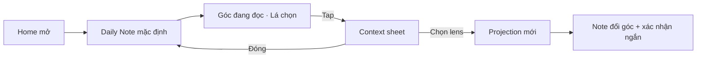
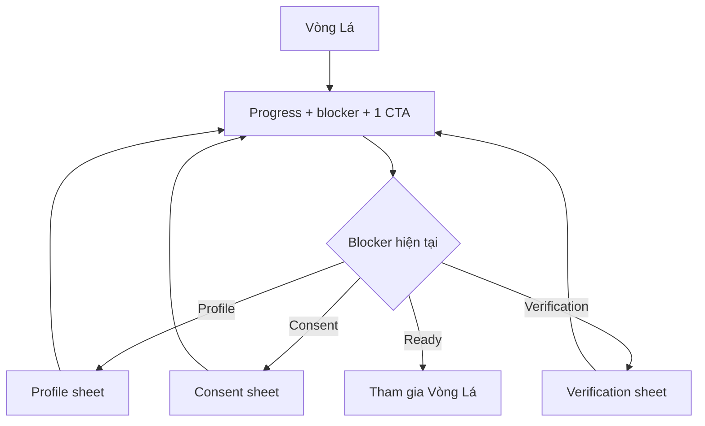
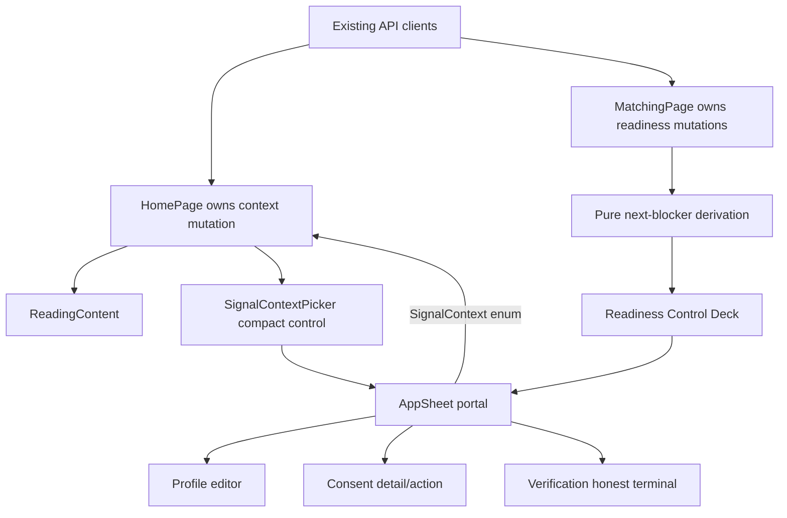
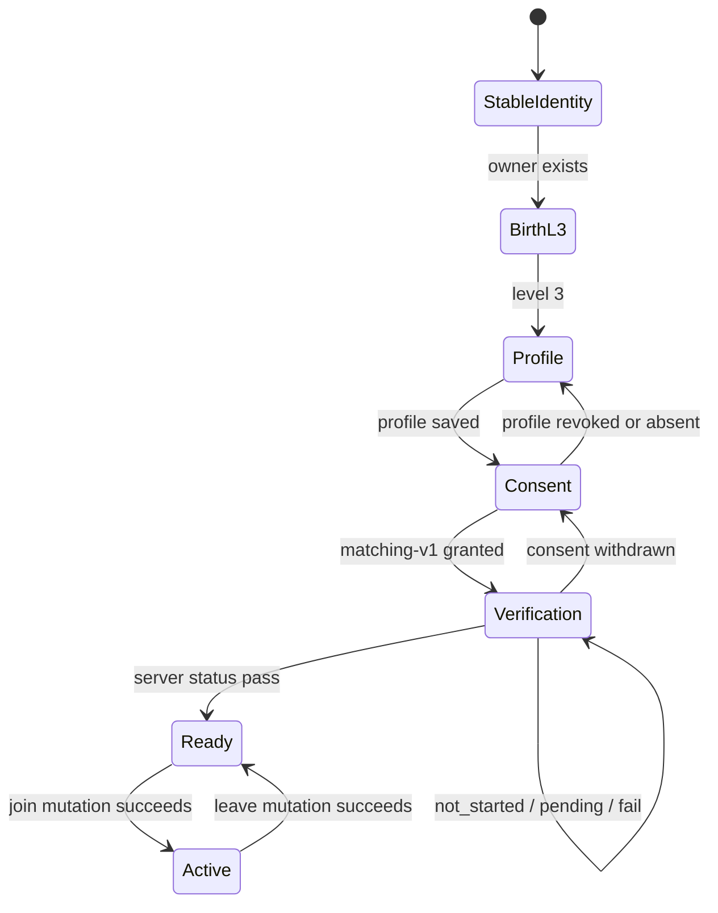

# Context Dial có ý nghĩa và Vòng Lá gọn theo trạng thái

## Goal Capsule

### Objective

Làm Home đưa Daily Note tới người dùng trước khi yêu cầu chọn context, đồng thời nén readiness của Vòng Lá thành một bề mặt trong một viewport với progress, đúng một hành động còn thiếu và các sheet nhập liệu theo thời điểm.

### Means

Dùng một Context Sheet dùng chung cho chip trên Note và action `Đổi góc`; dùng một state-driven Control Deck cho Vòng Lá, trong đó server readiness quyết định progress, blocker và sheet được mở (KTD1–KTD4).

### Authority hierarchy

1. Product Contract và các quyết định đã được người dùng xác nhận trong plan này.
2. Readiness/consent/verification từ API hiện tại; FE không tự suy diễn trạng thái hoàn thành.
3. Privacy, safety và mobile-first conventions trong `AGENTS.md`, `docs/user-stories/US-03-doc-note-hom-nay.md` và `docs/user-stories/US-14-chuan-bi-profile-matching-ready.md`.
4. Pattern UI/accessibility hiện có trong `apps/web/src/shared/ui/ResonanceFeedback.tsx`.

### Stop conditions

- Dừng và không giả lập nếu cần API upload/moderation để hoàn tất photo verification.
- Không thay schema/API hoặc logic eligibility nếu UI compression có thể thực hiện bằng response hiện tại.
- Không coi work hoàn tất nếu Home/Vòng Lá chỉ đẹp ở desktop hoặc primary CTA không thể dùng ở viewport app 390×844.

### Execution profile

`ce-work` thực hiện tuần tự U1 → U5, giữ nguyên các thay đổi không liên quan trong worktree và tự hoàn tất QA trước khi bàn giao.

### Success signal

Trên viewport 390×844, người dùng nhìn thấy nội dung Note trước control đổi góc; tại Vòng Lá, họ nhìn thấy trạng thái, progress và CTA kế tiếp mà không phải cuộn qua checklist hoặc form.

### Constraint

Giữ Cosmic Glass Signal, Be Vietnam Pro, privacy/safety contract hiện có và fail-closed verification. Không thêm context inference, free text nhạy cảm, candidate giả hoặc thay đổi logic eligibility.

## Product Contract

### Summary

Home mở thẳng Daily Note với một chip “Góc đang đọc” để người dùng chủ động mở sheet đổi góc. Vòng Lá trở thành một control deck duy nhất: thanh tiến độ năm chốt, một dòng nói rõ chốt tiếp theo và một CTA mở scoped sheet tương ứng; hồ sơ ghép không còn render inline.

### Problem Frame

Context Dial hiện đứng trước Note nhưng chỉ giải thích rằng lựa chọn sẽ “đổi cách diễn đạt”, nên người dùng phải trả lời một câu hỏi mơ hồ trước khi nhận giá trị. Vòng Lá hiện mở đồng thời năm checklist item, form profile, consent, verification và launch, tạo một chuỗi card dài, đồng cấp và khó scan.

### Key Decisions

- **Note xuất hiện trước, context chỉ mở khi người dùng muốn đổi góc.** (session-settled: user-approved — chosen over picker-first: người dùng đánh giá câu hỏi “chiếm sóng” hiện tại thiếu ý nghĩa.) Governs R1–R5.
- **Readiness dùng một control deck và đúng một next-best-action.** (session-settled: user-approved — chosen over expanded checklist: màn hiện tại dài, phẳng và phải cuộn nhiều.) Governs R6–R9.
- **Profile là scoped bottom sheet.** (session-settled: user-approved — chosen over inline form: tạo profile chỉ cần một nút và popup giữ nguyên context Vòng Lá.) Governs R10–R12.
- **Consent và verification xuất hiện tuần tự đúng thời điểm.** (session-settled: user-approved — chosen over simultaneous safety cards: giữ đầy đủ safety nhưng giảm tải nhận thức.) Governs R8, R13–R14.
- **Chiều sâu thị giác đến từ tiến độ và state transition.** (session-settled: user-approved — chosen over adding decorative cards: thêm trang trí không giải quyết hierarchy.) Governs R15–R17.

### Actors

- **Người đọc Note:** muốn nhận insight ngay và chỉ đổi góc khi Note chưa đúng điều họ cần nhìn.
- **Người chuẩn bị vào Vòng Lá:** muốn biết mình còn thiếu gì và hoàn thành từng chốt mà không đọc một trang cài đặt dài.
- **Hệ thống readiness:** giữ thứ tự blocker, consent, verification và eligibility hiện có; không tự hoàn thành thay người dùng.

### Requirements

**Home và Context Dial**

- **R1.** Home phải render greeting rồi Daily Note; không đặt Context Dial dạng grid trước Note.
- **R2.** Note phải hiển thị một control compact cho lens hiện tại, mặc định diễn đạt là `Góc đang đọc · Lá chọn` khi context là `auto`.
- **R3.** Tap control ở R2 hoặc action `Đổi góc` phải mở cùng một scoped sheet; đóng sheet không thay Note.
- **R4.** Sheet phải hỏi theo tác dụng: `Bạn muốn Note giúp nhìn rõ điều gì?`; mỗi lựa chọn phải nói rõ thay đổi đời thường mà lens tạo ra, không chỉ đặt tên category.
- **R5.** Chọn lens mới phải giữ nguyên chart facts/evidence và chỉ đổi manifestation/micro-action theo privacy contract US-03; UI phải xác nhận ngắn phần nhìn đã đổi, không nói app đã hiểu sở thích lâu dài.

**Vòng Lá Control Deck**

- **R6.** Readiness phải có một thanh tiến độ năm chốt, tỷ lệ hoàn thành và một status line gọi tên blocker ưu tiên hiện tại.
- **R7.** Trạng thái chưa sẵn sàng phải hiển thị đúng một primary CTA cho blocker hiện tại; không render tất cả action cùng lúc.
- **R8.** Thứ tự hành động canonical là: stable identity → birth profile Level 3 → matching profile → matching consent → photo verification → join pool. Một chốt đã xong không được trở lại thành CTA chính trừ khi server báo stale/revoked.
- **R9.** Danh sách đầy đủ năm chốt chỉ xuất hiện trong disclosure `Xem điều kiện`; completed item phải scan được nhưng không chiếm card riêng trên màn chính.

**Profile, consent và verification sheets**

- **R10.** CTA `Tạo hồ sơ ghép` hoặc `Sửa hồ sơ` phải mở bottom sheet gắn với Vòng Lá; form không được render inline trên main page.
- **R11.** Profile sheet phải hỗ trợ medium detent và mở rộng khi nội dung/bàn phím cần; dismiss với thay đổi chưa lưu phải cho phép tiếp tục chỉnh hoặc bỏ thay đổi.
- **R12.** Sau khi lưu, main page chỉ hiển thị receipt compact gồm tên hiển thị, intent, tuổi và thành phố cùng action `Sửa`; không lặp lại toàn form.
- **R13.** Matching consent phải mở trong scoped sheet khi nó là blocker kế tiếp; sheet hiển thị purpose, data-use, quyền thu hồi và primary consent action trước khi ghi consent.
- **R14.** Photo verification phải mở trong scoped sheet khi nó là blocker kế tiếp; pending/fail/retry/appeal vẫn fail-closed và không có review bypass trong runtime.

**Visual depth và accessibility**

- **R15.** Progress bar có thể dùng năm signal node và state morph nhẹ để biểu đạt tiến độ; visual không được ngụ ý năm candidate đã tồn tại.
- **R16.** Chuyển state chỉ chạy một lần sau mutation thành công, có phiên bản tĩnh tương đương và tôn trọng Reduce Motion.
- **R17.** Tại 390×844, hero compact, progress, blocker và primary CTA phải nằm trong viewport usable phía trên bottom navigation; text 200%, keyboard, safe area, focus return và screen reader vẫn dùng được.
- **R18.** Chỉ dùng Be Vietnam Pro; lime dành cho progress/selected/primary, glass cho control/disclosure/sheet và cream paper cho Note.

### Key Flows

#### Flow A — Home mặc định và đổi góc



#### Flow B — Vòng Lá readiness



#### Directional mobile layout

```text
┌─────────────────────────────┐
│ Lá Lành*             Vòng Lá│
│ Năm kiểu kết nối, không     │
│ phải bảng xếp hạng người.   │
│                             │
│  ●━━━━●━━━━○━━━━○━━━━○  2/5 │
│  Còn thiếu hồ sơ ghép       │
│  Tên · intent · tuổi · vùng │
│                             │
│  [ Tạo hồ sơ ghép      → ]  │
│       Xem điều kiện          │
├─────────────────────────────┤
│ bottom navigation           │
└─────────────────────────────┘
```

### Acceptance Examples

- **AE1 — Note-first:** Given Daily Note đã sẵn sàng, when Home render, then Note xuất hiện trước mọi lựa chọn lens và context grid cũ không chiếm first viewport.
- **AE2 — Context cancel:** Given user mở context sheet, when dismiss không chọn, then note/revision/lens hiện tại không đổi và không có request contextual mới.
- **AE3 — Context effect:** Given user chọn `communication`, when projection thành công, then manifestation/action đổi rõ, evidence identity giữ nguyên và focus trở về control mở sheet.
- **AE4 — One blocker:** Given readiness thiếu profile, consent và verification, when Vòng Lá render, then primary CTA duy nhất là `Tạo hồ sơ ghép`; consent/verification chỉ hiện trong `Xem điều kiện` dưới dạng pending.
- **AE5 — Profile save:** Given profile sheet hợp lệ, when lưu thành công, then sheet đóng, progress tăng, receipt compact xuất hiện và CTA chuyển sang consent.
- **AE6 — Unsaved dismiss:** Given profile đã sửa nhưng chưa lưu, when swipe dismiss, then app hỏi giữ chỉnh sửa hay bỏ; không ghi partial profile.
- **AE7 — Consent withdrawal:** Given consent đã cấp rồi bị thu hồi từ profile/settings, when quay lại Vòng Lá, then progress giảm và CTA kế tiếp trở lại consent.
- **AE8 — Verification pending:** Given ảnh đang pending, when Vòng Lá render, then progress không đánh dấu pass, CTA/status nói đang chờ và không cho join pool.
- **AE9 — Responsive/a11y:** Given text 200% hoặc Reduce Motion, when dùng Home và Vòng Lá, then content reflow không che CTA/nav; state change vẫn hiểu được bằng text và progress semantics.

### Success Criteria

- First viewport Vòng Lá tại 390×844 chứa promise, progress, blocker và primary CTA mà không cần cuộn.
- Người dùng thử nghiệm có thể trả lời chính xác tap lens sẽ thay đổi gì trong Note.
- Main Vòng Lá không render profile form, consent detail hoặc verification explanation khi các phần đó chưa được mở.
- Mọi blocker state có đúng một next action, một error/retry path và một server-authoritative completion state.

### Scope Boundaries

- Không thay đổi matching eligibility, profile fields, consent purpose hoặc verification provider contract.
- Không xây weekly slate, candidate card, request/mutual/chat trong work unit này.
- Không thêm free-text context, context persistence, inference từ mood/history hoặc analytics nhạy cảm.
- Không làm fake candidate preview, compatibility score, streak, XP hay gamified consent.
- Không redesign các màn ngoài Home và readiness/setup Vòng Lá.

### Dependencies / Assumptions

- API readiness tiếp tục là source of truth cho checks/profile/consent/verification.
- Context projection hiện tại tiếp tục nhận sáu enum canonical; work này đổi hierarchy/copy và interaction surface, không đổi fact selection.
- Native app là sản phẩm chính; web giữ parity để review.

### Sources / Research

- `docs/ideation/2026-09-18-context-dial-vong-la-compression-ideation.html`
- `docs/user-stories/US-03-doc-note-hom-nay.md`
- `docs/user-stories/US-14-chuan-bi-profile-matching-ready.md`
- `apps/web/src/features/home/HomePage.tsx`
- `apps/web/src/shared/ui/SignalContextPicker.tsx`
- `apps/web/src/features/matching/MatchingPage.tsx`
- [Apple HIG — Sheets](https://developer.apple.com/design/human-interface-guidelines/sheets)
- [Apple HIG — Layout](https://developer.apple.com/design/human-interface-guidelines/layout)
- [Apple HIG — Modality](https://developer.apple.com/design/human-interface-guidelines/modality)

## Planning Contract

### Key Technical Decisions

- **KTD1 — Sheet dùng portal và pattern focus hiện có, không thêm thư viện modal.** Tạo một primitive React dùng `createPortal`, `<dialog open>`, focus đầu vào, focus return, Escape và Tab containment theo pattern đã chạy trong `ResonanceFeedback`; tránh thêm dependency và tránh để sheet bị cắt bởi stacking context. Governs R3, R10–R14, R17.
- **KTD2 — Context state vẫn ở `HomePage`, picker chỉ là controlled presentation.** `HomePage` tiếp tục sở hữu context mutation/cache/privacy semantics; component mới chỉ mở/đóng sheet và phát enum đã chọn. Điều này giữ R5 ở cùng boundary với request hiện tại và không tạo persistence mới. Governs R2–R5.
- **KTD3 — Blocker là hàm thuần từ thứ tự canonical và server checks.** FE chọn check chưa hoàn tất đầu tiên theo R8; không dựa vào thứ tự mảng response và không tính lại eligibility từ profile fields. Trạng thái `pending/fail` của verification vẫn được diễn giải từ response nhưng không được đánh dấu complete nếu server chưa pass. Governs R6–R9, R14.
- **KTD4 — Main Vòng Lá là projection, sheet là editor.** Main page chỉ render hero compact, five-node progress, current blocker/CTA, optional profile receipt và condition disclosure. Form profile, consent detail và verification explanation chỉ tồn tại trong một sheet tại một thời điểm. Governs R7, R9–R14, R17.
- **KTD5 — Không mở rộng backend trong work này.** API hiện đã trả đủ `checks`, `profile`, `consent_version`, `verification_status` và membership mutation; verification provider chưa nối nên UI phải nói thật và fail closed. Governs R8, R14 và Scope Boundaries.

### High-Level Technical Design

Các sơ đồ dưới đây mô tả boundary và state ownership; implementer có thể chia component khác đi miễn vẫn giữ đúng KTD và requirement.

#### Component and data flow



#### Readiness state machine



### Implementation constraints

- Dùng Be Vietnam Pro và token/màu hiện có; không thêm font, icon package hoặc design system mới.
- `AppSheet` phải render trên `document.body`, khóa tương tác nền bằng backdrop, có accessible name, close action, Escape, focus containment và focus return.
- Không lưu lens vào `localStorage`, không thêm free-text context, không gửi analytics từ sheet.
- Profile draft chỉ gọi `saveMatchingProfile` khi submit hợp lệ; dismiss không được ghi partial data.
- Không có CTA giả cho photo upload. Khi provider chưa nối, sheet giải thích trạng thái review và giữ join disabled bằng server readiness.
- Giữ route, API contract và Capacitor packaging hiện tại; web là bề mặt QA của app.

### Sequencing

1. U1 tạo primitive sheet và interaction contract dùng chung.
2. U2 chuyển Home sang note-first và dùng Context Sheet.
3. U3 tạo derivation/control deck Vòng Lá dựa trên readiness.
4. U4 chuyển profile/consent/verification vào sheet và giữ mutation hiện tại.
5. U5 cập nhật docs, polish responsive/accessibility và chạy full QA.

### System-Wide Impact

- **Data lifecycle:** không thêm dữ liệu; context vẫn ở memory, profile/consent vẫn qua endpoint hiện có.
- **Auth:** owner gate vẫn chỉ xuất hiện khi vào Vòng Lá; không kéo login lên onboarding/Home.
- **Privacy:** condition disclosure có thể mô tả dữ liệu nhưng không hiển thị raw birth facts hay vị trí chi tiết; coarse city giữ nguyên.
- **Mobile parity:** React UI được Capacitor đóng gói nên mọi fixed sheet phải tôn trọng safe-area và bàn phím mobile.
- **Failure propagation:** mutation lỗi giữ sheet mở, giữ draft và hiển thị lỗi tại chỗ; query lỗi dùng state hiện có, không đoán fallback readiness.

### Risks and mitigations

- **Dialog accessibility regression:** tái sử dụng pattern đã test ở `ResonanceFeedback` và thêm unit tests cho Escape/focus return.
- **Hidden safety information:** giữ `Xem điều kiện` với đủ năm chốt và giữ chi tiết consent/verification trong sheet đúng thời điểm.
- **False readiness:** derivation chỉ chọn CTA; completion/progress luôn đọc `checks` từ server.
- **Unsaved profile loss:** track dirty draft; close yêu cầu xác nhận bỏ thay đổi, save lỗi giữ nguyên draft.
- **Viewport overflow with keyboard/text zoom:** sheet có scroll riêng, max-height theo `dvh`, bottom safe-area; control deck không phụ thuộc fixed height.

## Implementation Units

### U1. Shared accessible AppSheet primitive

**Goal:** Có một sheet primitive nhất quán cho context, profile, consent và verification mà không thêm dependency.

**Requirements:** R3, R10, R11, R13, R14, R17; KTD1.

**Files:**

- `apps/web/src/shared/ui/AppSheet.tsx` (new)
- `apps/web/src/shared/ui/AppSheet.test.tsx` (new)
- `apps/web/src/shared/styles/global.css`

**Approach:** Dùng portal + native open dialog như `ResonanceFeedback`; nhận title/id, open, pending, onClose và children. Giữ ref của trigger để trả focus. Xử lý Escape, click backdrop, close button, Tab wrap và safe-area. Sheet không tự quản form/draft.

**Test scenarios:**

- Happy path: mở sheet, accessible dialog có đúng title và close button nhận focus.
- Keyboard: Tab/Shift+Tab wrap giữa focusable đầu/cuối; Escape đóng và focus trở lại trigger.
- Pending: khi `closeDisabled`, Escape/backdrop/close không dismiss.
- Integration: content dài scroll trong sheet, backdrop vẫn phủ app và sheet không bị bottom nav che.

**Verification:** `pnpm --filter @la-lanh/web test -- AppSheet.test.tsx` pass; không có lỗi axe-style role/name trong Testing Library queries.

### U2. Home note-first Context Sheet

**Goal:** Người dùng đọc Note trước và hiểu chính xác `Đổi góc` sẽ làm gì.

**Requirements:** R1–R5, R16–R18; AE1–AE3; Product Key Decision “Note xuất hiện trước…”.

**Files:**

- `apps/web/src/features/home/HomePage.tsx`
- `apps/web/src/shared/ui/SignalContextPicker.tsx`
- `apps/web/src/shared/styles/signal-note.css`
- `apps/web/src/features/home/HomePage.test.tsx`

**Approach:** Đưa `ReadingContent` trước picker; biến picker thành chip compact `Góc đang đọc · …` và sheet hỏi `Bạn muốn Note giúp nhìn rõ điều gì?`. Copy options nêu outcome: ưu tiên việc, đọc ranh giới quan hệ, chuẩn bị điều cần nói, nghe nhịp cơ thể, nhận ra điều mình cần. Chip và `ResonanceFeedback` cùng mở một sheet. Chỉ đóng sau mutation thành công; lỗi giữ sheet và Note cũ.

**Test scenarios:**

- Happy path: Note đứng trước control trong DOM; default chip là `Góc đang đọc · Lá chọn`.
- Cancel: mở rồi đóng không gọi `getContextualReading`, revision không đổi.
- Lens select: chọn `communication` gọi đúng enum, cập nhật content và chip, đóng sheet, trả focus.
- Same lens: chọn lens đang active không gọi network và không tạo thông báo sai.
- Error: request lỗi giữ Note hiện tại và sheet mở với thông báo retry.
- Privacy: sau chọn lens không có key context trong `localStorage`.

**Verification:** targeted Home tests pass; visual capture 390×844 cho thấy Note trước control và không có grid context ở first viewport.

### U3. Vòng Lá readiness derivation and Control Deck

**Goal:** Main Vòng Lá có tiến độ dễ scan, một blocker và đúng một CTA kế tiếp.

**Requirements:** R6–R9, R15–R18; AE4, AE7–AE9; Product Key Decision “Readiness dùng một control deck…”.

**Files:**

- `apps/web/src/features/matching/readiness.ts` (new)
- `apps/web/src/features/matching/readiness.test.ts` (new)
- `apps/web/src/features/matching/MatchingPage.tsx`
- `apps/web/src/features/matching/matching.css`

**Approach:** Tạo hàm thuần map `MatchingReadiness` thành completed count, ordered checks, current blocker, status copy, CTA kind và verification substate. Render compact hero + five-node progress + blocker panel + one primary action. Chuyển full checklist vào disclosure. Birth blocker link tới `/birth-time`; profile/consent/verification mở sheet; ready/active dùng membership mutation.

**Test scenarios:**

- Profile + consent + verification cùng thiếu: CTA duy nhất là `Tạo hồ sơ ghép`.
- Birth Level 3 thiếu dù profile tồn tại: CTA canonical vẫn là `Bổ sung giờ và nơi sinh`.
- Consent revoked: progress giảm theo checks và CTA trở lại consent.
- Verification not_started/pending/fail: không complete, copy/CTA phù hợp và không cho join.
- Ready inactive: CTA `Tham gia Vòng Lá`; active: CTA `Rời Vòng Lá`.
- Response checks bị đảo thứ tự: blocker vẫn theo canonical order.

**Verification:** pure derivation tests và `MatchingPage.test.tsx` pass; không có nhiều hơn một visible primary CTA trong readiness state.

### U4. Scoped profile, consent and verification sheets

**Goal:** Hoàn tất từng chốt ngay tại Vòng Lá mà không biến main page thành form dài.

**Requirements:** R10–R14, R17; AE5–AE8; Product Key Decisions về profile/safety sheets.

**Files:**

- `apps/web/src/features/matching/MatchingPage.tsx`
- `apps/web/src/features/matching/matching.css`
- `apps/web/src/features/matching/MatchingPage.test.tsx`

**Approach:** Dùng một discriminated `activeSheet` (`profile | consent | verification | discard-profile`). Profile draft khởi tạo từ server profile hoặc defaults hiện tại; main page chỉ có receipt compact và `Sửa`. Consent sheet giữ purpose/data-use/withdrawal và explicit action. Verification sheet map not_started/pending/fail/pass, nêu rõ provider chưa nối trong review và không có bypass. Save/grant/withdraw thành công invalidate readiness rồi đóng/chuyển CTA; lỗi giữ sheet.

**Test scenarios:**

- New profile: CTA mở sheet, region bắt buộc blank, save valid gọi đúng payload rồi receipt xuất hiện.
- Edit existing: receipt mở editor prefilled; save lỗi giữ sheet và draft.
- Dirty dismiss: close mở confirm; `Tiếp tục chỉnh` giữ draft, `Bỏ thay đổi` đóng không gọi save.
- Consent: không auto-grant; mở sheet mới thấy action, grant thành công refresh readiness.
- Consent withdrawal: chỉ có trong condition/detail disclosure, yêu cầu explicit action.
- Verification: not_started/pending/fail không có nút tự pass; ready chỉ đến từ server check complete.

**Verification:** matching component tests pass và manual keyboard pass trên sheet profile dài.

### U5. Product docs, app-size visual QA and regression gates

**Goal:** Đồng bộ sản phẩm/documentation và bàn giao một bản review chạy được trên app viewport.

**Requirements:** R16–R18; AE9.

**Files:**

- `docs/user-stories/US-03-doc-note-hom-nay.md`
- `docs/user-stories/US-14-chuan-bi-profile-matching-ready.md`
- `docs/ideation/2026-09-18-context-dial-vong-la-compression-ideation.html` (reference only; do not rewrite evidence)
- affected web test and style files from U1–U4

**Approach:** Bổ sung requirement đã chốt vào US-03/US-14, không xóa AC/privacy hiện có. Chạy lint/typecheck/tests/build/runtime guards. Chạy QA server và capture Home + `/vong-la` ở 390×844; kiểm tra dark/light, 320/390/430 width, reduced motion và focus order. Dọn CSS/component cũ không còn dùng sau khi visual match đạt.

**Test scenarios:**

- 390×844: Vòng Lá first viewport có hero compact, progress, blocker và CTA; không render inline profile form.
- 320/430 width: không horizontal overflow, CTA không bị nav che.
- Dark/light: contrast của primary text, progress và CTA vẫn rõ.
- Reduced motion: progress/state transition không phụ thuộc animation để hiểu.
- Runtime: no-mock/privacy/mobile guards pass; QA `/__qa/ready` trả ready.

**Verification:** toàn bộ Verification Contract pass và screenshots được kiểm tra trực quan trước bàn giao.

## Verification Contract

### Targeted during implementation

- `pnpm --filter @la-lanh/web test -- AppSheet.test.tsx HomePage.test.tsx readiness.test.ts MatchingPage.test.tsx`
- `pnpm web:typecheck`
- `pnpm web:lint`

### Full regression before handoff

- `pnpm contracts:check`
- `pnpm verify:runtime`
- `pnpm web:test`
- `pnpm web:build`
- `pnpm qa:test`

### Manual and visual checks

- Start the built QA product, verify `/__qa/ready`, then review `/home` and `/vong-la` at 390×844.
- Repeat key layout checks at 320×844 and 430×844, with light theme and `prefers-reduced-motion` where tooling permits.
- Keyboard-only: open/close each sheet, tab across controls, cancel dirty profile, submit valid profile, and verify focus returns to trigger.
- Privacy: inspect network payloads to confirm context sends only enum and matching profile sends only documented fields; no new local storage key or raw chart data is added.

## Definition of Done

- U1: shared sheet has keyboard/focus tests and is used by both Home and Vòng Lá.
- U2: Note precedes Context Dial, both entry points open the same sheet, and lens mutation/privacy behavior is unchanged.
- U3: readiness is server-authoritative, canonical, compact and exposes one primary CTA.
- U4: profile, consent and verification are scoped sheets; dirty/error/fail-closed paths work; main page has no inline long form.
- U5: US-03/US-14 match shipped behavior; targeted and full gates pass; app-size screenshots have been visually reviewed.
- No backend schema or auth/eligibility semantics changed for a presentation-only requirement.
- No fake photo verification, candidate data, analytics, context persistence or new sensitive field was introduced.
- Abandoned component/CSS experiments and dead code from the old expanded UI are removed without touching unrelated worktree changes.
