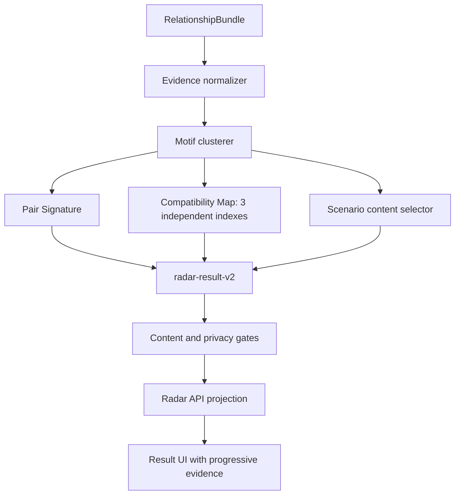

# Radar Deep Relationship Reading - Plan

## Goal Capsule

- **Objective:** Người dùng đọc kết quả Radar và nhận ra một bản đồ tương tác cụ thể của đúng hai người, gồm chỗ dễ bắt sóng, chỗ dễ lệch và cách tự kiểm chứng trong đời thực.
- **Product authority:** Bản này thay thế hợp đồng nội dung `radar-result-v1`; các quyết định về flow check kín và dữ liệu cá nhân vẫn do `docs/foundation/la-lanh-radar-hop-gu-spec.md` quản lý.
- **Open blockers:** Không có quyết định sản phẩm nào chặn implementation. Expert review và benchmark người dùng là release gate, không phải câu hỏi scope.

---

## Product Contract

### Summary

Radar sẽ chuyển từ sáu dimension với copy tĩnh sang một bản đọc có cấu trúc: chart facts được gom thành Pair Signature, rồi diễn giải qua các tình huống đời thường phù hợp với loại quan hệ người dùng đã chọn. Mỗi claim phải cụ thể, có bằng chứng, có giới hạn và không biến astrology thành kết luận về ý định, độ an toàn hay tương lai của người kia.

### Problem Frame

Engine hiện tính Synastry, house overlay hai chiều và midpoint Composite thật, nhưng projection chỉ chọn dimension mạnh rồi gắn một đoạn copy dùng chung. Calculation thay đổi trong khi insight người dùng nhận được hầu như không đổi. Việc thêm nhiều câu đồng nghĩa sẽ không giải quyết khoảng cách này; planner nội dung phải hiểu cụm bằng chứng, chiều tác động, mâu thuẫn và tình huống biểu hiện.

### Key Decisions

- **Pair Signature là đơn vị tổng hợp chính.** Governs R2–R6.
- **Situation-first ở lớp đọc, astrology-first ở lớp evidence.** Governs R7–R10.
- **Synastry, overlays và Composite có vai trò riêng; technique không đủ chuẩn phải fail-closed.** Governs R1, R4, R14.
- **Compatibility Map dùng ba chỉ số độc lập, không dùng một xác suất thành công.** Governs R11, R15.
- **Không dùng verdict hoặc free-form model output trong launch path.** Governs R13, R17.

### Actors

- A1. **Người check Radar:** đã có natal chart riêng và cung cấp hợp pháp thông tin sinh của người họ biết, hoặc dùng flow mời consent riêng.
- A2. **Người được check:** chủ thể của chart thứ hai; dữ liệu và ý định không được suy diễn hoặc hiển thị ngoài purpose đã consent.
- A3. **Radar reading engine:** tính facts, tạo Pair Signature, chọn content units và phát hành projection đã qua gate.
- A4. **Reviewer vận hành:** kiểm tra corpus, golden fixtures, privacy evidence và output mẫu trước release.

### Requirements

**Chart evidence và synthesis**

- R1. Reading launch dùng Western Tropical và phân vai chart rõ ràng: natal baseline cho từng người, Synastry cho tương tác, house overlay hai chiều cho vùng biểu hiện và midpoint Composite cho nhịp chung.
- R2. Engine phải gom nhiều chart fact liên quan thành Pair Signature thay vì chọn một dimension hoặc contact đứng riêng.
- R3. Mỗi motif trong Pair Signature phải chứa ít nhất một evidence cluster có đủ body, aspect, orb, owner/receiver và nguồn chart.
- R4. House overlay chỉ được dùng khi cả hai chart đủ precision; Composite không được gán thành tính cách của riêng A hoặc B.
- R5. Engine phải giữ bất đối xứng A→B và B→A khi bằng chứng cho thấy mỗi người có thể cảm nhận tương tác khác nhau.
- R6. Khi có bằng chứng vừa thuận vừa căng, output phải giữ được cả hai và giải thích cách chúng có thể cùng xuất hiện thay vì nén thành `mixed`.

**Content matrix và cá nhân hóa**

- R7. Content matrix phải phủ tối thiểu các tình huống: bắt chuyện/nhắn tin, lên kế hoạch, thể hiện quan tâm, cần khoảng riêng, bất đồng, làm hòa và đặt ranh giới.
- R8. Context do người dùng chọn trong `crush`, `friend`, `partner`, `someone` chỉ điều chỉnh ví dụ và câu hỏi; context không được thay đổi chart facts hoặc tạo giả định về sự thân mật.
- R9. Mỗi content unit phải được chọn từ giao của motif, tình huống, chiều cảm nhận, tone bằng chứng, mức confidence và voice profile do người dùng chọn.
- R10. Hai cặp khác nhau không được chỉ đổi tên hoặc thuật ngữ chart; luận điểm, tình huống foreground hoặc tension pair phải thay đổi khi evidence signature thay đổi đủ lớn.

**Cấu trúc kết quả và ngôn ngữ**

- R11. Kết quả phải mở bằng một Pair Signature đời thường và Compatibility Map gồm `Bắt sóng`, `Dễ phối hợp`, `Lực cấn`; ba chỉ số độc lập, không cộng thành 100 và không được mô tả là xác suất thành công.
- R12. Copy lớp đầu không dùng thuật ngữ astrology nếu thuật ngữ đó chưa được giải nghĩa bằng hành vi hoặc tình huống cụ thể.
- R13. Mỗi đoạn phải dùng ngôn ngữ conditional, tránh lời phán, tránh văn sáo và không được ra lệnh nhắn tin, đối chất, tiếp tục, rời đi hoặc kiểm tra người kia.
- R14. Accordion evidence phải nói rõ chart factors nào tạo claim, chúng nối hai chức năng nào, orb/precision ra sao và lớp nào bị giữ lại vì thiếu dữ liệu.

**Safety, privacy và provenance**

- R15. Compatibility Map chỉ được tính từ evidence cluster có thể truy ngược; không được sinh một điểm tổng, soulmate/red-flag verdict, long-term probability, attachment label, mental-health inference, sexual willingness, intent hoặc safety claim.
- R16. Raw DOB, giờ, nơi, tọa độ, nickname thật và identifier không được đi vào prose, analytics, log hoặc external content provider.
- R17. Launch renderer phải deterministic và evidence-bound; nếu sau này dùng model để làm mượt câu chữ, model chỉ được chọn/biến đổi content unit đã duyệt và không được nhận raw birth input.
- R18. Mỗi result revision phải lưu được knowledge version, renderer version, gate version, chart/config version, evidence IDs, concept IDs và voice choice.
- R19. Disclaimer ngắn phải ở cạnh reading nhưng không được lặp thành một khối lớn che nội dung; evidence và caveat sâu nằm trong progressive disclosure.

**Quality gates**

- R20. Golden fixtures phải phủ close-orb contact, contradictory cluster, bidirectional overlay, missing-time degradation, mixed-config rejection và Composite midpoint boundary.
- R21. Distinctness benchmark phải kiểm tra swap một người, near-neighbor chart và cặp hoàn toàn khác; release fail nếu prose đổi nhưng luận điểm và tình huống vẫn giống nhau quá mức.
- R22. Human benchmark với người không biết astrology phải đạt ít nhất 70% người kể lại đúng ý chính và dưới 15% đánh giá kết quả là “ai đọc cũng đúng”.
- R23. Mọi sample public phải qua editorial, anti-influence, privacy và provenance gate; Jyotish generated reading, corrected Davison và relationship timing giữ OFF tới khi có contract và expert review riêng.

### Key Flows

- F1. Tạo bản đọc cặp đôi
  - **Trigger:** A hoàn tất check kín hoặc hai người hoàn tất consented invite.
  - **Actors:** A1, A2, A3.
  - **Steps:** Engine xác nhận precision/config; tạo natal relationship baseline; tính Synastry, overlay đủ điều kiện và Composite; gom evidence cluster; lập Pair Signature; chọn scenario units; chạy gates; lưu projection tối thiểu.
  - **Outcome:** Một reading traceable, riêng cho cặp và không chứa raw birth data.
  - **Covers:** R1–R10, R15–R18.

- F2. Đọc kết quả không cần biết astrology
  - **Trigger:** A mở `/radar/result/:id`.
  - **Actors:** A1, A3.
  - **Steps:** UI mở bằng Pair Signature và ba chỉ số; cho đọc strength, tension và perspective; người dùng có thể mở evidence receipt; disclaimer nằm cạnh nhưng không cạnh tranh với nội dung.
  - **Outcome:** A hiểu kết quả bằng tình huống đời thường và vẫn kiểm tra được chart basis.
  - **Covers:** R11–R14, R19.

- F3. Hạ cấp an toàn khi thiếu dữ liệu
  - **Trigger:** Một hoặc cả hai chart không đủ giờ/nơi sinh hoặc feature gate của một technique đang OFF.
  - **Actors:** A1, A3.
  - **Steps:** Engine loại house/angle-dependent evidence; không thay bằng suy đoán; renderer nói ngắn gọn lớp nào chưa dùng và tiếp tục bằng evidence còn hợp lệ nếu đủ ngưỡng.
  - **Outcome:** Reading ít lớp hơn nhưng không sai precision hoặc fallback sang copy chung chung.
  - **Covers:** R4, R14, R20, R23.

### Acceptance Examples

- AE1. **Covers R2, R6, R11.** Given một cặp có Mercury–Moon contact thuận và Mercury–Saturn contact căng, when Radar tổng hợp, then reading nói được “dễ hiểu ý nhanh nhưng có thể chững lại khi sợ nói sai”, không chọn một contact rồi bỏ contact còn lại.
- AE2. **Covers R5, R7, R12.** Given hành tinh của A rơi vào nhà giao tiếp của B nhưng chiều ngược lại rơi vào nhà riêng tư, when hiển thị result, then copy nêu hai cách cảm nhận khác nhau qua tình huống nhắn tin hoặc chia sẻ riêng, không nói B chắc chắn nghĩ gì.
- AE3. **Covers R4, R14.** Given chart B thiếu giờ sinh, when tạo reading, then không có house overlay, angle claim hoặc Composite house; evidence receipt nói rõ lớp này chưa dùng.
- AE4. **Covers R8, R13.** Given cùng chart pair nhưng context đổi từ `friend` sang `crush`, when render, then chart thesis giữ nguyên, ví dụ và câu hỏi đổi phù hợp mà không giả định hai người đang yêu hoặc có attraction hai chiều.
- AE5. **Covers R10, R21.** Given chart B được thay bằng một người có evidence signature khác, when chạy benchmark, then ít nhất một hero thesis và hai scenario cards thay đổi ở cấp ý nghĩa, không chỉ đổi tên hoặc synonym.
- AE6. **Covers R11, R15, R17.** Given contact rất sát và nhiều attraction-related evidence, when render, then `Bắt sóng` có thể cao đồng thời `Lực cấn` cũng cao; output không tạo điểm tổng, không gọi soulmate và không khuyên tiến tới.
- AE7. **Covers R16, R18.** Given một private check hoàn tất, when kiểm tra result payload, logs và analytics, then không tìm thấy raw DOB/time/place/coordinates; metadata vẫn truy được version và evidence IDs tối thiểu.

### Success Criteria

- Người dùng nhìn thấy khác biệt có nghĩa khi đổi người được check, không phải chỉ thấy sáu card thay thứ tự.
- Mỗi claim public truy ngược được tới chart evidence và editorial concept đã đăng ký.
- Một reviewer không biết astrology vẫn chỉ ra được reading đang nói về tình huống nào, điểm thuận nào và điểm cần thương lượng nào.
- Security/privacy review không phát hiện raw birth data hoặc third-party identity trong projection, logs, analytics hay provider traffic.

### Scope Boundaries

**Trong scope**

- Western Tropical pair reading cho Radar check kín và consented invite.
- Pair Signature, scenario content matrix, evidence receipt và quality benchmark.
- Cập nhật contract/API/UI đủ để hiển thị cấu trúc reading mới.

**Deferred**

- Relationship timing bằng transit-to-Composite/Davison.
- Corrected Davison, progressions, returns và Composite houses.
- Jyotish D9/Ashtakoota interpretation và bất kỳ cross-tradition synthesis nào.
- Thích nghi nội dung từ free-text feedback hoặc lịch sử hành vi.

**Outside product identity**

- Một compatibility score duy nhất, candidate ranking bằng astrology và verdict “nên yêu/không nên yêu”.
- Suy ý định, consent, độ an toàn, attachment hoặc chẩn đoán tâm lý của người kia.
- Chatbot tự do tư vấn quan hệ từ raw chart.

### Dependencies and Assumptions

- `docs/foundation/la-lanh-radar-hop-gu-spec.md` tiếp tục là authority về consent, retention và hai mode Radar.
- Swiss Ephemeris licensing và legal review cho xử lý dữ liệu người thứ ba vẫn là public-release gate.
- Corpus dùng khái niệm paraphrase và provenance; không lưu hoặc tái tạo nội dung có bản quyền từ sách.

### Sources and Research

- `docs/ideation/2026-09-21-radar-relationship-reading-depth-ideation.html`
- `docs/foundation/la-lanh-relationship-engine-spec.md`
- `docs/reviews/2026-09-18-knowledge-base-coverage-audit.md`
- `apps/api/app/domains/astro/engine.py`
- `apps/api/app/domains/relationships/knowledge.py`
- `apps/api/app/domains/radar/service.py`
- [Astrodienst Relationship Charts](https://www.astro.com/prod/pr_relation_p.htm)
- [Swiss Ephemeris documentation](https://www.astro.com/swisseph/swisseph.htm)
- [The Gottman Institute research overview](https://www.gottman.com/about/research/)
- [Vietnam Personal Data Protection Law 91/2025/QH15](https://vanban.chinhphu.vn/?docid=214590&pageid=27160)
- [OWASP MASVS Privacy](https://mas.owasp.org/MASVS/12-MASVS-PRIVACY/)

---

## Planning Contract

### Key Technical Decisions

- KTD1. **Tạo projector thuần trong domain Radar thay vì nhét thêm logic vào service.** Projector nhận `RelationshipBundle` + context và trả projection versioned; service tiếp tục chịu trách nhiệm authorization, encryption và retention. Governs R2–R19.
- KTD2. **Tính ba index từ contribution độc lập của từng evidence cluster.** `Bắt sóng` nhận contribution từ salience/activation, `Dễ phối hợp` từ flow/reciprocity và `Lực cấn` từ activation/repair load; square/opposition có thể tăng cả Bắt sóng và Lực cấn. Governs R6, R11, R15.
- KTD3. **Renderer deterministic, matrix-driven và không gọi external model.** Nội dung ghép từ body functions, aspect dynamics, scenario/context và house/composite evidence đã allow-list. Governs R7–R10, R13, R16–R18.
- KTD4. **Giữ backward-read cho ciphertext cũ, chỉ tạo mới `radar-result-v2`.** UI chấp nhận cả v1 và v2 trong thời gian retention 30 ngày; không cần migration dữ liệu. Governs R18 và giảm rủi ro rollout.

### High-Level Technical Design

### Implementation Units

### U1. Relationship evidence and Pair Signature models

**Goal:** Introduce versioned, typed structures for evidence clusters, score channels, reading sections and evidence receipts without changing storage schema.

**Requirements:** R2–R6, R11, R14, R18.

**Dependencies:** None.

**Files:**

- `apps/api/app/domains/radar/reading.py` (new)
- `apps/api/tests/radar/test_reading.py` (new)

**Approach:** Normalize Synastry contacts, bidirectional overlays and Composite aspects into privacy-safe evidence refs. Preserve owner/receiver direction and calculate cluster salience from strength, body relevance, repetition and precision eligibility.

**Execution note:** Implement pure functions test-first so content behavior can be verified without database or HTTP fixtures.

**Patterns to follow:** Immutable Pydantic/dataclass models in `apps/api/app/domains/relationships/models.py`; deterministic selection in `apps/api/app/domains/relationships/knowledge.py`.

**Test scenarios:**

- Covers AE1: a flow contact and activation contact form one tension motif instead of dropping either.
- Covers AE2: A→B and B→A overlays remain distinguishable.
- Covers AE3: absent overlays do not create house claims.
- Composite evidence is labeled as shared pattern and never assigned to A or B.

**Verification:** The same bundle/context always returns the same ordered evidence clusters and every public claim has evidence IDs.

### U2. Compatibility Map and content matrix

**Goal:** Produce chart-specific indexes and short, concrete Vietnamese content from Pair Signature evidence.

**Requirements:** R6–R15, R17–R19.

**Dependencies:** U1.

**Files:**

- `apps/api/app/domains/radar/reading.py`
- `apps/api/tests/radar/test_reading.py`

**Approach:**

1. Calculate independent `resonance`, `coordination` and `friction` indexes on a bounded 0–100 scale from evidence contributions.
2. Select a headline pattern from the relative shape of the three indexes, then explain it with the top non-duplicative motifs.
3. Render `Điểm hợp`, `Điểm cấn`, `Hai người có thể thấy khác nhau` and `Thử kiểm chứng` using body/aspect/scenario matrices.
4. Build an evidence receipt with plain-language explanation plus technical metadata kept behind progressive disclosure.

**Test scenarios:**

- Covers AE6: resonance and friction can both be high and never collapse into one overall score.
- Context changes examples but not evidence IDs or index values.
- A different second chart changes at least one headline thesis and two section bodies.
- Copy contains no raw dates, times, coordinates, UUIDs, soulmate/forever/red-flag or deterministic intent claims.
- The supplied “hút mạnh nhưng không nhẹ nhàng” shape renders in fewer than 320 Vietnamese words.

**Verification:** Projection is deterministic, concrete, evidence-bound and materially distinct across golden pair fixtures.

### U3. Radar v2 API projection and backward compatibility

**Goal:** Wire the new projector into both private-check and consented-invite paths while preserving access, encryption and retained v1 reads.

**Requirements:** R16–R19.

**Dependencies:** U1, U2.

**Files:**

- `apps/api/app/domains/radar/service.py`
- `apps/api/app/api/v1/routes/radar.py`
- `apps/api/tests/radar/test_flow.py`

**Approach:** Replace `_project` with the v2 projector and pass the selected relationship context. Extend the response contract with Pair Signature, Compatibility Map, sections, evidence receipts and provenance. Keep legacy optional fields so encrypted v1 results remain readable until expiry.

**Test scenarios:**

- Covers AE7: result/log/storage assertions continue excluding birth date, time, place and coordinates.
- Both creation modes return `radar-result-v2` with three indexes and evidence-bound sections.
- Stored ciphertext remains encrypted and owner/recipient withdrawal behavior is unchanged.
- A legacy v1 payload validates and renders through the compatibility response model.

**Verification:** API flow tests prove new content and unchanged privacy/authorization behavior.

### U4. Result UI information hierarchy

**Goal:** Replace the flat six-card screen with a scan-first reading that follows the selected Cosmic Glass direction.

**Requirements:** R11–R14, R19.

**Dependencies:** U3.

**Files:**

- `apps/web/src/shared/api/client.ts`
- `apps/web/src/features/radar/RadarContinuePage.tsx`
- `apps/web/src/features/radar/radar.css`
- `apps/web/src/features/radar/RadarContinuePage.test.tsx` (new)

**Approach:** Show Pair Signature first, three compact meter cards second, then concise chapters for hợp/cấn/perspective/check. Evidence receipts use accessible `
` and the disclaimer remains a quiet footnote. Preserve v1 fallback rendering for retained results.

**Test scenarios:**

- A v2 result exposes the three labeled percentages and never labels them “xác suất thành công”.
- A high-resonance/high-friction result displays both without visual good/bad coloring.
- Evidence details are keyboard accessible and contain plain-language basis.
- A v1 result still renders its dimensions.
- Mobile result does not require horizontal scrolling and the primary reading order matches the DOM order.

**Verification:** Component tests, typecheck and build pass; browser QA confirms the result is scannable at mobile width.

### U5. Distinctness, safety and documentation gates

**Goal:** Make chart specificity and safe percentage semantics durable release gates.

**Requirements:** R20–R23.

**Dependencies:** U1–U4.

**Files:**

- `apps/api/tests/radar/test_reading.py`
- `apps/api/tests/radar/test_flow.py`
- `docs/foundation/la-lanh-radar-hop-gu-spec.md`
- `docs/foundation/la-lanh-relationship-engine-spec.md`

**Approach:** Add golden pair fixtures, swap/near-neighbor checks and prohibited-language assertions. Update docs to define `radar-result-v2`, three-index semantics, no-ranking use and fail-closed techniques.

**Test scenarios:**

- Covers AE5: swapping the second chart changes semantic signatures rather than only names.
- Near-neighbor fixtures remain stable enough to avoid random content churn.
- Missing precision removes dependent evidence without falling back to generic copy.
- Documentation and runtime use the same index names and disclaimer meaning.

**Verification:** Targeted API and web tests pass, docs match the shipped response, and diff review finds no broadened data collection.

### System-Wide Impact

- **API consumers:** The result response gains v2 fields but keeps v1 fields optional during retention compatibility.
- **Stored data:** No schema migration; only the encrypted projection shape changes for new requests.
- **Privacy:** No new raw fields, external calls, analytics events or logs.
- **Editorial operations:** New matrix and fixtures become the review surface instead of six static paragraphs.

### Risk Analysis and Mitigation

- **False precision:** percentages may be treated as truth. Mitigation: three independent labels, visible “chỉ số chart” copy, no overall score and no green/red grading.
- **Generic combinatorial copy:** matrices can still sound templated. Mitigation: require multi-factor motif clusters, distinctness fixtures and human benchmark.
- **Score instability:** tiny orb changes could swing percentages. Mitigation: bounded weights, rounding and near-neighbor tests.
- **Privacy regression:** richer evidence could expose birth facts. Mitigation: public evidence IDs contain body/aspect/house category only; raw inputs remain excluded and tests scan serialized output.

### Verification Contract

| Surface | Required proof |
|---|---|
| Reading domain | Pure-function tests for motifs, scores, content and prohibited language |
| API | Radar E2E for both modes, encryption, authorization, withdrawal and v1 compatibility |
| Web | Component tests, lint, typecheck and production build |
| UX | Mobile browser pass on a real v2 result; evidence disclosure and high-resonance/high-friction scan |
| Docs/privacy | Runtime-version parity and no added birth-data persistence/logging |

### Definition of Done

- Every new Radar result is `radar-result-v2` with Pair Signature, three independent indexes and four concise reading sections.
- Two meaningfully different chart pairs produce meaningfully different headline/section signatures.
- No overall compatibility probability, long-term score or inferred intent appears.
- Existing v1 encrypted results remain readable until expiry.
- API and web verification passes and the updated UI is browser-QA’d at mobile width.
