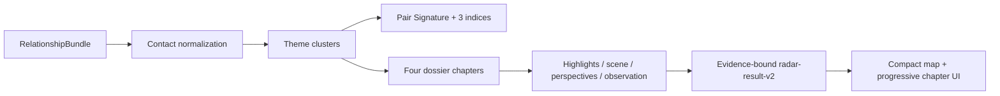

# feat: Nâng Radar thành Living Relationship Dossier

## Goal Capsule

- **Objective:** Người dùng mở kết quả Radar và đọc được một báo cáo cụ thể về đúng tương tác của hai người: điều gì dễ vào, điều gì dễ lệch, mỗi phía có thể trải nghiệm khác nhau ra sao và nên quan sát gì ngoài đời.
- **Means:** Giữ flow, ba chỉ số và bốn chương hiện tại; thay đơn vị tổng hợp từ một contact đơn lẻ thành cụm bằng chứng theo chủ đề, rồi hiển thị từng chương theo nhiều lớp có thể mở dần (KTD1–KTD4).
- **Authority:** Hợp đồng consent, retention và owner-only thuộc `docs/foundation/la-lanh-radar-hop-gu-spec.md`; chart semantics thuộc `docs/foundation/la-lanh-relationship-engine-spec.md`; hướng sản phẩm thuộc `docs/ideation/2026-09-26-radar-living-relationship-report-share-ideation.html`.
- **Stop conditions:** Không mở thêm public share, không thêm dữ liệu cá nhân, không đổi luật check kín, không đưa model tự do vào launch path và không thêm technique chart chưa qua expert gate.
- **Execution profile:** Thay đổi có hành vi ở backend projector và frontend report; ưu tiên characterization + unit test trước khi đổi projection, sau đó kiểm tra mobile browser trên result thật.

---

## Product Contract

### Summary

Radar Living Relationship Dossier là bản nâng cấp cộng thêm trên `radar-result-v2`. Pair Signature, `Bắt sóng`, `Dễ phối hợp`, `Lực cấn` và bốn chương hiện tại được giữ nguyên. Mỗi chương mới có thể chứa nhiều góc đọc ngắn, một cảnh đời thường, hai chiều cảm nhận hoặc nhịp chung, một điều có thể quan sát và nhiều evidence receipts. Báo cáo sâu theo lượng bằng chứng thật; khi evidence mỏng, nó ngắn và nói rõ giới hạn thay vì lấp bằng copy chung.

### Problem Frame

`apps/api/app/domains/radar/reading.py` hiện biến mỗi synastry contact thành một `Motif`, rồi chọn đúng một motif mạnh nhất cho `fit` và một motif cho `friction`. UI tiếp tục nén mỗi chương thành một title, một paragraph và một evidence accordion. Vì thế natal/Synastry/overlay/Composite đã được tính nhưng phần lớn giá trị bị bỏ trước khi tới người dùng.

Kết quả là các câu đúng ngữ pháp nhưng khó giúp người đọc hiểu một interaction cụ thể. Việc chỉ bổ sung synonym hoặc thêm paragraph không giải quyết được; projector phải gom được nhiều bằng chứng liên quan, giữ được mâu thuẫn và cho UI một cấu trúc đọc sâu hơn nhưng vẫn scan nhanh trên điện thoại.

### Key Decisions

- **Chọn Living Relationship Dossier trên flow Radar hiện tại.** (session-settled: user-directed — chosen over standalone share/report alternatives: user selected option 1 and asked to plan then implement it.) Governs R1–R10.
- **Giữ bốn chương làm trục nhận biết.** Người dùng không phải học flow mới; độ sâu nằm bên trong chương. Governs R1, R4, R7.
- **Dài ngắn theo evidence, không theo layout.** Không tạo filler để mọi chương bằng nhau. Governs R2–R5.
- **Meaning trước, chart mechanics sau.** Main copy dùng cảnh và hành vi; body/aspect/orb nằm trong evidence disclosure. Governs R3, R6, R8.
- **Share Capsule chưa thuộc lần triển khai này.** Nó là follow-up riêng vì có disclosure purpose và consent boundary khác. Governs R10.

### Requirements

**Dossier synthesis**

- R1. Response mới vẫn là `radar-result-v2`, vẫn có Pair Signature, ba chỉ số độc lập và bốn section key `fit`, `friction`, `perspective`, `check`; kết quả v2 đã lưu trước đây vẫn render được.
- R2. Fit và friction phải được chọn từ các cụm evidence theo chủ đề, không từ một contact đứng riêng; một cụm giữ tối đa các contact mạnh, khác nhau và traceable cần để giải nghĩa.
- R3. Mỗi chương có thể chứa nhiều `highlights`; mỗi highlight phải nêu một pattern có nghĩa, một tình huống hoặc dấu hiệu cụ thể và các evidence IDs nâng đỡ nó.
- R4. Dossier phải giữ được ít nhất sáu khía cạnh khi chart có evidence phù hợp: giao tiếp, cảm xúc, quan tâm/lực hút, nhịp tiến–ranh giới, khoảng riêng–độ rõ và khả năng quay lại sau lệch nhịp. Không bắt buộc bịa đủ sáu khi chart không có evidence.
- R5. Pair Signature phải kết hợp một nguồn lực và một điểm cần thương lượng từ hai cụm khác nhau khi có thể; không dùng title chung chỉ đổi tên theme.
- R6. Perspective phải tách được `bạn`, `người kia` và `nhịp chung` khi overlay/composite hỗ trợ; câu chữ luôn conditional và không khẳng định nội tâm của người kia.

**Report UX**

- R7. UI giữ hero và ba chỉ số ở lớp scan nhanh, thêm mục lục bốn chương; các chương dùng progressive disclosure, chương đầu mở sẵn và các chương sau đọc được title/summary mà chưa cần mở.
- R8. Mỗi chương hiển thị main explanation trước, sau đó mới tới highlights, scene/perspectives/observation và cuối cùng là evidence; thuật ngữ chart không xuất hiện như điều kiện để hiểu main copy.
- R9. Báo cáo mobile không tạo bốn card dài mở đồng thời; trạng thái focus, summary và nested evidence phải dùng được bằng bàn phím và screen reader.

**Safety, privacy and scope**

- R10. Không thêm raw birth fields, analytics, public endpoint, external provider call hoặc share artifact. Projection tiếp tục chỉ lưu nội dung đã tối thiểu hóa và evidence metadata; delete/withdraw/TTL hiện tại không đổi.

### Acceptance Examples

- AE1. Given một chart có nhiều Mercury/Moon contacts cùng chủ đề, when build reading, then fit chapter giữ một cluster với từ hai evidence receipts trở lên và kể một pattern giao tiếp–cảm xúc cụ thể thay vì chỉ đọc contact mạnh nhất.
- AE2. Given fit cluster và tension cluster khác chủ đề, when build Pair Signature, then headline và summary nêu được cả điểm dễ vào lẫn chỗ dễ lệch, không dùng câu “hai nhu cầu khuếch đại nhau”.
- AE3. Given A→B và B→A house overlays khác vùng, when mở perspective chapter, then người dùng thấy hai perspective cards khác nhau và một shared card chỉ khi Composite evidence tồn tại.
- AE4. Given cùng pair nhưng context đổi từ `crush` sang `friend`, when render, then evidence IDs, Pair Signature và ba chỉ số không đổi; scene/observation đổi phù hợp loại quan hệ.
- AE5. Given stored `radar-result-v2` cũ không có `highlights`, `topics`, `scene` hoặc `perspectives`, when mở result, then UI vẫn hiển thị bốn card cũ không lỗi.
- AE6. Given hai pair khác nhau, when build dossier, then Pair Signature hoặc ít nhất hai chapter highlights thay đổi ở cấp luận điểm/tình huống, không chỉ synonym.
- AE7. Given một private check mới, when inspect response, encrypted projection, logs and schema, then không có DOB/time/place/coordinates hoặc trường dữ liệu cá nhân mới.

### Success Criteria

- Người không biết astrology có thể kể lại ít nhất một điểm hợp, một điểm dễ lệch và một cảnh đời thường mà không cần mở evidence.
- Mỗi highlight truy ngược được tới một hoặc nhiều evidence IDs; không có highlight chỉ để đủ số lượng.
- Báo cáo mới khác pair ở cấp luận điểm và cấu trúc evidence, không chỉ đổi title.
- Kết quả cũ, consented invite, private check, withdrawal, owner delete và TTL không regression.

### Scope Boundaries

**In scope**

- Cluster synthesis trong Radar projector.
- Additive dossier fields trong section payload.
- Mobile report UI cho bốn chương.
- Tests và tài liệu contract/privacy tương ứng.

**Deferred to follow-up work**

- Share Capsule, full-report link và consent share riêng.
- Transit “vì sao dạo này”, Davison, Jyotish relationship interpretation.
- Free-form LLM rewriting, chatbot và thu feedback tự do.
- Lưu trạng thái chương đã mở hoặc analytics đọc chương.

### Dependencies and Assumptions

- `RelationshipBundle` hiện có Synastry contacts, bidirectional overlays và Composite aspects đủ để tạo Dossier v1.
- Additive fields trong `radar-result-v2` tránh migration; old encrypted projections được frontend fallback.
- Review pháp lý cho check kín vẫn là public-release gate. Lần sửa này không mở rộng lawful basis hoặc mục đích xử lý.

---

## Planning Contract

### Key Technical Decisions

- KTD1. **Group contacts into immutable theme clusters before selecting chapters.** Cluster owns ordered contacts, channel contributions, evidence IDs and a primary contact; indices may continue to aggregate all eligible contacts so existing meter semantics remain stable. Governs R2–R6.
- KTD2. **Extend section payload additively instead of creating `radar-result-v3`.** Existing `title`, `body`, `evidence` remain mandatory for the current UI fallback; new optional fields carry `topics`, `depth`, `highlights`, `scene`, `perspectives` and `observation`. Governs R1, R3, R7–R8.
- KTD3. **Use deterministic content matrices keyed by theme, aspect dynamics and context.** Main copy is compiled from allow-listed pieces and chart functions; no raw input or external generation provider enters the projector. Governs R3–R6, R8, R10.
- KTD4. **Render Dossier as four native disclosure chapters with an anchor index.** Keep one chapter open initially; compact summaries remain visible; technical receipts stay nested at the end of each chapter. Governs R7–R9.
- KTD5. **Keep the existing data/security boundary unchanged.** No schema migration, endpoint, analytics event, local-storage state or share token is added. Governs R10.

### High-Level Technical Design

### Assumptions

- Phương án số 1 được hiểu là Living Relationship Dossier; Share Capsule không được triển khai trong run này.
- `radar-result-v2` là external contract hiện hữu, nên thay đổi phải additive và frontend phải chấp nhận projection cũ.
- Không có yêu cầu đổi ba công thức index trong run này; chỉ phần chapter selection và copy synthesis được nâng cấp.

### System-Wide Impact

- **API:** top-level response không đổi version; section objects có thêm field optional.
- **Stored results:** new ciphertext chứa projection phong phú hơn nhưng cùng retention/encryption context; không có migration.
- **Web/mobile app shell:** cùng React surface được Capacitor đóng gói; thay đổi CSS phải kiểm tra viewport mobile và safe-area hiện tại.
- **Privacy declarations:** không có loại dữ liệu mới; tài liệu phải ghi rõ derived pair report vẫn là dữ liệu nhạy cảm và không được log/share.

### Risk Analysis and Mitigation

- **Content vẫn generic dù có cluster:** bắt buộc test pair swap, multi-contact evidence và chapter diversity; chapter mỏng được phép ngắn.
- **Payload dài làm ciphertext/UI nặng:** giới hạn contacts/highlights mỗi cluster và không lặp technical metadata ở main copy.
- **Nested disclosure khó dùng:** dùng native semantics, keyboard test, visible summary và không nested interactive controls trong `
`.
- **False precision:** giữ disclaimer và ba meter độc lập; không thêm confidence badge công khai hoặc tổng score.
- **Privacy regression do evidence phong phú:** receipts chỉ chứa body/aspect/house category và orb, không chứa ngày/giờ/nơi/tọa độ/identifier.

---

## Implementation Units

### U1. Characterize and implement theme-cluster Dossier projection

**Goal:** Thay single-contact motif selection bằng deterministic theme clusters và xuất Pair Signature/bốn chương có nhiều lớp evidence-bound.

**Requirements:** R1–R6, R10; AE1–AE4, AE6–AE7.

**Dependencies:** None.

**Files:**

- `apps/api/app/domains/radar/reading.py`
- `apps/api/tests/radar/test_reading.py`

**Approach:**

1. Bổ sung immutable cluster representation và grouping theo relationship theme; order theo salience, strength và evidence ID để deterministic.
2. Giới hạn mỗi cluster vào các contacts mạnh và khác nhau; giữ primary contact cho backward fields nhưng build highlights/receipts từ cluster.
3. Tạo Pair Signature từ fit cluster + tension cluster, giữ cả resource và negotiation point.
4. Sinh bốn section với field cũ và các field additive; perspective dùng overlay/composite hiện có, check dùng context scene nhưng không đổi chart facts.
5. Nâng renderer/gate version; giữ top-level `radar-result-v2`.

**Execution note:** Viết characterization tests cho payload hiện tại và failing tests cho cluster/multi-layer trước khi thay projector.

**Patterns to follow:** Pure deterministic domain functions trong cùng module; frozen models trong `apps/api/app/domains/astro/models.py`; evidence IDs hiện có.

**Test scenarios:**

- Covers AE1: hai contacts cùng theme tạo một cluster và ít nhất hai receipts, không bị `max()` bỏ mất.
- Covers AE2: Pair Signature kết hợp title/body của hai cluster khác nhau.
- Covers AE3: directional overlays tạo hai perspective items; Composite tạo shared item riêng.
- Covers AE4: context chỉ đổi scene/observation.
- Covers AE6: second birth fixture làm thay đổi nhiều hơn một highlight.
- Covers AE7: serialized output không chứa năm sinh, latitude, longitude, place ID hoặc nickname.
- Cluster có một contact vẫn tạo chapter hợp lệ mà không filler.
- Evidence IDs trong highlights/sections bằng tập metadata evidence IDs, không orphan.

**Verification:** Radar reading tests chứng minh determinism, distinctness, evidence traceability và no-raw-data projection.

### U2. Extend the web contract and render the Dossier report

**Goal:** Hiển thị báo cáo như một Dossier dễ scan, có mục lục bốn chương và progressive disclosure trên mobile.

**Requirements:** R1, R7–R10; AE4–AE5.

**Dependencies:** U1.

**Files:**

- `apps/web/src/shared/api/client.ts`
- `apps/web/src/features/radar/RadarContinuePage.tsx`
- `apps/web/src/features/radar/RadarContinuePage.test.tsx`
- `apps/web/src/features/radar/radar.css`

**Approach:**

1. Mở rộng `RadarResult` với optional dossier fields; giữ full backward fallback.
2. Biến ba meter thành compact scan layer và thêm chapter index anchor tới đúng bốn chapter.
3. Render mỗi chapter bằng native disclosure: summary luôn thấy, chương đầu mở sẵn, content theo thứ tự main explanation → highlights → scene/perspectives/observation → evidence.
4. Giữ Cosmic Glass Signal, một font hiện tại, contrast đủ cao và không cho bốn chương mở dài cùng lúc mặc định.

**Patterns to follow:** Existing Radar v2 fallback; `BrandMark`, Cosmic Glass variables and native `
` usage already in the web app.

**Test scenarios:**

- Covers AE5: projection v2 cũ chỉ có title/body/evidence vẫn render và không truy cập field undefined.
- New Dossier hiển thị four-chapter index, topics, highlights and perspective labels.
- Chapter one starts open; remaining chapter summaries stay visible and can open with keyboard.
- Evidence disclosure remains behind “Vì sao Lá đọc vậy?” and renders all receipts.
- Recipient label is rendered as text, not HTML; long Vietnamese content wraps without horizontal overflow.
- Compatibility meters retain accessible labels and do not imply the values sum to 100.

**Verification:** Component tests pass; mobile 390px result has no horizontal overflow, clipped copy or inaccessible disclosure.

### U3. Preserve API, privacy and lifecycle behavior

**Goal:** Chứng minh Dossier là additive projection change, không làm thay đổi consent, auth, encryption, retention hoặc deletion.

**Requirements:** R1, R10; AE5, AE7.

**Dependencies:** U1.

**Files:**

- `apps/api/tests/radar/test_flow.py`
- `scripts/verify-privacy.mjs`

**Approach:** Add focused assertions for richer projection and prohibited raw fields while leaving service, route, table and migration behavior untouched. Chỉ sửa privacy verifier nếu current scan không nhìn thấy new nested fields.

**Patterns to follow:** Existing private-check and consented-invite integration tests, encrypted-result assertions and no-store public headers.

**Test scenarios:**

- Private check and consented invite both return the additive Dossier payload.
- Owner read/deletion and recipient withdrawal still make result unavailable.
- Database schema remains without B birth fields; ciphertext does not expose label or report plaintext.
- Result payload and privacy scan contain no raw DOB/time/place/coordinates.
- No new public route, analytics event, storage key or provider call appears in changed files.

**Verification:** Radar integration and privacy verification pass with no schema migration.

### U4. Align product documentation and complete browser QA

**Goal:** Đồng bộ contract với runtime và kiểm tra bản Dossier trong flow thật từ private check tới owner result.

**Requirements:** R1–R10; AE1–AE7.

**Dependencies:** U1–U3.

**Files:**

- `docs/foundation/la-lanh-radar-hop-gu-spec.md`
- `docs/reviews/2026-09-26-radar-living-dossier-review.md`
- `apps/web/tests/e2e/product-flow.spec.ts` (only if the current Radar path is already covered there)

**Approach:** Update the content contract and version notes; run targeted API/web checks, production build, privacy verifier and a browser pass at the current Radar route. Capture findings, fixed issues and unresolved public-release gates in the review artifact.

**Execution note:** Prefer a smoke-first browser pass after targeted automated tests; do not broaden E2E to unrelated onboarding flows.

**Patterns to follow:** `AGENTS.md` three-gate handoff and existing review docs under `docs/reviews/`.

**Test scenarios:**

- Full private-check route creates and reopens one Dossier result.
- Chapter index jumps to the intended section; first chapter is open and later chapters expand independently.
- 390px and desktop widths preserve readable hierarchy, contrast and no clipping.
- Old v2 fixture still renders the old card fallback.
- Delete action remains reachable after the Dossier and removes the result.

**Verification:** Review artifact records docs/security/privacy sources, tests, browser evidence and residual release gates.

---

## Verification Contract

| Surface | Required proof |
|---|---|
| Backend synthesis | `apps/api/tests/radar/test_reading.py` covers clustering, Pair Signature, context invariance, distinctness and traceability |
| Radar lifecycle | `apps/api/tests/radar/test_flow.py` covers both modes, owner read/delete, withdrawal and ciphertext privacy |
| Web report | `apps/web/src/features/radar/RadarContinuePage.test.tsx` covers additive fields, fallback and disclosure semantics |
| Static quality | API lint/typecheck plus web lint/typecheck and production build |
| Privacy | `scripts/verify-privacy.mjs` and manual changed-file data-flow review confirm no new collection/disclosure |
| Runtime UX | Browser pass on a newly created Radar result at mobile and desktop widths |

Security review must confirm authorization and deletion code are unchanged or equivalently protected. Privacy review must compare the new nested projection against [OWASP MASVS-PRIVACY](https://mas.owasp.org/MASVS/12-MASVS-PRIVACY/), [Apple App Privacy Details](https://developer.apple.com/app-store/app-privacy-details/) and [Vietnam Law 91/2025/QH15](https://vanban.chinhphu.vn/?classid=1&docid=214590&pageid=27160&typegroup=).

---

## Definition of Done

- U1–U4 verification outcomes pass, or any environment-only blocker is documented with reproduction evidence.
- New results keep `radar-result-v2` and contain traceable clustered highlights; old v2 results still render.
- Pair Signature and at least two meaningful chapter details change for distinct chart fixtures.
- UI is readable and operable at 390px, keyboard-accessible and does not open all long chapters by default.
- No new birth/relationship data collection, public disclosure, storage table, analytics or external AI call exists.
- Radar foundation spec and implementation review match runtime behavior.
- Abandoned experiment code and unused styles are removed from the final diff.

---

## Sources / Research

- `docs/ideation/2026-09-26-radar-living-relationship-report-share-ideation.html`
- `docs/plans/2026-09-21-2140-feat-radar-deep-relationship-reading-plan.md`
- `docs/foundation/la-lanh-radar-hop-gu-spec.md`
- `docs/foundation/la-lanh-relationship-engine-spec.md`
- `apps/api/app/domains/radar/reading.py`
- `apps/web/src/features/radar/RadarContinuePage.tsx`
- [OWASP MASVS-PRIVACY](https://mas.owasp.org/MASVS/12-MASVS-PRIVACY/)
- [W3C Privacy Principles](https://www.w3.org/TR/privacy-principles/)
- [Apple App Privacy Details](https://developer.apple.com/app-store/app-privacy-details/)
- [Vietnam Law 91/2025/QH15](https://vanban.chinhphu.vn/?classid=1&docid=214590&pageid=27160&typegroup=)

