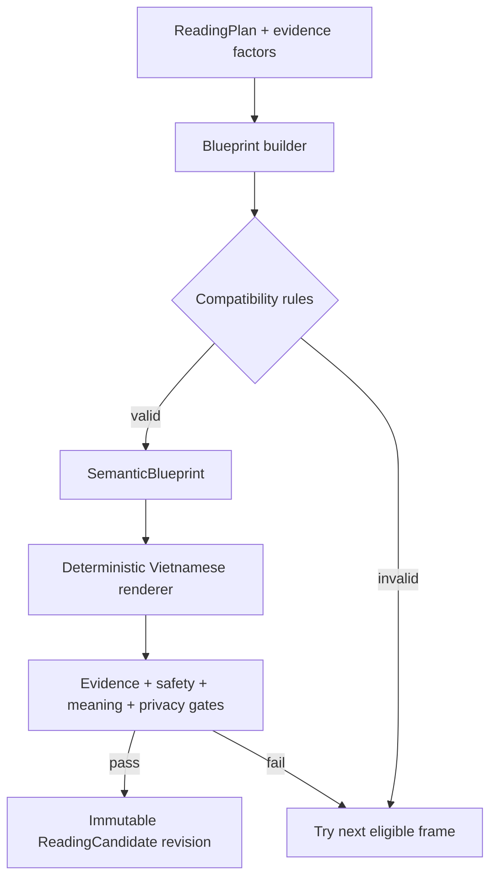
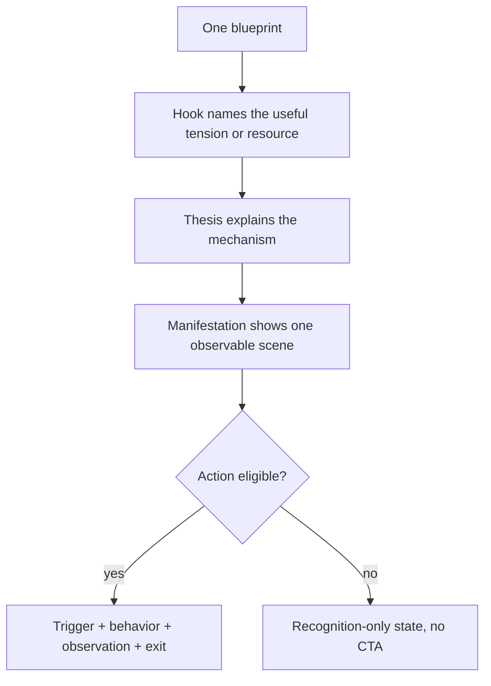

# feat: Repair Daily Note semantic coherence and usefulness

## Goal Capsule

- **Objective:** Daily Note và Reading Detail phải đọc thành một ý rõ, một tình huống đời thường nhất quán và một việc thử có ích; không còn đoạn đúng từng atom nhưng vô nghĩa khi ghép lại.
- **Means:** Thêm semantic blueprint trước prose, biến knowledge matrix thành atom có compatibility metadata, bổ sung Meaning Gate và benchmark trải nghiệm.
- **Authority:** Bản ideation ngày 2026-09-27 và quyết định người dùng chọn combo Semantic Scene Compiler + Typed Knowledge Matrix + Meaning Gate.
- **Stop conditions:** Không phát hành nếu context đổi chart facts, prose chứa dữ liệu sinh thô, action không liên quan thesis, section thuộc nhiều arena, hoặc uniqueness chỉ còn được chứng minh bằng khác chuỗi.

## Product Contract

### Summary

Thay cách sinh nội dung từ “chọn và nối các mảnh câu” sang “chọn một blueprint có nghĩa rồi render”. Bản sửa giữ engine tính chart, evidence, immutable revision, consent và privacy boundary hiện tại; chỉ thay lớp synthesis, editorial validation và UI fallback liên quan.

### Problem Frame

Date-only đang chọn hook và practice độc lập. Full synthesis nối planet need, aspect, house/context và lens bằng template chung; context còn có thể được áp sau synthesis. Vì vậy coverage và 365-day uniqueness đều pass trong khi người dùng nhận nội dung trừu tượng, lạc bối cảnh và CTA không giải quyết điều vừa đọc.

### Requirements

- R1. Mỗi candidate phải có một semantic blueprint gồm evidence-bound thesis, một arena, một observable scene, một mechanism, một action contract hoặc lý do hợp lệ để không có action.
- R2. Hook, thesis, manifestation và action phải được render từ cùng blueprint; không được post-overwrite context sau synthesis.
- R3. Knowledge atom phải khai báo vai trò, scene/arena compatibility, precision requirement và exclusions đủ để chặn tổ hợp vô nghĩa trước prose.
- R4. Date-only chỉ dùng thông tin ngày sinh được phép nhưng vẫn phải tạo scene/action coherent; không giả Moon, house, transit hoặc độ cá nhân hóa full chart.
- R5. Full chart phải phân biệt rõ hai chức năng hành tinh, loại tương tác và một vùng đời sống; orb chỉ điều chỉnh độ ưu tiên, không trở thành nội dung chính.
- R6. Action có tối đa một việc, gồm trigger, behavior, observation và exit/permission; action phải liên quan trực tiếp mechanism và không gây ảnh hưởng quyết định hệ trọng.
- R7. Meaning Gate phải chặn cross-section arena mismatch, semantic repetition, abstract/unobservable manifestation, action/thesis mismatch và nội dung nội bộ hướng vào hệ thống thay vì người dùng.
- R8. Quality suite phải kiểm counterfactual discriminability: đổi factor liên quan làm blueprint đổi; đổi context chỉ đổi scene/action được phép; chart facts/evidence không đổi.
- R9. Daily novelty phải được đo bằng semantic signature của blueprint, không chỉ tuple prose; same-day replay vẫn deterministic và stateless.
- R10. UI không hiển thị “chưa có thử nghiệm” như lỗi nội bộ. Khi candidate không có action contract, surface dùng trạng thái “một điều để nhận ra” và không hiển thị CTA giả.
- R11. Content audit và experience gate phải cover Daily/Reading Detail, không chỉ Radar, với golden cases có câu trả lời rõ cho “note này đang nói điều gì?”.
- R12. Không gửi raw DOB, giờ/nơi sinh, chart snapshot, reading prose hoặc feedback riêng tư sang provider mới; external generation vẫn off/fail-closed như hiện tại.

### Key Decisions

- **Semantic blueprint trước prose.** (session-settled: user-approved — chosen over expanding templates: thêm atom trong kiến trúc cũ làm tăng tổ hợp sai.) Governs R1–R5, R9.
- **Typed deterministic matrix là authority.** (session-settled: user-approved — chosen over free-form LLM writer: cần audit được evidence và privacy.) Governs R3–R5, R12.
- **Meaning quality là release gate.** (session-settled: user-approved — chosen over copy review after deploy: lỗi hiện tại đã pass mọi gate kỹ thuật.) Governs R7–R11.

### Success Criteria

- Không còn output mẫu đã báo lỗi: Pisces hook/practice rời rạc, work scene trộn House 8 không liên quan, micro-action đi cùng “chưa có thử nghiệm”.
- Golden corpus đại diện date-only/full chart/context đạt 100% structural coherence; mọi case có một arena và action link hợp lệ.
- Near-neighbor tests chứng minh thay đổi có liên quan làm semantic signature đổi, thay đổi không liên quan không làm evidence trôi.
- Focused API tests, content audit, web tests và full project check pass.

## Planning Contract

### Key Technical Decisions

- KTD1. Thêm `SemanticBlueprint` dạng immutable typed model giữa `ReadingPlan` và `ReadingCandidate`; renderer chỉ nhận blueprint, không tự suy luận hoặc override context.
- KTD2. Dùng enum/key đóng cho arena, scene, mechanism và action family; prose vẫn deterministic và versioned.
- KTD3. Giữ `ReadingCandidate` projection tương thích API; blueprint metadata chỉ giữ server-side qua `knowledge_refs`/semantic signature tối thiểu, không gửi private chart internals xuống client.
- KTD4. Meaning Gate kết hợp invariant deterministic với fixture benchmark; không dùng một LLM judge làm release authority.
- KTD5. Characterization-first: thêm failing cases cho ba lỗi người dùng chỉ ra trước khi thay synthesis.

### High-Level Technical Design

### Assumptions

- Launch scope remains Western deterministic prose; Jyotish interpretation stays fail-closed.
- No database migration is needed because revisions continue storing the public candidate and existing plan identity.
- Existing consent covers deterministic interpretation for the same purpose; no new personal-data category is introduced.

### Scope Boundaries

- **In scope:** Daily Note, Reading Detail, knowledge/rendering/gates/tests, Daily UI action fallback, content/experience audit and foundation docs.
- **Deferred:** reason-coded feedback learning loop and provider-assisted prose.
- **Out of scope:** chatbot, free-text journal ingestion, new astrology techniques, inferred background, matching/Radar changes.

### Risks & Dependencies

- Tight compatibility rules may reduce eligible variants; fallback must prefer a smaller coherent corpus over generic prose.
- Existing immutable revisions keep old copy until an update is generated/activated; tests must distinguish newly rendered candidates from stored historical ones.
- Vietnamese semantic checks cannot rely on token equality alone; fixture-based assertions remain the authority for nuanced cases.

## Implementation Units

### U1. Characterize current semantic failures and update the product contract

- **Goal:** Turn the reported bad outputs into failing, traceable acceptance cases before changing synthesis.
- **Requirements:** R1–R7, R10–R12.
- **Files:** `docs/foundation/la-lanh-reading-knowledge-spec.md`, `docs/operations/content-matrix-release-gate.md`, `apps/api/tests/readings/test_knowledge.py`, `apps/api/tests/readings/test_gates.py`, `apps/web/src/shared/ui/ReadingContent.test.tsx`.
- **Execution note:** Add characterization tests first.
- **Test scenarios:** Date-only Pisces output has one scene and a related action; work context cannot import an incompatible House 8 scene; a missing experiment never produces contradictory user-facing status; docs retain evidence/privacy boundaries.

### U2. Introduce semantic blueprint and typed compatibility metadata

- **Goal:** Make meaning, scene and action eligibility explicit before prose.
- **Requirements:** R1–R6, R9, R12.
- **Dependencies:** U1.
- **Files:** `apps/api/app/domains/readings/models.py`, `apps/api/app/domains/readings/knowledge.py`, `apps/api/app/domains/readings/interpretive_lenses.py`, `apps/api/tests/readings/test_knowledge.py`.
- **Test scenarios:** Blueprint validates one arena; incompatible atom combinations fail closed; date-only/full plans create deterministic semantic signatures; context changes scene/action without changing evidence factor refs.

### U3. Render every section from one blueprint

- **Goal:** Remove independent slot concatenation and post-render context overwrite.
- **Requirements:** R2–R6, R9.
- **Dependencies:** U2.
- **Files:** `apps/api/app/domains/readings/knowledge.py`, `apps/api/app/domains/readings/renderers.py`, `apps/api/app/domains/readings/application.py`, `apps/api/tests/readings/test_renderers.py`, `apps/api/tests/readings/test_application.py`.
- **Test scenarios:** Hook/thesis/manifestation/action share arena and mechanism; same input replays identically; neighboring dates rotate blueprint meanings; user context changes only compatible scene/action fields; unsupported combinations choose a coherent fallback.

### U4. Add Meaning Gate and discriminability audit

- **Goal:** Prevent semantic regressions from becoming publishable revisions.
- **Requirements:** R7–R9, R11–R12.
- **Dependencies:** U2–U3.
- **Files:** `apps/api/app/domains/readings/gates.py`, `apps/api/app/domains/readings/models.py`, `apps/api/tests/fixtures/readings/vi_gate_corpus.json`, `apps/api/tests/readings/test_gates.py`, `apps/api/scripts/audit_content_matrix.py`, `package.json`.
- **Test scenarios:** Reject cross-arena sections, duplicate mechanisms, unobservable abstract scenes and unrelated actions; accept concise recognition-only notes; compare near-neighbor charts/dates; audit exits non-zero on any golden failure without printing personal data.

### U5. Align the user-facing action state and release experience gate

- **Goal:** Show either a useful experiment or a quiet recognition state, never implementation leakage.
- **Requirements:** R6, R10–R12.
- **Dependencies:** U3–U4.
- **Files:** `apps/web/src/shared/ui/ReadingContent.tsx`, `apps/web/src/shared/ui/ReadingContent.test.tsx`, `docs/operations/user-experience-release-gate.md`, `docs/operations/web-beta-release-runbook.md`.
- **Test scenarios:** Full synthesis action exposes trigger/observation/permission; recognition-only output has no fake CTA/status; compact/full modes render consistently; accessibility labels and 320–430px layout remain intact.

## Verification Contract

| Gate | Command | Covers | Pass signal |
|---|---|---|---|
| Focused readings | `uv run --directory apps/api pytest tests/readings` | U1–U4 | All reading tests pass |
| Content audit | `pnpm content:audit` | U4 | Golden and discriminability audit exits 0 |
| Focused web | `pnpm --filter @la-lanh/web test -- ReadingContent` | U1, U5 | Component tests pass |
| Static API | `pnpm api:lint && pnpm api:typecheck` | U2–U4 | Ruff and mypy pass |
| Static web | `pnpm web:lint && pnpm web:typecheck` | U5 | ESLint and TypeScript pass |
| Full regression | `pnpm check` | All | Complete project check exits 0 |

## Definition of Done

- R1–R12 are implemented and traced to passing tests.
- The three quoted failure classes cannot be reproduced by current renderers.
- Content audit evaluates semantic quality for Daily/Reading Detail and fails closed.
- Privacy/evidence/tradition gates remain unchanged or stronger; no new personal data is stored or sent externally.
- Docs and release runbooks describe the semantic gate and human experience review.
- No unrelated user changes are reverted or absorbed into implementation commits.

## Sources / Research

- `docs/ideation/2026-09-14-daily-note-personalization-matrix-ideation.html`
- `docs/foundation/la-lanh-reading-knowledge-spec.md`
- `docs/reviews/2026-09-23-content-matrix-meaningfulness-fix.md`
- `apps/api/app/domains/readings/knowledge.py:603`
- `apps/api/app/domains/readings/renderers.py:237`
- `apps/api/app/domains/readings/gates.py:352`
- [Plan-then-Generate](https://aclanthology.org/2021.findings-emnlp.76/)
- [Attribute First, then Generate](https://aclanthology.org/2024.acl-long.182/)
- [Forer personal validation study](https://pubmed.ncbi.nlm.nih.gov/18110193/)
- [NICE behavior-change guidance](https://www.nice.org.uk/guidance/ph49/chapter/1-Recom-)
