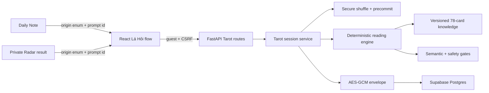
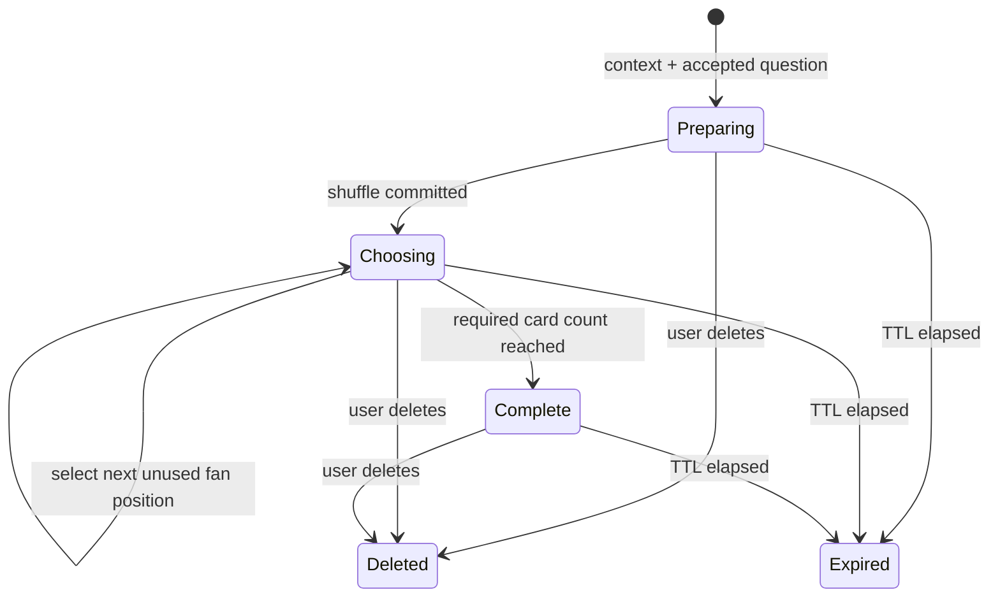
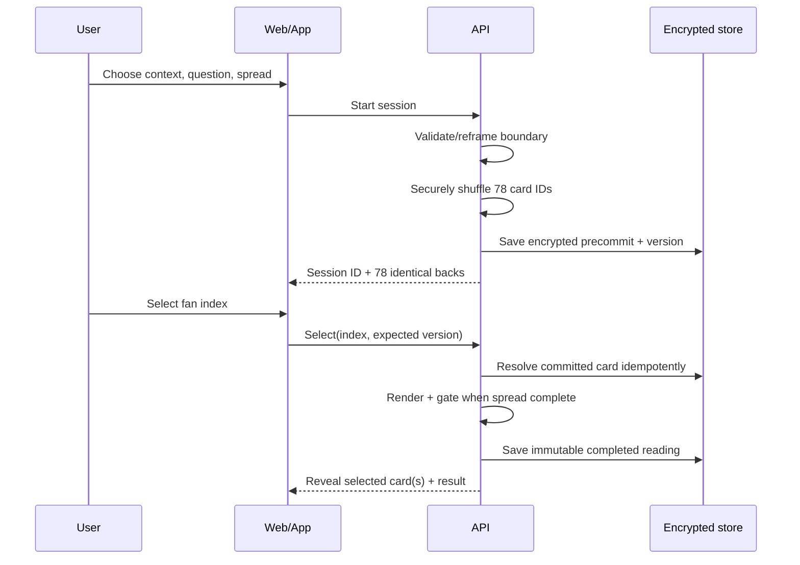
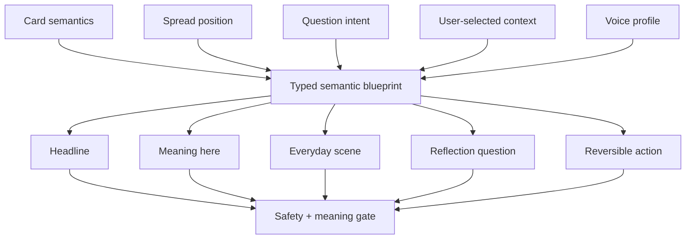

# Self-draw Tarot and original reading engine

## Summary

Add a guest-first Tarot experience called **Lá Hỏi**. A user chooses a life context, writes or selects a reflective question, chooses one or three cards from an accessible fan, and receives an original Vietnamese interpretation tied to that question. The backend precommits the shuffled deck, stores the private session encrypted, and can replay the same completed reading without redrawing.

This slice excludes CMS, human readers, payment, public sharing, reversals, and clarifier draws. The data model records the draw actor and purpose so those later modes can be added without changing the meaning of existing sessions.

---

## Problem Frame

Lá Lành has Astrology-based Daily and Radar readings, but no Tarot runtime. Adding a generic random-card page would repeat two known product problems: abstract copy that is detached from the user's situation, and a ritual that cannot be resumed or audited. The feature needs to feel tactile and personal without presenting randomness as scientific evidence or a certain prediction.

The main affected groups are:

- End users, who need a short, attractive, mobile-first draw with clear privacy and agency.
- Content and product owners, who need a broad, compositional knowledge model rather than copied book prose or one rigid template.
- Developers and operations, who need encrypted persistence, deterministic replay, provenance, tests, and a safe migration path.

---

## Goals

- Deliver the complete self-draw loop from entry to private result, resume, and delete.
- Support all 78 upright Tarot cards with original Vietnamese semantics and a compositional interpretation system.
- Use the selected context and question to make the reading concrete without changing the random draw.
- Make card selection resilient, accessible, and idempotent on narrow mobile screens.
- Preserve a clean boundary between Astrology evidence and Tarot reflection.

## Non-Goals

- CMS or editorial admin UI.
- Human Tarot reader discovery, booking, payment, chat, or moderation.
- Clarifier draws, unlimited redraws, reversed cards, predictive timing, or third-party mind-reading.
- Public sharing, social feed, streaks, compatibility scoring, or Tarot in birth onboarding.
- Importing, embedding, summarizing, or reproducing copyrighted book content.

### Deferred to Follow-Up Work

- A single clarifier tied to one unclear sentence or spread position.
- Private save library and allowlisted share cards.
- Reader-assisted sessions with explicit data-sharing consent.
- Editorial tooling for source review and knowledge releases.

---

## Product Requirements

- **R1 — Guest-first entry.** A guest can open Lá Hỏi, finish a draw, revisit it during the guest retention window, and delete it without creating an account.
- **R2 — Question before draw.** The user selects a context and either edits a suggested question or writes one before seeing the fan.
- **R3 — Reflective question boundary.** Questions that ask for certainty about another person's mind, health, legal, financial, safety, or irreversible decisions are gently reframed before drawing.
- **R4 — One- or three-card spread.** One card answers “Điều đáng nhìn lúc này”; three cards answer “Điều đã rõ”, “Điều dễ bỏ sót”, and “Một bước nhỏ có thể thử”.
- **R5 — Server-locked draw.** A cryptographically secure shuffle is persisted before cards appear. Question, birth data, chart, mood, context, and prior behavior do not alter card probability or deck order. The product does not claim a user-verifiable commitment proof in this release.
- **R6 — Stable selection.** Selecting a fan position reveals the card already committed to that position. Retries, app backgrounding, rotation, and duplicate taps cannot change previous selections. Repeating an already accepted fan index returns the current session even when the request carries the preceding version; a different stale selection conflicts.
- **R7 — Useful interpretation.** Each result explains the card in this position, connects it to the user's selected context and question, names a recognizable everyday scene, asks a reflection question, and offers one reversible action.
- **R8 — Anti-influence language.** The result does not predict certainty, diagnose, command a consequential action, claim another person's intentions, or imply Astrology evidence caused the Tarot draw.
- **R9 — Original knowledge.** All shipped Vietnamese card and combination language is original. The engine records concept-level source provenance and rights metadata without storing copyrighted excerpts.
- **R10 — Private by default.** Raw questions, deck order, selected cards, and readings are encrypted at rest; they do not appear in analytics, access logs, error messages, URLs, or public responses.
- **R11 — User control.** A user can stop before drawing, revisit the committed session, and permanently delete it. The UI explains the retention period and that the reading is a reflection prompt, not a fixed verdict.
- **R12 — Mobile and accessible ritual.** The fan works at 320–430 px widths, at 200% text, with keyboard and screen-reader controls, 44 px targets, reduced motion, safe areas, and no page-level horizontal overflow.
- **R13 — Product entry points.** Lá Hỏi is available directly and through contextual CTAs after Daily Note and private Radar results; integrations pass only non-sensitive context enums and prompt identifiers.
- **R14 — Evidence separation.** Astrology chart facts never enter the shuffle. If Daily or Radar starts a session, the result labels that content as “ngữ cảnh bạn mang vào”, not evidence for the card.

## Acceptance Examples

- **AE1.** Given a new guest selects “Quan hệ”, edits a suggested question, and chooses a one-card draw, when they tap fan position 17, then the backend returns the precommitted card for position 17 and a concrete relationship-oriented reading.
- **AE2.** Given a three-card session has one selected card, when the same selection request is retried after a timeout, then no second card is consumed and the same revealed card is returned.
- **AE3.** Given a completed session is reopened in the same guest session, when the result loads, then its cards and wording are identical to the original response.
- **AE4.** Given the question asks “Người ấy chắc chắn đang nghĩ gì về mình?”, when the user continues, then the UI offers a self-focused reframe and does not start a draw until an acceptable question is chosen or edited.
- **AE5.** Given a user deletes a Tarot session, when the same session URL is fetched again, then it is unavailable and no question or result is returned.
- **AE6.** Given any of the 78 card identifiers and either spread type, when the engine renders a reading, then all required semantic blocks exist and pass anti-influence and non-empty content gates.

---

## Key Technical Decisions

- **KTD1 — Dedicated Tarot aggregate** `(session-settled: user-directed — chosen over mixing Tarot into Astrology readings: Tarot is a separate random reflection mode)`. Store a Tarot session with explicit `draw_actor=self` and `draw_purpose=first_reading`; do not reuse natal, Daily, or Radar evidence models. Governs R5, R8, R14.
- **KTD2 — Server-side precommit** `(session-settled: user-approved — chosen over client-only randomization: stable resume and auditability matter)`. Generate the full deck permutation with a cryptographically secure unbiased shuffle before the fan is shown, then encrypt it in the session payload. The API exposes only the number of identical backs and cards already selected, never the remaining order. Governs R5, R6, R10.
- **KTD3 — Deterministic interpretation after selection.** Once card IDs, spread positions, context, question category, voice, and knowledge version are fixed, rendering is deterministic. This keeps retries and replay stable. Governs R6, R7, R9.
- **KTD4 — Compositional original knowledge.** Define all Major Arcana cards directly and compose Minor Arcana from original suit, rank, and court semantics, with card-specific overrides only where needed. This provides full-deck breadth without copying any book's prose or structure. Governs R7, R9.
- **KTD5 — No copyrighted deck art.** Use original Cosmic Glass Signal card backs and abstract typographic faces. Card names and high-level concepts may be used; no Rider–Waite–Smith scans or modern deck images ship in this slice. Governs R9, R12.
- **KTD6 — Encrypted guest persistence.** Follow the existing guest identity, CSRF, AES-GCM envelope, TTL, no-store, and deletion conventions. Store only low-sensitivity enums in queryable columns; put question, deck order, selection, and reading in context-bound ciphertext. Governs R1, R10, R11.
- **KTD7 — Rule-based safety and semantic gates before response.** Validate question framing and every generated block for third-party mind-reading, certainty, high-stakes advice, duplication, abstraction, and missing scene/action content. No fallback returns an unsafe or empty reading. Governs R3, R7, R8.
- **KTD8 — Source provenance is concepts, not corpus.** Register five practitioner sources as design influences with allowed concept use and prohibited copying, plus a verified public-domain historical source where useful. Do not ingest copyrighted full text into prompts, embeddings, tests, or repository fixtures. Governs R9.
- **KTD9 — One launch voice.** Use the fixed `playful_grounded` voice instead of adding another user choice. The reading may be lightly playful, but each position must remain concrete and grammatically complete. This keeps the draw flow short and the editorial surface auditable.

---

## Knowledge and Rights Basis

The engine uses a clean-room functional specification. The following books shape complementary dimensions, not reusable text:

1. Rachel Pollack, *Seventy-Eight Degrees of Wisdom* — archetype and symbolic-depth lens.
2. Mary K. Greer, *Tarot for Your Self* — self-reflection, agency, and journaling lens.
3. Evelin Bürger and Johannes Fiebig, *The Complete Book of Tarot Spreads* — spread-position discipline.
4. Deborah Lipp, *Tarot Interactions* — reinforcement, contrast, progression, and card-combination lens.
5. Benebell Wen, *Holistic Tarot* — ethics, non-determinism, and personal-development lens.

The repository records title, author, publisher URL, concept-level influence, rights status, and prohibited use. No book passages, proprietary layouts, exercises, tables, examples, or illustrations are copied. Project Gutenberg's public-domain *The Illustrated Key to the Tarot* may be used only after edition and launch-jurisdiction rights are documented.

---

## High-Level Technical Design

### Component and data flow



### Session lifecycle



### Draw protocol



### Interpretation matrix



---

## Output Structure

```text
apps/api/app/domains/tarot/
  models.py
  knowledge.py
  engine.py
  service.py
  tables.py
apps/api/app/api/v1/routes/tarot.py
apps/api/tests/tarot/
apps/web/src/features/tarot/
  TarotPage.tsx
  TarotPage.test.tsx
  tarot.css
docs/foundation/la-lanh-tarot-engine-spec.md
docs/legal/tarot-source-rights-notes.md
```

---

## Implementation Units

### U1. Specify the Tarot domain, knowledge provenance, and privacy contract

**Goal:** Create the durable product and engine specification that code and future content releases must follow.

**Requirements:** R2–R5, R7–R11, R14; KTD1, KTD4, KTD5, KTD8.

**Dependencies:** None.

**Files:**

- `docs/foundation/la-lanh-tarot-engine-spec.md`
- `docs/legal/tarot-source-rights-notes.md`
- `docs/legal/privacy-security-flow-notes.md`
- `docs/operations/web-beta-release-runbook.md`
- `docs/operations/hetzner-supabase-release-runbook.md`

**Approach:**

1. Define card, spread, session, reading, voice, source, and safety semantics without mixing Astrology evidence into Tarot.
2. Record allowed concept use and prohibited copying for all five sources and any public-domain reference.
3. Add Tarot data classes, retention, deletion, logging exclusions, and misuse cases to the existing privacy and security flow notes.
4. Add Tarot content, security, privacy, migration, and mobile-flow gates to the deployment checklist.

**Patterns to follow:** Existing reading knowledge spec, content matrix release gate, and deployment checklist conventions.

**Test scenarios:** Test expectation: none — this unit defines the contract; later units encode it as automated gates.

**Verification:** A reviewer can trace each user-visible claim and each stored field to a source-rights, privacy, and safety rule.

### U2. Build the versioned 78-card knowledge and deterministic reading engine

**Goal:** Cover the complete upright deck and produce concrete, original Vietnamese readings from typed inputs.

**Requirements:** R3, R4, R7–R9, R14; AE6; KTD3, KTD4, KTD7, KTD8.

**Dependencies:** U1.

**Files:**

- `apps/api/app/domains/tarot/__init__.py`
- `apps/api/app/domains/tarot/models.py`
- `apps/api/app/domains/tarot/knowledge.py`
- `apps/api/app/domains/tarot/engine.py`
- `apps/api/tests/tarot/test_knowledge.py`
- `apps/api/tests/tarot/test_engine.py`
- `apps/api/tests/fixtures/tarot/vi_gate_corpus.json`

**Approach:**

1. Model 22 Major Arcana and all Minor Arcana suit/rank/court combinations with stable IDs and versioned provenance.
2. Render each position through one semantic blueprint joining card, context, intent, scene, reflection, and reversible action.
3. Add question classification/reframe hints and content gates for certainty, high-stakes advice, mind-reading, duplicated needs, vague abstractions, and missing practical meaning.
4. Make the same typed input return byte-stable semantic content for replay.

**Execution note:** Implement deck coverage and gate fixtures before expanding prose variants.

**Patterns to follow:** `apps/api/app/domains/readings/knowledge.py`, reading gates, and relationship knowledge registries.

**Test scenarios:**

- Covers AE6. Every stable card ID renders required blocks for both spread types without an exception.
- A relationship question and The Hermit produce relationship-specific everyday language without claiming what another person thinks.
- A work question and a Minor Arcana card use work scenes and a reversible action rather than generic spiritual wording.
- Repeated rendering of identical normalized input yields the same output and provenance version.
- Gate fixtures reject certainty, health/legal/financial directives, third-party mind-reading, duplicated clauses, empty scenes, and abstract filler.
- Every knowledge atom has non-empty original text and rights/provenance metadata.

**Verification:** Full-deck tests pass, output includes every required block, and no prohibited phrase fixture passes the release gate.

### U3. Add encrypted, idempotent Tarot sessions and API

**Goal:** Persist a fair precommitted draw that guests can resume, complete, and delete safely.

**Requirements:** R1, R2, R5, R6, R10, R11; AE1–AE5; KTD1, KTD2, KTD3, KTD6.

**Dependencies:** U2.

**Files:**

- `apps/api/app/domains/tarot/tables.py`
- `apps/api/app/domains/tarot/service.py`
- `apps/api/app/api/v1/routes/tarot.py`
- `apps/api/app/api/v1/router.py`
- `apps/api/app/db/base.py`
- `apps/api/app/main.py`
- `apps/api/migrations/versions/20260927_0022_tarot_sessions.py`
- `apps/api/tests/tarot/test_service.py`
- `apps/api/tests/tarot/test_api.py`
- `apps/api/tests/privacy/test_at_rest_encryption.py`

**Approach:**

1. Add a guest-owned session row with queryable state/version/timestamps and an encrypted context-bound payload.
2. Start a session only after question validation, then securely shuffle and persist all 78 stable card IDs before returning fan metadata.
3. Resolve selections by fan index with optimistic versioning; recognize an already accepted fan index before rejecting a stale version, and generate and freeze the result at the required card count.
4. Enforce guest ownership, CSRF on mutations, no-store responses, retention/expiry, safe errors, and permanent deletion.

**Execution note:** Start with API behavior tests for precommit, retry, ownership, and deletion before wiring the frontend.

**Patterns to follow:** Guest session API, Radar encrypted payload, Daily repository TTL, CSRF middleware, and Alembic naming conventions.

**Test scenarios:**

- Covers AE1. Starting and selecting a one-card session returns the card precommitted to that fan index and completes the reading.
- Covers AE2. Retrying the same selection with the prior request identity returns the same state without consuming another position.
- Covers AE3. Re-fetching a completed session returns identical cards, content, and knowledge version.
- Covers AE4. A third-party certainty question returns a reframe response and stores no deck until accepted.
- Covers AE5. Deletion removes the row and subsequent fetch returns unavailable.
- Two concurrent different selections with the same expected version cannot both advance the session.
- A guest cannot fetch, mutate, or delete another guest's session.
- Plaintext question, deck order, and reading phrases are absent from database row fields and request logs.
- Expired sessions are inaccessible and eligible for cleanup.

**Verification:** Migration round-trips, API tests prove ownership and idempotency, and privacy tests prove sensitive payload encryption.

### U4. Implement the Cosmic Glass Signal fan and reading flow

**Goal:** Give web and app users a complete, tactile, accessible self-draw experience.

**Requirements:** R1–R4, R6, R7, R11, R12; AE1–AE4; KTD5.

**Dependencies:** U3.

**Files:**

- `apps/web/src/features/tarot/TarotPage.tsx`
- `apps/web/src/features/tarot/TarotPage.test.tsx`
- `apps/web/src/features/tarot/tarot.css`
- `apps/web/src/app/router.tsx`
- `apps/web/src/shared/api/client.ts`
- `apps/web/src/styles/global.css`

**Approach:**

1. Build four progressive states: intention, question, fan selection, and result; restore the server session on reload.
2. Render identical card backs in an internally scrollable/fanned control with explicit selected-count feedback and original typographic card faces.
3. Display meaning, question connection, everyday scene, reflection prompt, action, provenance, disclaimer, and delete control with strong scan hierarchy.
4. Respect reduced motion, focus order, safe areas, dynamic type, and touch/keyboard interaction.

**Patterns to follow:** Cosmic Glass Signal tokens, Radar progressive forms, `AppSheet`, and existing guest-session reliability handling.

**Test scenarios:**

- A guest can choose a suggestion, edit it, select one card, and reach a complete result.
- A three-card session labels each selected position and prevents selecting the same back twice.
- A question requiring reframe keeps focus near the explanation and lets the user accept or edit the suggested wording.
- Reload during selection restores previously revealed cards and does not redraw.
- Network timeout allows safe retry without duplicating a selection.
- Keyboard and screen-reader users can identify and choose each face-down card.
- The flow remains usable at 320 px width, 200% text, reduced motion, and native safe-area insets.

**Verification:** Component tests cover all states and a browser pass confirms no page-level horizontal overflow or inaccessible controls.

### U5. Add safe contextual entry points from Daily and Radar

**Goal:** Let existing insights lead naturally into Tarot without leaking or relabeling Astrology evidence.

**Requirements:** R2, R8, R13, R14; KTD1, KTD7.

**Dependencies:** U4.

**Files:**

- `apps/web/src/features/home/NoteDetailPage.tsx`
- `apps/web/src/features/home/NoteDetailPage.test.tsx`
- `apps/web/src/features/radar/RadarOwnerResultPage.tsx`
- `apps/web/src/features/radar/RadarRecipientFlow.test.tsx`
- `apps/web/src/features/tarot/TarotPage.tsx`

**Approach:**

1. Add a Daily CTA with three question suggestions based on the selected everyday context, not raw chart evidence.
2. Add an owner-only private Radar CTA with self-focused relationship questions and no recipient name or report prose in the URL.
3. Pass only allowlisted origin/context/prompt IDs and label imported material as user context rather than proof.

**Patterns to follow:** Existing route-state boundaries, Radar owner/private distinction, and Daily context selector.

**Test scenarios:**

- Opening from Daily preselects the expected context and suggestion while allowing edits.
- Opening from private Radar supplies relationship prompts without serializing names, chart contacts, or result text.
- Opening from a public/shared Radar surface shows no Tarot CTA carrying private context.
- Invalid query or route state falls back to the direct Tarot start safely.

**Verification:** Integration tests show both private entry paths reach the same Tarot flow with only allowlisted parameters.

### U6. Extend release gates and verify the end-to-end slice

**Goal:** Prevent regressions in content quality, privacy, security, contracts, mobile UX, and deployment.

**Requirements:** R1–R14; AE1–AE6; KTD1–KTD8.

**Dependencies:** U1–U5.

**Files:**

- `apps/api/scripts/audit_tarot_knowledge.py`
- `package.json`
- `scripts/verify-privacy.mjs`
- `scripts/qa-cli-smoke.mjs`
- `apps/api/tests/integration/test_local_product_flow.py`
- `apps/web/e2e/tarot.spec.ts`
- `docs/operations/web-beta-release-runbook.md`
- `docs/operations/hetzner-supabase-release-runbook.md`

**Approach:**

1. Add a Tarot audit covering 78-card completeness, provenance, prohibited text, semantic blocks, and deterministic rendering.
2. Add privacy verification for endpoint caching, logging exclusions, encryption, deletion, and retention.
3. Add browser and API smoke coverage for direct, Daily-origin, and Radar-origin flows.
4. Make Tarot content and experience audits blocking in the normal check and deployment checklist.

**Patterns to follow:** Existing `content:audit`, `experience:audit`, runtime privacy verification, QA CLI smoke, and deployment proof receipts.

**Test scenarios:**

- The release check fails when one card or provenance record is missing.
- The release check fails when a fixture contains certainty, mind-reading, high-stakes advice, or abstract filler.
- The QA smoke creates a guest, starts a session, selects required cards, reloads the result, and deletes it.
- Production-like built assets serve `/tarot` directly and survive refresh without a blank page.
- API OpenAPI and generated client contracts remain synchronized.

**Verification:** The full repository check passes and the built product completes the Tarot flow at mobile widths with no console, API, migration, or privacy errors.

---

## Verification Contract

The feature is accepted only when all of the following are true:

- Domain tests cover all 78 upright cards, both spreads, all contexts, deterministic replay, and safety gates.
- API tests prove secure precommit, ownership, CSRF, optimistic concurrency, duplicate retry, TTL, encryption, and deletion.
- Web tests cover intention, reframe, fan, result, resume, timeout, and delete states.
- Browser QA runs at 320, 360, 390, and 430 px and at 200% text with reduced motion.
- Daily and private Radar entry points pass only allowlisted non-sensitive identifiers.
- OpenAPI contracts are regenerated and contract checks pass.
- Content, privacy, security, lint, type, unit, integration, build, and QA smoke gates pass.
- No copyrighted book prose, proprietary spread, worksheet, table, exercise, or deck image is present in source, fixtures, generated output, or assets.

## Definition of Done

- A first-time guest can complete the direct Lá Hỏi flow from question to result on the public beta without login.
- One- and three-card readings are stable across refresh and retry and can be deleted by their owner.
- All 78 cards produce concrete original Vietnamese content with provenance and safety metadata.
- The feature uses the selected Cosmic Glass Signal direction and remains usable on web plus the Capacitor app shell.
- Docs, security, privacy, content experience, migration, and deployment gates are updated and passing.
- Deferred reader, clarifier, CMS, public share, and reversal capabilities remain absent from the shipped UI.

---

## Risks and Mitigations

- **Content becomes generic despite more cards.** Use the typed blueprint and scene/action gates; reject missing semantic joins rather than padding with vague prose.
- **Randomness appears manipulated.** Precommit the permutation before selection, document that question/context do not affect odds, and keep shuffle tests independent from rendering tests.
- **Repeated draws encourage answer-shopping.** Persist and restore the active session, avoid a “draw again” CTA, and defer clarifiers until a bounded design ships.
- **Question text exposes private situations.** Encrypt it, exclude it from URLs/logs/analytics, and keep public sharing out of scope.
- **Book-derived language creates copyright exposure.** Store only concept-level provenance, write clean-room Vietnamese content, and run phrase-overlap/manual source review before release.
- **The fan fails on small screens or app WebView.** Use internal scroll/fan containment, safe-area tokens, non-motion fallback, and required physical-device/browser checks.

## Research References

- [Seventy-Eight Degrees of Wisdom — publisher](https://redwheelweiser.com/book/seventy-eight-degrees-of-wisdom-9781578636655/)
- [Tarot for Your Self — publisher](https://www.simonandschuster.co.uk/books/Tarot-for-Your-Self/Mary-K-Greer/9781578636792)
- [The Complete Book of Tarot Spreads — publisher](https://www.hachettebookgroup.com/titles/evelin-burger/complete-book-of-tarot-spreads/9781454910794/)
- [Tarot Interactions — publisher](https://www.llewellyn.com/product.php?ean=9780738745206)
- [Holistic Tarot — publisher](https://www.northatlanticbooks.com/shop/holistic-tarot/)
- [The Illustrated Key to the Tarot — Project Gutenberg](https://www.gutenberg.org/ebooks/43548)
- [U.S. Copyright Office Circular 33](https://www.copyright.gov/circs/circ33.pdf)
- [U.S. Copyright Office AI training report](https://copyright.gov/ai/Copyright-and-Artificial-Intelligence-Part-3-Generative-AI-Training-Report-Pre-Publication-Version.pdf)
