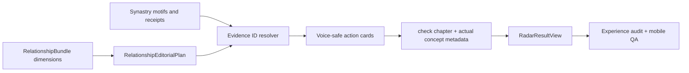

# feat: Nối relationship corpus vào Radar và thêm experience release gate

## Goal Capsule

- **Objective:** Bản beta phải cho người dùng một báo cáo Radar cụ thể, dễ đọc, có ích ngoài đời và khác nhau theo đúng chart; release không được pass chỉ vì chức năng/API chạy.
- **Means:** Nối `RelationshipEditorialPlan` vào chương hành động của Radar, đồng bộ evidence/provenance, thêm giọng đọc do người dùng chủ động chọn, và đưa content + UX acceptance thành release gate bắt buộc.
- **Authority:** `docs/foundation/la-lanh-radar-hop-gu-spec.md`, `docs/foundation/la-lanh-reading-knowledge-spec.md`, `docs/operations/content-matrix-release-gate.md` và các quyết định đã chốt trong session.
- **Stop conditions:** Không thêm free-form LLM, không suy đoán giọng đọc từ chart/hành vi, không thêm raw birth data vào result/log/analytics, không biến meter thành xác suất thành công và không mở public sharing mới.
- **Execution profile:** Test-first cho projection/content contract; additive API và migration enum nhỏ; mobile browser QA trước deploy.

## Product Contract

### Problem frame

Radar hiện có Dossier UI và một relationship knowledge registry gồm 23 concept, 6 dimension và 4 voice profile. Tuy nhiên public dossier chủ yếu render từ catalog hard-code trong `apps/api/app/domains/radar/reading.py`; `RelationshipEditorialPlan` chưa đi tới phần người dùng đọc, `concept_ids` trong metadata chưa phải danh sách được chọn từ plan, evidence IDs giữa dimension planner và Radar receipt khác format, và người dùng chưa thể chọn giọng đọc. Chức năng đúng nhưng giá trị nội dung chưa dùng hết knowledge đã xây.

Release gate hiện đo coverage kỹ thuật nhưng chưa đánh giá trải nghiệm: người đọc có hiểu ngay, scan được trên mobile, nhận ra bản đọc dành cho đúng cặp, biết nên quan sát gì và có thể truy ngược căn cứ hay không.

### Key decisions

- **Content plan phải xuất hiện trong visible report.** Không tính một corpus là “đã tích hợp” nếu nó chỉ nằm trong metadata hoặc test riêng.
- **Voice luôn là lựa chọn rõ ràng của người dùng.** Không suy từ cung, chart, mood hoặc hành vi; mặc định `straight_warm` để tương thích.
- **Một concept chỉ được hiển thị khi có evidence thật.** Evidence ID của editorial prompt phải map được tới receipt đang có trong result.
- **Action chapter là nơi tích hợp đầu tiên.** Giữ bốn chương và scan hierarchy hiện tại; concept trở thành 1–3 “thử ngoài đời” ngắn thay vì thêm một bài luận mới.
- **UX gate đo outcome, không chỉ pixel.** Automated checks chặn copy rỗng/lặp/jargon/không action/evidence orphan; browser checklist kiểm tra scanability, contrast, reflow, keyboard và mobile touch target.
- **Không ép tăng chữ ở mọi deploy.** Normal release cần một cải tiến trải nghiệm có test; emergency security/availability hotfix dùng waiver và bù ở release kế tiếp.

### Requirements

**Corpus integration**

- R1. `build_radar_reading` phải tạo `RelationshipEditorialPlan` từ `bundle.dimensions`, dùng đúng knowledge version và trả `concept_ids` thực tế đã chọn.
- R2. Mỗi selected prompt phải map evidence từ format dimension (`synastry:a:b:kind`) sang Radar receipt tương ứng; prompt không map được phải fail closed, không hiện như claim vô căn cứ.
- R3. Chương `check` hiển thị tối đa ba thử nghiệm khác dimension, mỗi thử nghiệm có label, copy đời thường, evidence IDs và không lặp lại section lede.
- R4. Nội dung vẫn conditional, không chẩn đoán, không bảo người dùng yêu/chia tay/đối chất và không dùng chart để suy consent hoặc ý định.

**Explicit voice**

- R5. Bốn voice option hiện hữu (`straight_warm`, `gentle_specific`, `playful_grounded`, `deep_dive`) được hiển thị bằng tên và mô tả ngắn trước CTA Radar; default là `straight_warm`.
- R6. Voice được gửi dưới dạng enum, lưu cùng Radar request/result để reload và invite flow giữ cùng cách viết; không phải dữ liệu nhạy cảm và không được suy ra tự động.
- R7. Voice thay đổi framing/cấu trúc câu của thử nghiệm nhưng không thay chart fact, evidence, score hoặc safety boundary.

**Content and UX release gate**

- R8. `pnpm experience:audit` dựng representative readings qua nhiều pair/context/voice và fail nếu: main copy có jargon chưa giải thích, section trùng luận điểm, action không cụ thể, concept không có evidence, metadata sai, hoặc pair khác nhau chỉ đổi synonym.
- R9. Component/browser acceptance kiểm tra hierarchy: Pair Signature → ba indicator → bốn chapter; chương đầu mở sẵn, còn lại scan được khi đóng, evidence nằm sau meaning, CTA và controls có label rõ.
- R10. Mobile viewport 360–390 px không horizontal overflow/clipping; body text đạt contrast tối thiểu WCAG AA, focus visible, target tối thiểu 24×24 CSS px và text resize/reflow không mất chức năng.
- R11. Release evidence phải có content diff, automated experience audit, representative screenshots và một scorecard người dùng cuối gồm: clarity, specificity, usefulness, scanability, trust/safety. Mỗi mục phải pass; không lấy trung bình để che một mục fail.

**Privacy and compatibility**

- R12. Kết quả cũ không có voice/editorial highlights vẫn render; API default giữ behavior hiện tại.
- R13. Không thêm raw birth input, coordinate, free text, analytics hoặc external generation. Retention, encryption, deletion và consent hiện tại không đổi.

### Acceptance examples

- AE1. Cùng một pair/evidence, đổi voice chỉ làm đổi cách trình bày action; indicator, section evidence và Pair Signature facts không đổi.
- AE2. Hai pair khác nhau tạo concept/evidence hoặc action khác nhau ở cấp ý; không chỉ thay tên hành tinh.
- AE3. Prompt có evidence ID không map được sẽ bị bỏ; metadata không được claim concept đó.
- AE4. Radar result có ba action thuộc ba dimension khác nhau khi bundle đủ coverage; bundle mỏng được phép chỉ có một action.
- AE5. Stored result cũ thiếu `voice` vẫn hiển thị với default label và không crash.
- AE6. Người dùng không biết astrology đọc được title/body/action mà không mở evidence; thuật ngữ body/aspect/orb chỉ nằm trong disclosure.
- AE7. Ở 360 px, không có scroll ngang; keyboard mở/đóng chapter và thấy focus; CTA giải thích kết quả hành động.
- AE8. Serialized response/database/log scan không chứa DOB, birth time/place, coordinates hoặc token.

### Success criteria

- Relationship corpus thật sự điều khiển ít nhất một phần visible report và metadata phản ánh đúng concept đã dùng.
- 4/4 voice có output khác nhưng giữ cùng facts/safety; không có “giọng Gen Z” kiểu slang cưỡng ép.
- Experience audit, reading/relationship/Radar tests, web component tests và mobile browser QA đều pass.
- User scorecard không có dimension fail; sample report có thể share để review mà không cần giải thích miệng.

## Technical design

### Data flow

### Contract changes

- Add `voice` enum to create/invite request and persisted Radar request with server default `straight_warm`.
- Add optional `voice` metadata/label and evidence-bound action highlights to the existing `radar-result-v2`; no result version bump is required because fields are additive and old projections remain supported.
- Bump relationship knowledge/renderer/gate versions when visible copy changes.

### Evidence resolution

Use a canonical identity of `(body_a, body_b, aspect_kind)` for matching dimension evidence to a `Motif`; the public receipt keeps its existing orb-bearing ID. Mapping is directional and deterministic. A prompt is publishable only if at least one canonical identity resolves to a receipt included in the result.

### UX quality scorecard

| Dimension | Pass condition |
|---|---|
| Clarity | Main meaning works without astrology terminology; headings describe their purpose. |
| Specificity | At least two pair-dependent claims/scenes change across near-neighbor fixtures. |
| Usefulness | Check chapter contains a reversible, observable action with a clear expected observation. |
| Scanability | Core takeaway and four chapter summaries are available without opening every disclosure. |
| Trust & safety | Evidence is reachable; uncertainty/disclaimer is subtle but present; no verdict or hidden inference. |

## Implementation units

### U1 — Wire relationship editorial plan into Radar

**Files:**

- `apps/api/app/domains/radar/reading.py`
- `apps/api/app/domains/relationships/knowledge.py`
- `apps/api/tests/radar/test_reading.py`
- `apps/api/tests/relationships/test_knowledge.py`

**Work:** Build the plan from real dimensions, resolve prompt evidence to motifs/receipts, render action highlights under the check chapter and derive metadata from published prompts only. Add low-signal degradation and pair/voice invariance tests.

### U2 — Persist and expose explicit voice choice

**Files:**

- `apps/api/app/domains/radar/models.py`
- `apps/api/app/domains/radar/tables.py`
- `apps/api/app/domains/radar/service.py`
- `apps/api/app/api/v1/routes/radar.py`
- `apps/api/migrations/versions/<new_voice_migration>.py`
- `apps/api/tests/radar/test_flow.py`
- `apps/web/src/shared/api/client.ts`
- `apps/web/src/features/radar/RadarPrivateStartPage.tsx`
- `apps/web/src/features/radar/RadarStartPage.tsx`
- relevant Radar component tests and CSS

**Work:** Add a defaulted enum field, carry it through both private and invite generation paths, show four concise choices with one selected by default, and keep stored/legacy results compatible.

### U3 — Add automated experience audit

**Files:**

- `apps/api/scripts/audit_content_experience.py`
- `apps/api/scripts/audit_content_matrix.py`
- `docs/operations/content-matrix-baseline.json`
- `package.json`
- targeted audit tests if helpers become non-trivial

**Work:** Generate representative readings for multiple pair fixtures, contexts and voices; evaluate concept/evidence integrity, content diversity, main-copy jargon, actionable language, section uniqueness and privacy. Add `pnpm experience:audit` to `pnpm check`.

### U4 — Tighten report UX and accessibility

**Files:**

- `apps/web/src/features/radar/RadarContinuePage.tsx`
- `apps/web/src/features/radar/RadarContinuePage.test.tsx`
- `apps/web/src/features/radar/radar.css`

**Work:** Label the selected voice without adding chrome noise, render evidence-bound action cards, preserve progressive disclosure, improve focus/target/contrast/reflow and verify old result fallback.

### U5 — Make experience QA a deployment gate

**Files:**

- `docs/operations/content-matrix-release-gate.md`
- `docs/operations/hetzner-supabase-release-runbook.md`
- `docs/plans/2026-09-26-hetzner-supabase-public-beta-deployment-plan.md`
- `docs/reviews/<dated-experience-qa>/README.md`

**Work:** Require the automated audit, mobile screenshots at 360/390 px, the five-dimension scorecard, privacy/security checks and evidence of a meaningful content delta before normal deploy. Document emergency waiver behavior.

## Verification contract

- Backend: relationship knowledge, Radar reading/flow, migration and privacy tests.
- Frontend: Radar start/result component tests, typecheck, lint and production build.
- Content: `pnpm content:audit` and new `pnpm experience:audit`.
- Full regression: `pnpm check`.
- Browser: private Radar flow on a fresh synthetic profile; 360 px and 390 px screenshots; keyboard disclosure/focus; no console/network errors; delete and capability revocation.
- Privacy/security: no raw birth fields or token in result/log/screenshot; encrypted stored projection; consent and TTL unchanged.

## Definition of done

- R1–R13 and AE1–AE8 pass.
- Visible Radar content uses actual selected relationship concepts with traceable receipts.
- All four user-selected voices are functional and safe.
- Experience gate is executable, documented and included in the normal release path.
- Representative mobile QA passes all five scorecard dimensions.
- No P0/P1 code-review, security, privacy or content-experience finding remains.

## Risks and boundaries

- A voice picker can become cosmetic; tests must prove changed framing while facts remain identical.
- More content can make the page longer; actions stay inside the existing check chapter and use progressive disclosure.
- Evidence ID conversion can misattribute a claim; unmatched prompts fail closed and tests cover directionality.
- A heuristic audit can produce false confidence; it complements, not replaces, representative browser/user review.
- W3C WCAG 2.2 is the accessibility baseline for contrast, reflow, headings, focus and target size. OWASP MASVS-PRIVACY-1 governs minimization and consent. New interpretation techniques still need separate methodology/expert gates.

## References

- https://www.w3.org/TR/WCAG22/
- https://www.w3.org/WAI/WCAG22/Techniques/
- https://mas.owasp.org/MASVS/controls/MASVS-PRIVACY-1/
- https://www.astro.com/astrology/in_intro_e.htm
