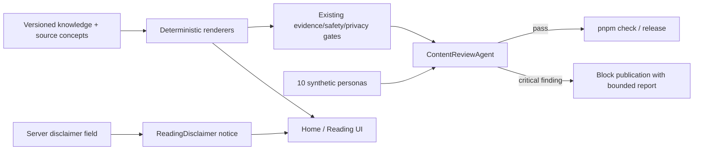

# Content trust, Daily Note priority, and release reviewer

## Goal Capsule

**Objective:** A first-time user sees today's personal note before secondary discovery paths, can
separate interpretation from safety guidance at a glance, and receives concrete astrology/Tarot
copy that survives a ten-persona review before any release.

**Means:** Separate user-facing insight from disclaimer UI, enrich the versioned knowledge methods
with six concept-level book sources, and make a deterministic content-review agent part of the
release gate (KTD1–KTD4).

**Authority hierarchy:** The user's latest hierarchy and content feedback overrides the existing
Home ordering. Existing chart facts, consent, ownership, deletion, retention, and anti-influence
contracts remain authoritative.

**Stop conditions:** Do not publish if any sampled reading contains abstract filler, embeds a
disclaimer inside the insight, loses evidence binding, repeats another persona's core content, or
requires new personal data to improve prose.

---

## Product Contract

### Summary

Repair the Daily Note experience at three connected levels: put it higher on Home, make caveats
visually distinct from the actual insight, and prevent vague content from passing release. Extend
the methodology with three additional astrology books and three Tarot books at concept level only;
runtime prose remains original and traceable.

### Problem Frame

The current date-only renderer can produce prose such as “pattern này có thể lộ ra…” followed by a
generic caveat. The sentence does not tell a user what to notice or what to do, while the caveat is
styled like ordinary content. On Home, the full Tarot and discovery router precedes Daily Note, so
the recurring core value remains below a tall acquisition block despite prior product direction.
Existing gates catch prohibited phrases and unsupported chart facts, but they do not evaluate a
representative cohort as a product editor would.

### Requirements

- **R1 — Daily-first hierarchy.** After the Home greeting and the question “Bạn đang muốn hiểu điều
  gì?”, the Daily Note heading and note card appear before Tarot and the three secondary paths.
- **R2 — Distinct disclaimer UI.** Astrology and Tarot disclaimers render through a reusable,
  accessible notice treatment with an icon, short label and low-emphasis surface; disclaimer text
  must not be mixed into hook, thesis, manifestation or action prose.
- **R3 — Concrete Daily prose.** Date-only notes name an observable situation, distinguish observed
  fact from inferred meaning where relevant, and offer a reversible action. They must not use the
  reported “pattern này…” paragraph or a generic “không khớp thì bỏ qua” sentence as insight.
- **R4 — Astrology methodology expansion.** Add concept-level provenance for Demetra George's
  *Astrology and the Authentic Self*, Frank Clifford's *Getting to the Heart of Your Chart*, and Liz
  Greene's *Saturn*. Encode planet-condition humility, whole-chart prioritization and developmental
  reframing as reviewable methodology principles; do not reproduce book expression.
- **R5 — Tarot methodology expansion.** Add concept-level provenance for Joan Bunning's *Learning
  the Tarot*, Melissa Cynova's *Kitchen Table Tarot*, and Lisa Freinkel Tishman's *Mindful Tarot*.
  Encode story coherence, plain everyday language and present-focused reflection; do not reproduce
  card entries, examples, spreads, exercises or distinctive wording.
- **R6 — Ten-persona release review.** A deterministic content-review agent exercises ten synthetic
  personas across Daily and Tarot, scores clarity, specificity, actionability, agency and
  distinctness, and fails closed on a critical defect.
- **R7 — Mandatory publication gate.** The content-review agent runs in the root `pnpm check` path
  and is documented in the deployment/content release checklist.
- **R8 — Privacy and security invariants.** Review fixtures contain no real DOB, place, relationship
  or question data; the agent runs offline, logs only fixture labels and bounded findings, and adds
  no telemetry, model provider or third-party data transfer.
- **R9 — Versioned visible behavior.** Bump the affected knowledge/methodology versions and keep
  generated provenance aligned with the concepts actually used.

### Key Decisions

- **Daily Note is the habit surface, discovery is secondary.** This governs R1.
- **A disclaimer is interface chrome, not insight prose.** This governs R2–R3.
- **Books shape methods, never runtime quotations.** This governs R4–R5 and preserves the existing
  rights boundary.
- **“Agent” means an automated editorial reviewer with auditable rules.** It does not call an LLM or
  receive user data. This governs R6–R8.

### Acceptance Examples

- **AE1:** Given Home has a loaded Daily Note, when the page renders, then the Daily card follows the
  main question heading and precedes Tarot and the `Mình / Một người / Hôm nay` links in DOM and
  visual order.
- **AE2:** Given a date-only Pisces reading, when it renders, then its manifestation describes a
  concrete observable scene and does not contain “pattern này”, “giả thuyết để soi”, or “không khớp
  việc thật thì bỏ qua”.
- **AE3:** Given any compact or full reading, when its disclaimer renders, then assistive technology
  exposes a labelled note and the caveat is visually separate from the interpretation.
- **AE4:** Given the ten synthetic personas, when the reviewer runs, then all ten receive distinct,
  evidence-bound Daily and Tarot outputs and the report shows no critical finding.
- **AE5:** Given a future vague phrase is added, when `pnpm check` runs, then the reviewer or content
  audit fails before build/deploy.

### Success Criteria

- 10/10 synthetic personas pass every critical editorial dimension.
- No sampled core section contains disclaimer language or the retired abstract fragments.
- The existing 365-day deterministic Daily novelty contract and 78-card Tarot coverage still pass.
- Home remains usable at 320 px and preserves keyboard/accessible reading order.

### Scope Boundaries

**In scope:** Home order, disclaimer presentation, Daily wording, method provenance, Tarot prose
principles, automated ten-persona review and release documentation.

**Deferred:** Free-form LLM generation, collection of user background, behavioral personalization
from feedback, Jyotish prose expansion, CMS, new Tarot spreads and a production redesign beyond the
affected Home/reading surfaces.

### Sources / Research

- Existing product contracts: `docs/foundation/la-lanh-question-first-home-spec.md`,
  `docs/foundation/la-lanh-reading-knowledge-spec.md`,
  `docs/foundation/la-lanh-tarot-engine-spec.md`.
- Existing rights method: `docs/foundation/la-lanh-interpretation-corpus-methodology.md` and
  `docs/legal/tarot-source-rights-notes.md`.
- Official publisher/author pages for the six added sources are recorded in those methodology files;
  only high-level concepts from public descriptions are eligible.
- Privacy baseline: Vietnam Personal Data Protection Law 91/2025/QH15 and existing repository
  privacy gates; no new personal-data flow is introduced.

---

## Planning Contract

### Key Technical Decisions

- **KTD1 — Split Home router into heading and discovery bodies.** Keep the question headline high,
  render Daily immediately after it, then render Tarot and capability links. Loading/error states
  follow the same order so the hierarchy never jumps between states. Governs R1.
- **KTD2 — Reusable `ReadingDisclaimer` component.** Render the server-owned disclaimer through one
  semantic notice component in compact/full/legacy views. Styling uses the existing Cosmic Glass
  tokens, an info/shield icon, and readable text rather than tiny footer copy. Governs R2.
- **KTD3 — Method principles are static, versioned knowledge.** Add source IDs and concept mappings;
  incorporate them into provenance only where the renderer uses the corresponding method. No book
  text enters runtime data. Governs R4–R5 and R9.
- **KTD4 — Deterministic offline reviewer.** A `ContentReviewAgent` receives pre-generated candidate
  fields, applies explicit rubric checks, and reports bounded evidence. A script supplies ten
  synthetic personas covering date-only/full, multiple lenses, one/three/five-card Tarot and
  near-neighbor cases. Governs R6–R8.
- **KTD5 — Human-readable failure over opaque score.** Scores summarize five dimensions, but any
  critical rule fails the command with the persona, surface, section and rule ID. A high aggregate
  score cannot hide a bad disclaimer, unsupported claim or empty action. Governs R6–R7.

### High-Level Technical Design

### Sequencing

Update contracts and knowledge provenance first, then repair prose and UI, then add the reviewer
against the final output shape. Finish with focused tests, the complete project gate and a mobile
browser review; do not deploy automatically as part of this plan.

### System-Wide Impact

No schema or API shape changes are expected. Visible copy changes create new reading revisions via
the bumped versions. The release gate becomes stricter and may expose existing weak atoms; those are
product findings to fix, not reasons to weaken the reviewer. Data collection, consent, retention,
ownership and deletion behavior remain unchanged.

---

## Implementation Units

### U1. Align product and rights contracts

**Goal:** Make the new hierarchy, disclaimer semantics, six source additions and publication gate
the documented product contract.

**Requirements:** R1–R5, R7–R9.

**Dependencies:** None.

**Files:** `docs/foundation/la-lanh-question-first-home-spec.md`,
`docs/foundation/la-lanh-reading-knowledge-spec.md`,
`docs/foundation/la-lanh-interpretation-corpus-methodology.md`,
`docs/foundation/la-lanh-tarot-engine-spec.md`, `docs/legal/tarot-source-rights-notes.md`,
`docs/operations/content-matrix-release-gate.md`.

**Approach:** Record official source links, allowed concept-level transformations, prohibited uses,
the new Home order and the distinction between content and disclaimer UI.

**Test scenarios:** Test expectation: none — documentation is verified for consistency against the
runtime changes in U2–U5.

**Verification:** Every new runtime concept has a source/rights boundary and every UI behavior maps
to R1 or R2 without expanding personal-data purpose.

### U2. Enrich and repair astrology content

**Goal:** Replace abstract date-only prose and encode the three added astrology methods in versioned
knowledge.

**Requirements:** R3, R4, R8, R9.

**Dependencies:** U1.

**Files:** `apps/api/app/domains/readings/models.py`,
`apps/api/app/domains/readings/interpretive_lenses.py`,
`apps/api/app/domains/readings/knowledge.py`, `apps/api/scripts/audit_content_matrix.py`,
`apps/api/tests/readings/test_knowledge.py`, `apps/api/tests/readings/test_gates.py`.

**Approach:** Add auditable synthesis principles and source IDs, bump versions, convert date-only
manifestations into observable scenes, replace the experiment-mode caveat with a real editorial
angle, and retire embedded disclaimer fragments.

**Test scenarios:**

1. Covers AE2. Pisces and every other sign publish a concrete scene without retired fragments.
2. Twelve signs × five editorial modes remain gate-accepted and retain distinct hooks/actions.
3. Method source IDs are unique, total eight and map to non-empty principles.
4. Existing 365-day novelty and full-chart near-neighbor tests still pass.

**Verification:** Focused reading tests and `content:audit` pass; visible output version increments.

### U3. Enrich Tarot methodology and prose controls

**Goal:** Add the three Tarot methods and make their concepts visible in runtime provenance and
quality checks.

**Requirements:** R5, R8, R9.

**Dependencies:** U1.

**Files:** `apps/api/app/domains/tarot/knowledge.py`,
`apps/api/app/domains/tarot/engine.py`, `apps/api/scripts/audit_tarot_knowledge.py`,
`apps/api/tests/tarot/test_knowledge.py`, `apps/api/tests/tarot/test_engine.py`.

**Approach:** Bump the Tarot knowledge version; add story-coherence, plain-language and
present-focused concept IDs; attach them to card/reading synthesis; require eight unique bounded
sources and reject abstract or future-certain prose.

**Test scenarios:**

1. Every one-, three- and five-card sample carries source provenance for the methods it uses.
2. Six contexts produce plain, present-focused scenes and concrete questions/actions.
3. Source uniqueness, allowed/prohibited-use boundaries and 78-card coverage remain complete.

**Verification:** Tarot focused tests and `tarot:audit` pass with eight sources.

### U4. Put Daily Note before secondary discovery and separate disclaimers

**Goal:** Make Home scan in the promised order and render caveats as UI rather than prose.

**Requirements:** R1–R3.

**Dependencies:** U1, U2.

**Files:** `apps/web/src/features/home/HomePage.tsx`,
`apps/web/src/features/home/HomePage.test.tsx`, `apps/web/src/shared/ui/ReadingContent.tsx`,
`apps/web/src/shared/ui/ReadingContent.test.tsx`,
`apps/web/src/shared/ui/ReadingDisclaimer.tsx`,
`apps/web/src/shared/styles/signal-note.css`.

**Approach:** Split router heading/discovery components, place Daily between them, introduce one
notice component for server disclaimer text and use it in compact/full/legacy states. Preserve DOM
order, focus order, minimum tap targets and existing navigation.

**Test scenarios:**

1. Covers AE1. Daily precedes Tarot and all three discovery links in loaded, loading and error states.
2. Covers AE3. Compact/full/legacy notices expose a labelled note and render server disclaimer text.
3. Existing mood, resonance, context selection and note-detail actions remain reachable.
4. The layout has no horizontal overflow at 320 px and supports keyboard focus order.

**Verification:** Focused web tests, lint/typecheck and mobile browser review pass.

### U5. Add the ten-persona content review agent

**Goal:** Block future releases when representative Daily or Tarot content becomes vague, repeated,
unactionable or unsafe.

**Requirements:** R6–R8.

**Dependencies:** U2, U3.

**Files:** `apps/api/app/domains/readings/review_agent.py`,
`apps/api/scripts/review_content_release.py`,
`apps/api/tests/readings/test_review_agent.py`, `package.json`,
`docs/operations/content-matrix-release-gate.md`.

**Approach:** Define ten named synthetic personas without DOB/place/PII. Generate one Daily and one
Tarot sample per persona, apply critical lexical/structure/evidence rules plus five editorial
dimensions, compare semantic fingerprints across near neighbors, and print a bounded report.

**Test scenarios:**

1. Covers AE4. The shipped ten-persona corpus passes and produces 20 reviewed outputs.
2. Covers AE5. Abstract filler, embedded disclaimers, duplicate scenes, missing actions and absent
   provenance each fail with a stable rule ID.
3. Report output contains no birth data, question body, reading body, UUID or capability token.
4. The root check invokes the reviewer and propagates failure.

**Verification:** Agent unit tests, script execution and full `pnpm check` pass.

### U6. Product QA and release evidence

**Goal:** Review the combined experience as a user and record what is fixed versus still limited.

**Requirements:** R1–R9.

**Dependencies:** U1–U5.

**Files:** `docs/reviews/2026-09-29-content-trust-home-priority-review.md`,
`docs/operations/content-matrix-baseline.json` only if a measured floor legitimately increases.

**Approach:** Inspect all ten bounded review outcomes, compare date-only/full and Tarot spread sizes,
run the complete repository gate, then exercise Home and reading detail at mobile width. Do not
lower a baseline or ship filler to obtain a pass.

**Test scenarios:**

1. Fresh date-only and full-chart users both see a meaningful Daily card in the first content block.
2. Disclaimer notice is noticeable but does not compete with the insight.
3. Ten-persona report has no critical failure and near-neighbor outputs remain meaningfully distinct.
4. Privacy/security checks confirm no new storage, logging, external calls or data fields.

**Verification:** Review artifact contains test counts, persona summary, screenshots/observations,
sources checked, findings fixed and unresolved risks.

---

## Verification Contract

- Focused API suites for readings, Tarot, audits and the review agent must pass.
- Focused web suites for Home and shared reading content must pass before the full gate.
- `pnpm content:audit`, `pnpm tarot:audit`, `pnpm content:review`, and `pnpm experience:audit` must
  pass independently.
- `pnpm check` is the final local release gate.
- Browser QA covers `/home` and `/note/today` at mobile width with loaded, loading and error states;
  DOM order and visual order must agree.
- Security review confirms source catalogs are static, the agent is offline, no secrets/PII are
  printed and no API/auth/data-retention contract changed.
- Privacy review confirms synthetic fixtures only and no new collection, inference, persistence,
  analytics, sharing or third-party transfer.

---

## Definition of Done

- R1–R9 and AE1–AE5 pass with automated evidence.
- The reported paragraph cannot be regenerated by any date-only sign/editorial mode.
- Home shows Daily before Tarot/discovery while preserving all existing actions and navigation.
- Astrology and Tarot each document eight bounded methodology sources and runtime versions are
  bumped.
- The ten-persona reviewer is mandatory in `pnpm check`, fails closed and emits no sensitive prose.
- Full tests and browser QA pass; the review document records remaining limitations.
- No abandoned component, dead copy path or temporary audit code remains in the diff.
- Deployment is a separate authorized step; this work ends with a verified change set ready for
  review unless the user explicitly asks to publish it.

---

## Execution Result

Status: complete and ready for review; not deployed by this plan.

- R1/AE1: Home now renders question → Daily Note → discovery in loaded, cached and empty/error
  states; automated DOM-order tests pass.
- R2/AE3: a shared accessible `ReadingDisclaimer` notice is used by Daily, deep reading, Reveal,
  Aura, Radar and Tarot surfaces. The legacy Daily response has no disclaimer field, so its detail
  compatibility view uses the same canonical notice copy locally until that legacy contract retires.
- R3/AE2: the reported abstract paragraph and the remaining `pattern này` generator were removed;
  scenes now identify an observable event and actions are testable.
- R4–R5: Western and Tarot methodologies each register eight bounded sources; generated Tarot
  provenance proves the three new method sources are applied.
- R6/AE4: ten synthetic personas produce 20 samples across date-only/full-chart Daily and
  one/three/five-card Tarot; all passed the release reviewer.
- R7/AE5: the reviewer runs in `pnpm check` and inside `infra/hetzner/deploy.sh` before migration or
  public container replacement.
- R8–R9: fixtures remain synthetic and offline, logs omit prose, Western v4 plans remain readable,
  and new plans emit v5.
- Verification: 135 web tests, 368 API tests, lint, formatting, typing, contracts, audits, production
  build, native ephemeris hashes and the real guest → birth → Daily Note QA smoke passed.
- Remaining validation: the ten-persona run is synthetic, not a moderated study with ten real beta
  users. The existing ~717 kB minified JavaScript chunk warning remains non-blocking.
