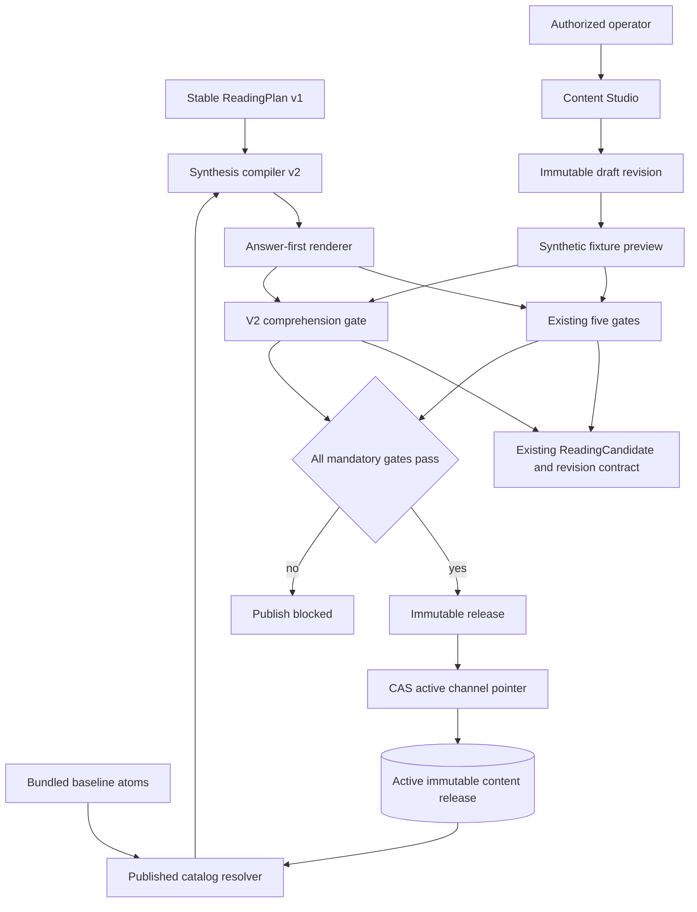
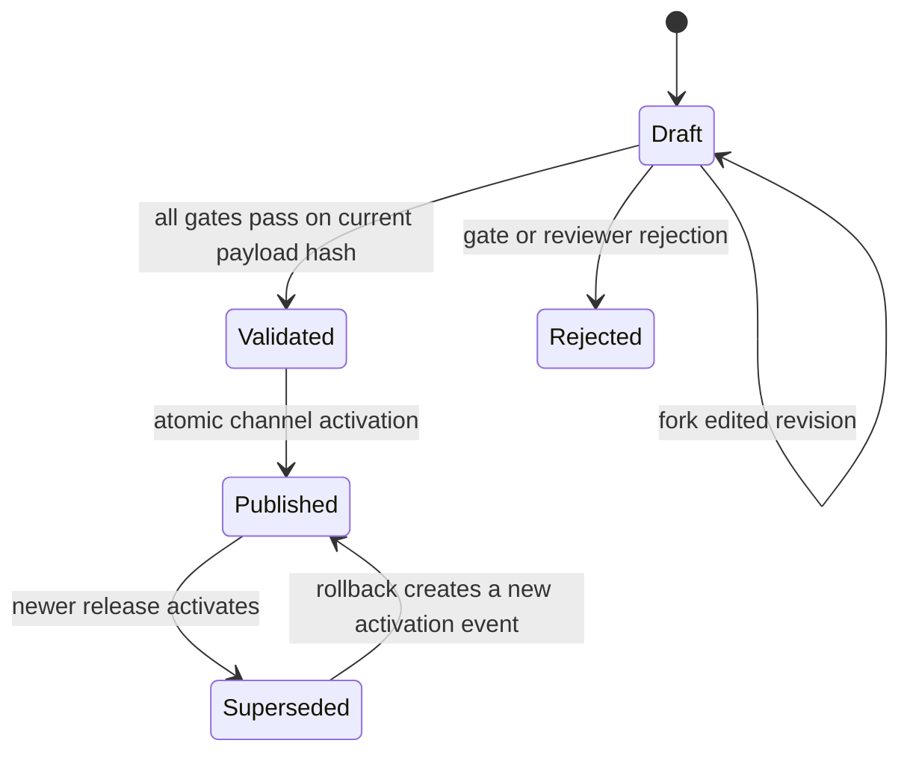

# Content Engine v2 and Content Studio

## Kiến trúc đã chốt: core trước, Studio tùy chọn

Đây là hai phần độc lập. Core engine dùng bundled knowledge và `ContentReviewAgent` để tạo, rà và
chặn nội dung khó hiểu ngay cả khi Studio không được bật. Content Studio chỉ thêm luồng biên tập,
preview, publish và rollback; Studio không phải dependency của việc render Daily hoặc Tarot. Nếu DB
release thiếu, lỗi hoặc không tương thích, runtime dùng bundled catalog đã qua cùng gate.

Chuẩn câu chữ dùng chung được ghi tại
`docs/foundation/la-lanh-plain-vietnamese-content-standard.md`.

## Implementation status — 2026-09-30

Implemented in this slice:

- clearer Daily renderer v6 copy and retired-phrase gate;
- typed Daily matrix validation with exact entry coverage and list cardinality;
- ten-persona synthetic rendering gate before draft persistence and publication;
- immutable payload releases, channel generation CAS, parent CAS, audited publish/rollback,
  append-only PostgreSQL guards and safe downgrade refusal;
- atomic per-render catalog snapshots with release hash in renderer identity;
- runtime startup loading with bundled fallback, independent of whether Studio UI is enabled;
- local/beta Content Studio for editing, entry preview, validation findings, publish history and
  rollback;
- pre-parse bearer authentication, streaming 256 KB request cap, no-store/noindex headers and
  rejection of invalid drafts before storage;
- draft-bound synthetic rendering: the ten-persona gate renders the candidate catalog being
  reviewed rather than silently falling back to the active release;
- behavior tests for publish, invalid draft, rollback, restart restore, configuration guards,
  Studio login, content review, draft-catalog binding, chunked request limits and the existing
  product regression suites.

Deliberately not production-enabled yet:

- Supabase operator identity, MFA, per-operator roles and attribution;
- separate Studio origin/application and least-privilege database roles;
- cross-process release notification for multi-worker or multi-replica hot activation;
- full consumer-layout synthetic preview inside Studio rather than the current honest entry preview;
- PostgreSQL integration/concurrency test in CI.

The application rejects beta Studio auth in both `staging` and `production`. Production runtime can
consume an already-published release, but release authoring remains local until the items above are
complete.

## Goal Capsule

**Objective:** Make Daily astrology content understandable to a first-time user, reviewable by the product owner before publication, versioned, auditable, and safely reversible without exposing personal birth data or drafts to the public application.

**Means:** Add an answer-first semantic compiler and an offline core content-review gate over the stable chart plan. Optionally store immutable content releases and provide a protected Content Studio for editing, previewing, publishing, and rolling back the Daily content matrix.

**Authority hierarchy:** The user's latest content-quality requirement overrides existing vague copy.
Existing chart calculation, evidence binding, consent, privacy, historical revision, saved/share snapshot, and anti-influence contracts remain authoritative.

**Execution profile:** Implement and verify the plan in this session.
Do not deploy or enable Studio in production without operator identity, secure environment configuration, and database migration approval.

**Stop conditions:** Do not publish a release that fails evidence, comprehension, safety, privacy, fixture-integrity, or runtime-compatibility checks.
Never use production birth profiles, questions, moods, relationship data, or Tarot sessions as Studio preview input.

---

## Product Contract

### Summary

The current engine calculates valid chart facts but can still assemble prose that is abstract, repetitive, or difficult for a non-astrologer to understand.
The same Python constants must currently be changed in code, reviewed indirectly, and deployed before the product owner can judge their effect.
This plan separates chart facts from editorial atoms, adds a deterministic synthesis layer, and creates a private Content Studio where the owner can inspect a matrix entry, preview real product rendering against synthetic personas, see gate failures, publish an immutable release, and roll back without altering historical user readings.

### Problem Frame

The failure is not a lack of astrology factors.
It is a content architecture problem: isolated meanings are combined without a strong answer contract, the visible prose does not always name a recognizable situation, and the reviewer cannot see why a phrase was selected before release.
Adding more books or more sentences to the current matrix would increase combinations while preserving the same comprehension defect.

### Requirements

**Content output**

- R1. Every v2 Daily reading begins with a direct plain-language answer to the selected focus, followed by one evidence-bound explanation, one observable scene, and one small reversible action.
- R2. Core prose must be understandable without astrology vocabulary; technical chart facts remain available in the evidence disclosure instead of leading the reading.
- R3. A synthesis may select one primary mechanism, at most one supporting mechanism, one qualifier or counter-signal, one scene, and one action.
- R4. Every selected atom and rendered claim must trace to allowed chart factors and versioned source concepts.
- R5. Vibe/date-only, exact-time full chart, limited precision, Western, and unsupported Jyotish paths must degrade explicitly and never invent unavailable houses, Moon positions, angles, aspects, or transit timing.
- R6. Historical v1 plans, revisions, saves, shares, and projections remain readable and unchanged.

**Content Studio**

- R7. An authorized operator can list Daily matrix groups, search entries, open one typed entry, create an immutable draft revision, and compare draft versus published copy.
- R8. Studio preview accepts only named server-owned synthetic fixtures and renders through the same consumer view contract used by the app.
- R9. Studio displays gate results by rule, severity, section, and bounded explanation without exposing source prose in logs or URLs.
- R10. Publishing creates an immutable content release and atomically advances the active channel only when all mandatory gates pass and the expected channel version is current.
- R11. Rollback creates a new audited activation event pointing to a prior compatible release; it never mutates or deletes history.
- R12. Drafts, operators, sessions, validation evidence, and audit events are inaccessible from public product endpoints.

**Security and privacy**

- R13. Studio authentication is independent from guest and owner cookies.
The MVP uses Supabase Auth as the identity provider, verifies asymmetric JWT claims server-side, and requires membership in a local active operator allowlist.
- R14. Studio mutations require a secure HttpOnly application session, exact trusted Origin, CSRF token, role authorization, bounded schemas, optimistic concurrency, and idempotency where publication state changes.
- R15. Studio preview and validation cannot accept guest IDs, profile IDs, arbitrary birth input, raw production questions, or direct database selectors.
- R16. Runtime reads only the active published release through a narrow repository boundary and falls back to a bundled known-good catalog if the active release is missing, corrupt, or incompatible.
- R17. Studio responses use no-store, noindex, no-referrer, frame denial, and a strict content security policy; logs and metrics contain no tokens, draft prose, or personal data.

### Key Decisions

- KTD1. **Keep chart planning stable.** `ReadingPlanner` and `ReadingPlan` v1 remain unchanged; Content Engine v2 compiles their immutable factors into a new synthesis plan.
- KTD2. **Use structured atoms, not long templates.** Mechanism, scene, action, and qualifier atoms have stable IDs, eligibility, provenance, and bounded plain Vietnamese copy.
- KTD3. **Adapt v2 into the existing public reading shape.** `answer`, `because`, `scene`, and `action` map to current candidate fields so old web clients and stored snapshots remain compatible.
- KTD4. **Use immutable bundle releases plus a mutable channel pointer.** Drafting creates new revisions; publish and rollback only move a compare-and-swap pointer and append audit history.
- KTD5. **Fail closed to a bundled baseline.** Database content can improve new readings but cannot make the core app unavailable.
- KTD6. **Use synthetic fixtures only.** Studio never needs production personal data to judge wording.
- KTD7. **Use managed identity, local authorization.** Supabase Auth proves identity and MFA assurance; the application still decides who is an operator and what role they have.
- KTD8. **Daily first, platform reusable.** The release schema and Studio components support later Tarot, Radar, and relationship bundles, but this implementation migrates only Daily astrology atoms.

### Key Flows

- F1. **Review a matrix entry**
  - **Trigger:** An operator opens Content Studio.
  - **Steps:** Authenticate, choose the Daily bundle, filter entries, open an atom, compare active copy with a new draft.
  - **Outcome:** The operator can understand where the copy is eligible and which source concepts support it.
  - **Covered by:** R7, R12-R14.
- F2. **Preview and validate**
  - **Trigger:** The operator requests a preview for a draft.
  - **Steps:** Select a named synthetic persona and focus, compile a v1 chart plan through the v2 draft catalog, render answer-first copy, run all existing gates plus comprehension gates.
  - **Outcome:** Studio shows consumer-parity output and actionable gate results; no personal data enters the flow.
  - **Covered by:** R1-R5, R8-R9, R15.
- F3. **Publish**
  - **Trigger:** A draft has passing validation evidence.
  - **Steps:** Confirm release summary and reason, verify fresh auth and expected channel generation, persist immutable release, advance channel, append audit event.
  - **Outcome:** Only new readings use the release; old revisions remain unchanged.
  - **Covered by:** R10, R14, R16.
- F4. **Rollback**
  - **Trigger:** The active release causes a content regression.
  - **Steps:** Select a previously published compatible release, rerun current mandatory gates, confirm reason, compare-and-swap the channel, append rollback event.
  - **Outcome:** New readings return to the prior catalog without deleting the failed release or rewriting user history.
  - **Covered by:** R11, R16.

### Acceptance Examples

- AE1. Given a novice opens a v2 Daily reading, when they read only the first four sections, then they can answer “điều gì đang xảy ra”, “ngoài đời trông như thế nào”, and “mình có thể thử gì” without knowing planet, sign, house, aspect, natal, or transit terminology.
- AE2. Given a full chart with many eligible factors, when synthesis runs, then the visible story uses no more than one primary and one supporting mechanism and every evidence claim resolves to the source plan.
- AE3. Given date-only input, when v2 renders, then it identifies itself as one-layer Vibe and never implies Moon, house, angle, aspect, or transit knowledge.
- AE4. Given an operator edits a scene atom, when they preview ten synthetic personas, then only eligible scenarios use the draft and all gate results identify the exact rule and affected section.
- AE5. Given a draft fails the “novice can understand without astrology” or “observable scene” gate, when publish is attempted, then no release or channel update occurs.
- AE6. Given two publish attempts use the same channel generation, when both execute concurrently, then exactly one succeeds and the other returns a conflict without ambiguous audit history.
- AE7. Given release B is active after release A, when the operator rolls back to A, then the channel records a new rollback event and historical readings produced under A or B remain unchanged.
- AE8. Given a guest cookie, owner cookie, guessed draft UUID, or arbitrary birth input, when it is sent to any Studio endpoint, then access is denied and no draft or personal data is returned.

### Success Criteria

- Ten synthetic personas across date-only and exact-time Daily modes pass evidence, anti-influence, editorial, meaning, privacy, and v2 comprehension gates.
- Every accepted sample has a direct answer, a distinct concrete scene, a reversible action, and complete atom/factor provenance.
- Near-duplicate core output across the ten personas is rejected.
- Public APIs and generated OpenAPI for the consumer service expose no draft, operator, Studio session, or audit data.
- Active release selection is deterministic and a corrupt/incompatible database release falls back to the bundled baseline.
- A publish, conflict, rollback, logout, and unauthorized-access path are covered by behavior-level tests.

### Scope Boundaries

**In scope:** Daily Content Engine v2, typed content atoms, answer-first synthesis, comprehension gates, immutable Daily bundle revisions/releases, synthetic preview fixtures, operator authentication and authorization, Studio list/editor/preview/release UI, active release selection, rollback, documentation, and automated tests.

**Deferred to follow-up work:** Migrating Tarot/Radar/relationship matrices into Studio, rich text or Markdown, media uploads, scheduled publishing, free-form production preview, LLM generation, automatic learning from user feedback, operator-management UI, and public deployment of the Studio service.

**Production prerequisite:** Use separate least-privilege database roles for migration, public runtime, and Studio before enabling production publication.
The current broad Supabase database credential is insufficient as a durable isolation boundary.

### Sources and Research

- Existing requirements and gates: `AGENTS.md`, `docs/foundation/la-lanh-reading-knowledge-spec.md`, `docs/foundation/la-lanh-interpretation-corpus-methodology.md`, `docs/operations/content-matrix-release-gate.md`, and `docs/operations/user-experience-release-gate.md`.
- Existing implementation patterns: `apps/api/app/domains/readings/models.py`, `apps/api/app/domains/readings/planner.py`, `apps/api/app/domains/readings/tables.py`, `apps/api/app/domains/readings/postgres.py`, `apps/api/app/domains/readings/review_agent.py`, and `apps/api/scripts/review_content_release.py`.
- OWASP Authentication, Session Management, CSRF Prevention, Authorization, and Logging Cheat Sheets for operator-session and audit controls.
- Supabase Auth JWT verification, signing-key rotation, MFA assurance levels, and custom Postgres role guidance.

---

## Planning Contract

### High-Level Technical Design



### Data Lifecycle



### Security Boundary

The consumer runtime and Studio share content contracts but not identities or repositories.
The public runtime can resolve only the active published bundle.
Studio can access operator sessions, drafts, release evidence, and audit history but must be denied personal-data tables by database grants before production enablement.
Supabase Auth tokens are exchanged for a short-lived opaque Studio session; browser storage never holds the application session token.

### Assumptions

- Supabase Auth is available for operator sign-in and can issue asymmetric JWTs with `aal2` after MFA enrollment.
- One product owner can draft and publish during local/beta review; enforced two-person approval is deferred until a second operator exists.
- Current public runtime remains available while the content tables are empty because the bundled baseline is authoritative fallback.
- The web app can host the Studio route tree for local development, but production should serve Studio on a separate origin/service.

### Output Structure

```text
apps/api/app/domains/content/
  auth.py
  models.py
  postgres.py
  service.py
  tables.py
apps/api/app/domains/readings/
  comprehension.py
  knowledge_v2.py
  synthesis.py
  answer_renderer.py
apps/api/app/api/v1/routes/
  content_studio.py
apps/api/app/
  studio_app.py
apps/web/src/features/studio/
  StudioShell.tsx
  StudioLoginPage.tsx
  MatrixListPage.tsx
  MatrixEditorPage.tsx
  ReleasePage.tsx
  studio.css
```

---

## Implementation Units

### U1. Freeze compatibility and define v2 content contracts

- **Goal:** Add typed atoms, synthesis models, release identities, and optional v2 provenance without changing the stable v1 chart plan or historical candidate decoding.
- **Requirements:** R3-R6, R16.
- **Dependencies:** None.
- **Files:** `apps/api/app/domains/readings/knowledge_v2.py`, `apps/api/app/domains/readings/models.py`, `apps/api/tests/readings/test_knowledge_v2.py`, `apps/api/tests/readings/test_models.py`.
- **Approach:** Define mechanism, scene, action, and qualifier atoms with stable IDs, eligibility, source concept IDs, required factor roles, plain Vietnamese copy, and forbidden-language metadata.
Add only optional/defaulted v2 blueprint fields to persisted candidates.
Seed a bundled Daily catalog from approved existing concepts while replacing vague multi-purpose prose with one semantic job per atom.
- **Patterns to follow:** Frozen Pydantic models in `readings/models.py`, versioned knowledge constants, source registries, and existing canonical hashing.
- **Test scenarios:**
  - Atom IDs, source references, and catalog versions are unique and complete.
  - Unsupported traditions, precision, purposes, and factor kinds do not resolve an atom.
  - Old serialized v1 candidates deserialize without v2 fields.
  - Catalog atoms contain no runtime user data, raw markup, certainty, diagnosis, or fate claims.
- **Verification:** Existing planner/model suites pass unchanged and the bundled catalog validates deterministically.

### U2. Build answer-first synthesis and comprehension gates

- **Goal:** Produce specific novice-readable Daily prose from selected factors and reject vague or unsupported output before revision publication.
- **Requirements:** R1-R5.
- **Dependencies:** U1.
- **Files:** `apps/api/app/domains/readings/synthesis.py`, `apps/api/app/domains/readings/answer_renderer.py`, `apps/api/app/domains/readings/comprehension.py`, `apps/api/app/domains/readings/application.py`, `apps/api/app/domains/readings/review_agent.py`, `apps/api/tests/readings/test_synthesis.py`, `apps/api/tests/readings/test_answer_renderer.py`, `apps/api/tests/readings/test_comprehension.py`, `apps/api/tests/readings/test_review_agent.py`.
- **Approach:** Deterministically compile a stable v1 factor plan into one thesis, optional support/counter-signal, one scene, and one action.
Render semantic order `answer -> because -> scene -> action`, then map into the existing candidate fields and canonical evidence claims.
Run comprehension checks before the existing five-gate evaluation while preserving the historical five-gate storage contract.
- **Patterns to follow:** `ReadingPlanner`, `DeterministicVietnameseRenderer`, `semantic_blueprint`, and `evaluate_candidate`.
- **Test scenarios:**
  - Same factor plan, release, focus, and editorial seed produce the same synthesis.
  - Date-only content never uses full-chart facts.
  - Full-chart content references only selected factors and contains no more than two visible mechanisms.
  - Vague opening, astrology-jargon opening, unobservable scene, repeated answer/scene, unsupported qualifier, disclaimer-in-core, and irreversible action fail closed.
  - Existing evidence, anti-influence, editorial, meaning, and privacy gate tests remain green.
- **Verification:** Ten synthetic Daily samples are distinct, traceable, understandable, and publishable; deliberately bad fixtures fail with bounded rule IDs.

### U3. Add immutable content persistence and migration

- **Goal:** Persist versioned drafts/releases, synthetic preview evidence, active channel state, operator records/sessions, and append-only audit events.
- **Requirements:** R7-R12, R16-R17.
- **Dependencies:** U1.
- **Files:** `apps/api/app/domains/content/models.py`, `apps/api/app/domains/content/tables.py`, `apps/api/app/domains/content/repository.py`, `apps/api/app/domains/content/postgres.py`, `apps/api/app/db/base.py`, `apps/api/migrations/versions/20260930_0023_content_studio.py`, `apps/api/tests/content/test_models.py`, `apps/api/tests/content/test_repository.py`, `apps/api/tests/db/test_content_studio_migration.py`.
- **Approach:** Store immutable whole-bundle revisions and releases as typed JSON/JSONB with canonical SHA-256 identity.
Keep one mutable channel pointer with monotonic generation and compare-and-swap activation.
Store preview receipts by fixture and payload hash.
Append bounded metadata-only audit events for create, validate, publish, conflict, rollback, login, and logout.
Use database triggers to reject update/delete on immutable release and audit tables in PostgreSQL.
- **Patterns to follow:** Immutable reading revision plus mutable projection in `readings/tables.py` and `readings/postgres.py`; JSONB variant in `share/tables.py`; migration head `20260927_0022`.
- **Test scenarios:**
  - Identical revision/release replay is idempotent; same hash with different payload conflicts.
  - Stale channel generation cannot publish.
  - Concurrent activations have exactly one winner.
  - Audit failure rolls back the channel update.
  - PostgreSQL direct update/delete of immutable rows fails.
  - Migration upgrade/downgrade creates and removes named constraints in dependency-safe order.
- **Verification:** Repository tests prove immutability, atomic activation, linear history, and SQLite/PostgreSQL behavior where applicable.

### U4. Add secure operator session and Studio API

- **Goal:** Expose a least-privilege, role-checked API for matrix review without accepting guest identity or personal data.
- **Requirements:** R7-R17.
- **Dependencies:** U3.
- **Files:** `apps/api/app/domains/content/auth.py`, `apps/api/app/domains/content/service.py`, `apps/api/app/api/v1/routes/content_studio.py`, `apps/api/app/api/v1/studio_router.py`, `apps/api/app/studio_app.py`, `apps/api/app/config.py`, `apps/api/app/main.py`, `apps/api/tests/content/test_auth.py`, `apps/api/tests/content/test_service.py`, `apps/api/tests/api/test_content_studio.py`.
- **Approach:** Verify Supabase asymmetric JWT claims and MFA assurance, require an active local operator, exchange for an opaque hashed application session, and issue a `__Host-` secure HttpOnly Strict cookie plus CSRF token.
Expose Studio through a separate application factory and deployment entrypoint; the consumer app never mounts its router or includes it in public OpenAPI.
Accept only finite bundle keys, typed atom payloads, named fixture IDs, bounded reasons, expected generation, and idempotency keys.
Return generic problem details and security headers.
- **Patterns to follow:** Guest cookie/CSRF shape without guest authorization semantics, `SecretHasher`, production config fail-closed validation, and `AdmissionControlMiddleware` backstop.
- **Test scenarios:**
  - Missing, forged, expired, wrong issuer/audience/key/algorithm, `aal1`, unknown, and disabled operators are rejected.
  - Guest and owner cookies alone never authorize Studio.
  - Mutations reject wrong Origin, missing/wrong CSRF, oversized payloads, extra fields, external return URLs, and arbitrary personal-data selectors.
  - Logout, expiration, revocation, and operator deactivation terminate access.
  - Publish requires a current validation receipt, expected channel generation, and idempotency key.
- **Verification:** API integration tests prove authorization, workflow transitions, no-store headers, bounded errors, and complete absence of Studio routes from the consumer app and its OpenAPI schema.

### U5. Connect active releases to Daily runtime safely

- **Goal:** Let newly generated Daily readings use the active published v2 catalog while retaining a known-good bundled fallback and historical compatibility.
- **Requirements:** R1-R6, R10-R11, R16.
- **Dependencies:** U2, U3.
- **Files:** `apps/api/app/domains/readings/release.py`, `apps/api/app/domains/readings/application.py`, `apps/api/app/domains/readings/postgres.py`, `apps/api/app/main.py`, `apps/api/app/config.py`, `apps/api/tests/readings/test_release.py`, `apps/api/tests/readings/test_application.py`, `apps/api/tests/readings/test_revision_repository.py`, `apps/api/tests/integration/test_content_release_flow.py`.
- **Approach:** Resolve one immutable catalog snapshot per render.
Encode release identity in content/renderer provenance so revision keys differ across visible releases.
Offer v2 as an available update for existing projections, suppress accidental v2-to-v1 downgrade, and retain generated-over-deterministic precedence.
Do not enqueue the current external generation worker for v2 until its contract supports v2 provenance and comprehension.
- **Patterns to follow:** Existing projection activation, revision-bound saves/shares, and generated fallback suppression.
- **Test scenarios:**
  - No release, corrupt release, unsupported contract, or database failure uses bundled baseline and emits metadata-only diagnostics.
  - New reading under release B records B; existing release A revision stays byte-for-byte unchanged.
  - Active v1 exposes v2 as an available update; active v2 does not advertise a weaker v1 fallback.
  - Publish B then rollback A changes only newly generated output and active channel state.
  - Saved and shared snapshots still render their original revision.
- **Verification:** End-to-end repository/application tests prove release pinning, upgrade, rollback, fallback, replay, and snapshot preservation.

### U6. Build the operator-efficient Content Studio UI

- **Goal:** Give the product owner a clear desktop workspace to review and control content without recreating consumer visual clutter.
- **Requirements:** R7-R12, R14, R17.
- **Dependencies:** U4.
- **Files:** `apps/web/src/app/router.tsx`, `apps/web/src/features/studio/StudioShell.tsx`, `apps/web/src/features/studio/StudioLoginPage.tsx`, `apps/web/src/features/studio/MatrixListPage.tsx`, `apps/web/src/features/studio/MatrixEditorPage.tsx`, `apps/web/src/features/studio/ReleasePage.tsx`, `apps/web/src/features/studio/studio.css`, `apps/web/src/shared/api/studioClient.ts`, `apps/web/src/app/router.test.tsx`, `apps/web/src/features/studio/StudioPages.test.tsx`.
- **Approach:** Use a separate wide Studio shell and error boundary rather than the consumer `AppShell`.
Provide a searchable matrix table, schema-driven atom editor, explicit Save draft, published-versus-draft diff, named fixture controls, real consumer preview, gate rail, and release history.
Keep prose surfaces opaque and readable; use Cosmic Glass only for navigation, metadata, and controls.
Store no credentials, draft prose, or gate evidence in localStorage.
- **Patterns to follow:** Existing theme tokens, `BrandMark`, fetch transport, `ReadingContent`, and memory-router tests.
- **Test scenarios:**
  - Login success, failure, expiry, forbidden role, safe return path, and keyboard submission.
  - Vietnamese-accent search, filters, empty/error/retry states, and query preservation.
  - Draft save/reload, validation, whitespace normalization, stale revision conflict, failed save recovery, and dirty-navigation warning.
  - Published/draft preview parity, stale preview indication, failing gate focus, 320/768/1024/1440 layouts, 200% zoom, keyboard-only operation, and reduced transparency.
  - Publish and rollback confirmation require explicit reason and display conflict without losing draft work.
- **Verification:** Component and router tests pass, and a browser QA walkthrough completes draft -> preview -> publish -> rollback without consumer-route regression.

### U7. Upgrade release gates and operational documentation

- **Goal:** Make comprehension, Studio security, privacy isolation, content enrichment, and rollback part of every future release rather than a one-off repair.
- **Requirements:** R1-R17.
- **Dependencies:** U2-U6.
- **Files:** `apps/api/scripts/review_content_release.py`, `apps/api/tests/fixtures/content_matrices/manifest-v2.json`, `apps/api/tests/fixtures/content_matrices/personas-v2.json`, `apps/api/tests/content/test_preview_fixtures.py`, `docs/operations/content-matrix-release-gate.md`, `docs/operations/user-experience-release-gate.md`, `docs/operations/deployment-checklist.md`, `docs/security/content-studio-threat-model.md`, `package.json`.
- **Approach:** Extend the ten-persona reviewer with answer coverage, novice comprehension, near-neighbor similarity, support/qualifier provenance, and reversible-action rules.
Require at least one evidence-bound content improvement per normal deployment without rewarding filler.
Document operator bootstrap, key rotation, database grants, backup/restore, publish, rollback, emergency disable, and audit review.
- **Patterns to follow:** Current `content:audit`, `experience:audit`, deployment checklist, and privacy/security gates in `AGENTS.md`.
- **Test scenarios:**
  - Fixtures are synthetic, versioned, hash-bound, cover date-only/exact-time/lens variety, and contain no private-data canaries.
  - A deliberately generic answer, repeated scene, unsupported factor, embedded disclaimer, or irreversible action fails the root check.
  - An emergency availability/security waiver is recorded without lowering the content baseline.
- **Verification:** Root check, API checks, web checks, content review, and human mobile/desktop review have explicit evidence and no unresolved P0/P1 finding.

---

## Verification Contract

| Gate | Applies to | Done signal |
|---|---|---|
| API formatting, typing, and tests | U1-U5, U7 | `ruff`, `mypy`, and targeted/full pytest suites pass with no suppressed new error |
| Web typing, tests, and build | U6 | TypeScript, Vitest, and production Vite build pass |
| Content matrix audit | U1-U2, U7 | Coverage does not shrink and v2 source/atom references are complete |
| Ten-persona review | U2, U5, U7 | All mandatory comprehension, evidence, safety, privacy, and distinctness gates pass |
| Migration verification | U3 | Upgrade/downgrade and PostgreSQL immutability/concurrency tests pass |
| Security review | U3-U6 | No P0/P1 auth, CSRF, authorization, draft-leak, personal-data, logging, or rollback finding remains |
| Browser QA | U6 | Operator workflow works at desktop/tablet widths and consumer routes remain unaffected |
| Compatibility regression | U1-U6 | Historical v1 payloads, saves, shares, projections, date-only behavior, and current public API contracts still pass |

---

## Definition of Done

- Content Engine v2 produces direct, concrete, evidence-bound Daily readings through the existing public contract.
- Content Studio supports authenticated matrix list, typed editing, immutable draft save, synthetic preview, gate display, publish history, and rollback.
- Drafts and Studio metadata are unreachable through public product routes and personal birth data is unnecessary for review.
- New readings record the active content release; historical readings and saved/shared snapshots remain stable.
- Empty, corrupt, incompatible, or unavailable content storage falls back to a bundled known-good catalog.
- Database migration, rollback, audit history, idempotency, and concurrency behavior are tested.
- Documentation records architecture, security/privacy decisions, operator setup, release/rollback procedures, and remaining prerequisites.
- Sources checked, findings fixed, unresolved risks, and incomplete AC/DoD are reported in the implementation handoff.
