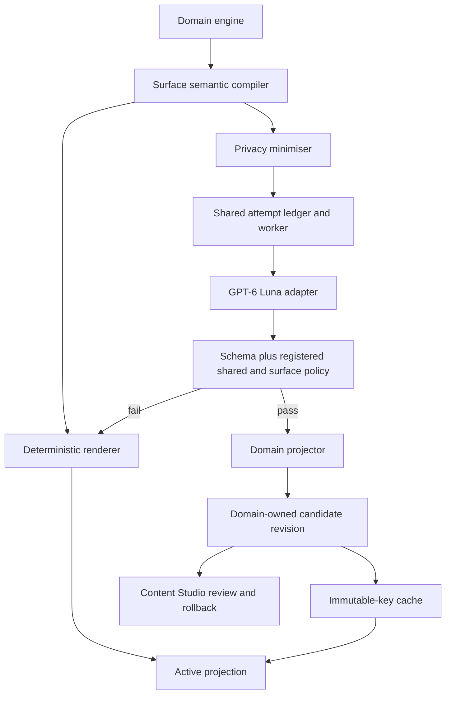
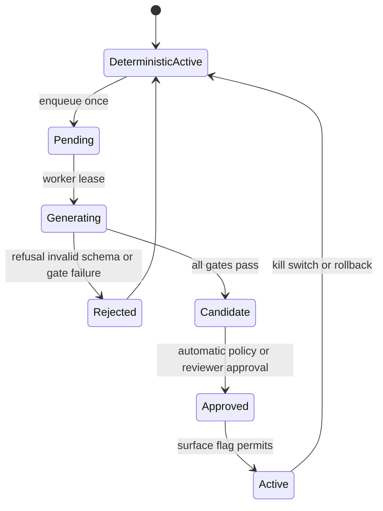
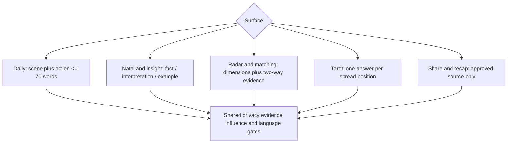

# GPT-6 Luna All Personalised Content Rewrite - Plan

## Goal Capsule

- **Objective:** Người dùng đọc nội dung cá nhân hóa của Lá Lành và hiểu ngay nội dung đang nói về tình huống nào, dựa trên dữ liệu nào, và có thể dùng nó để tự quan sát mà không bị dẫn dắt quyết định.
- **Means:** Dùng `gpt-6-luna` như lớp biên tập tiếng Việt trên semantic blueprint do engine của Lá Lành tạo, sau đó chỉ phát hành output vượt qua schema, evidence, privacy, influence và comprehension gates. (KTD1, KTD2)
- **Authority:** Dữ liệu chart, Tarot, Radar và hành vi thật do domain engine sở hữu; semantic blueprint sở hữu ý nghĩa; Luna chỉ sở hữu cách diễn đạt; content gate quyết định có được phát hành hay không.
- **Execution profile:** Triển khai theo từng surface, bắt đầu với Daily/Home, luôn trả deterministic fallback trước, rồi mở dần bằng feature flag độc lập.
- **Stop conditions:** Dừng rollout của một surface nếu có dữ liệu cá nhân lọt vào provider payload, claim không có evidence, nội dung khó hiểu hơn baseline, lỗi gate tăng vượt ngưỡng, hoặc provider làm chậm luồng chính.
- **Completion owner:** `ce-work` hoặc kỹ sư thực thi toàn bộ U1-U11, QA và rollout beta theo Verification Contract.

---

## Product Contract

### Summary

Luna viết lại mọi nội dung diễn giải cá nhân hóa đang hiển thị cho người dùng, không chỉ Daily Note. Mỗi lần viết lại phải bắt đầu từ một semantic blueprint đóng do server tạo. Luna không được tự tính chart, chọn evidence, đổi điểm số, suy diễn thêm ý nghĩa hoặc viết nội dung pháp lý và giao dịch.

### Problem Frame

Các engine hiện có nhiều dữ liệu và gate, nhưng output vẫn có câu dịch máy, trừu tượng, lặp ý hoặc không trả lời đúng câu hỏi của màn hình. Adapter AI hiện chỉ phục vụ một dạng `ReadingCandidate`, vẫn ghim model cũ, và không trả lại `semantic_blueprint`; vì vậy output AI không thể vượt qua meaning gate hiện tại. Các surface Radar, Tarot, Matching và Share chưa có contract viết lại riêng nên dùng chung prompt sẽ làm mất ý nghĩa, rò dữ liệu hoặc tạo lời khuyên vượt phạm vi.

### Product Contract Preservation

Product Contract được cấu trúc lại, không đổi phạm vi: toàn bộ các personalised interpretive surfaces trong bản approved scope vẫn được giữ; static, legal và transactional copy vẫn bị loại khỏi generative rewriting.

### Requirements

**Meaning and ownership**

- R1. Mọi nội dung do Luna viết lại phải bắt nguồn từ semantic blueprint và evidence bundle đóng do domain engine tương ứng tạo.
- R2. Luna chỉ được thay đổi cách diễn đạt; model không được tạo hoặc sửa chart facts, Tarot card facts, scores, percentages, evidence IDs, semantic keys, timing, consent state hoặc access state.
- R3. Mỗi surface phải có typed input/output contract, word budget, forbidden claims và gate riêng; không dùng một prompt hoặc một schema chung cho mọi surface.
- R4. Nội dung deterministic đã qua gate luôn là fallback và phải đủ để hoàn tất luồng khi Luna timeout, từ chối, trả sai schema hoặc bị kill switch tắt.

**Covered surfaces**

- R5. Daily/Home và Daily Detail cho phép Luna viết lại title, scene, explanation và một bounded action từ daily blueprint.
- R6. Reveal, Natal, Planet, House, Aspect và Transit cho phép Luna viết lại synthesis, section explanation và everyday examples nhưng phải tách fact, interpretation và example.
- R7. Radar và Matching cho phép Luna viết overview, điểm hợp, điểm cấn, asymmetry, câu hỏi mở đầu và cách đem ra đời thật từ relationship evidence đã được cho phép; model không được đổi các chỉ số hoặc kết luận xác suất thành công.
- R8. Tarot cho phép Luna viết headline, diễn giải từng vị trí, synthesis và câu hỏi gợi mở từ question category, spread positions, cards, orientations và allowlisted meanings.
- R9. Share Card và Recap chỉ được rút gọn từ một revision đã approved và phải cho người dùng xem đúng preview trước khi chia sẻ.
- R10. Static UX copy, consent, privacy, legal, validation, error, account, payment, deletion và security copy luôn do con người kiểm soát và nằm ngoài Luna.

**Privacy and safety**

- R11. Provider payload không được chứa tên, email, số điện thoại, account/device ID, ngày giờ nơi sinh thô, tọa độ, địa chỉ, private profile ID hoặc dữ liệu định danh của người thứ ba.
- R12. Radar và Matching chỉ gửi derived relationship evidence; Tarot chỉ gửi category hoặc free text đã được minimiser rút gọn khi người dùng đã đồng ý external generation.
- R13. Request tới Responses API phải dùng `store: false`; sản phẩm vẫn phải thông báo đúng rằng abuse-monitoring logs có thể được lưu theo chính sách provider và không được gọi `store: false` là Zero Data Retention.
- R14. Generated content không được chẩn đoán, dự đoán sự kiện, tạo khẩn cấp, gây lệ thuộc, kích động theo dõi/thử lòng, hoặc đưa chỉ dẫn y tế, pháp lý, tài chính và an toàn.

**Review, rollout and cost**

- R15. Content Studio phải cho reviewer so deterministic baseline với Luna output, xem allowlisted blueprint/evidence labels và privacy field manifest không có raw values, gate failures, model/prompt/schema version, rồi approve, edit, reject, regenerate hoặc rollback.
- R16. Mỗi surface có feature flag, budget cap, telemetry, cache key, kill switch và rollout riêng; surface chưa đạt chuẩn tiếp tục dùng deterministic content.
- R17. Một content artifact chỉ được generate một lần cho cùng immutable input/version key; mở lại màn hình không tạo thêm request.
- R18. Evaluation phải đo first-read comprehension, natural Vietnamese, specificity, evidence fidelity, usefulness, non-repetition, privacy và influence safety trên fixed corpus trước khi mở runtime.
- R19. Mỗi lần gọi provider phải kiểm tra external-generation authorization còn hiệu lực cho đúng purpose và đúng chủ thể; rút consent chặn enqueue mới, hủy attempt chưa gửi và không tự cấp quyền cho Radar/Matching chỉ vì người dùng đã đồng ý với Reading.
- R20. Safe brief và generated candidate lưu để xử lý bất đồng bộ phải được mã hóa at rest, có retention theo surface và bị xóa hoặc tombstone hóa theo lifecycle của owner; Studio và telemetry không được hiển thị hay ghi lại raw free text, birth data hoặc third-party data.

### Key Decisions

- **Dùng Luna cho toàn bộ nội dung diễn giải cá nhân hóa, không chỉ Daily Note.** (session-settled: user-directed — chosen over only rewriting the daily note: inconsistent quality across the remaining core journeys would leave the original user problem unresolved.) Governs R3, R5-R9, R15-R18.
- **Giữ `gpt-6-luna` thay vì hạ xuống dòng GPT-5.** (session-settled: user-approved — chosen over GPT-5 Nano/Mini after comparing cost, deprecation and quality risk: the beta saving was negligible while GPT-5 variants were deprecated or more expensive.) Governs R16-R18.
- **Luna là copy editor, không phải astrology/Tarot/relationship engine.** Governs R1-R4, R6-R8, R14.
- **CMS hỗ trợ review nhưng không phải runtime dependency.** Governs R4, R15-R16.

### Key Flows

- F1. **Runtime rewrite:** Domain engine tạo facts → semantic compiler tạo blueprint → privacy minimiser tạo safe payload → Luna trả structured prose → local gates quyết định → approved revision được cache → UI nhận projection; lỗi ở bước nào cũng trả deterministic revision.
- F2. **Editorial release:** Fixed corpus hoặc runtime shadow tạo candidate → Studio hiển thị baseline và Luna side by side → reviewer approve/edit/reject → publish thành version mới → rollback không sửa các artifact người dùng đã lưu hoặc chia sẻ.
- F3. **User-sensitive Tarot/Radar:** UI lấy consent phù hợp → server giảm dữ liệu xuống category/derived evidence → rewrite pipeline chạy → output không chứa dữ liệu thô → user có thể xóa artifact theo lifecycle của domain.

### Acceptance Examples

- AE1. **Covers R1-R4:** Given một Daily blueprint nói về “tin nhắn chưa rõ ý”, when Luna đổi câu thành một dự đoán về người kia, then evidence/meaning gate từ chối và Home vẫn hiển thị deterministic card.
- AE2. **Covers R6:** Given một Natal section dựa trên Moon, Venus và House 4, when output chỉ mô tả Moon như toàn bộ tính cách, then synthesis gate từ chối vì bỏ mất evidence mix bắt buộc.
- AE3. **Covers R7, R11-R14:** Given Radar có ngày giờ nơi sinh của hai người, when tạo provider payload, then payload chỉ chứa anonymous pair factors và dimension labels; không chứa birth data, owner IDs hoặc lời khuyên theo dõi/thử lòng.
- AE4. **Covers R8:** Given spread ba lá có ba position khác nhau, when Luna viết ba đoạn giống nhau hoặc không trả lời position, then Tarot position gate từ chối.
- AE5. **Covers R9:** Given một share revision chứa câu hỏi Tarot riêng tư, when tạo preview, then private question bị loại và user thấy chính xác phần public trước khi xác nhận chia sẻ.
- AE6. **Covers R16-R17:** Given người dùng mở lại một result cùng immutable key, when cache đã có approved revision, then API trả revision đó mà không gọi Luna lần nữa.
- AE7. **Covers R19-R20:** Given người dùng rút external-generation consent sau khi enqueue nhưng trước send marker, when worker lease attempt, then attempt bị hủy, encrypted brief bị xóa theo retention policy và deterministic result vẫn hoạt động.

### Success Criteria

- Ít nhất 90% case được reviewer chấm 4/5 hoặc 5/5 cho “hiểu ngay lần đọc đầu”.
- Ít nhất 85% case được chấm 4/5 hoặc 5/5 cho “đúng câu hỏi và đúng ngữ cảnh màn hình”.
- 100% output phát hành có evidence/semantic trace nội bộ và vượt qua privacy plus influence gates.
- 100% provider call có authorization receipt còn hiệu lực tại send time; không có raw sensitive field trong ledger, Studio hoặc telemetry snapshot.
- Tỷ lệ câu mở đầu trùng khung trong cửa sổ bảy ngày dưới 5% cho Daily và dưới 10% trong cùng loại report.
- Provider outage, timeout hoặc invalid output không làm tăng lỗi 5xx của các user flow đã có.
- Runtime cost được đo theo surface và nằm trong project budget; beta 100 DAU không tối ưu bằng cách hạ model nếu chất lượng giảm.

### Scope Boundaries

**In scope**

- Backend contracts, provider adapter, privacy minimisation, gates, caching, revision lifecycle, Studio review, telemetry, evaluation corpus và UI projection cho các surface R5-R9.
- Migration từ model pin cũ sang `gpt-6-luna` và `reasoning.effort: none` cho rewrite task.

**Deferred to follow-up work**

- Zero Data Retention hoặc regional processing chỉ được bật sau khi tài khoản/project đủ điều kiện và có quyết định vận hành riêng.
- Live A/B copy optimization tự động; beta dùng controlled rollout và human review.

**Outside this product's identity**

- Chatbot tư vấn mở, autonomous astrology agent, dự đoán tương lai và model tự chọn chart factors.
- Fine-tuning bằng dữ liệu người dùng, gửi raw diary/chat history, hoặc dùng nội dung người dùng để huấn luyện provider.
- Generative rewriting cho consent, privacy, legal, security, payment, validation hoặc error copy.

---

## Planning Contract

### Key Technical Decisions

- KTD1. **Một provider-neutral rewrite runtime với contract theo surface.** Domain modules compile typed safe briefs rồi gọi một cổng `submit/resolve`; chỉ adapter trong `apps/api/app/infrastructure/generation/` biết OpenAI Responses API. Surface policy và domain model không đi qua public interface của runtime. (session-settled: user-directed — chosen over a Daily-only integration: every personalised content surface must reach the same quality bar.) Governs R3, R5-R9.
- KTD2. **Semantic blueprint và evidence IDs là immutable server-owned fields.** Parser gắn prose của Luna vào bản sao blueprint gốc; provider không được trả hoặc sửa semantic keys. Governs R1-R2.
- KTD3. **Asynchronous write-behind với deterministic-first delivery.** Request người dùng không chờ Luna; worker tạo candidate và chỉ activate revision khi tất cả gates qua. Governs R4, R16-R17.
- KTD4. **Một generic attempt ledger, semantic revision và activation vẫn thuộc domain owner.** Ledger chỉ sở hữu lease/send marker/retry, encrypted minimised brief, provider receipt, gate summary và cost. Reading, Radar, Tarot, Matching và Share vẫn sở hữu candidate revision, projection, consent, deletion và activation; domain projector tiêu thụ accepted result idempotently. Không dùng polymorphic database cascade giả giữa ledger và nhiều bảng owner. Governs R4-R9, R16-R17, R19-R20.
- KTD5. **Privacy minimiser nằm trước provider boundary và có allowlist theo surface.** Log chỉ giữ fingerprint, enum và metric cần vận hành; raw safe payload không được ghi vào application log. Governs R11-R13.
- KTD6. **Gates có shared core và surface policy.** Shared core kiểm evidence, privacy, influence, plain Vietnamese và repetition; surface policy kiểm position, dimension, section hoặc word budget tương ứng. Governs R3, R14, R18.
- KTD7. **Batch API chỉ dùng synthetic/fixed evaluation data.** Batch tiết kiệm 50% nhưng application state được giữ tới khi xóa; không gửi live user payload qua Batch trong phạm vi này. Governs R11-R13, R18.
- KTD8. **Content Studio là optional editorial control plane.** App runtime đọc approved revisions/cache và không phụ thuộc Studio đang online. Production Studio cần managed identity riêng trước khi bật vì config hiện chặn token beta trong staging/production. Governs R4, R15-R16.

### High-Level Technical Design

Sơ đồ dưới đây định hướng ranh giới thành phần, không phải API signature bắt buộc.

### Surface Contract Matrix

| Contract | Provider input | Rewritable output | Hard gate |
|---|---|---|---|
| `DailyRewrite` | scene/action meanings, context enum, derived evidence labels | title, scene, action | observable scene, related action, no astro terms, <= 70 words |
| `ReadingDetailRewrite` | section blueprint and evidence refs | hook, explanation, manifestation, bounded action | blueprint fidelity and section completeness |
| `RevealNatalRewrite` | multi-factor synthesis and precision | headline, synthesis, section intros/examples | no single-placement identity claim |
| `InsightTransitRewrite` | exact fact/interpretation/example and transit phase | explanation and example | fact/interpretation/example separation; natal/transit distinction |
| `RadarMatchingRewrite` | anonymous dimensions, directionality and evidence refs | overview, strengths, frictions, asymmetry, prompt | no score edits, fate verdicts or manipulation |
| `TarotRewrite` | category, spread positions, cards/orientation, meanings | per-position reading, synthesis, closing question | every position answered; no invented meanings |
| `ShareRecapRewrite` | approved revision plus public allowlist | headline and summary | no private context or hidden evidence |

### Data Lifecycle

- The generation key includes `surface`, domain artifact key, blueprint version/hash, model, prompt version, schema version, gate version, locale and tone preference.
- Editorial regenerate never overwrites that key. It creates an explicit `candidate_variant` tied to the same immutable artifact; runtime reopen continues to reuse the active variant and cannot silently reroll user-facing prose.
- Provider requests use `store: false`, no conversation state and no provider-side memory.
- The attempt ledger keeps the minimised brief and transient provider output encrypted at rest only as long as needed for generation/review. Domain revision stores apply their own retention; telemetry keeps non-reconstructable fingerprints and aggregate metrics only.
- Domain deletion or consent revocation calls an idempotent owner-cancellation port before deleting its own records. A retention sweeper tombstones orphaned attempt rows; public share artifacts keep their existing explicit revocation behavior.
- Fixed evaluation via Batch uses synthetic or redacted data and includes a cleanup job for batch files/results.

### System-Wide Impact

- **Existing reading jobs:** U4 introduces the generic ledger beside the current `reading_generation_attempts` path first. U5 migrates only new Daily requests, waits for old leases to drain, verifies revision parity, then removes the old queue in a later cleanup within the same unit. No in-flight row is rewritten in place.
- **Saved and shared artifacts:** Existing reading revision IDs remain valid. Activating a Luna revision never mutates a note or public artifact already bound to an earlier revision.
- **API compatibility:** Surface contracts are internal first. Public response fields remain backward-compatible until generated OpenAPI clients and all web consumers move together; any new metadata is additive and private fields stay server-only.
- **Consent:** External generation authorization remains an explicit server-side precondition at enqueue and send time. Radar/Matching also require their existing relationship-data consent; private Radar input alone does not grant Matching consent. Revocation cancels all unsent attempts for that purpose.
- **Deletion:** Domain services explicitly cancel and purge linked attempts because one generic ledger cannot provide real foreign-key cascades to heterogeneous owner tables. Audit metrics retain only aggregate counts and fingerprints that cannot reconstruct the deleted input.
- **Operations:** Model key, per-surface flags, daily budget and global kill switch are deployment settings. When generation is disabled, the app runs deterministic-only. When generation is explicitly enabled but the key or governance approval is missing, startup remains fail-fast as current config requires. Runtime provider failures fall back without adding user-flow 5xx.

### Sequencing

U1-U4 establish the shared contract and lifecycle. U5 is the first independently shippable slice on Daily/Home. U6-U9 are separate surface releases in risk order rather than one all-or-nothing branch. U10 starts after U5 and adds tabs incrementally as each later surface emits the same audit metadata. U11 validates and rolls out each completed surface without requiring Studio to be deployed in production.

### Risks and Dependencies

- The current `ReadingCandidate` meaning gate requires prose to equal the blueprint text. U2 must replace that equality check with semantic ownership checks before AI prose can pass without weakening evidence fidelity.
- The current Reading worker owns durable retries. U4 must use a coexist-and-drain migration rather than moving or rewriting active queue rows.
- Current Content Studio only edits Daily matrix entries and token auth is intentionally blocked in staging/production. U10 must not bypass that safeguard.
- OpenAI `store: false` prevents Responses application-state persistence but does not itself provide Zero Data Retention; consent and privacy copy must match the actual provider policy.
- Radar/Matching process data about another person. Runtime AI rollout for these surfaces stays off until payload tests prove no third-party raw data can cross the boundary.
- Share output can amplify errors. Share/Recap ships last and only from an already approved source revision.

### Sources

- Existing generation boundary: `apps/api/app/infrastructure/generation/base.py`, `apps/api/app/infrastructure/generation/openai.py`.
- Existing revision worker and gates: `apps/api/app/domains/readings/worker.py`, `apps/api/app/domains/readings/gates.py`, `apps/api/app/domains/readings/models.py`.
- Existing editorial control plane: `apps/api/app/domains/content/`, `apps/api/app/api/v1/routes/content_studio.py`, `apps/web/src/features/studio/ContentStudioPage.tsx`.
- OpenAI model contract and pricing: https://developers.openai.com/api/docs/models/gpt-6-luna and https://developers.openai.com/api/docs/pricing.
- OpenAI data controls: https://developers.openai.com/api/docs/guides/your-data.
- OpenAI Batch behavior: https://developers.openai.com/api/docs/guides/batch.

---

## Implementation Units

| Unit | Title | Primary files | Depends on |
|---|---|---|---|
| U1 | Inventory and typed surface registry | `apps/api/app/domains/content_rewrite/models.py` | — |
| U2 | Blueprint ownership and gate refactor | `apps/api/app/domains/readings/gates.py` | U1 |
| U3 | Luna adapter and privacy minimiser | `apps/api/app/infrastructure/generation/` | U1-U2 |
| U4 | Generic generation ledger and worker | `apps/api/app/domains/content_rewrite/` | U1-U3 |
| U5 | Daily/Home cutover | `apps/api/app/domains/readings/` | U1-U4 |
| U6 | Reveal, Natal, Insight and Transit | `apps/api/app/domains/readings/` | U5 |
| U7 | Tarot rewrite | `apps/api/app/domains/tarot/` | U4 |
| U8 | Radar and Matching rewrite | `apps/api/app/domains/radar/`, `apps/api/app/domains/matching/` | U4 |
| U9 | Share and Recap rewrite | `apps/api/app/domains/share/` | U6-U8 |
| U10 | Content Studio expansion | `apps/api/app/domains/content/`, `apps/web/src/features/studio/` | U5, then incremental U6-U9 |
| U11 | Evaluation, observability and rollout | `apps/api/scripts/`, `docs/operations/` | U5-U9 per surface |

### U1. Inventory and typed surface registry

- **Goal:** Tạo một canonical registry để mọi personalised prose field có owner, contract và release state rõ ràng.
- **Requirements:** R3, R5-R10, R16.
- **Files:** Add `apps/api/app/domains/content_rewrite/__init__.py`, `models.py`, `registry.py` and `apps/api/tests/content_rewrite/test_registry.py`; update the API projection models owned by Reading, Radar, Tarot, Matching and Share only where a stable artifact reference is missing.
- **Approach:** Define surface enums, artifact owner keys, contract/version metadata, typed request/result envelopes and the exact field inventory. Keep static UX/legal/transactional strings outside the registry.
- **Test scenarios:** Registry contains every R5-R9 surface; duplicate surface or field ownership fails startup/test validation; a legal/error field cannot be registered as rewritable; every surface declares schema, gate and fallback owner.
- **Verification:** `pnpm api:test -- tests/content_rewrite/test_registry.py` and OpenAPI contract check after projection changes.

### U2. Blueprint ownership and gate refactor

- **Goal:** Cho phép Luna thay prose nhưng không thể thay ý nghĩa hoặc evidence.
- **Requirements:** R1-R4, R14, R18.
- **Files:** Update `apps/api/app/domains/readings/models.py`, `gates.py`, `renderers.py`, `review_agent.py`; add `apps/api/app/domains/content_rewrite/gates.py`, `apps/api/tests/content_rewrite/test_gates.py`, and extend `apps/api/tests/readings/test_gates.py`, `test_renderers.py`, `test_review_agent.py`.
- **Approach:** Separate server-owned semantic keys/evidence refs from rewritable prose. Replace exact prose equality in `meaning_gate` with contract-aware checks for immutable keys, required concepts and evidence coverage. Preserve current deterministic validation as characterization coverage before changing behavior.
- **Test scenarios:** Same blueprint with clearer prose passes; changed scene/action key fails; dropped hero evidence fails; unsupported timing fails; abstract or repeated filler fails; forbidden influence language fails; deterministic candidates continue to pass unchanged.
- **Verification:** Existing reading gate/render/planner suites plus the new shared gate suite.

### U3. Luna adapter and privacy minimiser

- **Goal:** Gửi payload tối thiểu tới `gpt-6-luna` và nhận structured output đúng contract từng surface.
- **Requirements:** R2-R3, R11-R14, R16-R18.
- **Files:** Update `apps/api/app/config.py`, `apps/api/app/infrastructure/generation/base.py`, `openai.py`, `__init__.py`; add `privacy.py`, `schemas.py`; update `apps/api/tests/infrastructure/generation/test_openai.py` and add `apps/api/tests/infrastructure/generation/test_privacy.py`.
- **Approach:** Pin `gpt-6-luna`, Responses API, `store: false`, `reasoning.effort: none`, surface-specific strict JSON schema and short output caps. The minimiser accepts typed domain inputs and emits allowlisted enums/anonymous evidence labels; it rejects unknown fields rather than dropping them silently.
- **Test scenarios:** Raw DOB/time/place/name/email/IDs never appear in payload snapshots; Tarot free text is reduced or generation is skipped; Radar pair data contains derived labels only; refusal, incomplete response, invalid JSON, timeout-before-send and ambiguous timeout map to existing safe result types; parser reattaches original blueprint and evidence.
- **Verification:** `pnpm api:test -- tests/infrastructure/generation tests/content_rewrite/test_privacy.py` and `pnpm verify:runtime`.

### U4. Generic generation ledger and worker

- **Goal:** Dùng một reliable async lifecycle cho mọi surface mà không kéo domain ownership vào một bảng content chung.
- **Requirements:** R4, R16-R17, R19-R20.
- **Files:** Add `apps/api/app/domains/content_rewrite/service.py`, `repository.py`, `postgres.py`, `tables.py`, `worker.py`, `apps/api/tests/content_rewrite/test_repository.py`, `test_worker.py`; add migration `apps/api/migrations/versions/20261003_0024_content_rewrite_jobs.py`; wire in `apps/api/app/main.py`.
- **Approach:** Generalise the proven lease/send-marker/idempotency pattern from `readings/worker.py`. Store encrypted minimised briefs and transient results plus fingerprints/audit metadata; never store raw domain inputs. Run the new ledger beside the Reading queue, drain old leases, verify parity and only then retire old enqueue paths. Domain projectors consume accepted results transactionally; the ledger never edits domain projections itself.
- **Test scenarios:** Same generation key enqueues once; an explicit editorial variant can regenerate without overwriting another revision; concurrent workers lease once; consent is rechecked before send; ambiguous timeout is not retried; pre-send failure retries within cap; gate rejection leaves deterministic projection active; kill switch stops new requests; owner deletion/revocation idempotently cancels and purges linked attempts; accepted result projects only when domain version still matches; old Reading jobs complete while new jobs use the generic ledger without duplicate revisions.
- **Verification:** New ledger repository/worker tests plus existing `tests/readings/test_worker.py` and migration smoke.

### U5. Daily/Home cutover

- **Goal:** Chứng minh pipeline trên surface người dùng thấy nhiều nhất mà không làm Home chậm hoặc dài hơn.
- **Requirements:** R4-R5, R15-R18.
- **Files:** Implement the detailed slice in `docs/plans/2026-10-03-gpt-6-luna-content-compiler-plan.md`; update `apps/api/app/domains/readings/`, `apps/web/src/features/home/HomePage.tsx`, `NoteDetailPage.tsx`; extend `apps/api/tests/readings/test_api.py`, `test_application.py`, `test_worker.py`, `apps/web/src/features/home/HomePage.test.tsx`, `NoteDetailPage.test.tsx`.
- **Approach:** Introduce the short `DailyRewrite` contract and project approved output into current API fields at one adapter boundary. Return deterministic content immediately and expose a newer approved revision through the existing update mechanism.
- **Test scenarios:** Home core content stays <= 70 words; one observable scene and one related action; unknown birth time works; same plan/date/context reuses cache; provider outage is invisible; saved/shared notes do not mutate; mobile layout still scans without overflow.
- **Verification:** Reading API/service/gate suites, `HomePage.test.tsx`, `NoteDetailPage.test.tsx`, 150-case Daily evaluation and browser QA at narrow/wide viewports.

### U6. Reveal, Natal, Insight and Transit contracts

- **Goal:** Viết lại các bài đọc cá nhân dài mà người mới không cần biết thuật ngữ astro vẫn hiểu được.
- **Requirements:** R1-R4, R6, R15-R18.
- **Files:** Add surface compilers under `apps/api/app/domains/readings/`; update `apps/api/app/domains/readings/service.py` and relevant projections; extend `apps/api/tests/readings/test_service.py`; update `apps/web/src/features/reveal/RevealPage.tsx`, `AuraCutoverPage.tsx`, `apps/web/src/features/insights/ReadingDetailPage.tsx`, `CurrentSkyPage.tsx` and their existing tests.
- **Approach:** Compile section blueprints that separate fact, interpretation and everyday example. Natal requires multi-factor coverage; Transit requires explicit natal/current distinction and server-owned timing. UI shows disclaimer as a separate component, not mixed into reading prose.
- **Test scenarios:** Date-only and full-chart depth produce different contracts; unknown time omits houses/angles; Natal uses multiple required factors; Transit never predicts an event; one placement cannot become a total identity claim; long output respects section budgets and mobile typography.
- **Verification:** Existing readings and insights suites, Reveal/CurrentSky/ReadingDetail browser tests and 220-case combined corpus from the approved matrix.

### U7. Tarot rewrite contract

- **Goal:** Mỗi trải bài trả lời đúng câu hỏi, giải thích vai trò từng lá và kết lại bằng ngôn ngữ đời thường.
- **Requirements:** R3-R4, R8, R11-R18.
- **Files:** Update `apps/api/app/domains/tarot/models.py`, `engine.py`, `service.py`; add `rewrite.py`; extend `apps/api/tests/tarot/test_api.py`, `test_engine.py`, `test_knowledge.py`; update `apps/web/src/features/tarot/TarotPage.tsx` and `TarotPage.test.tsx`.
- **Approach:** Keep card meanings and spread logic deterministic. A local taxonomy and redaction pass reduces free text to category plus a bounded focus sentence; if it cannot do so safely, skip external generation. Luna rewrites per position, then synthesis; every sentence must trace to a card-position meaning.
- **Test scenarios:** One-, three- and five-card spreads answer every position; upright/reversed meanings remain correct; repeated generic paragraphs fail; sensitive question is redacted or falls back; high-stakes question receives a bounded reflection rather than advice; deleted session removes linked generation artifacts.
- **Verification:** `pnpm tarot:audit`, Tarot API/engine/knowledge tests, Tarot UI tests and 120-case Tarot corpus.

### U8. Radar and Matching rewrite contracts

- **Goal:** Biến relationship evidence thành báo cáo cụ thể, hai chiều và dễ share mà không biến compatibility thành định mệnh.
- **Requirements:** R3-R4, R7, R11-R18.
- **Files:** Update `apps/api/app/domains/radar/reading.py`, `service.py`, models and `apps/api/app/domains/matching/slate.py`, models/service; extend `apps/api/tests/radar/test_reading.py`, `test_flow.py`, `apps/api/tests/matching/test_slate.py`, `test_readiness_api.py`; update Radar/Matching pages and their existing tests only for new projection fields and states.
- **Approach:** Compile separate attraction, coordination, friction and asymmetry blueprints with exact evidence refs. Scores remain deterministic and read-only. Matching only runs after existing consent/readiness checks; private-check Radar never contacts the other person.
- **Test scenarios:** Two directions can differ without contradiction; score values cannot be changed by output; low-signal charts say what is unknown; no “soulmate” or success probability; no surveillance, manipulation or thử lòng; third-party birth/profile data absent from payload; revoked consent disables future generation and sharing.
- **Verification:** Radar flow/reading suites, Matching readiness/slate suites, relevant page tests and 120-case relationship corpus.

### U9. Share and Recap rewrite contracts

- **Goal:** Tạo bản tóm tắt ngắn có thể chia sẻ mà không lộ nội dung riêng tư hoặc phát minh hoạt động chưa xảy ra.
- **Requirements:** R3-R4, R9, R11-R18.
- **Files:** Update `apps/api/app/domains/share/`; add recap compiler/domain module at the existing activity owner; extend `apps/api/tests/share/test_share_api.py`, `test_share_service.py`; update the consuming web views and add their projection tests.
- **Approach:** Accept only approved source revision IDs and an explicit public allowlist. Generate public projection separately from the private source. Recap uses recorded product events only.
- **Test scenarios:** Private Tarot question and hidden Radar evidence never enter public output; preview equals fetched public artifact; revoked artifact stops resolving; recap never invents an unsaved activity; provider failure returns approved deterministic summary.
- **Verification:** Share API/service tests, recap tests, public artifact browser tests and 60-case share/recap corpus.

### U10. Content Studio expansion

- **Goal:** Cho phép reviewer đánh giá và rollback candidate của mọi surface mà không biến Studio thành dependency của app.
- **Requirements:** R15-R16, R18.
- **Files:** Extend `apps/api/app/domains/content/`, `apps/api/app/api/v1/routes/content_studio.py`, `apps/web/src/shared/api/studioClient.ts`, `apps/web/src/features/studio/ContentStudioPage.tsx`, `studio.css`; add API/UI tests and managed-identity deployment documentation.
- **Approach:** Add surface tabs, candidate queue, side-by-side baseline/Luna, allowlisted blueprint/evidence labels, privacy field manifest without values, gate receipt, versions, cost and feedback aggregate. Keep current publish/rollback concurrency contract. `Regenerate` creates a named candidate variant; it never mutates an immutable artifact. Do not enable production Studio with the current bearer-token beta auth.
- **Test scenarios:** Unauthorized access stays denied/no-store; reviewer sees no raw birth, Tarot free text or third-party data; stale publish conflicts; rejected candidate cannot publish; edited candidate reruns gates; regenerate creates a separate variant; rollback changes only future activation; evaluation/release CLI and app runtime continue while Studio is disabled.
- **Verification:** `apps/api/tests/api/test_content_studio.py`, content repository/validation tests, `ContentStudioPage.test.tsx`, security-header checks and browser QA.

### U11. Evaluation, observability and controlled rollout

- **Goal:** Chỉ bật Luna khi từng surface chứng minh tốt hơn baseline và có thể tắt ngay mà không phá flow.
- **Requirements:** R4, R13, R16-R18.
- **Files:** Add fixtures under `apps/api/tests/fixtures/content_rewrite/`; extend `apps/api/scripts/audit_content_matrix.py` and release-review scripts; add metrics/config checks; update `docs/operations/content-matrix-release-gate.md`, `content-studio-runbook.md`, `chart-synthesis-release-runbook.md`, and Hetzner deployment runbook.
- **Approach:** Build the 670-case fixed corpus cumulatively by surface, record human scores and gate outcomes, then roll out `shadow → editorial → 10% → 50% → 100%` independently per completed surface. Studio may improve review speed but the release gate must also run from versioned CLI artifacts. Track request count, accepted/rejected candidates, failure codes, latency, tokens, cost, cache hit, feedback and UI engagement without raw private inputs.
- **Test scenarios:** Shadow output never reaches users; independent flags do not leak across surfaces; budget/rejection/timeout threshold trips kill switch; rollback returns deterministic content; repeated open is a cache hit; telemetry contains no prompt payload; Batch jobs use only synthetic/redacted fixtures and are cleaned up.
- **Verification:** `pnpm content:audit`, `pnpm content:review`, `pnpm experience:audit`, full `pnpm check`, migration/deploy smoke and production-like browser smoke before each percentage increase.

---

## Verification Contract

| Layer | Command or check | Proves |
|---|---|---|
| API unit/integration | `pnpm api:test` | Typed contracts, gates, minimisation, ledger, domain activation and fallback |
| API lint/types | `pnpm api:lint && pnpm api:typecheck` | Python formatting, type safety and boundary compatibility |
| Web unit/UI | `pnpm web:test && pnpm web:typecheck && pnpm web:lint` | Projection rendering, review workflow and failure states |
| Contract compatibility | `pnpm contracts:check` | OpenAPI and generated client stay synchronized |
| Content quality | `pnpm content:audit && pnpm tarot:audit && pnpm content:review && pnpm experience:audit` | Matrix, Tarot, readability and relationship experience gates |
| Runtime/privacy | `pnpm verify:runtime` plus safe-payload snapshots | No mock runtime, correct provider flags and no forbidden fields |
| Full repository | `pnpm check` | All release gates pass together |
| Browser QA | Home, Reveal, Insight, Radar, Matching, Tarot, Share and Studio on narrow/wide viewports | Loading, fallback, update, consent, deletion, share preview and mobile typography work end to end |
| Human evaluation | Fixed 670-case corpus, scored blind against deterministic baseline | Success Criteria for comprehension, relevance, safety and diversity are met per surface |
| Rollout proof | Shadow telemetry followed by 10% beta | Provider failure does not affect flow availability and the selected surface beats baseline before expansion |

Every feature-bearing unit must land with its named test scenarios. U2 and U4 use characterization-first execution because they change fragile shared gates and worker lifecycle. U5-U9 must pass their surface corpus before their runtime flag can move beyond shadow.

---

## Definition of Done

- U1-U11 are implemented with no launch-blocking placeholder or shared “universal prompt”.
- Every live personalised prose field is either registered with an owner and surface contract or explicitly classified as static/non-generative.
- `gpt-6-luna` is the only enabled rewrite model, configured by secret/environment and never hard-coded with an API key.
- Every generated revision carries blueprint, evidence, model, prompt, schema, gate and content versions.
- No raw identity, birth location/time, Tarot free text or third-party profile data appears in provider payload snapshots, attempt metadata, Studio, logs or telemetry; transient briefs and outputs are encrypted at rest and expire by policy.
- Every provider request has a purpose-scoped authorization receipt checked again before the send marker; revocation and owner deletion cancel pending work and purge retained artifacts idempotently.
- Every surface has deterministic fallback, immutable-key cache, independent feature flag, budget cap, kill switch and rollback.
- Daily, Natal/Insight, Radar/Matching, Tarot and Share/Recap meet their corpus thresholds before runtime enablement.
- Content Studio can review all candidates but the public app remains fully functional while Studio is disabled.
- `pnpm check` and end-to-end browser QA pass in the production-like environment.
- Operational runbooks document model configuration, consent boundary, provider retention reality, rollout, rollback, budget alerts and incident response.
- Dead-end adapters, obsolete model pins, abandoned schemas and temporary experiment code are removed before the work is considered complete.
