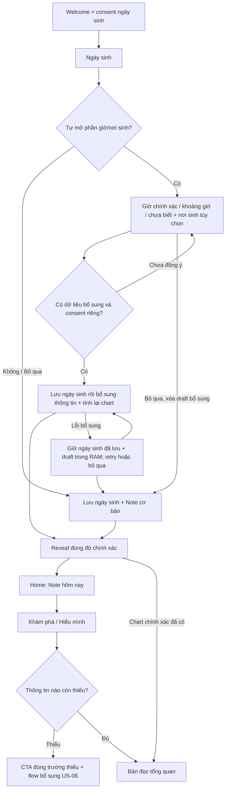

# Giờ/nơi sinh tùy chọn từ đầu + bề mặt hành tinh subtle

Ngày: 2026-10-07. Phạm vi: US-01/02/06/07, frontend đang có; không deploy, không gọi API tạo nội dung trả phí. Đây là cập nhật chuẩn cho onboarding, thay các quy tắc cũ bắt buộc chỉ hỏi giờ/nơi sinh sau Reveal.

## Quyết định sản phẩm

Ngày sinh vẫn là dữ liệu bắt buộc duy nhất. Ngay dưới ô ngày sinh có một hàng thu gọn **Thêm giờ & nơi sinh — Không bắt buộc · để hiểu mình rõ hơn**. Người biết thông tin mở để điền ngay; người chưa biết tiếp tục bằng một nút chính, không thêm màn bắt buộc. Không dùng tài khoản làm điều kiện.

Home vẫn ưu tiên Note, không chèn banner bổ sung vào giữa nội dung. Lời mời nhỏ ở dưới các lối khám phá; đích chính để đọc tổng quan là Khám phá/Hiểu mình (`/natal`, `/insights`). Mình giữ quyền sửa/xóa thông tin, không phải một upsell xuất hiện liên tục.

## Luồng

Người đang đi tiếp một flow Radar được trả về flow cũ nếu đã đủ giờ chính xác + nơi sinh; không bắt điền hai lần. Không thay consent của Radar hay mở quyền truy cập dữ liệu người khác.

## Field / validation / trạng thái

| Field | Loại / mặc định | Validation và edge case |
|---|---|---|
| Ngày / tháng / năm | 3 ô số; rỗng | Ngày có thật, không tương lai, 18–120 tuổi. Sau lưu thành công khóa ngày trong retry để không tạo ngày khác giữa hai request. |
| Phần bổ sung | Disclosure; đóng | Không mở = không gửi request supplement. Thu gọn giữ draft; **Bỏ qua** xóa toàn bộ draft và consent. |
| Nhớ giờ thế nào | Nhóm nút Biết giờ / Nhớ khoảng / Chưa biết; `unknown` | `BirthTimeInput` dùng chung, `exact`, `approx_window`, `unknown`. Không đoán giờ mặc định. Radar chỉ hiển thị những chế độ API của nhánh đó hỗ trợ. |
| Giờ / phút | 2 select 24h | Cả hai cần chọn khi exact. 00:00 hợp lệ; chỉ chọn 07 không suy ra 07:00. |
| Khoảng giờ | Nhóm nút theo enum hiện tại | Chỉ gửi khi approximate. Không gắn nhãn Rising/House chính xác. Không đổi thuật toán khoảng giờ trong bản này. |
| Nơi sinh | Search POST + danh mục hiện có | Chỉ gửi `place_id` sau chọn kết quả. Đổi text hủy lựa chọn/consent. Text chưa chọn phải sửa/xóa, không đoán tọa độ. Lỗi/không tìm thấy: retry, tên cũ, hoặc bỏ qua. Không GPS/địa chỉ nhà. |
| Consent bổ sung | Checkbox; không tick sẵn | Nêu mục đích tính lá số/cá nhân hóa, không public, có quyền xóa. Đổi mode/giờ/nơi phải xác nhận lại. Consent cơ bản không thay consent bổ sung. |

Giờ hoặc nơi sinh có thể lưu riêng khi đã consent. Nếu chưa đủ, không hứa đã mở toàn bộ chart. GET supplement không trả giờ thô; flow chỉnh sửa hiện hành cần người dùng xác nhận lại dữ liệu trước khi thay snapshot. Không tăng dữ liệu trả về chỉ để prefill.

## Quy tắc CTA sau onboarding

| Server xác nhận | CTA |
|---|---|
| Chưa có response / lỗi | Không đoán là thiếu và không hiển thị lời mời thu thêm dữ liệu. |
| Chỉ ngày sinh | Thêm giờ & nơi sinh |
| Đã có giờ chính xác, thiếu nơi | Thêm nơi sinh — không hỏi “Thêm giờ sinh” nữa |
| Có nơi, chưa có giờ | Thêm giờ sinh |
| Giờ gần đúng | Làm rõ giờ sinh — nói rõ đã lưu giờ gần đúng, không xem là chưa nhập |
| Giờ chính xác + nơi/timezone | Không có CTA bổ sung; dùng bản đọc tổng quan / sửa thông tin trong Mình |

Snooze Home 3 ngày vẫn được tôn trọng. Link chủ động trong Khám phá/Mình vẫn truy cập được. Không dùng snooze để ẩn quyền sửa/xóa.

## Request / dữ liệu / retry

1. Validate tất cả trước request lưu. DOB dùng endpoint hiện có.
2. Chỉ gọi supplement nếu có giờ/khoảng giờ hoặc nơi đã chọn, cùng consent riêng. Dùng CSRF/header/owner session hiện có; không API key mới.
3. Supplement thành công: xóa cache note trong RAM, invalidate supplement/overview; fetch profile và Note mới **sau** tính lại. Không trả lại note cũ còn fresh trong React Query.
4. Nếu supplement lỗi: không tạo lại DOB; không tự hạ xuống date-only mà không cho user chọn. Nếu Note lỗi sau save: retry read, không gọi supplement lần nữa.
5. Draft chỉ trong RAM, mất khi reload. Không birth time/place trong URL, localStorage, analytics, log, public share hoặc gửi ImageGen/provider. Place search truyền truy vấn tới backend chính để tìm địa danh, không lưu birth profile trước consent.

## Visual contract

Giữ nền kem, một card tím trọng tâm, chữ kem, lime là điểm nhấn và một font Be Vietnam Pro. Tím mang cảm giác **macro bề mặt hành tinh**, không phải hình quả cầu hay wallpaper sao: vân khoáng mờ, vài vùng lõm mềm, ánh sáng dịu lệch phía, tối hơn ở rìa. Relief thấp, không chuyển động/parallax. Dùng raster asset version mới, không vẽ địa hình bằng div/SVG; inset border và bóng đổ mềm tạo elevation thật.

Chữ không đi theo sáng/tối của texture. **Cập nhật sau feedback lần hai:** bỏ soft-light vì làm card tối/ngả xanh. Giữ tím lấy từ vùng nền reference `#4c2e8e`; asset `violet-planet-v2.webp` nằm trên lớp riêng, opacity **0.50**, blend `luminosity`, pointer-events none. Mức 0.09 trước đây quá nhẹ, đã được thay thế. Không dùng ảnh thô trực tiếp dưới chữ. Kiểm tra 512.000 pixel của asset bằng công thức luminosity blend + WCAG cho kem/lime cho mức tối thiểu mô hình lần lượt **5.42:1 / 5.03:1**; không áp dụng kết quả này cho asset/opacity khác. Cùng asset trên các violet focus card; không phủ texture lên toàn bộ nền/form để tránh clutter. Không chứng nhận accessibility toàn app. [QA và đối chiếu mới](../reviews/optional-birth-planet-2026-10-07/time-content-terrain/README.md).

## AC và DoD

- [x] Date-only giữ route Reveal, không bổ sung/không login trong automated flow; browser E2E mới hoàn toàn không có pending Radar còn chưa chạy riêng (xem QA).
- [x] Có thể mở phần tùy chọn, chọn giờ/phút (kể cả 00:00), nơi sinh và consent riêng trước save.
- [x] Chưa tick / thiếu phút / text nơi sinh chưa chọn: không gửi DOB hay supplement.
- [x] Bỏ qua xóa draft, không gửi giờ/nơi sinh. Unknown không tự điền 12:00.
- [x] Approximate, time-only, place-only giữ độ chính xác và CTA phù hợp trong helper/validation tests.
- [x] Retry supplement không duplicate DOB; retry Note không duplicate supplement; đủ Radar không hỏi lại.
- [x] Reveal không nói “chưa dùng giờ/nơi sinh” khi đã có chart; có đường mở tổng quan.
- [x] Home/Insights không có CTA thêm giờ khi đầy đủ; có giờ chỉ thiếu nơi không được yêu cầu thêm giờ.
- [ ] Xóa dữ liệu trong Mình làm mới CTA; không stale overview cá nhân.
- [x] Screenshot 390/320, light/dark, collapsed/expanded/result, không overflow hoặc che consent/CTA.
- [x] Typecheck/lint/frontend tests/runtime privacy guards; chạy save/tính chart thật và kiểm tra console bằng browser.
- [x] Texture và nguồn tham chiếu được so sánh cùng viewport; lưu QA có giới hạn xác minh.

**Bằng chứng và nhánh còn thiếu:** [QA receipt](../reviews/optional-birth-planet-2026-10-07/README.md). Chưa ký release gate production/native; không đổi kết quả tính chart ở backend.

Native iOS/Android và production vẫn cần release gate riêng; local browser không thay bằng chứng native/production.

## Quay về đầu để review

### Motion nhẹ cho 1/3 → 3/3

Motion v2: hành tinh lượn/nghiêng/phóng nhẹ theo chu kỳ, hai sao chạy quỹ đạo ngược chiều lệch pha, lặp liên tục thay vì bob rồi dừng. Một nút Pause/Play 44px ở header điều khiển tất cả motion trang trí; lựa chọn giữ trong bộ nhớ AppShell qua ba bước, không lưu hoặc gửi preference ra ngoài. Chữ/form đứng yên. Reveal card mở lên trong 650ms, không trì hoãn dữ liệu/CTA, không thêm loading giả. Tiến độ biểu diễn 33%/67%/100% cho ba bước, không phải phần trăm tính toán. `prefers-reduced-motion` tắt animation/transition và ẩn nút motion khi không còn motion trang trí. [Contract + QA motion v2](../reviews/optional-birth-planet-2026-10-07/onboarding-motion-v2/README.md).

`/welcome?restart=1` mở Welcome, không tự xóa cache/tạo guest hoặc gửi consent. Chỉ sau người dùng bấm **Đồng ý & bắt đầu** mới chạy reset local/guest hiện hành, không phục hồi pending Radar cũ. `/welcome` thường vẫn giữ intent Radar hợp lệ như trước. Không xóa dữ liệu server hoặc đổi consent của người khác. Đã có regression test cho cả giữ intent và replay từ đầu.

## Nguồn rà soát

- [Luật Bảo vệ dữ liệu cá nhân 91/2025/QH15, hiệu lực 01/01/2026](https://chinhphu.vn/?classid=1&docid=214590&orggroupid=1&pageid=27160), [bản luật](https://datafiles.chinhphu.vn/cpp/files/vbpq/2025/7/91qh.signed.pdf): chuẩn kiểm tra consent/mục đích/quyền dữ liệu, không phải kết luận pháp lý toàn hệ thống.
- [WCAG 2.2](https://www.w3.org/TR/WCAG22/): contrast, labels, focus và input assistance.
- Repo: AGENTS.md, US-01/02/06/07, chart-synthesis-release-runbook, selected Ultraviolet reference. Không thay thuật toán/knowledge engine, không thêm nhà/transit giả khi dữ liệu thiếu.
