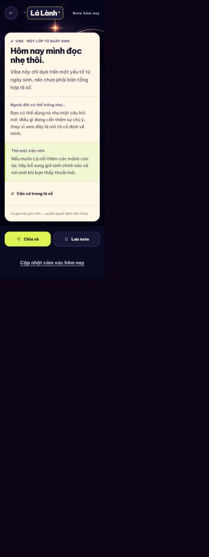
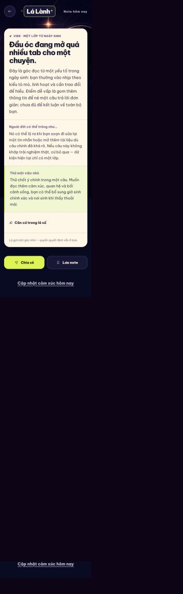
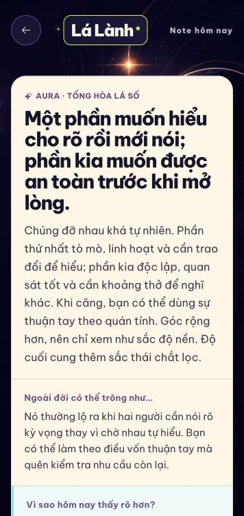

# Daily Note content + USP audit

Ngày audit: 2026-09-12  
Surface: app-first mobile web QA, `/note/today`  
Direction: Cosmic Glass Signal, giữ nguyên visual system

## Evidence

### Trước sửa

### Sau sửa

### Sau khi mở đủ giờ và nơi sinh

## Flow được kiểm tra

1. Mở Daily Note từ Home.
2. Scan hook và thesis trên paper card.
3. Đọc biểu hiện đời thường và gợi ý thử hôm nay.
4. Mở “Vì sao note này?” để xem căn cứ chart.
5. Nếu đã có full chart update, chủ động mở món quà “bản đủ lớp”.

## General health

**Trước sửa: poor về product value, fair về visual hierarchy.** Paper card dễ nhận biết và style đúng direction, nhưng nội dung chính dành phần lớn diện tích để giải thích giới hạn dữ liệu. User không nhận được một insight đủ cụ thể, không biết tại sao nên quay lại ngày mai, và không thấy lợi ích rõ sau khi bổ sung giờ/nơi sinh.

## Findings và trạng thái

1. **P0 — USP không hiện ra trong note.** Copy “đọc nhẹ thôi” và “mới có một yếu tố” nói về hệ thống nhiều hơn nói về người dùng.  
   **Fix:** note mới đi theo `hook → cơ chế → biểu hiện → thử nghiệm → evidence`; USP được ghi thành product contract.
2. **P0 — Full data nhưng bản một lớp vẫn active mà Note detail không có đường mở update.** Đây là nguyên nhân trực tiếp khiến user thấy “vẫn một cái note”.  
   **Fix:** thêm gift-style `available_update` ở Note detail; activation có loading/success/error và cập nhật cache/projection.
3. **P0 — Calculation giàu nhưng interpretation nghèo.** Renderer cũ chỉ có vài branch và không có catalog/version/coverage.  
   **Fix:** thêm knowledge matrix versioned cho hành tinh, cung, 12 nhà, sáu góc, degree/orb, transit phase và background lens; thêm coverage tests.
4. **P1 — Daily freshness không được đảm bảo bằng contract.** Scope theo ngày có nhưng plan cũ không giữ editorial date seed.  
   **Fix:** local date tham gia canonical plan; cùng ngày stable, ngày kế tiếp đổi hook và practice/factor focus.
5. **P1 — “Tín hiệu vũ trụ” làm giảm niềm tin và che calculation thật.**  
   **Fix:** editorial gate fail-closed với các phrase cosmic-message; UI label đổi thành “Một note đọc từ lá số của bạn”.
6. **P1 — Thuật ngữ transit/aspect không trả lời “thế thì sao?”.**  
   **Fix:** transit chỉ giải thích current activation của một natal need, kèm aspect/orb/phase bằng tiếng đời thường; chart term chuyển xuống evidence.
7. **P1 — Western/Jyotish có nguy cơ bị nhìn như cùng một corpus.**  
   **Fix:** plan validator giữ tradition isolation; generated Jyotish vẫn OFF cho tới expert corpus riêng.

## Accessibility review

- Visual hierarchy của paper card và headings rõ, nhưng screenshot trước sửa ở viewport rất hẹp cho thấy body/disclaimer dễ rơi xuống cỡ đọc nhỏ.
- Decorative sky/paper texture phải tiếp tục `aria-hidden`; controls và accordion cần accessible name, focus order và touch target tối thiểu 44px.
- Screenshot không chứng minh được screen reader, text scale 200%, Reduce Motion hay contrast ở mọi state. Các mục này vẫn cần native/simulator evidence trước release.

## Product recommendations sau foundation

1. Thêm phản hồi một-tap “trúng / chưa trúng” sau micro-action; chỉ dùng enum, không thu free text mặc định.
2. Thêm “Điều đã đổi từ hôm qua” khi có transit hoặc hero focus thật sự khác; không tạo novelty giả.
3. Xây content benchmark theo chart fixtures và cohort người dùng trước khi mở generated prose.
4. Xây `jyotish-interpretation-matrix-v1` riêng với expert review thay vì tái dùng Western copy.
5. Sau khi native foundation ổn, dùng local notification như lời nhắc mở note; payload không chứa dữ liệu cá nhân hoặc reading text.

## Limits

- Audit hiện tập trung vào Daily Note surface và state đã có trong QA session; chưa phải full US01–US09 accessibility certification.
- Native iOS/Android device run, production KMS, edge rate limit và user benchmark vẫn là release gates.
