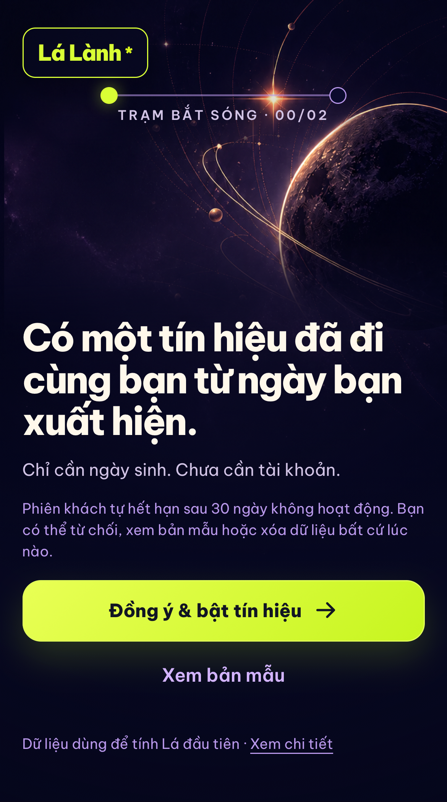
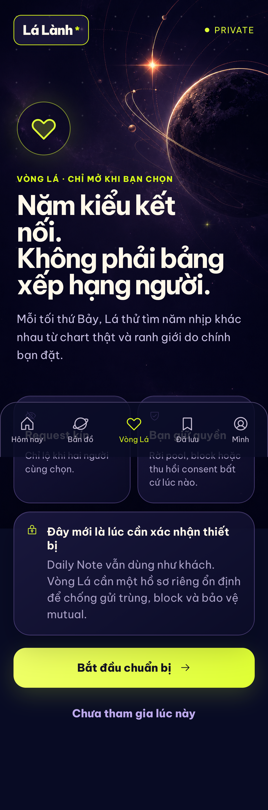
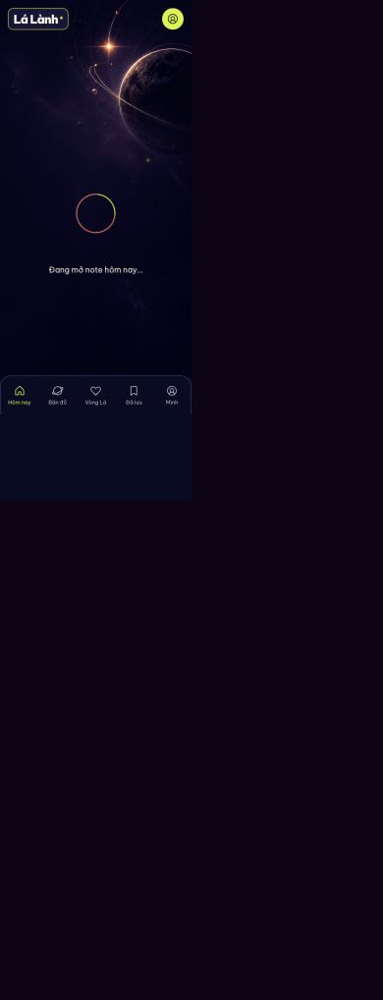
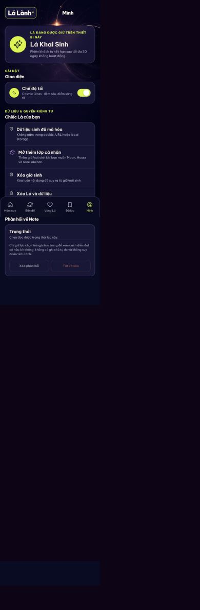
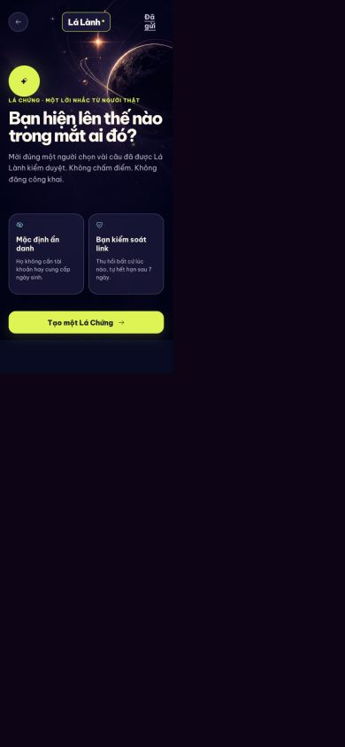
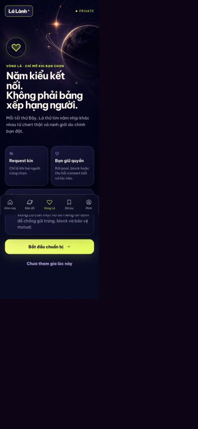
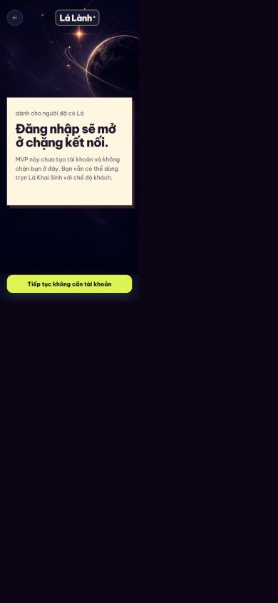

# Audit mức sẵn sàng sản phẩm — US-01 đến US-19

Ngày audit: 2026-09-18  
Phạm vi ưu tiên: US-01/02/06/08–19  
Mục tiêu người dùng: đi từ khách mới → chart nền → social proof/Lá Ghép → Vòng Lá → mutual → chat → recap, chỉ đăng nhập ở thời điểm thật sự cần.

## 1. Kết luận

**Chưa phải bản cuối cho public matching.** Sản phẩm hiện đủ để review và trải nghiệm vòng lõi cá nhân gồm onboarding khách, chart thật, Daily Note, bổ sung giờ/nơi sinh, insight và Lá Chứng. Phần relationship/matching mới có engine tính và readiness foundation; chưa có sản phẩm end-to-end cho Pitch Card, Lá Ghép, năm lá, mutual, chat và recap.

Không được gộp ba trạng thái sau thành “đã xong”:

1. **Có tài liệu:** user story/AC tồn tại.
2. **Có engine:** phép tính hoặc selector tồn tại nhưng chưa có ownership, persistence, API và UI.
3. **Có sản phẩm:** người dùng đi hết flow với dữ liệu thật, lỗi/consent/deletion đầy đủ và có test.

### Bản QA đã xác nhận

- Review URL sạch: `http://127.0.0.1:5191/welcome`
- `/v1/health` trả đúng API v1; `/__qa/ready` trả `ready`; SPA deep link hoạt động.
- Bộ kiểm tra hiện tại: 70/70 web tests, 283/283 API tests; lint, typecheck, OpenAPI contract, no-mock runtime guard, privacy guard, mobile config guard và QA CLI smoke đều qua.
- Build còn cảnh báo JavaScript entry chunk khoảng 682 kB; đây là việc tối ưu hiệu năng P1, chưa phải bằng chứng các social story đã hoàn tất.

## 2. Ma trận bằng chứng theo US

| US | Giá trị người dùng | Màn/UI thật | API + database thật | Privacy/safety | Trạng thái | Khoảng trống chặn release |
|---|---|---:|---:|---:|---|---|
| US-01 | Dùng thử không tài khoản | Có | Có | Consent + TTL + delete có | **Gần đủ** | Token native chưa ở secure keystore; cần mobile security QA |
| US-02 | Ngày sinh → Vibe đầu tiên | Có | Có, Swiss Ephemeris | DOB không đưa vào share | **Gần đủ** | Store/legal age configuration và native QA cuối |
| US-06 | Giờ/nơi → full chart/Aura | Có | Có, mã hóa dữ liệu sinh | Purpose disclosure + remove time/place | **Gần đủ** | Domain-expert sign-off cho lớp Jyotish public |
| US-08 | Tạo/gửi Lá Chứng | Có | Có, link capability + revoke/expiry | Không danh bạ/free text; no-store | **Một phần** | Hard auth đang là device claim, chưa phải account thật |
| US-09 | Người nhận phản hồi và rút lại | Có | Có, receipt + withdrawal | Anonymous mặc định; không dùng cho matching | **Gần đủ** | Cần abuse/rate-limit vận hành và notification channel |
| US-10 | Tạo Pitch Card | Không | Không | Chỉ có contract | **Thiếu** | Theme/statement bank, anti-spam, persistence, link, UI |
| US-11 | Người được pitch mở/reveal/accept | Không | Không | Chỉ có contract | **Thiếu** | Public landing, guest resume, consent và state machine |
| US-12 | Tạo/gửi Lá Ghép | Không | Chưa có domain/API | Engine synastry đã có | **Engine-only** | Pair ownership, input B, consent, preview, invite, expiry |
| US-13 | B xác nhận → full Lá Ghép | Không | Chưa có domain/API | Rule simultaneous snapshot mới ở doc | **Engine-only** | B consent, canonical input, completion, notification, deletion |
| US-14 | Matching-ready | Có readiness/setup | Có profile/consent/readiness | Fail-closed đúng | **Một phần** | Ảnh/xác minh thật, appeal, real account, moderation SLA |
| US-15 | Nhận/mở 5 lá | Không | Selector pure có; chưa persist/job/API | Hard-filter contract có | **Engine-only** | Pool, batch, slate/card tables, window, UI, push |
| US-16 | Request kín + mutual | Không | Không | Contract tốt | **Thiếu** | Transaction reciprocal, block race, Lá Nối snapshot |
| US-17 | Chat + icebreaker | Không | Không | Contract yêu cầu block/report | **Thiếu** | Thread/message auth, moderation, report queue, retention |
| US-18 | Recap Chủ nhật | Không | Không | Share projection mới ở doc | **Thiếu** | Job, snapshot, viewer, safe share/deep link |
| US-19 | Đăng nhập đúng lúc | Màn giải thích có | Chỉ có device-bound owner session | Không phải account recovery | **Thiếu P0** | Phone/email OTP, anti-enumeration, merge, recovery, deletion |

## 3. Audit hành trình hiện tại

### Bước 1 — Home/Daily Note: **có sản phẩm nhưng phiên audit lỗi kết nối**

- Điểm tốt: navigation app rõ, trạng thái loading/error không bịa note.
- Rủi ro UX: bản review cũ bị kẹt ở “Đang mở note” rồi chuyển error khi API không chạy; đây là blocker trải nghiệm, không phải trạng thái nội dung.
- Accessibility nhìn thấy được: loading có text; cần kiểm tra live-region và focus sau error bằng automation, screenshot không đủ kết luận.

### Bước 2 — Mình/dữ liệu cá nhân: **tốt cho guest core**

- Điểm tốt: light/dark toggle, xóa giờ/nơi, xóa dữ liệu và trạng thái guest được gom đúng chỗ.
- Rủi ro UX: chưa có “Tài khoản & khôi phục” thật; câu “được giữ trên thiết bị” phải tiếp tục được dùng cho tới khi US-19 hoàn tất.
- Accessibility: target và chữ ở phần setting khá nhỏ trên mobile; cần đo contrast/text scale trên simulator.

### Bước 3 — Lá Chứng: **flow xã hội duy nhất đang có màn thật**

- Điểm tốt: value proposition rõ, anonymous mặc định, không yêu cầu ngày sinh của người trả lời.
- Rủi ro UX: entry còn tách khỏi một Social hub thống nhất; Pitch Card/Lá Ghép chưa xuất hiện nên người dùng không hiểu toàn bộ giá trị quan hệ.
- Privacy: kết quả hiện đứng riêng và không đi vào matching. Nếu sau này aggregate thành social proof phải có purpose/consent mới.

### Bước 4 — Vòng Lá readiness: **honest gate, chưa phải matching**

- Điểm tốt: không hiển thị `% hợp`, request kín và quyền rời pool được nói trước.
- Rủi ro UX: CTA “Bắt đầu chuẩn bị” hiện dẫn tới device claim, trong khi kỳ vọng của người dùng là account/xác minh thật.
- Safety: việc fail-closed ở verification là đúng. Không được thêm nút tự pass để bản demo trông hoàn chỉnh.

### Bước 5 — Đăng nhập đúng lúc: **chưa tồn tại**

- Màn hiện tại thừa nhận MVP chưa có tài khoản; đây là copy trung thực nhưng chứng minh US-19 chưa đạt.
- Toàn bộ US-10, 12, 14–18 cần stable identity, recovery và deletion; device claim 30 ngày không đáp ứng.

### Bước 6 — Pitch Card: **blocker — không có route/API để capture**

### Bước 7 — Lá Ghép: **blocker — engine có, sản phẩm không có route/API**

### Bước 8 — 5 lá úp: **blocker — selector có, không có slate được publish**

### Bước 9 — Request/mutual/Lá Nối: **blocker — chưa có persistence/transaction**

### Bước 10 — Chat/report/block: **blocker — chưa có runtime moderation surface**

### Bước 11 — Recap: **blocker — chưa có job/snapshot/viewer**

## 4. Rủi ro cấu trúc cần sửa trước polish

1. **US-19 là critical path.** Không nên xây thêm social action trên device claim rồi migrate ngược sau.
2. **US-12/13 cần pair-consent model riêng.** Dữ liệu B do A nhập chỉ là draft; B xác nhận mới là canonical.
3. **US-15 không thể test value với candidate giả.** Local QA dùng fixture test-only; production phải trả low-pool thật.
4. **US-16 và US-17 phải phát hành cùng safety boundary.** Không mở mutual nếu chưa block/report/moderation.
5. **Push không phải source of truth.** Mọi trạng thái phải resume từ API khi notification bị tắt/mất.
6. **Account deletion phải cascade/ẩn danh hóa social graph, chat, invite, pair result và ảnh.**

### Sửa trực tiếp trong audit này

- Bỏ default khu vực ngầm là TP.HCM trong UI hồ sơ matching mới.
- Bắt buộc người dùng tự chọn một khu vực cấp thành phố; giải thích rõ chỉ lưu thành phố, không lấy GPS và không hiển thị khoảng cách số.
- Thêm test xác nhận `region_code` được gửi đúng theo lựa chọn của người dùng.

## 5. Release gate theo policy hiện hành

- Apple yêu cầu UGC/social có filtering, report, block và contact; app có account phải cho xóa account trong app.
- Google Play yêu cầu moderation/report/block cho UGC và safeguards đủ mạnh để ngăn người dưới 18 vào dating/matchmaking.
- OWASP MASVS yêu cầu kiểm tra storage, crypto, auth, network và privacy của app native; web test không thay thế được.
- Dữ liệu sinh, intent, ảnh, vùng và pair-derived chart phải nằm trong data map/consent/retention theo Nghị định 13/2023/NĐ-CP; cần legal review trước public launch.

## 6. Quyết định release

| Release | Có thể bật | Không được bật |
|---|---|---|
| Internal product review | US-01/02/03–09, relationship engine inspector, US-14 readiness fail-closed | candidate/mutual/chat giả |
| Closed alpha cá nhân | Core chart/Daily/Lá Chứng với account test cohort | Vòng Lá public |
| Closed matching beta | Chỉ sau OTP, verification, block/report/moderation, US-15–17 E2E | anonymous/random chat, auto-pass |
| Public app | Sau store 18+, account deletion, push, mobile MASVS QA, incident/moderation runbook | bất kỳ story còn “engine-only” |

## 7. Definition of Done cho “bản cuối”

- Mỗi US có route hoặc native screen thật, API/persistence thật, test success/error/permission/deletion và QA screenshot.
- US-19 có OTP hoặc identity provider thật, merge/recovery/deletion; không gọi device claim là login.
- US-10–13 chạy được qua public safe web landing không ép cài app trước khi thấy giá trị.
- US-15–18 chạy được với hai account thật, block race và no-match recap.
- Không có mock runtime, candidate giả, self-approval verification, compatibility score hay astrology verdict.
- iOS/Android simulator pass, deep link/push/secure storage pass và production API dùng HTTPS.

## 8. Evidence limits

Audit hình ảnh chỉ xác nhận được hierarchy và trạng thái nhìn thấy. Nó không chứng minh screen-reader order, keyboard/focus, text zoom, authorization, encryption, race safety hay deletion cascade; các phần đó phải dựa vào test/code review và simulator QA riêng.
