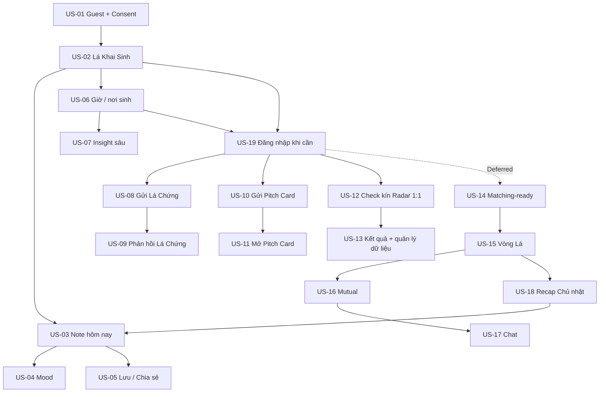

# Lá Lành — User Story Map

## Mục đích

Bộ tài liệu này tách flow tổng thành 19 user story độc lập theo **kết quả người dùng đạt được**. Mỗi story có phạm vi riêng, dependency rõ, full user flow, Acceptance Criteria (AC) và Definition of Done (DoD).

Nguồn chuẩn: `la-lanh-prd.md`, `la-lanh-srs.md`, `la-lanh-product-plan-v2.md` và `la-lanh-astro-engine-spec.md` (source of truth Astro Engine v2/US-07+).

Direction chuẩn cho US-01–US-06 là **02 — Cosmic Glass Signal**. Dark là expression gần reference nhất; light dùng cùng hierarchy/component trên nền mist-lilac. Glass chỉ phân tách control, disclosure và navigation; reading surface đủ đục để đọc nhanh. Native app là release target và release gate; web/PWA là reference/companion, không phải bằng chứng thay thế cho native readiness.

Từ vựng compact thống nhất: profile chỉ có ngày sinh hiển thị `Vibe · <3–5 chữ>`; NatalChart sâu hợp lệ hiển thị `Aura · <3–5 chữ>`. Prompt cảm xúc luôn là **“Hôm nay bạn thấy sao?”** để “Vibe” chỉ có một nghĩa. `Aura v2` là nhãn biên tập deterministic từ nhiều factor ổn định của toàn chart, không còn đồng nghĩa với dominant element. Sun/Moon/Rising/House, hành tinh, aspect/drishti, transit, chart depth và precision là dữ kiện và phải còn trong provenance/detail.

Chuẩn tính toán cho US-07 trở đi: [`la-lanh-astro-engine-spec.md`](../foundation/la-lanh-astro-engine-spec.md). Hai switch độc lập gồm **Hệ đọc** (`Western Tropical`/`Jyotish Sidereal`) và **Cách tính** (`Khuyên dùng`/`Tùy chỉnh`). Mỗi combination tạo snapshot riêng; client không được đổi nhãn trên cùng dữ liệu.

## Quy tắc phân ranh giới

- Một hành vi chỉ thuộc một story. Story khác chỉ tham chiếu kết quả đã tạo.
- “Home” và “Social Seed” là điểm điều hướng, không phải user story độc lập vì bản thân chúng chưa tạo ra kết quả cho user.
- Các flow hai phía được tách theo actor: người gửi và người nhận.
- Notification, loading, empty, error và expired là state trong story sở hữu nghiệp vụ, không tách thành story riêng.
- Safety trong matching/chat nằm ở story nơi rủi ro phát sinh; tiêu chuẩn hệ thống vẫn áp dụng xuyên suốt.
- Sản phẩm dùng mô hình **guest-first**: consent dữ liệu không đồng nghĩa tạo tài khoản; authentication chỉ xuất hiện khi cần sync, lưu dài hạn hoặc tương tác xã hội/matching.

## Danh sách và thứ tự phụ thuộc

| ID | User story | Kết quả chính | Phụ thuộc |
|---|---|---|---|
| US-01 | Bắt đầu bằng chế độ khách | Có guest session và consent hợp lệ, chưa cần tài khoản | — |
| US-02 | Khai ngày sinh và mở Lá Khai Sinh | Có Astro Profile Basic | US-01 |
| US-03 | Đọc Note hôm nay | Đọc được insight hằng ngày | US-02 |
| US-04 | Mood check-in | Mood được ghi nhận và dùng cá nhân hóa | US-03 |
| US-05 | Lưu và chia sẻ Note | Note được lưu hoặc xuất bản chia sẻ | US-03 |
| US-06 | Bổ sung giờ/nơi sinh | Profile đạt Level 2/3 | US-02 |
| US-07 | Mở insight Moon/Venus/Mars/House | Đọc lớp insight sâu đúng dữ liệu | US-06 |
| US-08 | Gửi lời mời Lá Chứng | Tạo và gửi request hợp lệ | US-02, US-19 |
| US-09 | Phản hồi và nhận Lá Chứng | B gửi xác nhận; A xem social proof | US-08 |
| US-10 | Tạo và gửi Pitch Card | A pitch B vào một theme | US-02, US-19 |
| US-11 | Mở và phản hồi Pitch Card | B reveal card và chọn tham gia/không | US-10 |
| US-12 | Check kín một người đã biết | A tự nhập dữ liệu đã được B cho phép; raw input chỉ dùng transient. Invite là fallback | US-06, US-19 |
| US-13 | Đọc và quản lý kết quả Radar | A nhận bản đọc nhiều chiều, mở lại/xóa; invite mode vẫn có consent riêng của B | US-12, US-06 |
| US-14 | Chuẩn bị profile matching-ready | **Deferred — không thuộc active Radar MVP** | US-06, US-19 |
| US-15 | Tham gia Vòng Lá và mở 5 lá | **Deferred — pool/discovery chưa làm** | US-14 |
| US-16 | Gửi request và tạo mutual match | **Deferred** | US-15 |
| US-17 | Chat an toàn với icebreaker | **Deferred** | US-16 |
| US-18 | Xem/chia sẻ Recap Chủ nhật | **Deferred** | US-15 |
| US-19 | Xác thực khi cần và giữ hồ sơ khách | Guest được claim vào account và quay lại đúng intent | US-01, US-02 |

## Ownership contract cho US-01–US-06

| Story | Sở hữu duy nhất | Nhận từ upstream | Bàn giao, không triển khai thay |
|---|---|---|---|
| US-01 | Welcome, privacy consent, guest create/resume/expire, demo | App/session state | Session+consent cho US-02; identity intent cho US-19 |
| US-02 | DOB/age gate, Sun-only compute, Vibe, basic reveal/birth card | US-01 session+consent | Level-1 snapshot cho US-03/06; không tạo Daily Note/mood |
| US-03 | Daily Note identity/content/cache/fallback/detail/provenance/view | Active chart snapshot | Note/date cho US-04; immutable snapshot cho US-05; unlock intent cho US-06 |
| US-04 | Five-choice mood upsert/offline/latest-wins | US-03 Note/date | Reviewed mood enum cho future personalization; không tạo Note/persona |
| US-05 | Save/unsave/collection/share asset/safe link/revoke | US-03 Note snapshot | Optional claim/merge cho US-19; không generate Note/mood |
| US-06 | Time/place/deep consent/geocode/recompute/readiness/edit/delete/Aura gate | US-02 Level-1 profile | Active deeper snapshot cho US-03/07; không viết deep insight |

## Ownership contract cho US-07–US-09

| Story | Sở hữu duy nhất | Nhận từ upstream | Bàn giao, không triển khai thay |
|---|---|---|---|
| US-07 | Bản đồ Lá, Western/Jyotish switch, recommended/custom calculation, tổng hòa natal + transit, provenance/save | Active chart/birth precision từ US-02/06; engine v2 | Reading snapshot cho future share/social; không thu birth data hay tính synastry |
| US-08 | Draft/preview/auth-resume, capability request/link, native share/picker, pending/resend/revoke/expire | Basic Profile, US-19 auth, approved StatementBank | Valid frozen request/token cho US-09; không nhận response |
| US-09 | Public landing, curated response, identity consent, idempotent submit, report/withdraw, individual result cho A | Valid US-08 capability + frozen bank | Privacy-safe individual social proof; aggregation/matching cần story và consent riêng |

Mỗi story phải hoàn tất độc lập ở outcome của nó. Downstream không được dùng làm lý do để bỏ loading/error/privacy/deletion contract của story đang sở hữu; upstream object chỉ được tham chiếu bằng contract và authorization, không copy logic sang story khác.

## Vibe/Aura mapping và provenance

| Sun-only placement | Vibe label |
|---|---|
| Bạch Dương | `Vibe · Nóng` |
| Kim Ngưu | `Vibe · Bền` |
| Song Tử | `Vibe · Lanh` |
| Cự Giải | `Vibe · Mềm` |
| Sư Tử | `Vibe · Rực` |
| Xử Nữ | `Vibe · Gọn` |
| Thiên Bình | `Vibe · Duyên` |
| Bọ Cạp | `Vibe · Sâu` |
| Nhân Mã | `Vibe · Phiêu` |
| Ma Kết | `Vibe · Chắc` |
| Bảo Bình | `Vibe · Khác` |
| Song Ngư | `Vibe · Mộng` |

Các label Fire `Rực`, Earth `Chắc`, Air `Lanh`, Water `Mềm` chỉ là vocabulary seed, không phải công thức Aura. `Aura v2` lấy top factor ổn định xuyên domain, weighted element/modality, ruler và reinforcement theo engine spec; output vẫn thuộc allowlist 3–5 chữ, deterministic, có provenance/confidence. Không đủ depth/precision thì giữ Vibe; client không tự suy diễn.

## Flow tổng sau khi tách

## DoD chung cho mọi story

Ngoài DoD riêng trong từng file, mọi story chỉ Done khi: canonical AC Given/When/Then pass; route/state và API/data contract khớp implementation; có loading/empty/error/retry/offline nếu áp dụng; Cosmic Glass Signal light/dark dùng cùng hierarchy/component; control ≥44px, focus/screen-reader/200% text/Reduce Motion/Transparency và WCAG AA pass; analytics/log/cache/share không chứa dữ liệu cấm; consent, authorization, retention/deletion và idempotency được test; content/copy review pass; implementation evidence không còn placeholder `Pending` cho gate bắt buộc.

Web/PWA chỉ cung cấp reference/companion evidence. Native app là release target và release gate; secure storage, native sharing/permissions, app lifecycle/deep link/offline, platform accessibility, transport/logging và deletion phải có evidence native trước release. Mục chưa kiểm chứng phải để `Pending` hoặc `Blocked`, không suy ra từ web pass.

**Trạng thái app-first hiện tại:** repository đã có Capacitor source target cho iOS và Android dùng chung production bundle với web reference. Đây mới là development shell: native Keychain/Keystore session adapter, production HTTPS API origin, universal/app links, signing, store privacy declarations, simulator/device accessibility và native security evidence vẫn là hard release gates. Web pass hoặc `cap sync` không đồng nghĩa native release Done.
