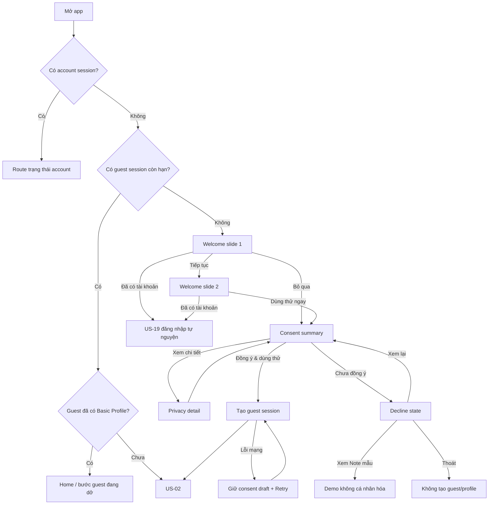
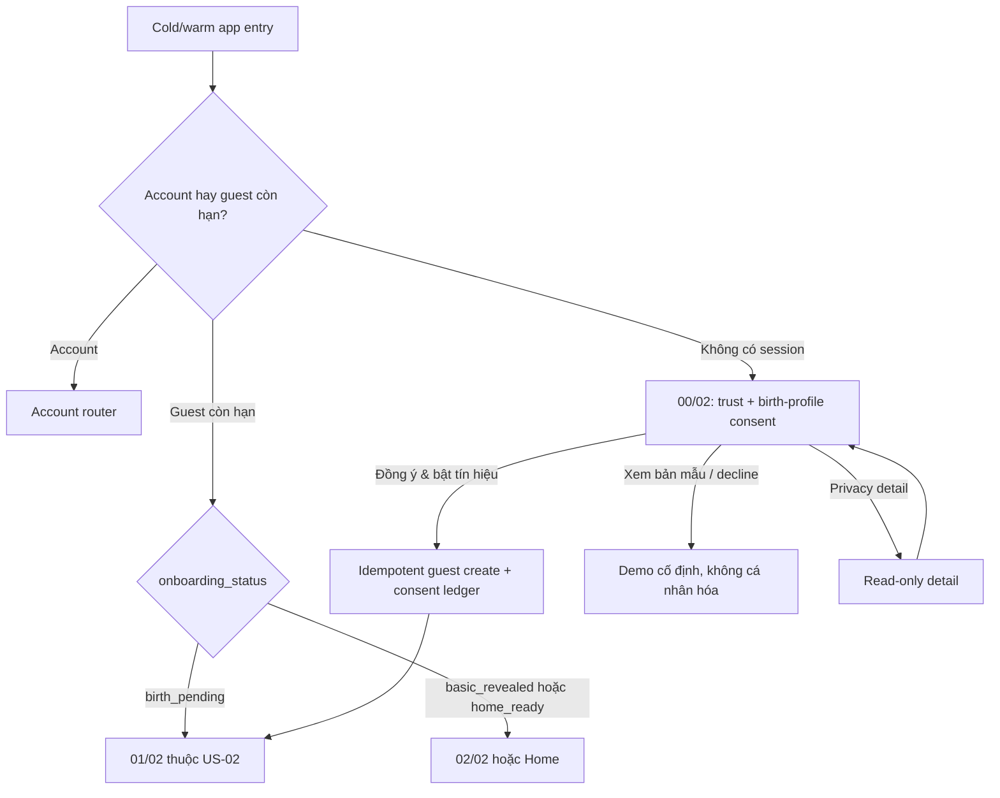

# US-01 — Bắt đầu bằng chế độ khách

**Cập nhật 07/10/2026:** guest vẫn chỉ cần ngày sinh và consent cơ bản. US-02 cho mở thêm giờ/nơi sinh tùy chọn, với consent riêng; không login wall hay thêm màn bắt buộc. Xem [contract onboarding mới](../plans/2026-10-07-optional-birth-details-planet-surface.md). Welcome không cần hỏi giờ/nơi sinh hay thêm slide mới.

## 1. User story

Là người mới, tôi muốn hiểu ngắn gọn Lá Lành làm gì và dùng thử trải nghiệm cá nhân hóa mà chưa phải đăng nhập, để chỉ tạo tài khoản sau khi sản phẩm đã cho tôi thấy giá trị.

## 2. Nguyên tắc sản phẩm

**Value first, identity later:** consent xử lý dữ liệu và đăng nhập là hai việc khác nhau. User cần đồng ý trước khi gửi ngày sinh để tính Lá, nhưng không cần cung cấp phone/email hoặc tạo tài khoản.

### User khách được làm

- Khai ngày sinh và mở Lá Khai Sinh.
- Vào Home, đọc Daily Note và mood check-in.
- Tạo/lưu card vào thiết bị và chia sẻ card công khai.
- Lưu Note cục bộ trên thiết bị.
- Bổ sung giờ/nơi sinh và xem lớp insight sâu trong thời hạn guest session.

### Chỉ cần đăng nhập khi

- Muốn đồng bộ/khôi phục dữ liệu qua thiết bị khác.
- Muốn giữ dữ liệu sau khi guest session hết hạn hoặc sau khi gỡ app.
- Bắt đầu hành động có người khác tham gia: gửi Lá Chứng, Pitch Card, Lá Ghép.
- Tham gia Vòng Lá, mutual match hoặc chat.
- Quản lý/xóa dữ liệu ở cấp tài khoản.

Các trigger và flow đăng nhập thuộc US-19. US-01 không chứa phone, email hoặc OTP.

## 3. Phạm vi

### Trong phạm vi

Welcome tối đa hai slide; lựa chọn đăng nhập tự nguyện cho user cũ; consent trước birth data; privacy detail; tạo guest session ẩn danh; resume guest session; decline/demo state; guest retention messaging.

### Ngoài phạm vi

- Phone/email/OTP và claim dữ liệu guest: US-19.
- Ngày sinh và Astro Profile Basic: US-02.
- Tên/nickname/avatar: không hỏi ở entry.
- Marketing consent: tách riêng và không xuất hiện trong flow này.

## 4. Dữ liệu và vòng đời guest

| Thành phần | Quy tắc |
|---|---|
| `guest_id` | UUID ngẫu nhiên do server tạo sau consent; không suy ra từ device fingerprint. |
| Guest token | Lưu trong secure storage của app; rotate/expire; không dùng làm public identifier. |
| Birth/profile data | Mã hóa, gắn `guest_id`, không gắn phone/email. |
| Retention | Guest data phía server giữ tối đa 30 ngày từ lần hoạt động gần nhất; tự xóa nếu không claim. |
| Local data | Có thể mất khi xóa app/clear data; phải nói rõ trước hành động cần giữ lâu dài. |
| Consent | Lưu `consent_version`, timestamp và purpose trên guest record; được chuyển sang account khi claim. |
| Analytics | Dùng anonymous analytics ID khác guest token; không gửi ngày sinh thô. |

## 5. User flow đầy đủ

## 6. Đặc tả UI/UX

### S01 — Welcome slide 1

| Thành phần | Loại | Nội dung/hành vi |
|---|---|---|
| Headline | H1 | “Một lời nhắc đúng lúc.” |
| Body | Text | Nêu Daily Note dựa trên bầu trời thật; tối đa ba dòng. |
| Visual | Brand asset | Cosmic Glass Signal: một celestial focal point, smoky-lilac control glass; trang trí dùng `alt=""`. |
| Progress | 2 dots | “Trang 1 trên 2”. |
| Primary CTA | Button | “Tiếp tục”. |
| Skip | Text button | “Bỏ qua giới thiệu”; đến Consent, không bỏ consent. |
| Existing user | Text link | “Đã có tài khoản? Đăng nhập”; mở US-19. Không làm CTA nổi bật hơn “Dùng thử”. |

### S02 — Welcome slide 2

| Thành phần | Loại | Nội dung/hành vi |
|---|---|---|
| Headline | H1 | “Chỉ cần ngày sinh. Chưa cần tài khoản.” |
| Body | Text | “Bạn có thể đăng nhập sau nếu muốn giữ Lá và kết nối với người khác.” |
| Primary CTA | Button | “Dùng thử ngay”; mở Consent. |
| Existing user | Text link | “Mình đã có tài khoản”; mở US-19. |
| Back | Button/swipe | Về slide 1; luôn có button, không chỉ gesture. |

### S03 — Consent trước dữ liệu sinh

| Thành phần | Loại | Nội dung/hành vi |
|---|---|---|
| Headline | H1 | “Ngày sinh của bạn vẫn là của bạn.” |
| Purpose | Info card | “Dùng để xác định vị trí Mặt Trời và tạo Lá Khai Sinh lớp đầu tiên.” Nhãn compact `Vibe · <3–5 chữ>` chỉ xuất hiện sau US-02; placement thật nằm trong provenance. |
| Guest explanation | Info card | “Chưa cần phone/email. Dữ liệu khách tự xóa sau 30 ngày không hoạt động.” |
| Control | Info card | “Bạn có thể xem, sửa, xóa hoặc đăng nhập để giữ lại.” |
| Detail | Text link | “Đọc cách Lá Lành dùng dữ liệu”; mở S04. |
| Primary CTA | Button | “Đồng ý & dùng thử”; tạo guest session rồi sang US-02. |
| Decline | Text button | “Chưa đồng ý”; mở S05, không làm mờ/ẩn. |

**UX rules:** không checkbox tick sẵn; không gộp marketing; “Đọc chi tiết” không tự consent; không xin notification, contact hoặc photo permission ở đây.

### S04 — Privacy detail

- Bottom sheet/full page có focus trap và close rõ.
- Nêu: loại dữ liệu; mục đích; server processing; mã hóa; thời hạn guest 30 ngày; local data có thể mất khi gỡ app; quyền rút consent/xóa; bên xử lý; contact; policy version.
- “Mình hiểu rồi” chỉ đóng sheet.

### S05 — Decline/demo state

- Headline: “Không sao, bạn vẫn có thể xem thử một Note mẫu.”
- Primary: “Xem Note mẫu” — nội dung demo cố định, không dùng birth data và không giả là cá nhân hóa.
- Secondary: “Xem lại quyền riêng tư”.
- Tertiary: “Thoát”.
- Demo có nhãn “Bản xem thử”; CTA “Tạo Lá của riêng mình” quay lại Consent.

### S06 — Guest session creation/loading

- Hiện inline loading ≤1 giây: “Đang mở một chỗ tạm cho Lá của bạn…”
- Không gọi đây là “tạo tài khoản”.
- Nếu lỗi: “Chưa bắt đầu được. Kiểm tra kết nối và thử lại”; giữ consent draft trong phiên nhưng chỉ ghi consent server khi guest record tạo thành công.

### S07 — Guest status trong app

- Không gắn badge “Khách” lớn gây cảm giác bản dùng thử thấp cấp.
- Profile có dòng nhẹ: “Lá đang được giữ trên thiết bị này” + action “Giữ lại lâu dài”.
- Chỉ cảnh báo retention khi còn ≤7 ngày hoặc user bắt đầu hành động cần account.
- Không hiện modal đăng nhập ngay khi vào Home/reveal.

## 7. Validation và business rules

| Rule | Validation/solution |
|---|---|
| Consent required | Server không nhận/lưu BirthData khi guest chưa có consent version phù hợp. |
| Guest uniqueness | Mỗi cài đặt có một guest token active; retry dùng idempotency key, không tạo nhiều guest record. |
| Guest expiry | 30 ngày không hoạt động; `expires_at` do server quyết định; app không dùng clock local làm nguồn chuẩn. |
| Resume | Token hợp lệ khôi phục đúng onboarding step; token hết hạn tạo guest mới sau consent mới/được xác nhận lại theo policy. |
| Account session ưu tiên | Nếu có account session và guest token cùng tồn tại, không merge âm thầm; US-19 xử lý claim/conflict. |
| Demo mode | Không gửi birth data, không tạo guest profile, không ghi event cá nhân hóa. |
| Consent declined | Không tạo guest ID hoặc BirthData; anonymous product analytics chỉ chạy nếu policy/cấu hình cho phép. |
| Deep link | Guest có thể xem public/referral preview; trước hành động cần identity mới gọi US-19. |

## 8. Detailed requirement checklist

- **AC01:** User mới có thể đi từ mở app tới US-02 mà không nhập phone, email, OTP, tên hoặc password.
- **AC02:** Welcome nói rõ “chưa cần tài khoản” và đặt “Dùng thử ngay” là CTA chính; đăng nhập user cũ là link phụ nhưng dễ tìm.
- **AC03:** Consent xuất hiện trước ngày sinh và tách biệt hoàn toàn với authentication/marketing consent.
- **AC04:** Consent nêu rõ purpose, guest retention 30 ngày, rủi ro mất local data, quyền xóa/rút lại và version.
- **AC05:** Đồng ý thành công tạo đúng một guest session/token và route US-02; retry không tạo guest trùng.
- **AC06:** Decline không tạo guest/profile và cho xem demo không cá nhân hóa hoặc thoát.
- **AC07:** Guest quay lại app trong thời hạn được resume đúng Home/bước đang dở mà không thấy Welcome/Consent lặp lại.
- **AC08:** Guest hết hạn không được hiển thị dữ liệu cũ như còn tồn tại; app giải thích đã hết hạn và cho bắt đầu lại.
- **AC09:** App không hiện login wall tại Welcome→Consent→US-02→Reveal→Home.
- **AC10:** Guest dùng được Daily Note, mood, local save và public share; action yêu cầu identity mới dẫn US-19.
- **AC11:** Không có phone/email/birth date trong guest token, URL, analytics hoặc client log.
- **AC12:** Mọi control/error/focus/touch target/text scale đáp ứng accessibility chung.

## 9. Edge cases và solution

| Edge case | Solution |
|---|---|
| Offline ngay lần đầu | Welcome/Consent/demo render local; tạo guest cần mạng thì hiển thị Retry, không chuyển sang form đăng nhập. |
| User gỡ app trước khi login | Dữ liệu local mất; server guest tự xóa theo TTL; nói rõ tại điểm “Giữ lại lâu dài”, không dọa ở mọi màn. |
| Token guest bị mất nhưng server còn dữ liệu | Không cố fingerprint để tìm lại; giải thích chỉ account mới hỗ trợ khôi phục. |
| Guest token hết hạn khi đang mở app | Giữ màn hiện tại ở read-only nếu an toàn; yêu cầu bắt đầu guest mới trước thao tác ghi; không crash. |
| Có account session và guest data mới | Mở US-19 merge review; không overwrite account profile. |
| User đổi thiết bị | Không khôi phục guest; cho đăng nhập account cũ hoặc bắt đầu guest mới. |
| Consent version thay đổi | Chỉ re-consent khi thay đổi ảnh hưởng mục đích đang dùng; không chặn demo/public content. |
| Server tạo guest thành công nhưng response mất | Retry cùng idempotency key trả guest cũ. |
| Deep link referral tới user guest | Cho xem preview trước; chỉ yêu cầu login khi gửi/claim/kết nối theo story sở hữu. |
| User liên tục dismiss login prompt | Tôn trọng dismiss với soft trigger; hard trigger giữ draft và giải thích giá trị cần account, không xóa công việc. |

## 10. Analytics

| Event | Thuộc tính được phép |
|---|---|
| `welcome_viewed/skipped` | slide, locale |
| `guest_consent_viewed/accepted/declined` | consent_version |
| `guest_session_created/resumed/expired` | source, result, duration bucket |
| `demo_note_viewed` | source |
| `existing_user_login_selected` | slide/source |

Không dùng identifier, birth date hoặc guest token làm analytics property.

## 11. Definition of Done

- Welcome, Consent, Privacy detail, Decline/demo, guest creation, resume/expire và guest status được thiết kế/implement đủ state.
- Backend có guest session, TTL/cleanup job, encryption, consent binding, idempotency và token rotation.
- Integration test guest consent→session→US-02; UI test skip, decline/demo, offline, resume, expire và existing-user login.
- Privacy/security review pass cho guest token, retention, log redaction và deletion.
- Không có login wall trước Basic Reveal/Home; detailed checklist AC01–AC12 và canonical AC-GWT-01–08 pass trên staging.

## 12. Quyết định đã chốt

- Guest-first là entry mặc định; login là lựa chọn phụ cho user cũ.
- Guest server data giữ tối đa 30 ngày không hoạt động.
- Consent dữ liệu sinh vẫn bắt buộc; tài khoản thì không.
- User được thấy value thật trước login, không chỉ demo.
- Authentication được chuyển sang US-19 và phải quay lại đúng intent sau khi hoàn tất.

## 13. Entry, exit và ownership

| Mục | Hợp đồng |
|---|---|
| Entry | App cold/warm start không có account session; hoặc guest token cần resume/renew; hoặc public/demo CTA dẫn vào onboarding. |
| Exit thành công | Có một guest session còn hạn và consent purpose `birth_profile_basic` hiện hành; route sang entry của US-02. |
| Exit không consent | Không tạo guest/profile/birth data; user ở demo, privacy detail hoặc thoát. |
| Exit sang story khác | Login tự nguyện/hard identity intent bàn giao US-19 cùng `return_to`; public preview chỉ bàn giao story sở hữu preview. |
| Story sở hữu | Welcome, privacy consent, guest session create/resume/expire và demo không cá nhân hóa. |
| Không sở hữu | DOB/compute/Vibe (US-02), Note (US-03), mood (US-04), save/share (US-05), dữ liệu sâu/Aura (US-06), auth/claim (US-19). |

## 14. Route/state matrix

| Route/surface | State đầu vào | Hành vi | State/route tiếp theo |
|---|---|---|---|
| `/welcome` | Không account, không guest hợp lệ | S01–S02; skip chỉ bỏ giới thiệu | `/consent` |
| `/consent` | Chưa consent purpose/version hiện hành | Xem summary/detail; accept hoặc decline | Accept → tạo guest; decline → `/demo` |
| `/privacy` | Mở từ consent | Read-only detail, close giữ nguyên consent state | Quay `/consent` |
| `/demo` | Declined/no consent | Note mẫu cố định, nhãn “Bản xem thử” | Consent hoặc exit |
| `guest:create` | Consent draft hợp lệ, online | Idempotent create + token issuance | `/birth-date` thuộc US-02 |
| `guest:resume` | Token active | Resolve `onboarding_status` | US-02 hoặc Home |
| `guest:expired` | Token expired/revoked | Không render dữ liệu cũ như active; giải thích + bắt đầu lại | `/welcome` hoặc `/consent` theo policy |
| Bất kỳ route US01 | Account session active | Account thắng; không merge guest âm thầm | Account router/US-19 conflict review |

Route names là logical contracts; native navigation là release target. Web/PWA có thể dùng URL tương đương làm reference/companion nhưng không thay native release gate.

## 15. Fields, types và API/data contracts

| Field | Type | Required | Validation/ownership |
|---|---|---|---|
| `consent_version` | string, 1–32 | Khi accept | Phải là version hiện hành do server công bố. |
| `consent_purpose` | enum | Khi accept | Chỉ `birth_profile_basic`; không gộp marketing/auth. |
| `consent_action` | enum | Có | `accepted` hoặc `declined`; server time là nguồn chuẩn. |
| `idempotency_key` | UUID/string ≤128 | Create/retry | Cùng key trả cùng guest; không tái dùng cho purpose khác. |
| `guest_id` | UUID opaque | Response success | Server-generated; không public/log/analytics. |
| `guest_token` | opaque secret | Response success | Random, scoped, expiring, rotateable; chỉ qua secure transport/storage. |
| `expires_at` | RFC 3339 timestamp | Response success | Server authority; tối đa 30 ngày từ hoạt động gần nhất. |
| `onboarding_status` | enum | Resume response | `consented`, `birth_pending`, `basic_revealed`, `home_ready`; reject unknown safely. |
| `return_to` | allowlisted route key | Optional | Không nhận arbitrary URL; không chứa PII/token. |

Logical endpoints (tên path có thể map theo platform nhưng semantics không đổi):

- `GET /privacy/consents/birth-profile-basic/current` → policy version/copy metadata, không tạo state.
- `POST /guest-sessions` với consent + idempotency key → `201` mới hoặc replay-safe success; `409 consent_version_stale`; `422 invalid`; `503 retryable`.
- `GET /guest-sessions/current` → trạng thái/expiry/onboarding step; owner lấy từ credential, không từ client-supplied `guest_id`.
- `DELETE /guest-sessions/current` → revoke token và queue deletion theo policy; idempotent.

## 16. Security, privacy và edge invariants

- CSRF áp dụng cho mutation dùng cookie; bearer token phải chống replay theo platform và không xuất hiện trong URL/referrer.
- Không fingerprint để khôi phục guest; token mất đồng nghĩa không thể tìm lại dữ liệu bằng đặc điểm thiết bị.
- Rate-limit create/resume/delete; generic error không tiết lộ guest có tồn tại.
- Consent draft chỉ volatile trước create; decline không được tạo personal-data record ngoài audit tối thiểu theo policy.
- Logs, crash reports và analytics phải redact token, DOB và identifiers; deletion/expiry phải bao gồm derived profile data.
- US-01 chỉ giải thích purpose; các màn S01–S07 không tính hoặc render persona Vibe/Aura. Native app vẫn là target của chính flow này.

## 17. Acceptance Criteria — Given/When/Then

- **AC-GWT-01 — Guest-first:** Given người mới chưa có session, When hoàn tất Welcome và accept consent, Then hệ thống tạo đúng một guest session và mở US-02 mà không hỏi phone, email, OTP, tên hay password.
- **AC-GWT-02 — Consent boundary:** Given chưa accept purpose/version hiện hành, When user cố gửi birth data, Then server từ chối và không persist birth data.
- **AC-GWT-03 — Decline:** Given user chọn “Chưa đồng ý”, When mở demo hoặc thoát, Then không có guest/profile cá nhân hóa nào được tạo và demo được ghi nhãn không cá nhân hóa.
- **AC-GWT-04 — Retry:** Given create thành công nhưng response bị mất, When client retry cùng idempotency key, Then nhận lại cùng guest session thay vì tạo record trùng.
- **AC-GWT-05 — Resume:** Given guest token còn hạn và đã có onboarding state, When mở lại app, Then route đúng bước dở/Home, không lặp Welcome/Consent không cần thiết.
- **AC-GWT-06 — Expiry:** Given token hết hạn/revoked, When app resume, Then dữ liệu cũ không được trình bày như active và user được giải thích cách bắt đầu lại.
- **AC-GWT-07 — Identity handoff:** Given user chọn login hoặc hành động cần identity, When bàn giao US-19, Then `return_to` được giữ theo allowlist và không merge/overwrite dữ liệu âm thầm.
- **AC-GWT-08 — Accessibility/native:** Given text scale 200%, Reduce Motion hoặc assistive technology, When đi toàn bộ flow trên native app, Then control vẫn đọc/nhấn được, focus hợp lý, không overflow; web/PWA chỉ là evidence companion.

## 18. Dependencies và implementation evidence

- **Upstream:** privacy policy/version service, secure credential storage, app router.
- **Downstream:** US-02 nhận owner session + consent; US-19 nhận guest claim intent. Không phụ thuộc US-03–US-06 để hoàn tất.
- **Evidence placeholders:**
  - `[Pending] Design`: route screenshots light/dark cho S01–S07, 320/390/430px.
  - `[Pending] Contract`: guest create/resume/delete + stale-consent/idempotency tests.
  - `[Pending] Privacy/Security`: retention deletion receipt, token/log/analytics scan, native secure-storage review.
  - `[Pending] Accessibility`: keyboard/screen reader/text scale/reduced motion results.
  - `[Pending] Native release gate`: build/device evidence; web/PWA pass không tự chuyển mục này thành Pass.

## 19. Cosmic Glass Signal screen contract

S01–S07 dùng direction **02 — Cosmic Glass Signal** trong cả light/dark: midnight-indigo hoặc mist-lilac atmosphere, glass cho control/disclosure/navigation, content/privacy copy trên surface đủ đục và chỉ dùng Be Vietnam Pro. Hierarchy, focus và semantic structure giữ nguyên ở Reduced Transparency; normal text đạt 4.5:1, target sản phẩm ≥44px, reflow không mất nội dung ở 320/390/430px và text scale 200%. US-01 chưa hiển thị Vibe/Aura; mọi copy mood nếu xuất hiện trong demo phải dùng “Hôm nay bạn thấy sao?”.

## 20. Canonical delta — Trạm Bắt Sóng (2026-09-14)

Phần này là authority mới cho entry và **thay thế các mô tả carousel/S01–S02 cũ** ở mục 3, 5, 6, 8, 11, 14 và 17 khi có xung đột. Visual/hierarchy authority: [`../design-directions/signal-note-2026-09-14/README.md`](../design-directions/signal-note-2026-09-14/README.md).

### Flow và ownership chính xác

- Không còn Welcome hai slide, dots, feature tour, login prompt trong journey hoặc nút “Bỏ qua giới thiệu”. `00/02` là một trust/consent act duy nhất trên shared station shell.
- `/welcome` và `/consent` có thể cùng tồn tại để resume, Back và deep link, nhưng không được tạo hai màn affirmative nối tiếp. Route consent trực tiếp phải render đúng state `00/02`.
- Primary `Đồng ý & bật tín hiệu` vừa là affirmative consent vừa mở guest session idempotent; đây là quyết định affirmative thứ nhất trong tối đa hai quyết định trước reveal. Chỉ sau success mới mở DOB `01/02`.
- Secondary `Xem bản mẫu`/decline tạo **không** guest, birth profile hoặc personalized event. Demo ghi nhãn rõ không cá nhân hóa và luôn cho quay lại `00/02`.
- Privacy detail nêu purpose `birth_profile_basic`, dữ liệu DOB, xử lý server, mã hóa, guest TTL tối đa 30 ngày không hoạt động, local-data risk, quyền từ chối/rút/xóa, policy version và contact. Mở/đóng detail không ghi consent.
- Không xin account, phone/email/OTP, marketing, notification, contact, photo hoặc context/feedback consent ở entry. Context và resonance là purpose riêng của US-03.

### AC bổ sung/thay thế

- **AC21 — Three-act entry:** Given người mới không có session, When mở app, Then state đầu là `TRẠM BẮT SÓNG · 00/02`, không có carousel/login wall và DOB chưa hiện.
- **AC22 — Two affirmatives:** Given người mới đi tới first Vibe, When hoàn tất onboarding, Then chỉ có hai quyết định affirmative trước reveal: consent và submit DOB.
- **AC23 — Consent timing:** Given purpose/version chưa được accept, When bất kỳ client nào gửi DOB, Then server từ chối và không persist birth/profile data.
- **AC24 — Decline/demo:** Given user chọn bản mẫu hoặc decline, When demo mở, Then không tạo guest/profile và nội dung không tự nhận là cá nhân hóa.
- **AC25 — Resume:** Given guest còn hạn ở `birth_pending`, `basic_revealed` hoặc `home_ready`, When app mở lại, Then router đi đúng `01/02`, `02/02` hoặc Home, không lặp consent hợp lệ.
- **AC26 — App-first/accessibility:** Given iOS/Android app ở 320–430px, 200% text, screen reader hoặc Reduce Motion, When dùng `00/02`, Then nội dung/controls reflow, focus rõ, target ≥44×44 CSS px và không bị safe area che.

### DoD delta

- Journey mới pass `00/02 → 01/02 → 02/02 → Home` với decline/demo, retry, resume, expiry và privacy detail; không còn route nhìn thấy nào dẫn tới carousel hoặc login wall.
- Request/URL/history/log/analytics/cache/public artifact không chứa DOB hoặc guest credential; private responses dùng `no-store`, owner/CSRF/trusted-Origin controls pass.
- Production web assets được sync vào cả hai Capacitor shell và journey guest được smoke trên iOS Simulator lẫn Android. Thiếu native toolchain là release No-Go.
- US-03 controls `Reset feedback`, `Tắt phản hồi` và whole-guest delete hoàn tất theo contract; adaptive ranking và free-text feedback không thuộc release này.
