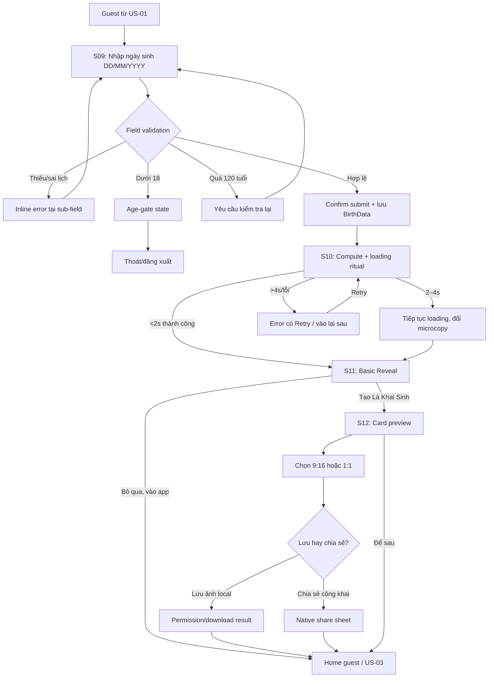

# US-02 — Khai ngày sinh và mở Lá Khai Sinh

## Cập nhật 07/10/2026 — thông tin bổ sung ngay từ đầu

Contract mới: [Giờ/nơi sinh tùy chọn + bề mặt hành tinh](../plans/2026-10-07-optional-birth-details-planet-surface.md). Ngày sinh vẫn là dữ liệu bắt buộc duy nhất. Ngay dưới ngày sinh có disclosure **Thêm giờ & nơi sinh**, mặc định đóng; bỏ qua không gửi supplement. Giờ chính xác dùng 2 select giờ/phút; consent bổ sung riêng, không tick sẵn. Save DOB → supplement nếu được cho phép → refetch profile/Note → Reveal. Nếu đã có chart chính xác, Reveal có nút **Đọc tổng quan về mình**; không nói “chưa dùng giờ/nơi sinh”. Retry không tạo lại DOB hoặc supplement đã thành công. Các yêu cầu bên dưới chỉ áp dụng cho nhánh date-only nếu mâu thuẫn với contract mới.

## 1. User story

Là người dùng mới ở chế độ khách, tôi muốn nhập ngày sinh và nhận ngay Lá Khai Sinh cơ bản, để có khoảnh khắc “app hiểu mình” trước khi phải đăng nhập hoặc khai giờ/nơi sinh.

## 2. Mục tiêu và ranh giới

### Mục tiêu

- Thu đúng **một dữ liệu bắt buộc:** ngày sinh.
- Xác nhận user đủ 18 tuổi cho hệ sinh thái Lá Lành.
- Tính đúng Sun sign/element theo Western Tropical trong <2 giây.
- Tạo reveal đủ cảm xúc nhưng dễ scan, không biến loading thành chờ giả kéo dài.
- Cho user chủ động tạo/lưu Lá Khai Sinh hoặc vào Home.
- Cho phép hoàn tất toàn bộ story bằng guest session, không chèn login wall.

### Trong phạm vi

Ngày sinh; age gate; validation calendar; submit/retry; compute; loading; Astro Profile Basic Reveal; tạo Birth Card snapshot; chọn 9:16/1:1; lưu ảnh/chia sẻ; skip card để vào Home.

### Ngoài phạm vi

- Tên/nickname: không hỏi trong onboarding. UI dùng “Bạn”; show-name chỉ hiện nếu profile đã có tên từ nơi khác.
- Thu thập giờ/nơi sinh tùy chọn từ cùng form phối hợp US-06; cách tính precision và đọc Moon/Rising/House thuộc US-06/07.
- Daily Note: US-03.
- Saved collection cho Daily Note: US-05.
- Chỉnh ngày sinh sau onboarding và xóa dữ liệu: profile/data-management story.

## 3. Actor, điều kiện và dữ liệu đầu ra

- **Actor:** guest đã hoàn tất consent ở US-01 nhưng chưa có `BirthData.birth_date` hợp lệ; account user chưa hoàn tất profile cũng dùng cùng flow.
- **Tiền điều kiện:** guest/account session và consent version hiện hành hợp lệ.
- **Thành công:** `BirthData.profile_level=1`, Basic `NatalChart`, content snapshot và `onboarding_status=basic_revealed`, gắn với `guest_id` hoặc `user_id` tương ứng.
- **Nếu tạo card:** có `LaKhaiSinhCard` snapshot và asset theo format user chọn.
- **Routing:** user mới sang Home/US-03; user quay lại flow dở dang tiếp tục đúng bước.

## 4. User flow đầy đủ

## 5. Đặc tả UI/UX theo màn hình

### S09 — Nhập ngày sinh

#### Cấu trúc màn hình

| Thành phần | Loại | Nội dung/hành vi |
|---|---|---|
| Back | Icon button | Về Consent/Welcome theo history; giữ guest session nếu đã tạo, không chuyển sang đăng nhập. |
| Progress | Progress bar | Thể hiện bước hiện tại trong onboarding tổng; có label cho screen reader. |
| Eyebrow | Text | “Mảnh ghép đầu tiên”. |
| Headline | H1 | “Bạn đến với thế giới vào ngày nào?” |
| Explanation | Body | “Chỉ ngày sinh thôi. Giờ và nơi sinh có thể để sau.” |
| Birth date | Composite field | Ba sub-field `DD / MM / YYYY`; chi tiết bên dưới. |
| Optional detail | Disclosure | “Thêm giờ & nơi sinh” · “Không bắt buộc · để hiểu mình rõ hơn”. Mở để nhập bằng picker và chọn địa danh; bỏ qua xóa draft bổ sung, không ảnh hưởng ngày sinh. |
| Privacy note | Inline info | “Ngày sinh không xuất hiện trên nội dung bạn chia sẻ.” |
| Submit | Primary button | “Đọc bầu trời của mình”; sticky bottom; loading sau submit. |

#### Field ngày sinh

Chọn **composite numeric field DD/MM/YYYY** thay cho native date picker làm UI chính để tránh cuộn quá xa về năm sinh và giữ trải nghiệm nhất quán. Có thể mở native calendar bằng icon phụ nếu accessibility/platform cần.

| Sub-field | Loại/input mode | Placeholder | Client validation khi gõ/blur | Server validation |
|---|---|---|---|---|
| Ngày `DD` | Text numeric, `inputMode=numeric`, max 2 ký tự | `DD` | Chỉ số; 1–31; auto-advance khi đủ 2 số; giữ `3` khi user chưa blur. | Kiểm tra ngày tồn tại cùng tháng/năm. |
| Tháng `MM` | Text numeric, max 2 | `MM` | Chỉ số; 1–12; auto-advance; cho nhập `8` và normalize `08` khi blur. | Kiểm tra 1–12. |
| Năm `YYYY` | Text numeric, đúng 4 | `YYYY` | Chỉ số; không submit khi <4; không tự thêm `19/20`. | Ngày nằm trong `[today−120 năm, today−18 năm]`, tính theo ngày địa phương đã chuẩn hóa. |
| Giá trị tổng | ISO date nội bộ | — | Chỉ tạo khi ba phần đủ và calendar-valid. | Parse strict `YYYY-MM-DD`; không dùng parser tự rollover như 31/02→03/03. |

#### Hành vi field

- Paste `14082001`, `14/08/2001` hoặc `14-08-2001`: parser phân tách nếu không mơ hồ và điền ba ô; nếu mơ hồ giữ text và yêu cầu nhập DD/MM/YYYY.
- Backspace ở đầu MM/YYYY đưa focus về ô trước.
- Khi submit: validate theo thứ tự thiếu → format → calendar date → age.
- Chỉ focus vào **lỗi đầu tiên**; mọi lỗi còn lại vẫn hiển thị.
- CTA disabled khi cả ba ô hoàn toàn rỗng; khi nhập dở CTA có thể enabled để tap và nhận validation rõ, tránh user không hiểu vì sao button chết.
- Error dùng icon + text + `aria-describedby`; không chỉ viền đỏ.

#### Validation/copy cụ thể

| Trường hợp | Field gắn lỗi | Copy |
|---|---|---|
| Thiếu ngày | DD | “Thêm ngày sinh nhé.” |
| Ngày ngoài 1–31 | DD | “Ngày cần nằm trong khoảng 1–31.” |
| Thiếu tháng | MM | “Thêm tháng sinh nhé.” |
| Tháng ngoài 1–12 | MM | “Tháng cần nằm trong khoảng 1–12.” |
| Năm chưa đủ 4 số | YYYY | “Năm sinh cần đủ 4 chữ số.” |
| Ngày không tồn tại | Nhóm field | “Tháng này không có ngày đó. Kiểm tra lại nhé.” |
| Ngày tương lai | Nhóm field | “Ngày sinh không thể ở tương lai.” |
| Chưa đủ 18 tuổi | Nhóm field | “Lá Lành hiện dành cho người từ 18 tuổi.” |
| Trên 120 tuổi | YYYY | “Năm sinh này có vẻ chưa đúng. Kiểm tra lại nhé.” |

### S10 — Compute/loading ritual

| Thành phần | Loại | Yêu cầu |
|---|---|---|
| Date echo | Eyebrow | Hiển thị `14.08.2001` để user phát hiện sai; có “Sửa” nếu compute chưa hoàn tất. |
| Visual | Animation/asset | Celestial/electric-note; không dùng spinner generic; hỗ trợ Reduce Motion bằng dissolve tĩnh. |
| Headline | H1 | “Đang đọc bầu trời lúc bạn sinh ra…” |
| Microcopy | Rotating status | “Đang tìm vị trí Mặt Trời” → “Đang viết note đầu tiên”; không mô tả bước kỹ thuật giả. |
| Progress | 3 semantic steps | Ngày sinh → Sun sign → Note đầu tiên; không hiển thị % giả. |

#### Timing

- Phản hồi loading xuất hiện trong ≤200ms sau submit.
- Nếu compute xong <1.2 giây, giữ transition tối thiểu 1.2 giây để tránh flash.
- Mục tiêu compute <2 giây; từ 2–4 giây đổi microcopy, không restart animation.
- Sau 4 giây hiển thị error/retry; không để loading vô hạn.
- App background/foreground: lấy trạng thái job thật, không chạy lại compute nếu request đã thành công.

### S10E — Compute error

- Headline: “Bầu trời vừa mất tín hiệu một nhịp.”
- Body: “Ngày sinh của bạn vẫn được giữ. Thử lại để mở Lá đầu tiên nhé.”
- Primary: “Thử lại”.
- Secondary: “Sửa ngày sinh”.
- Tertiary khi backend cho phép: “Để sau”; Home dùng safe placeholder và nhắc hoàn tất profile — không hiển thị profile giả.

### S11 — Astro Profile Basic Reveal

#### Hierarchy

1. Eyebrow: “Lá Khai Sinh · lớp đầu tiên”.
2. Hero compact: `Vibe · <3–5 chữ>` theo mapping Sun đã duyệt; đây là presentation metadata, không phải một placement mới.
3. Provenance disclosure: “Mặt Trời [Sun sign] · [element] · Western Tropical”; factual placement không bị xóa hoặc thay bằng Vibe.
4. Warm paper note: title 1 câu + body 80–120 từ.
5. Disclosure: “Đọc từ ngày sinh của bạn · chưa dùng giờ/nơi sinh”.
6. Primary CTA: “Tạo Lá Khai Sinh”.
7. Secondary: “Bỏ qua, vào app”.

#### UX rules

- Không auto-skip hoặc auto-scroll qua reveal.
- Nội dung chính nằm trong một viewport hoặc phần đầu đủ hoàn chỉnh; CTA không lớn hơn content card.
- Dùng animation reveal 600–900ms; Reduce Motion dùng fade ≤200ms.
- Không dùng “chính xác 100%”, “định mệnh”, chẩn đoán hoặc kết luận cố định.
- User quay lại từ S12 phải thấy cùng content snapshot, không generate câu khác.

### S12 — Lá Khai Sinh Card preview

| Field/control | Loại | Default | Validation/hành vi |
|---|---|---|---|
| Format | Segmented control | Story 9:16 | `story` hoặc `square`; đổi format rerender cùng content snapshot. |
| Card preview | Image preview | Ẩn tên và ngày sinh | Gồm 4 phần: Kiểu người, Điểm mạnh, Điểm dễ mệt, Lời nhắn; watermark nhỏ. |
| Hiện tên | Toggle | OFF | Chỉ hiển thị nếu profile có `display_name`; nếu chưa có tên thì ẩn toàn bộ row, không hỏi thêm trong onboarding. |
| Ngày sinh trên card | Không có control | Luôn OFF | MVP không cho hiển thị ngày sinh trên share artifact. |
| Lưu ảnh | Secondary button | — | Render/download hoặc xin photo permission đúng lúc; lỗi không làm mất preview. |
| Chia sẻ | Primary button | — | Render asset rồi mở native share sheet; cancel không tính shared. |
| Để sau | Text button/back | — | Vào Home; card snapshot vẫn truy cập được từ profile nếu đã tạo. |

#### Card content validation

- Mỗi section tối đa theo content schema để không overflow: title ≤24 ký tự; body ≤90 ký tự/section ở bản card.
- Không có tên thật, phone/email, ngày/giờ/nơi sinh mặc định.
- Export 9:16 và 1:1 phải giữ safe area của Instagram/Threads; không cắt watermark/text.
- Font fallback phải render đủ tiếng Việt; nếu asset font lỗi thì fail có retry, không export card vỡ dấu.

## 6. Business rules và data contract

| Rule | Quyết định implementation |
|---|---|
| Độ tuổi | Account dùng sản phẩm yêu cầu đủ 18; `maxBirthDate = today - 18 years`; tính theo calendar date, không lấy chênh lệch milliseconds/365. |
| Tuổi tối đa | Hỗ trợ tới 120 tuổi để bắt typo nhưng không thu hẹp vô lý. |
| Date storage | Lưu `birth_date` kiểu date-only `YYYY-MM-DD`, không gắn `00:00 UTC` để tránh lệch ngày. |
| Guest ownership | Lưu theo `guest_id` khi chưa đăng nhập; US-19 chuyển ownership atomically sang `user_id`. |
| Guest retention | Tuân TTL 30 ngày không hoạt động của US-01; card lưu local có thể mất khi gỡ app. |
| Sun sign | Western Tropical; tính từ engine/source versioned, không tin mapping chỉ ở client; luôn giữ trong provenance. |
| Persona compact | Level 1 bắt buộc `persona_mode=vibe` và render đúng `Vibe · <persona_label>`; label 3–5 chữ theo mapping versioned do server trả. Không được trả `Aura` khi chỉ có ngày sinh. |
| Time/place | Luôn null trong US-02; không tính Moon/Rising/Houses. |
| Profile level | Sau compute thành công là Level 1. |
| Content | 80–120 từ cho reveal; template `sun` đã review; lưu content snapshot/version. |
| Idempotency | Một user + cùng birth date + chart version trả cùng compute result; submit lặp không tạo chart/card trùng. |
| Update DOB | Nếu user quay Back trước reveal có thể sửa; sau onboarding, sửa qua data settings và trigger recompute có cảnh báo. |
| Name | `display_name` nullable hoặc system fallback “Bạn”; US-02 không thu name. |

## 7. Detailed requirement checklist

- **AC01 — Entry:** Given guest consent ở US-01 hoàn tất và chưa có birth date, when route onboarding, then mở S09 mà không yêu cầu phone/email/OTP; Back không làm mất guest session.
- **AC02 — Required data only:** S09 chỉ yêu cầu DD/MM/YYYY; không có giờ/nơi sinh và không dùng “Thêm sau” cho ngày sinh vì đây là dữ liệu bắt buộc để cá nhân hóa.
- **AC03 — Field validation:** DD/MM/YYYY chỉ nhận số, hỗ trợ paste hợp lệ, hiển thị lỗi đúng sub-field/group và giữ toàn bộ giá trị đã nhập.
- **AC04 — Calendar validity:** Server strict-parse date; từ chối 31/02, 31/04, 29/02 năm không nhuận, ngày tương lai và rollover date.
- **AC05 — Age gate:** Given user chưa đủ 18 tính tới ngày hiện tại, then không tạo NatalChart và hiển thị age-gate state; đúng sinh nhật 18 được tiếp tục.
- **AC06 — Range:** Ngày sinh sớm hơn today−120 năm bị từ chối với copy kiểm tra typo.
- **AC07 — Storage:** Birth date lưu dạng date-only, mã hóa at rest; analytics/log không chứa ngày sinh thô.
- **AC08 — Compute:** Given birth date hợp lệ, Sun sign/element được tính theo Western Tropical với source version trong <2 giây ở điều kiện bình thường.
- **AC09 — Data honesty:** Moon, Rising, Houses luôn null/chưa mở trong US-02; UI nói rõ reveal chỉ dựa trên ngày sinh.
- **AC10 — Loading:** Loading hiện ≤200ms, tối thiểu 1.2 giây, không vô hạn; >4 giây có Retry và sửa date mà không mất dữ liệu.
- **AC11 — Reveal content:** S11 có Sun sign, element và đoạn 80–120 từ đã review, không generic trùng hoàn toàn giữa mọi Sun sign, không kết luận tuyệt đối.
- **AC12 — Reveal control:** Reveal không auto-skip; user chủ động tạo card hoặc vào Home; cả hai route đều set onboarding basic complete.
- **AC13 — Snapshot:** Back/refresh/cross-device sau compute hiển thị cùng chart/content snapshot/version; không regenerate âm thầm.
- **AC14 — Card privacy:** Card mặc định không tên và tuyệt đối không có ngày sinh/identifier; show-name chỉ xuất hiện khi đã có display name và mặc định OFF.
- **AC15 — Card formats:** Card render đúng 9:16 và 1:1, không overflow/cắt chữ, giữ safe area và watermark.
- **AC16 — Save/share:** Save permission denied/render error có hướng xử lý và không mất preview; share cancel không ghi `shared=true`.
- **AC17 — Existing data:** Given user đã có Basic Chart nhưng onboarding dở dang, then bỏ qua compute trùng và route vào S11/S12 tương ứng.
- **AC18 — Accessibility:** Composite DOB có group label, thứ tự focus DD→MM→YYYY, error announce, touch target ≥44px, text scale 200% và Reduce Motion.
- **AC19 — Guest completion:** Guest có thể hoàn tất DOB→Compute→Reveal→Card→Home; save local và public share không kích hoạt hard auth prompt.
- **AC20 — Claim later:** Khi user đăng nhập ở US-19, BirthData/chart/content snapshot của guest được chuyển ownership mà không compute hoặc tạo card trùng.

## 8. Edge cases và solution

| Edge case | Rủi ro | Solution |
|---|---|---|
| 29/02 năm nhuận | Reject ngày hợp lệ | Dùng calendar library/strict server date; test 2000 hợp lệ, 1900 không, 2004 hợp lệ. |
| 31/04 hoặc 31/02 | Parser tự rollover | Không dùng JS Date parse trực tiếp từ input; strict validate components trước khi tạo ISO date. |
| User vừa tròn 18 hôm nay | Age tính sai timezone | So sánh calendar date theo timezone sản phẩm/user đã chuẩn hóa; không chia milliseconds cho 365. |
| Thiết bị đặt ngày/giờ sai | Age gate sai | Server là nguồn chuẩn cho `today`; client chỉ preview validation. |
| Paste `08/09/2001` mơ hồ | Hiểu MM/DD sai | Product cố định DD/MM/YYYY; label/placeholder luôn hiện; parser theo DD/MM, không đoán locale khác. |
| IME/Unicode digits | Input lỗi khó hiểu | Normalize chữ số Unicode phổ biến nếu platform hỗ trợ; nếu không, copy yêu cầu dùng 0–9. |
| User gõ `1/1/01` | Đoán nhầm thế kỷ | Yêu cầu YYYY đủ 4 số; không tự suy luận. |
| Boundary cung hoàng đạo | Mapping client/server lệch | Compute server từ engine/version chuẩn; bộ test mọi ngày chuyển cung; client không hardcode kết quả chuẩn. |
| Compute timeout | Loading vô hạn | Timeout UI 4 giây; job/request id; retry idempotent; giữ birth date. |
| Compute thành công nhưng content lỗi | Không có reveal | Dùng fallback template đã review đúng Sun sign; gắn cờ fallback và retry content nền. |
| App bị kill khi loading | Compute lặp | Persist request id/status; khi mở lại GET trạng thái và route S11 nếu done. |
| Guest token hết hạn trong lúc compute | Kết quả không có owner | Compute job giữ owner snapshot tới khi trả kết quả; nếu token hết hạn thật, không attach nhầm account và cho bắt đầu lại rõ ràng. |
| User xóa app sau reveal | Mất Lá đã tạo | Không chặn bằng login; tại Profile/Save hiển thị nhẹ “Đăng nhập để khôi phục khi đổi máy”, dẫn US-19 khi user chủ động. |
| User sửa DOB sau compute nhưng trước reveal | Snapshot cũ | Invalidate pending result, recompute với version mới; atomic set active chart. |
| Content dài làm vỡ layout | CTA bị đẩy quá sâu/card overflow | Enforce schema length, dynamic text sizing trong giới hạn, QA tiếng Việt và text scale; không cắt bằng ellipsis ở reveal. |
| Không có display name | Toggle “Hiện tên” vô nghĩa | Ẩn toggle, dùng “Bạn”; không thêm field tên vào onboarding. |
| Photo permission bị từ chối | Không lưu được card | Giải thích cách bật quyền; vẫn cho share/download file; không hỏi quyền trước khi tap Lưu. |
| Share sheet cancel | Analytics sai | Chỉ ghi started; completed chỉ khi platform callback hỗ trợ, nếu không dùng `unknown`, không giả success. |
| User Back từ reveal về DOB | Vô tình sửa/xóa chart | Hiện confirm nếu thay date: “Đổi ngày sinh sẽ tạo lại Lá này”; không xóa chart cũ tới khi compute mới thành công. |
| User dưới 18 cố đổi DOB nhiều lần | Bypass/suspicious | Server enforce; rate/risk signal nội bộ; copy không buộc upload giấy tờ trong MVP. |

## 9. Test matrix tối thiểu

### Date validation

- Hợp lệ: 01/01/2000, 29/02/2000, đúng ngày đủ 18, today−120 năm.
- Không hợp lệ: rỗng từng sub-field, 00/00/0000, 32/01, 31/04, 29/02/1900, future date, dưới 18 một ngày, trên 120 một ngày, năm 2 chữ số.
- Input behavior: auto-advance, backspace, paste slash/dash/8 digits, blur normalize `8→08`, screen reader.

### Compute/reveal

- Ít nhất một ngày giữa cung và mọi boundary của 12 Sun signs.
- Compute <1.2s, 1.2–2s, 2–4s, timeout, network failure, content fallback.
- App background/kill/restore ở loading và reveal.
- Existing Basic Chart không bị compute duplicate.

### Card

- 9:16/1:1; tiếng Việt dấu dài; text scale; font fallback; show-name có/không name.
- Save permission allowed/denied; render fail/retry; share complete/cancel.
- Kiểm tra không có birth date/phone/email/place trong bitmap metadata hoặc nội dung nhìn thấy.

## 10. Analytics

| Event | Thuộc tính được phép |
|---|---|
| `birth_entry_viewed` | source, onboarding_step |
| `birth_validation_failed` | reason enum; **không birth date** |
| `birth_date_submitted` | age_bucket rộng, request_id; **không ngày thô** |
| `age_gate_blocked` | age_bucket/rule_version |
| `basic_chart_compute_started/completed/failed` | duration bucket, engine_version, failure category |
| `basic_reveal_viewed` | sun_sign, content_version, fallback boolean |
| `birth_card_started` | source |
| `birth_card_format_selected` | story/square |
| `birth_card_saved/share_started/share_result` | format, channel/result khi platform cho phép |
| `onboarding_completed` | duration bucket, card_created boolean |

## 11. Definition of Done

- S09, S10, S10E, S11, S12 và mọi loading/error/permission/restore state được thiết kế và implement responsive.
- Composite DOB behavior và validation giống nhau về business rule giữa client/server; server date-only là nguồn chuẩn.
- Astro engine trả Sun sign/element, engine version và compute status; không tạo Moon/Rising/House khi thiếu dữ liệu.
- Content template/fallback đủ 12 Sun signs, 80–120 từ, đã qua content review và kiểm tra chống kết luận tuyệt đối.
- Card renderer pass 9:16/1:1, safe area, Unicode tiếng Việt, privacy mặc định và asset retry.
- Unit tests date/age/boundary; integration tests birth→compute→snapshot; UI tests happy/error/restore/save/share đều pass.
- Security/privacy review pass: encryption, access control, log/analytics redaction, asset metadata và retention.
- Accessibility QA pass: grouped inputs, focus/error announce, text scale 200%, contrast, touch target và Reduce Motion.
- Dashboard đo drop-off S09→S11→Home và compute P95/P99 hoạt động.
- Guest ownership/claim integration test pass; không có login wall trong toàn US-02.
- Không còn P0/P1; detailed checklist AC01–AC20 và canonical AC-GWT-01–09 pass trên staging.

## 12. Quyết định đã chốt cho implementation

- DOB UI chính là composite `DD/MM/YYYY`; lưu server dạng date-only ISO.
- Sản phẩm áp dụng age gate 18+; tuổi tối đa hợp lệ 120.
- US-02 chỉ tính Sun sign/element, tuyệt đối chưa tính Moon/Rising/House.

## 13. Entry, exit và ownership

| Mục | Hợp đồng |
|---|---|
| Entry | Owner session + consent `birth_profile_basic` hợp lệ từ US-01; chưa có DOB hoặc có compute dở dang. |
| Exit thành công | Active Level-1 snapshot, `persona_mode=vibe`, onboarding `basic_revealed`; user sang Home/US-03 hoặc card preview của chính US-02. |
| Exit chặn | Under-18, consent stale, session invalid hoặc DOB invalid; không tạo chart. |
| Story sở hữu | DOB, age gate, Sun-only compute, Vibe mapping, basic reveal và Lá Khai Sinh card ban đầu. |
| Không sở hữu | Daily Note/save collection (US-03/05), mood (US-04), birth time/place và Aura (US-06), deep interpretation (US-07), auth claim (US-19). |

## 14. Route/state matrix

| Route/surface | Preconditions | State | Transition |
|---|---|---|---|
| `/birth-date` | Session + consent hợp lệ | empty/editing/invalid/submitting | Valid → `/birth-compute`; blocked → age gate |
| `/birth-compute` | Strict DOB accepted | pending/slow/retryable/complete | Complete → `/birth-reveal`; retry same operation id |
| `/birth-reveal` | Level-1 snapshot active | `Vibe · label` + factual provenance | Home hoặc `/birth-card` |
| `/birth-card` | Reveal snapshot exists | preview/rendering/error/shared/saved | Home; Back giữ snapshot |
| Resume router | operation/snapshot exists | pending → poll; complete → reveal | Không compute/card trùng |
| Invalid owner/consent | Credential stale/mismatch | safe error | US-01/session recovery; không leak snapshot |

## 15. Complete fields/types/validation and API/data contract

| Field | Type | Required | Validation |
|---|---|---|---|
| `birth_date` | ISO date-only | Có | Strict calendar; server today; age 18–120 inclusive theo calendar. |
| `profile_level` | integer enum | Response | Luôn `1` trong US-02. |
| `sun_sign` | bounded enum | Response | 12 Western Tropical signs; engine-owned/versioned. |
| `sun_element` | enum | Response | `fire/earth/air/water`; factual provenance. |
| `persona_mode` | enum | Response | Bắt buộc `vibe`; reject `aura` ở Level 1. |
| `persona_label` | reviewed string | Response | 3–5 chữ; 12 mapping: Nóng, Bền, Lanh, Mềm, Rực, Gọn, Duyên, Sâu, Phiêu, Chắc, Khác, Mộng. |
| `persona_version` | string | Response | Version mapping; client render nguyên giá trị. |
| `chart_snapshot_id` | opaque id | Response | Thuộc credential hiện tại; không public. |
| `engine_version` | string | Response | Bắt buộc để provenance/reproducibility. |
| `compute_status` | enum | Response | `pending`, `complete`, `failed_retryable`, `failed_terminal`. |
| `content_snapshot` | object | Complete | Reveal 80–120 từ + version + safety status. |
| `card_format` | enum | Optional | `story_9_16` hoặc `square_1_1`; default story. |

Logical API semantics:

- `PUT /birth-profile/basic` nhận DOB + idempotency/operation key; owner từ credential; `202 pending` hoặc `200 complete`; `409 consent_stale`; `422 validation/age`.
- `GET /birth-profile/basic/status` resume operation/snapshot hiện tại, không nhận owner id tùy ý.
- `POST /birth-cards` tạo immutable card snapshot từ authorized chart/content snapshot + format; không nhận raw card copy từ client như nguồn chuẩn.
- Mọi response lỗi dùng stable `error_code`, safe message và `retryable`; không echo raw DOB vào logs/error telemetry.

## 16. Security, privacy và data integrity

- DOB mã hóa at rest; không đặt trong URL, cache analytics, card, public preview, log hoặc crash breadcrumb.
- Authorization kiểm tra snapshot thuộc credential; không IDOR qua `chart_snapshot_id`/card id.
- Server là authority cho age, boundary sign, mapping Vibe và engine version; client validation chỉ hỗ trợ UX.
- Card renderer sanitize text, strip metadata và không embed source JSON/identifiers.
- Level 1 tuyệt đối không claim Moon/Rising/House và không render `Aura`; placement Mặt Trời/element vẫn có trong provenance.
- Native app là release target/gate cho secure storage, share sheet, photo permission và accessibility; web/PWA chỉ reference/companion.

## 17. Acceptance Criteria — Given/When/Then

- **AC-GWT-01 — Minimal input:** Given consent/session hợp lệ, When vào US-02, Then form chỉ yêu cầu DD/MM/YYYY và không yêu cầu auth, tên, giờ hoặc nơi sinh.
- **AC-GWT-02 — Strict date:** Given DOB thiếu/sai lịch/tương lai/ngoài 18–120, When submit, Then lỗi gắn đúng field/group, giữ input và không tạo chart.
- **AC-GWT-03 — Boundary compute:** Given DOB hợp lệ kể cả leap/boundary, When compute, Then server trả Sun/element đúng engine version và cùng operation retry không tạo snapshot trùng.
- **AC-GWT-04 — Vibe contract:** Given Level-1 Sun-only snapshot, When render summary/reveal/Home handoff, Then label đúng `Vibe · <3–5 chữ>` từ server và `persona_mode` không thể là `aura`.
- **AC-GWT-05 — Provenance honesty:** Given Vibe được hiển thị, When user mở provenance, Then thấy factual Sun sign, element, Western Tropical, engine version và giới hạn chưa dùng giờ/nơi; không có Moon/Rising/House claim.
- **AC-GWT-06 — Recovery:** Given compute chậm/lỗi/app bị kill, When retry/resume, Then giữ DOB và operation; success dẫn cùng immutable reveal snapshot, failure không tạo profile giả.
- **AC-GWT-07 — Card privacy:** Given user tạo card 9:16/1:1, When preview/export/share, Then chữ không overflow, tên mặc định off và DOB/time/place/token/id không xuất hiện.
- **AC-GWT-08 — Guest exit:** Given reveal thành công, When user vào Home hoặc để card sau, Then onboarding hoàn tất và US-03 nhận active Level-1 snapshot không qua login wall.
- **AC-GWT-09 — Native behavior:** Given native permission/share/accessibility states, When save/share/scale/Reduce Motion, Then flow có result/retry đúng và web/PWA evidence không thay native gate.

## 18. Dependencies và implementation evidence

- **Upstream:** US-01 session/consent; astrology engine + version catalog; reviewed Vibe/content mapping.
- **Downstream:** US-03 đọc snapshot/persona; US-06 nâng depth; US-19 claim owner. US-02 không phụ thuộc các story này để complete.
- **Evidence placeholders:**
  - `[Pending] Contract`: strict DOB/age/boundary suite; Vibe 12-sign mapping; Level-1 no-Aura assertion.
  - `[Pending] Runtime`: idempotent submit/resume/failure/reveal/card integration evidence.
  - `[Pending] Privacy/Security`: authorization, DOB redaction, card metadata scan.
  - `[Pending] Visual/A11y`: Cosmic Glass S09–S12 light/dark, 320/390/430px, 200% text, Reduce Motion.
  - `[Pending] Native release gate`: secure storage/share/photo-permission/device build; web/PWA remains companion evidence only.

## 19. Cosmic Glass Signal screen contract

S09–S12 dùng direction **02 — Cosmic Glass Signal** trong light/dark: celestial atmosphere chỉ làm focal point, form/reveal/card có reading surface đủ đục, glass giới hạn ở control/disclosure/navigation. Chỉ dùng Be Vietnam Pro, tối đa năm type token; 44px targets, 4.5:1 normal text, 200% text, 320/390/430px, Reduce Motion/Transparency đều không mất nghĩa. Summary bắt buộc `Vibe · <3–5 chữ>`; Sun/element/engine vẫn ở provenance và tuyệt đối chưa có Aura.
- Loading tối thiểu 1.2 giây để có pacing; sau 4 giây chuyển error/retry.
- Không hỏi tên trong onboarding; card luôn ẩn ngày sinh, show-name chỉ có nếu hồ sơ đã có tên.
- Tạo card là tùy chọn; bỏ qua card vẫn hoàn thành onboarding và vào Home.
- Guest được dùng full US-02; đăng nhập chỉ là soft action “Giữ lại lâu dài” ở Profile/điểm lưu phù hợp, không xuất hiện thành modal sau Reveal.

## 20. Canonical delta — DOB và Lá đầu tiên (2026-09-14)

Phần này **thay thế S10 artificial loading, S11 CTA pair và Birth Card trong required onboarding path** ở mục 2, 4–5, 7, 9, 11, 14 và 17 khi có xung đột. Visual/hierarchy authority: [`../design-directions/signal-note-2026-09-14/README.md`](../design-directions/signal-note-2026-09-14/README.md).

### Exact flow và hierarchy

1. `TRẠM BẮT SÓNG · 01/02` chỉ mở sau current `birth_profile_basic` consent. Screen order: brand/progress → headline/date-only limitation → semantic `DD / MM / YYYY` group → quiet privacy line → primary `Khớp tín hiệu` → secondary Back.
2. Client và server strict-validate complete date, real calendar date, not future, age ≥18 và age ≤120. Server date là authority; không parser rollover và không đoán MM/DD hoặc năm hai chữ số.
3. Submit gửi ISO date-only qua private request body. DOB không vào URL, history, localStorage/Capacitor Preferences, logs, crash breadcrumbs, analytics hoặc public/share artifact.
4. Một create/compute request idempotent trả successful BirthSnapshot. Client đưa chính response đó vào query/in-memory cache trước khi route; không chèn delay tối thiểu 1,2 giây và không mở screen loading thứ hai.
5. Slow/error state ở `01/02` giữ DOB trong form memory, announce status và cho Retry/Sửa. Refresh, background/foreground hoặc process kill resume bằng `onboarding_status`/request state; không tạo profile trùng.
6. `LÁ ĐẦU TIÊN · 02/02` đọc snapshot đã cache: Vibe → Sun/element provenance → date-only limitation/cusp uncertainty → short interpretation → primary `Lá hôm nay đang mở` → adjacent disclaimer. Không fetch/recompute lại chỉ để reveal.
7. Cusp không đủ chắc chắn phải hiển thị uncertainty/retry-safe provenance, không đoán cung. `Vibe` không thay thế chart fact và không được diễn đạt như chẩn đoán hay định mệnh.
8. Primary reveal action hoàn tất onboarding và vào Home/US-03. Birth Card có thể còn là optional feature sau Home, nhưng không cạnh tranh với transition này và không thêm quyết định bắt buộc trước Home.

### AC bổ sung/thay thế

- **AC21 — Consent precondition:** Given chưa có current consent, When user/deep link cố mở hoặc submit `01/02`, Then route về `00/02` và không request/persist DOB.
- **AC22 — No fake wait:** Given birth create trả success ngay, When response tới, Then reveal được mở từ cached snapshot mà không artificial minimum delay.
- **AC23 — Single compute/fetch:** Given submit thành công rồi route/refresh, When `02/02` render, Then không tạo profile hoặc fetch snapshot lần hai nếu cached/resumable result còn hợp lệ.
- **AC24 — Validation:** Given invalid, under-18, future hoặc over-120 DOB, When submit, Then endpoint không được gọi cho client-invalid input, first error được focus/announce và values được giữ.
- **AC25 — Honest reveal:** Given date-only chart hoặc cusp uncertainty, When reveal hiển thị, Then provenance/limitation được nói rõ và hệ thống không invent Moon/Rising/House/transit hoặc exact cusp result.
- **AC26 — One Home transition:** Given Vibe đã mở, When user chọn `Lá hôm nay đang mở`, Then onboarding thành `home_ready` và Home mở; không có card/login wall/second calculation bắt buộc.
- **AC27 — Recovery:** Given network error, lost response, refresh, background hoặc process kill, When user retry/resume, Then idempotency/status returns the same successful profile and never duplicates it.

### DoD delta

- Component/E2E evidence proves consent-before-DOB, strict date/age bounds, no endpoint call for client-invalid input, one create, zero duplicate reveal fetch and safe retry/resume.
- Reveal copy exposes Vibe plus factual Sun provenance/date-only limitation; cusp and fallback states fail honestly.
- 320/390/430px, 200% text, keyboard/screen reader, target size, safe areas and Reduce Motion pass in the shared UI and both native shells.
- URL/history/log/analytics/cache/public payload inspection finds no raw DOB, time/place, token or private chart snapshot. Missing iOS/Android build/runtime evidence blocks release.
