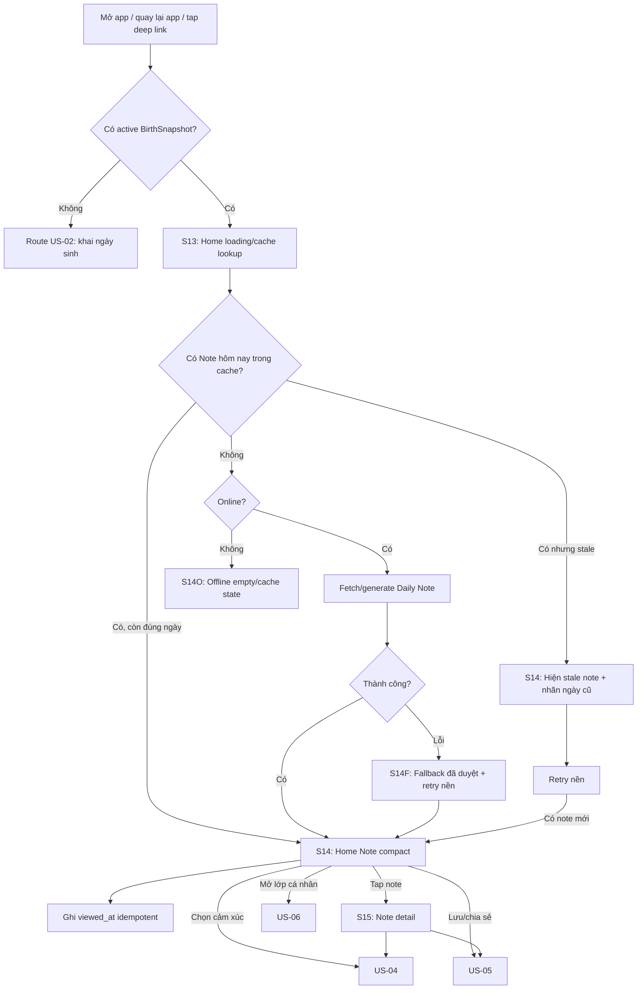

# US-03 — Đọc Note hôm nay

## 1. User story

Là người dùng đã mở Lá Khai Sinh cơ bản, tôi muốn vào app và thấy ngay một Note hôm nay có cảm giác như lời nhắc nhỏ không thể bỏ qua, để có lý do quay lại Lá Lành mỗi ngày mà chưa cần đăng nhập.

## 2. Mục tiêu và ranh giới

### Mục tiêu

- Biến Home thành màn daily value chính, không phải dashboard khô.
- Hiển thị Daily Note nhanh, scan được trong 3–5 giây đầu.
- Nội dung cá nhân hóa tối thiểu theo Sun sign và ngày hiện tại; nâng cấp theo Moon/Venus/Mars/House khi user đã bổ sung dữ liệu ở US-06/US-07.
- Minh bạch nguồn dữ liệu: note dựa trên snapshot birth chart và transit/content version, không khẳng định định mệnh hoặc chẩn đoán.
- Cho guest đọc được trọn Note/Home mà chưa gặp login wall.
- Làm nền cho US-04 Mood, US-05 Lưu/Chia sẻ, US-06 mở lớp cá nhân sâu hơn.

### USP mà US-03 phải chứng minh

**Mỗi ngày, Lá Lành biến lá số thật và bầu trời hiện tại thành một tình huống rất đời: vì sao nó dễ xảy ra với bạn, nó thường lộ ra ở đâu, và một thử nghiệm nhỏ để tự kiểm chứng.**

Sản phẩm không bán một câu “vũ trụ nhắn bạn”. Giá trị phải truy ngược được theo chuỗi `chart fact → tổ hợp diễn giải → biểu hiện đời thường → micro-action → căn cứ trong lá số`.

### Trong phạm vi

Home Daily Note; note compact; note expanded/detail; trạng thái đã đọc/chưa đọc; cache theo ngày; offline/stale cache; fallback content đã duyệt; refresh qua ngày mới; deep link/tap notification vào Note; source/provenance disclosure; skeleton/loading/error.

### Ngoài phạm vi

- Mood check-in và cá nhân hóa theo mood: US-04.
- Lưu/chia sẻ Note: US-05.
- Thu giờ/nơi sinh để mở Moon/Rising/House: US-06.
- Insight sâu theo Moon/Venus/Mars/House: US-07.
- Login/claim để sync dài hạn: US-19.
- Push notification setup: story notification riêng khi roadmap mở.

## 3. Actor, điều kiện và dữ liệu đầu ra

- **Actor:** guest hoặc account user đã hoàn tất US-02 và có `BirthSnapshot` basic hợp lệ.
- **Tiền điều kiện:** app có thể xác định active profile/snapshot; nếu chưa có snapshot thì route về US-02, không hiển thị note giả.
- **Thành công:** có `DailyNoteView` cho ngày hiện tại; note được render ở Home; `viewed_at` được ghi nhận idempotent.
- **Dữ liệu tạo/cập nhật:** `daily_note_id`, `profile_snapshot_id`, `note_date`, `content_version`, `transit_version`, `viewed_at`, `source_level`, `fallback_used`.
- **Routing:** sau US-03 user có thể ở lại Home, làm mood US-04, lưu/chia sẻ US-05, mở thêm lớp cá nhân US-06, hoặc vào tab khác.

## 4. User flow đầy đủ

## 5. Đặc tả UI/UX theo màn hình

### S13 — Home loading/cache lookup

| Thành phần | Loại | Nội dung/hành vi |
|---|---|---|
| App shell | Native-app frame/PWA shell | Không mở như web landing page; full-height mobile, safe area, bottom nav app. |
| Header | Brand + profile icon | Brand nhỏ, không chiếm hierarchy của Note. |
| Skeleton | Paper-note skeleton | Dùng shape giống note giấy, không spinner generic. |
| Loading copy | Text | “Đang tìm note hôm nay…”; tối đa 1 dòng. |
| Timeout | State | Sau 4 giây chuyển fallback/offline state; không loading vô hạn. |
| Reduce Motion | Accessibility | Không orbit animation; dùng fade/skeleton tĩnh. |

### S14 — Home Note compact

#### Hierarchy

1. Date label: hôm nay theo timezone sản phẩm/user.
2. Greeting: “Này bạn,” hoặc display name nếu đã có, không hỏi tên trong story này.
3. Persona pill: Sun-only dùng `Vibe · <3–5 chữ>`; NatalChart sâu dùng `Aura · <3–5 chữ>`; placement/transit thật chỉ nằm trong provenance/detail.
4. Paper note: headline/lời nhắc chính.
5. Body: 1–2 câu giải thích ngắn, không quá 110 ký tự/câu.
6. Next actions: mood (US-04), share/save (US-05), unlock deeper layer (US-06).

#### Field/content trên màn hình

| Thành phần | Loại | Validation/hành vi |
|---|---|---|
| `note_date` | System date label | Format tiếng Việt; nếu note stale phải hiện ngày cũ rõ ràng. |
| Greeting | Text | Không dùng tên thật nếu chưa có `display_name`; fallback “Này bạn,”. |
| Persona pill | Non-interactive pill + link provenance | Chỉ `Vibe · <3–5 chữ>` hoặc `Aura · <3–5 chữ>`; không dùng placement làm nhãn compact và không dùng “Vibe” cho mood. |
| Note title | H2 trong paper | 24–72 ký tự; là lời nhắc chính, không phải mô tả tính năng. |
| Note body | Body text | 80–220 ký tự; dễ scan; tránh thuật ngữ astrology nặng. |
| Detail affordance | Tap toàn note hoặc text link | Tap mở S15; vùng tap tối thiểu 44px. |
| Fallback label | Small badge | Chỉ hiện khi dùng fallback hoặc cache cũ; không làm user hoang mang. |

#### UX rules

- Note là nội dung đầu tiên user nhìn thấy sau header, không bị mood/feed/card che trước.
- CTA không lớn hơn note; actions nằm sau khi user đã đọc được lời nhắc.
- Chỉ dùng Be Vietnam Pro; tối đa năm type token bằng weight/size/spacing.
- Note phải có cảm giác “nhắc nhỏ nhưng khó bỏ qua”: ít chữ, tương phản rõ, paper card đủ breathing room.
- Không dùng copy kiểu “bạn chắc chắn sẽ…”; dùng “có thể”, “thử”, “hôm nay hợp với”.

### S14F — Fallback note

| Thành phần | Loại | Nội dung/hành vi |
|---|---|---|
| Badge | Small label | “Note tạm thời” hoặc “Bản an toàn”. |
| Note | Fallback content | Theo Sun sign/season đã duyệt, không random vô nghĩa. |
| Retry | Background job | Tự retry khi online; không bắt user bấm nếu Home vẫn có value. |
| Error detail | Optional | Chỉ hiện nếu user tap “Có gì lạ?”; không đẩy lỗi kỹ thuật lên Home. |

### S14O — Offline/stale cache state

| Case | UI |
|---|---|
| Có cache hôm nay | Hiển thị như bình thường, nhãn “Đã lưu trên máy”. |
| Có cache ngày cũ | Hiển thị cache với ngày cũ và dòng “Chưa cập nhật được note mới.” |
| Không có cache | Empty paper: “Note hôm nay chưa tải được”; CTA “Thử lại”; không route login. |

### S15 — Note detail

| Thành phần | Loại | Nội dung/hành vi |
|---|---|---|
| Back | Icon button/swipe | Về Home giữ scroll/state. |
| Title | H1/H2 | Cùng lời nhắc chính ở S14. |
| Full note | Text | 80–140 từ; chia đoạn ngắn; không tường chữ. |
| Vì sao note này | Disclosure accordion | Nêu Sun sign/placements/transit, chart depth, precision và content version bằng ngôn ngữ dễ hiểu. |
| Data source | Small text | “Dựa trên Lá Khai Sinh basic; chưa dùng giờ/nơi sinh.” |
| Mood entry | Inline module | Dẫn US-04, không bắt buộc. |
| Save/share | Actions | Dẫn US-05. |
| Content structure | Progressive disclosure | `Điều đáng chú ý → Cơ chế bên dưới → Nó thường lộ ra → Thử hôm nay → Căn cứ`. Không mở đầu bằng thuật ngữ chart. |
| Full update | Gift-style inline card | Nếu đã có giờ/nơi sinh và revision sâu hơn, nói rõ “Bản đủ lớp đã sẵn sàng”; user chủ động mở, không hot-swap lúc đang đọc. |

## 6. Business rules và data contract

| Rule | Quyết định implementation |
|---|---|
| Note identity | Một active profile có tối đa một primary Daily Note mỗi ngày theo `note_date`. |
| Date boundary | `note_date` tính theo timezone user/app; refresh khi qua ngày, không refresh mỗi lần mở app trong cùng ngày. |
| Guest access | Guest đọc được Daily Note trọn vẹn; login chỉ xuất hiện khi sync/giữ dài hạn/xã hội hóa. |
| Personalization level | Level 1 dùng Sun sign + ngày; Level 2/3 có thể thêm Moon/Venus/Mars/House nhưng phải versioned. |
| Content source | Content phải có `content_version`, `template_id`, `astrology_source_version`; không hardcode không truy vết. |
| Knowledge source | Mọi plan giữ `knowledge_version`; renderer chỉ ghép atom có version từ ma trận hành tinh × cung × nhà × góc × độ × transit. |
| Daily freshness | `editorial_seed` theo local date điều khiển lịch biên tập ít nhất 365 ngày: hero/lens/mode/action/reflection với full chart, hook/practice/mode/closing/reflection với date-only. Cùng ngày deterministic; 365 ngày liên tiếp không trùng toàn bộ prose. Date-only chỉ dùng dữ kiện Sun hợp lệ và nói rõ một lớp, không giả transit. |
| Full reading | Khi có giờ/nơi sinh chính xác, note ưu tiên một góc natal nổi bật, hai placement nền, nhà liên quan và tối đa một transit đủ salience. |
| Degree/orb | Độ chỉ là sắc thái đầu/giữa/cuối cung; orb điều chỉnh trọng số. Không suy diễn “độ định mệnh” hoặc Sabian symbol khi chưa có corpus riêng. |
| Similarity | Hai ngày liên tiếp không trùng quá 70% theo rule nội bộ, trừ fallback khẩn cấp có badge. |
| Caching | Cache local note đã xem; không cache raw birth date. |
| View tracking | `viewed_at` upsert idempotent; reload không tạo view trùng. |
| Fallback | Fallback content phải qua content/safety review và gắn `fallback_used=true`. |
| Safety | Không có chẩn đoán sức khỏe tinh thần, y tế, tài chính, định mệnh tuyệt đối hoặc thao túng cảm xúc. |

## 7. Validation và content constraints

| Trường/đầu vào | Validation |
|---|---|
| `profile_snapshot_id` | Bắt buộc; phải thuộc guest/account hiện tại; hết hạn thì route xử lý guest/session, không leak note. |
| `note_date` | ISO date-only; không lấy milliseconds local để quyết định server truth. |
| `sun_sign` | Lấy từ BirthSnapshot đã tính bởi engine; client không tự mapping. |
| `note_title` | 24–72 ký tự; không all-caps; không overflow ở 320px. |
| `note_body_compact` | 80–220 ký tự; tối đa 2 câu; đọc được trong một viewport mobile. |
| `note_body_full` | 80–140 từ; đoạn ≤45 từ; không thuật ngữ astrology chưa giải thích. |
| `persona_mode` / `persona_label` | `vibe` cho Sun-only, `aura` cho NatalChart sâu; label 3–5 chữ, server-owned và versioned. |
| Provenance | Giữ factual Sun/placements/transit, chart depth, precision và source version; không suy ngược từ persona label. |
| Analytics props | Không chứa birth date, guest token, raw prompt, free text mood hoặc PII. |

## 8. Detailed requirement checklist

- **AC01 — App entry:** Given user đã có Basic BirthSnapshot, when mở app, then Home hiển thị Daily Note là nội dung chính đầu tiên trong app shell, không phải landing web hoặc login wall.
- **AC02 — No auth wall:** Guest có thể đọc Note compact và Note detail mà không cần phone/email/OTP.
- **AC03 — Correct routing:** Given user chưa có BirthSnapshot, then route về US-02; không hiển thị note cá nhân hóa giả.
- **AC04 — Today note:** Trong cùng một ngày, mở app nhiều lần trả cùng primary Daily Note snapshot; qua ngày mới app refresh note mới. Golden suite phải chứng minh 365 ngày liên tiếp có 365 tổ hợp prose khác nhau cho full chart, date-only chắc chắn và date-only sát ranh cung.
- **AC05 — Provenance:** Note lưu/transmit kèm `content_version`, `source_level`, `transit_version` hoặc fallback marker.
- **AC06 — Scanability:** Note compact ở mobile 390px đọc được phần lời nhắc chính + body + mood entry mà không phải đoán CTA.
- **AC07 — Detail:** Tap note mở S15 với full note và disclosure “vì sao note này” bằng ngôn ngữ dễ hiểu.
- **AC08 — Offline cache:** Given offline và có cache hôm nay, then hiển thị cache; given cache cũ, then hiện nhãn ngày cũ; given không cache, then có empty/retry.
- **AC09 — Fallback:** Nếu generation/fetch lỗi, Home không trống; fallback đã duyệt hiển thị và được gắn `fallback_used=true`.
- **AC10 — Idempotent view:** Reload/back/foreground trong cùng ngày không tạo nhiều `DailyNoteView` chính.
- **AC11 — Content safety:** Note không dùng ngôn ngữ chẩn đoán, định mệnh tuyệt đối, thao túng hoặc lời khuyên high-stakes.
- **AC12 — Privacy:** Note/card/cache không chứa raw birth date, guest token, email/phone hoặc nơi sinh.
- **AC13 — Accessibility:** Note/detail đọc được bằng screen reader, focus order đúng, touch target ≥44px, text scale 200%, Reduce Motion được tôn trọng.
- **AC14 — Performance:** Home hiển thị cached/skeleton trong ≤500ms; note online tải mục tiêu <2s; timeout/fallback rõ sau 4s.
- **AC15 — Downstream:** Sau khi đọc Note, user có thể bắt đầu US-04/US-05/US-06 mà không mất Home state.
- **AC16 — Specificity:** Với full chart, nội dung chính phải dùng ít nhất hai placement và một quan hệ bậc cao hoặc hai factor độc lập; nếu có nhà đủ điều kiện thì biểu hiện gắn với arena của nhà.
- **AC17 — Freshness:** Cùng profile/config/ngày trả cùng plan và copy; đổi ngày tạo scope mới. Hai ngày liên tiếp đổi hook và ít nhất một micro-action hoặc hero focus.
- **AC18 — Anti-generic:** Content gate chặn “tín hiệu vũ trụ”, phán quyết tuyệt đối, dự báo sự kiện, thuật ngữ không có evidence và các section lặp ý.
- **AC19 — Traceability:** Mỗi claim chiêm tinh có `factor_ref`; revision truy ngược `rules_version`, `knowledge_version`, `renderer_version`, `content_version` và gate policy.
- **AC20 — Explicit upgrade:** Nếu revision full khả dụng trong khi note một lớp vẫn active, Home và Note detail đều có affordance mở bản đủ lớp; chỉ đổi sau tap có chủ ý.

## 9. Edge cases và solution

| Edge case | Rủi ro | Solution |
|---|---|---|
| User mở app lúc 23:59 rồi qua 00:00 | Note đổi đột ngột khi đang đọc | Không thay note đang mở; show banner nhẹ “Note mới đã tới” khi user quay Home/refresh. |
| Timezone thiết bị sai | Note date lệch | Server/app timezone policy là nguồn chuẩn; client chỉ preview. |
| Server có note mới nhưng local cache cũ | User đọc sai ngày | Revalidate nền; nếu mới hơn thì đổi sau khi user không đang ở detail hoặc hỏi “Cập nhật note mới”. |
| Không có mạng lần đầu sau US-02 | Home trống | Dùng fallback local theo Sun sign nếu snapshot đã có; badge rõ là note tạm. |
| Guest session hết hạn | Lộ note cũ hoặc crash | Local cache chỉ hiển thị nếu không chứa dữ liệu nhạy; mutation cần session mới; hướng dẫn bắt đầu lại/claim theo US-19. |
| Transit/content service lỗi | Mất daily habit | Fallback theo Sun sign + ngày mùa; retry nền; analytics failure category. |
| Content quá dài tiếng Việt | Paper note vỡ layout | Enforce schema length; visual QA 320/390/430px; không dùng ellipsis cho lời nhắc chính. |
| Hai note liên tiếp quá giống | Boring/giảm retention | Lịch mixed-radix đảm bảo khác cấp ý trong cửa sổ 365 ngày; không dùng synonym swap. Golden suite fail release nếu prose collision. |
| Chống lặp làm phát sinh kho lịch sử riêng tư | Tăng dữ liệu cần bảo vệ mà không tăng value | Tính semantic signature stateless từ local date + content version; không lưu raw prose, birth input hay lịch sử hành vi mới. |
| Đã nhập giờ/nơi nhưng vẫn thấy note cũ | User không nhận ra giá trị nâng cấp | Hiện gift card ở Home và Note detail, nêu lớp mới đã dùng; activation có pending/success/error và refresh projection. |
| Có đủ chart nhưng không có transit đủ mạnh | Renderer bịa “hôm nay” | Đọc natal evergreen bằng ngữ cảnh đời thường; không thêm nhịp trời giả. |
| Transit quá rộng | Nội dung nghe chung chung | Salience threshold loại transit yếu; orb rộng chỉ được làm nền, không làm hero. |
| Western/Jyotish bị trộn | Sai phương pháp | Plan validator fail closed; corpus và renderer version tách theo tradition trước khi mở generated Jyotish. |
| User Level 1 chưa có Moon | Copy hứa quá sâu | Source line nói “chưa dùng giờ/nơi sinh”; deep insight CTA dẫn US-06. |
| User bấm notification nhưng note chưa sẵn | Blank deep link | Mở Home skeleton/cache; khi note sẵn scroll/focus vào note. |
| App background trong lúc fetch | State race | Request abort/retry theo foreground; không ghi viewed_at nếu note chưa render. |
| Screen reader đọc decor | Rối trải nghiệm | Celestial/paper texture `aria-hidden`; note content có heading/region label rõ. |
| Fallback bị hiểu là cá nhân hóa thật | Mất niềm tin | Badge và provenance nói rõ fallback/cached; không lừa user. |

## 10. Test matrix tối thiểu

### Routing/cache/date

- Có BirthSnapshot → Home note.
- Không BirthSnapshot → US-02.
- Same day reload/back/foreground → cùng note id.
- Qua ngày mới → có note mới hoặc banner cập nhật.
- Offline có cache hôm nay/cache cũ/không cache.
- Guest expired khi đang ở Home/detail.

### Content/rendering

- 12 Sun signs Level 1.
- Level 2/3 có thêm source nhưng không phá layout.
- Coverage 12 nhà, toàn bộ body launch, sáu góc Western, degree bands, orb bands và ba transit phase.
- Golden test nhiều chart; cùng ngày stable, 365 ngày liên tiếp không trùng; không có phrase “tín hiệu vũ trụ”.
- Fallback content.
- Long Vietnamese diacritics, 320px, 390px, 430px, text scale 200%.
- Reduce Motion, screen reader labels, keyboard focus.

### Reliability/privacy

- Fetch timeout, 500, malformed response.
- Retry nền không tạo duplicate.
- Analytics không chứa DOB/token/free text.
- Local cache không chứa raw birth date.

## 11. Analytics

| Event | Thuộc tính được phép |
|---|---|
| `daily_note_home_viewed` | note_date, source_level, content_version, fallback_used |
| `daily_note_rendered` | duration_bucket, cache_state, fallback_used |
| `daily_note_opened` | source, note_date, content_version |
| `daily_note_stale_cache_shown` | stale_days_bucket |
| `daily_note_fetch_failed` | failure_category, retryable |
| `daily_note_refreshed` | trigger: app_open/midnight/pull_to_refresh |

Không ghi raw birth date, guest token, prompt nội bộ, free text hoặc thông tin nhận dạng cá nhân.

## 12. Definition of Done

- Home compact, Note detail, offline/cache/stale/fallback/error/loading/refresh states được thiết kế và implement theo app shell.
- Daily Note service/API có idempotent note per profile/day, content/transit version, fallback marker và viewed_at upsert.
- Content schema kiểm soát length, tone, safety, source disclosure và similarity giữa ngày.
- Knowledge matrix có version, coverage test và provenance; mọi factor được render đều thuộc plan allowlist.
- Guest đọc được US-03 đầy đủ mà không bị login wall; login chỉ là soft action ở các trigger đúng của US-19.
- Tests pass cho routing, cache, midnight refresh, offline, fallback, retry, Level 1/2/3, accessibility và privacy analytics.
- Visual QA pass cho mobile app view; font-role thống nhất với UI đã chốt.
- Monitoring có metric note availability, render latency, fallback rate, stale cache rate, S14→S15 open rate.
- Detailed checklist AC01–AC20 và canonical AC-GWT-01–08 pass trên staging; không còn P0/P1 về privacy, content safety hoặc Home blank.

## 13. Quyết định đã chốt cho implementation

- Home là màn daily value chính của app, không phải landing page.
- US-03 không yêu cầu đăng nhập; chỉ yêu cầu Basic BirthSnapshot từ US-02.
- Note compact phải scan nhanh, CTA nằm sau content.
- Level 1 dùng Sun sign/date; Moon/Venus/Mars/House chỉ xuất hiện khi dữ liệu đã mở ở US-06/US-07.
- Fallback được phép nhưng phải có marker/provenance và retry nền.
- Daily Note không chứa raw birth date hoặc identifier trong UI/cache/analytics.

## 14. Entry, exit và ownership

| Mục | Hợp đồng |
|---|---|
| Entry | Credential hợp lệ + active chart snapshot từ US-02/US-06; Home open, app foreground hoặc safe deep link. |
| Exit thành công | Note compact/full được render và view upsert; user có thể ở lại hoặc bàn giao action cho US-04/05/06. |
| Exit thiếu profile | Route US-02, không synthesize note cá nhân hóa giả. |
| Story sở hữu | Primary Daily Note, date/cache/fallback/provenance/detail/view state. |
| Không sở hữu | Mood mutation (US-04), save/share mutation (US-05), thu/recompute birth data (US-06). |

## 15. Route/state matrix

| Route/surface | Data state | UI state | Transition |
|---|---|---|---|
| `/home` | No snapshot | Redirect-safe | US-02 |
| `/home` | Cached today | Immediate compact note; refresh optional | Detail/action |
| `/home` | Online/no cache | Skeleton → fetched/fallback | Compact note |
| `/home` | Offline/today cache | “Đã lưu trên máy” | Detail local |
| `/home` | Offline/stale cache | Ngày cũ + stale disclosure | Retry on reconnect |
| `/home` | Offline/no cache | Empty + Retry | Stay; no login redirect |
| `/notes/:safeId` | Authorized note | Full body + provenance | Back preserves Home state |
| Deep link | Missing/unauthorized/expired | Safe not-found/recovery | Home or US-02; no existence leak |

## 16. Complete API/data contract

| Field | Type | Required | Validation/meaning |
|---|---|---|---|
| `daily_note_id` | opaque id | Server note | Authorized by credential; never enough alone to read. |
| `note_date` | ISO date-only | Có | Product timezone policy; one primary per owner/day. |
| `profile_snapshot_id` | opaque id | Có | Active/authorized chart snapshot. |
| `persona_mode` | enum | Có | `vibe` for Sun-only; `aura` only for valid deeper NatalChart. |
| `persona_label` | string | Có | 3–5 chữ, reviewed/server-owned. |
| `persona_version` | string | Có | Reproducible mapping version. |
| `note_title` | string 24–72 chars | Có | Safe, non-diagnostic. |
| `note_body_compact` | string 80–220 chars | Có | Max 2 sentences. |
| `note_body_full` | string 80–140 words | Có | Short paragraphs; safe content. |
| `provenance` | object | Có | Factual placements/transit, depth, precision, engine/content/template versions. |
| `fallback_used` | boolean | Có | True only for approved fallback. |
| `generated_at` / `viewed_at` | timestamp/null | Có | Server time; view upsert idempotent. |

- `GET /daily-notes/today` returns the note snapshot plus cache validators; uses safe `profile_required`/`snapshot_stale` errors.
- `GET /daily-notes/{id}` returns authorized full note/provenance; public share must use US-05 token route.
- `PUT /daily-notes/{id}/view` upserts view idempotently; foreground/back does not inflate a logical view.
- Fallback obeys the same schema, sets `fallback_used=true` and never invents unavailable transit provenance.

## 17. Security, privacy và content safety

- Enforce owner scope on note and snapshot; prevent IDOR and cache-key collision across guest/account.
- Cache only display-safe note/persona metadata, never raw DOB/time/place/token or full chart payload.
- Escape/sanitize content and provenance; exclude executable markup, unsafe links and prompt/debug metadata.
- Analytics records result/source level/fallback/persona enum only; no note body, raw placements or identifiers.
- Vibe/Aura are tentative presentation labels; factual provenance remains accessible and client cannot rewrite it.
- Native app is release target/gate for protected offline cache, deep links, lifecycle and accessibility; web/PWA is reference/companion.

## 18. Acceptance Criteria — Given/When/Then

- **AC-GWT-01 — Home value:** Given an authorized active snapshot, When app opens or foregrounds, Then Daily Note is the first primary Home content with no login wall.
- **AC-GWT-02 — Routing:** Given no valid snapshot, When Home loads, Then route to US-02 and never render a personalized fake note.
- **AC-GWT-03 — Stable identity:** Given repeated opens on the same `note_date`, When fetching/viewing, Then return one primary immutable note and one logical view upsert; after date boundary fetch a new day.
- **AC-GWT-04 — Persona vocabulary:** Given Sun-only/deeper snapshot, When compact/detail renders, Then show respectively `Vibe · label`/`Aura · label`; “Hôm nay bạn thấy sao?” belongs only to US-04.
- **AC-GWT-05 — Provenance:** Given persona/content shown, When opening “Vì sao note này”, Then factual placements, depth, precision and versions are available without deterministic/medical claims.
- **AC-GWT-06 — Offline/fallback:** Given today cache, stale cache or no cache while offline, When Home loads, Then show respectively today/stale/empty state; generation failure uses approved marked fallback and retry.
- **AC-GWT-07 — Content/a11y:** Given 320–430px, 200% text or assistive tech, When reading compact/full note, Then content reflows, controls remain usable and essential contrast meets AA.
- **AC-GWT-08 — Story handoff:** Given a rendered Note, When user taps mood/save/share/unlock, Then preserve note context and hand off only to US-04/05/06 without duplicating their mutations here.

## 19. Dependencies và implementation evidence

- **Upstream:** US-02/06 chart snapshot; content/transit/version services; timezone policy.
- **Downstream:** US-04 needs note/date context; US-05 needs immutable note snapshot; US-06 may refresh future notes after new chart activation.
- **Evidence placeholders:** `[Pending] API` daily identity/cache/fallback/authorization; `[Pending] Content` 12 Vibe + Aura/provenance/safety review; `[Pending] Offline` today/stale/empty/native lifecycle; `[Pending] Visual/A11y` Cosmic Glass light/dark/reflow; `[Pending] Native release gate` protected cache/deep-link/device proof, web/PWA companion only.

## 20. Cosmic Glass Signal screen contract

S13–S15 dùng direction **02 — Cosmic Glass Signal**: Note là opaque reading surface có hierarchy mạnh nhất; smoky-lilac glass dành cho persona pill, mood handoff, disclosure và navigation. Dark/mist-light dùng chung component order; chỉ dùng Be Vietnam Pro, 4.5:1 normal text, 44px targets, 200% text và 320/390/430px không overflow. Summary chỉ dùng `Vibe · <3–5 chữ>` hoặc `Aura · <3–5 chữ>` theo contract server; factual placements/depth/precision ở provenance.

## 21. Canonical delta — Personal Signal Daily Note (2026-09-14)

Phần này là authority mới cho Home và **thay thế hierarchy đặt Mood cạnh/trước Note, context-free-only API và CTA cũ** ở mục 2, 4–8, 10–12, 14–18 và 20 khi có xung đột. Visual/hierarchy authority: [`../design-directions/signal-note-2026-09-14/README.md`](../design-directions/signal-note-2026-09-14/README.md).

### Hierarchy bắt buộc tại Home

Ở 390×844, user phải scan trong 3–5 giây theo đúng thứ tự:

1. Date và greeting.
2. **Context Dial**: bốn lựa chọn scan nhanh `Để Lá chọn` (`auto`), `Công việc` (`work`), `Quan hệ` (`relationships`), `Giao tiếp` (`communication`); disclosure `Thêm 2 góc` mở `Năng lượng` (`energy`) và `Chăm mình` (`self_care`).
3. **Cream Note** là dominant surface: một thesis cụ thể, body ngắn, source line `Chart giữ nguyên · chỉ đổi góc đời thường`.
4. Collapsed **Vì sao hôm nay?**: chart evidence, precision, current-sky/fallback status và version provenance bằng ngôn ngữ dễ hiểu.
5. Một acid-lime **micro-action** có thể đảo ngược; không dùng action để ép quyết định quan hệ, sức khỏe, tài chính hoặc công việc hệ trọng.
6. **Resonance**: `Trúng`, `Chưa trúng`, `Đổi góc`.
7. Mood check-in của US-04 là secondary section bên dưới feedback; sau đó mới tới bottom navigation `Hôm nay / Khám phá / Đã lưu / Mình`.

Cream paper chỉ dành cho interpretation; glass dành cho context/disclosure/feedback/navigation; lime chỉ dành cho selected state và single primary action. Be Vietnam Pro là typeface duy nhất. Disclaimer luôn kề Note: `Một góc để tự soi, không phải chỉ dẫn cố định.`

### Context boundary

| Contract | Quy tắc canonical |
|---|---|
| Allowlist | Chỉ sáu enum `auto/work/relationships/communication/energy/self_care`; reject unknown và extra fields. |
| Transport | Private POST body; không query/path/URL/history/referrer/access-log key. Baseline `GET /daily-notes/today` vẫn context-free. |
| Client state | Selection mặc định chỉ ở component/query memory. Không implicit preference trong localStorage, IndexedDB, service worker, Capacitor Preferences hoặc analytics. |
| Server state | Có thể giữ lens trong owner-scoped, encrypted, versioned reading revision để reproducible output; private responses `no-store`. |
| Allowed effect | Chỉ đổi manifestation đời thường và micro-action. |
| Invariants | Chart snapshot, selected/hero factors, evidence refs, precision, confidence, source/knowledge/rules versions không đổi theo context. |
| Cache | In-memory key/scope phải chứa context/revision; không hiển thị stale cross-context result như mới. Persistent baseline-note cache không được biến thành context-preference store. |
| Public boundary | Context và contextual private prose không vào share/public DTO, logs, crash report hoặc analytics. |

`Đổi góc` không tự rotate hoặc tự học. Nó chỉ focus/open Context Dial, chờ explicit lens tap; cancel giữ nguyên Note. Automatic ranking/adaptation, profile inference và free-text context đều ngoài scope.

### Resonance consent, lifecycle và controls

- `Trúng`/`Chưa trúng` lần đầu mở just-in-time disclosure cho purpose/version `reading-resonance-v1`: thu gì, dùng để cải thiện cách diễn đạt/personalization, không phải vote về astrology, retention ≤30 ngày, không tracking, quyền reset/tắt/xóa.
- Chỉ explicit confirm mới ghi. Cancel/decline vẫn dùng trọn Note, không tạo feedback row và không dark pattern. Consent ledger phía server là authority; không dùng local consent flag làm proof.
- Payload allowlist chỉ gồm feedback enum `hit|miss`, current lens, note/revision identity và protocol metadata cần thiết. Không free text, raw DOB/chart, note prose, inferred trait hay analytics identifier.
- Write phải owner-bind, CSRF/trusted-Origin protected, enum/extra-field validated và idempotent theo note/revision. Record được mã hóa at rest và có `expires_at` không muộn hơn 30 ngày sau tạo.
- `Reset feedback`: xóa toàn bộ resonance rows của owner nhưng giữ `reading-resonance-v1` consent để lần tap sau không cần xin lại nếu version còn current.
- `Tắt phản hồi`: xóa resonance rows và revoke `reading-resonance-v1`; lần `hit/miss` sau phải xin consent mới. Whole-guest delete cascade feedback, consent và mọi owner-scoped data; client chỉ báo thành công sau server success rồi clear in-memory/device caches.
- Feedback chưa được dùng cho adaptive ranking, diagnosis, personality inference, advertising hoặc third-party model training trong release này.

### AC bổ sung/thay thế

- **AC21 — First viewport:** Given 390×844, When Home render, Then date/greeting → Context Dial → dominant cream Note là scan order; Mood không cạnh tranh với ba phần này.
- **AC22 — Context effect:** Given cùng owner/note/revision và hai lens hợp lệ, When projection đổi lens, Then manifestation/action đổi rõ nhưng chart facts, factors, evidence, precision và confidence giữ nguyên.
- **AC23 — Context transport/storage:** Given user chọn lens, When request/cache/public surfaces được inspect, Then lens chỉ đi trong private POST/in-memory scope hoặc encrypted revision; không URL, preference persistence, analytics hay share payload.
- **AC24 — Honest offline:** Given offline/cache stale/mismatched lens, When Home render, Then app nói rõ cached/stale/context availability và không claim freshly contextualized content.
- **AC25 — JIT feedback consent:** Given chưa có current `reading-resonance-v1`, When tap hit/miss, Then disclosure mở; cancel ghi zero rows, confirm gửi only allowlisted enum/lens/note/revision fields.
- **AC26 — Change angle:** Given Note đang hiển thị, When tap `Đổi góc`, Then không feedback write, Context Dial nhận focus; cancel giữ Note, explicit new lens mới đổi framing.
- **AC27 — Feedback security:** Given cross-owner ID, missing CSRF/origin, unknown enum, extra field hoặc replay, When mutation chạy, Then request bị reject/non-enumerating hoặc replay idempotent và không leak owner state.
- **AC28 — Feedback lifecycle:** Given feedback tồn tại, When TTL, Reset, Tắt phản hồi hoặc guest delete xảy ra, Then respectively expire, delete-keep-consent, delete+revoke, hoặc cascade all; UI phản ánh server result.
- **AC29 — Functional hierarchy:** Given Home/Note/Mình, When dùng disclosure, action, feedback, Mood, save/share và bốn nav destinations, Then mọi visible control tới working surface với loading/error/offline/focus/live-region states.
- **AC30 — App-first a11y:** Given iOS/Android, 320/390/430px, 200% text, keyboard/screen reader hoặc Reduce Motion, When dùng Home, Then content reflow, target ≥44px, visible focus, safe-area nav và no-clipping pass.

### DoD delta và release gates

- RTL/E2E proves hierarchy, six-lens payloads, unchanged evidence invariants, JIT consent cancel/accept, enum-only feedback, change-angle no-write, reset, revoke/delete and guest cascade.
- Network/URL/history/log/analytics/cache/share inspection finds no DOB, token, context, feedback history or private prose; owner, CSRF/trusted Origin, `no-store`, encryption and 30-day purge evidence pass.
- Representative users can explain why the Note is relevant and distinguish chart evidence from context-dependent framing; failure returns copy/hierarchy to iteration.
- Production build, privacy/no-mock guards and contracts pass; final assets are synced to Capacitor and the full flow is smoke-tested on iOS Simulator and Android. Web-only success or an unavailable native toolchain is a release No-Go.
- iOS Privacy Manifest/App Privacy and Android Data Safety match actual runtime collection. Resonance is classified as linked product interaction for app functionality/personalization, not tracking, subject to final store/legal review.

## 22. Canonical delta — Aura Cutover + Một việc nhỏ để thử (2026-09-16)

Phần này thay CTA `Mình thử việc này` và cách hiển thị available Aura update khi có xung đột với các mục trước.

- Active/available depth tiếp tục lấy từ reading revision; API chỉ bổ sung profile readiness, transition identity/acknowledgement và receipt allowlist sinh từ accepted evidence.
- Aura không tự thay Note hôm nay. Fullscreen cutover cho phép `Dùng Aura hôm nay` hoặc `Giữ Note hiện tại`; lựa chọn giữ được acknowledge bền vững, còn Home/Note Detail vẫn có lối mở Aura sau đó.
- Aura active trả experiment có cấu trúc server-owned: hành vi reversible, dấu hiệu cần quan sát và quyền dừng. Client không parse hoặc gửi lại prose tùy ý.
- `Giữ để thử hôm nay` tạo một experiment `chosen` owner-scoped gắn note/revision/lens/action key. Home và Note Detail dùng cùng server state; `Bỏ giữ` xóa ngay và không tạo streak/guilt copy.
- Mỗi guest chỉ có một experiment chưa đóng. Giữ action khác cần xác nhận và CAS theo experiment ID/version; conflict phải refetch trước khi hỏi lại.
- Người dùng tự mở card đang giữ để nhìn lại; app không tự bật outcome prompt. Outcome `not_tried/helpful/no_difference/not_for_now` đóng experiment, tách hoàn toàn khỏi Resonance.
- Payload không chứa user/client-authored text; mutation bắt buộc owner + trusted Origin + CSRF, private no-store, encrypted bounded payload và purge vật lý ≤30 ngày.
- Thu hồi time/place, xóa revision hoặc guest phải xóa experiment phụ thuộc và clear client query/cache.

### AC bổ sung

- **AC31 — Aura split state:** Profile có thể Aura-ready trong khi active Note vẫn Vibe; UI không đồng nhất hai trạng thái.
- **AC32 — Honest receipt:** Receipt chỉ hiển thị unlock layer có accepted evidence; không suy từ marketing copy hoặc profile level.
- **AC33 — Persistent intent:** Choose/undo/replace/outcome giữ parity giữa Home và Note Detail qua reload/focus/reconnect; stale mutation không ghi đè resource mới.
- **AC34 — No-pressure reflection:** Outcome chỉ xuất hiện khi user chủ động mở card đang giữ; không cạnh tranh với Resonance và không tạo completion pressure.
- **AC35 — Experiment privacy:** No user-authored text, URL/log/analytics/share leakage, cross-owner access, missing CSRF/origin hoặc stale ID/version write; TTL/withdrawal/guest delete xóa vật lý đúng policy.

## 23. Canonical delta — Note-first Context Sheet (2026-09-18)

Phần này thay hierarchy `Context Dial trước Note`, grid bốn lựa chọn và disclosure `Thêm 2 góc` trong mục 21. Data/privacy contract sáu enum vẫn giữ nguyên.

### Hierarchy mới tại Home

1. Date, greeting và lớp đọc hiện tại.
2. Dominant cream Note cùng evidence/disclaimer/action.
3. Compact control `Góc đang đọc · Lá chọn|Công việc|Quan hệ|Giao tiếp|Năng lượng|Chăm mình`.
4. Resonance `Trúng / Chưa trúng / Đổi góc`.
5. Các section phụ như Mood, save/share và navigation.

Tap compact control hoặc `Đổi góc` mở cùng một scoped sheet. Sheet hỏi `Bạn muốn Note giúp nhìn rõ điều gì?` và mô tả tác dụng của từng lens trong đời thường. Cancel giữ nguyên note/revision/context và không gửi request. Chọn lens đang active chỉ đóng sheet; chọn lens khác mới gọi contextual projection. Request lỗi giữ sheet cùng Note cũ để retry.

### AC bổ sung/thay thế

- **AC36 — Note-first:** Given Home có Daily Note, When render tại 390×844, Then Note đứng trước Context control trong scan order và không có context grid ở first viewport.
- **AC37 — Outcome-based lens:** Given context sheet mở, When user scan options, Then mỗi lựa chọn nói rõ Note sẽ giúp nhìn việc gì; không hỏi user category mơ hồ hoặc thu free text.
- **AC38 — One sheet, two entries:** Given compact control hoặc `Đổi góc`, When tap, Then cùng accessible sheet mở; Escape/close trả focus về trigger và không đổi Note.
- **AC39 — Honest mutation:** Given lens mới được chọn, When request pending/error/success, Then lần lượt khóa dismiss, giữ Note cũ + cho retry, hoặc đóng sheet + cập nhật chip/content; evidence invariants của AC22 vẫn giữ.
