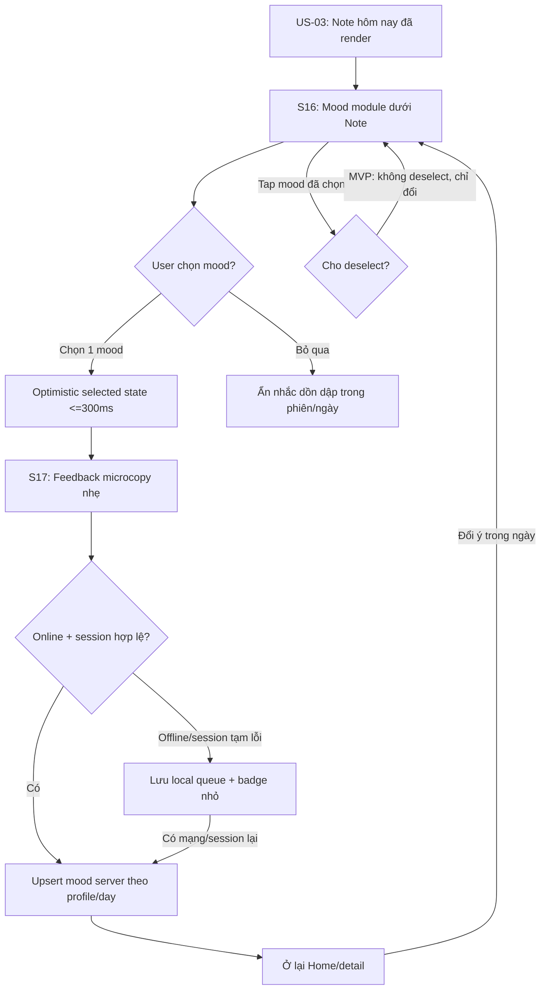

# US-04 — Mood check-in

## 1. User story

Là người vừa đọc Note hôm nay, tôi muốn ghi nhanh cảm xúc hiện tại bằng một chạm, để Lá Lành hiểu tông cảm xúc của tôi trong ngày mà không bắt tôi viết nhật ký hoặc bị đánh giá.

## 2. Mục tiêu và ranh giới

### Mục tiêu

- Tạo hành động tương tác nhẹ sau Daily Note, tăng cảm giác app đang lắng nghe.
- Ghi một mood enum trong ngày, có thể đổi lại, không tạo trùng.
- Phản hồi tức thì, ấm, không phán xét và không chẩn đoán sức khỏe tinh thần.
- Hoạt động ở guest mode; không yêu cầu login.
- Dùng mood để điều chỉnh tone content/future recommendations, không dùng làm medical/mental-health inference.

### Trong phạm vi

Mood module trên Home; chọn một mood; đổi mood trong ngày; skip/dismiss; local optimistic state; offline queue; sync idempotent; feedback microcopy; accessibility state; analytics enum an toàn.

### Ngoài phạm vi

- Text journal/free-form reflection.
- Mood history chart dài hạn.
- Mental-health screening, diagnosis, crisis flow.
- Daily Note generation chính: US-03.
- Lưu/chia sẻ note: US-05.
- Matching compatibility hoặc ranking: các story Vòng Lá, chỉ được dùng mood nếu có consent/rule riêng.

## 3. Actor, điều kiện và dữ liệu đầu ra

- **Actor:** guest/account user đang ở Home hoặc Note detail sau khi US-03 đã render Daily Note.
- **Tiền điều kiện:** có `daily_note_id`/`note_date` của ngày hiện tại; nếu Home đang fallback/offline vẫn có thể chọn mood local.
- **Thành công:** `DailyMoodCheckIn` được upsert cho `profile/day`; UI phản hồi selected state trong ≤300ms.
- **Dữ liệu tạo/cập nhật:** `mood_value`, `note_date`, `daily_note_id`, `source_screen`, `selected_at`, `updated_at`, `sync_status`.
- **Routing:** ở lại Home/detail; không chuyển màn sau khi chọn mood.

## 4. Mood taxonomy

Danh sách MVP giữ 5 mood như UI hiện tại, nhưng cần chuẩn hóa enum/copy để không nghe như diagnosis.

| Label UI | Enum | Ý nghĩa sản phẩm | Feedback microcopy |
|---|---|---|---|
| Rực | `radiant` | Năng lượng cao, muốn làm/lan tỏa | “Ghi nhận. Hôm nay Lá sẽ nói với bạn bằng nhịp sáng hơn.” |
| Chill | `chill` | Ổn, nhẹ, muốn chậm lại | “Đã ghi nhận. Lá sẽ giữ tông mềm hơn một chút.” |
| Đuối | `drained` | Ít năng lượng, cần tiết chế | “Đã nghe. Hôm nay không cần gồng để chứng minh gì cả.” |
| Căng | `tense` | Bị kéo căng, dễ phản ứng | “Đã ghi nhận. Lá sẽ ưu tiên lời nhắc chậm và rõ.” |
| Lạc trôi | `floating` | Mơ hồ, phân tán, chưa gọi tên được | “Đã lưu. Có khi chưa rõ cũng là một tín hiệu.” |

## 5. User flow đầy đủ

## 6. Đặc tả UI/UX theo màn hình

### S16 — Mood module trên Home

| Thành phần | Loại | Nội dung/hành vi |
|---|---|---|
| Section title | H2 nhỏ | “Hôm nay bạn thấy sao?”; nằm dưới Daily Note, không chen trước note. |
| Hint | Optional microcopy | Chỉ hiện lần đầu: “Chọn nhanh một cảm giác, không cần giải thích.” |
| Mood options | Single-select chips | 5 chip cố định; icon/symbol + label; touch target ≥44px. |
| Selected state | Visual + `aria-pressed` | Không chỉ dựa vào màu; có fill/outline/icon state. |
| Skip | Không cần nút lớn | User có thể không chọn và tiếp tục flow; không hiện modal nhắc. |
| Sync badge | Small text | Chỉ khi offline: “Sẽ lưu khi có mạng”. |

#### UX rules

- Mood là input nhẹ, không phải bài test tính cách.
- Chọn mood không điều hướng, không mở paywall, không hỏi login.
- Không hỏi “tại sao” trong MVP.
- Không dùng copy “bạn đang stress/trầm cảm/lo âu”; label chỉ là cảm xúc do user tự chọn.
- Nếu user chọn nhầm, tap mood khác để đổi ngay.

### S17 — Feedback sau khi chọn

| Thành phần | Loại | Nội dung/hành vi |
|---|---|---|
| Feedback | Inline toast/text | Xuất hiện trong module hoặc dưới chip; biến mất nhẹ sau 3–5 giây nhưng selected state vẫn còn. |
| Tone | Warm, non-judgmental | Không khen/chê mood; không đưa lời khuyên y tế. |
| Timing | Client-side | Hiện trong ≤300ms, không chờ network. |
| Retry | Background | Nếu sync fail, giữ local state và retry; không phá cảm giác đã được nghe. |

### S18 — Offline/pending state

| Case | UI/solution |
|---|---|
| Offline lúc chọn | Chọn vẫn sáng; badge “Sẽ lưu khi có mạng”. |
| Sync fail retryable | Giữ selected; retry exponential/backoff; không spam toast lỗi. |
| Session hết hạn | Giữ mood local trong ngày; mutation cần guest/account mới trước khi sync; không mất UI state. |
| Server reject enum/version | Revert về state gần nhất đã lưu; hiện “Mood này chưa lưu được, thử lại nhé.” |

### S19 — Đổi mood trong ngày

- User tap mood khác → selected state đổi ngay.
- Server upsert cùng `profile_id + note_date`, không tạo record mới.
- Analytics ghi `mood_changed` với from/to enum nếu privacy policy cho phép; không ghi lý do.
- Nếu có pending mood cũ, thay bằng mood mới nhất trong local queue.

## 7. Field, validation và data contract

| Field | Loại | Required | Validation |
|---|---|---|---|
| `profile_id`/owner | Server-derived | Có | Thuộc guest/account hiện tại; client không gửi owner tùy ý. |
| `daily_note_id` | UUID/string | Có nếu online note có id | Phải thuộc `note_date` hiện tại; fallback offline có thể sync sau với note id resolved. |
| `note_date` | Date-only | Có | Ngày hiện tại theo timezone policy; không lấy DOB. |
| `mood_value` | Enum | Có khi submit | Một trong `radiant/chill/drained/tense/floating`; reject enum khác. |
| `source_screen` | Enum | Có | `home` hoặc `note_detail`; dùng analytics/UX, không security. |
| `selected_at` | Timestamp | Có | Client timestamp để UX; server ghi `received_at`/`updated_at` là nguồn chuẩn. |
| `sync_status` | Client state | Không gửi như truth | `synced/pending/failed`; chỉ điều khiển UI. |

### Validation rules

| Rule | Solution |
|---|---|
| Single mood per day | Unique key `owner + note_date`; upsert, không insert trùng. |
| Latest intent wins | Nếu user đổi nhanh nhiều lần, queue chỉ giữ lựa chọn mới nhất. |
| No free text | Không có input text trong MVP; tránh thu dữ liệu nhạy cảm ngoài dự kiến. |
| No diagnosis | Mood enum không map sang mental-health label hoặc risk score. |
| Guest allowed | Guest token/CSRF đủ để ghi mood; login không bắt buộc. |
| Offline safe | Local queue không chứa DOB/token; chỉ mood enum, date và local note reference. |

## 8. Detailed requirement checklist

- **AC01 — Placement:** Mood module xuất hiện sau Daily Note compact/detail, không che nội dung chính của US-03.
- **AC02 — Single select:** User chọn tối đa một mood trong danh sách cố định; selected state rõ bằng màu + shape/icon/`aria-pressed`.
- **AC03 — Immediate feedback:** Khi chọn mood, UI phản hồi trong ≤300ms mà không chờ server.
- **AC04 — No navigation:** Chọn mood không chuyển màn, không mở login, không mở modal.
- **AC05 — Upsert:** Chọn mood lần đầu tạo record; đổi mood trong cùng ngày update record cũ, không tạo trùng.
- **AC06 — Skip:** User có thể không chọn mood và vẫn dùng tiếp Home, save/share/unlock; app không nhắc dồn dập trong cùng phiên.
- **AC07 — Offline:** Offline selection được giữ local và sync idempotent khi có mạng; UI nói rõ pending nếu cần.
- **AC08 — Session expiry:** Guest session hết hạn không crash; mood local vẫn hiển thị trong ngày nhưng sync cần session hợp lệ mới.
- **AC09 — Privacy:** Analytics chỉ ghi mood enum/date bucket/source, không ghi DOB, token, note full text hoặc free text.
- **AC10 — Safety:** Copy và backend không suy luận/chẩn đoán sức khỏe tinh thần từ mood.
- **AC11 — Rapid taps:** Tap nhanh nhiều mood chỉ lưu mood cuối cùng; UI không flicker hoặc tạo nhiều toast chồng.
- **AC12 — Date change:** Qua ngày mới, mood reset về chưa chọn; mood hôm qua vẫn thuộc record hôm qua.
- **AC13 — Accessibility:** Mood chips dùng được bằng keyboard/screen reader; touch target ≥44px; text scale 200%; state không chỉ dựa vào màu.
- **AC14 — Personalization boundary:** Mood có thể ảnh hưởng tone future content, nhưng không thay đổi Note đã snapshot trong US-03 trừ khi user chủ động refresh theo rule.

## 9. Edge cases và solution

| Edge case | Rủi ro | Solution |
|---|---|---|
| User tap 3 mood liên tiếp | Multiple writes/race | Debounce/batch client; server upsert; latest intent wins. |
| Network chập chờn | UI báo lỗi làm mất cảm giác nhẹ | Optimistic state giữ nguyên; badge pending nhỏ; retry nền. |
| App bị kill khi pending | Mất mood | Persist local queue theo ngày; sync khi app mở lại. |
| User đổi ngày hệ thống | Mood reset sai | Server note_date/timezone policy là nguồn chuẩn; client chỉ hiển thị tạm. |
| Qua 00:00 lúc đang Home | Mood hôm qua lẫn hôm nay | Không tự xóa khi user đang tương tác; khi refresh note mới thì mood module reset. |
| Session hết hạn | Sync 401 | Giữ local mood; route nhẹ sang guest/session renewal khi user làm mutation tiếp; không login wall. |
| Server reject enum do app version cũ/mới | Bad data | Version mood taxonomy; fallback copy “Mood này chưa lưu được”; request app update nếu cần. |
| User không muốn bị theo dõi mood | Trust loss | Mood optional; giải thích ở privacy center; có delete data ở Profile. |
| Mood “Đuối/Căng” bị hiểu là medical signal | Safety risk | Copy dùng “vibe”, không diagnosis; analytics enum không dùng risk scoring. |
| Screen reader chỉ nghe icon | Accessibility fail | Chip có accessible name label; icon `aria-hidden`. |
| Haptic/toast quá nhiều | Rối | Haptic nhẹ một lần/chọn; toast replace, không stack. |
| Offline local storage clear | Mất pending mood | Chấp nhận mất pending; không cố fingerprint/khôi phục; nếu cần sync dài hạn dẫn US-19. |

## 10. Test matrix tối thiểu

### Interaction

- Render mood module sau note.
- Chọn từng mood trong 5 enum.
- Đổi mood trong ngày.
- Rapid taps 5 mood liên tiếp → mood cuối cùng.
- Skip mood và tiếp tục save/share/unlock.
- Qua ngày mới mood reset.

### Sync/offline

- Online upsert success.
- Offline choose → pending badge → online sync.
- Sync 500 retry.
- Sync 401/session expired.
- App kill/reopen pending queue.
- Server enum reject.

### Accessibility/privacy/safety

- Keyboard navigation/Enter/Space.
- Screen reader names and `aria-pressed`.
- Text scale 200%, 320px width.
- Analytics payload không chứa DOB/token/free text.
- Copy không chứa diagnosis/high-stakes advice.

## 11. Analytics

| Event | Thuộc tính được phép |
|---|---|
| `mood_module_viewed` | note_date, source_screen, has_existing_mood |
| `mood_selected` | mood_value, source_screen, sync_mode: online/offline |
| `mood_changed` | from_mood, to_mood, source_screen |
| `mood_sync_completed` | duration_bucket, retry_count |
| `mood_sync_failed` | failure_category, retryable |
| `mood_skipped_in_session` | source_screen |

Không ghi raw birth date, guest token, note full text, free text, precise timestamp nếu không cần, hoặc bất kỳ thông tin nhận dạng cá nhân nào.

## 12. Definition of Done

- Mood module, selected/changed/skipped/offline/pending/error states được implement trên Home và Note detail nếu detail có mood entry.
- Data model/API upsert mood theo owner + note_date, idempotent và latest-intent-wins.
- Guest mode ghi mood được mà không login; session expiry có solution không mất local intent.
- Copy cho 5 mood và feedback đã qua content/safety review.
- Analytics enum-only và privacy guard pass.
- Tests pass cho interaction, rapid taps, offline queue, upsert, day rollover, accessibility và analytics redaction.
- Mood không được dùng cho diagnosis/risk scoring; personalization boundary được ghi trong code/docs.
- Visual QA pass với direction Cosmic Glass Signal, typography thống nhất app-first.
- Detailed checklist AC01–AC14 và canonical AC-GWT-01–08 pass trên staging; không còn P0/P1 về privacy, safety hoặc sync duplicate.

## 13. Quyết định đã chốt cho implementation

- MVP dùng 5 mood: Rực, Chill, Đuối, Căng, Lạc trôi.
- Mood là single-select enum theo ngày; đổi mood là update, không tạo record mới.
- Mood optional, không chặn flow và không mở login.
- Offline được optimistic local queue; server sync sau theo latest intent.
- Không có free-text journal trong US-04.
- Mood chỉ dùng để điều chỉnh tone cá nhân hóa, không dùng để chẩn đoán hoặc đánh giá sức khỏe tinh thần.

## 14. Entry, exit và ownership

| Mục | Hợp đồng |
|---|---|
| Entry | US-03 đã render Note/date context; user thấy module “Hôm nay bạn thấy sao?”. |
| Exit thành công | Một `DailyMoodCheckIn` latest-wins cho owner/date, hoặc local pending nếu offline; vẫn ở màn hiện tại. |
| Exit hợp lệ khác | Skip/dismiss/no selection không tạo record và không chặn Note. |
| Story sở hữu | Five-choice mood enum, selected/change/pending/sync feedback. |
| Không sở hữu | `Vibe`/`Aura` persona, Daily Note generation, journal/free text, diagnosis, save/share. |

## 15. Route/state matrix

| Surface | State | Interaction/result |
|---|---|---|
| Home/detail module | none | 5 choices + optional dismiss; no navigation |
| Home/detail module | saved | One selected with `aria-pressed`; tap another updates |
| Home/detail module | optimistic | UI ≤300ms; mutation pending |
| Home/detail module | offline | Latest selection queued, “Sẽ lưu khi có mạng” |
| Home/detail module | server reject | Restore last confirmed value + retry-safe message |
| New day | Previous-day value exists | Start unselected for new `note_date`; do not carry forward silently |
| Session expired | Local selection exists | Keep display-safe pending value; recover session before sync |

## 16. Complete API/data contract

| Field | Type | Required | Validation |
|---|---|---|---|
| `note_date` | ISO date-only | Có | Current note date; unique with owner. |
| `daily_note_id` | opaque id/null | Conditional | Authorized if server note; fallback may use local reference. |
| `mood_value` | enum | Có on upsert | `radiant/chill/drained/tense/floating`. |
| `taxonomy_version` | string | Có | Server-supported closed taxonomy. |
| `source_screen` | enum | Có | `home` or `note_detail`. |
| `client_mutation_id` | UUID/string | Có | Idempotency + latest-wins ordering. |
| `selected_at_client` | timestamp | Optional | Ordering hint only; server timestamp authoritative. |
| `updated_at` | timestamp | Response | Server time. |
| `sync_status` | UI enum | Local | `confirmed/pending/failed`; not analytics identity. |

- `PUT /daily-moods/{note_date}` upserts current owner/date; duplicate/out-of-order mutation resolves to the latest intended value.
- `GET /daily-moods/{note_date}` returns the authorized current value or `204`.
- Tapping the selected option is a no-op in MVP; delete/deselect requires an explicit future contract.

## 17. Security, privacy và safety

- Owner derives from credential; client cannot read/write another profile by id/date.
- Offline queue contains bounded enum/date/local reference/mutation id only, never DOB/token/note body/free text.
- Mood is self-report, not health inference: no diagnosis, risk score, high-stakes advice, matching/ranking or ad targeting.
- Analytics may record enum transition/result only if policy allows; no free text or causal inference.
- `Vibe` is reserved for astrology persona. This story uses `mood` or “cảm xúc”; prompt is exactly “Hôm nay bạn thấy sao?”.
- Native app release gate covers protected queue, lifecycle/background sync and assistive announcements; web/PWA is reference/companion.

## 18. Acceptance Criteria — Given/When/Then

- **AC-GWT-01 — Placement/copy:** Given a rendered Note, When Home/detail shows the module, Then it appears after the Note and asks exactly “Hôm nay bạn thấy sao?” without using Vibe/Aura.
- **AC-GWT-02 — Single selection:** Given five fixed choices, When user selects one, Then UI marks only that choice within 300ms using visual and assistive state and does not navigate/open auth.
- **AC-GWT-03 — Latest wins:** Given rapid/repeated changes, When mutations arrive duplicated/out of order, Then exactly one owner/date record remains and newest intended selection wins.
- **AC-GWT-04 — Offline:** Given no network, When user selects/changes mood, Then latest bounded value stays pending and syncs once on reconnect without duplicate history.
- **AC-GWT-05 — Failure:** Given server rejects taxonomy/session/mutation, When sync fails, Then UI restores last confirmed state or clearly marks pending and offers safe recovery without losing Note context.
- **AC-GWT-06 — New day/skip:** Given a new date or no selection, When module renders/dismisses, Then previous mood is not silently carried and no record is required to continue.
- **AC-GWT-07 — Safety/privacy:** Given any mood choice, When stored/analyzed, Then it remains self-report enum only and is not used as diagnosis, risk score, matching/ranking or share data.
- **AC-GWT-08 — Native accessibility:** Given screen reader/text scaling/offline lifecycle, When interacting in native app, Then label and selected/pending/error states are perceivable; web/PWA pass alone does not satisfy release.

## 19. Dependencies và implementation evidence

- **Upstream:** US-03 Note/date context; US-01 credential/session.
- **Downstream:** Future personalization may consume only reviewed enum contract; US-05 must not include mood. No dependency on US-06.
- **Evidence placeholders:** `[Pending] API` unique/upsert/latest-wins/authorization; `[Pending] Offline` queue/reconnect/session-expiry; `[Pending] Safety/privacy` non-diagnostic usage and analytics scan; `[Pending] UI/A11y` exact prompt/five states/announcement; `[Pending] Native release gate` background sync/storage/device proof.

## 20. Cosmic Glass Signal screen contract

S16–S19 dùng direction **02 — Cosmic Glass Signal**: mood module là compact functional glass nằm sau opaque Note, không cạnh tranh hierarchy. Five-choice controls dùng color + shape/icon + state text, vẫn hiểu khi mất blur/màu; 44px targets, 4.5:1 essential text, 200% text và 320/390/430px reflow. Prompt duy nhất là “Hôm nay bạn thấy sao?”; không dùng Vibe/Aura để gọi cảm xúc.
