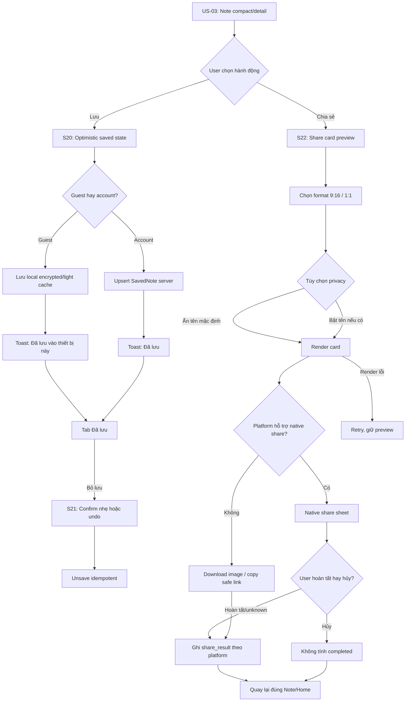

# US-05 — Lưu và chia sẻ Note

## 1. User story

Là người vừa đọc được một Note chạm đúng lúc, tôi muốn lưu lại cho riêng mình hoặc chia sẻ thành một card đẹp, để giữ lời nhắc ấy cho sau này hoặc gửi cho người khác mà không lộ dữ liệu sinh cá nhân.

## 2. Mục tiêu và ranh giới

### Mục tiêu

- Cho user giữ lại Note bằng một thao tác nhẹ, không phá nhịp đọc Daily Note.
- Cho user tạo share card theo Cosmic Glass Signal, đủ nổi bật trên story/feed nhưng không rối.
- Bảo vệ privacy mặc định: không đưa ngày sinh, giờ sinh, nơi sinh, guest token, profile id thô vào card/link.
- Hỗ trợ guest mode: lưu local và share public không yêu cầu login; chỉ soft-prompt login khi user muốn sync/giữ lâu dài.
- Tracking idempotent: save/share/cancel không tạo trạng thái sai.

### Trong phạm vi

Save/unsave Note; saved collection; local guest save; server/account save khi đã login; share card preview; chọn format 9:16/1:1; bật/tắt tên nếu có display name; native share sheet; download/copy link fallback; public safe preview; permission/error/cancel state.

### Ngoài phạm vi

- Tạo Daily Note và nội dung source: US-03.
- Mood check-in: US-04.
- Lá Khai Sinh Card của onboarding: US-02.
- Share Lá Chứng/Pitch Card/Lá Ghép/Recap: US-08 đến US-18.
- Account claim/sync dài hạn: US-19.

## 3. Actor, điều kiện và dữ liệu đầu ra

- **Actor:** guest hoặc account user đã có Daily Note từ US-03.
- **Tiền điều kiện:** có `daily_note_id` hoặc fallback note snapshot hợp lệ; nếu chưa có note thì route về Home/US-03.
- **Thành công khi lưu:** note snapshot xuất hiện trong tab Đã lưu; tap lại không tạo trùng.
- **Thành công khi chia sẻ:** có share artifact hoặc public preview link an toàn; user quay lại đúng Note/Home sau share/cancel.
- **Dữ liệu tạo/cập nhật:** `SavedNote`, `ShareArtifact`, `ShareLink`, `share_attempt`, `share_result`, local cache metadata.

## 4. User flow đầy đủ

## 5. Đặc tả UI/UX theo màn hình

### S20 — Save action trên Home/Detail

| Thành phần | Loại | Nội dung/hành vi |
|---|---|---|
| Save button | Icon + label | “Lưu lại” khi chưa lưu; “Đã lưu” khi saved. |
| Placement | Secondary CTA | Đứng cạnh/bên dưới Share, không lớn hơn Note. |
| Feedback | Toast/inline | “Đã lưu vào thiết bị này” cho guest; “Đã lưu” cho account. |
| Undo | Optional action | “Hoàn tác” trong 3–5 giây nếu dùng toast. |
| Login prompt | Soft prompt | Chỉ sau save success: “Đăng nhập để giữ khi đổi máy”, không chặn. |

#### UX rules

- Save là cảm giác “giữ lại lời nhắc”, không phải tạo collection phức tạp.
- Tap save lặp không nhảy UI hoặc tạo duplicate.
- Guest save vẫn thành công local; không dùng login làm hard gate.
- Nếu note đang là fallback/stale, saved item phải giữ đúng nhãn ngày/source để user không hiểu nhầm.

### S21 — Đã lưu collection

| Thành phần | Loại | Nội dung/hành vi |
|---|---|---|
| Header | App tab | “Đã lưu”; bottom nav active. |
| Empty state | Paper note | “Chưa có note nào nằm lại.” + CTA về Home. |
| Saved item | Card/list item | Note title, compact body, note date, source label, saved_at. |
| Filter | MVP none | Không thêm filter nếu ít item; future có month/source. |
| Remove | Text/icon action | “Bỏ lưu”; có undo hoặc confirm nhẹ nếu item cũ. |
| Offline | Local-first | Hiển thị local saved items; account sync sau nếu có. |

### S22 — Share card preview

| Thành phần | Loại | Nội dung/hành vi |
|---|---|---|
| Back | Icon button | Quay lại đúng vị trí trong Note/Home. |
| Preview | Card canvas | Cosmic Glass Signal, 9:16 mặc định, reading surface đủ đục và chữ rõ ở mobile. |
| Format | Segmented control | `Story 9:16` mặc định; `Square 1:1` cho feed. |
| Privacy summary | Inline note | “Card không chứa ngày sinh/giờ/nơi sinh.” |
| Display name toggle | Toggle | Chỉ hiện nếu có `display_name`; mặc định OFF. |
| Watermark | Small brand | “Lá Lành” nhỏ, không che nội dung. |
| Primary CTA | Button | “Chia sẻ card”; mở native share sheet. |
| Secondary CTA | Button | “Tải ảnh” hoặc “Copy link” theo platform. |

#### Card content schema

| Field | Validation |
|---|---|
| `card_title` | 18–56 ký tự; không all-caps toàn bộ nếu không phải style label. |
| `card_body` | 80–180 ký tự; tối đa 3 dòng ở 9:16; không overflow ở 320px. |
| `note_date_label` | Có thể hiển thị “Note hôm nay” hoặc ngày tháng, không hiển thị DOB. |
| `persona_label` | `Vibe · <3–5 chữ>` hoặc `Aura · <3–5 chữ>` lấy nguyên từ note snapshot; factual placements không đưa lên card mặc định nhưng còn trong provenance của Note. |
| `display_name` | Optional, chỉ khi user bật; sanitize ký tự control; max 24 ký tự. |
| `watermark` | Bắt buộc, nhỏ, không dùng public id. |

### S23 — Public safe preview link

| Thành phần | Loại | Nội dung/hành vi |
|---|---|---|
| Preview page | Read-only | Hiển thị card/note đã sanitize, không có owner controls. |
| CTA | App link | “Mở Lá Lành” hoặc “Tạo Note của mình”; vào US-01/US-02. |
| Link token | Random opaque | Không tuần tự, có expiry/revocation. |
| Metadata | OG image/text | Không chứa DOB/identifier; phù hợp share social. |

## 6. Business rules và data contract

| Rule | Quyết định implementation |
|---|---|
| Save identity | Unique key `owner + daily_note_id`; fallback dùng `owner + note_date + content_hash`. |
| Snapshot | Saved item giữ snapshot nội dung/version tại thời điểm lưu; note cũ không đổi âm thầm khi content engine đổi. |
| Persona snapshot | Lưu/share copy nguyên `persona_mode`, `persona_label`, `persona_version` từ Daily Note; không tự tính và không tự nâng Vibe thành Aura. |
| Guest save | Lưu local trước; server sync chỉ khi session/account hợp lệ. |
| Account save | Upsert server để sync thiết bị; nếu từ guest claim sang account thì merge theo hash/id. |
| Unsave | Idempotent; nếu item không tồn tại vẫn trả success UI an toàn. |
| Share privacy | Card/link mặc định ẩn tên và luôn ẩn DOB/giờ/nơi sinh/profile id/token. |
| Share result | `share_started` ghi khi mở sheet; `share_completed` chỉ ghi khi platform xác nhận; nếu không biết thì `unknown`, không giả success. |
| Link expiry | Public link có expiry hoặc revoke path; không tồn tại vĩnh viễn mặc định cho guest. |
| Asset metadata | Xóa metadata không cần thiết khỏi ảnh; không embed raw JSON chứa dữ liệu nhạy. |
| Permission | Chỉ xin photo/file permission sau khi user tap lưu/tải, không xin ở onboarding. |

## 7. Field, validation và privacy constraints

| Field | Loại | Required | Validation |
|---|---|---|---|
| `daily_note_id` | UUID/string | Có nếu note server | Thuộc owner hiện tại; không gửi id tùy ý để đọc note người khác. |
| `note_snapshot` | Object | Có | Title/body/source/version đã sanitize; length bounded. |
| `saved_at` | Timestamp | Server/local | Server là nguồn chuẩn khi online; local dùng để sort tạm. |
| `share_format` | Enum | Có khi share | `story_9_16` hoặc `square_1_1`. |
| `include_display_name` | Boolean | Optional | Default false; true chỉ khi có display name. |
| `display_name` | String | Optional | Max 24 ký tự; strip control chars; không tự hỏi tên trong US-05. |
| `share_token` | Opaque random | Có nếu public link | Tối thiểu 128-bit entropy; không chứa profile/note/date. |
| `expires_at` | Timestamp | Có với guest link | Guest link expiry ngắn hơn hoặc bằng policy public share. |

### Không được xuất hiện trong saved/share artifact

- Raw birth date, birth time, birthplace, latitude/longitude.
- Guest token, CSRF token, account id, email, phone.
- Internal prompt, model output debug, content moderation labels.
- Mood free text vì US-04 không thu free text.

## 8. Detailed requirement checklist

- **AC01 — Save idempotent:** Tap “Lưu lại” một hoặc nhiều lần chỉ tạo một saved item cho cùng Note.
- **AC02 — Guest allowed:** Guest lưu Note local thành công mà không bị yêu cầu đăng nhập.
- **AC03 — Saved collection:** Saved tab hiển thị saved snapshot gồm note title/body/date/source; empty state rõ khi chưa có gì.
- **AC04 — Unsave:** User có thể bỏ lưu; action idempotent và có undo/confirm nhẹ để tránh mất nhầm.
- **AC05 — Snapshot stability:** Note đã lưu giữ nội dung/version tại thời điểm lưu, không tự đổi khi Daily Note hôm sau hoặc engine content cập nhật.
- **AC06 — Share preview:** User xem preview trước khi share; card mặc định 9:16 và không overflow chữ tiếng Việt.
- **AC07 — Format:** User đổi được 9:16/1:1; preview và export dùng cùng snapshot, không regenerate text khác.
- **AC08 — Privacy default:** Share card/link mặc định không chứa tên, ngày/giờ/nơi sinh, tọa độ, id/token hoặc dữ liệu raw.
- **AC09 — Name toggle:** Nếu có display name, toggle “Hiện tên” mặc định OFF; nếu không có tên thì ẩn toggle, không hỏi thêm trong flow này.
- **AC10 — Native share:** Khi platform hỗ trợ, “Chia sẻ card” mở native share sheet; cancel không tính completed.
- **AC11 — Fallback:** Nếu native share không hỗ trợ, user có “Tải ảnh” hoặc “Copy link” an toàn.
- **AC12 — Render failure:** Render/share lỗi không làm mất preview; có Retry và quay lại đúng Note.
- **AC13 — Public link safety:** Link public chỉ hiển thị preview read-only đã sanitize; không lộ endpoint/profile id đoán được.
- **AC14 — Analytics privacy:** Events chỉ ghi enum/result/channel an toàn; không ghi Note full text, DOB, token, share token.
- **AC15 — Accessibility:** Save/share controls có label, focus order rõ, touch target ≥44px, card preview có alternative text.
- **AC16 — App-first:** Flow hoạt động như app: bottom nav, native share/download đúng platform, không phụ thuộc mở file `index.html`.

## 9. Edge cases và solution

| Edge case | Rủi ro | Solution |
|---|---|---|
| User tap save liên tục | Duplicate records/UI flicker | Disable trong request hoặc optimistic lock; server unique upsert. |
| Save offline | User tưởng mất Note | Save local ngay; badge “Trên thiết bị này”; sync sau nếu có account/session. |
| Guest gỡ app | Mất local saved | Soft prompt sau save: “Đăng nhập để giữ khi đổi máy”; không chặn save. |
| Content engine đổi sau khi save | Saved note bị thay ý nghĩa | Saved snapshot immutable; chỉ source/version metadata được hiển thị. |
| Unsave nhầm | Mất nội dung | Undo toast 3–5 giây hoặc confirm khi item cũ/đã sync. |
| Card text quá dài | Share ảnh xấu/rối | Schema length; dynamic text sizing trong giới hạn; visual QA 320px/390px. |
| User không có display name | Toggle thừa | Ẩn toggle; dùng “Bạn” hoặc không hiện tên. |
| Display name chứa ký tự lạ | Vỡ layout/XSS | Sanitize, escape text trong SVG/canvas, strip control chars, max length. |
| Native share cancel | Analytics sai | Ghi `share_started`; completed chỉ khi OS callback xác nhận, else `cancelled/unknown`. |
| Share file quá lớn | App share fail | Compress/export target size; fallback download/link. |
| Public link bị forward rộng | Privacy surprise | Preview chỉ chứa sanitized card; có revoke/expiry; không có hidden raw data. |
| Link crawler đọc OG metadata | Lộ data qua preview | OG title/image dùng sanitized content; không DOB/token. |
| Permission photo denied | Không lưu được ảnh | Giải thích ngắn; fallback share/download; không mất preview. |
| App background lúc render | Lost state | Persist render draft; resume preview khi foreground. |
| Account + guest saved duplicates | Collection trùng | Merge theo `daily_note_id`/content hash khi claim ở US-19. |

## 10. Test matrix tối thiểu

### Save/collection

- Save online account.
- Save guest local.
- Tap save lặp/rapid taps.
- Unsave + undo/confirm.
- Saved empty state.
- Saved snapshot không đổi qua ngày mới/content version mới.
- Guest claim merge không duplicate.

### Share/render

- Preview 9:16 và 1:1.
- Long Vietnamese note, display name max length, no display name.
- Toggle include name ON/OFF.
- Native share supported, unsupported, cancel, unknown callback.
- Download permission allowed/denied.
- Render error/retry.
- Public preview link open/revoked/expired.

### Privacy/security/accessibility

- Assert exported image/link không chứa DOB/time/place/token/id.
- Share token entropy/unguessable.
- XSS/special chars in display name/note.
- Keyboard/screen reader labels.
- Text scale 200%, mobile 320/390/430px.

## 11. Analytics

| Event | Thuộc tính được phép |
|---|---|
| `note_save_started` | source_screen, note_date, content_version |
| `note_saved` | source_screen, storage_scope: local/server, content_version |
| `note_unsaved` | source_screen, storage_scope |
| `saved_collection_viewed` | item_count_bucket |
| `note_share_preview_opened` | source_screen, default_format |
| `note_share_format_changed` | format |
| `note_share_started` | format, method: native/download/link |
| `note_share_result` | format, result: completed/cancelled/failed/unknown |
| `note_share_link_created` | expiry_bucket |

Không ghi DOB, token, share token, note full text, display name raw, phone/email hoặc internal prompt.

## 12. Definition of Done

- Save/unsave, Saved tab, empty state, offline guest save, account sync path và merge-on-claim behavior được implement/test.
- Share card preview, format switch, optional name toggle, native share, download/copy link fallback, cancel/error/retry states hoạt động end-to-end.
- Export card và public link pass privacy checks: không DOB/time/place/token/id/raw metadata.
- Saved snapshot immutable và versioned; old saved notes không đổi khi content engine cập nhật.
- Visual QA pass với Cosmic Glass Signal, tiếng Việt dấu dài, 9:16/1:1, 320px và text scale.
- Analytics privacy guard pass; events không chứa dữ liệu nhạy hoặc full note.
- Accessibility pass cho controls, card alternative text, focus order và touch target.
- Detailed checklist AC01–AC16 và canonical AC-GWT-01–08 pass trên staging; không còn P0/P1 về privacy, duplicate, share-result hoặc asset overflow.

## 13. Quyết định đã chốt cho implementation

- Guest được save/share trước login.
- Save guest là local-first; account/server save là sync/giữ lâu dài.
- Share card mặc định ẩn tên và luôn ẩn ngày/giờ/nơi sinh.
- MVP share format gồm 9:16 và 1:1.
- Public link nếu có phải là safe preview, opaque token, expiry/revoke rõ.
- Share cancel không được tính là share completed.

## 14. Entry, exit và ownership

| Mục | Hợp đồng |
|---|---|
| Entry | Authorized/display-safe Daily Note snapshot từ US-03; action Save hoặc Share từ Home/detail. |
| Exit save | Một immutable saved snapshot local/server; collection phản ánh trạng thái. |
| Exit share | Asset/link được tạo và result là completed/cancelled/failed/unknown; quay lại đúng Note. |
| Story sở hữu | Save/unsave/collection, share preview/render/native sheet/download/safe public link/revoke. |
| Không sở hữu | Note generation/provenance truth (US-03), mood (US-04), auth claim (US-19), birth card ban đầu (US-02). |

## 15. Route/state matrix

| Route/surface | State | Hành vi/transition |
|---|---|---|
| Home/detail Save | unsaved/saving/saved/error | Optimistic idempotent toggle; undo/retry |
| `/saved` | empty/local/server/mixed/offline | Stable snapshots; remove/undo; open source Note if authorized |
| `/notes/:id/share` | preview/rendering/render-error | Format/name controls; same snapshot; retry/back |
| Native share sheet | started/completed/cancelled/unknown | Record only observable result; preserve preview |
| Download fallback | permission/granted/denied/error | Ask just-in-time; retry/settings guidance |
| Public `/s/:token` | active/expired/revoked/not-found | Read-only sanitized preview or indistinguishable safe state |
| Claim/sync handoff | Guest local save exists | US-19 merge by id/hash; no silent duplicate/overwrite |

## 16. Complete API/data contract

| Field | Type | Required | Validation |
|---|---|---|---|
| `saved_note_id` | opaque id | Server save | Owner-authorized, non-public. |
| `daily_note_id` | opaque id/null | Conditional | Authorized; fallback uses content hash/date. |
| `note_snapshot` | immutable object | Có | Bounded title/body/date + content/provenance references; sanitized. |
| `persona_mode/label/version` | enum/string/string | Có | Copied from Note; Vibe/Aura never recomputed by this story. |
| `storage_scope` | enum | Có | `device` or `account`; guest default device. |
| `share_format` | enum | Share | `story_9_16` or `square_1_1`. |
| `include_display_name` | boolean | Optional | Default false; true only with existing valid name. |
| `share_token` | ≥128-bit opaque secret | Public link | Random, no embedded id/date/profile. |
| `expires_at/revoked_at` | timestamp/null | Link | Server authority; expired/revoked deny access. |
| `asset_sha256` | digest | Rendered asset | Integrity/dedup only; no PII encoding. |

- `PUT /saved-notes/{daily_note_id}` and `DELETE` are owner-scoped/idempotent; list uses bounded pagination and stable ordering.
- `POST /share-artifacts` creates immutable sanitized snapshot/asset or safe-link token from an authorized note; client cannot inject owner identifiers.
- `GET /shares/{token}` returns read-only sanitized payload; expired/revoked/missing responses do not disclose owner or existence details.
- `DELETE /shares/{token}` revokes idempotently for authorized owner; guest capability handling must be documented/tested.

## 17. Security and privacy

- Enforce owner authorization for save/list/unsave/render/revoke; rate-limit public token lookup and prevent enumeration.
- Sanitize Vietnamese text/display name, escape OG metadata and renderer input; strip EXIF/source JSON/internal ids from output.
- Never include DOB/time/place/coordinates/token/profile id/raw placements/mood in asset, link, analytics, URL or cache key.
- Public links have expiry/revoke and least data; crawler metadata equals the same safe snapshot, not private Note API data.
- Local guest collection stores only display-safe immutable snapshots; account sync/claim is explicit and conflict-safe.
- Native app is release target/gate for share sheet, photo/file permission, protected local storage and callback truth; web/PWA is reference/companion.

## 18. Acceptance Criteria — Given/When/Then

- **AC-GWT-01 — Idempotent save:** Given an unsaved/saved Note, When save or unsave is repeated/offline, Then exactly one intended state remains and collection updates without duplicates.
- **AC-GWT-02 — Snapshot stability:** Given a Note is saved, When day/content/persona versions later change, Then the saved snapshot remains the original version and keeps its original Vibe/Aura metadata.
- **AC-GWT-03 — Guest local-first:** Given a guest, When saving, Then no login wall appears, item is labeled device-local and loss/sync expectations are clear.
- **AC-GWT-04 — Preview parity:** Given format/name settings, When switching 9:16/1:1 or rendering, Then preview/export use the exact same immutable content and Vietnamese text does not overflow.
- **AC-GWT-05 — Privacy default:** Given any card/link, When generated/shared/crawled, Then name is off by default and prohibited birth/session/account/mood/internal data is absent.
- **AC-GWT-06 — Share truth:** Given native share starts, When OS reports complete/cancel/failure or no reliable callback, Then result is recorded respectively and never inferred as success.
- **AC-GWT-07 — Safe link:** Given active/expired/revoked/random token, When opened, Then only active token returns sanitized read-only preview and other states leak no owner/private identity.
- **AC-GWT-08 — Recovery/a11y:** Given render/permission/network failure or assistive tech, When user retries/navigates, Then preview/context is preserved, controls are labeled/usable and web/PWA proof does not replace native release evidence.

## 19. Dependencies và implementation evidence

- **Upstream:** US-03 immutable Note/persona/provenance; US-01 credential; existing display name optional.
- **Downstream:** US-19 may claim/merge local saves. Public recipient is read-only and does not become an authenticated dependency.
- **Evidence placeholders:** `[Pending] API` authorization/idempotency/pagination/token expiry+revoke; `[Pending] Renderer` parity/overflow/font/metadata/XSS; `[Pending] Privacy` prohibited-field scanner/OG/public enumeration; `[Pending] Offline` guest collection/claim merge; `[Pending] Native release gate` share callback/permissions/protected storage/device screenshots.

## 20. Cosmic Glass Signal screen contract

S20–S23 dùng direction **02 — Cosmic Glass Signal**: collection/preview controls có smoky-lilac glass, còn card text và public preview dùng surface đủ đục để đọc/chụp ổn định. Light/dark giữ cùng hierarchy; chỉ dùng Be Vietnam Pro, 4.5:1 essential text, 44px controls, 200% text và 320/390/430px không overflow. Card có thể mang `Vibe ·`/`Aura ·` snapshot nhưng không factual birth placements hay dữ liệu sinh; provenance đầy đủ vẫn thuộc Note riêng tư.
