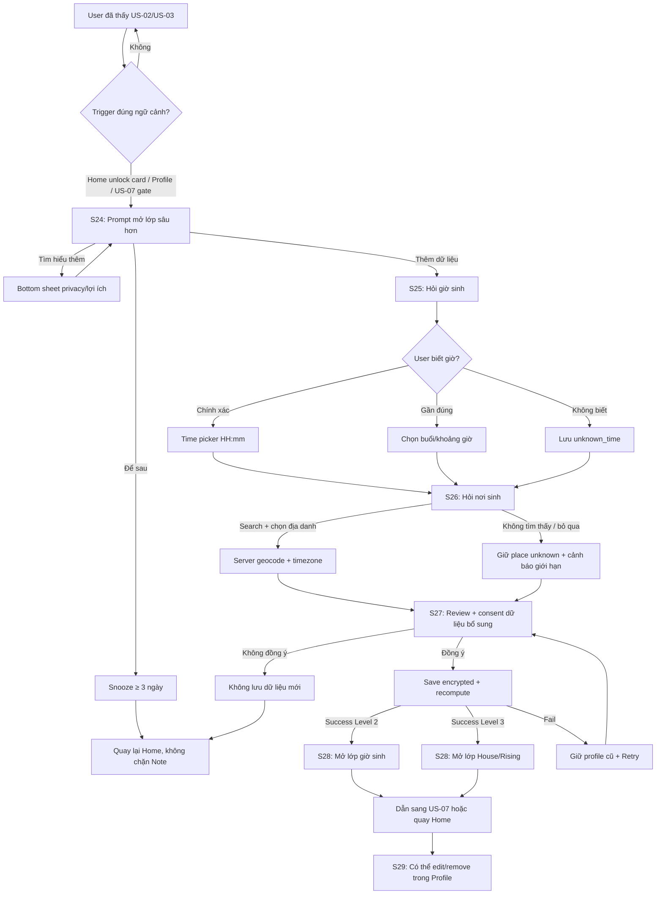

# US-06 — Bổ sung giờ sinh và nơi sinh

## Cập nhật 07/10/2026 — có thể thêm ngay khi bắt đầu

[Contract mới, flow, field validation, AC và privacy](../plans/2026-10-07-optional-birth-details-planet-surface.md) là chuẩn ưu tiên cho onboarding và CTA bổ sung. Có hai entry: phần tùy chọn ngay dưới ngày sinh trong US-02; hoặc chủ động bổ sung sau ở Khám phá/Mình/Home. Không ép thêm màn onboarding. Consent bổ sung vẫn riêng; thu gọn giữ draft nhưng **Bỏ qua giờ & nơi sinh** xóa draft và consent. CTA dựa trên server state thực, không dựa riêng `profile_level`: đã có giờ thì chỉ mời thêm nơi; đầy đủ thì không có lời mời thu thêm. Giờ gần đúng được gọi “Làm rõ giờ sinh”, không gọi là chưa điền. Engine/accuracy và quyền xóa bên dưới vẫn giữ nguyên.

## 1. User story

Là người đã thấy giá trị ban đầu từ Lá Khai Sinh/Note hôm nay, tôi muốn bổ sung giờ sinh và nơi sinh đúng lúc, với giải thích rõ lợi ích và quyền dữ liệu, để mở các lớp insight sâu hơn mà vẫn có thể để sau nếu chưa sẵn sàng.

## 2. Mục tiêu và ranh giới

### Mục tiêu

- Cho phép thu thập giờ sinh/nơi sinh ngay từ đầu trong một disclosure tùy chọn hoặc bổ sung đúng ngữ cảnh sau; không biến onboarding thành form dài.
- Giải thích rõ “vì sao cần thêm dữ liệu này” trước khi hỏi: giờ sinh giúp tăng độ chính xác; nơi sinh giúp tính múi giờ, Rising/House.
- Hỗ trợ thực tế người dùng không nhớ chính xác giờ sinh: exact, khoảng gần đúng, hoặc không biết.
- Bảo vệ privacy mặc định: có consent riêng cho dữ liệu bổ sung; không đưa giờ/nơi sinh vào analytics, URL, localStorage thô, share card hoặc public link.
- Recompute chart an toàn, có rollback; không làm mất Lá Khai Sinh/Note đã có nếu recompute lỗi.
- Giữ app-first: native app là release target và release gate; web/PWA chỉ là reference/companion để triển khai và kiểm chứng hành vi tương đương.

### Trong phạm vi

Contextual prompt; snooze; time input exact/approx/unknown; birthplace search; confirm địa danh; consent theo mục đích; geocode/timezone phía hệ thống; recompute chart Level 2/3; precision labels; edit/remove dữ liệu bổ sung từ Profile; loading/error/rollback state.

### Ngoài phạm vi

- Hiển thị nội dung insight sâu Moon/Venus/Mars/House: US-07.
- Matching-ready profile, ảnh, intent, visibility: US-14.
- Đăng nhập/claim để sync lâu dài: US-19.
- Thu full address, địa chỉ nhà, định vị GPS thiết bị.
- Cam kết dự đoán chính xác tuyệt đối hoặc diễn giải y tế/pháp lý/tài chính.

## 3. Actor, điều kiện và dữ liệu đầu ra

- **Actor:** guest hoặc account user đã hoàn tất US-02 và có Basic Birth Profile.
- **Tiền điều kiện:** có guest consent/ngày sinh hợp lệ để lưu; entry từ US-02 là tự nguyện trước Reveal, hoặc sau khi đã thấy value và chủ động mở phần bổ sung.
- **Trigger hợp lệ:** card “Còn một note chưa mở” trên Home, Profile, sau 3-day streak, trước khi vào US-07, hoặc trước một flow cần độ chính xác cao hơn như Lá Ghép/Vòng Lá.
- **Success state:** birth profile được cập nhật bằng precision rõ ràng; chart recompute tạo snapshot mới; user thấy màn “lớp đã mở” hoặc được dẫn sang US-07.
- **Non-success state hợp lệ:** user chọn “Để sau”; prompt bị snooze tối thiểu 3 ngày và Daily Note không bị chặn.
- **Dữ liệu tạo/cập nhật:** `BirthDataSupplement`, `BirthPlaceReference`, `ChartSnapshot`, `chart_readiness_flags`, `consent_record`, `prompt_snooze`.

### Profile readiness

| Readiness | Dữ liệu có | Có thể mở |
|---|---|---|
| Level 1 | Ngày sinh | Lá Khai Sinh/Daily Note cơ bản; compact persona vẫn là `Vibe · <3–5 chữ>`. |
| Level 2 | Ngày sinh + giờ sinh exact/approx, chart engine xác nhận đủ độ sâu | Insight có nhãn độ chính xác tốt hơn; compact persona chỉ chuyển sang `Aura · <3–5 chữ>` khi có NatalChart sâu hợp lệ; chưa bật House nếu thiếu nơi sinh. |
| Level 3 | Ngày sinh + giờ sinh usable + nơi sinh/timezone | `Aura · <3–5 chữ>` và Rising/House nếu engine xác nhận đủ dữ liệu; placement thật ở provenance. |

Không được “giả lập” House/Rising như dữ liệu thật khi thiếu giờ sinh hoặc nơi sinh. Nếu cần fallback, UI phải nói rõ “chưa đủ dữ liệu để tính lớp này”.

## 4. User flow đầy đủ

## 5. Đặc tả UI/UX theo màn hình

### S24 — Contextual unlock prompt

| Thành phần | Loại | Nội dung/hành vi |
|---|---|---|
| Entry | Bottom sheet hoặc card expand | Xuất hiện từ Home/Profile/US-07 gate, không chen ngang khi user đang đọc Note. |
| Title | Copy ngắn | “Muốn Lá Lành đọc trúng hơn?” hoặc “Mở thêm một lớp bí mật”. |
| Benefit | 2 bullet tối đa | “Giờ sinh giúp tinh chỉnh Moon”; “Nơi sinh giúp mở Rising/House”. |
| Data ask | Plain language | “Bạn có thể thêm giờ sinh/nơi sinh. Không bắt buộc.” |
| Privacy microcopy | Inline note | “Dữ liệu này chỉ dùng để tính lá số và có thể xóa.” |
| Primary CTA | Button | “Thêm để mở lớp mới”. |
| Secondary CTA | Text button | “Để sau”; snooze prompt. |
| Learn more | Link/button | Mở sheet giải thích cách dùng dữ liệu, không rời flow. |

#### UX rules

- Prompt tự động chỉ xuất hiện sau value ban đầu; disclosure US-02 được hiển thị thu gọn từ đầu để người biết thông tin tự chọn thêm.
- Không dùng FOMO ép buộc kiểu “không thêm thì app vô dụng”.
- “Để sau” phải luôn rõ, cùng cấp nhìn thấy được.
- Nếu prompt xuất hiện tại một gate của US-07, copy nói thẳng lớp nào đang thiếu dữ liệu.

### S25 — Nhập giờ sinh

| Thành phần | Loại | Field/validation/hành vi |
|---|---|---|
| Mode selector | Segmented control | `Biết chính xác`, `Nhớ khoảng`, `Không biết`. Required. |
| Exact time | Time picker | HH:mm, 24h; required nếu mode exact; cho phép 00:00. |
| Approx window | Choice chips | Sáng, Trưa, Chiều, Tối, Đêm; optional custom range ở phase sau. |
| Unknown state | Info block | “Không sao, Lá Lành sẽ không bật các lớp cần giờ chính xác.” |
| Precision label | Inline | Hiển thị “Chính xác”, “Gần đúng”, hoặc “Chưa biết” để user hiểu hệ quả. |
| CTA | Button | “Tiếp tục”; disabled nếu required field chưa hợp lệ. |

#### Field behavior

| Field | Loại | Required | Validation |
|---|---|---|---|
| `birth_time_mode` | Enum | Có | `exact`, `approx_window`, `unknown`. |
| `birth_time_local` | String HH:mm | Có nếu exact | `00:00`–`23:59`; không parse text tự do. |
| `approx_window` | Enum | Có nếu approx | `morning`, `noon`, `afternoon`, `evening`, `night`; mapping sang range nằm phía server/config. |
| `time_precision` | Enum | Auto | `exact`, `approximate`, `unknown`; dùng để gắn disclaimer. |

### S26 — Tìm nơi sinh

| Thành phần | Loại | Field/validation/hành vi |
|---|---|---|
| Search input | Text | Placeholder “Bạn sinh ở thành phố/tỉnh nào?”; min 2 ký tự. |
| Result list | Select list | Thành phố/tỉnh/quốc gia; ưu tiên locality, không yêu cầu địa chỉ nhà. |
| Selected place | Confirmation card | Hiển thị tên, tỉnh/bang, quốc gia để tránh chọn nhầm. |
| Not found | Empty/error state | “Không thấy nơi này?” + thử tên gần nhất/manual city-level. |
| Skip place | Text button | Cho phép bỏ qua; UI nói rõ sẽ chưa mở House/Rising. |
| GPS | Not used | Không xin quyền vị trí thiết bị. |
| Vietnam catalog | Local, versioned | Browse đủ 34 tỉnh/thành theo `vn-admin-2025-07-01`; search vẫn nhận 29 tên tỉnh cũ và ghi rõ mapping hiện hành. |

#### Field behavior

| Field | Loại | Required | Validation |
|---|---|---|---|
| `birthplace_query` | String | Có khi search | 2–80 ký tự; trim; hỗ trợ dấu tiếng Việt; debounce. |
| `place_id` | Opaque id | Có nếu chọn result | Chỉ nhận từ provider/server; client không tự tạo. |
| `place_display_name` | String | Có nếu chọn result | 2–120 ký tự; city/province/country; không full street address. |
| `country_code` | ISO code | Có nếu chọn result | Lấy từ provider/server. |
| `timezone_id` | IANA timezone | Server-derived | Không cho user tự nhập ở MVP. |
| `coordinates` | Server-side | Không expose raw | Mã hóa/lưu server-side nếu cần; client không log/analytics. |

### S27 — Review và consent dữ liệu bổ sung

| Thành phần | Loại | Nội dung/hành vi |
|---|---|---|
| Summary | Review card | “Giờ sinh: khoảng sáng/chính xác 08:15”; “Nơi sinh: Đà Nẵng, Việt Nam”. |
| Purpose | Plain copy | “Dùng để tính múi giờ, Moon chính xác hơn, Rising/House nếu đủ dữ liệu.” |
| Storage | Privacy copy | “Bạn có thể xóa trong Profile. Không đưa vào share card.” |
| Consent checkbox | Required | “Tôi đồng ý dùng dữ liệu bổ sung này để tính lá số cá nhân.” |
| Primary CTA | Button | “Lưu và mở lớp mới”; disabled nếu chưa consent. |
| Back/Edit | Text/icon | Quay về S25/S26 để sửa trước khi lưu. |

### S28 — Recompute / unlock success

| Thành phần | Loại | Nội dung/hành vi |
|---|---|---|
| Loading | Branded animation | “Đang mở lớp lá mới…”; không quá 5–8 giây trước khi có feedback. |
| Success Level 2 | Reveal sheet | Nếu NatalChart sâu hợp lệ, hiển thị `Aura · <3–5 chữ>` và copy “Đã thêm giờ sinh — Lá Lành đọc sắc hơn”; nếu precision chưa đủ thì giữ Vibe và giải thích giới hạn. |
| Success Level 3 | Reveal sheet | Hiển thị `Aura · <3–5 chữ>` cùng copy “Đã mở thêm một tầng bản đồ”; Rising/House cụ thể chỉ ở provenance/detail. |
| Precision disclaimer | Inline | Nếu approx: “Một vài insight sẽ dùng khoảng giờ, nên có thể rộng hơn.” |
| CTA | Button | “Xem lớp mới” sang US-07 hoặc “Quay về Home”. |
| Error | Recoverable state | “Chưa mở được lớp này” + Retry/Để sau; profile cũ vẫn nguyên. |

### S29 — Edit/remove từ Profile

| Thành phần | Loại | Nội dung/hành vi |
|---|---|---|
| Birth data section | Settings card | Hiển thị trạng thái: ngày sinh, giờ sinh precision, nơi sinh display. |
| Edit | Button | Mở lại S25/S26 với dữ liệu hiện tại. |
| Remove time | Destructive-light | Xóa giờ sinh; hạ readiness nếu cần; xác nhận trước khi xóa. |
| Remove place | Destructive-light | Xóa nơi sinh/coords; hạ readiness nếu cần; xác nhận trước khi xóa. |
| Delete all birth data | Escalated action | Có confirm rõ; liên kết tới privacy/data request policy. |

## 6. Business rules và data contract

| Rule | Quyết định implementation |
|---|---|
| Progressive disclosure | Không hỏi giờ/nơi sinh ở lần đầu nếu chưa cần; chỉ hỏi sau khi user thấy value hoặc chủ động muốn mở lớp sâu. |
| No login wall | Guest được thêm dữ liệu và recompute; chỉ soft-prompt login sau success nếu muốn sync/khôi phục. |
| Consent before persistence | Dữ liệu giờ/nơi sinh chỉ được lưu sau S27 consent; trước đó giữ ở volatile draft/session. |
| Server authority | Geocode, timezone và historical timezone/DST xử lý phía server; client chỉ gửi query/place id. |
| Precision truth | Insight phải đọc `time_precision`; không dùng approx/unknown như exact. |
| House/Rising gate | Chỉ bật House/Rising khi có time usable + birthplace/timezone đủ tin cậy. |
| Atomic recompute | Snapshot mới chỉ active khi recompute success; failure giữ snapshot cũ. |
| Idempotency | Submit cùng payload nhiều lần không tạo nhiều profile/chart snapshot active. |
| Edit invalidation | Sửa giờ/nơi sinh tạo snapshot mới và đánh dấu các insight cũ là stale/versioned. |
| Deletion | Xóa giờ/nơi sinh phải xóa/ẩn các derived fields tương ứng theo policy; UI hạ readiness rõ ràng. |
| Prompt snooze | “Để sau” snooze ít nhất 3 ngày; không hiện lại trong cùng session. |
| Data minimization | Không thu full address, phone, email, GPS hoặc dữ liệu không cần cho birth chart. |

## 7. Field, validation và privacy constraints

| Field | Loại | Required | Validation |
|---|---|---|---|
| `profile_id` | Opaque id | Có | Thuộc guest/account session hiện tại; không dùng raw trong URL public. |
| `birth_date` | Date | Đã có từ US-02 | Không sửa ở US-06 trừ khi user vào edit profile riêng. |
| `birth_time_mode` | Enum | Có | `exact`, `approx_window`, `unknown`. |
| `birth_time_local` | HH:mm | Conditional | Required nếu exact; 00:00–23:59; timezone local của nơi sinh. |
| `approx_window` | Enum | Conditional | Required nếu approx; mapping server-configurable. |
| `birthplace_query` | String | Conditional | 2–80 ký tự; trim; không chứa script/control chars. |
| `place_id` | Opaque id | Conditional | Required nếu chọn place; validate với provider/server. |
| `place_display_name` | String | Conditional | 2–120 ký tự; city-level; không lưu/display full street. |
| `timezone_id` | IANA timezone | Server | Derived từ place/date; không trust client. |
| `geo_confidence` | Enum/score | Server | Dùng để quyết định có bật House không. |
| `consent_version` | String | Có khi save | Phải là version hiện hành cho purpose `birth_profile_deep`. |
| `consented_at` | Timestamp | Có khi save | Server time; local chỉ tạm nếu offline. |
| `chart_snapshot_id` | Opaque id | Sau recompute | Versioned, active khi success. |

### Không được lưu/gửi ra ngoài sai chỗ

- Không đưa giờ/nơi sinh/tọa độ vào URL, route params, share card, public preview, analytics payload hoặc crash breadcrumb.
- Không lưu raw birth time/place trong localStorage plain text; với app local cache phải encrypted/secure storage nếu giữ qua session.
- Không log query địa danh kèm profile/session id ở log thường.
- Không expose coordinate raw cho client nếu không cần hiển thị.

## 8. Detailed requirement checklist

- **AC01 — Prompt đúng thời điểm:** Flow hỏi giờ/nơi sinh chỉ xuất hiện sau khi user đã nhận value hoặc chủ động tap unlock, không chặn onboarding/Note cơ bản.
- **AC02 — Có thể để sau:** S24 luôn có “Để sau”; sau skip, prompt cùng loại không hiện lại ít nhất 3 ngày và không chặn Home.
- **AC03 — Giờ sinh linh hoạt:** User chọn được exact, approx hoặc unknown; dữ liệu lưu kèm precision rõ ràng.
- **AC04 — Exact time validation:** Exact time chỉ accept HH:mm 00:00–23:59; invalid input không submit.
- **AC05 — Approx honesty:** Approx time mở insight với disclaimer/precision label; không được coi là exact.
- **AC06 — Unknown time:** Unknown vẫn cho tiếp tục/bỏ qua; không tạo House/Rising hoặc insight cần giờ thật.
- **AC07 — Place search an toàn:** Search yêu cầu min 2 ký tự, trả result city-level, confirm địa danh trước khi lưu.
- **AC08 — Không xin GPS:** Flow không xin quyền vị trí thiết bị trong MVP.
- **AC08a — Danh mục Việt Nam đầy đủ:** User xem được đủ 34 tỉnh/thành hiện hành; có thể tìm tên có/không dấu và tên cấp tỉnh trước sắp xếp 2025 mà không bị đổi nhãn âm thầm.
- **AC09 — Consent riêng:** Trước khi lưu dữ liệu bổ sung, user phải thấy purpose/storage/deletion copy và tick consent.
- **AC10 — Consent denial:** Nếu user không consent hoặc back out, không persist dữ liệu bổ sung; profile cũ giữ nguyên.
- **AC11 — Server geocode/timezone:** Timezone/DST/historical offset được xử lý server-side; client không quyết định tọa độ/timezone final.
- **AC12 — Recompute rollback:** Recompute fail không làm mất chart snapshot/profile cũ; có Retry/Để sau.
- **AC13 — Level gating:** Level 2/3 và feature unlock phản ánh đúng dữ liệu thật; không bật House nếu thiếu place hoặc usable time.
- **AC14 — Edit/remove:** User sửa hoặc xóa giờ/nơi sinh từ Profile; readiness và snapshot derived cập nhật/hạ cấp đúng.
- **AC15 — Guest-first:** Guest dùng được flow đến success; login chỉ là soft prompt sau đó để sync/backup.
- **AC16 — Privacy analytics:** Analytics chỉ ghi response/level/source/precision enum; không ghi raw giờ sinh, nơi sinh, query, place id, tọa độ.
- **AC17 — Accessibility:** Field labels, error copy, focus order, touch targets ≥44px; screen reader đọc được mode/consent.
- **AC18 — App-first QA:** Flow hoạt động trong shell app/mobile viewport; không phụ thuộc mở file web tĩnh.

## 9. Edge cases và solution

| Edge case | Rủi ro | Solution |
|---|---|---|
| User không nhớ giờ sinh | Bỏ flow vì thấy bị bắt buộc | Có mode “Không biết”; nói rõ vẫn dùng được app, chỉ thiếu vài lớp sâu. |
| User chỉ nhớ “khoảng sáng” | Insight bị trình bày quá chắc | Lưu `approx_window`; UI gắn precision disclaimer ở US-07. |
| Sinh gần nửa đêm | Sai ngày/múi giờ nếu xử lý hời hợt | Server tính local time theo birthplace/timezone; review copy nhắc kiểm tra ngày/giờ. |
| DST/historical timezone | Birth chart lệch | Dùng timezone DB server-side theo date; test các ngày có DST. |
| Địa danh trùng tên | User chọn nhầm | Result luôn có tỉnh/bang/quốc gia; bắt confirm selected place. |
| Nơi sinh đã đổi tên | Không tìm thấy | Hỗ trợ alias; cho search theo tên hiện tại/gần đúng; fallback manual city-level có warning. |
| Provider trả full address/hospital | Thu quá mức cần thiết | Normalize/sanitize về city-level display; không lưu street nếu không cần. |
| Không có internet | Search/recompute fail | Giữ draft volatile; cho retry; không lưu partial nếu chưa consent/save. |
| Geocoder down | Flow kẹt | Cho “Để sau”, retry; giữ profile cũ. |
| User paste tọa độ | Privacy/UX lệch | Không accept coordinate raw ở MVP; hướng dẫn nhập thành phố/tỉnh. |
| User sửa dữ liệu sau khi đã mở insight | Insight cũ conflict | Tạo snapshot mới; mark old insight stale/versioned; không rewrite lịch sử đã share. |
| User xóa giờ/nơi sinh | Derived data còn sót | Xóa/ẩn derived fields tương ứng, hạ readiness, invalidate House insight active. |
| Guest đổi máy/gỡ app | Mất dữ liệu bổ sung local | Sau success soft-prompt login: “Giữ lá của bạn khi đổi máy”. |
| User dưới 18 hoặc policy tuổi thay đổi | Rủi ro consent/minor | Theo US-02 hiện block người chưa đủ 18 trước khi tạo chart; nếu policy mở teen mode thì cần story/guardian controls riêng, không sửa ngầm trong US-06. |
| App background lúc recompute | Mất trạng thái | Persist pending operation id an toàn; resume status khi mở lại. |
| Duplicate submit | Nhiều snapshots active | Idempotency key theo profile + payload hash + consent version; chỉ một active snapshot. |
| Consent version hết hạn | Lưu bằng điều khoản cũ | Server reject với error cần refresh consent copy; quay lại S27. |

## 10. Test matrix tối thiểu

### Time input

- Exact 00:00, 08:15, 23:59.
- Invalid exact input, empty exact input.
- Approx morning/noon/afternoon/evening/night.
- Unknown time; đảm bảo House/Rising không bật.
- Sửa exact sang approx/unknown và kiểm tra readiness hạ đúng.

### Place search/geocode

- Search tiếng Việt có dấu/không dấu.
- Query dưới 2 ký tự.
- Địa danh trùng tên ở nhiều quốc gia/tỉnh.
- Provider not found; provider down; network offline.
- Place có timezone/DST đặc biệt theo ngày sinh.
- Result chứa full address nhưng app chỉ giữ/display city-level.

### Consent/recompute

- Consent unchecked thì CTA disabled.
- User back/cancel trước consent không persist dữ liệu.
- Save + recompute success Level 2.
- Save + recompute success Level 3.
- Recompute fail rollback profile cũ.
- Duplicate submit không tạo nhiều active snapshots.
- Delete time/place từ Profile hạ readiness và xóa derived data.

### Privacy/security/accessibility

- Analytics không chứa raw time/place/query/place_id/coords.
- URL không chứa birth data.
- Secure storage/encryption path cho app local cache.
- Crash/log redaction cho place query và coordinates.
- Screen reader cho segmented controls, result list, consent checkbox.
- Mobile 320/390/430px, text scale 200%, touch targets.

## 11. Analytics

| Event | Thuộc tính được phép |
|---|---|
| `birth_supplement_prompt_viewed` | source_screen, trigger_type, current_readiness |
| `birth_supplement_prompt_action` | action: add_now/learn_more/snooze, trigger_type |
| `birth_time_mode_selected` | mode: exact/approx_window/unknown |
| `birth_place_search_started` | source_screen, query_length_bucket only |
| `birth_place_result_selected` | result_rank_bucket, country_region_bucket optional |
| `birth_supplement_consent_viewed` | consent_version |
| `birth_supplement_consent_action` | action: accepted/declined/back |
| `birth_profile_recompute_started` | target_readiness |
| `birth_profile_recompute_result` | result: success/fail, target_readiness, error_type_safe |
| `birth_supplement_removed` | removed_type: time/place/all |

Không ghi raw giờ sinh, nơi sinh, query text, `place_id`, tọa độ, DOB, profile id raw, guest token, email/phone hoặc nội dung insight.

## 12. Definition of Done

- S24–S29 được implement theo app-first UX, có đủ add now/learn more/snooze/back/edit/remove states.
- Time input exact/approx/unknown hoạt động, validation rõ, precision được lưu và dùng cho feature gating.
- Place search dùng city-level result, không xin GPS, không thu full address; geocode/timezone xử lý server-side.
- Consent riêng cho dữ liệu bổ sung xuất hiện trước persistence; decline/cancel không lưu dữ liệu mới.
- Chart recompute versioned, idempotent, rollback an toàn; chỉ active snapshot mới khi success.
- Level 2/Level 3 readiness và unlock event đúng với dữ liệu thật; không fake House/Rising khi thiếu dữ liệu.
- Guest hoàn tất được flow; sau success có soft prompt đăng nhập để sync, không hard wall.
- Profile cho phép sửa/xóa giờ/nơi sinh; derived data/readiness cập nhật đúng.
- Privacy checks pass: không DOB/time/place/query/coords/token trong URL, analytics, share, public preview, crash logs.
- Test matrix tối thiểu pass; không còn P0/P1 về privacy, recompute rollback, level gating hoặc consent.
- Copy tiếng Việt nhất quán Cosmic Glass Signal: trẻ, rõ, không rườm rà; field labels dễ scan.
- Detailed checklist AC01–AC18 và canonical AC-GWT-01–09 pass; implementation evidence bắt buộc không còn `Pending` trước release.

## 13. Quyết định đã chốt cho implementation

- Không hỏi giờ sinh/nơi sinh ở onboarding đầu; chỉ hỏi khi có ngữ cảnh mở thêm giá trị.
- “Để sau” luôn hợp lệ và snooze tối thiểu 3 ngày.
- Guest được bổ sung dữ liệu và recompute trước khi đăng nhập; login chỉ soft-prompt sau success.
- Giờ sinh có ba mode: exact, approx, unknown; mọi insight phải tôn trọng precision.
- Nơi sinh thu ở mức thành phố/tỉnh/quốc gia; không xin GPS và không thu full address.
- Consent dữ liệu bổ sung tách khỏi consent ngày sinh ban đầu.
- Geocode/timezone/historical DST là backend bắt buộc; client không tự quyết định tọa độ/timezone final.
- House/Rising chỉ mở khi có đủ time usable + birthplace/timezone đáng tin cậy.
- Recompute luôn versioned và rollback-safe.

## 14. Entry, exit và ownership

| Mục | Hợp đồng |
|---|---|
| Entry | Active Level-1 profile from US-02 + value already seen, or explicit unlock intent. |
| Exit success | New active snapshot with honest readiness/precision; Aura only if deeper NatalChart is valid; old snapshot retained as history/stale. |
| Exit defer/decline | No new sensitive data persisted; prompt snoozed or flow closed; existing Vibe/profile/Note remains usable. |
| Exit failure | Atomic rollback to prior active snapshot + retry/status operation. |
| Story sở hữu | Time mode, city-level place, purpose consent, geocode/timezone, recompute, readiness, edit/remove/downgrade. |
| Không sở hữu | Deep reading content (US-07), DOB edit (profile story), auth claim (US-19), Daily Note mutation (US-03). |

## 15. Route/state matrix

| Route/surface | State | Transition/result |
|---|---|---|
| Unlock prompt | eligible/snoozed/ineligible | Add, learn more, defer ≥3 days |
| `/birth-supplement/time` | exact/approx/unknown/invalid | Place step or back; draft volatile |
| `/birth-supplement/place` | typing/results/selected/not-found/offline/skipped | Review; server-derived timezone only |
| `/birth-supplement/review` | consent unchecked/checked/stale | Save+recompute or cancel with no persistence |
| `/birth-supplement/recompute` | pending/success L2/success L3/failure | Activate new snapshot only on success |
| Profile settings | existing/edit/remove/confirm | Recompute/downgrade/delete derived data |
| Resume operation | pending/complete/failed | Poll same operation; no duplicate active snapshots |

## 16. Complete API/data contract

| Field | Type | Required | Validation/meaning |
|---|---|---|---|
| `birth_time_mode` | enum | Có | `exact/approx_window/unknown`. |
| `birth_time_local` | `HH:mm` | If exact | Strict 00:00–23:59, local to birthplace. |
| `approx_window` | enum | If approx | `morning/noon/afternoon/evening/night`; versioned range mapping. |
| `time_precision` | enum | Server | `exact/approximate/unknown`; cannot be upgraded by client. |
| `place_id` | opaque provider/server id | If selected | Validate server-side; never public. |
| `place_display_name` | string 2–120 | If selected | City/province/country only; sanitize street detail. |
| `country_code` | ISO 3166-1 alpha-2 | If selected | Provider/server-derived. |
| `timezone_id` | IANA zone | Derived | Historical date-aware server authority. |
| `geo_confidence` | bounded enum/score | Derived | Gates House/Rising/readiness. |
| `consent_version/purpose` | string/enum | On save | Current `birth_profile_deep`, separate from US-01. |
| `operation_id` | opaque id | Recompute | Idempotent resume/status. |
| `chart_snapshot_id/readiness` | opaque id/enum | Success | New snapshot becomes active atomically. |
| `persona_mode/label/version` | enum/string/string | Success | `aura` only for valid deeper NatalChart; otherwise retain `vibe`. |

- `GET /birth-places/search?q=` returns normalized city-level results; rate-limited; does not persist query as profile data.
- `PUT /birth-profile/supplement` accepts reviewed payload + consent + idempotency key and returns operation status; owner from credential.
- `GET /birth-profile/supplement/status` resumes operation; `DELETE /birth-profile/supplement/{time|place|all}` performs authorized delete + recompute/downgrade idempotently.
- Recompute response includes old/new snapshot ids, readiness, precision, persona metadata and versions, but never raw coordinates unless a strictly necessary private endpoint documents it.

## 17. Security, privacy và integrity

- Sensitive draft remains volatile before consent; offline must not persist raw time/place in plaintext or sync before consent.
- Encrypt raw supplemental data and required coordinates at rest; strict owner authorization prevents IDOR on place/profile/snapshot/operation.
- Geocoder queries are rate-limited/minimized/redacted; no GPS permission, full address, URL params, analytics or crash breadcrumb leakage.
- Atomic transaction/outbox semantics ensure failed recompute does not activate partial data; duplicate/reordered operations resolve deterministically.
- Delete cascades or tombstones derived House/Rising/Aura eligibility as policy requires; historical shared snapshots remain immutable but contain no raw birth data.
- Approx/unknown precision can never be presented as exact. `Aura` is not guaranteed by simply entering a time; it requires server-confirmed deeper NatalChart.
- Native app remains release target/gate for secure storage, permissions, lifecycle and deletion UX; web/PWA is reference/companion only.

## 18. Acceptance Criteria — Given/When/Then

- **AC-GWT-01 — Progressive ask:** Given Level-1 value has been seen or user explicitly unlocks, When prompt appears, Then benefit/privacy/defer are clear and Home/Note remains usable after defer.
- **AC-GWT-02 — Time precision:** Given exact/approx/unknown selection, When continuing, Then required fields validate strictly and persisted precision matches input without upgrading uncertainty.
- **AC-GWT-03 — Place minimization:** Given a ≥2-character search, When results/select occurs, Then only city-level display + server-derived timezone/confidence are used and no GPS/full address is requested.
- **AC-GWT-04 — Consent boundary:** Given deep-purpose consent is unchecked/stale/cancelled, When save is attempted or flow exits, Then no supplemental personal data is persisted and old snapshot stays active.
- **AC-GWT-05 — Atomic recompute:** Given valid consent/payload, When duplicate/retry/failure occurs, Then at most one new active snapshot exists; failure leaves old snapshot active and recoverable.
- **AC-GWT-06 — Vibe to Aura:** Given a valid deeper NatalChart, When recompute succeeds, Then compact persona becomes server-returned `Aura · <3–5 chữ>`; otherwise it stays Vibe with honest precision limits.
- **AC-GWT-07 — Provenance/gating:** Given Aura or deep feature is shown, When user opens detail, Then factual placements/depth/precision/versions are present; House/Rising remain locked without usable time/place/confidence.
- **AC-GWT-08 — Edit/delete:** Given supplemental data exists, When user edits/removes time/place/all, Then derived readiness/persona/features downgrade correctly and removed sensitive data follows deletion policy.
- **AC-GWT-09 — Guest/native:** Given a guest on native app, When completing/defering/removing, Then no hard auth wall appears, all accessibility/error states work, and web/PWA-only evidence cannot clear release.

## 19. Dependencies và implementation evidence

- **Upstream:** US-02 Level-1 profile; US-01 credential; geocoder/timezone/astro engine; deep-consent policy.
- **Downstream:** US-07 consumes only active snapshot/readiness/provenance; US-03 future notes consume new persona metadata; US-19 may claim ownership. Neither downstream story is implemented here.
- **Evidence placeholders:** `[Pending] Contract` exact/approx/unknown, city normalization, consent stale, idempotency; `[Pending] Astro` historical TZ/DST/readiness/Vibe→Aura/no-false-Aura; `[Pending] Security/privacy` encryption/auth/redaction/delete cascade; `[Pending] Runtime` rollback/resume/edit/remove; `[Pending] Native release gate` secure draft/lifecycle/accessibility/device proof, web/PWA companion only.

## 20. Cosmic Glass Signal screen contract

S24–S29 dùng direction **02 — Cosmic Glass Signal**: step sheet/control/disclosure dùng functional glass, time/place/review copy dùng opaque surface, dark/mist-light cùng hierarchy. Chỉ dùng Be Vietnam Pro, 4.5:1 normal text, 44px controls, 200% text và 320/390/430px reflow; Reduced Transparency không che precision/consent. Level 1 giữ `Vibe ·`; chỉ snapshot sâu được server xác nhận mới dùng `Aura ·`, còn placements/readiness/precision ở provenance.

## 21. Canonical delta — Aura Cutover handoff (2026-09-16)

- Recompute full synthesis không trả user thẳng về Home. Nó tạo transition identity và mở Aura Cutover với preview + receipt từ accepted evidence.
- `Dùng Aura hôm nay` mới activate available revision. `Giữ Note hiện tại` acknowledge transition nhưng không xóa available revision; fullscreen không được ép mở lại sau restart.
- Genuine limited, projection pending và projection failed là ba state khác nhau; failure không được giả là limited success.
- Activation phải xác nhận revision vẫn thuộc current chart snapshot/profile generation và còn full-synthesis eligible. Exact→approximate/withdrawn hoặc snapshot mới làm revision cũ stale và phải bị reject.
- Thu hồi time/place xóa available/active precision-derived readings, held experiments và device query/cache liên quan trước khi công bố profile hạ depth.
- Cutover dùng Cosmic Glass Signal theo scan order: trạng thái Aura-ready → receipt tối đa ba lớp ưu tiên → opaque preview → một lime primary CTA → secondary keep-current; 320/390/430px, 200% text, Reduce Motion/Transparency và safe area đều phải pass.

### AC bổ sung

- **AC19 — Cutover state:** Full synthesis mở cutover; limited/pending/failed render trung thực với retry phù hợp.
- **AC20 — Durable keep-current:** Restart sau `Giữ Note hiện tại` không lặp fullscreen; Home/Note Detail còn lối activate available Aura.
- **AC21 — Snapshot-bound activation:** Stale revision sau profile generation/precision change trả conflict, discard stale preview và không active.
- **AC22 — Withdrawal cascade:** Xóa time/place xóa reading/experiment phụ thuộc và clear client state trước khi báo hoàn tất.
