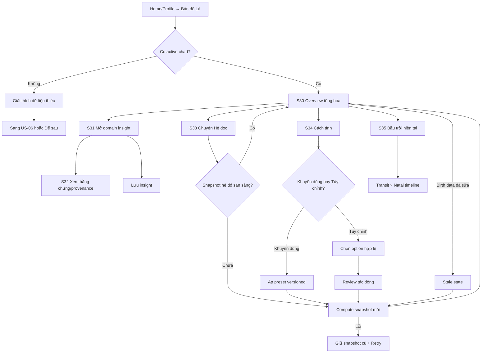

# US-07 — Mở Bản đồ Lá và insight sâu

> Phụ thuộc chuẩn tính toán: [`la-lanh-astro-engine-spec.md`](../foundation/la-lanh-astro-engine-spec.md). Nếu tài liệu này và mô tả cũ trong PRD/SRS mâu thuẫn về cách tính chart, engine spec được ưu tiên cho US-07 trở đi.
>
> Design reference Direction 2: [`us07-ban-do-la.png`](../design-directions/us07-us09-cosmic-glass-signal-2026-09-04/us07-ban-do-la.png) và bản S31 đã chọn [`us07-moon-field-notes-selected.png`](../design-directions/us07-us09-cosmic-glass-signal-2026-09-04/us07-moon-field-notes-selected.png). Hành vi/state/validation trong tài liệu vẫn là contract ưu tiên.

## 1. User story

Là người đã bổ sung giờ và nơi sinh chính xác, tôi muốn mở **Bản đọc Natal** tổng hòa từ toàn bộ natal chart và bầu trời hiện tại, đồng thời chuyển được giữa Western Tropical và Jyotish Sidereal, để hiểu vì sao một kiểu tình huống hay chạm đúng mình, pattern nào thường lặp lại và mình đang học cách phản ứng khác đi ở đâu — không bị biến thành một danh sách Sun/Moon/Venus/Mars rời rạc.

## 2. Mục tiêu và ranh giới

### Mục tiêu

- Dùng toàn bộ dữ kiện đủ điều kiện: hành tinh, điểm góc, nhà/bhava, góc chiếu/drishti, retrograde/station, chart ruler, phân bố nguyên tố–tính chất và transit × natal.
- Cho phép chuyển **Hệ đọc** (`Western`/`Jyotish`) và **Cách tính** (`Khuyên dùng`/`Tùy chỉnh`) mà không tráo nhãn trên cùng một snapshot.
- Progressive disclosure: đọc overview trước, mở bằng chứng sau; không dump chart kỹ thuật vào Home.
- Phân biệt dữ kiện tính toán, lớp xếp hạng và câu diễn giải; AI không được tự tính vị trí hành tinh.
- Giữ app-first, Cosmic Glass Signal, một font Be Vietnam Pro và light/dark đồng nhất.

### Trong phạm vi

Bản đồ Lá; overview tổng hòa; domain detail; evidence/provenance; natal/transit/transit×natal; Western/Jyotish switch; guided/custom calculation settings; precision/uncertainty; save insight; refresh/recompute; stale/error/offline; edit birth-data handoff.

### Ngoài phạm vi

- Thu thập/sửa dữ liệu sinh: US-06.
- Synastry/composite hai người: US-12/13 và engine spec.
- Dasha đầy đủ, D9/Navāṁśa và predictive timeline chuyên sâu: engine hỗ trợ contract nhưng UI launch đặt sau feature flag.
- Chẩn đoán, lời khuyên y tế/pháp lý/tài chính, khẳng định định mệnh hoặc tính khoa học của chiêm tinh.

## 3. Actor, điều kiện và đầu ra

- **Actor:** guest hoặc account user có active chart snapshot từ US-02/06.
- **Entry:** Home unlock card `Bạn có muốn hiểu mình hơn?`, màn hoàn tất giờ/nơi sinh, Profile → Bản đồ Lá, provenance của Daily Note, hoặc deep-link nội bộ `/natal`.
- **Minimum:** Level 1 vẫn xem overview giới hạn và phần nào bị khóa; Level 3 exact mới mở đầy đủ angles/houses.
- **Product success:** sau khi đọc overview, user diễn đạt được 1–2 khuynh hướng nổi bật, yếu tố nào làm Lá đọc như vậy và đâu là lớp “lúc này” thay vì natal. Interaction events chỉ là proxy, không được dùng thay cho comprehension test.
- **Validation target:** trong moderated usability test trước release, ≥80% người tham gia trả lời đúng ba câu: “nét nổi bật là gì?”, “đó là natal hay transit?”, “bấm đâu để xem vì sao”; không cần hiểu thuật ngữ chiêm tinh.
- **Đầu ra:** `ChartViewPreference`, `ReadingSnapshot`, `ReadingClaim[]`, `InsightSave`, audit provenance.

## 4. User flow đầy đủ

## 5. Đặc tả UI/UX

### S30 — Bản đồ Lá overview

| Thành phần | Loại | Nội dung/hành vi |
|---|---|---|
| Header | Native navigation | Back, “Bản đọc Natal”, Save/Share chỉ khi artifact an toàn đã có. |
| Promise | Hero copy | `Bạn có muốn hiểu mình hơn?` + pattern/tình huống/bài học có thể đối chiếu; không nói chart gây ra sự kiện hay viết sẵn số phận. |
| Hệ đọc | Segmented control | `Western` / `Jyotish`; 44px; giữ vị trí scroll/domain tương đương khi switch. |
| Cách tính | Compact chip | `Khuyên dùng` hoặc tên custom; mở S34, không nhồi option ở overview. |
| Aura | Hero signal | `Aura · <3–5 chữ>` do engine v2 trả về từ toàn chart; không client-side suy diễn. |
| Tóm tắt | Opaque reading card | 2–3 câu synthesis, tối đa 420 ký tự, có nút “Vì sao Lá đọc vậy?”. |
| Domain bento | 4–5 cards | `Bản chất`, `Cảm xúc`, `Kết nối`, `Động lực`, `Lúc này`; mỗi card có một headline + 1 evidence chip. |
| Precision | Status row | `Đầy đủ`, `Gần đúng`, `Giới hạn`; tap để xem dữ liệu nào ảnh hưởng. |
| Locked layer | Quiet card | Nếu chưa có giờ và nơi sinh exact, không render bản full; nói rõ thiếu gì, `Mở lớp sâu` sang US-06 và `Để sau`. |

Không hiển thị cùng lúc cả 12 nhà và mọi aspect. Overview chỉ lấy 4–6 `ReadingClaim` có salience cao, không trùng ý, phủ tối thiểu ba domain nếu dữ liệu cho phép.

### S31 — Domain detail

| Thành phần | Loại | Quy tắc |
|---|---|---|
| Headline | Reading title | Một insight cụ thể bằng ngôn ngữ đời thường, không gắn nhãn tốt/xấu tuyệt đối. |
| Reading chapters | Single-open accordion | `Bản năng`, `Vùng nhạy`, `Món quà`, `Gợi ý`; chương đầu mở sẵn, mỗi chương trả lời một câu hỏi rõ và không lặp ý. |
| Everyday examples | Lightweight rows | Nêu biểu hiện có thể gặp trong tình cảm/xung đột; dùng ngôn ngữ xác suất, không chẩn đoán. |
| Evidence | Disclosure cuối reading | Western: sign + house đủ điều kiện + tối đa hai aspect gần nhất. Jyotish dùng vocabulary riêng. Raw longitude chỉ xuất hiện sau khi user chủ động mở. |
| “Đang diễn ra” | Time card | Chỉ có khi transit active; start/peak/end hoặc `đang tiến gần/chính xác/đang tách`. |
| Confidence | Inline trong evidence | `Cao`, `Vừa`, `Giới hạn`; không cạnh tranh với nội dung đọc. |
| Safety boundary | Quiet footnote | Một câu ngắn sau reading; không lặp thành card/banner ở mọi section. |
| Actions | Buttons | `Đọc chương tiếp theo`, `Lưu`; `Xem dữ kiện` nằm trong reading. Feedback taxonomy là iteration sau. |

### S32 — Bằng chứng và provenance

Hiển thị read-only: tradition, zodiac, ayanāṁśa nếu sidereal, house system, node mode, aspect model, ephemeris/config/content versions, thời điểm tính, data precision và các factor IDs đóng góp cho claim. Không hiển thị raw DOB/time/coordinates ở shareable surface.

### S33 — Switch Hệ đọc

- “Hai lăng kính, hai quy tắc đọc”; không nói hệ nào đúng hơn.
- `Western Tropical`: tropical zodiac; outer planets trong core; Western aspects; house preset Whole Sign cho tính năng tự động.
- `Jyotish Sidereal`: sidereal Lahiri; classical grahas + Rahu/Ketu; whole-sign Rāśi; graha drishti; outer planets tắt khỏi core.
- Lần switch đầu có sheet giải thích vì sao cung/nhà có thể đổi.
- Switch không sửa birth data và không làm mất snapshot hệ còn lại.
- State machine: `current` → `requested` → `computing` → `current(new)` hoặc `failed(old)`. Trong `computing`, segmented control vẫn đánh dấu hệ **đang hiển thị**; hệ được yêu cầu có spinner + text “Đang chuẩn bị Jyotish”, không đổi label trước khi snapshot mới activate. Disable duplicate switch, có `Hủy` nếu job chưa commit.
- Khi success, cập nhật control và content atomically, đặt focus vào heading overview mới và live-announce “Đã chuyển sang …”. Khi fail, giữ control/content ở hệ cũ, focus error banner, announce lỗi + Retry; không để Western content dưới nhãn Jyotish.
- Tại 200% text, segmented control được phép chuyển thành hai-row radio cards; accessible name bao gồm hệ đang chọn, trạng thái busy/error không chỉ biểu diễn bằng màu/spinner.

### S34 — Cách tính

| Field | Loại | Giá trị/validation |
|---|---|---|
| `calculation_mode` | Radio | `recommended`, `custom`; required. |
| `zodiac_basis` | Read-only theo hệ | Western=`tropical`; Jyotish=`sidereal`; không cho hybrid ở launch. |
| `ayanamsha` | Select, Jyotish custom | `lahiri` mặc định; `raman`, `krishnamurti` advanced; đổi phải recompute. |
| `house_system` | Select | `whole_sign` mặc định; Western custom thêm `placidus`, `equal`; Placidus cần exact time/place. |
| `node_mode` | Select | `true` mặc định product hoặc `mean`; luôn hiện trong provenance. |
| `aspect_model` | Read-only theo hệ | Western aspects hoặc Jyotish graha drishti; không trộn ngầm. |
| `outer_planets_layer` | Toggle | Western on; Jyotish off mặc định; nếu bật ghi `modern_overlay`. |
| Apply | CTA | Có review diff trước recompute; disabled nếu combination không hỗ trợ. |

### S35 — Bầu trời hiện tại

- Timeline theo múi giờ user, nhưng vị trí transit được tính tại instant UTC cụ thể.
- Nhóm `Hôm nay`, `Đang lên`, `Dài hạn`; không coi Moon và Pluto có cùng duration/priority.
- Mỗi transit nối tới natal factor thật và có orb/applying/exact/separating.
- Không có exact time/place thì không hiển thị transit-to-house; chỉ dùng planet-to-natal-planet đủ confidence.

## 6. Business rules

1. Snapshot Western và Jyotish độc lập, immutable, cùng tham chiếu một `birth_input_version`.
2. Đổi preset/ayanāṁśa/house/node/aspect model tạo `calculation_config_hash` mới; không sửa snapshot cũ.
3. `ReadingClaim` chỉ sinh từ `DerivedFactor`; LLM chỉ verbalize schema đã khóa.
4. Mỗi claim có ít nhất một factor provenance; claim mạnh cần hai factor không trùng nguồn hoặc một factor cấp cao được duyệt.
5. Salience xét angularity, exactness, repetition, rulership, transit duration, domain relevance và confidence; không chỉ lấy orb nhỏ nhất.
6. Không đủ dữ liệu thì giảm scope, không nội suy House/Rising như fact.
7. Approx time được tính theo interval/ensemble; chỉ factor ổn định trên ngưỡng cấu hình mới công bố.
8. Save lưu immutable `reading_snapshot_id`; không rewrite khi content/chart version mới.
9. Không dùng insight để ra quyết định high-stakes; copy mang tính phản chiếu, không định mệnh.

## 7. Data/API contract

| Field | Type | Required | Validation |
|---|---|---|---|
| `chart_snapshot_id` | opaque UUID | Có | Owner/session authorized. |
| `tradition` | enum | Có | `western_tropical`, `jyotish_sidereal`. |
| `calculation_mode` | enum | Có | `recommended`, `custom`. |
| `config_hash` | string | Có | Server-derived, immutable. |
| `data_precision` | enum | Có | `date_only`, `time_window`, `exact_time_place`. |
| `reading_snapshot_id` | opaque UUID | Có | Tied to chart+rules+content versions. |
| `domain` | enum | Có | `core`, `emotion`, `relating`, `drive`, `current_sky`. |
| `claims[]` | object[] | Có | 1–6 overview; factor refs non-empty. |
| `factor_refs[]` | opaque IDs | Có/claim | Thuộc cùng chart snapshot. |
| `confidence` | enum+reason | Có | `high/medium/limited`; server-derived. |

Endpoints: `GET/PUT /v1/charts/preferences`; `POST /v1/charts/compute`; `GET /v1/charts/{snapshot_id}`; `POST/GET /v1/readings`; `GET /v1/transits?at=`; `POST/DELETE /v1/insight-saves/{claim_id}`. Tất cả private/owner-scoped; compute/save idempotent.

## 8. Acceptance Criteria chi tiết

- **AC01:** Overview lấy dữ kiện tổng hòa; không dùng Sun/Moon-only shortcut nếu full chart có sẵn.
- **AC02:** Western/Jyotish switch tạo/lấy đúng snapshot riêng và giải thích placement có thể đổi.
- **AC03:** Recommended/custom tách riêng; custom change có preview, validation và recompute.
- **AC04:** Hai hệ dùng đúng preset/aspect semantics; hybrid bị chặn ở launch.
- **AC05:** Full chart có planets, angles, houses, aspects, motion; transit nối transit × natal và có timing.
- **AC06:** Approx/missing data chỉ hiển thị factor ổn định kèm confidence; House/Rising khóa nếu không đủ.
- **AC07:** Mỗi claim truy vết tới factor/config/ephemeris/content versions; AI không tạo fact mới.
- **AC08:** Overview tối đa 6 claim, domain cards nhất quán, evidence progressive disclosure.
- **AC09:** Switch/recompute lỗi giữ snapshot cũ, không blank screen và không hỏng preference.
- **AC10:** Save/feedback idempotent; offline queue không nhân đôi.
- **AC11:** Không raw DOB/time/place/coords trong URL, analytics, share, notification, logs.
- **AC12:** Guest đọc/switch/save cục bộ; login chỉ khi cần sync dài hạn theo US-19.
- **AC13:** Light/dark, 200% text, Reduce Motion/Transparency, screen reader, 44px pass native.
- **AC15:** Async switch không đổi selected label trước atomic activation; busy/success/error được announce và focus đúng.
- **AC14:** Copy không khẳng định khoa học, tiên tri chắc chắn hoặc advice high-stakes.

## 9. Edge cases và solution

| Edge case | Solution |
|---|---|
| Moon/sign đổi trong ngày khi chỉ có DOB | Tính uncertainty window; không ổn định thì không công bố sign cụ thể. |
| Approx time làm Ascendant/house đổi | Chỉ công bố factor stable qua samples; label `Giới hạn`. |
| Placidus lỗi ở vĩ độ cao | Typed error; đề nghị Whole Sign; không fallback âm thầm. |
| Switch Jyotish làm cung đổi | Education sheet + side-by-side “vì sao khác”; không nói chart cũ sai. |
| Custom combination không hợp lệ | Disable Apply, nêu incompatibility; không tạo snapshot. |
| Engine/content version mới | Snapshot cũ vẫn đọc được; banner `Có bản tính mới`. |
| Nhiều transit mâu thuẫn | Synthesis nêu tension; không cherry-pick. |
| LLM timeout/invalid schema | Reviewed deterministic fallback từ selected factors. |
| Offline | Đọc encrypted cached snapshot; không switch sang mode chưa compute. |
| Birth data bị xóa | Revoke/cascade derived private access theo policy. |

## 10. Test matrix tối thiểu

- Golden fixtures Western Tropical/Jyotish Lahiri cho cùng birth input.
- Switch hai chiều; recommended/custom; ayanāṁśa; house systems; True/Mean Node.
- Exact, approximate interval, date-only, DST fold/gap, historical timezone, near-midnight.
- Polar Placidus failure; Whole Sign chỉ sau explicit action.
- Natal, transit, transit×natal; applying/exact/separating; retrograde multi-pass.
- Claim provenance; LLM invalid/hallucinated factor rejection.
- IDOR, cache cross-user, stale operation, duplicate compute/save, deletion cascade.
- Native viewports, dark/light, 200% text, screen reader, reduced motion/transparency.

## 11. Analytics

Cho phép: `insight_overview_viewed`, `insight_domain_opened`, `evidence_opened`, `chart_tradition_switched`, `calculation_mode_opened/applied`, `insight_saved`, với tradition, preset, precision enum, domain và safe error code. Không gửi placement, birth data, coordinates, claim text, factor IDs hoặc IDs raw.

Analytics đo hành vi, không chứng minh user hiểu. Comprehension và trust phải đo bằng usability task/short optional feedback đã aggregate, không thu nội dung chart cá nhân.

## 12. Definition of Done

- S30–S35 và locked/loading/empty/stale/offline/error/retry hoàn chỉnh trong native target; web chỉ companion evidence.
- Western/Jyotish snapshots, recommended/custom settings và provenance hoạt động theo engine spec.
- Overview dùng full eligible factor graph/ranking, không còn dominant-Sun/Moon-only khi full chart tồn tại.
- Uncertainty/gating, versioning, idempotency, rollback, save và deletion pass.
- Security/privacy tests không còn P0/P1; chart data được đối xử như personal data phát sinh.
- Content review tiếng Việt pass cho cả hai hệ; không trộn terminology/aspect semantics.
- AC01–AC15 và AC-GWT-01–08 pass; release evidence không còn `Pending` cho engine license, native privacy/security và golden accuracy.

## 13. Acceptance Criteria — Given/When/Then

- **AC-GWT-01 — Tổng hòa:** Given full active chart, When mở overview, Then claims đến từ nhiều factor đủ điều kiện và mỗi claim có provenance.
- **AC-GWT-02 — Switch thật:** Given Western snapshot, When chọn Jyotish, Then hệ thống lấy/compute sidereal snapshot riêng, không relabel Western.
- **AC-GWT-03 — Custom:** Given user đổi option, When Apply, Then diff được review và snapshot/config hash mới tạo idempotently.
- **AC-GWT-04 — Precision:** Given date-only/approx, When factor thay đổi trong uncertainty interval, Then không trình bày như exact.
- **AC-GWT-05 — Transit:** Given natal snapshot + instant, When mở Current Sky, Then mỗi insight nối transit tới natal với orb/phase/timing.
- **AC-GWT-06 — Failure:** Given recompute/content failure, Then old snapshot vẫn dùng được với retry.
- **AC-GWT-07 — Privacy:** Given private chart/read operation, Then không có birth data hoặc reconstructable chart thoát qua projection không duyệt.
- **AC-GWT-08 — Native/accessibility:** Given native light/dark/accessibility modes, Then toàn flow usable.

## 14. Dependencies và evidence

- **Upstream:** US-01, US-02/06, Astro Engine Spec, reviewed content corpus.
- **Downstream:** US-12/13, US-14–18 dùng factual contracts nhưng không copy calculation.
- **Release blockers:** Swiss Ephemeris license; independent golden validation; Jyotish expert review; native secure storage/deletion.
- **Evidence:** `[Pending] Engine golden suite`, `[Pending] Jyotish content review`, `[Pending] API authorization`, `[Pending] native accessibility`, `[Blocked] Swiss Ephemeris production license`.

## 15. Cosmic Glass Signal contract

Một font **Be Vietnam Pro**. Glass chỉ cho switch/navigation/control; reading cards đủ đục, tối đa hai cấp elevation. Electric lime là signal/action, violet là depth, coral chỉ attention. Không quá một hero, một primary CTA và sáu cards trên viewport; reveal ≤400ms và tắt khi Reduce Motion.
