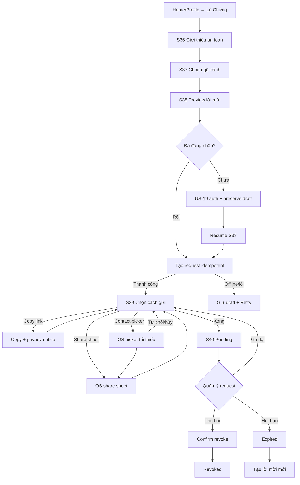

# US-08 — Tạo và gửi lời mời Lá Chứng

> Design reference Direction 2: [`us08-moi-la-chung.png`](../design-directions/us07-us09-cosmic-glass-signal-2026-09-04/us08-moi-la-chung.png). Mockup minh họa S36, S38 và S39; không được suy diễn delivery/read receipt ngoài contract.

## 1. User story

Là người muốn biết một người thân nhìn mình ra sao, tôi muốn tạo, gửi và quản lý một lời mời Lá Chứng ngắn, riêng tư, để người kia có một đường phản hồi an toàn mà không bị buộc cài app hoặc khai dữ liệu sinh.

## 2. Mục tiêu và ranh giới

### Mục tiêu

- Người gửi hiểu trước người nhận sẽ làm gì, nhìn thấy gì và không phải cung cấp gì.
- Chỉ yêu cầu đăng nhập ở bước xác nhận tạo link vì đây là dữ liệu xã hội cần đồng bộ/thu hồi; toàn bộ draft trước đó được giữ khi đi qua US-19.
- Ưu tiên system share sheet/contact picker tối thiểu quyền; không tải toàn bộ danh bạ lên server.
- Link có hạn, thu hồi được, không chứa identifier/birth data và chống đoán/replay.
- Không gây áp lực, không dùng dark pattern “bạn thật sự nghĩ gì về tôi?”.

### Trong phạm vi

Entry; education; chọn quan hệ/context; preview; step-up auth; tạo request; system share/copy; pending list; resend; revoke; expiry; notification-safe state; offline/error/idempotency.

### Ngoài phạm vi

Người nhận chọn câu và submit (US-09); Pitch Card; free text; upload contacts; invite hàng loạt; tự gửi SMS/email từ server; phân tích birth chart của người nhận.

## 3. Actor, điều kiện và output

- **Actor:** guest/account user A có Basic Birth Profile từ US-02.
- **Entry:** Home social seed, Profile → Lá Chứng, empty state hoặc result history.
- **Auth boundary:** guest được hoàn tất S36–S38; tại `Tạo link` chuyển US-19 và resume chính xác draft.
- **Success:** `LaChungRequest=pending`, capability link sẵn sàng; A đã copy link hoặc chủ động bấm `Xong` sau share attempt, rồi thấy status/resend/revoke. Hệ thống không tuyên bố link đã gửi hay được nhận.
- **Output:** request, hashed capability token, expiry, share-attempt metadata tối thiểu, audit event.

## 4. User flow đầy đủ

## 5. Đặc tả UI/UX

### S36 — Intro

| Thành phần | Loại | Nội dung |
|---|---|---|
| Hero | Compact bento | “Một góc nhìn từ người biết bạn.” |
| How it works | 3 steps | Gửi link → bạn chọn 3–5 câu có sẵn → bạn nhận Lá Chứng. |
| Privacy | Opaque note | “Không cần tài khoản, không hỏi ngày sinh, không có ô viết tự do.” |
| CTA | Primary | `Tạo lời mời`; secondary `Để sau`. |

### S37 — Ngữ cảnh lời mời

| Field | Type | Required | Validation |
|---|---|---|---|
| `relationship_context` | Chips | Có | `friend`, `best_friend`, `partner`, `family`, `colleague`, `other`; chỉ dùng chọn bộ statement/copy. |
| `recipient_label` | Text | Không | 1–40 grapheme; tên/nickname để A quản lý request; không đưa vào URL; sanitize control/markup. |
| `sender_display_name` | Text/select | Có | 1–32 grapheme; preview đúng thứ B sẽ thấy; lấy từ profile nhưng sửa được trong giới hạn. |
| `locale` | Select/auto | Có | `vi-VN` launch; server allowlist. |

Không hỏi số điện thoại/email. `recipient_label` private mặc định và không được dùng cho ad/analytics.

### S38 — Preview và disclosure

- Preview chính xác public landing của B: display name A, mục đích, ước lượng `~1 phút`, không hiển thị chart/birth data.
- Disclosure: ai thấy phản hồi; phản hồi có/không hiện tên; thời hạn 7 ngày; A có thể thu hồi link.
- CTA `Tạo link riêng`; với guest, microcopy “Đăng nhập để giữ và thu hồi lời mời này” rồi US-19.
- Back giữ draft; auth cancel quay lại S38, không tạo request.

### S39 — Gửi

| Action | Hành vi |
|---|---|
| `Chia sẻ` | Native share sheet; khi sheet đóng luôn quay lại S39 với `Link đã sẵn sàng`, không suy diễn delivery. |
| `Chọn một người` | Android Contact Picker/iOS picker nếu khả dụng; không xin full `READ_CONTACTS`. |
| `Sao chép link` | Clipboard có toast và cảnh báo ai có link đều có thể mở; không auto-read clipboard. |
| `Xong` | User chủ động sang S40; status vẫn `pending/link_created`, không có `delivered`. |

### S40 — Pending/detail

Hiển thị recipient label private, created/expiry, trạng thái `Chưa phản hồi/Đã phản hồi/Hết hạn/Đã thu hồi`, `Gửi lại`, `Thu hồi`. Launch không theo dõi/hiển thị open/read receipt; `GET` từ người nhận hoặc preview bot không tạo social tracking event.

## 6. Business rules

1. Mỗi request có random token entropy tối thiểu 128 bit; DB giữ token hash để verify và một envelope-encrypted token ciphertext chỉ để owner-authorized resend. Plaintext chỉ tồn tại transient ở creation/resend response; ciphertext bị xóa khi completed/revoked/expired theo retention job.
2. TTL mặc định 7×24 giờ từ server time; expiry không được kéo dài âm thầm khi resend.
3. Retry cùng idempotency key + draft hash trả cùng request/link; tạo mới sau revoke/expire phải explicit.
4. Request owner lấy từ authenticated credential, không tin `owner_id` client.
5. Public token chỉ cấp quyền xem/submit đúng request, không truy cập profile A.
6. Auth required tại create/revoke/history; draft trước auth chứa tối thiểu và phải xóa khi cancel/expire.
7. Không upload/address-book sync. Nếu system picker trả contact target, target chỉ chuyển cho OS share flow và không persist server-side.
8. Share telemetry chỉ ghi method + outcome `sheet_opened/copy`; không ghi app đích/contact/phone/email/link token.
9. Revoke có hiệu lực ngay trên public endpoint và submit đang race phải fail atomic.
10. Rate limit create/resend/public probe; abuse controls không tiết lộ request có tồn tại.

## 7. API/data contract

| Field | Type | Required | Quy tắc |
|---|---|---|---|
| `request_id` | opaque UUID | Server | Private owner route only. |
| `relationship_context` | enum | Có | Allowlist. |
| `recipient_label_ciphertext` | encrypted string | Không | 1–40, owner only, retention-bound. |
| `sender_display_name` | string | Có | Public projection only for valid token. |
| `statement_bank_version` | string | Có | Frozen when request created. |
| `token_hash` | secret hash | Server | Never returned/logged; plaintext token only at creation. |
| `token_ciphertext/key_version` | encrypted secret | Server | Chỉ decrypt trong owner-authorized resend; KMS audit/rotation; no backup/export; purge terminal. |
| `status` | enum | Có | `pending/completed/expired/revoked`. |
| `expires_at` | timestamp | Có | Server clock. |
| `response_count` | integer | Có | 0/1 for launch request model. |

Endpoints: `POST /v1/la-chung/requests`, `GET /v1/la-chung/requests`, `GET /v1/la-chung/requests/{id}`, `POST /{id}/revoke`, `POST /{id}/replacement`. Public preview/submit thuộc US-09. Mutations require CSRF/origin on web, auth, authorization, rate limit and idempotency.

## 8. Acceptance Criteria

- **AC01:** Intro/preview nói rõ B chọn 3–5 câu curated, không cần account/app/birth data.
- **AC02:** Guest hoàn thành draft; auth chỉ tại create và resume không mất field.
- **AC03:** Hủy auth không tạo request và draft có thể tiếp tục/xóa.
- **AC04:** Contact access just-in-time, minimum-scope system picker; denial không chặn share/copy.
- **AC05:** Link random, opaque, TTL 7 ngày; token không ở DB/log/analytics dạng plaintext; resend chỉ decrypt envelope ciphertext sau owner authorization và audit.
- **AC06:** Duplicate tap/retry chỉ tạo một request cho cùng idempotency key/draft.
- **AC07:** Share cancel không được ghi delivered; pending vẫn cho share lại.
- **AC08:** A xem expiry/status, revoke và replacement; revoke chặn preview/submit ngay.
- **AC09:** Không có free text, bulk invite, contact upload hay server-sent SMS/email.
- **AC10:** Native share/deep-link/accessibility/light-dark states pass; web chỉ public companion.
- **AC11:** Analytics/privacy declarations phản ánh contacts/share/link handling thật.

## 9. Edge cases và solution

| Edge case | Solution |
|---|---|
| Double tap tạo link | Disable pending + idempotency key; trả request cũ. |
| Auth thành công nhưng app bị kill | Resume intent server/local secure draft TTL; không tạo duplicate. |
| Share sheet hủy | Quay lại S39, giữ request pending; CTA `Thử cách khác` hoặc `Xong`; không ghi sent/delivered. |
| Clipboard bị app khác đọc | Microcopy caution; link TTL/revoke; không copy thêm PII. |
| Restart/new device rồi resend | Account owner gọi resend; server decrypt token ciphertext qua versioned KMS, trả transient; không gửi ciphertext/plaintext vào logs/cache/backup. |
| Recipient label nhạy cảm | Encrypt/private; không public/notification/analytics; cho edit/delete. |
| Link bị forward | Landing nói “chỉ phản hồi nếu lời mời dành cho bạn”; one-response policy + revoke/report. |
| Token bị brute-force | 128-bit random, hash at rest, uniform 404/410, rate limit/WAF. |
| Revoke và submit cùng lúc | Transaction locks status; chỉ một terminal result. |
| App offline trước create | Draft local encrypted/volatile; create chỉ khi online. |
| Statement bank updated | Request giữ frozen version để preview và response nhất quán. |

## 10. Test matrix

- Guest→auth success/cancel/fail/app-kill resume.
- Create double tap, network timeout, retry, stale idempotency.
- Share sheet open/cancel; copy; picker allow/deny/cancel/unavailable.
- Pending/resend/revoke/expire/replacement; revoke-submit race.
- Token entropy/hash/envelope encryption/KMS audit/terminal purge/log redaction/enumeration/rate limit/IDOR/CSRF; restart/new-device resend.
- Draft/recipient label retention and deletion.
- Native 320/390/430, 200% text, screen reader, dark/light, reduced transparency.

## 11. Analytics

`la_chung_intro_viewed`, `draft_started`, `context_selected`, `preview_viewed`, `auth_handoff`, `request_created`, `share_method_selected`, `share_sheet_opened`, `link_copied`, `request_revoked/expired`. Chỉ context enum/source/safe outcome/age bucket; cấm names, contact info, token/link, request/user IDs raw.

## 12. Definition of Done

- S36–S40, auth resume, all share methods, pending/revoke/expire/replacement và lỗi/offline hoàn chỉnh.
- Capability-link controls, idempotency, authorization, CSRF/origin, rate limit, race tests pass.
- Không full contact permission/upload; native share UX và store privacy disclosures được đối chiếu.
- Retention/delete/redaction cho draft, recipient label, token và analytics có test.
- AC01–AC11 và AC-GWT-01–07 pass; không còn P0/P1 security/privacy.

## 13. Acceptance Criteria — Given/When/Then

- **AC-GWT-01:** Given guest draft, When auth completes, Then S38 resumes exactly once with same safe fields.
- **AC-GWT-02:** Given create retry, When same idempotency key/draft is received, Then one request/token exists.
- **AC-GWT-03:** Given contact picker denied, When user returns, Then share/copy remain available and no contacts are uploaded.
- **AC-GWT-04:** Given share sheet cancelled, Then request remains pending and is not marked delivered.
- **AC-GWT-05:** Given valid link, When token storage/logs are inspected, Then plaintext exists only in user-facing creation response and never DB/log/analytics.
- **AC-GWT-06:** Given revoke/expiry, When any public access/submit occurs, Then uniform safe terminal response is returned.
- **AC-GWT-07:** Given owner history/detail, When another user requests ID, Then server denies without existence leak.

## 14. Dependencies, privacy và evidence

- **Upstream hard prerequisite:** US-02 Basic Profile; US-19 phải có account identity và guest→account claim transaction chuyển ownership của birth profile, draft, request và result mà không đổi logical owner hoặc tạo bản sao. Current guest-only API chưa đáp ứng prerequisite này.
- **Content prerequisite:** StatementBank approved version.
- **Downstream:** US-09 consumes only valid public capability and frozen bank version.
- Treat recipient label, relationship context and social graph as personal data; derive/store only for stated purpose; deletion/retention default 30 days after terminal state unless legal/product policy shortens it.
- Evidence: `[Pending] native picker/share QA`, `[Pending] token penetration tests`, `[Pending] data-retention job`, `[Pending] App Privacy/Data Safety update`.

## 15. Cosmic Glass Signal contract

Một font Be Vietnam Pro. Intro/preview dùng một opaque bento chính; privacy note luôn đọc được, không đặt trên glass trong suốt. Một primary CTA/screen; lime chỉ signal/link-ready, violet cho private state, coral cho expiry/revoke. Không dùng animation gây áp lực hoặc confetti khi “gửi”.
