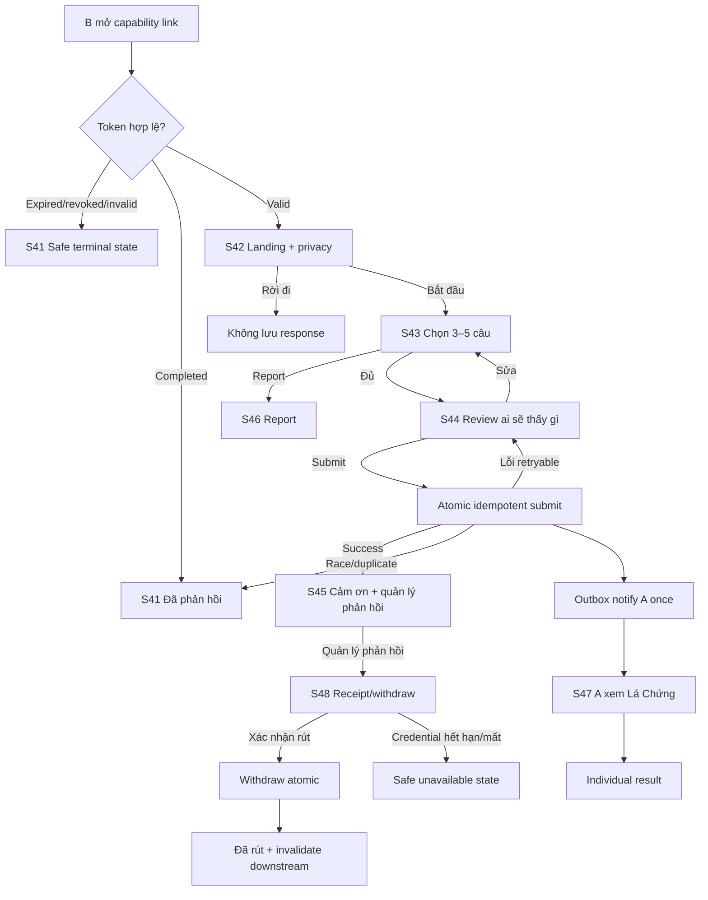

# US-09 — Phản hồi và nhận Lá Chứng

> Design reference Direction 2: [`us09-phan-hoi-la-chung.png`](../design-directions/us07-us09-cosmic-glass-signal-2026-09-04/us09-phan-hoi-la-chung.png). Mockup minh họa S42, S43 và S47; withdrawal S48 và error/terminal states theo contract, không bị lược bỏ vì chưa nằm trên board.

## 1. User story

Là người nhận lời mời B, tôi muốn chọn vài câu an toàn mô tả A mà không cần tài khoản; là A, tôi muốn nhận một Lá Chứng rõ ràng nhưng không xâm phạm quyền riêng tư của B.

## 2. Mục tiêu và ranh giới

### Mục tiêu

- Public companion web mở nhanh từ Universal/App Link, không ép cài app hay đăng nhập.
- B biết ai mời, A sẽ thấy gì, tên B có hiển thị không và có thể rời đi bất kỳ lúc nào.
- Chỉ dùng StatementBank đã moderation; không free text, không birth data, không contact permission.
- Submit một lần, idempotent, chống replay/race; token hết hạn/thu hồi được xử lý an toàn.
- A nhận result trong app theo cách không biến phản hồi thành xếp hạng con người hoặc bằng chứng “chiêm tinh đúng”.

### Trong phạm vi

Token landing; privacy choice; curated selection 3–5; review; submit; receipt; optional app CTA; notification A; individual result; report statement/request; expired/revoked/already-completed/error/accessibility.

### Ngoài phạm vi

Tạo link (US-08); free text/chat; chỉnh StatementBank; account bắt buộc; suy ra chart của B; public leaderboard; dùng response cho matching/ads mà chưa có consent riêng.

## 3. Actor, điều kiện và output

- **B:** người có capability link hợp lệ; có thể anonymous.
- **A:** owner đã đăng nhập của request.
- **Entry B:** HTTPS Universal/App Link vào responsive web; app đã cài có thể mở safe native wrapper nhưng không bắt buộc.
- **Entry A:** push/in-app inbox/Lá Chứng history.
- **Output:** một `LaChungResponse`, request terminal `completed`, one notification/outbox event, owner-safe result projection.

## 4. User flow đầy đủ

## 5. Đặc tả UI/UX

### S41 — Invalid/expired/revoked/completed

- Thông điệp trung tính, không xác nhận token từng thuộc ai khi invalid.
- Expired/revoked không hiển thị display name hoặc request metadata nếu policy chống enumeration yêu cầu.
- Completed hiển thị receipt tối thiểu trên cùng browser proof; không cho submit lại.
- CTA `Đóng` hoặc “Nhờ người gửi tạo link mới” dưới dạng hướng dẫn, không expose contact A.

### S42 — Landing và privacy choice

| Thành phần | Nội dung/hành vi |
|---|---|
| Sender | “Hạnh mời bạn để lại một Lá Chứng”; display name sanitized. |
| Task | “Chọn 3–5 câu có sẵn, khoảng 1 phút.” |
| No ask | “Không cần tài khoản, ngày sinh hay danh bạ.” |
| Visibility | Nêu A sẽ thấy các câu; identity choice ở dưới. |
| `response_identity` | `Ẩn tên` mặc định; `Hiện tên gọi` opt-in + field 1–24 grapheme. |
| CTA | `Bắt đầu`; secondary `Không tham gia`. |

Không fingerprint B cho mục đích nhận diện. Anti-abuse cookie/device signal nếu dùng phải tối thiểu, disclosure và retention riêng.

### S43 — Chọn statement

- 4 nhóm tối đa: `Năng lượng`, `Cách kết nối`, `Điểm đáng tin`, `Khi căng thẳng`.
- Mỗi card một câu 8–80 ký tự; tap target ≥44px; selected state không chỉ dựa vào màu.
- Sticky counter `2/5`; dưới 3 CTA disabled + copy “Chọn thêm 1 câu”; đạt 5 thì các câu khác disabled cho tới khi bỏ chọn.
- Thứ tự statement randomized có kiểm soát theo request để giảm position bias, nhưng ổn định khi refresh.
- Không có “tiêu cực/đáng ghét”; statement về tension phải hành vi-neutral, không diagnosis.

### S44 — Review/consent submit

Hiển thị 3–5 câu, identity mode, “A sẽ thấy đúng các câu này”, privacy link và CTA `Gửi Lá Chứng`. Submit button khóa trong pending. Back không mất selection.

### S45 — Receipt

“Lá Chứng đã được gửi.” Không confetti/pressure. Có action `Quản lý hoặc rút phản hồi` sang S48. `Tìm hiểu Lá Lành`/`Mở app` là optional; không giữ receipt hoặc kết quả làm con tin cho signup. Không auto-subscribe marketing.

### S48 — Anonymous receipt và withdrawal

- Submit success đặt một receipt credential ngẫu nhiên vào cookie `HttpOnly; Secure; SameSite=Strict`, path hẹp, TTL bằng withdrawal window; JavaScript/analytics không đọc được.
- S48 hiển thị statement summary + identity mode, `Rút phản hồi` và expiry, không hiển thị token/request ID.
- Withdraw có confirm rõ tác động, POST body/header credential, atomic/idempotent; success xóa cookie, cập nhật A projection + downstream cache và không cho restore tự động.
- Cookie mất/hết hạn/đã dùng trả safe unavailable state và privacy contact path; không hỏi B tạo account để rút.

### S46 — Report

Reason allowlist: `Không dành cho tôi`, `Tôi không biết người gửi`, `Câu chữ không phù hợp`, `Link đáng ngờ`, `Khác`. “Khác” không có free text ở MVP. Report có rate limit; chọn `Không biết người gửi/Link đáng ngờ` có thể block token/session và đánh dấu abuse review.

### S47 — A xem kết quả

- Một note-like card: identity theo lựa chọn B, timestamp coarse, 3–5 statements.
- Không hiển thị IP/device/channel/contact.
- Launch chỉ hiển thị individual result. Aggregation xuyên nhiều request là downstream profile/social-proof story; nếu được thiết kế phải có k-anonymity và consent/purpose riêng.
- Cross-check với chart chỉ là lớp optional: phải ghi “Lá cũng thấy một nét tương tự” và có provenance; không chấm B đúng/sai.

## 6. StatementBank contract

| Field | Quy tắc |
|---|---|
| `statement_id` | Opaque, immutable per version. |
| `locale/category/text` | Reviewed, unique enough, 8–80 chars, plain text. |
| `valence` | `strength/neutral_tension`; không shame/diagnose. |
| `eligible_contexts` | Allowlist relationship contexts. |
| `moderation_status` | `draft/approved/retired`; public only approved frozen version. |
| `version` | Request pins version; text không thay ngầm sau submit. |
| `safety_tags` | Harassment, mental-health, sexuality, protected-class, appearance; launch excludes risky tags. |

## 7. Business rules

1. B chọn 3–5 unique statement IDs thuộc frozen bank version của request.
2. Identity mặc định anonymous; display alias là explicit opt-in và có thể xóa/ẩn sau report request.
3. Request launch nhận tối đa một response; submit atomic transitions `pending→completed`.
4. Idempotency key/replay proof trả same receipt. Receipt credential được envelope-encrypt để retry sau committed/lost response có thể set lại cookie; payload khác sau completed bị reject.
5. Token validity được kiểm tra server-side trên preview và submit; revoke/expire wins race theo transaction.
6. Public response không nhận owner/request/status IDs ngoài token; server derive all relationships.
7. Transactional outbox bảo đảm at-least-once transport; in-app inbox materialize idempotently theo response ID nên user chỉ thấy một item. Push là best-effort và có provider collapse/dedupe key; không tuyên bố exactly-once qua external provider. Nội dung push chỉ “Bạn có một Lá Chứng mới”.
8. Response không được dùng cho matching, ad targeting hoặc model training nếu chưa có purpose/consent riêng.
9. User A có thể delete/hide result; B có public withdrawal path bằng receipt secret trong retention window mà không cần account.
10. US-09 không aggregate hoặc chấm điểm nhiều response; downstream chỉ nhận privacy-safe input sau contract/consent riêng.

## 8. API/data contract

| Field | Type | Required | Validation |
|---|---|---|---|
| `capability_token` | secret | URL only | ≥128-bit entropy; never analytics/log/storage plaintext. |
| `response_identity` | enum | Có | `anonymous`, `display_alias`. |
| `display_alias` | string | If opt-in | 1–24 grapheme; sanitize; no contact info solicitation. |
| `statement_ids` | array | Có | 3–5 unique, approved, frozen version/context eligible. |
| `idempotency_key` | random string | Có submit | Bound to token/session; retention ≥request TTL. |
| `response_id` | opaque UUID | Server | Private owner; receipt uses separate secret. |
| `submitted_at` | timestamp | Server | Coarsened in A UI if needed. |
| `receipt_secret_hash` | hash | Server | Verifies HttpOnly receipt credential; single-purpose, expiring, never analytics/log. |
| `receipt_secret_ciphertext/key_version` | encrypted secret | Server | Recover same credential on idempotent retry after lost response; KMS-scoped; purge/rotate on withdraw/expiry. |

Endpoints: `GET /public/v1/la-chung/{token}` returns minimal preview + statement bank; `POST /public/v1/la-chung/{token}/responses`; `POST /public/v1/la-chung/receipts/withdraw` receives the receipt secret in request body or a dedicated authorization header, never URL; `POST /public/v1/la-chung/{token}/report`; private `GET /v1/la-chung/results` and `DELETE /v1/la-chung/results/{id}`. Public responses use strict CORS/origin policy, CSP, `Referrer-Policy: no-referrer`, `Cache-Control: no-store`, no third-party trackers, rate limiting and generic errors. Receipt credentials are single-purpose, expiring, rotated/invalidated after use and redacted through CDN/WAF/app logs.

## 9. Acceptance Criteria

- **AC01:** B completes on mobile web/native wrapper without account/app/birth data/contact permission.
- **AC02:** Valid landing explains purpose, visibility, identity default and 3–5 task before start.
- **AC03:** Only 3–5 unique, approved, correct-version statements submit; tampered IDs fail safely.
- **AC04:** Review shows exact statements + identity A will see; back preserves selection.
- **AC05:** Submit idempotent/atomic; refresh/double tap/race cannot create duplicate or alter completed response.
- **AC06:** Expired/revoked/invalid/completed token states do not leak private metadata.
- **AC07:** Signup/install optional after receipt; no result hostage or marketing opt-in.
- **AC08:** A gets one privacy-safe notification and owner-authorized result only.
- **AC09:** Anonymous default and alias opt-in respected end-to-end; no IP/device/contact displayed.
- **AC10:** Không có aggregation/score trong launch US-09; result chỉ theo từng response.
- **AC11:** Report/withdraw/delete paths work and mọi downstream projection/cache được invalidate.
- **AC12:** Token/receipt secrets absent from referrer, analytics, logs, crash reports and third-party scripts.
- **AC13:** Content safety, accessibility, locale, light/dark and mobile reflow pass.

## 10. Edge cases và solution

| Edge case | Solution |
|---|---|
| Link opens in in-app browser blocking storage | Server idempotency; no cookie dependency for core submit. |
| B refreshes after selecting | Session-scoped encrypted/ephemeral draft; no analytics content; clear on submit/expiry. |
| A opens own link | Allow preview but warn “Đây là lời mời bạn đã tạo”; block response by owner auth when detectable; capability security still assumes forwarded links. |
| Two people use same forwarded link | First atomic submit wins; second sees completed, no identity leak. |
| Bank version retired after invite | Existing request may use frozen approved copy unless emergency safety revocation; emergency replacement is explicit. |
| Alias contains phone/email/abuse | Length/sanitize + pattern warning; report/delete; never used as contact channel. |
| Notification failure | Response remains committed; outbox retry dedupes. |
| Withdraw after A read | Mark withdrawn/delete projection và invalidate downstream cache; audit minimal legal record if required. |
| Third-party preview bot consumes link | GET never completes request; submit requires POST + anti-abuse controls; no single-use-on-open. |

## 11. Test matrix

- Valid/invalid/random/expired/revoked/completed tokens; uniform safe responses.
- Selection 0/2/3/5/6, duplicates, tampered IDs/version/context.
- Anonymous/alias, invalid alias, review/back, double submit, changed replay payload.
- Owner self-open, forwarded concurrent users, bot GET, revoke-submit race.
- Notification outbox retry, owner IDOR, delete/withdraw/downstream invalidation.
- CSP/referrer/CORS/no-store cache headers; token/secret redaction across CDN/WAF/app; withdrawal secret absent from URL/browser history; no third-party analytics.
- 320/390/430px, screen reader, keyboard, 200% text, contrast, dark/light, reduced motion.

## 12. Analytics

Public analytics ưu tiên aggregate server counters: `landing_valid_bucket`, `selection_started`, `review_reached`, `response_submitted`, `report_reason`, `terminal_state`. Không đặt third-party tracker/cookie trên capability route. Cấm token, request/response IDs, alias, statements, sender name, IP/device fingerprint in product analytics.

## 13. Definition of Done

- S41–S47 và all public/private states hoàn chỉnh; B không cần account/app.
- StatementBank moderation/versioning, selection validation, atomic idempotent submit và safe terminal states pass.
- Inbox exactly-once materialization, outbox at-least-once retry, push best-effort dedupe, owner authorization và report/withdraw/delete/downstream invalidation tested.
- CSP/no-referrer/cache-control/CORS/rate-limit/secrets redaction pass; không P0/P1.
- Store/web privacy disclosures phản ánh public companion + native result thật.
- AC01–AC13 và AC-GWT-01–08 pass; content safety review không còn blocker.

## 14. Acceptance Criteria — Given/When/Then

- **AC-GWT-01:** Given valid token, When B opens link, Then only minimal sender/task/privacy/bank projection appears without auth.
- **AC-GWT-02:** Given fewer than 3 or more than 5/tampered selections, When submit, Then server rejects without state transition.
- **AC-GWT-03:** Given valid review, When response commits but HTTP success is lost and B retries, Then exactly one response/inbox item exists and the same withdrawal credential cookie is restored.
- **AC-GWT-04:** Given revoke/expiry/concurrent first response, When submit races, Then only valid atomic transition wins and no private data leaks.
- **AC-GWT-05:** Given anonymous default or alias opt-in, When A views result, Then identity projection matches consent exactly.
- **AC-GWT-06:** Given any number of completed invitations, When A views US-09 results, Then every response remains individual and no aggregation/score appears.
- **AC-GWT-07:** Given receipt withdrawal/owner deletion, When completed, Then public/private projection and downstream cache update per retention policy.
- **AC-GWT-08:** Given logs/referrer/analytics/cache inspection, Then capability/receipt secrets and response content are absent.

## 15. Dependencies, privacy và evidence

- **Upstream:** US-08 valid request/token + frozen StatementBank; US-19 account owner.
- **Infrastructure hard prerequisite:** transactional outbox + dispatcher + in-app inbox. Native push là channel thêm khi app target sẵn sàng; nếu push chưa có, authenticated polling/inbox là launch fallback hợp lệ, nhưng submit vẫn phải commit outbox atomically và dedupe delivery.
- **Downstream:** A future profile social-proof story may define privacy-safe aggregation with k-anonymity; it cannot turn responses into a matching score without new consent/product contract.
- Retention default: public draft until submit/expiry; token metadata 30 days after terminal for abuse/audit then delete/anonymize; response until A/B deletion or account retention policy. Legal review may tighten these values.
- Evidence: `[Pending] content safety sign-off`, `[Pending] public-route penetration test`, `[Pending] anonymous withdrawal QA`, `[Pending] notification/outbox QA`, `[Pending] privacy declarations`.

## 16. Cosmic Glass Signal contract

Một font Be Vietnam Pro. Public route nhẹ hơn app nhưng cùng tokens: nền mist/dark cosmic, một opaque task card, selected signal lime, no heavy glass layers. Counter/validation luôn bằng text + icon, không chỉ màu. Không confetti, countdown gây áp lực hoặc animation che disclosure.
