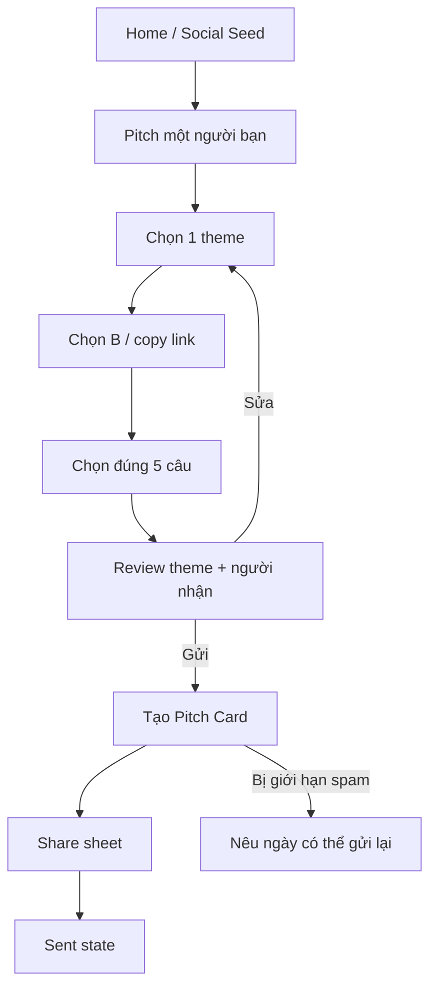

# US-10 — Tạo và gửi Pitch Card

## User story

Là người muốn giới thiệu một bạn độc thân, tôi muốn chọn một theme và 5 câu mô tả họ, để gửi một Pitch Card đủ tò mò nhưng không viết tự do.

## Phạm vi

**Bao gồm:** chọn theme; chọn B; chọn đúng 5 statement; preview cơ chế; gửi link; trạng thái sent.

**Không bao gồm:** B reveal/accept (US-11); matching cohort (US-15); Lá Chứng.

## Điều kiện và kết quả

- Tiền điều kiện: A có Basic Profile; ThemeBank/StatementBank active. Guest được chọn theme/target/statements trước, chỉ chạy US-19 khi xác nhận gửi và không mất draft.
- Kết quả: `PitchCard=sent` và link được chia sẻ.

## User flow đầy đủ

## Acceptance Criteria

- **AC01:** Chỉ theme active được chọn và mỗi theme có mô tả rõ kỳ vọng tham gia.
- **AC02:** A phải chọn đúng 5 câu curated; không có text tự do.
- **AC03:** Review không hứa B chắc chắn tham gia và cho A sửa trước gửi.
- **AC04:** Sau khi gửi, nội dung 5 câu không được A chỉnh; chỉ có thể hủy trước khi B xem nếu policy cho phép.
- **AC05:** Nếu B từng decline card của A, A không gửi lại cho B trong 14 ngày.
- **AC06:** Link unique, không lộ câu đã chọn và hoạt động trên web.
- **AC07:** Hủy share không tự đánh dấu “delivered”; cho copy/gửi lại từ sent state.

## Definition of Done

- Theme, target, statement selection, review, share, sent, resend-limit và failure states hoàn chỉnh.
- Rate limit theo pitcher-target và audit trail chống spam.
- Analytics: `pitch_started`, `theme_selected`, `pitch_created`, `pitch_shared`.
- Test inactive theme giữa flow, duplicate target, share cancel, blocked target và 14-day rule.
- Copy giống lời nhắn bạn thân, không giả notification cá nhân nếu không có sender context.
