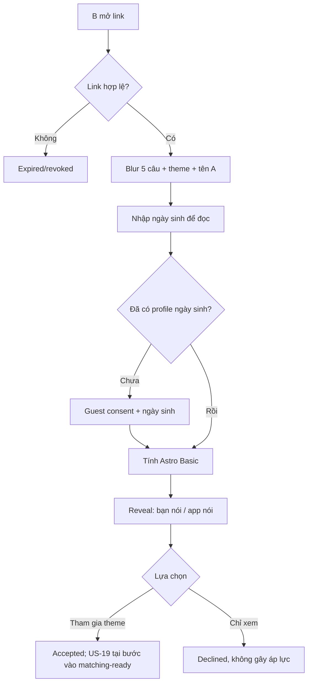

# US-11 — Mở và phản hồi Pitch Card

## User story

Là người được bạn pitch, tôi muốn xem bạn nói gì về mình và so với Lá Khai Sinh, rồi tự chọn có tham gia theme hay chỉ xem.

## Phạm vi

**Bao gồm:** blurred landing; guest consent/birth date nếu cần; reveal Pitch + Astro Basic cạnh nhau; accept/decline; auth chỉ khi B muốn bước vào matching.

**Không bao gồm:** tạo Pitch (US-10); chuẩn bị matching-ready (US-14); tham gia Vòng Lá thực tế (US-15).

## Điều kiện và kết quả

- Tiền điều kiện: Pitch Card sent, link hợp lệ.
- Kết quả: card viewed và status accepted/declined; guest Basic Profile được tạo nếu B mới; account chỉ tạo qua US-19 khi B chọn hành động cần identity.

## User flow đầy đủ

## Acceptance Criteria

- **AC01:** B thấy preview giá trị trên web trước khi bị yêu cầu tải app.
- **AC02:** Nếu cần ngày sinh, guest consent US-01 áp dụng và không hỏi giờ/nơi sinh hoặc bắt auth trước reveal.
- **AC03:** Reveal đặt 5 câu của A và Astro Profile Basic gần nhau để so sánh được.
- **AC04:** B luôn có hai lựa chọn ngang giá trị thị giác: tham gia hoặc chỉ xem.
- **AC05:** Decline không gửi copy gây xấu hổ cho A; chỉ cập nhật trạng thái cần thiết.
- **AC06:** Accept không tự đưa B vào matching pool; chỉ mở lối sang US-14.
- **AC07:** Link refresh sau reveal giữ trạng thái, không bắt nhập lại.

## Definition of Done

- Web/app deep link, guest consent, date validation, reveal, accept/decline và restore state hoàn chỉnh.
- Test B cũ/mới, invalid link, A blocked, decline, duplicate open và cross-device continuation.
- Analytics funnel: `pitch_landing_viewed`, `reveal_started/completed`, `accepted/declined`.
- Birth data được xử lý theo consent và bảo mật của US-01/02.
- Không có auto-enrollment hoặc prechecked consent vào matching.
