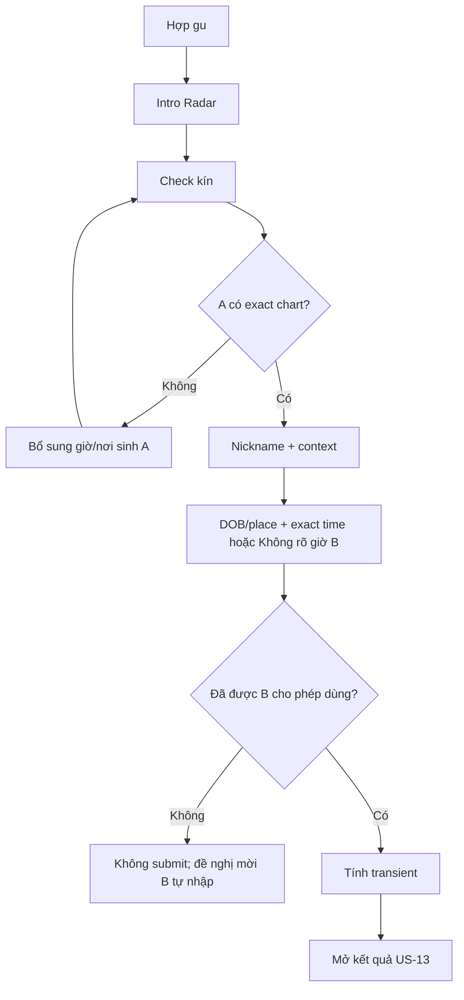

# US-12 — Check kín một người đã biết

## User story

Là người đang tò mò về một mối quan hệ có thật, tôi muốn tự nhập thông tin sinh mà người ấy đã cho phép tôi sử dụng để xem hai chart bắt sóng ở đâu, không cần gửi link hay làm phiền họ.

## Scope

**Bao gồm:** intro; owner/session gate; exact chart của A; nickname/context; DOB/place của B; giờ exact hoặc `Không rõ giờ`; permission attestation; transient chart B; synastry/composite theo precision; encrypted minimized result; history; delete; 30-day expiry; fallback invite.

**Không bao gồm:** lưu raw B birth data; tạo profile B; contact upload; GPS; pool/discovery; Vòng Ghép; scoring; chat; notification; dùng cho marketing/training.

## User flow

## UI, validation và feedback

| UI | Validation | Edge feedback |
|---|---|---|
| Nickname | 1–40 chars sau trim/collapse | Không chấp nhận rỗng; không yêu cầu tên thật |
| Context chips | một trong 4 enum | Không suy ra context từ chart |
| Birth date | valid ISO date; age 18–120 | “Radar hiện chỉ dành cho người trưởng thành” |
| Birth-time mode | `Biết giờ` / `Không rõ giờ` | `Biết giờ` mở native time picker; `Không rõ giờ` không ép người dùng đoán |
| Exact time | 00:00–23:59, chỉ khi `Biết giờ` | Nếu unknown: loại Moon B, Rising, House, overlays và mọi conclusion phụ thuộc giờ; UI nói rõ precision giảm |
| Place autocomplete | query ≥2 chars; chọn đúng local result | Không cho submit chuỗi chưa chọn; không tự đoán |
| Permission checkbox | bắt buộc true | Nói rõ “đã cho phép dùng thông tin sinh”, không dùng từ pháp lý mơ hồ |
| CTA | chỉ bật khi đủ field + selected place + checkbox | Loading khóa double tap |
| Privacy note | luôn ở trước CTA | “Raw input chỉ dùng trong lúc tính; không tạo profile” |
| Fallback | text CTA dưới gate | `Mời họ tự nhập`; không cạnh tranh với primary CTA |

## Acceptance Criteria

- **AC01:** Primary route `/radar/start` không tạo/gửi link và không thông báo cho B.
- **AC02:** A tự nhập DOB/time/place của B nhưng chỉ khi tick attestation version `radar-authorized-input-v1`; UI và API cùng enforce.
- **AC03:** Radar table/schema không có field raw B DOB/time/place/place coordinates; request body không đi vào URL/browser storage/analytics.
- **AC04:** Backend tính chart B transient từ local place allow-list; invalid/under-18 input fail trước persistence.
- **AC05:** A phải có exact chart Level 3; nếu thiếu trả 409 và quay đúng về US-06.
- **AC06:** Chỉ nickname, context, attestation timestamp/version và minimized result được lưu; nickname/result mã hóa bằng context riêng.
- **AC07:** Kết quả không chứa raw birth fields, tọa độ hoặc compatibility score.
- **AC08:** Result owner-bound, xóa được ngay và không đọc được sau 30 ngày.
- **AC09:** Rời form làm mất raw input; không có draft tự động.
- **AC10:** Nếu không có permission, CTA private không có bypass và fallback là `/radar/invite` để B tự nhập/consent.
- **AC11:** `birth_time_mode=unknown` phải gửi `birth_time_local=null`; API từ chối tổ hợp ngược. Kết quả ghi `time_precision=unknown`, không chứa Moon/Rising/House/evidence phụ thuộc giờ của B và không giả giờ 12:00 là giờ sinh thật.

## Definition of Done

- Direct flow chạy E2E trên web reference và mapping được sang app-native.
- API tests chứng minh permission gate, age/place validation, transient input non-persistence, encryption, owner isolation và delete.
- UI test chứng minh `Check kín` là primary, invite là secondary và CTA disabled khi chưa attest.
- Docs/data map/store disclosure được cập nhật.
- Public release chưa pass nếu thiếu log/APM redaction audit, physical purge, legal review và native device QA.
