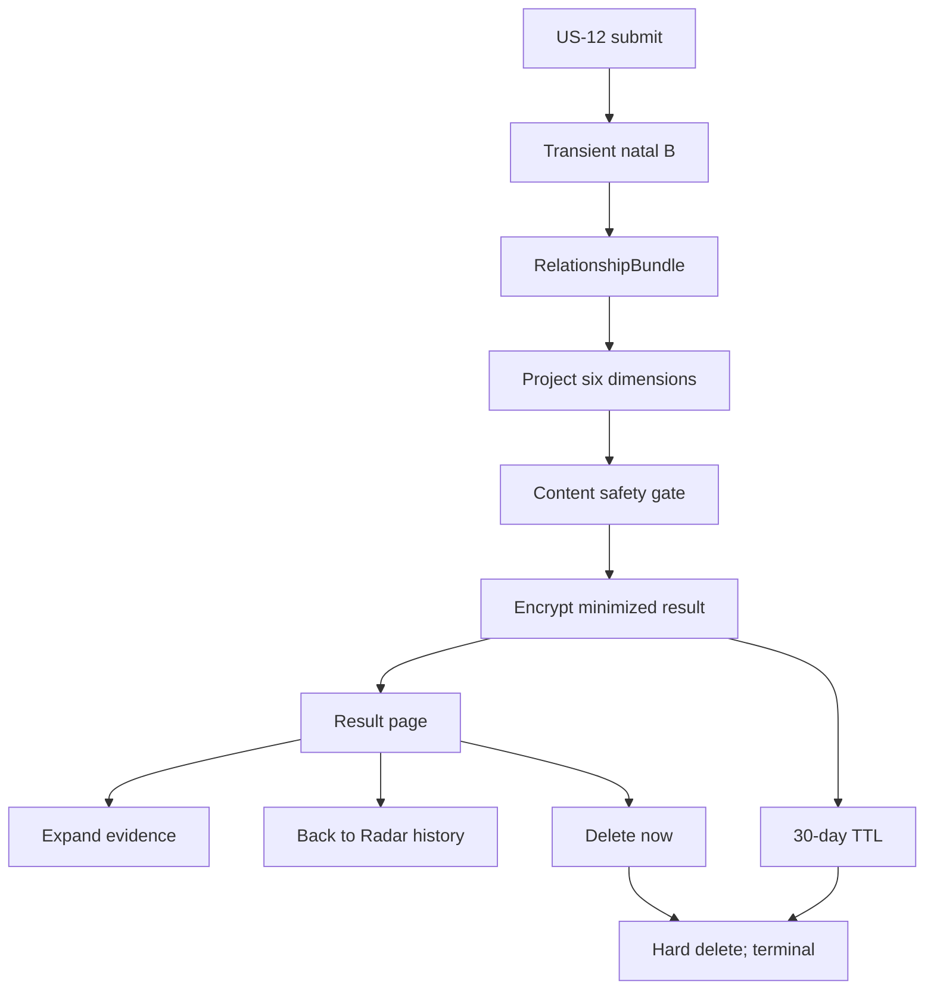

# US-13 — Đọc và quản lý kết quả Radar

## User story

Là người vừa check một kết nối, tôi muốn hiểu cụ thể hai chart chạm nhau ở đâu, chỗ nào đáng thử kiểm chứng và có thể xóa kết quả khi không còn muốn giữ.

## Output contract

Radar trình bày tối đa sáu chiều độc lập: giao tiếp, cảm xúc, cách gắn kết, nhịp hành động, điểm mở và chỗ dễ cấn. Mỗi chiều có nhãn đời thường, tín hiệu định tính, giải nghĩa conditional và evidence IDs trong progressive disclosure.

Không có compatibility %, rank, pass/fail, soulmate, red flag, “người ấy đang nghĩ gì”, “nên yêu/chia tay”, suy ra fidelity/sexuality/consent/safety hoặc lời xúi giục thử lòng.

## Flow

## Acceptance Criteria

- **AC01:** Result headline/summary describe interaction hypotheses, not verdicts about a person.
- **AC02:** At least one dimension is rendered; ordering comes from strongest evidence, not random copy.
- **AC03:** Evidence disclosure can show planet/aspect/orb facts but never raw DOB/time/place/coordinates.
- **AC04:** `scalar_score_eligible=false` remains a hard engine invariant and UI has no hidden score.
- **AC05:** Disclaimer stays near reading and states this is not proof of intent, consent, compatibility or safety.
- **AC06:** Owner can reopen only own unexpired result; guessed/foreign/expired/deleted ID fails uniformly.
- **AC07:** Delete requires trusted Origin + guest CSRF + owner session and physically removes the Radar row.
- **AC08:** History only shows encrypted label after server decryption, status and TTL copy; never raw input.
- **AC09:** Engine or content-gate failure leaves no partial row or input artifact.
- **AC10:** Invite fallback continues to require B's separate pair consent and withdrawal rights.

## Definition of Done

- Result page, history, reopen and delete verified on mobile viewport.
- Relationship engine tests and content safety tests pass; no mock result in runtime.
- Privacy test inspects schema and payload for absence of B raw fields.
- Scheduled physical purge is required before public production even though read access already expires at 30 days.
