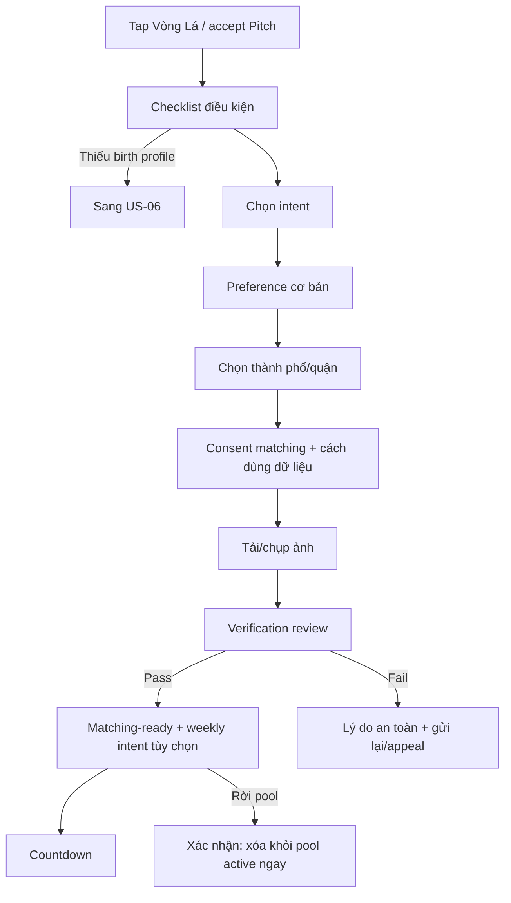

# US-14 — Chuẩn bị profile matching-ready

> **DEFERRED — ngoài active MVP từ 2026-09-20.** Không được nối route/CTA này vào Radar hợp gu. Tài liệu được giữ làm backlog cho discovery sau một review security/privacy mới.

## User story

Là người muốn vào Vòng Lá, tôi muốn hoàn thiện intent, khu vực và ảnh xác minh với quyền kiểm soát rõ, để được ghép an toàn và đúng mục đích.

## Phạm vi

**Bao gồm:** eligibility checklist; intent cứng; preference cơ bản; thành phố/quận; ảnh/xác minh; consent matching; weekly intent tùy chọn; join/leave active pool.

**Không bao gồm:** compute 5 gợi ý (US-15); request/mutual (US-16); giờ/nơi sinh nền (US-06).

## Điều kiện và kết quả

- Tiền điều kiện: profile Level 3; đủ tuổi theo policy.
- Kết quả: Level 4+, matching consent active và `MatchingPoolMember` eligible; hoặc saved draft.

## User flow đầy đủ

## Acceptance Criteria

- **AC01:** Chỉ user đủ tuổi, Level 3 và verification pass mới vào pool.
- **AC02:** Intent là lựa chọn chủ động; không suy ra từ Pitch Card hoặc lịch sử hành vi.
- **AC03:** Chỉ lưu/hiển thị thành phố hoặc quận; không hiển thị GPS hay khoảng cách dạng số.
- **AC04:** Consent matching tách riêng, version hóa và giải thích dữ liệu dùng cho ghép.
- **AC05:** Ảnh xác minh có trạng thái pending/pass/fail; fail có lý do an toàn và đường gửi lại/appeal.
- **AC06:** User rời pool bất kỳ lúc nào; intent/region bị xóa khỏi pool active ngay.
- **AC07:** Accept Pitch ở US-11 chỉ dẫn tới flow này, không tự hoàn tất bất kỳ trường nào.
- **AC08:** `weekly_intent` có 4 lựa chọn `Dễ nói chuyện / Đi chậm / Góc mới / Để Lá cân`, có thể bỏ qua và tự hết hạn sau recap; không được suy ra từ hành vi.
- **AC09:** Thay weekly intent không mở rộng age/intent/region hard preference và có hiệu lực từ pool chưa publish kế tiếp.

## Definition of Done

- Eligibility, intent, preference, region, consent, photo upload/review, retry/appeal, weekly intent, ready và leave-pool hoàn chỉnh.
- Kiểm thử age gate, permission, upload lỗi, moderation timeout và consent withdrawal.
- Ảnh và matching data có access control/retention policy; không expose tọa độ chính xác qua API.
- Analytics: `matching_readiness_started`, step completion, `verification_pass/fail`, `pool_joined/left`.
- Runbook moderation và SLA report/review 24h được phê duyệt trước launch.

## Canonical delta — Readiness Control Deck (2026-09-18)

Phần này thay checklist/form dài trên main Vòng Lá bằng một control deck theo trạng thái. Điều kiện eligibility, consent và verification không đổi.

### Main surface

- `/vong-la` là intro/value page trước mọi owner gate và form: giải thích năm lá úp, lợi ích thực tế, ba bước vận hành và privacy promise; CTA duy nhất `Tạo hồ sơ ghép` dẫn tới `/vong-la/setup?start=profile`, claim owner/device nền sau explicit tap và mở thẳng profile sheet nếu chưa có profile.
- Hiển thị progress năm chốt và số lượng server xác nhận hoàn tất.
- Chỉ gọi tên blocker ưu tiên hiện tại và đúng một primary CTA.
- Thứ tự canonical: stable identity → đủ 18 → birth profile Level 3 → matching profile → matching consent → photo verification → join pool.
- Danh sách đủ năm chốt nằm trong disclosure `Xem đủ 5 điều kiện`; FE không dựa vào thứ tự array từ API và không tự tính completion.
- Nếu profile đã tồn tại, main chỉ hiển thị receipt gọn gồm tên, intent, khoảng tuổi, thành phố và action `Sửa`.

### Scoped sheets

- `Tạo hồ sơ ghép`/`Sửa` mở profile sheet; main không render form inline.
- Profile sheet luôn có CTA sticky `Lưu hồ sơ ghép`/`Lưu thay đổi` trong viewport khi cuộn; không dùng nhãn mơ hồ như `Giữ lựa chọn`.
- Dismiss profile có thay đổi chưa lưu phải cho chọn `Tiếp tục chỉnh` hoặc `Bỏ thay đổi`; không ghi partial profile.
- Consent sheet chỉ mở khi là blocker hoặc user chủ động quản lý quyền; không auto-grant.
- Verification sheet hiển thị `not_started/pending/pass/fail` theo server. Khi provider thật chưa nối, review build phải fail closed, nói rõ giới hạn và không có upload/pass giả.

### Acceptance Criteria bổ sung

- **AC10:** Given thiếu nhiều chốt, When main render, Then chỉ blocker sớm nhất có primary CTA; các chốt sau không cạnh tranh hành động.
- **AC11:** Given checks từ API bị đảo thứ tự, When derive next action, Then UI vẫn theo canonical order nhưng completion giữ nguyên từ từng server check.
- **AC12:** Given profile sheet hợp lệ, When save thành công, Then sheet đóng, readiness refetch, receipt xuất hiện và CTA chuyển sang blocker kế tiếp.
- **AC13:** Given draft chưa lưu, When dismiss, Then app yêu cầu xác nhận bỏ; cancel giữ nguyên draft và không gọi API.
- **AC14:** Given verification `pending` hoặc `fail`, When main render, Then progress không pass và join bị khóa; không có review bypass.
- **AC15:** Given 390×844, When Vòng Lá render, Then promise compact, progress, blocker và primary CTA nằm trong usable first viewport; profile/consent/verification detail chỉ xuất hiện sau action.
- **AC16:** Given user mở `/vong-la`, When chưa chọn bắt đầu, Then chưa gọi owner/readiness mutation và user hiểu được ba lợi ích, flow mutual kín và giới hạn dữ liệu trước CTA setup.
- **AC17:** Given profile form dài hơn viewport, When user cuộn ở bất kỳ vị trí nào, Then CTA lưu có tên rõ, luôn nhìn thấy, phản ánh disabled/pending và submit đúng toàn bộ draft.

## Canonical delta — Return ladder cho ba lần ghé (2026-09-20)

Trang giới thiệu `/vong-la` thuyết phục theo ba mức cho người chưa lưu hồ sơ ghép. Đây là projection copy cục bộ, không phải tracking analytics và không thay đổi eligibility hoặc ranking.

| Phiên ghé | Mục tiêu | Headline | CTA |
|---|---|---|---|
| 1 | Gợi tò mò | `Có kiểu người nào cứ làm bạn nghĩ mãi?` | `Bật radar hợp gu` |
| 2 | Nêu lợi ích cụ thể | `Bắt sóng ở đâu? Dễ cấn ở chỗ nào?` | `Tạo hồ sơ hợp gu` |
| 3+ | Trực diện, không gây áp lực | `Thử một vòng có lý do.` | `Vào trạm ghép` |

### Runtime và privacy contract

- Chỉ tăng tối đa một bậc trong mỗi phiên app/browser; reload, React Strict Mode hoặc quay lại route trong cùng phiên không tăng bậc.
- Local record chỉ có `{ visit: 1|2|3, converted: boolean }`; session marker chỉ có giá trị `1`. Không lưu timestamp, ngày sinh, account/device id hoặc nội dung matching trong ladder.
- Không gửi ladder qua API, analytics, log hoặc SDK bên thứ ba. Nếu browser chặn storage hoặc payload bị hỏng, UI fail safe về bậc 1.
- Lưu hồ sơ ghép thành công đặt `converted=true` và dừng tăng. `Xóa dữ liệu trên thiết bị` xóa cả local record lẫn session marker.
- Cả ba CTA cùng dẫn tới flow thật `/vong-la/setup?start=profile` và phải nói rõ đây là bước chuẩn bị hồ sơ, chưa phát candidate/request/chat. Không dùng CTA `Check hai đứa` cho tới khi Lá Ghép US-12/13 có runtime end-to-end.

### Acceptance Criteria bổ sung

- **AC18:** Given chưa có exposure state, When mở `/vong-la`, Then user thấy variant 1 và CTA dẫn đúng setup.
- **AC19:** Given đã ghi exposure trong phiên, When reload hoặc quay lại landing, Then variant không đổi.
- **AC20:** Given bắt đầu các phiên mới nhưng chưa save profile, When vào landing lần 2/3/4, Then variant lần lượt là 2/3/3.
- **AC21:** Given profile save thành công, When user quay lại ở phiên sau, Then ladder không tăng nữa.
- **AC22:** Given user xóa dữ liệu trên thiết bị, When mở landing lại, Then ladder khởi động lại từ variant 1.

### Nguồn privacy/platform đã đối chiếu

- [Apple — App Privacy Details](https://developer.apple.com/app-store/app-privacy-details/): dữ liệu chỉ xử lý trên thiết bị và không gửi lên server không được coi là “collected”; nếu sau này gửi derived usage data off-device thì phải đánh giá và khai báo riêng.
- [Google Play — Data Safety](https://support.google.com/googleplay/android-developer/answer/10787469): xử lý chỉ trên thiết bị, không truyền off-device, không nằm trong phạm vi “data collection”; mọi SDK phát sinh truyền dữ liệu phải được tính lại.
- [Luật Bảo vệ dữ liệu cá nhân 91/2025/QH15](https://vanban.chinhphu.vn/?docid=214590&pageid=27160), hiệu lực 01/01/2026: giữ data minimization, purpose limitation, consent đúng thời điểm và đường xóa/rút lại. Ladder không được dùng để suy ra intent hoặc profiling ngoài mục đích đổi copy tại chỗ.
