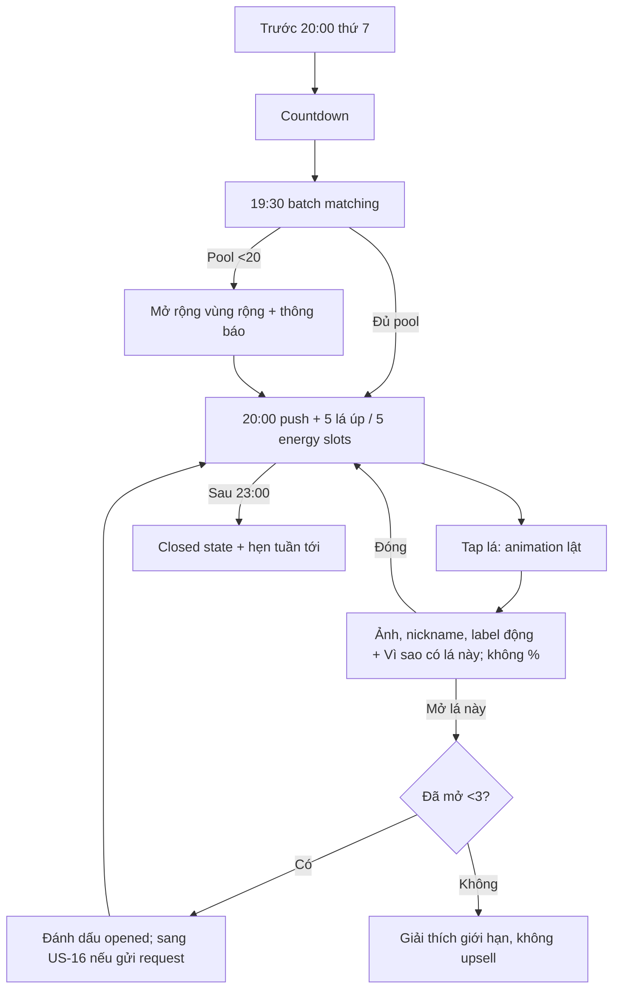

# US-15 — Tham gia Vòng Lá và mở 5 lá

> **DEFERRED — ngoài active MVP từ 2026-09-20.** Pool, cohort và 5 lá không chạy trong Radar hợp gu 1:1.

## User story

Là user matching-ready, tôi muốn tối thứ 7 nhận 5 kiểu kết nối đáng thử và chủ động mở tối đa 3 lá, để khám phá có giới hạn thay vì xem một leaderboard người.

## Phạm vi

**Bao gồm:** countdown/push; weekly pool; 5 face-down cards; flip/detail; limit 3; closed/low-pool states.

**Không bao gồm:** gửi request/mutual (US-16); chat (US-17); Sunday recap (US-18).

## Điều kiện và kết quả

- Tiền điều kiện: US-14 ready và active trước cutoff.
- Kết quả: đúng 5 cards được cấp (hoặc low-pool state); opened count 0–3 được lưu.

## User flow đầy đủ

## Acceptance Criteria

- **AC01:** Matching chạy lúc 19:30, Vòng Lá chỉ xem được 20:00–23:00 thứ 7 theo timezone sản phẩm.
- **AC02:** Mỗi eligible user nhận đúng 5 candidate unique khi pool cho phép; không tự match chính mình, user đã block hoặc ngoài preference cứng.
- **AC03:** Bộ năm ưu tiên 5 `energy_slot` khác nhau (`dễ nói thật`, `khác mà hút`, `đi chậm`, `bật ý tưởng`, `góc mới`); nếu thiếu slot đủ evidence, trả ít hơn/low-pool thay vì nới hard filter hoặc gán nhãn giả.
- **AC04:** Detail không hiển thị % compatibility, GPS hoặc khoảng cách số.
- **AC05:** User mở tối đa 3/5; giới hạn cứng, không mua thêm.
- **AC06:** Pool <20 thì mở rộng vùng ở mức city/region và thông báo minh bạch; nếu vẫn thiếu có empty state tử tế.
- **AC07:** Ngoài giờ Vòng Lá đóng nhưng Daily Note/Lá Ghép vẫn dùng bình thường.
- **AC08:** Batch hoàn tất trong 15 phút và cards ổn định suốt phiên, không đổi candidate sau refresh.
- **AC09:** Mỗi card detail có “Vì sao có lá này?” với tối đa 3 evidence ids, lời giải thích dễ hiểu và một câu tự kiểm chứng; không dùng Composite/Davison/D9 để loại candidate.
- **AC10:** Candidate sampling dùng reciprocal eligibility + exposure fairness + rotation, không dùng popularity, attachment style, mood, nội dung chat hay bảng Sun-sign “hợp/không hợp”.
- **AC11:** `weekly_intent` chỉ là relevance mềm; “Để Lá cân” và không chọn cho kết quả hợp lệ như nhau.

## Definition of Done

- Countdown, push/deep link, loading, five cards, flip, detail, limit, low-pool, closed và reconnect states hoàn chỉnh.
- Matching filters block/report/age/intent/region được test trước candidate sampling và slate optimization.
- Golden fixtures chứng minh cùng input/pool/version tạo cùng slate; 5 lá không trùng candidate/evidence thesis và không chứa scalar compatibility score.
- Load/performance test batch theo pool mục tiêu; idempotent rerun không đổi assignment đã publish.
- Analytics: `vong_la_opened`, `card_flipped`, `card_opened`, `open_limit_reached`.
- Motion có reduce-motion fallback; card state không chỉ phân biệt bằng màu.
