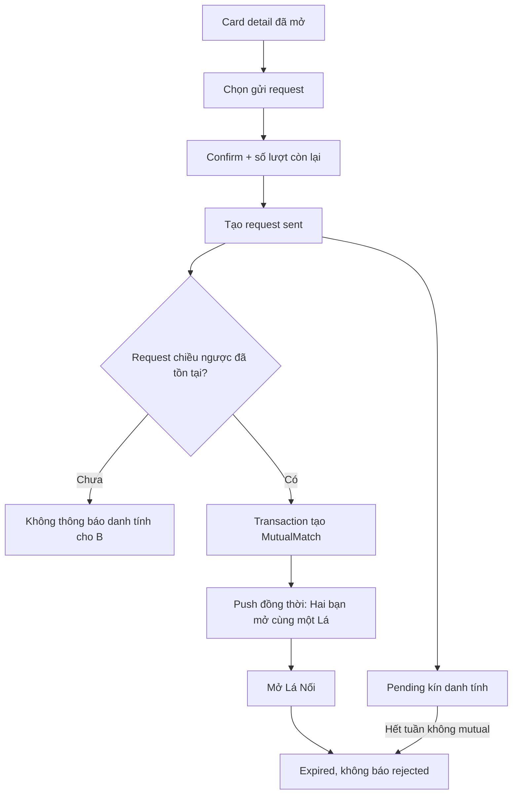

# US-16 — Gửi request và tạo mutual match

> **DEFERRED — ngoài active MVP từ 2026-09-20.** Không có request kín hoặc mutual trong Radar hợp gu hiện tại.

## User story

Là người đã mở một lá, tôi muốn bày tỏ quan tâm kín đáo và chỉ tạo kết nối khi cả hai cùng chọn nhau, để không ai chịu áp lực hoặc bị lộ là đã từ chối.

## Phạm vi

**Bao gồm:** confirm request; anonymous pending; reciprocal detection; mutual notification; expiry.

**Không bao gồm:** xem/flip candidate (US-15); chat (US-17); mua thêm request.

## Điều kiện và kết quả

- Tiền điều kiện: candidate đã được mở trong US-15; user chưa vượt limit.
- Kết quả: `VongLaRequest=sent` hoặc `mutual`; tạo một `MutualMatch` duy nhất.

## User flow đầy đủ

## Acceptance Criteria

- **AC01:** Confirm nêu đây là một trong tối đa 3 lá và hiển thị số lượt còn lại.
- **AC02:** Request idempotent; user không gửi hai request cho cùng candidate/pool.
- **AC03:** Người nhận không biết ai gửi request cho đến khi tự mở và chọn đúng người đó.
- **AC04:** Không có decline action công khai và không gửi notification “bị từ chối”.
- **AC05:** Khi hai request tồn tại, MutualMatch và ChatThread seed được tạo atomically đúng một lần.
- **AC06:** Cả hai nhận push đồng thời; deep link mở đúng match.
- **AC07:** Request chưa mutual hết hạn theo pool; không tự chuyển sang tuần sau.
- **AC08:** Block/report trước mutual loại cặp và ngăn mutual dù request cũ tồn tại.
- **AC09:** Mutual tạo một `Lá Nối` bất biến theo chart/config version đã publish: chỗ dễ bắt sóng, chỗ dễ lệch nhịp và đúng 3 cửa mở; không có verdict hợp/không hợp.
- **AC10:** Composite là lớp bonus shared-pattern sau mutual; Davison chỉ dùng khi cả hai có exact time/place và consent cho purpose này. Thiếu dữ liệu phải hạ cấp về Synastry, không đoán.

## Definition of Done

- Confirm, sent/pending, reciprocal race, mutual, push, expire và block-race states hoàn chỉnh.
- Concurrency/idempotency test hai bên gửi cùng lúc; không duplicate MutualMatch/notification.
- Không có paywall trên request quota hoặc mutual/chat cơ bản ở release này.
- Analytics: `request_confirmed/sent`, `mutual_created`, `request_expired` — không expose candidate identity ngoài quyền.
- Safety filter được chạy lại ngay trước tạo mutual.
