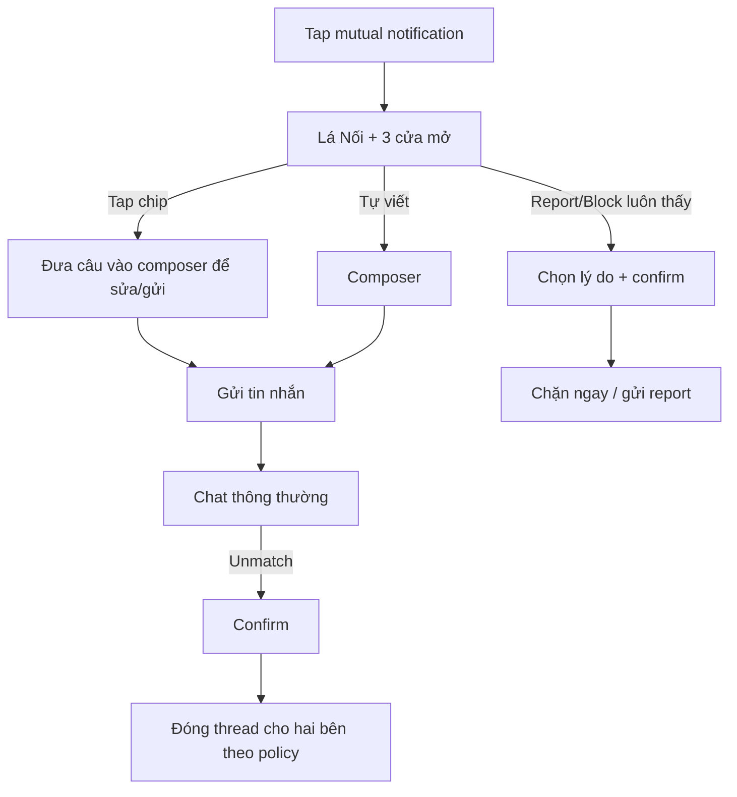

# US-17 — Chat an toàn với icebreaker

> **DEFERRED — ngoài active MVP từ 2026-09-20.** Radar không mở chat; block/report/moderation vẫn là hard gate nếu story này được khởi động lại.

## User story

Là hai người vừa mutual, chúng tôi muốn bắt đầu trò chuyện bằng gợi ý đủ riêng và luôn có công cụ block/report dễ thấy, để kết nối tự nhiên mà vẫn an toàn.

## Phạm vi

**Bao gồm:** chat thread sau mutual; đúng 3 icebreaker; text message cơ bản; block/report; unmatch; moderation state.

**Không bao gồm:** tạo mutual (US-16); chia sẻ contact tự động; audio/video/media nâng cao.

## Điều kiện và kết quả

- Tiền điều kiện: MutualMatch hợp lệ, không bên nào block bên kia.
- Kết quả: tin nhắn được gửi hoặc thread bị block/reported/unmatched an toàn.

## User flow đầy đủ

## Acceptance Criteria

- **AC01:** Chat chỉ truy cập được sau mutual; API từ chối thread không thuộc user.
- **AC02:** Lần đầu mở hiển thị Lá Nối và đúng 3 cửa mở dựa trên snapshot relationship facts đã publish, không tính chart lại trong request path.
- **AC03:** Tap icebreaker đưa vào composer để user sửa trước gửi; không auto-send.
- **AC04:** Chat text cơ bản luôn miễn phí sau mutual.
- **AC05:** Không hiển thị số điện thoại/email; chỉ xuất hiện nếu user tự gõ/chia sẻ.
- **AC06:** Block và Report luôn thấy từ tin nhắn đầu, không chôn trong menu nhiều tầng.
- **AC07:** Block có hiệu lực ngay, ngăn gửi/nhận mới; report tạo case và SLA xử lý ≤24h.
- **AC08:** Không thông báo lý do report/unmatch cho đối phương; bảo vệ người báo cáo.
- **AC09:** Mỗi người chọn cửa mở riêng; chỉ hiện “trùng cửa” khi cả hai đã chọn. Không dùng lựa chọn riêng để rerank candidate hoặc suy personality.
- **AC10:** Mọi copy qua relationship content gate: evidence-bound, conditional, không xúi giục, không chẩn đoán, và block/report vẫn nhìn thấy trên cùng màn.

## Definition of Done

- Empty chat, icebreaker, send/retry, delivery ordering, reconnect, block, report, unmatch và moderated states hoàn chỉnh.
- Authorization, abuse rate limit, audit log và retention policy được security review.
- Test blocked race, report từ tin đầu, offline send, duplicate send và notification privacy.
- Analytics: `chat_opened`, `icebreaker_selected`, `first_message_sent`, `block/report/unmatch` ở dạng aggregate.
- Runbook moderation và đường hỗ trợ khẩn cấp được duyệt trước production.
