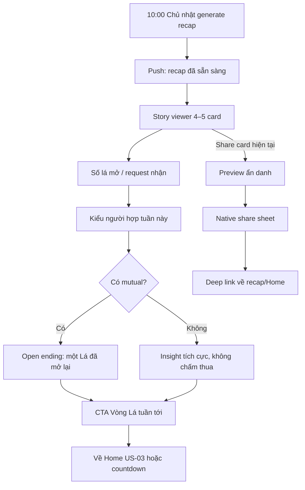

# US-18 — Xem, chia sẻ Recap Chủ nhật và quay lại app

> **DEFERRED — ngoài active MVP từ 2026-09-20.** Không có weekly pool recap trong Radar hợp gu 1:1.

## User story

Là người đã tham gia Vòng Lá, tôi muốn nhận recap tích cực vào Chủ nhật, chia sẻ phần mình thích và biết khi nào vòng tiếp theo mở, kể cả khi tuần này chưa mutual.

## Phạm vi

**Bao gồm:** generate 10:00 Chủ nhật; 4–5 story cards; no-match tone; per-card share; deep link re-entry; next-week CTA.

**Không bao gồm:** Season Recap 6 tuần; tạo mutual/chat; Daily Note content.

## Điều kiện và kết quả

- Tiền điều kiện: user tham gia pool US-15 tối trước.
- Kết quả: `VongLaRecap` viewed/shared; CTA dẫn về US-03 hoặc countdown US-15.

## User flow đầy đủ

## Acceptance Criteria

- **AC01:** Recap sinh lúc 10:00 Chủ nhật cho mọi participant, tối đa một bản/user/pool.
- **AC02:** Gồm số lá đã mở, số request nhận, insight kiểu người hợp tuần này và CTA tuần sau.
- **AC03:** Insight truy từ slate slot + relationship evidence thật; không dùng CompatibilityScore tổng và không bịa narrative không có nguồn.
- **AC04:** Không lộ tên/ảnh người gửi request hoặc người chưa mutual.
- **AC05:** Không có mutual vẫn dùng tông tích cực, không dùng “0 match/thất bại/bị từ chối”.
- **AC06:** Mỗi card share riêng được; default ẩn danh tính người khác và không lộ số liệu nhạy cảm.
- **AC07:** Deep link từ share mở web preview an toàn rồi dẫn user hiện có về recap, user mới về entry phù hợp.
- **AC08:** CTA sau recap dẫn Home/Note hoặc countdown, không mở Vòng Lá ngoài giờ.

## Definition of Done

- Generation, push, story navigation, match/no-match variants, share/cancel/error, deep link và CTA hoàn chỉnh.
- Snapshot recap không đổi sau khi publish; job retry idempotent.
- Test 0/1/3 opened, 0/n requests, 0/n mutual, blocked user, link unauthenticated và timezone.
- Analytics: `recap_generated/opened`, `recap_card_viewed/shared`, `recap_returned_home`.
- Share card được privacy/content review; story controls hỗ trợ reduce motion và screen reader.
