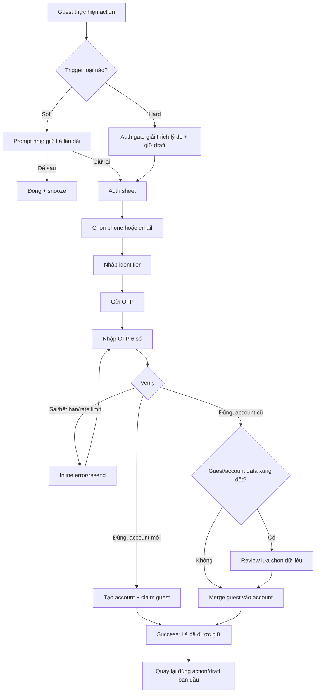

# US-19 — Xác thực khi cần và giữ lại hồ sơ khách

## 1. User story

Là người đã trải nghiệm Lá Lành ở chế độ khách, tôi muốn chỉ đăng nhập khi cần giữ dữ liệu hoặc kết nối với người khác, để hiểu rõ lợi ích của việc tạo tài khoản và không mất công việc đang làm.

## 2. Trigger policy

### Soft trigger — được bỏ qua

- Sau Basic Reveal: không hiện modal; chỉ có link nhẹ “Giữ Lá này lâu dài”.
- Sau 3 lần quay lại hoặc khi guest còn ≤7 ngày: banner/card nhẹ, snooze được.
- Khi mở Profile: “Lá đang được giữ trên thiết bị này”.
- Khi lưu Note: lưu local ngay; chỉ gợi ý login nếu user chọn sync.

### Hard trigger — cần account để tiếp tục

- Gửi Lá Chứng, Pitch Card hoặc Lá Ghép cho người khác.
- Vào matching pool/Vòng Lá, mutual hoặc chat.
- Sync/khôi phục nhiều thiết bị, quản lý dữ liệu cấp account.

Hard trigger phải giải thích **tại sao cần account**, giữ nguyên draft và quay lại đúng action sau thành công.

## 3. User flow đầy đủ

## 4. UI/UX chính

### Auth trigger sheet

- Headline theo intent, không dùng một copy chung:
  - Sync: “Giữ những chiếc Lá này, kể cả khi đổi máy.”
  - Social: “Đăng nhập để người nhận biết lời mời đến từ một người thật.”
  - Matching: “Vòng Lá cần một hồ sơ có thể xác minh để giữ mọi người an toàn.”
- Hiển thị rõ thứ sẽ được giữ: Basic Profile, Note đã lưu, mood, draft social hiện tại.
- Soft trigger có “Để sau”; hard trigger có “Quay lại” nhưng draft phải còn nguyên.
- Primary: “Tiếp tục bằng số điện thoại/email”.

### Identifier và OTP

- Phone/email validation, OTP 6 số, TTL 5 phút, resend 30 giây, quota và enumeration protection áp dụng như đặc tả authentication đã chốt.
- Destination luôn mask; hỗ trợ paste/autofill; đổi identifier không mất return intent.

### Merge review

Chỉ xuất hiện khi account cũ có dữ liệu khác guest.

| Loại dữ liệu | Quy tắc mặc định |
|---|---|
| Ngày sinh khác nhau | Không overwrite; user chọn “Giữ hồ sơ tài khoản” hoặc “Dùng hồ sơ trên máy này”; giải thích sẽ recompute insight. |
| Saved Note/mood | Union theo ID/date, dedupe. |
| Card/share asset | Giữ cả hai nếu không trùng snapshot. |
| Consent | Giữ audit trail cả hai; yêu cầu incremental consent nếu account purpose rộng hơn. |
| Matching/social draft | Attach vào account mới sau verify; không gửi tự động. |

## 5. Acceptance Criteria

- **AC01:** Không có hard auth prompt trước khi guest đã xem Basic Reveal và vào Home, trừ khi user chủ động chọn “Đăng nhập”.
- **AC02:** Soft prompt luôn dismiss/snooze được và không xuất hiện lại trong cùng phiên.
- **AC03:** Hard prompt chỉ dùng cho action cần identity/safety/sync, giải thích lý do cụ thể và giữ draft.
- **AC04:** Phone hoặc email đều dùng được; không bắt buộc cả hai; OTP/rate-limit được enforce phía server.
- **AC05:** Verify thành công claim guest record atomically; guest token bị rotate/revoke và không tạo dữ liệu trùng.
- **AC06:** Account cũ không bị guest data overwrite âm thầm; xung đột ngày sinh bắt buộc review.
- **AC07:** Sau login, user quay lại đúng action, form và lựa chọn trước đó; hard action không auto-submit.
- **AC08:** Nếu user hủy auth, guest vẫn sử dụng được các tính năng guest và draft được giữ tới TTL phù hợp.
- **AC09:** Consent guest được migrate có audit trail; purpose mới yêu cầu incremental consent riêng.
- **AC10:** Analytics/log không chứa identifier, OTP, birth date hoặc guest token.

## 6. Edge cases và solution

| Edge case | Solution |
|---|---|
| OTP thành công nhưng merge timeout | Account/session vẫn hợp lệ; merge job idempotent; hiển thị “Đang giữ Lá” và retry nền. |
| Guest và account có DOB khác | Review bắt buộc; giữ chart cũ tới khi chart mới compute thành công. |
| User login account khác giữa hard flow | Gắn draft với account vừa verify sau confirm “Tiếp tục với tài khoản này”. |
| Draft hết hạn khi auth lâu | Báo rõ; không gửi action; cho tạo lại từ dữ liệu còn an toàn. |
| Guest token hết hạn giữa OTP | Verify account vẫn hoàn tất; báo dữ liệu guest nào không còn để merge. |
| User đóng app ở merge review | Resume đúng review; không merge theo default khi chưa chọn DOB. |
| Phone/email đã thuộc account bị khóa | Copy trung tính + support; guest data không bị xóa. |
| User từ chối incremental consent | Account vẫn tạo/login; action cần purpose đó dừng, guest/basic feature vẫn dùng được. |

## 7. Definition of Done

- Soft/hard trigger, auth, OTP, new/existing account, merge conflict, success và return-to-intent đủ state.
- Draft persistence và return routing được test cho Lá Chứng, Pitch, Lá Ghép và Vòng Lá.
- Merge idempotency, token revoke, consent migration và conflict policy pass integration/security test.
- Không có auto-submit sau auth; không mất guest data khi auth lỗi/hủy.
- AC01–AC10 pass trên staging.

