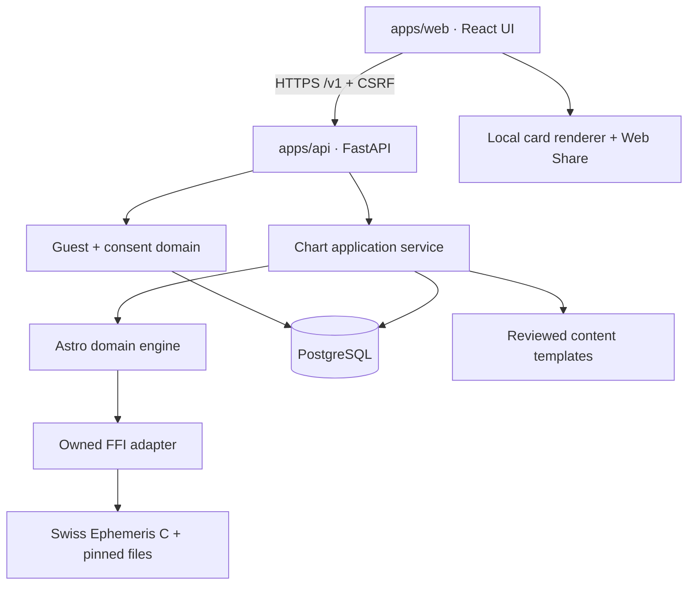
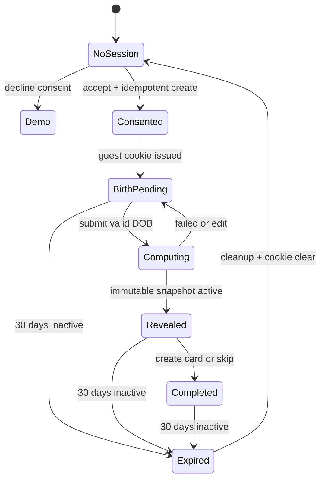
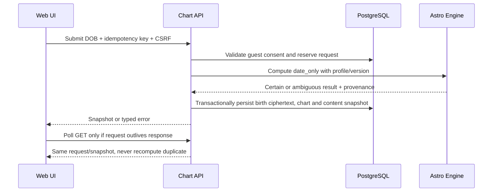
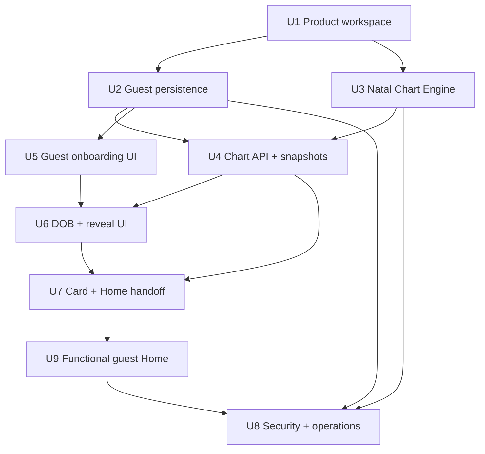

# Guest-first Birth Chart Product - Plan

## Goal Capsule

- **Objective:** Người mới dùng được một sản phẩm Lá Lành thật từ Welcome đến Lá Khai Sinh và Home bằng dữ liệu thật, chưa cần đăng nhập; kết quả chiêm tinh có thể tái lập và được kiểm chứng với astro.com.
- **Means:** Chuyển prototype React thành web app production, bổ sung API/PostgreSQL, guest session bảo mật và Natal Chart Engine bọc trực tiếp Swiss Ephemeris C chính thức (KTD1, KTD2, KTD4).
- **Authority:** `docs/foundation/` quyết định định hướng; US-01 và US-02 quyết định hành vi; Key Technical Decisions trong kế hoạch này quyết định cách triển khai. Khi có mâu thuẫn, dừng và sửa tài liệu sở hữu quyết định trước khi code tiếp.
- **Execution profile:** Deep, code, privacy-sensitive, persistent data, native-library integration và external-license gate.
- **Stop conditions:** Dừng public launch nếu chưa có lựa chọn giấy phép Swiss Ephemeris hợp lệ; dừng single-sign reveal nếu engine không xác định chắc một cung và dùng typed ambiguous reveal theo R16; không thay dữ liệu thật bằng mock để vượt lỗi tích hợp.
- **Tail ownership:** Thực thi hoàn tất code, migration, fixtures kiểm chứng, staging smoke test, accessibility/privacy review và xóa mọi code thử nghiệm không còn dùng.

---

## Product Contract

### Summary

US-01 và US-02 được triển khai thành lát cắt sản phẩm hoàn chỉnh: welcome và consent tách khỏi đăng nhập, guest session có server ownership, nhập ngày sinh, tính Sun sign bằng ephemeris thật, reveal có nguồn dữ liệu minh bạch, tạo/lưu/chia sẻ Lá Khai Sinh và vào Home. Backend đồng thời đặt nền Natal Chart Engine đủ chuẩn để US-06 và các luồng ghép/matching dùng tiếp mà không phải thay lõi tính toán.

### Problem Frame

Hiện tại `prototype/` là React/Vite một file, không có API, database, migration, test hay engine thiên văn. Nếu chỉ nối UI với hardcoded zodiac ranges hoặc mock response, sản phẩm sẽ sai ở ngày chuyển cung, không thể tái lập kết quả, không hỗ trợ guest resume và phải viết lại khi thêm giờ/nơi sinh. Việc “học theo astro.com” được hiểu là parity tính toán trong một calculation profile đã ghi rõ, không sao chép UI, nội dung hoặc thương hiệu astro.com.

### Actors

- A1. Người mới chưa có tài khoản, muốn thấy giá trị trước khi cung cấp danh tính.
- A2. Guest quay lại cùng thiết bị trong 30 ngày, cần tiếp tục đúng bước và thấy cùng snapshot.
- A3. Người đã có tài khoản, chọn đăng nhập tự nguyện qua US-19; authentication không nằm trong lát cắt này.
- A4. Product/content operator, quản lý consent version, content template và calculation profile được duyệt.
- A5. Engineer/operations, phát hành ephemeris, theo dõi tính đúng, latency, lỗi và TTL cleanup.

### Requirements

**Guest-first và quyền riêng tư**

- R1. Người mới đi từ Welcome đến Home mà không nhập phone, email, OTP, password, tên, giờ sinh hoặc nơi sinh.
- R2. Consent dữ liệu sinh phải xuất hiện trước form ngày sinh, tách khỏi authentication và marketing; decline không tạo guest/profile và vẫn xem được demo có nhãn rõ.
- R3. Server tạo đúng một guest session cho mỗi idempotent request, dùng opaque token trong secure HttpOnly cookie; token, URL, log và analytics không chứa ngày sinh hoặc định danh.
- R4. Guest được resume đúng bước trong 30 ngày từ hoạt động gần nhất; hết hạn thì dữ liệu server bị xóa và UI không giả rằng dữ liệu cũ còn tồn tại.
- R5. Birth data và consent được mã hóa, có version/purpose/timestamp; thao tác ghi bị từ chối nếu consent không hợp lệ.

**Birth entry và tính toán thật**

- R6. Ngày sinh dùng composite `DD/MM/YYYY`, strict date-only validation, age gate 18–120 theo ngày lịch và thời gian chuẩn của server.
- R7. Mọi kết quả zodiac được tính ở backend bằng Western Tropical, geocentric Swiss Ephemeris; client không chứa bảng ngày cung làm nguồn chân lý.
- R8. Date-only computation phải trả certainty metadata trên cửa sổ UTC bảo thủ từ `birth_date 00:00 tại UTC+14` đến `birth_date 23:59:59 tại UTC−12`; ngày sát ingress không được đoán một cung.
- R9. Exact chart mode phải nhận local date/time, IANA timezone và coordinates, rồi tính planetary placements, Ascendant, MC, houses và aspects bằng calculation profile có version.
- R10. Engine có hai profile không trộn lẫn: `astro_reference_v1` dùng Placidus để đối chiếu; `la_lanh_automated_v1` dùng Whole Sign cho tính năng tự động theo PRD.
- R11. Mọi chart snapshot lưu input completeness, normalized UTC/uncertainty interval, profile, ephemeris version, ephemeris checksums, tzdb version và result schema version để tái lập.
- R12. Golden suite có hai tầng: raw engine so với executable `swetest` được build độc lập từ cùng official release với sai số longitude không quá 1 arc-second và angles/cusps không quá 0.01°; chart end-to-end so với astro.com phải khớp sign, rounded degree/minute, house và aspect classification trong cùng settings.

**Reveal, card và Home handoff**

- R13. Submit hợp lệ tạo một compute request idempotent; refresh/background/retry không tạo chart hoặc content snapshot trùng.
- R14. Loading hiện trong 200 ms, giữ pacing tối thiểu 1.2 giây, đổi trạng thái khi chậm và cho Retry/Sửa ngày sau 4 giây; không có spinner vô hạn hoặc tiến độ giả.
- R15. Reveal hiển thị Sun sign/element và production content đã review, nói rõ chỉ dựa trên ngày sinh; Moon/Rising/Houses không được trình bày là đã biết.
- R16. Nếu Sun sign không chắc do thiếu time/place, reveal hiển thị hai khả năng và lời giải thích, cho tiếp tục bằng note trung lập hoặc đi tới luồng bổ sung dữ liệu sau; không chọn mặc định một cung.
- R17. Card 9:16 và 1:1 dùng cùng chart/content snapshot, không chứa ngày sinh/identifier, render đúng tiếng Việt, lưu local và mở native share mà không ép đăng nhập.
- R18. Hoàn tất hoặc bỏ qua card đều đánh dấu basic onboarding complete và vào Home; quay lại phải thấy cùng active snapshot.

**Chất lượng sản phẩm và vận hành**

- R19. Main path ở mọi môi trường dùng PostgreSQL và Astro Engine thật; mock chỉ tồn tại trong unit/component tests và Storybook, không có runtime feature flag đổi sang mock.
- R20. API có schema version, validation, rate limit, request correlation, redacted structured logs, health/readiness checks và metrics cho compute duration/failure/expiry.
- R21. UI giữ concept Electric Note đã chốt, nhưng tách component/state rõ, responsive mobile-first, touch target tối thiểu 44 px, text scale 200%, keyboard/screen-reader và Reduce Motion.
- R22. Public deployment chỉ được bật khi giấy phép Swiss Ephemeris hợp lệ, production secrets/KMS/database/backup/cleanup/monitoring đã được cấu hình và staging end-to-end pass.
- R23. Home sau reveal phải có Daily Note production thật kết hợp active Sun snapshot với transit snapshot của ngày hiện tại do Swiss Ephemeris tính, mood check-in và lưu/bỏ lưu Note trên thiết bị; các thao tác này dùng được khi guest và không kích hoạt login wall.
- R24. Guest có điểm vào “Dữ liệu của Lá” để rút consent/xóa ngay, với confirm, pending, retry và success state; hoàn tất phải revoke credential và quay về no-session Welcome.
- R25. Mọi guest-scoped endpoint phải derive owner từ secure cookie và enforce object-level authorization; client không được chỉ định owner, mismatch trả non-enumerating `404`.

### Key Flows

- F1. New guest happy path
  - **Trigger:** A1 mở app không có account hoặc guest cookie.
  - **Steps:** Welcome → Consent accept → server tạo guest → DOB → compute thật → certain reveal → card tùy chọn → Home.
  - **Outcome:** Guest có active chart/content snapshot và resume được, không gặp login wall.
  - **Covered by:** R1–R7, R13–R15, R17–R19.
- F2. Consent decline/demo
  - **Trigger:** A1 chọn “Chưa đồng ý”.
  - **Steps:** Không tạo guest → demo Note cố định có nhãn → quay lại consent hoặc thoát.
  - **Outcome:** Không có birth/profile write hay thông điệp giả cá nhân hóa.
  - **Covered by:** R2, R5.
- F3. Boundary-date honesty
  - **Trigger:** DOB nằm trong cửa sổ ingress của Mặt Trời.
  - **Steps:** Engine trả `ambiguous` cùng hai candidate signs → reveal giải thích giới hạn → user tiếp tục bằng note trung lập hoặc bổ sung dữ liệu sau.
  - **Outcome:** Sản phẩm vẫn usable nhưng không nói sai.
  - **Covered by:** R8, R16.
- F4. Guest resume/expiry
  - **Trigger:** A2 quay lại hoặc token hết hạn khi đang dùng.
  - **Steps:** Server kiểm tra hashed token và expiry → resume state/snapshot hoặc trả expired → UI bắt đầu lại có giải thích.
  - **Outcome:** Không lặp onboarding khi còn hạn và không lộ dữ liệu sau expiry.
  - **Covered by:** R3–R5, R13, R18.
- F5. Future full-chart computation
  - **Trigger:** Một feature sau US-02 cung cấp exact time/place.
  - **Steps:** Normalize timezone/coordinates → compute profile → persist reproducible full snapshot → expose structured result.
  - **Outcome:** US-06 trở đi dùng lại cùng engine, không thay lõi.
  - **Covered by:** R9–R12.
- F6. Guest Home value loop
  - **Trigger:** Guest hoàn tất hoặc bỏ qua card.
  - **Steps:** Home đọc active natal snapshot + current transit snapshot → hiển thị Daily Note đã review → mood check-in → lưu/bỏ lưu local → có thể mở data controls để xóa.
  - **Outcome:** Guest nhận giá trị sử dụng thật sau onboarding và có quyền kiểm soát dữ liệu đã hứa.
  - **Covered by:** R18, R23–R25.

### Acceptance Examples

- AE1. Given consent version hiện hành và request idempotency giống nhau, when client retry tạo guest sau mất response, then server trả cùng session và chỉ có một guest record.
- AE2. Given `29/02/2000`, when submit, then date được chấp nhận; given `29/02/1900`, then server trả calendar validation error và không tạo compute request.
- AE3. Given DOB ở giữa một cung, when compute date-only, then engine trả `certainty=certain`, một Sun sign, profile/ephemeris/schema versions và snapshot ổn định qua retry.
- AE4. Given DOB có thể nằm ở hai phía một solar ingress trong uncertainty window, when compute, then response trả `certainty=ambiguous`, hai candidate signs và UI không render một cung duy nhất.
- AE5. Given exact datetime/place fixture với settings Tropical/Geocentric/Placidus, when chạy golden suite, then raw numeric output đạt tolerance R12 so với independent `swetest` output và chart hiển thị khớp astro.com ở độ phân giải nguồn cung cấp.
- AE6. Given guest đã hoàn tất reveal và refresh hoặc mở lại trong 30 ngày, when app bootstrap, then route tới đúng reveal/card/Home và giữ nguyên snapshot id/content version.
- AE7. Given user lưu/chia sẻ card, when kiểm tra bitmap, metadata và visible text, then không có DOB, guest token, email, phone, coordinates hoặc internal id.
- AE8. Given runtime config thiếu ephemeris files/checksum không khớp, when API readiness chạy, then instance không nhận traffic và không fallback sang hardcoded/mock zodiac.
- AE9. Given guest A biết request id của guest B, when A gọi status/snapshot/delete/onboarding endpoint, then API trả non-enumerating `404` và không tiết lộ sự tồn tại hay dữ liệu của B.
- AE10. Given guest ở Home, when check-in mood và lưu Note, then trạng thái tồn tại qua reload trên cùng thiết bị; xóa dữ liệu guest revoke server data và xóa local Note/mood trước khi về Welcome.

### Success Criteria

- Mọi AC của US-01/US-02 thuộc guest-first slice cùng AE1–AE10 pass trên staging; các nhánh phụ thuộc US-19 được trace rõ là deferred, gồm existing-user login/claim và cross-device restore.
- Golden chart suite hai tầng đạt tolerance R12; không có fixture “xấp xỉ cho qua”.
- Guest consent→Home completion hoạt động trên mobile viewport và desktop; reload/offline/retry/expiry đều có state hữu ích.
- Compute date-only p95 dưới 500 ms ở warm service; API p95 cho submit→snapshot dưới 2 giây trong điều kiện staging chuẩn.
- Không có raw birth date/token trong client URL, analytics, logs hoặc card artifact qua automated privacy scan.
- Không có mock adapter hoặc hardcoded zodiac date table trong production dependency graph.

### Scope Boundaries

**In scope**

- Toàn bộ màn/state/DoD của guest-first path trong US-01 và US-02, gồm Daily Note, mood, local save và data deletion; AC phụ thuộc US-19 được loại trừ có trace thay vì hứa blanket coverage.
- Production-ready Natal Chart Engine foundation cho date-only và exact chart.
- Guest persistence, database migrations, API contracts, card export, observability, CI và deploy-ready packaging.
- Production content tĩnh đã review cho 12 Sun signs và một neutral boundary note; đây là nội dung sản phẩm, không phải mock.

**Deferred to Follow-Up Work**

- US-19 authentication, claim/merge guest sang account và cross-device sync.
- UI thu giờ/nơi sinh, geocoding provider và UX xử lý địa danh thuộc US-06; exact engine contract vẫn được xây và test trong scope này.
- Transit-personalized Daily Note cấp Moon/House, server sync cho mood/save, social, Lá Ghép, Vòng Lá, matching và chat. Home trong scope vẫn có production Sun-level Daily Note, mood và local save theo R23.
- Live LLM generation; US-02 dùng content snapshot từ template đã review để tránh bịa placement và phụ thuộc runtime.
- Placidus reader UI/premium gating; profile đối chiếu Placidus vẫn nằm trong engine.

**Explicit non-goals**

- Sao chép giao diện, copywriting, chart artwork hoặc branding của astro.com.
- Sidereal, heliocentric, Vedic, progressed chart, rectification hoặc diễn giải y khoa/tâm lý chắc chắn.
- Dùng ngày-tháng hardcode, API horoscope bên thứ ba hoặc mock response để thay engine.

### Dependencies and Prerequisites

- Trước public activation, owner phải mua Swiss Ephemeris Professional License hoặc xác nhận bằng văn bản rằng toàn bộ project/service sẽ tuân AGPL; kế hoạch mặc định chọn Professional License cho sản phẩm proprietary.
- Cần production secrets/KMS-equivalent, PostgreSQL và domain HTTPS cho staging/production; provider cụ thể có thể chọn khi triển khai mà không đổi architecture.
- Product/content owner duyệt 12 Sun templates, neutral boundary template, consent copy/version và privacy contact trước staging sign-off.
- Golden fixtures phải chỉ dùng dữ liệu synthetic/public, ghi rõ input và chart settings; không commit dữ liệu sinh cá nhân của tester.

### Sources

- Local: `docs/foundation/la-lanh-product-plan-v2.md`, `docs/foundation/la-lanh-prd.md`, `docs/foundation/la-lanh-srs.md`.
- Local: `docs/user-stories/US-01-bat-dau-che-do-khach.md`, `docs/user-stories/US-02-khai-ngay-sinh-reveal-la-khai-sinh.md`, `docs/user-stories/US-19-xac-thuc-khi-can.md`.
- Swiss Ephemeris official repository and DE441 update: https://github.com/aloistr/swisseph
- Swiss Ephemeris programmer documentation and dual-license requirement: https://www.astro.com/swisseph-download/doc/swephprg.pdf
- Swiss Ephemeris Professional License contract: https://forum.astro.com/swisseph/secont_e.pdf
- Astro.com chart type/default references: https://www.astro.com/faq/fq_fh_owtype_e.htm and https://www.astro.com/cgi/genchart.cgi
- IANA Time Zone Database and historical-data caveats: https://www.iana.org/time-zones and https://www.iana.org/time-zones/theory.html
- Python wrapper risk evidence: https://github.com/sailorfe/pysweph (the fork currently states its suite is deprecated after `calc`/`houses` patches).

---

## Planning Contract

### Key Technical Decisions

- KTD1. **session-settled: main path must use real data, never mock.** PostgreSQL, guest ownership and Astro Engine are required from the first vertical slice. Mocks are test doubles only and cannot be selected by runtime config. Governs R3–R5, R7–R20, R23.
- KTD2. **session-settled: guest-first, identity later.** Consent creates an anonymous server session; authentication remains a voluntary link for returning users and a later hard gate only for cross-device/social actions. Governs R1–R5, R18, R23–R24.
- KTD3. **Date-only means uncertainty, not noon.** With no place/time, engine evaluates the explicit UTC+14/UTC−12 interval in R8 and returns certainty/candidates per body. It never silently assumes 12:00 or Vietnam timezone for astrology. Governs R7, R8, R16.
- KTD4. **session-settled: build the full astro.com-quality backend now.** Use the official Swiss Ephemeris C core through a narrow owned adapter. Pin source commit/release and ephemeris file checksums; compile a shared library in the API image; expose only UTC/JD, planetary and houses calls needed by domain code. Guard the library's process-global state with a process-local mutex and keep ephemeris configuration immutable after startup; scale with multiple API worker processes. Do not make the community Python wrapper the correctness boundary while its own tests are deprecated. Governs R7–R12, R19, R22.
- KTD5. **Separate calculation profiles.** `astro_reference_v1` is Tropical/Geocentric/Placidus and freezes all node/aspect/orb flags used by reference fixtures; `la_lanh_automated_v1` is Tropical/Geocentric/Whole Sign and freezes product orb rules. A snapshot names exactly one profile. Governs R9–R12.
- KTD6. **Snapshots are immutable and reproducible.** Changing DOB, engine, tzdb, ephemeris files, profile or content creates a new versioned snapshot and atomically changes the active pointer only after success; old snapshots remain auditable until owner deletion/TTL. Governs R11, R13, R15, R18.
- KTD7. **Opaque cookie authentication for guests.** Active credentials store only a keyed hash of the 256-bit token; use `Secure`, `HttpOnly`, `SameSite=Lax`, rotation and server expiry. For the first 10 minutes only, the idempotency record may store the response credential encrypted so concurrent/lost-response retries replay the same valid cookie; the high-entropy idempotency key is itself hash-stored/redacted and cannot recover credentials after this window. Mutations require same-origin validation plus a CSRF token distinct from the guest credential. Governs R3–R5, R20, R25.
- KTD8. **Content is deterministic in US-02.** Chart math returns structured facts; a versioned, human-reviewed template maps only certain Sun/element/transit facts to reveal/card/Daily Note copy. Ambiguous charts use a neutral template. LLMs never calculate placements and are not in the request path. Governs R15–R19, R23.
- KTD9. **Promote, do not patch around, the prototype.** Move the selected Electric Note implementation into `apps/web`, split it by route/feature/component and preserve reference screenshots as visual regression sources. Build `apps/api` beside it in one pnpm/uv workspace. Governs R19–R25.
- KTD10. **Professional license is the default release path.** Development can proceed, but public activation is blocked until the executed license covers the service. Choosing AGPL instead requires an explicit repo-wide licensing change and legal review. Governs R22.

### High-Level Technical Design

#### Component and data ownership



The API owns authorization, persistence and orchestration. Astro domain code is framework-independent and deterministic. The FFI layer owns all unsafe/native interaction and converts library errors into typed domain failures. The web app never calls Swiss Ephemeris or derives a zodiac result itself.

#### Guest lifecycle



#### Compute request sequence



#### Calculation mode matrix

| Mode | Required input | Allowed output | Forbidden claim |
|---|---|---|---|
| `date_only` | Local calendar date | Candidate/certain signs and uncertainty interval; US-02 exposes Sun/element only | Exact Moon, Ascendant, MC, houses or exact degree/time |
| `full_chart` | Local date/time, IANA timezone, latitude/longitude | Planetary longitudes/speeds, Asc/MC, houses and aspects under one profile | A result without tzdb/ephemeris/profile provenance |
| `astro_reference_v1` | Exact input plus captured astro.com settings | Placidus reference result for golden comparison | Mixing Whole Sign product readings into the same snapshot |
| `la_lanh_automated_v1` | Full input or supported incomplete input | Whole Sign automated facts under product orb config | Claiming it is astro.com’s default presentation |

### Output Structure

```text
apps/
  web/
    src/app/
    src/features/guest/
    src/features/birth-chart/
    src/features/birth-card/
    src/shared/
    tests/e2e/
  api/
    app/api/v1/
    app/domains/guest/
    app/domains/astro/
    app/domains/chart/
    app/infrastructure/
    migrations/
    tests/
packages/
  contracts/openapi/
  content/birth-reveal/
vendor/
  swisseph/
infra/
  containers/
  compose/
scripts/
```

### Data and API Contract

Core tables are `guest_sessions`, `consents`, `birth_profiles`, `compute_requests`, `chart_snapshots`, `content_snapshots` and `schema_versions`. Sensitive birth input is field-encrypted; token lookup uses a keyed hash; chart facts contain no public identifier. Foreign keys cascade on guest deletion and a scheduled cleanup deletes expired owners in bounded batches.

Minimum API surface:

- `POST /v1/guest-sessions`: consent version/purpose + random 128-bit-or-stronger creation idempotency key → guest state, CSRF token and secure cookie. Concurrent/lost-response retries within 10 minutes replay the encrypted issuance response; afterwards the replay secret is destroyed and normal cookie auth is required.
- `GET /v1/session`: bootstrap current guest/account/demo routing state without returning raw token.
- `DELETE /v1/guest-session`: revoke consent and delete owned data now.
- `POST /v1/birth-profile`: strict DOB submit + idempotency key → compute request or completed snapshot.
- `GET /v1/chart-requests/{request_id}`: retrieve authoritative status and typed failure.
- `GET /v1/chart-snapshots/active`: retrieve the same immutable reveal/card payload.
- `POST /v1/onboarding/basic-complete`: idempotently set completed state after card or skip.
- `GET /v1/config/public`: current consent/content/schema versions; no secrets or ephemeris paths.

All error responses use a versioned problem schema with stable codes such as `CONSENT_REQUIRED`, `DATE_INVALID`, `AGE_NOT_ALLOWED`, `ENGINE_UNAVAILABLE`, `REQUEST_IN_PROGRESS` and `GUEST_EXPIRED`. Ambiguity is a successful snapshot with `certainty=ambiguous`, never a problem response.

### Assumptions and Constraints

- Product timezone for age-gate “today” is `Asia/Ho_Chi_Minh`; astrology date-only calculation does not use this timezone (KTD3).
- Local development may disable the cookie `Secure` attribute only on loopback HTTP; preview/staging/production require HTTPS and cannot start with insecure cookie settings.
- Python 3.13 hosts FastAPI/domain code; native Swiss Ephemeris is compiled in the container. Dependency versions are lockfile-pinned and updated only with golden-suite evidence.
- PostgreSQL is the only required stateful service for US-01/02; Redis/queue infrastructure is not introduced until measured need.
- Exact chart engine is implemented and testable now, but no public UI collects time/place until US-06.
- `prototype/` remains untouched until `apps/web` reproduces the selected screens and reference captures; then non-source build artifacts are removed or archived deliberately.
- A compatible deployment target must provide Linux containers with native shared-library loading, HTTPS, PostgreSQL, secret/KMS access, migration jobs, scheduled cleanup, health/readiness routing and an immutable artifact store for historical engine/profile/tzdb assets.

### Sequencing



---

## Implementation Units

### U1. Promote prototype into a production workspace

- **Goal:** Establish a maintainable web/API workspace, deterministic local environment and shared contract pipeline without changing product behavior.
- **Requirements:** R19–R21.
- **Dependencies:** None.
- **Files:** `package.json`, `pnpm-workspace.yaml`, `pnpm-lock.yaml`, `apps/web/package.json`, `apps/web/src/`, `apps/web/tests/`, `apps/api/pyproject.toml`, `apps/api/uv.lock`, `apps/api/app/main.py`, `apps/api/tests/`, `packages/contracts/`, `infra/compose/compose.yaml`, `.env.example`, `.gitignore`, `README.md`.
- **Approach:**
  1. Move production source/assets from `prototype/` into `apps/web`; preserve selected screenshots and design reference, but exclude `dist/` and local dependency directories from source control.
  2. Split app shell, routes, feature state and shared UI primitives; add TypeScript, router, query/cache client, schema validation, Vitest/Testing Library and Playwright.
  3. Bootstrap FastAPI on Python 3.13 with uv, typed settings, SQLAlchemy/Alembic, pytest and OpenAPI generation.
  4. Add root scripts that start web/API/PostgreSQL together and run lint, typecheck, unit, integration and E2E gates.
- **Patterns to follow:** Preserve `prototype/AGENTS.md` visual-source rule and the selected Electric Note reference; do not carry the monolithic `App.jsx` structure forward.
- **Test scenarios:**
  - Web app renders the preserved welcome reference route at mobile and desktop sizes without API data.
  - API health responds only after settings load and database connectivity succeeds.
  - Generated web API types fail CI when OpenAPI output drifts.
  - Production build contains no `prototype/dist`, local absolute paths or mock runtime adapter.
- **Verification:** Fresh checkout can install from lockfiles, start the complete local stack and pass scaffold smoke tests; visual baseline is captured before feature refactors.

### U2. Build guest consent, secure session and retention persistence

- **Goal:** Make consent and guest ownership real, idempotent, resumable and deletable.
- **Requirements:** R1–R5, R20; AE1.
- **Dependencies:** U1.
- **Files:** `apps/api/app/domains/guest/`, `apps/api/app/api/v1/guest_sessions.py`, `apps/api/app/infrastructure/crypto.py`, `apps/api/app/infrastructure/csrf.py`, `apps/api/migrations/versions/*_guest_consent.py`, `apps/api/tests/unit/guest/`, `apps/api/tests/integration/test_guest_session_api.py`, `apps/api/tests/integration/test_guest_cleanup.py`, `packages/contracts/openapi/guest.yaml`.
- **Approach:**
  1. Model guest lifecycle, consent records and onboarding state with database constraints for one active result per idempotency key.
  2. Issue random opaque tokens, persist only keyed hashes, rotate on resume-sensitive transitions and enforce cookie/Origin/CSRF policy per KTD7.
  3. Implement field encryption envelope with local dev key and production KMS interface; redact request bodies and sensitive fields before logs/errors.
  4. Add bounded TTL cleanup, immediate delete/revoke and expired-session responses; never recover by fingerprinting a device.
- **Execution note:** Start with failing API integration tests for duplicate retry, revoked consent and expiry because these are ownership boundaries.
- **Test scenarios:**
  - Covers AE1. Two concurrent creates with the same key produce one record and return the same guest session.
  - Concurrent responses in the 10-minute issuance window contain the same still-valid cookie; after encrypted replay expiry, the idempotency key alone cannot mint or recover a credential.
  - Accept with stale/unknown consent version is rejected without setting a guest cookie.
  - Decline/demo path creates no guest, consent or personalized analytics record.
  - A valid cookie without CSRF/Origin proof cannot mutate birth/profile data.
  - A stolen raw database token hash cannot be used as the HTTP credential.
  - Expired and revoked guests cannot read snapshots; cascade deletion removes all owned birth/chart/content rows.
  - Cleanup retries safely after partial batch failure and does not delete an active guest.
- **Verification:** API/session lifecycle contract passes against real PostgreSQL; database inspection shows ciphertext rather than raw birth input and no raw guest token.

### U3. Implement and prove the Natal Chart Engine

- **Goal:** Deliver a deterministic, versioned engine for date-only and full natal charts whose reference profile matches astro.com within R12 tolerances.
- **Requirements:** R7–R12, R19, R22; AE3–AE5, AE8.
- **Dependencies:** U1.
- **Files:** `vendor/swisseph/README.md`, `vendor/swisseph/checksums.txt`, `apps/api/app/domains/astro/models.py`, `apps/api/app/domains/astro/profiles/astro_reference_v1.yaml`, `apps/api/app/domains/astro/profiles/la_lanh_automated_v1.yaml`, `apps/api/app/domains/astro/ffi/`, `apps/api/app/domains/astro/engine.py`, `apps/api/app/domains/astro/uncertainty.py`, `apps/api/app/domains/astro/aspects.py`, `apps/api/tests/astro/golden/fixtures/`, `apps/api/tests/astro/test_golden_astro_reference.py`, `apps/api/tests/astro/test_date_only_uncertainty.py`, `apps/api/tests/astro/test_profile_isolation.py`, `infra/containers/api.Dockerfile`, `docs/engineering/astro-engine.md`, `docs/legal/swiss-ephemeris-release-gate.md`.
- **Approach:**
  1. Pin the official Swiss Ephemeris C source and minimum planetary ephemeris files by release/commit and SHA-256; build once into the API image and fail readiness on missing/mismatched assets.
  2. Implement a narrow native adapter for UTC/Julian conversion, planetary longitude/speed and `houses_ex` family; isolate memory/error handling and serialize every native call with the process-local mutex required by KTD4.
  3. Build pure domain mapping for signs, elements, aspects, Whole Sign houses, provenance and schema validation; preserve raw longitude before presentation rounding.
  4. Implement KTD3 uncertainty interval and ingress detection for date-only; return certain/candidates per body instead of a guessed time.
  5. Freeze profile flags, nodes, house system and orbs. Generate raw reference files by invoking a separately built official `swetest` binary, never through the production adapter under test.
  6. Capture each astro.com reference with exact input/settings, source URL or saved print view, capture timestamp and two-person transcription review; compare only to the precision visibly supplied by the source.
  7. Archive every released native binary, ephemeris checksum set, profile and tzdb artifact in an immutable registry keyed by snapshot provenance.
  8. Build at least 36 golden fixtures covering all signs/houses, all solar ingress boundaries, leap dates, DST transitions, southern/eastern/western hemispheres, high latitude and pre-1970 tzdb cases; include synthetic/public inputs only.
- **Execution note:** Treat the golden suite as the engine specification. First prove raw Swiss Ephemeris calls against a small reference set, then layer signs/houses/aspects; never loosen tolerance to make a failing fixture pass.
- **Test scenarios:**
  - Covers AE3. Mid-sign date-only inputs return one stable Sun sign across the uncertainty interval.
  - Covers AE4. Every solar ingress fixture returns both candidates and never a single-sign reveal payload.
  - Covers AE5. Full-chart fixtures match independent `swetest` numeric output and astro.com displayed chart output under the two tolerance layers in R12.
  - Whole Sign and Placidus profiles produce intentionally different house placements while preserving identical planetary longitudes.
  - DST fold/gap inputs require an explicit resolvable instant; invalid/nonexistent local time returns typed validation, not an adjusted time.
  - High-latitude Placidus failure is surfaced with a typed unsupported-house result; no silent Whole Sign fallback inside `astro_reference_v1`.
  - Pre-1970 chart records tzdb version and uncertainty note; recomputation with the same artifacts is byte-stable after canonical rounding.
  - Covers AE8. Corrupt/missing ephemeris files fail readiness and all compute calls; no Moshier/mock/hardcoded fallback is accepted unless a future profile explicitly versions it.
- **Verification:** Golden report lists every fixture, source layer, settings, deltas and pass/fail; engine can recompute stored snapshots identically from pinned artifacts; legal release gate is documented and enforced by deployment config.

### U4. Add idempotent birth profile, compute and immutable snapshot APIs

- **Goal:** Connect guest ownership to real computation and production content in a transactional, resumable workflow.
- **Requirements:** R5–R16, R18–R20; AE2–AE6.
- **Dependencies:** U2, U3.
- **Files:** `apps/api/app/domains/chart/`, `apps/api/app/api/v1/birth_profiles.py`, `apps/api/app/api/v1/chart_requests.py`, `apps/api/app/api/v1/chart_snapshots.py`, `apps/api/migrations/versions/*_birth_chart_snapshots.py`, `packages/content/birth-reveal/*.json`, `packages/contracts/openapi/chart.yaml`, `apps/api/tests/unit/chart/`, `apps/api/tests/integration/test_birth_compute_flow.py`, `apps/api/tests/integration/test_chart_snapshot_versioning.py`, `apps/api/tests/integration/test_chart_ambiguity.py`, `apps/api/tests/security/test_guest_object_authorization.py`.
- **Approach:**
  1. Strict-parse DOB and age using authoritative `Asia/Ho_Chi_Minh` server date; persist date-only ciphertext only after consent/ownership checks pass.
  2. Derive a domain-separated keyed HMAC from guest id + canonical DOB + profile/engine/content versions as the database dedup key; rotate its key only through a dual-read migration and never use randomized ciphertext for uniqueness.
  3. Reserve compute request with states `pending/running/succeeded/retryable_failed/terminal_failed`, a 15-second execution lease, fenced attempt token and maximum three attempts. A retry/reconciler may reclaim an expired lease; only the current fence may commit a snapshot.
  4. Run date-only engine synchronously under target latency and expose pollable status for timeout/recovery.
  5. In one transaction persist chart and content snapshots, set active pointers and complete request. Failed recompute leaves previous active snapshot intact.
  6. Select reviewed sign template only for `certain`; select neutral boundary content for `ambiguous`. Store rendered content, template id/version and source facts.
  7. Return a reveal/card DTO that excludes encrypted DOB and internal ownership fields; every lookup scopes rows by cookie-derived owner per R25.
- **Execution note:** Implement the transaction/idempotency integration tests before adding controller success paths.
- **Test scenarios:**
  - Covers AE2. Leap-date, nonexistent date, future, under-18 boundary and over-120 boundary produce stable error codes and no chart row.
  - Three repeated or concurrent submits for the same DOB/version return one compute request and one active snapshot.
  - API response lost after commit can be recovered by request id without running the engine again.
  - Process crash after reservation leaves an expired lease that one fenced retry reclaims; the stale attempt cannot commit after takeover.
  - Engine timeout/failure persists a typed failed request and preserves DOB draft/previous active chart.
  - Changing DOB creates a new snapshot and only flips active after success; old output cannot overwrite a newer request.
  - Certain result uses exactly the matching reviewed template facts; ambiguous result cannot access a sign-specific template.
  - Snapshot response never includes raw DOB, token hash, coordinates or encrypted fields.
  - Covers AE9. Cross-guest request/snapshot IDs return the same non-enumerating response as unknown IDs.
- **Verification:** Full API flow passes against real PostgreSQL and real engine; database uniqueness/foreign-key constraints independently prevent duplicate ownership and snapshots.

### U5. Implement the guest-first onboarding and consent UX

- **Goal:** Deliver Welcome, consent, privacy detail, decline/demo, guest creation, bootstrap/resume and expiry states with no login wall.
- **Requirements:** R1–R5, R21; AE1, AE6.
- **Dependencies:** U1, U2.
- **Files:** `apps/web/src/app/router.tsx`, `apps/web/src/app/bootstrap/`, `apps/web/src/features/guest/`, `apps/web/src/shared/api/`, `apps/web/src/shared/ui/`, `apps/web/src/styles/`, `apps/web/tests/guest/`, `apps/web/tests/e2e/guest-onboarding.spec.ts`, `apps/web/tests/e2e/guest-resume-expiry.spec.ts`.
- **Approach:**
  1. Implement the seven US-01 screens/states from feature state rather than one global screen index; bootstrap from `/v1/session` and route authoritative server state.
  2. Preserve Electric Note hierarchy while reducing decoration around forms/legal text; use semantic dialogs/focus management and route-level error boundaries.
  3. Keep demo entirely local and visibly non-personalized; accept creates guest through API, stores no raw credential in JavaScript and retries with one random high-entropy idempotency key bound to the exact consent version/purpose payload, hash-stored and redacted per KTD7.
  4. Gate the secondary existing-user login link on server capability `auth_available`; omit it in production until US-19 ships and preserve this exclusion in AC traceability. Never render a dead CTA.
- **Test scenarios:**
  - Welcome skip reaches consent, not DOB; `auth_available=false` omits the existing-user link, while `true` shows it as a secondary CTA with preserved return intent.
  - Accept success routes to DOB without identity fields; slow/error retry keeps consent draft and produces one guest.
  - Decline creates no network write beyond allowed anonymous telemetry and demo is labeled.
  - Privacy sheet traps/restores focus, is keyboard closable and does not imply consent when closed.
  - Covers AE6. Valid guest bootstrap resumes DOB/reveal/card/Home; expired response clears stale client state and explains restart.
  - Offline first load renders cached Welcome/Consent/demo but cannot falsely claim a guest was created.
  - Text scale 200%, screen reader, keyboard, 44 px targets and Reduce Motion pass on every state.
- **Verification:** Playwright runs the real API/database guest lifecycle; visual regression stays recognizably aligned with the selected concept at supported viewports.

### U6. Implement DOB, compute ritual and honest reveal UX

- **Goal:** Turn the US-02 birth flow into a resilient client for real compute, including boundary-date ambiguity.
- **Requirements:** R6–R16, R18, R21; AE2–AE6.
- **Dependencies:** U4, U5.
- **Files:** `apps/web/src/features/birth-chart/entry/`, `apps/web/src/features/birth-chart/compute/`, `apps/web/src/features/birth-chart/reveal/`, `apps/web/src/features/birth-chart/api/`, `apps/web/tests/birth-chart/`, `apps/web/tests/e2e/birth-certain.spec.ts`, `apps/web/tests/e2e/birth-ambiguous.spec.ts`, `apps/web/tests/e2e/birth-retry-restore.spec.ts`.
- **Approach:**
  1. Implement the exact composite field, paste/focus/blur and error-copy contract from US-02; client validation assists but server response owns eligibility.
  2. Submit one idempotent request, display the timed ritual and recover authoritative request state after reload/background without duplicate computation.
  3. Render certain and ambiguous reveal as separate typed variants. The ambiguous variant lists candidates, explains missing context and uses neutral content; it can continue to Home without deception.
  4. Keep source disclosure and snapshot version stable through back/refresh; editing DOB confirms invalidation and preserves old active chart until replacement succeeds.
- **Test scenarios:**
  - Composite field handles partial input, Unicode digits policy, paste formats, backspace focus and all US-02 date/age boundaries without losing values.
  - Covers AE3. Certain response renders one sign/element and exact stored content snapshot after refresh.
  - Covers AE4. Ambiguous response renders two candidates and no single-sign headline, element claim or sign-specific card.
  - Fast, 2–4 second, timeout, network failure, background and kill/restore states follow timing and retry rules.
  - Stale response from an older DOB cannot replace a newer active request in client state.
  - Reveal contains no Moon/Rising/House claim and source disclosure is visible without opening privacy detail.
  - Keyboard, screen reader errors, text scale and Reduce Motion pass for entry/loading/reveal.
- **Verification:** E2E uses live API/engine for both certain and ingress-boundary dates; browser network log shows no DOB in URL/query/analytics.

### U7. Deliver privacy-safe card export, sharing and Home handoff

- **Goal:** Complete value delivery with real snapshot-based cards and a stable transition to Home.
- **Requirements:** R15–R18, R21; AE6, AE7.
- **Dependencies:** U4, U6.
- **Files:** `apps/web/src/features/birth-card/`, `apps/web/src/features/home/`, `apps/web/src/shared/export/`, `packages/content/birth-reveal/card-schema.json`, `apps/web/tests/birth-card/`, `apps/web/tests/e2e/birth-card.spec.ts`, `apps/web/tests/e2e/home-handoff.spec.ts`, `apps/web/tests/visual/birth-card/`.
- **Approach:**
  1. Render 9:16 and 1:1 from the immutable DTO with bundled Vietnamese-capable fonts, safe-area constraints and deterministic layout; ambiguous results use the approved neutral boundary template with no sign-specific claim.
  2. Sanitize visible fields and generated bitmap metadata, then support download/photo save fallback and Web Share/native share without storing a public asset by default.
  3. Record started/result conservatively; a canceled/unsupported share is not success and never loses preview.
  4. Complete onboarding idempotently after card or skip and route to U9's functional Home; out-of-scope modules are omitted, not fake-enabled.
- **Test scenarios:**
  - Both formats render long Vietnamese copy, font fallback and safe areas without clipping at supported DPRs.
  - Covers AE7. Automated OCR/metadata scan finds no DOB, token, internal id or location in generated artifacts.
  - Save permission denial, renderer failure, unsupported Web Share and cancel preserve preview and offer a valid fallback.
  - Guest can save/share/skip without authentication prompt.
  - Covers AE6. Refresh on Home restores active snapshot and does not replay reveal or create a new card.
  - Ambiguous result renders, saves and shares the approved neutral “ranh giới” artifact with the same format controls and no single-sign claim.
- **Verification:** Golden visual exports pass 9:16/1:1 comparisons and privacy scan; Home handoff passes E2E against the same snapshot id.

### U9. Deliver the minimum functional guest Home and data controls

- **Goal:** Fulfill the post-onboarding value promised by US-01 with a real Sun-level Daily Note, mood check-in, local save and immediate deletion flow.
- **Requirements:** R18, R21, R23–R25; AE6, AE9, AE10.
- **Dependencies:** U3, U4, U7.
- **Files:** `apps/api/app/domains/daily_note/`, `apps/api/app/api/v1/daily_note.py`, `apps/api/tests/integration/test_daily_note.py`, `apps/web/src/features/home/`, `apps/web/src/features/mood/`, `apps/web/src/features/saved-notes/`, `apps/web/src/features/data-controls/`, `packages/content/daily-note/`, `apps/web/tests/home/`, `apps/web/tests/data-controls/`, `apps/web/tests/e2e/guest-home.spec.ts`, `apps/web/tests/e2e/guest-delete.spec.ts`.
- **Approach:**
  1. Compute and persist one versioned transit snapshot at 12:00 `Asia/Ho_Chi_Minh` for each product calendar day with the same pinned engine, then resolve a reviewed Daily Note from active Sun sign + current Moon/major-transit combination; clearly disclose that personalization is Sun-level until time/place exists.
  2. Persist mood and saved-note state in versioned local storage keyed by a non-public local profile slot, never by raw DOB or guest token; reconcile only on the same device in this scope.
  3. Implement saved/unsaved, empty, storage-denied/corrupt and reset states without pretending server sync exists.
  4. Add “Dữ liệu của Lá” from Home/profile affordance. Confirm deletion, call the guest delete API, clear all local mood/note/chart caches on success and route to Welcome; retry safely on failure without claiming deletion.
- **Test scenarios:**
  - Covers AE10. Daily Note, mood and save state work without login and survive same-device reload.
  - A fixed server date returns the same transit/content snapshot for all retries; day rollover creates a new version without mutating yesterday's saved Note.
  - Engine unavailable returns a typed retry state and never substitutes a generic “personalized” Note.
  - Empty/corrupt/quota-denied local storage has recoverable UI and never breaks the Daily Note.
  - Delete confirmation is keyboard/screen-reader accessible; cancel changes nothing; network failure preserves state and offers Retry.
  - Successful deletion revokes all server access, clears local personalized state and returns to Welcome.
  - Covers AE9. Guest A cannot use data-control or active snapshot routes to affect guest B.
- **Verification:** Home is a usable destination rather than a shell; US-01 AC10 passes on a live guest session, and deletion evidence covers server plus local data.

### U8. Add production security, observability, release gates and end-to-end proof

- **Goal:** Make the completed slice safe to operate and impossible to deploy publicly with missing data, license or quality gates.
- **Requirements:** R4, R5, R12, R19–R25; AE1–AE10.
- **Dependencies:** U2, U3, U4, U5, U6, U7, U9.
- **Files:** `infra/containers/`, `infra/compose/`, `infra/deploy/`, `apps/api/app/observability/`, `apps/api/app/jobs/guest_cleanup.py`, `apps/api/tests/security/`, `apps/api/tests/performance/`, `apps/web/tests/e2e/full-guest-journey.spec.ts`, `scripts/verify-no-mock-runtime.*`, `scripts/verify-sensitive-output.*`, `.github/workflows/verify.yml`, `docs/runbooks/guest-birth-chart.md`, `docs/runbooks/data-deletion.md`, `docs/runbooks/astro-parity-regression.md`.
- **Approach:**
  1. Add separate liveness/readiness, structured redacted logging, metrics/traces and alerts for engine failures, p95 latency, duplicate requests, cleanup lag and expiry errors.
  2. Add layered abuse control without persistent fingerprinting. Baseline defaults are 10 guest creations per 10 minutes per source IP/prefix, 5 natal recomputes per guest per hour, one native call at a time per worker, global admission capacity of twice the worker count and a 2-second admission timeout returning `429` + `Retry-After`. Hash network keys with daily rotation and retain buckets no longer than 24 hours; tune only from documented load/false-positive evidence.
  3. Encrypt backups, limit retention to at most 30 days and deny direct restore-to-traffic. Maintain deletion/expiry tombstones outside the ordinary restore set and reconcile them before readiness after every restore.
  4. Gate image build on dependency locks, migration checks, golden engine tests, no-mock scan, sensitive-output scan and accessibility E2E. Apply license attestation only to public deployment/activation, not local build or private staging.
  5. Run a real staging journey with PostgreSQL, compiled Swiss Ephemeris and pinned files; capture evidence for applicable AC/AE, then perform deletion and restore drills.
  6. Document rollback: app can roll back only with schema compatibility and the previous pinned ephemeris/profile; snapshots are never silently recomputed during rollback.
- **Test scenarios:**
  - Full first-use, decline/demo, retry, resume, ambiguity, card and expiry flows pass without stubs.
  - Load run meets p95 criteria while producing zero duplicate active snapshots under concurrent retries.
  - Raw DOB/token seeded as canaries never appears in logs, traces, metrics labels, URLs, analytics or card files.
  - Expiry cleanup and immediate deletion remove all owned data and invalidate cookie access; backup policy respects deletion contract.
  - Corrupt ephemeris, missing encryption key or pending migration blocks readiness; absent license attestation blocks only public activation.
  - Layered abuse tests prove new guest/idempotency churn cannot exceed the global compute admission bound.
  - Backup restore cannot receive traffic until tombstone reconciliation removes expired/revoked guests.
  - Engine/profile upgrade cannot ship until old and new golden reports are reviewed and snapshot schema compatibility passes.
- **Verification:** Staging evidence maps every applicable US-01/US-02 AC and AE1–AE10 to a passing automated/manual check, with US-19-dependent exclusions named; dashboards and runbooks are usable by someone other than the implementer; public-release gate remains closed until license attestation exists.

---

## Verification Contract

| Gate | Command/artifact | Applies to | Pass condition |
|---|---|---|---|
| Web static quality | `pnpm web:lint` and `pnpm web:typecheck` | U1, U5–U7, U9 | No lint/type errors; generated API types match OpenAPI. |
| Web unit/component | `pnpm web:test` | U1, U5–U7, U9 | Feature states, validation, accessibility helpers and renderer tests pass. |
| API static quality | `pnpm api:lint` and `pnpm api:typecheck` | U1–U4, U8–U9 | Ruff/format/type checks pass from locked environment. |
| API unit/integration | `pnpm api:test` | U2–U4, U8–U9 | Tests use real PostgreSQL where persistence matters; no production adapter is mocked in integration suites. |
| Astro golden parity | `pnpm astro:golden` | U3, U4, U8 | All fixtures meet R12; report includes settings and numeric deltas. |
| End-to-end | `pnpm e2e` | U5–U9 | Playwright drives live web/API/PostgreSQL/engine through all core and edge flows. |
| Visual/accessibility | `pnpm web:visual` and `pnpm web:a11y` | U5–U7, U9 | Selected concept remains recognizable; no critical accessibility violation or clipped text. |
| Privacy/runtime integrity | `pnpm verify:privacy` and `pnpm verify:no-mock-runtime` | U2–U9 | No sensitive canary escapes; no runtime mock/hardcoded zodiac implementation is reachable. |
| Production build | `pnpm build` | U1–U9 | Reproducible web/API images build from locks and readiness verifies DB/native assets. |
| Staging release evidence | `docs/runbooks/guest-birth-chart.md` checklist | U8 | AC/AE matrix, deletion drill, latency report, dashboards and license attestation are attached. |

No unit is accepted using screenshots alone. UI evidence supplements behavioral tests; Astro Engine evidence must include numeric deltas against reference exports.

---

## Definition of Done

- U1–U9 verification outcomes are complete and every R1–R25 is covered by passing tests or an explicit release artifact.
- All guest-first screens/states and applicable AC/edge cases in US-01 and US-02 work against live API, real PostgreSQL and compiled Swiss Ephemeris on staging; US-19-dependent exclusions are named in the trace matrix.
- Golden suite passes R12 with at least 36 documented fixtures; date-only boundary behavior is honest and deterministic.
- Guest token, consent, encryption, object authorization, CSRF, abuse controls, TTL/backup reconciliation, immediate deletion and redaction pass security/privacy review.
- Reveal/card content is production-approved for 12 certain signs plus the neutral ambiguous state; no mock copy is presented as personalized output.
- 9:16 and 1:1 exports pass Vietnamese font, safe area, accessibility and sensitive metadata checks.
- Performance meets the Success Criteria and production dashboards/alerts/runbooks are in place.
- Public deployment is impossible without valid Swiss Ephemeris license attestation and required secrets/assets/migrations.
- `README.md`, engineering/legal/runbook docs and OpenAPI accurately describe the shipped system and data limitations.
- No P0/P1 defects remain; no abandoned adapter, duplicate app path, generated build artifact, dead code or experimental fallback remains in the final change.

---

## Appendix

### Risks and Mitigations

| Risk | Impact | Mitigation |
|---|---|---|
| Swiss Ephemeris license not secured | Public service cannot lawfully launch under proprietary terms | KTD10 plus deploy attestation; contact Astrodienst early, keep AGPL alternative explicit rather than assumed. |
| Reference settings differ from product settings | False “parity” failures or misleading matches | Store exact settings with every fixture and separate `astro_reference_v1` from `la_lanh_automated_v1`. |
| Community binding/native ABI regression | Wrong houses or crashes | Owned narrow adapter, pinned C source/checksums, container build and mandatory golden/native smoke suite. |
| Date-only boundary guessed | User receives a confident but wrong identity claim | KTD3 and typed ambiguous UX; never noon fallback. |
| Historical timezone uncertainty | Exact old chart may be non-reproducible or falsely precise | Pin tzdb, preserve provenance, mark uncertainty and include historical fixtures/manual review. |
| Sensitive DOB/token leakage | Privacy and trust failure | Field encryption, token hashing, structured redaction, canary scans, no query-string DOB and deletion drills. |
| Prototype refactor loses visual identity | Product becomes generic despite technical correctness | Preserve selected reference/visual baseline; componentize beneath the same Electric Note hierarchy and run visual review. |
| Synchronous compute exceeds target | Loading/error churn | Measure first; keep pollable request contract; introduce a queue only if p95 evidence requires it. |

### Alternatives Considered

- **Hardcoded date ranges or mock API:** rejected because it fails the user-confirmed real-data scope and produces wrong boundary results.
- **Third-party horoscope API:** rejected because calculation flags, provenance, availability and privacy would not be under Lá Lành’s control.
- **Community `pysweph` as the core boundary:** rejected for the first release because its repository currently notes a deprecated test suite around patched `calc/houses`; it may be reevaluated after independent parity evidence.
- **Swiss Ephemeris C through an owned narrow adapter:** selected because astro.com uses the same computational family, provenance can be pinned and the test surface is small.
- **Separate microservice for Astro Engine immediately:** deferred; a framework-independent module inside `apps/api` gives the same domain boundary with less operational burden. It can be extracted when load or team ownership warrants it.
- **LLM-generated reveal:** deferred because deterministic reviewed templates are safer, faster and easier to reproduce for US-02; the engine remains the only source of chart facts.

### Deferred Implementation Notes

- Select the deployment provider and KMS implementation during U8 from available organization infrastructure; this does not alter domain/API contracts.
- If the mandatory process-local mutex prevents the p95 target, move compute to a bounded worker-process pool while preserving one immutable Swiss Ephemeris state per process; never remove synchronization based only on a throughput result.
- Exact chart UI/geocoder provider belongs to US-06, but its future contract must supply IANA zone, coordinates, local time precision and ambiguity resolution expected by U3.
