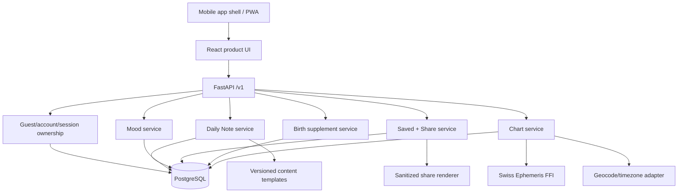
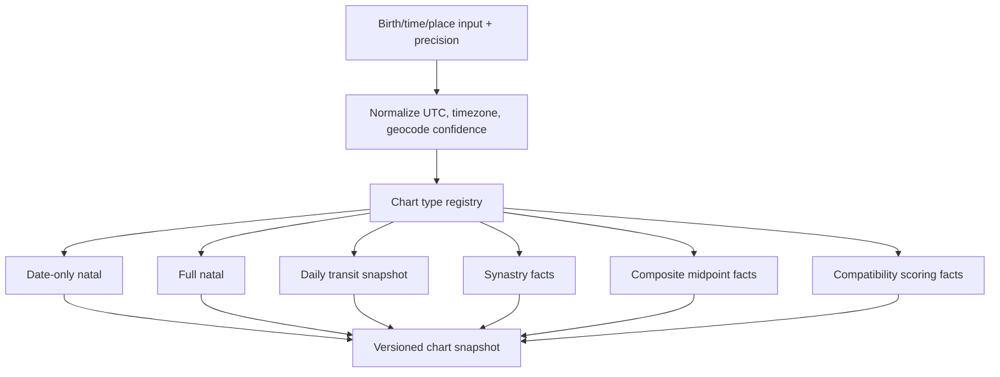
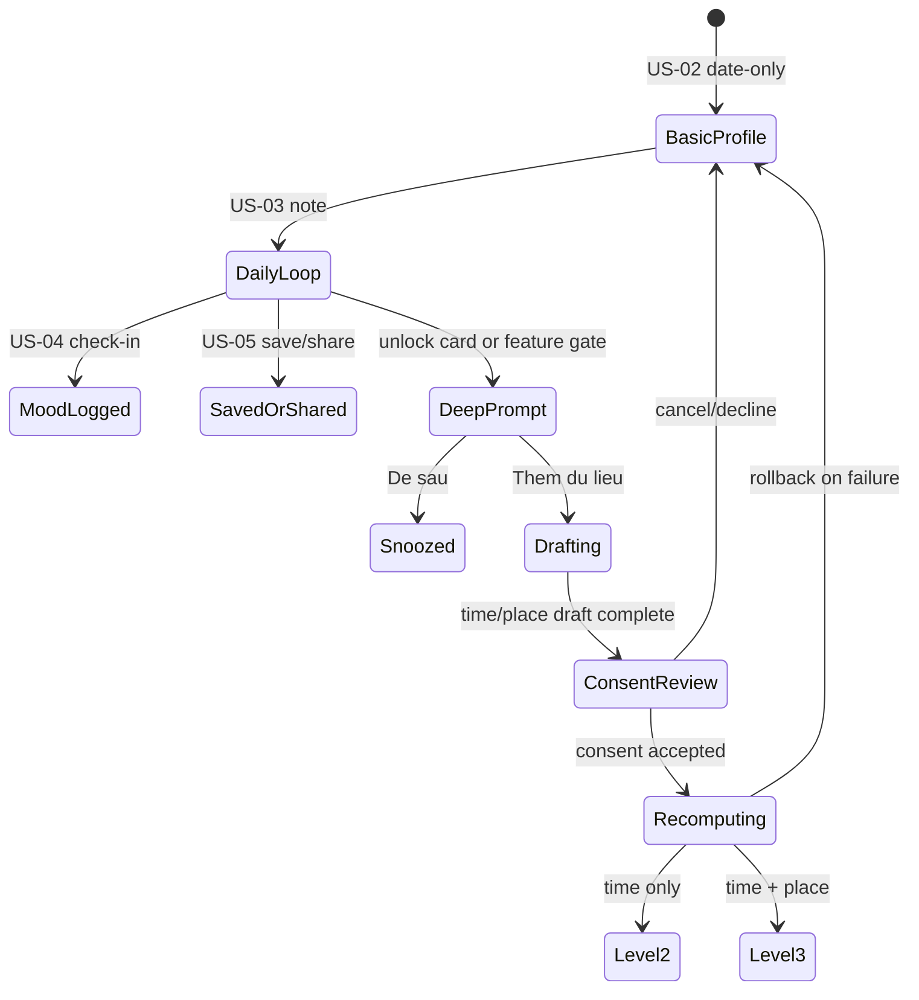

# US03-US06 App Product and Chart Engine - Plan

## Goal Capsule

- **Objective:** Lá Lành becomes a usable app-first product slice for Daily Note, mood check-in, saved/shared notes, and progressive birth-time/birthplace unlock, with a stronger chart engine that can support later Lá Ghép, Vòng Lá, recap, and matching features.
- **Means:** Preserve the current Electric Note baseline, extend the existing FastAPI/PostgreSQL/React foundation, add server-owned Daily Note and profile-supplement flows, and upgrade the Swiss Ephemeris wrapper into a versioned multi-chart engine.
- **Authority:** US-03 to US-06 define product behavior; `docs/foundation/` defines strategy and long-term scope; `docs/reference/current-product-baseline-2026-09-01.md` defines the visual baseline; this plan defines implementation sequencing.
- **Execution profile:** Deep, code, app-first, privacy-sensitive, persistent data, native-app packaging, chart-computation foundation.
- **Stop conditions:** Stop public release if Swiss Ephemeris licensing remains unresolved, if chart outputs cannot be validated against golden fixtures, if raw birth data appears in URL/localStorage/analytics/logs/share artifacts, or if the flow requires login before US-03 to US-06 value is delivered.
- **Tail ownership:** Execution must finish code, migrations, contracts, tests, visual QA, app-shell smoke checks, privacy checks, and documentation updates.

---

## Product Contract

### Summary

US-03 to US-06 extend the existing guest-first MVP from a birth reveal into a repeatable app loop.
The user lands on a lively Daily Note, checks in with mood, saves or shares the note safely, and can add birth time/place only when a deeper layer becomes relevant.
The implementation must not become a mock horoscope screen.
It must use the backend chart foundation and preserve privacy, precision labels, and app-first UX.

### Problem Frame

The current product has the right visual soul, but US-03 to US-06 are still too thin for a real MVP.
Home currently derives note text from local sign details, mood and saved state live in localStorage, share is mostly a static card, and the unlock card is disabled.
The chart engine can calculate natal bodies and houses for a single input shape, but it does not yet expose chart types, readiness flags, transit snapshots, synastry/composite contracts, or profile-supplement persistence.

If this layer is not planned carefully, the app will look cute but feel basic.
It will also force future Lá Ghép and Vòng Lá features to re-build astrology logic in separate places.
This plan turns US-03 to US-06 into a product backbone: daily ritual, personal context, safe virality, progressive data collection, and reusable chart computation.

### Product Contract preservation

Product Contract unchanged from US-03 to US-06.
The plan adds implementation strategy and future-ready chart scope, but does not change the settled product decisions: no early login wall, app-first experience, Electric Note direction, privacy-by-default sharing, and progressive birth data collection.

### Requirements

**Daily Note and Home**

- R1. Home must open on Daily Note for users with a current birth profile and must not redirect to login before showing value.
- R2. Daily Note content must be server-owned and versioned; client-side sign copy can remain only as temporary fallback for tests or no-profile states.
- R3. Daily Note must combine safe available context: chart readiness, current date, basic placement facts, and mood history only when consent and data are present.
- R4. Home must keep the Electric Note hierarchy: brand, greeting, transit/context pill, note card, mood row, share/save actions, unlock prompt, bottom nav.
- R5. Home must support loading, stale, empty, API failure, no-profile, offline, and expired-session states without spinner dead ends.

**Mood check-in**

- R6. Mood check-in must save one active mood per daily note per user/session, with idempotent update semantics.
- R7. Mood choices must remain finite and lightweight: `Rực`, `Chill`, `Đuối`, `Căng`, `Lạc trôi`.
- R8. Mood state may personalize future notes only as a bounded signal; no free-text mood capture belongs in MVP.
- R9. Guest mood must work before login; server sync should occur when a valid guest/account exists, with safe local fallback for app continuity.

**Save and share**

- R10. Save/unsave must be idempotent and available to guest users.
- R11. Saved notes must preserve immutable note snapshots so future content changes do not rewrite what the user saved.
- R12. Share card preview must support 9:16 and 1:1 formats, preserve the selected Electric Note visual direction, and remain scannable on mobile.
- R13. Share card, exported file, public preview, analytics, and metadata must not contain raw birth date, birth time, birthplace, coordinates, guest token, account id, email, phone, or internal prompt data.
- R14. Native share should be used inside the app where available; download/copy-link fallback should exist for web/PWA.

**Birth time/place supplement**

- R15. Birth time/place must be asked only after value is shown or when a user intentionally tries to open a deeper layer.
- R16. The supplement flow must support exact time, approximate time window, and unknown time, with precision persisted and visible.
- R17. Birthplace search must collect city-level birthplace, not GPS or full address.
- R18. Additional consent for purpose `birth_profile_deep` must be shown and accepted before the app persists birth time/place.
- R19. Geocode, timezone, historical offset, and DST resolution must be server-owned; client must not be the final source of truth.
- R20. Recompute must be atomic and rollback-safe; old profile and snapshots stay valid if deeper recompute fails.
- R21. House/Rising insights must unlock only when data completeness is sufficient; unknown/approx data must not be presented as exact.

**Chart engine foundation**

- R22. The chart engine must expose a typed chart-type registry for natal, date-only natal, transit, synastry, composite, compatibility scoring, and future solar/lunar return support.
- R23. Natal chart output must include bodies, signs, degrees, retrograde, aspects, angles, houses, house system, calculation profile, ephemeris provenance, and input precision.
- R24. Transit computation must support system-wide daily snapshots and user-specific transit-to-natal/house mapping for future Daily Note and recap.
- R25. Synastry must compare two natal snapshots and produce aspect/contact facts for Sun, Moon, Venus, Mars, Mercury, Jupiter, Saturn, angles, and configured points.
- R26. Composite must support midpoint-method output with clear caveat that it is a mathematical relationship chart, not a real sky moment.
- R27. Compatibility scoring must be a separate deterministic layer on top of chart facts, not embedded in ephemeris calculation.
- R28. Every chart result must carry calculation profile, ephemeris version/checksum, tzdb version when applicable, schema version, and reproducibility metadata.

**App-first, privacy, and operations**

- R29. The primary surface must behave like a mobile app, with native shell path planned for iOS/Android and web retained as companion/test surface.
- R30. Typography must be consolidated into a small token system so the app stops feeling like mixed prototype fonts.
- R31. Sensitive values must not be stored in plain localStorage; app local persistence must use secure/native storage where available and bounded fallback where not.
- R32. All relevant endpoints must derive ownership from secure session/account context; client-supplied owner ids must not grant access.
- R33. App store privacy labels, Google Play Data Safety, in-app privacy policy access, deletion path, and consent withdrawal must be kept implementation-visible.
- R34. Swiss Ephemeris licensing remains a public-release gate.

### Actors

- A1. Guest user who wants value before account creation.
- A2. Returning guest on the same device.
- A3. Account user after future US-19 claim/sync.
- A4. Product/content operator maintaining note templates and interpretation rules.
- A5. Engineering/operator maintaining ephemeris files, chart profiles, privacy scans, and release gates.
- A6. Future matching/social systems consuming chart facts for Lá Ghép, Vòng Lá, icebreakers, and recap.

### Key Flows

- F1. Daily Note return loop
  - **Trigger:** User opens app after US-02.
  - **Steps:** App resumes session, loads current birth snapshot, requests Daily Note, shows Electric Note Home, lets user mood-check, save, share, or open the deeper-layer prompt.
  - **Outcome:** User gets a useful daily ritual without login.
  - **Covers:** R1–R14.
- F2. Mood update
  - **Trigger:** User taps a mood chip.
  - **Steps:** UI updates optimistically, writes mood for today, handles retry/offline, and keeps one active mood per note.
  - **Outcome:** Mood becomes a small personalization signal without turning into journaling.
  - **Covers:** R6–R9.
- F3. Save and share Note
  - **Trigger:** User taps save or share on a Daily Note.
  - **Steps:** Save creates an immutable snapshot; share opens preview, lets user choose format/privacy, then native share or fallback.
  - **Outcome:** The note can travel or be kept without leaking birth data.
  - **Covers:** R10–R14, R31–R33.
- F4. Progressive deep profile unlock
  - **Trigger:** User taps unlock card or reaches a feature gate.
  - **Steps:** Prompt explains value, user can defer, enters exact/approx/unknown time, searches birthplace, reviews consent, saves, recomputes, and sees Level 2/3 unlock.
  - **Outcome:** More sensitive data is collected only when it gives visible value.
  - **Covers:** R15–R21, R31–R33.
- F5. Chart engine reuse for future features
  - **Trigger:** Daily Note, Lá Ghép, Vòng Lá, recap, or matching requests chart facts.
  - **Steps:** Feature calls typed chart service, receives natal/transit/synastry/composite facts, then interpretation/scoring layer maps facts to product content.
  - **Outcome:** One chart foundation serves many product surfaces without duplicate astrology logic.
  - **Covers:** R22–R28.

### Acceptance Examples

- AE1. Given a guest has completed US-02, when they open `/home`, then Home shows a server-backed Daily Note and does not ask for login.
- AE2. Given Daily Note API fails, when Home loads, then UI shows a retryable note state and keeps nav/actions usable where safe.
- AE3. Given user taps `Căng` then `Chill` quickly, when persistence settles, then only `Chill` is active for that daily note.
- AE4. Given user saves the same note three times, when Saved tab loads, then one saved item exists and its snapshot is immutable.
- AE5. Given user exports a share card, when the asset text, metadata, URL, and analytics are scanned, then no DOB/time/place/token/internal id appears.
- AE6. Given user chooses approximate birth time, when chart recompute succeeds, then precision is stored and future insight has approximate disclaimer.
- AE7. Given user skips birthplace, when recompute finishes, then House/Rising remains locked and the app explains why.
- AE8. Given geocode or chart recompute fails, when user retries or leaves, then the previous profile snapshot remains active.
- AE9. Given two users have natal snapshots, when synastry is calculated, then it returns deterministic aspect facts and no interpretation text.
- AE10. Given composite chart is requested, when result is returned, then provenance marks it as midpoint-method mathematical chart, not a real transit/natal sky.

### Success Criteria

- US-03, US-04, US-05, and US-06 AC and DoD pass through app-first UI, API, persistence, and tests.
- Home and share screens preserve the Electric Note baseline while improving font consistency and scanability.
- Chart engine supports typed outputs for date-only natal, full natal, daily transit snapshot, transit-to-natal mapping, synastry, composite, and compatibility facts.
- App path can run as mobile-native shell or PWA without relying on `file://` links.
- Automated privacy checks prove no raw birth data, place data, coordinates, token, or internal id leaks into URL/localStorage/share/analytics/logs.
- Golden chart tests validate Swiss Ephemeris outputs for natal houses, aspects, transits, synastry contacts, and composite midpoint behavior.

### Scope Boundaries

#### In scope

- Full US-03 to US-06 implementation across API, contracts, app UI, tests, and docs.
- Mobile app-first packaging path using the existing React app in a native shell.
- Server-owned Daily Note, mood, saved notes, share artifacts, birth supplement, and chart snapshot readiness.
- Chart engine foundation for natal, transit, synastry, composite, and compatibility facts.
- Privacy/security hardening needed for birth data, place data, share, analytics, and app store readiness.

#### Deferred to Follow-Up Work

- US-07 deep insight content UI beyond unlock handoff.
- Full Lá Ghép creation/reveal UI from US-12 and US-13.
- Vòng Lá matching pool, request, mutual match, and chat from US-14 to US-17.
- Recap generation from US-18.
- Full account auth, claim, cross-device sync, and account deletion UI from US-19.
- Live push notifications and app store submission itself.
- Paid content, subscriptions, booking, or Lá Dẫn workflows.

#### Explicit non-goals

- Copying astro.com UI, copy, artwork, or brand.
- Using mock horoscope data as a production runtime path.
- Asking for GPS/device location to infer birthplace.
- Showing House/Rising when data is missing or approximate beyond the calculation profile.
- Supporting sidereal/Vedic/heliocentric charts in this MVP slice.

### Sources and Research

- Local product sources: `docs/foundation/la-lanh-prd.md`, `docs/foundation/la-lanh-srs.md`, `docs/foundation/la-lanh-product-plan-v2.md`.
- Local story sources: `docs/user-stories/US-03-doc-note-hom-nay.md`, `docs/user-stories/US-04-mood-check-in.md`, `docs/user-stories/US-05-luu-va-chia-se-note.md`, `docs/user-stories/US-06-bo-sung-gio-noi-sinh.md`.
- Local baseline: `docs/reference/current-product-baseline-2026-09-01.md`, `prototype/design-qa.md`, `prototype/home-screenshot.png`, `prototype/card-screenshot.png`.
- Current codebase: `apps/api/app/domains/astro/engine.py`, `apps/api/app/domains/birth/service.py`, `apps/web/src/features/home/HomePage.tsx`, `apps/web/src/features/saved/SavedPage.tsx`, `apps/web/src/features/profile/ProfilePage.tsx`.
- Swiss Ephemeris official programmer docs: https://www.astro.com/swisseph/swephprg.htm
- Astro.com composite chart FAQ: https://www.astro.com/faq/fq_fh_compo_e.htm
- Apple App Store privacy/data-use guidance: https://developer.apple.com/app-store/user-privacy-and-data-use/
- Apple App Review Guidelines privacy sections: https://developer.apple.com/app-store/review/guidelines/
- Google Play User Data policy: https://support.google.com/googleplay/android-developer/answer/10144311
- Vietnam Decree 13/2023/ND-CP official text: https://vanban.chinhphu.vn/default.aspx?docid=207759&pageid=27160
- Capacitor official docs for native app shell: https://capacitorjs.com/docs
- Capacitor storage guidance: https://capacitorjs.jp/docs/v7/guides/storage

---

## Planning Contract

### Key Technical Decisions

- KTD1. **App-first via Capacitor shell for MVP.** Use the existing React/Vite app as the product UI and wrap it with Capacitor for iOS/Android shell, native share, deep links, app lifecycle, and native storage boundaries. This preserves current UI velocity while making the product an app. Governs R29–R31.
- KTD2. **One backend chart engine, many chart products.** Upgrade `NatalChartEngine` into a chart service with typed calculators and shared provenance. Product features consume facts from this service, then apply interpretation/scoring separately. Governs R22–R28.
- KTD3. **Swiss Ephemeris remains the calculation core.** Keep the owned FFI boundary and pinned ephemeris files. Add chart types on top of it rather than bringing in a second astrology API. This protects accuracy and reproducibility. Governs R22–R28, R34.
- KTD4. **Whole Sign for automated product logic, Placidus for reference parity.** Keep `astro_reference_v1` for astro.com-style validation and use `la_lanh_automated_v1` for app automation so matching/Daily Note logic stays stable. Governs R21–R28.
- KTD5. **Daily Note is content-template driven.** Store versioned templates keyed by safe chart facts, not generated free text. This prevents hallucinated astrology and makes saved/share snapshots stable. Governs R2–R5, R10–R14.
- KTD6. **Mood is a bounded signal.** Mood updates are structured enums and daily-scoped. They affect future personalization only through explicit rules, not hidden profiling. Governs R6–R9, R33.
- KTD7. **Save/share snapshots are immutable and privacy-sanitized.** Persist a sanitized note snapshot for save/share. Never serialize raw birth data or internal identifiers into exported assets. Governs R10–R14.
- KTD8. **Birth supplement saves only after consent.** Keep time/place drafts volatile until the user accepts the deep-profile consent. Recompute only after persistence is authorized. Governs R15–R21, R31–R33.
- KTD9. **Geocoding is server-owned and city-level.** The client sends search text and selected opaque place reference. The server resolves timezone and coordinates and stores only what is necessary. Governs R17–R20.
- KTD10. **No production localStorage for sensitive data.** Replace sensitive localStorage use with secure app storage or server state. Local fallback may store only sanitized UI continuity data. Governs R31–R33.
- KTD11. **Font system is a product dependency, not polish.** Consolidate type into display, app, and note roles with licensed or stable bundled fonts. Random system fallbacks are acceptable only behind the token stack. Governs R4, R12, R29–R30.
- KTD12. **Release is license-gated.** Development can continue with vendored Swiss Ephemeris, but public release remains blocked until AGPL/professional-license decision is recorded. Governs R34.

### High-Level Technical Design

#### Product surface and data flow

#### Chart engine layering

#### Progressive data collection

### Assumptions

- The immediate app approach can use Capacitor instead of starting a separate native Swift/Kotlin app.
- The first implemented native-app target can be iOS simulator/local build, with Android added in the same structure or a follow-up unit if local tooling blocks it.
- Server persistence remains PostgreSQL-first with SQLite allowed only for local development/tests.
- A city-level geocoding provider can be selected during implementation as long as it returns stable place ids, timezone data, and country/subdivision display.
- Content templates for US-03 can start as deterministic reviewed templates, not live AI generation.
- Public release will not happen before the Swiss Ephemeris license gate is resolved.

### Sequencing

Build from foundations outward.
First freeze the baseline and fix app/design tokens.
Then extend data contracts and chart engine.
Then implement Daily Note, mood, save/share, and birth supplement services.
Finally wire mobile-app UI, native share/storage, privacy scans, and end-to-end verification.

---

## Implementation Units

### U1. Preserve current baseline and normalize visual system

- **Goal:** Preserve the selected Electric Note product feel while removing font chaos and known privacy leaks in visual mocks.
- **Requirements:** R4, R12, R29–R31.
- **Files:** `docs/reference/current-product-baseline-2026-09-01.md`, `prototype/design-qa.md`, `apps/web/src/shared/styles/global.css`, `apps/web/src/shared/ui/BrandMark.tsx`, `apps/web/src/app/AppShell.tsx`, `apps/web/src/features/home/HomePage.tsx`, `apps/web/tests/e2e/product-flow.spec.ts`.
- **Approach:** Treat the baseline doc and screenshots as visual reference. Consolidate fonts into three roles: display, app text, and handwritten note. Remove DOB from any visible share/card mock and use privacy-safe display copy.
- **Test Scenarios:** Verify Home still matches Electric Note composition at mobile width; verify share/card screenshots do not contain DOB; verify text scale does not overlap core CTAs; verify bottom nav and controls keep 44 px touch targets.
- **Verification:** `pnpm web:lint`, `pnpm web:typecheck`, `pnpm web:e2e`, visual review against `prototype/home-screenshot.png` and `prototype/card-screenshot.png`.

### U2. Extend contracts and database schema for US03-US06

- **Goal:** Add persistent models and API contracts for Daily Note, mood check-in, saved notes, share artifacts, birth supplements, and chart readiness.
- **Requirements:** R1–R21, R28, R31–R33.
- **Files:** `apps/api/migrations/versions/`, `apps/api/app/domains/daily/`, `apps/api/app/domains/mood/`, `apps/api/app/domains/saved/`, `apps/api/app/domains/share/`, `apps/api/app/domains/birth/`, `apps/api/app/api/v1/routes/`, `packages/contracts/openapi/v1.json`, `packages/contracts/src/v1.ts`, `apps/api/tests/`.
- **Approach:** Add normalized tables with guest/account ownership, immutable snapshots, consent records, and idempotency keys. Keep owner derivation server-side. Regenerate OpenAPI contracts after route changes.
- **Test Scenarios:** Migration creates expected tables; unauthorized owner access returns non-enumerating failure; duplicate mood/save/share/birth supplement requests replay idempotently; deleting guest cascades owned records.
- **Verification:** `pnpm contracts:generate`, `pnpm contracts:check`, `pnpm api:test`.

### U3. Upgrade chart engine to multi-chart foundation

- **Goal:** Expand the existing Swiss Ephemeris-backed engine from date-only/full natal into typed chart calculators for future features.
- **Requirements:** R19–R28, R34.
- **Files:** `apps/api/app/domains/astro/engine.py`, `apps/api/app/domains/astro/models.py`, `apps/api/app/domains/astro/aspects.py`, `apps/api/app/domains/astro/profiles/`, `apps/api/app/domains/astro/ffi/swisseph.py`, `apps/api/tests/astro/`, `vendor/swisseph/checksums.txt`, `docs/legal/swiss-ephemeris-release-gate.md`.
- **Approach:** Introduce chart type enum and result models for `date_only_natal`, `natal`, `daily_transit`, `transit_to_natal`, `synastry`, `composite_midpoint`, and `compatibility_facts`. Keep interpretation outside the engine. Add provenance to every result.
- **Test Scenarios:** Natal positions match existing golden fixtures; Whole Sign and Placidus houses are distinct and profile-bound; daily transit is deterministic for a UTC date; synastry returns configured aspects; composite midpoint handles 0/360 crossing correctly; unsupported chart type fails typed validation.
- **Verification:** `pnpm astro:build-native`, `pnpm astro:verify-assets`, `pnpm api:test apps/api/tests/astro`, `pnpm api:typecheck`.

### U4. Add geocode/timezone and birth supplement backend

- **Goal:** Implement US-06 backend for time/place draft, consent, city-level place selection, server-side timezone resolution, and rollback-safe recompute.
- **Requirements:** R15–R21, R31–R33.
- **Files:** `apps/api/app/domains/birth/service.py`, `apps/api/app/domains/birth/models.py`, `apps/api/app/domains/birth/tables.py`, `apps/api/app/domains/birth/postgres.py`, `apps/api/app/domains/geo/`, `apps/api/app/api/v1/routes/birth_profiles.py`, `apps/api/tests/birth/`, `apps/api/tests/integration/test_local_product_flow.py`.
- **Approach:** Add supplement endpoints for time mode, place search/selection, consent review, and recompute. Store raw sensitive values encrypted. Keep draft volatile until consent. Use idempotency hash across profile, supplement payload, and consent version.
- **Test Scenarios:** Exact, approximate, and unknown time validate correctly; place query under two chars is rejected client/server; selected place is city-level; consent decline saves nothing; recompute failure preserves previous snapshot; Level 2/3 readiness updates correctly.
- **Verification:** `pnpm api:test apps/api/tests/birth`, `pnpm contracts:check`, privacy scan.

### U5. Implement Daily Note service and Home API

- **Goal:** Turn US-03 into a server-backed Daily Note product loop.
- **Requirements:** R1–R5, R22–R24, R28.
- **Files:** `apps/api/app/domains/daily/`, `apps/api/app/api/v1/routes/daily_notes.py`, `apps/api/app/domains/astro/`, `apps/api/tests/daily/`, `apps/web/src/features/home/HomePage.tsx`, `apps/web/src/shared/api/client.ts`.
- **Approach:** Generate or select one daily note snapshot per owner/date/content profile. Use chart readiness to choose allowed template depth. Level 1 gets safe Sun/date note; Level 2/3 can include deeper labels only when data exists.
- **Test Scenarios:** Same user/date replays same Daily Note; next date creates a new note; Level 1 never receives Moon/House claims; API failure gives retryable UI; expired guest routes to welcome/no-session recovery.
- **Verification:** `pnpm api:test apps/api/tests/daily`, `pnpm web:test`, `pnpm web:e2e`.

### U6. Implement mood check-in persistence

- **Goal:** Turn US-04 mood check-in into a real bounded personalization signal.
- **Requirements:** R6–R9, R31–R33.
- **Files:** `apps/api/app/domains/mood/`, `apps/api/app/api/v1/routes/moods.py`, `apps/api/tests/mood/`, `apps/web/src/features/home/HomePage.tsx`, `apps/web/src/shared/api/client.ts`, `apps/web/tests/e2e/product-flow.spec.ts`.
- **Approach:** Store one mood per daily note per owner. Use optimistic UI with rollback. Keep local app fallback sanitized and sync when session is available.
- **Test Scenarios:** First mood save succeeds; second mood updates same record; unsupported mood enum is rejected; offline state keeps UI usable; guest deletion clears mood state.
- **Verification:** `pnpm api:test apps/api/tests/mood`, `pnpm web:test`, `pnpm web:e2e`.

### U7. Implement saved notes and privacy-safe share artifacts

- **Goal:** Turn US-05 save/share into a safe viral and retention loop.
- **Requirements:** R10–R14, R31–R33.
- **Files:** `apps/api/app/domains/saved/`, `apps/api/app/domains/share/`, `apps/api/app/api/v1/routes/saved_notes.py`, `apps/api/app/api/v1/routes/share_artifacts.py`, `apps/web/src/features/saved/SavedPage.tsx`, `apps/web/src/features/card/CardPage.tsx`, `apps/web/src/shared/api/client.ts`, `apps/web/tests/e2e/product-flow.spec.ts`, `scripts/verify-privacy.mjs`.
- **Approach:** Save immutable sanitized snapshots. Render preview from snapshot. Export card as SVG/PNG where supported. Use Web Share/Capacitor Share in app. Add copy-link/download fallback and cancel/error handling.
- **Test Scenarios:** Save duplicate stays single; unsave is idempotent; saved snapshot survives Daily Note changes; share preview switches 9:16/1:1 without changing text; exported artifact and metadata contain no DOB/time/place/token/id; native share cancel is not counted completed.
- **Verification:** `pnpm api:test`, `pnpm web:test`, `pnpm web:e2e`, `pnpm verify:runtime`.

### U8. Implement US-06 app UI

- **Goal:** Build the progressive birth time/place UX as an app-first flow.
- **Requirements:** R15–R21, R29–R33.
- **Files:** `apps/web/src/features/birth/`, `apps/web/src/features/profile/ProfilePage.tsx`, `apps/web/src/features/home/HomePage.tsx`, `apps/web/src/shared/api/client.ts`, `apps/web/tests/e2e/product-flow.spec.ts`, `apps/web/src/shared/styles/global.css`.
- **Approach:** Add unlock prompt, time mode screen, birthplace search, review/consent screen, recompute loading/success/error, and profile edit/remove. Keep “Để sau” visible and non-blocking. Use precision labels throughout.
- **Test Scenarios:** User snoozes and returns Home; exact time path reaches Level 2/3; approximate path shows disclaimer; unknown time keeps House locked; place not found allows retry/skip; consent decline persists nothing; edit/remove hạ readiness đúng.
- **Verification:** `pnpm web:lint`, `pnpm web:typecheck`, `pnpm web:test`, `pnpm web:e2e`.

### U9. Add app shell, native storage, native share, and deep link readiness

- **Goal:** Make the product installable/runnable as an app, with web as companion surface.
- **Requirements:** R14, R29–R33.
- **Files:** `apps/mobile/`, `apps/web/package.json`, `apps/web/vite.config.ts`, `apps/web/public/manifest.webmanifest`, `apps/web/src/shared/platform/`, `apps/web/src/shared/storage/`, `apps/web/tests/e2e/`, `.env.example`.
- **Approach:** Add Capacitor app shell and platform abstraction for share, storage, app lifecycle, and deep-link handling. Use native secure storage where available; keep web fallback sanitized and bounded.
- **Test Scenarios:** App shell opens Home without `file://`; native share adapter is called where available; web fallback downloads/copies safely; app background during share/recompute resumes state; secure storage path does not store sensitive data in plain localStorage.
- **Verification:** `pnpm web:build`, `pnpm web:e2e`, platform smoke on available simulator/device, privacy scan.

### U10. Privacy, analytics, and release gates

- **Goal:** Make privacy/security visible and enforceable for US03-US06 and chart engine expansion.
- **Requirements:** R13, R18, R31–R34.
- **Files:** `scripts/verify-privacy.mjs`, `scripts/verify-no-mock-runtime.mjs`, `docs/legal/privacy-security-flow-notes.md`, `docs/legal/swiss-ephemeris-release-gate.md`, `apps/api/app/observability/`, `apps/api/app/middleware/`, `apps/web/src/shared/analytics/`, `apps/api/tests/`.
- **Approach:** Extend scanners to catch birth time/place/query/coords/share tokens. Add safe analytics event schemas. Ensure logs are redacted. Update legal notes for app store privacy labels and data deletion.
- **Test Scenarios:** Analytics events reject raw sensitive fields; logs redact profile/place identifiers; URL scan catches birth fields; share token is opaque and unguessable; release gate fails if Swiss Ephemeris license decision is absent.
- **Verification:** `pnpm verify:runtime`, `pnpm api:test`, `pnpm check`.

### U11. End-to-end integration and documentation handoff

- **Goal:** Prove US03-US06 work together as one product and leave clear docs for the next flow.
- **Requirements:** R1–R34.
- **Files:** `apps/web/tests/e2e/product-flow.spec.ts`, `apps/api/tests/integration/test_local_product_flow.py`, `docs/user-stories/README.md`, `README.md`, `prototype/design-qa.md`.
- **Approach:** Add one full journey from guest Home Daily Note through mood, save/share, unlock prompt, birth supplement, recompute, profile edit/remove, and deletion. Update docs so US07/Lá Ghép/Vòng Lá can consume chart facts instead of inventing their own engine.
- **Test Scenarios:** Full happy path; API failures; expired guest; under-16 guard remains before sending DOB; Level 1/2/3 gating; delete data clears server and local state.
- **Verification:** `pnpm check`, `pnpm web:e2e`, manual mobile visual QA.

---

## Verification Contract

| Gate | Command / method | Applies to |
|---|---|---|
| Contracts | `pnpm contracts:check` | U2, U4–U8 |
| Full repo check | `pnpm check` | Final gate, U10–U11 |
| API tests | `pnpm api:test` | U2–U7, U10–U11 |
| API typecheck/lint | `pnpm api:typecheck` and `pnpm api:lint` | U2–U7, U10 |
| Web tests | `pnpm web:test` | U5–U9 |
| Web lint/typecheck | `pnpm web:lint` and `pnpm web:typecheck` | U1, U5–U9 |
| Browser E2E | `pnpm web:e2e` | U1, U5–U9, U11 |
| Swiss Ephemeris assets | `pnpm astro:build-native` and `pnpm astro:verify-assets` | U3 |
| Runtime privacy/mock guards | `pnpm verify:runtime` | U7, U9–U11 |
| Visual QA | Compare current app against `docs/reference/current-product-baseline-2026-09-01.md` and screenshots | U1, U7–U9, U11 |
| Mobile app smoke | Open app shell on available local simulator/device and verify Home/share/storage flows | U9, U11 |

### Required test coverage

- Unit tests for chart math wrappers, aspect/orb logic, composite midpoint wrap-around, compatibility fact generation, time precision, and validation.
- Repository/API tests for Daily Note, mood, saved notes, share artifacts, birth supplement consent, and guest deletion cascade.
- Integration tests for guest ownership and object-level authorization.
- E2E tests for Daily Note, mood, save/share, birth supplement, and data deletion.
- Privacy tests for URL, local storage, analytics, logs, share image metadata, and public preview.

---

## Definition of Done

- US-03 AC/DoD pass: server-backed Daily Note, app Home states, content versioning, and no login wall.
- US-04 AC/DoD pass: bounded mood check-in, idempotent persistence, optimistic UI, offline/retry behavior, and no free-text mood.
- US-05 AC/DoD pass: saved collection, immutable snapshots, privacy-safe share preview/export/link, native share/fallback, and cancel/error handling.
- US-06 AC/DoD pass: contextual prompt, exact/approx/unknown time, city-level birthplace, consent before persistence, server geocode/timezone, rollback-safe recompute, edit/remove, and Level 2/3 readiness.
- Chart engine exposes and tests date-only natal, full natal, daily transit, transit-to-natal, synastry, composite midpoint, and compatibility fact outputs.
- Mobile app-first path exists through Capacitor shell or documented equivalent; web remains companion, not the only product surface.
- Font system is consistent and applied across US03-US06 screens.
- Sensitive birth/profile/place/share data does not leak into URL, localStorage, analytics, logs, share artifacts, or public previews.
- `pnpm check`, `pnpm web:e2e`, `pnpm astro:verify-assets`, and privacy/runtime guard scripts pass.
- Swiss Ephemeris public-release gate remains explicit and unresolved until legal/product owner records AGPL or Professional License decision.
- Abandoned experimental code, mock runtime paths, and one-off prototype-only states are removed before handoff.

---

## Appendix

### Chart types planned for the shared engine

| Chart type | MVP use | Future use | Notes |
|---|---|---|---|
| Date-only natal | US-02, US-03 fallback | Low-friction onboarding | Must return uncertainty/candidates near ingress. |
| Full natal | US-06 unlock, US-07 | Profile, deep insight | Requires time/place for Houses/Rising. |
| Daily transit snapshot | US-03 richer note | Recap, push hooks | System-wide daily facts cached once. |
| Transit-to-natal | Future US-07 | Personalized Daily Note | Requires natal snapshot and transit snapshot. |
| Synastry | Foundation only now | Lá Ghép, Vòng Lá matching | Produces facts, not interpretation. |
| Composite midpoint | Foundation only now | Lá Ghép, Lá Dẫn reading | Mark as mathematical construction. |
| Compatibility facts/scoring | Foundation only now | Vòng Lá ranking, icebreakers | Deterministic layer over synastry facts. |
| Solar/lunar return | Deferred | Seasonal recap/premium | Keep registry extensible, do not implement now unless cheap after core. |

### Security and compliance notes

Apple requires clear privacy policy access, consent for collection/use, data minimization, withdrawal/deletion paths, accurate privacy labels, and no forced tracking consent.
Google Play requires transparent disclosure, secure handling, privacy policy, accurate Data Safety, and account/data deletion when accounts exist.
Vietnam Decree 13/2023/ND-CP is already noted locally as requiring specific, informed, demonstrable consent and deletion handling.
These are product constraints, not legal advice; legal review remains required before public release.
