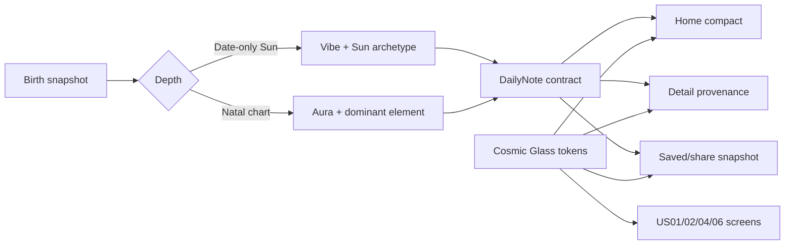

# Cosmic Glass Signal US01-US06 - Plan

## Goal Capsule

- **Objective:** Lá Lành có một trải nghiệm app-first thống nhất, hiện đại, thần bí và dễ đọc cho toàn bộ US01–US06, với giá trị được mở trước đăng nhập.
- **Means:** Áp dụng Cosmic Glass Signal như design system chung; thay nhãn cung trực diện bằng archetype ngắn Vibe/Aura; hoàn thiện các gap MVP quan trọng trong Daily Note, share và privacy.
- **Execution profile:** Deep, cross-cutting React/FastAPI/contracts, design-sensitive, privacy-sensitive.
- **Stop conditions:** Không release nếu archetype che giấu provenance, glass làm giảm contrast/reflow, share chứa dữ liệu sinh, hoặc guest bị chặn bởi login.

---

## Problem Frame

UI hiện tại dùng quá nhiều tỷ lệ chữ và chưa tạo được cảm giác sản phẩm đồng nhất. Nhãn “Mặt Trời Cự Giải” vừa dài vừa biến người dùng thành một cung duy nhất. Bản direction 02 giải quyết tốt chiều sâu và sự hiện đại, nhưng cần được chuyển thành token/component thật thay vì phủ hiệu ứng riêng lẻ lên Home.

---

## Requirements

- **R1.** Direction 02 Cosmic Glass Signal là visual source of truth cho tất cả màn US01–US06. (session-settled: user-directed — chosen over directions 01, 03, 04 and 05 after reviewing five mockups.)
- **R2.** Toàn app chỉ dùng một sans family; handwritten chỉ là accent tối đa một lần/màn; type scale có tối đa năm token và giữ hierarchy khi text scale 200%.
- **R3.** Light/dark cùng một component system. Dark là expression mạnh nhất của Cosmic Glass; light dùng nền mist/ivory và glass đủ đục để đọc được.
- **R4.** Home không dùng cung hoàng đạo làm nhãn tóm tắt. Level 1 dùng `Vibe · <từ 3–5 chữ>`; Level 2/3 dùng `Aura · <từ 3–5 chữ>`.
- **R5.** Archetype là deterministic presentation metadata từ chart snapshot, không phải kết luận tính cách tuyệt đối; provenance detail vẫn nêu placement và precision thật.
- **R6.** 12 Sun archetype Level 1: Bạch Dương `Nóng`, Kim Ngưu `Bền`, Song Tử `Lanh`, Cự Giải `Mềm`, Sư Tử `Rực`, Xử Nữ `Gọn`, Thiên Bình `Duyên`, Bọ Cạp `Sâu`, Nhân Mã `Phiêu`, Ma Kết `Chắc`, Bảo Bình `Khác`, Song Ngư `Mộng`.
- **R7.** Aura Level 2/3 lấy dominant element có deterministic tie-break: Fire `Rực`, Earth `Chắc`, Air `Lanh`, Water `Mềm`; không suy diễn từ dữ liệu thiếu.
- **R8.** US01–US06 giữ guest-first, consent theo purpose, ownership server-side, share privacy default và data deletion.
- **R9.** Daily Note detail có compact body và full body 80–140 từ, content version/provenance/fallback metadata; Home vẫn scan trong 3–5 giây.
- **R10.** Mood, save/undo, PNG share, safe link, birth supplement exact/approx/unknown và settings theme tiếp tục hoạt động sau redesign.
- **R11.** Material blur chỉ dùng cho navigation/control/locked layer; content card đủ đục và contrast thường ≥4.5:1.
- **R12.** Mọi màn có loading/error/empty/offline/fallback; controls chính ≥44px; không horizontal overflow ở 320/390/430px.

---

## Key Technical Decisions

- **KTD1 — Archetype belongs to the server content contract.** Server tạo `persona_label`, `persona_mode` và provenance; client không tự đoán từ chữ hiển thị. Governs R4–R7.
- **KTD2 — Presentation nickname never replaces factual provenance.** “Vibe/Aura” chỉ là lớp tóm tắt; màn detail/profile vẫn giải thích Sun, chart depth và precision. Đây là challenge bắt buộc đối với yêu cầu rút gọn để tránh dark pattern. Governs R5.
- **KTD3 — One token system, two themes.** CSS semantic tokens quyết định material, type, color, spacing; từng page không tự tạo palette/font scale. Governs R1–R3, R11–R12.
- **KTD4 — Glass is functional, not decorative everywhere.** Theo Apple HIG, translucency phân tách control/navigation; note content dùng surface dày để giữ legibility. Governs R11.
- **KTD5 — No new personal-data category.** Archetype được suy ra từ chart đã consent, không persist tên người dùng mới và không đưa raw chart vào analytics/share. Governs R5, R8.

---

## High-Level Technical Design

---

## Implementation Units

### U1. Add deterministic Vibe/Aura content metadata

**Goal:** Replace long sign labels on summary surfaces without losing factual transparency.

**Requirements:** R4–R7, R9; KTD1–KTD2.

**Files:** `apps/api/app/domains/daily/models.py`, `apps/api/app/domains/daily/service.py`, `apps/api/app/domains/daily/tables.py`, `apps/api/app/domains/daily/postgres.py`, `apps/api/app/api/v1/routes/daily_notes.py`, `apps/api/migrations/versions/*`, `apps/api/tests/daily/*`, `packages/contracts/openapi/v1.json`, `packages/contracts/src/v1.ts`.

**Approach:** Add bounded persona fields and full-note/provenance fields to the immutable daily snapshot. Compute Vibe from Sun; compute Aura only from complete natal placements, using deterministic tie-break and versioning. Preserve existing rows through migration defaults.

**Test scenarios:**

- Each of 12 Sun signs maps to the approved 3–5-letter word.
- Date-only result returns `vibe`; natal result returns `aura`.
- Dominant-element tie resolves deterministically.
- Missing/ambiguous chart returns reviewed neutral Vibe without claiming Aura.
- Response and saved/share snapshots contain no raw DOB/time/place/token.

**Verification:** API contract is versioned and daily-note tests prove stable naming and provenance.

### U2. Establish Cosmic Glass tokens and components

**Goal:** Make direction 02 the single visual language.

**Requirements:** R1–R3, R11–R12.

**Files:** `apps/web/src/shared/styles/global.css`, `apps/web/src/shared/theme/*`, `apps/web/src/shared/ui/*`, `apps/web/src/main.tsx`, `apps/web/src/shared/theme/ThemeProvider.test.tsx`.

**Approach:** Replace legacy overrides with semantic color/material/type/spacing tokens; use indigo, smoky lilac, cyan, lime and warm peach; keep one sans family and limited handwritten accent; define reusable glass, opaque-note, pill and control surfaces.

**Test scenarios:**

- Light/dark toggle persists and keeps semantic contrast.
- 200% text scale does not hide controls or content.
- Reduced Motion removes nonessential orbit/glow animation.
- 320/390/430px have no horizontal overflow.

**Verification:** Token audit finds no page-level font-family drift and visual QA matches direction 02.

### U3. Redesign US01–US02 entry and reveal

**Goal:** Apply Cosmic Glass to welcome, consent, privacy, demo, DOB, compute, reveal and birth card while preserving value-first flow.

**Requirements:** R1–R3, R8, R11–R12.

**Files:** `apps/web/src/features/welcome/*`, `apps/web/src/features/consent/*`, `apps/web/src/features/birth/BirthDatePage.tsx`, `apps/web/src/features/reveal/RevealPage.tsx`, `apps/web/src/features/card/BirthCardPage.tsx`, `apps/web/tests/e2e/product-flow.spec.ts`.

**Approach:** Use one celestial focal point per screen, glass only around controls/disclosures, opaque input surfaces, consistent progressive hierarchy and PNG card export.

**Test scenarios:** guest happy path; decline-to-demo; invalid/leap/under-18 dates; compute failure/retry; reveal without Moon/House claim; 9:16/1:1 privacy-safe export.

**Verification:** US01/02 flows remain usable without login and screenshots form one visual family.

### U4. Redesign and complete US03–US05 daily loop

**Goal:** Deliver Home/detail/mood/save/share as the strongest product loop.

**Requirements:** R4–R12.

**Files:** `apps/web/src/features/home/*`, `apps/web/src/features/saved/*`, `apps/web/src/features/card/CardPage.tsx`, `apps/web/src/features/card/SharePreviewPage.tsx`, `apps/web/src/shared/storage/*`, `apps/web/tests/e2e/product-flow.spec.ts`.

**Approach:** Render Vibe/Aura as a short signal pill, give Daily Note primary hierarchy, show full note only in detail, keep mood as a compact glass module, preserve optimistic/offline states and include persona snapshot in save/share without chart PII.

**Test scenarios:** online/cached/stale/offline notes; Vibe and Aura rendering; five mood updates; rapid changes latest-wins; save idempotency and undo; PNG native/fallback; expired/revoked safe preview; XSS strings escaped.

**Verification:** US03–US05 AC map has evidence and browser QA shows scan order note → mood → actions → unlock.

### U5. Redesign US06 and Profile settings

**Goal:** Make progressive birth-data collection and settings feel native, clear and private.

**Requirements:** R1–R3, R7–R8, R10–R12.

**Files:** `apps/web/src/features/birth/BirthSupplementPage.tsx`, `apps/web/src/features/profile/ProfilePage.tsx`, `apps/web/src/shared/theme/*`, `apps/web/tests/e2e/product-flow.spec.ts`, `apps/api/tests/birth/test_birth_api.py`.

**Approach:** Use a stepwise glass sheet for exact/approx/unknown, opaque fields, explicit deep consent before persistence, Aura reveal after successful recompute, and Settings toggles inside Mình.

**Test scenarios:** exact+place → Level 3 Aura; approximate → honest precision; unknown → remains Vibe; consent unchecked blocks submit; remove time/place downgrades depth; theme setting remains local-only.

**Verification:** US06 state transitions, deletion and visual states pass without exposing coordinates or raw birth fields.

### U6. Product, security, privacy and documentation evidence

**Goal:** Return a traceable US01–US06 product rather than an unverified reskin.

**Requirements:** R8–R12.

**Files:** `docs/user-stories/US-01-*.md` through `US-06-*.md`, `docs/reference/quality-gates-doc-security-privacy.md`, `docs/reviews/*`, `design-qa.md`, `scripts/verify-privacy.mjs`.

**Approach:** Update terminology/field contracts, map AC/DoD to evidence, run contract/runtime/privacy checks and capture every route in both themes where materially different.

**Test scenarios:** privacy scanner catches DOB/time/place/token in cache/share/analytics; ownership/CSRF regressions fail tests; keyboard/focus/contrast/reflow manual checks; no console error across routes.

**Verification:** Full project check passes and review names any production residual instead of overclaiming completion.

---

## System-Wide Impact

- Daily-note schema and immutable saved/share snapshots gain versioned persona metadata.
- Theme tokens affect every US01–US06 route but do not change consent or authentication boundaries.
- Future US07+ can reuse Aura without exposing raw placement names in compact UI.
- Analytics may record only `persona_mode` and bounded archetype enum, never raw chart or birth inputs.

---

## Risks and Mitigations

- **Archetype stereotyping:** use tentative copy, versioned mapping and always-available provenance.
- **Glass readability:** opaque content surfaces, contrast checks and Reduced Transparency fallback.
- **Migration drift:** additive defaults and contract-first integration tests.
- **Scope inflation:** US07+ interpretation, login and matching remain out of scope.
- **Native gap:** web remains implementation/reference surface; secure native storage and binary MASVS verification remain a production gate.

---

## Sources & Research

- Local visual source: `docs/design-directions/home-2026-09-02-v2/02-cosmic-glass-signal.png`.
- Local product contracts: `docs/user-stories/US-01-*.md` through `US-06-*.md`.
- Apple HIG Typography and Materials: one coherent hierarchy; glass used as a functional layer, not throughout content.
- WCAG 2.2: 4.5:1 normal-text contrast, adaptable text spacing and sufficiently large/separated controls.
- OWASP MASVS: storage, network, authentication and privacy remain native release gates.

---

## Definition of Done

- All US01–US06 routes use Cosmic Glass tokens and coherent typography.
- Vibe/Aura is server-owned, deterministic, versioned and privacy-safe.
- Full-note, mood, save/undo, PNG share, safe link, exact/approx/unknown supplement, deletion and theme setting work end-to-end.
- Contracts, migrations, web/API tests, privacy guard, production build and mobile visual QA pass.
- AC/DoD evidence is documented; production-only native/security residuals are explicitly named.

