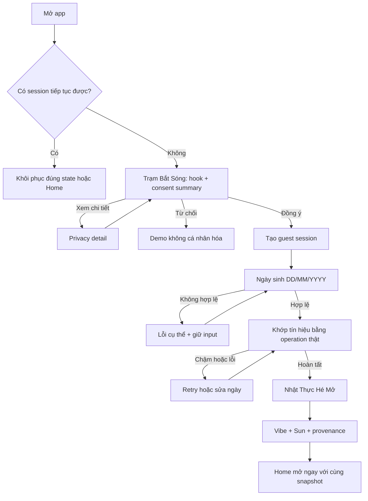
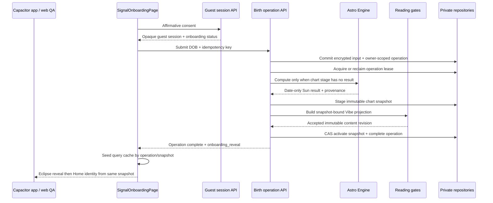

# Trạm Bắt Sóng + Personal Daily Note - Plan

## Goal Capsule

- **Objective:** Người mới đi từ đồng ý dữ liệu tới Vibe đầu tiên trong một hành trình ngắn có cảm giác khám phá, rồi ngay lập tức nhận một Daily Note dễ scan, có ích và có thể chủ động chỉnh đúng bối cảnh của ngày.
- **Means:** Một state machine app-first tổ chức Trạm Bắt Sóng trên một canvas liên tục; Home dùng Signal Stack với context dial, cream note card và bounded resonance feedback (KTD1, KTD6, KTD12–KTD15).
- **Product authority:** Công việc này cập nhật entry flow của US-01 và US-02. Các nguồn nền tảng, quyền dữ liệu, age gate và Astro Engine hiện hành vẫn là authority.
- **Stop conditions:** Dừng triển khai nếu phải đưa DOB vào client storage/telemetry, bỏ affirmative consent, thay đổi age gate, biến context/feedback thành chart evidence hoặc confidence, lưu free text, hay không thể giữ một immutable reveal snapshot xuyên suốt Reveal → Home.
- **Execution profile:** Code; app Capacitor là release surface, web là QA/reference. `ce-work` sở hữu implementation, verification, review và cleanup tail.

---

## Product Contract

### Summary

Thay onboarding dạng carousel và nhiều route rời bằng một nghi thức ba hồi: xin phép bắt tín hiệu, khớp ngày sinh, rồi hé mở Vibe đầu tiên. Flow giữ nguyên guest-first, consent trước dữ liệu sinh và Cosmic Glass Signal, nhưng đưa giá trị cá nhân vào cùng hành trình thay vì bắt người dùng liên tục bấm “tiếp tục”.

### Problem Frame

Flow hiện tại có hai welcome slide, consent, DOB, compute, một loading khác ở Reveal và thêm CTA sang Home. Cấu trúc này đúng về dữ liệu nhưng lặp lại lời hứa nhiều lần trước khi chứng minh giá trị; compute và reveal còn có thể hiển thị hai trạng thái tải liên tiếp.

Game-like decoration không tự giải quyết vấn đề. Nếu thêm card ngẫu nhiên, quiz, coin hoặc quest, sản phẩm chỉ biến một onboarding dài thành một onboarding dài hơn và làm mờ provenance của kết quả astrology.

### Key Decisions

- **KD1. Trạm Bắt Sóng là metaphor tổ chức toàn bộ entry.** (session-settled: user-directed — chosen over Mật Mã Lá, Hộp Kín Vũ Trụ và các hướng ngẫu nhiên: người dùng xác nhận direction có cảm giác chơi và hé mở nhưng vẫn hiện đại.) Governs R2, R6, R7.
- **KD2. Nhật Thực chỉ là treatment của reveal.** Nó tạo cao trào nhưng không thêm một bước hoặc một kết quả khác. Governs R8, R9.
- **KD3. Playful experience dừng tại trust boundary.** Consent dùng ngôn ngữ trực tiếp; không swipe, peel, flip hoặc “Tiếp tục” để ngầm chấp thuận xử lý dữ liệu. Governs R3, R4.
- **KD4. Người dùng điều khiển nhịp mở, không điều khiển kết quả.** DOB và engine quyết định calculation; interaction không tạo agency giả. Governs R6, R8.
- **KD5. Reveal là phần đầu của sản phẩm, không phải một màn chúc mừng đứng riêng.** Governs R9, R11.

### Requirements

**Entry và tốc độ tới giá trị**

- R1. Entry router phải đưa account hoặc guest còn hạn về đúng trạng thái đang dở và chỉ mở onboarding mới khi không có session có thể tiếp tục.
- R2. Người mới phải trải nghiệm một canvas liên tục gồm ba hồi có tiến độ thật; không còn carousel giới thiệu bắt buộc hoặc chuỗi CTA chỉ để chuyển trang.
- R3. Hồi đầu phải nói trong một viewport: Lá Lành tạo reading từ dữ liệu sinh, chưa cần tài khoản, dữ liệu guest tự hết hạn sau 30 ngày không hoạt động, và người dùng có thể từ chối hoặc xem chi tiết.
- R4. Consent phải là affirmative action trước khi app hỏi hoặc nhận DOB; nhánh từ chối mở bản mẫu không cá nhân hóa và không tạo guest/profile.
- R5. Sau consent, DOB là dữ liệu bắt buộc duy nhất; giờ sinh, nơi sinh, tên, email, phone và notification permission không xuất hiện trong onboarding này.

**Cơ chế Trạm Bắt Sóng**

- R6. Mỗi phản hồi “khớp sóng” phải tương ứng với trạng thái thật của input hoặc calculation; không có lựa chọn ngẫu nhiên và không ngụ ý user có thể chỉnh một kết quả đã được DOB quyết định.
- R7. Compute phải là một operation duy nhất với các trạng thái có thật. Date echo chỉ dùng giá trị đang ở volatile form memory trong cùng phiên; status/reveal response không trả DOB và UI không tạo loading thứ hai khi chuyển sang reveal.
- R8. Khi calculation sẵn sàng, user có thể tap nút hoặc dùng gesture tăng cường để hé mở; cả hai phải cho cùng một Vibe snapshot, còn Reduce Motion dùng chuyển trạng thái tĩnh hoặc fade ngắn.
- R9. Vibe reveal phải chuyển liền mạch thành phần đầu của Home và đánh dấu basic onboarding hoàn tất; tạo card hoặc chia sẻ không phải điều kiện để hoàn tất.

**Tính trung thực của nội dung**

- R10. Khi date-only result chắc chắn, Reveal hiển thị Vibe label, Sun placement, element, tradition/engine provenance và giới hạn “date-only”. Khi result nằm trên ranh giới cung, Reveal dùng một Vibe trung tính, liệt kê hai Sun candidate và không khẳng định một element duy nhất; không variant nào được trình bày đây là bản chất, định mệnh, chẩn đoán hoặc sự thật tuyệt đối.
- R11. Nội dung xuất hiện trong reveal và Home phải dùng cùng một immutable content snapshot; không được đổi headline khi một request Daily Note đến muộn.
- R12. Copy cần ngắn, gần gũi và có chút tinh nghịch nhưng không dùng FOMO, shame, “vũ trụ thất vọng”, countdown giả hoặc ngôn ngữ ép user cung cấp dữ liệu.

**DOB, lỗi và phục hồi**

- R13. DOB giữ cấu trúc semantic DD/MM/YYYY, hỗ trợ keyboard, paste và screen reader; validation phải phân biệt thiếu field, sai format, ngày không tồn tại, tương lai, dưới 18 và ngoài phạm vi 120 năm.
- R14. Compute bình thường phải đạt mục tiêu dưới hai giây; trạng thái chậm đổi microcopy theo thời gian thật, có retry/sửa DOB và không loading vô hạn.
- R15. Refresh, app background, app bị đóng hoặc mạng chập chờn phải tiếp tục đúng operation/snapshot hiện có, không tạo guest, chart hoặc content snapshot trùng.
- R16. Back từ compute hoặc reveal không được xóa kết quả cũ trước khi một DOB mới tính thành công.

**Privacy, security và analytics**

- R17. DOB không được xuất hiện trong URL, public share, localStorage, Cache Storage, analytics payload hoặc application log. Private server input/record phải dùng TLS, `Cache-Control: no-store`, mã hóa at rest, owner binding và retention authority hiện hành.
- R18. Consent record phải lưu purpose/version/timestamp và Mình phải có đường xóa toàn bộ guest data để rút khỏi birth-profile processing trong scope này. Marketing, analytics tùy chọn và account creation không được bundle vào consent; purpose-specific revocation được tách thành story riêng.
- R19. Session credential phải tiếp tục dùng opaque HttpOnly cookie với CSRF/trusted-origin protection; onboarding redesign không mở thêm public endpoint hoặc client-readable auth secret.
- R20. Đợt này không thêm analytics SDK, funnel event, beacon hoặc analytics-like request. Chỉ aggregate operational metrics đã tồn tại, không chứa DOB/chart/prose và không liên kết thành hành vi cá nhân, mới được giữ lại.

**Visual, accessibility và app-first**

- R21. UI phải dùng Cosmic Glass Signal và Be Vietnam Pro duy nhất; một primary CTA tại mỗi state, target tối thiểu 44px, reading/consent surface đủ đặc và tương phản để scan.
- R22. Drag, peel, eclipse motion và audio/haptic nếu có chỉ là enhancement; flow đầy đủ phải dùng được bằng tap, keyboard, VoiceOver/TalkBack, text scale 200% và Reduce Motion.
- R23. iOS và Android Capacitor là release surface; web giữ vai trò QA/reference và không được là nơi duy nhất có flow hoặc behavior hoàn chỉnh.
- R24. Người dùng chỉ gặp auth khi chủ động cần sync/restore hoặc bước vào tính năng có người khác; onboarding và Lá đầu tiên luôn hoàn tất ở guest mode.

**Daily Note cá nhân hóa có kiểm soát**

- R25. Home phải bám reference đã chọn: nền Cosmic Glass Signal, lời chào ngắn, câu hỏi “Hôm nay chuyện gì đang chiếm sóng?”, một context dial dễ scan và một cream note card chiếm ưu thế thị giác.
- R26. Context dial có các lựa chọn đóng `auto`, `work`, `relationships`, `communication`, `energy`, `self_care`; lựa chọn chỉ đổi manifestation và micro-action đời thường. Chart facts, factor ranking eligibility, confidence, provenance và disclaimer không đổi.
- R27. Context là lựa chọn trong ngày và phải hiện rõ trong query/cache identity để không trả nhầm projection của context khác. Không đặt context nhạy cảm vào URL; mutation dùng body enum đóng, CSRF và trusted-origin.
- R28. “Vì sao Lá chọn điều này hôm nay?” mở progressive disclosure về yếu tố chart/transit đã dùng; phần đầu vẫn scan được trong 3–5 giây và không lặp lại bảng disclaimer lớn.
- R29. Primary action của Daily Note đến từ `micro_action` đã qua content gate. CTA không được xúi giục quyết định hệ trọng, chẩn đoán hoặc khẳng định dự đoán.
- R30. Resonance feedback chỉ có ba giá trị đóng: `hit`, `miss`, `different_angle`. Không nhận free text, không sửa chart facts, không được mô tả như bỏ phiếu cho độ đúng của astrology.
- R31. Lần đầu gửi resonance phải có consent rõ cho mục đích `reading_resonance`; người dùng có thể xem trạng thái, reset preference signals hoặc xóa toàn bộ resonance data trong Mình. Guest deletion và expiry phải cascade xóa dữ liệu này.
- R32. “Đổi góc” phải trả một framing hợp lệ khác của cùng chart plan/context hoặc giải thích trung thực rằng chưa có góc khác; không sinh claim mới ngoài evidence allowlist.
- R33. Feedback có thể điều chỉnh bounded ranking của lens/manifestation trong tương lai, nhưng release này chỉ ghi nhận sự kiện gần nhất theo note/revision/context, không tự suy personality và không gọi external model.
- R34. Mọi navigation item và primary action trong journey Invitation → DOB → Reveal → Home → Note detail → Saved/Profile phải có route thật, trạng thái lỗi/retry và tap target tối thiểu 44px.
- R35. App Capacitor là release surface; web build là QA reference. Cả hai dùng Be Vietnam Pro duy nhất, hỗ trợ safe area, keyboard, Reduce Motion, dark/light và text scale 200%.

### Key Flow



### Flow Details

- **F1. First run đồng ý**
  - **Trigger:** Không có account hoặc guest còn hạn.
  - **Steps:** Hook và consent summary → affirmative consent → DOB → compute thật → user hé mở → Home.
  - **Outcome:** Guest có Level-1 snapshot và onboarding basic completed.
  - **Covers:** R2–R11, R24.

- **F2. First run từ chối**
  - **Trigger:** User chưa muốn cung cấp birth data.
  - **Steps:** Chọn từ chối hoặc xem mẫu → mở một static Vibe sample có nhãn “Bản mẫu, không đọc từ dữ liệu của bạn” → khám phá sample bình thường → chỉ quay lại consent bằng secondary action do user chủ động; Back về invitation và không tự mở consent.
  - **Outcome:** Không tạo guest/profile, không gửi DOB và không dùng sample copy như claim cá nhân.
  - **Covers:** R3, R4, R18.

- **F3. Validation và sửa DOB**
  - **Trigger:** DOB thiếu, sai hoặc bị age gate chặn.
  - **Steps:** Giữ nguyên giá trị → báo đúng nguyên nhân gần field/group → focus về điểm cần sửa → submit lại.
  - **Outcome:** Không có calculation request cho dữ liệu không hợp lệ.
  - **Covers:** R13, R17, R20.

- **F4. Compute chậm hoặc bị gián đoạn**
  - **Trigger:** Operation quá thời gian bình thường, mất mạng, background hoặc app bị đóng.
  - **Steps:** Hiện trạng thái có thật → cho retry/sửa → resume cùng operation khi quay lại.
  - **Outcome:** Không double-submit và không mất input/snapshot thành công.
  - **Covers:** R7, R14–R16.

- **F5. Reveal accessible**
  - **Trigger:** Snapshot đã sẵn sàng.
  - **Steps:** User tap nút hoặc dùng gesture → Vibe xuất hiện; Reduce Motion bỏ chuyển động không thiết yếu.
  - **Outcome:** Mọi mode tương tác nhận cùng content và đi vào Home.
  - **Covers:** R8–R12, R21, R22.

- **F6. Daily context và resonance**
  - **Trigger:** User đã có Daily Note và muốn note gần tình huống hôm nay hơn.
  - **Steps:** Chọn context đóng hoặc để Lá chọn → app lấy đúng context-scoped projection → đọc note/why-today/action → tùy chọn Trúng/Chưa trúng/Đổi góc → consent purpose riêng ở lần đầu → lưu bounded feedback hoặc trả alternate framing.
  - **Outcome:** Nội dung gần đời sống hơn nhưng chart truth/confidence không đổi; feedback có thể reset/delete.
  - **Covers:** R25–R33.

### Acceptance Examples

- **AE1. Bỏ carousel**
  - **Covers:** R2, R3.
  - **Given** user mở app lần đầu, **when** entry sẵn sàng, **then** user thấy hook và quyết định dữ liệu trên cùng canvas mà không phải bấm qua hai slide giới thiệu.

- **AE2. Consent trước DOB**
  - **Covers:** R4, R18.
  - **Given** user chưa consent birth-profile purpose, **when** onboarding hiển thị, **then** DOB field chưa được hỏi/nhận và CTA ghi rõ hành động chấp thuận.

- **AE3. Nhánh từ chối công bằng**
  - **Covers:** R4.
  - **Given** user chọn xem bản mẫu, **when** demo mở, **then** không có guest/profile được tạo và app không lặp lại consent ngay lập tức.

- **AE4. Không agency giả**
  - **Covers:** R6.
  - **Given** cùng DOB và cùng engine version, **when** user tap/drag/tune theo cách khác nhau, **then** calculation và snapshot nhận được giống nhau.

- **AE5. Một compute, một reveal**
  - **Covers:** R7, R11.
  - **Given** birth compute thành công, **when** chuyển sang reveal, **then** Vibe hiện từ snapshot vừa tạo mà không có loading/fetch khiến headline đổi lần hai.

- **AE6. Reveal không chặn bởi card**
  - **Covers:** R9.
  - **Given** user đã mở Vibe, **when** không tạo hoặc chia sẻ Lá Khai Sinh card, **then** onboarding vẫn hoàn tất và Home dùng được.

- **AE7. Reduce Motion**
  - **Covers:** R8, R22.
  - **Given** hệ thống bật Reduce Motion, **when** user chọn hé mở, **then** eclipse/peel được thay bằng fade ngắn hoặc state tĩnh và không trì hoãn nội dung.

- **AE8. Invalid DOB**
  - **Covers:** R13.
  - **Given** user nhập 31/02 hoặc ngày chưa đủ 18 tuổi, **when** submit, **then** lỗi đúng nguyên nhân được announce, giá trị được giữ và server không tạo chart.

- **AE9. Resume**
  - **Covers:** R15.
  - **Given** app bị đóng trong compute nhưng operation đã hoàn tất, **when** mở lại, **then** app route tới reveal của snapshot đó thay vì chạy lại.

- **AE10. Dữ liệu không rò rỉ**
  - **Covers:** R17, R20.
  - **Given** user hoàn tất onboarding, **when** kiểm tra URL, storage, logs, analytics và share artifact, **then** không nơi nào chứa DOB thô ngoài private encrypted record được phép.

- **AE11. Guest-first**
  - **Covers:** R5, R24.
  - **Given** user chưa có account, **when** hoàn tất reveal và đọc Home, **then** app không yêu cầu phone/email/OTP.

- **AE12. Ngày ranh giới cung**
  - **Covers:** R10, R11.
  - **Given** date-only engine trả hai Sun candidate, **when** Reveal và Home identity mở, **then** cả hai dùng cùng Vibe trung tính, hiển thị hai candidate và không khẳng định một cung/element là chắc chắn.

- **AE13. Context không đổi chart truth**
  - **Covers:** R26, R27.
  - **Given** cùng guest, chart snapshot, ngày và revision, **when** đổi từ `work` sang `relationships`, **then** manifestation/action đổi còn evidence claims, confidence, tradition và provenance giữ nguyên.

- **AE14. Resonance consent và giới hạn dữ liệu**
  - **Covers:** R30, R31, R33.
  - **Given** user chưa consent `reading_resonance`, **when** chạm Trúng/Chưa trúng/Đổi góc, **then** app giải thích đúng mục đích trước khi gửi; payload sau đồng ý chỉ có enum, note/revision/context identifiers và không có free text/DOB/prose.

- **AE15. Reset/delete resonance**
  - **Covers:** R31.
  - **Given** user đã gửi feedback, **when** reset tại Mình, **then** toàn bộ resonance rows của owner bị xóa, consent purpose được revoke/reset phù hợp và Daily Note vẫn dùng được ở chế độ mặc định.

- **AE16. Đổi góc an toàn**
  - **Covers:** R28–R32.
  - **Given** user chọn Đổi góc, **when** alternate framing khả dụng, **then** app hiển thị một manifestation/action khác nhưng cùng evidence; nếu không khả dụng, app nói rõ và giữ note hiện tại.

### Success Criteria

- First-run path có tối đa hai affirmative decisions trước khi reveal: consent và submit DOB.
- Không còn welcome carousel, double-loading hoặc CTA bắt buộc từ Reveal sang Home.
- P95 birth calculation giữ mục tiêu hiện hành dưới hai giây trong điều kiện bình thường; mọi operation có timeout/recovery có thể hành động.
- Usability QA chứng minh first-time user hiểu ba điều trước DOB: dữ liệu nào được dùng, dùng để làm gì và có thể từ chối/xóa thế nào.
- Daily Note scan-test cho thấy người dùng nhận ra headline, bối cảnh, lý do hôm nay và hành động chính mà không phải đọc toàn bộ phần giải thích.
- Contract/API tests chứng minh context không đổi evidence/confidence và resonance không nhận free text hay đi ra external generation.
- Accessibility QA hoàn tất bằng tap, keyboard và screen reader; Reduce Motion không làm mất nội dung hoặc tăng số bước.
- Security/privacy regression suite xác nhận session, CSRF, encryption, retention, log/analytics redaction và public projection không suy giảm.
- Network/runtime inspection xác nhận không có analytics SDK, event hoặc beacon mới trong flow; timing được đo cục bộ trong QA.

### Scope Boundaries

**Trong scope**

- Entry, consent summary/detail handoff, DOB, compute ritual, basic Vibe reveal và transition vào Home.
- Resume, decline/demo, invalid/under-18, slow/error, offline và reduced-motion states của flow trên.
- Điều chỉnh US-01/US-02 và test evidence liên quan.

**Deferred for later**

- Full birth time/place, Aura, Moon/Rising/Houses và chart switch thuộc US-06/US-07.
- Account claim, OTP, sync và restore thuộc US-19.
- Purpose-specific consent revocation giữ lại guest shell nhưng xóa riêng birth-derived data; onboarding release dùng whole-guest deletion hiện có.
- Notification permission chỉ xuất hiện khi user bật nhắc hàng ngày.
- User testing/A-B testing giữa signal treatments sau khi có prototype đủ fidelity.
- Học tự động dài hạn từ resonance, embedding/vector profile, free-text journal và chatbot astrology.

**Outside this product direction**

- Random card choice, tarot draw trong birth onboarding, personality quiz, coin/XP/streak và multi-level quest.
- Gesture-only reveal, consent ngầm hoặc copy khẳng định định mệnh/sự thật tuyệt đối.
- Suy ra context từ hành vi, vị trí, danh bạ, lịch hoặc nội dung tin nhắn; dùng feedback để tăng confidence hay chứng minh astrology “đúng”.

### Dependencies and Assumptions

- Guest session, consent ledger, birth-profile API, Swiss Ephemeris calculation, encrypted storage và content snapshot hiện có tiếp tục là nền tảng.
- US-01 và US-02 được cập nhật cùng Product Contract này để không tồn tại hai flow authority trái nhau.
- Cosmic Glass Signal và Be Vietnam Pro vẫn là design authority; light/dark dùng cùng hierarchy.
- Vietnamese legal review vẫn là release gate; ICO/EDPB guidance là benchmark thiết kế, không thay thế tư vấn pháp lý tại Việt Nam.

### Sources and Research

- `docs/ideation/2026-09-08-short-game-reveal-onboarding-ideation.html`
- `docs/user-stories/US-01-bat-dau-che-do-khach.md`
- `docs/user-stories/US-02-khai-ngay-sinh-reveal-la-khai-sinh.md`
- `docs/legal/privacy-security-flow-notes.md`
- `docs/design-directions/home-2026-09-02-v2/COSMIC-GLASS-SYSTEM.md`
- `docs/design-directions/tram-bat-song-2026-09-08/tram-bat-song-three-act-review.png`
- `apps/web/src/features/welcome/WelcomePage.tsx`
- `apps/web/src/features/consent/ConsentPage.tsx`
- `apps/web/src/features/birth/BirthDatePage.tsx`
- `apps/web/src/features/reveal/RevealPage.tsx`
- [Apple Human Interface Guidelines — Onboarding](https://developer.apple.com/design/human-interface-guidelines/onboarding)
- [ICO — What is valid consent?](https://ico.org.uk/for-organisations/uk-gdpr-guidance-and-resources/lawful-basis/consent/what-is-valid-consent/)
- [W3C WCAG 2.2 — Dragging Movements](https://www.w3.org/WAI/WCAG22/Understanding/dragging-movements.html)
- [W3C — Using `prefers-reduced-motion`](https://www.w3.org/WAI/WCAG21/Techniques/css/C39.html)
- Runtime versions: React 19.2.0, React Router 7.18.2, Vite 6.4.2, Capacitor 8.5.1, FastAPI 0.141.1, Pydantic 2.13.5 (`pnpm-lock.yaml`, `apps/api/uv.lock`).
- [React — `useId` for accessibility relationships](https://react.dev/reference/react/useId)
- [React Router — data-mode route objects](https://reactrouter.com/start/data/routing)
- [Vite — production build and browser baseline](https://vite.dev/guide/build)
- [Capacitor v8 — App lifecycle](https://capacitorjs.com/docs/apis/app)
- [Capacitor v8 — Preferences boundaries and privacy manifest](https://capacitorjs.com/docs/apis/preferences)
- [Capacitor — Security guidance](https://capacitorjs.com/docs/guides/security)
- [FastAPI — request bodies](https://fastapi.tiangolo.com/tutorial/body/)
- [FastAPI — query parameters and enums](https://fastapi.tiangolo.com/tutorial/query-params/)
- [Pydantic — model configuration](https://docs.pydantic.dev/latest/concepts/config/)

## Planning Contract

### Key Technical Decisions

- KTD1. Dùng một `SignalOnboardingPage` với state machine rõ ràng cho invitation, consent-pending, DOB, compute, reveal-ready, revealed và recoverable-error. (session-settled: user-approved — chosen over giữ carousel và nhiều màn rời: người dùng xác nhận Trạm Bắt Sóng để rút ngắn flow và tạo cảm giác hé mở.) Các URL cũ `/welcome`, `/consent`, `/birth` và `/reveal` trở thành entry alias vào cùng controller để deep link và session resume không gãy. Cites KD1, KD2; satisfies R1, R2, R7, R15.
- KTD2. Thêm một request-driven birth-compute saga bền vững quanh cơ chế snapshot hiện có. `PUT /birth-profile/basic` tạo hoặc trả operation theo `(owner, idempotency key)`; result uniqueness dùng `(owner, canonical input, engine/config version)`. Operation commit encrypted DOB trước compute, dùng lease 15 giây có expiry/reclaim và tối đa ba attempt; compatibility endpoint gọi cùng service. `GET /birth-profile/basic/status` chỉ đọc và trả `active`, `resume_allowed` hoặc terminal state. Khi lease hết hạn hoặc operation retryable, client gọi CSRF-protected `POST /birth-profile/basic/resume`; poll backoff 0.5s → 1s → 2s và giữ trần 2s. Operation complete cuối cùng sau khi chart và reveal IDs đã bền vững. Deletion epoch/guest lock chặn finalization sau delete/expiry. Satisfies R7, R14–R17, R19.
- KTD3. Một application-level onboarding orchestrator sở hữu chuỗi stage chart → gated reading revision → CAS activate snapshot/complete operation; birth domain không import reading domain. Add `ONBOARDING_REVEAL` as a snapshot-bound, no-transit reading purpose with its own copy budget and allowlist that forbids prompts for giờ/nơi sinh. Operation hoàn tất trả `onboarding_reveal` bất biến cùng chart provenance. Reading identity includes chart snapshot. The versioned persona mapping is shared with the existing Daily Note consumer, handles all 12 signs and the neutral boundary variant, and keeps Reveal/Home identity on one revision. Satisfies R5, R9–R12, R15, R17, R19.
- KTD4. Client dùng mutation response để seed TanStack Query ngay khi operation hoàn tất; query identity gồm operation/snapshot thay vì chỉ global page key. DOB chỉ sống trong component memory và request body, không nằm trong operation/status/reveal cache. Private birth responses dùng `no-store`; query/cache data bị xóa khi session epoch đổi, hết hạn hoặc delete. Native lifecycle installs a privacy cover before app-switcher capture while DOB fields are visible, then removes it on foreground. App restart phục hồi từ server operation. Satisfies R7, R11, R15, R17.
- KTD5. Consent vẫn tạo guest bằng affirmative action và idempotency key hiện có. Unified canvas chỉ đổi presentation; `/privacy` vẫn là detail boundary và `/demo` vẫn là nhánh từ chối không tạo session/profile. Cites KD3; satisfies R3, R4, R18, R19.
- KTD6. Cosmic Glass Signal là visual authority và chỉ dùng Be Vietnam Pro. (session-settled: user-directed — chosen over các direction còn lại: người dùng chọn phương án Cosmic Glass Signal và yêu cầu một font nhất quán.) Motion eclipse là progressive enhancement; tap là đường chính, drag chỉ bổ sung và Reduce Motion dùng fade hoặc state tĩnh. Audio/haptic không nằm trong release này. Satisfies R8, R21–R23.
- KTD7. Không thêm product analytics trong đợt này. Repo chưa có analytics contract được duyệt và data inventory hiện cấm derived Vibe/Aura properties; verification dùng test evidence và local performance measurement. Satisfies R17, R20.
- KTD8. Web shell và Capacitor dùng chung flow, nhưng native session/operation vertical slice phải pass ngay sau U1 trước khi UI/state-machine work tiếp tục. Haptic không nằm trong release này. Satisfies R22, R23.
- KTD10. DOB control là composite ba numeric sub-field DD/MM/YYYY như US-02 và mock đã chọn. Paste full value được phân tách theo DD/MM/YYYY; focus/backspace/normalization giữ hành vi dự đoán được và error group liên kết cả ba sub-field. Satisfies R13, R21, R22.
- KTD11. Legacy guest adoption dùng lazy migration. Khi session còn hạn có birth profile nhưng chưa có operation, orchestrator chọn preserved date-only snapshot của profile để tạo synthetic completed operation và `ONBOARDING_REVEAL`; current enriched `NatalChart` vẫn giữ nguyên cho các feature sâu. `completed` đi thẳng Home; `basic_revealed` mở đúng Level-1 reveal; không hỏi lại DOB và không hạ cấp chart. Satisfies R1, R10, R11, R15.
- KTD12. Daily Note dùng context body enum đóng thay vì query string để tránh đưa preference vào URL/history. Projection identity thêm context nhưng planner giữ nguyên factor eligibility, confidence và evidence set; chỉ renderer manifestation/action nhận lens. (session-settled: user-directed — chosen over implicit behavioral inference: user chọn context dial hiển thị rõ và yêu cầu chart giữ nguyên.) Satisfies R25–R27.
- KTD13. Resonance là owner-scoped table riêng, unique theo `(guest, daily_note, revision, context)` và last-write-wins. Consent dùng ledger hiện có với purpose/version riêng; reset xóa rows và revoke purpose, whole-guest delete/expiry cascade. Không lưu prose, DOB, mood hay timestamps chi tiết hơn server receipt cần thiết. Satisfies R30, R31, R33.
- KTD14. `different_angle` chọn deterministic alternate manifestation/action từ cùng plan/evidence và trả trong private response; không gọi LLM, không thay evidence/confidence, không tự activate revision mới. Satisfies R28–R33.
- KTD15. UI Home theo reference Signal Stack: context dial → dominant cream note card → why-today disclosure → one gated action → resonance row → existing navigation. Mood check-in chuyển xuống secondary section để tránh hai câu hỏi cạnh tranh ở đầu màn hình. (session-settled: user-directed — chosen over the prior Home hierarchy: user selected direction 1 and requested the reference be applied.) Satisfies R25, R28, R29, R34, R35.

### High-Level Technical Design



State restoration is server-led:

```text
no session -> invitation
consent missing -> invitation
consented + no operation -> DOB
pending/leased operation -> compute status
retryable failure -> retry or re-enter DOB
terminal age/validation block -> edit typo or exit/demo
complete operation + reveal unopened -> reveal-ready
reveal opened + completion pending/failed -> revealed with completion retry
onboarding completed + matching active revision -> Home
expired/deleted session -> clear private cache and invitation
```

The operation API is additive. Existing private `/birth-profile` reads remain available to later US flows. The legacy synchronous create endpoint remains a compatibility facade until all in-repo callers and contracts use the operation API.

### Recovery UI Matrix

| Server/client state | Primary action | Secondary behavior |
|---|---|---|
| Offline before consent/DOB submit | “Thử kết nối lại” | Giữ state/input trong memory; “Xem bản mẫu” vẫn dùng được nếu asset đã local. |
| Active compute lease | Không CTA trong 4 giây đầu | Hiển thị status thật; sau đó cho “Tiếp tục chờ” và “Sửa ngày sinh”. |
| Expired lease hoặc retryable failure | “Thử bắt lại” | Gọi resume operation; “Sửa ngày sinh” tạo operation mới nhưng giữ snapshot cũ tới success. |
| Terminal DOB/age rejection | “Sửa ngày sinh” | “Xem bản mẫu” là exit công bằng; không tạo chart. |
| Reveal opened, completion failed | “Thử hoàn tất” | Giữ nguyên Vibe đã mở; không quay về loading hoặc đổi content. |
| Session expired/deleted | “Bắt đầu lại” | Xóa private query/cache trước khi về invitation. |

### Same-Canvas and Accessibility Transitions

- Consent success focuses the DOB heading. DOB submit focuses the compute status heading and uses a polite live region.
- Actionable validation/recovery errors use an assertive announcement, then focus the first invalid field or recovery heading.
- Compute completion focuses the reveal control. Opening it announces the Vibe heading once.
- Reveal opening commits completion. On success, the same canvas expands into Home, replaces history with `/home`, and focuses the first Home heading; Back cannot reopen onboarding or expose DOB.
- Completion failure leaves focus on the revealed state and exposes the retry action from the Recovery UI Matrix.

### Assumptions

- Existing envelope encryption, owner binding, opaque cookie, CSRF and trusted-origin controls remain authoritative.
- The current reading gates and immutable revision store can serve the new `ONBOARDING_REVEAL` purpose after purpose-specific planner/renderer coverage is added.
- No schema migration rewrites existing birth snapshots. The operation table references them and preserves current data.
- The selected static mock is a visual target, not a raster runtime asset. Production UI uses existing icon assets and CSS primitives; no fake CSS illustration or handcrafted SVG is introduced.
- No notification, login, full birth time/place, share card or matching work is pulled into this onboarding change.

### Implementation Constraints

- Server civil date in `Asia/Ho_Chi_Minh` is authoritative for both 18- and 120-year age boundaries. Client validation provides fast feedback only.
- Status always resolves the current operation from the credential owner; the API accepts neither owner ID nor operation ID from the client. Missing, deleted and expired current operations share one not-found response.
- Submit, resume, cancel, reveal-complete and whole-session delete mutations require trusted-origin and CSRF checks. Admission control covers peer, owner and global limits with bounded retries and polling backoff.
- Logs and problem responses contain operation IDs and bounded error enums only; they never echo DOB, chart payload or reading prose.
- Background generation cannot delay Level-1 reveal. Deterministic gated content is the immediate active revision.
- One screen state has one primary CTA. Privacy links, decline and edit actions remain visually secondary.
- Text scale, keyboard navigation and screen readers must not depend on absolute-positioned decorative layers.

### Sequencing

1. Establish operation and immutable reveal contracts before changing routing.
2. Prove session/CSRF/operation resume in an early iOS and Android vertical slice.
3. Add gated onboarding content, legacy adoption, state restoration and cache seeding.
4. Build the unified visual flow against the stable operation contract.
5. Connect reveal completion to Home and remove legacy double-loading.
6. Update US-01/US-02 and run security, privacy, app and accessibility gates.
7. Add context-scoped Daily Note projection and bounded resonance contract before wiring the selected Home hierarchy.
8. Update US-03, privacy/data inventory and Profile controls; then run cross-surface navigation and native sync QA.

## Implementation Units

### U1. Durable basic-birth operation

- **Goal:** Make submit, retry and app-kill resume converge on one owner-scoped operation and one successful birth snapshot.
- **Requirements:** R1, R7, R13–R17, R19; F3, F4; AE4, AE8–AE10; KTD2.
- **Dependencies:** None.
- **Files:** `apps/api/app/domains/birth/models.py`, `apps/api/app/domains/birth/repository.py`, `apps/api/app/domains/birth/service.py`, `apps/api/app/domains/birth/postgres.py`, `apps/api/app/domains/birth/tables.py`, `apps/api/app/domains/onboarding/`, `apps/api/app/domains/guest/postgres.py`, `apps/api/app/api/v1/routes/birth_profiles.py`, `apps/api/app/middleware/admission.py`, `apps/api/migrations/versions/`, `apps/api/tests/birth/`, `apps/api/tests/integration/`, `packages/contracts/`.
- **Approach:** Add the operation saga from KTD2 and keep the existing snapshot inactive while it is staged. The onboarding orchestrator, not the birth domain, coordinates cross-domain finalization. Admission, delete/expiry and compatibility paths use the same operation service.
- **Test scenarios:**
  - Two submits with the same guest, DOB and key return the same operation and snapshot.
  - Concurrent same-DOB submits with different keys converge on one result; same key with different DOB is rejected.
  - Two workers, retry-vs-complete and legacy-vs-new endpoint races converge through lease/CAS without duplicate activation.
  - Crash after operation commit, during compute, after chart stage and after reading stage resumes from the last durable stage.
  - A stale lease is reclaimed; exhausted retries become terminal and never loop forever.
  - App resume during pending returns pending without starting a second compute.
  - Retry after a retryable engine failure reuses the operation and completes once.
  - Invalid, future, under-18 and over-120 DOB never create an operation or chart.
  - Owner B's status endpoint can return only owner B's current operation and cannot accept owner A's identifiers.
  - Missing, deleted and expired current-operation lookups return indistinguishable not-found results.
  - Delete/expiry before compute, during lease and before finalization prevents post-deletion attachment; complete-first deletion removes the full graph.
  - Recompute failure leaves the previous current snapshot active.
- **Verification:** API tests prove saga recovery, state transitions, concurrency, idempotency, owner isolation, CSRF/trusted-origin, admission/backoff, date boundaries and encrypted-at-rest fields. Migration upgrade/downgrade is exercised on an empty and populated test database.

### U9. Early native session and resume vertical slice

- **Goal:** Falsify native cookie, CSRF and process-kill assumptions before UI and Home integration accumulate around them.
- **Requirements:** R1, R7, R15, R19, R23; F4; AE9, AE10; KTD2, KTD4, KTD8.
- **Dependencies:** U1.
- **Files:** `apps/web/src/shared/api/client.ts`, `apps/mobile/capacitor.config.ts`, `apps/mobile/ios/App/`, `apps/mobile/android/app/`, `scripts/verify-mobile-config.mjs`, `docs/reviews/`.
- **Approach:** Sync a minimal operation client through the existing Capacitor bundle. Verify affirmative guest creation, native CSRF transport, operation submit/status/resume and same-operation recovery after process termination. Add the DOB app-switcher privacy cover on both native lifecycle seams.
- **Test scenarios:**
  - iOS and Android preserve the opaque guest credential and native CSRF mechanism across process kill.
  - A killed app resumes the same pending/completed operation without resubmitting DOB.
  - Invalid or cleared credentials cannot adopt another operation and return the safe invitation path.
  - Backgrounding while DOB is visible shows only the privacy cover in the app switcher; foreground restores the field state.
- **Verification:** Both unsigned native builds compile and recorded smoke evidence proves the operation ID, owner and snapshot remain stable across kill/resume without exposing DOB.

### U2. Immutable onboarding reveal projection

- **Goal:** Return the exact gated Vibe content and provenance needed by Reveal and Home as part of the completed operation.
- **Requirements:** R7, R9–R12, R15, R17, R19; F1, F5; AE4–AE6, AE9, AE10, AE12; KTD3.
- **Dependencies:** U1.
- **Files:** `apps/api/app/domains/persona/`, `apps/api/app/domains/onboarding/`, `apps/api/app/domains/daily/service.py`, `apps/api/app/domains/readings/models.py`, `apps/api/app/domains/readings/planner.py`, `apps/api/app/domains/readings/renderers.py`, `apps/api/app/domains/readings/application.py`, `apps/api/app/api/v1/routes/birth_profiles.py`, `apps/api/tests/readings/`, `apps/api/tests/birth/`, `packages/contracts/`.
- **Approach:** Add the `ONBOARDING_REVEAL` purpose from KTD3 and extract the existing Daily Note persona mapping into the shared resolver. Build the Level-1 projection from the staged chart through existing gates. Include snapshot identity in reading plan/revision identity. Expose the compact private projection without DOB and mark authenticated responses `no-store`.
- **Test scenarios:**
  - All 12 Sun signs resolve to the reviewed 3–5-character labels and `persona_mode=vibe`.
  - A two-candidate boundary result resolves to the neutral variant, two factual candidates and no singular element claim.
  - Same chart snapshot and versions replay the same content revision.
  - Different snapshots with identical Sun/factor values do not conflict or reuse ownership incorrectly.
  - A legacy profile with only date-only data adopts that snapshot once; `basic_revealed` opens Reveal and `completed` opens Home without DOB re-entry.
  - A legacy profile whose current snapshot is a full `NatalChart` builds the Level-1 reveal from its preserved date-only snapshot while keeping the enriched chart current.
  - Gate rejection returns a safe retryable operation error without publishing rejected prose.
  - Date-only projection contains no Moon, Rising, House or transit claim.
  - Onboarding copy never asks for or teases hour/place and remains within its dedicated word budget.
  - Response/log fixtures contain no raw DOB outside the authenticated birth payload contract.
- **Verification:** Contract snapshot tests and reading-gate tests prove provenance, immutable revision identity, disclaimer presence and Level-1 claim boundaries.

### U3. Unified onboarding controller and resume router

- **Goal:** Replace four disconnected page lifecycles with one recoverable state machine while preserving legacy entry URLs.
- **Requirements:** R1–R7, R14–R16, R24; F1–F4; AE1–AE6, AE9, AE11; KTD1, KTD4, KTD5.
- **Dependencies:** U1, U2, U9.
- **Files:** `apps/web/src/app/router.tsx`, `apps/web/src/features/entry/EntryPage.tsx`, `apps/web/src/features/onboarding/SignalOnboardingPage.tsx`, `apps/web/src/features/onboarding/useSignalOnboarding.ts`, `apps/web/src/shared/api/client.ts`, `apps/web/src/app/AppProviders.tsx`, `apps/web/src/features/onboarding/*.test.tsx`, `apps/web/tests/e2e/welcome.spec.ts`, `apps/web/tests/e2e/product-flow.spec.ts`.
- **Approach:** Model allowed transitions as a discriminated state backed by a server-owned onboarding read model. Server CAS guards reject skipped or backward status mutations and bind completion to the matching reveal revision. Resolve session + read model once on entry. Seed operation, birth profile and onboarding reveal query data from mutation responses using immutable cache updates. Route aliases mount the same controller; `/privacy` and `/demo` stay separate.
- **Test scenarios:**
  - No session opens invitation; valid completed session opens Home without onboarding flash.
  - Consented session with neither operation nor legacy snapshot opens DOB; pending resumes compute; complete resumes reveal.
  - Submit success enters reveal-ready without a second loading request or headline change.
  - Refresh/background after server completion returns the same operation/revision.
  - Reveal opened but completion failed restores the revealed state with retry, not reveal-ready or Home.
  - Stale URL, browser/hardware Back, cold `/home`, concurrent replacement operation and completion without matching revision resolve through the authoritative transition matrix.
  - Every allowed server transition succeeds idempotently; every skipped/backward transition is rejected.
  - Unauthorized/expired/offline states retain safe retry, demo or restart choices without exposing cached private data.
  - Every state renders the primary/secondary actions specified in the Recovery UI Matrix.
- **Verification:** Component and E2E tests assert each state/transition, back behavior, retry semantics, alias behavior and absence of the old carousel/double-loading.

### U4. Trạm Bắt Sóng interaction and visual system

- **Goal:** Deliver the selected app-first invitation, DOB tuning and eclipse reveal with a clear scan hierarchy.
- **Requirements:** R2–R10, R12–R14, R21–R23; F1, F3, F5; AE1, AE2, AE4, AE7, AE8, AE12; KTD5, KTD6, KTD8.
- **Dependencies:** U3.
- **Files:** `apps/web/src/features/onboarding/SignalOnboardingPage.tsx`, `apps/web/src/features/onboarding/SignalInvitation.tsx`, `apps/web/src/features/onboarding/SignalBirthDate.tsx`, `apps/web/src/features/onboarding/SignalCompute.tsx`, `apps/web/src/features/onboarding/SignalReveal.tsx`, `apps/web/src/features/onboarding/onboarding.css`, `apps/web/src/shared/styles/global.css`, `apps/web/src/main.tsx`, `apps/web/src/shared/ui/`, `apps/web/src/features/onboarding/*.test.tsx`.
- **Approach:** Implement the approved static mock with one font, three type tiers and one primary CTA per state. Keep decorative orbits behind semantic content. Implement the three-part composite control from KTD10 and extract strict parsing/age-preview validation into a pure helper. Provide tap reveal first, optional drag second and a static/fade path for Reduce Motion; omit haptics.
- **Test scenarios:**
  - Missing field, bad format, impossible date, future, under-18 and over-120 each focus and announce the correct error while preserving input.
  - Paste formats `DDMMYYYY`, `DD/MM/YYYY` and `DD-MM-YYYY` normalize without locale guessing.
  - Keyboard, VoiceOver/TalkBack order and 200% text scale complete the flow without overlap or hidden actions.
  - Reduce Motion removes eclipse travel/peel motion and returns identical content.
  - Boundary reveal uses the neutral content hierarchy without implying one certain sign.
  - Dark and light theme preserve contrast, type hierarchy and Cosmic Glass Signal identity.
  - Every state transition follows the focus and live-region rules in Planning Contract.
- **Verification:** Unit tests cover date helpers and accessibility semantics. Visual QA compares the reference and implementation at the same mobile viewport for invitation, DOB, compute, reveal-ready, revealed, errors and large text.

### U5. Reveal commit and Home continuity

- **Goal:** Complete onboarding reliably and make the opened Vibe the first stable product content on Home.
- **Requirements:** R8–R12, R15, R16, R24; F1, F5; AE5, AE6, AE9, AE11, AE12; KTD3, KTD4.
- **Dependencies:** U2–U4.
- **Files:** `apps/web/src/features/onboarding/SignalReveal.tsx`, `apps/web/src/features/home/HomePage.tsx`, `apps/web/src/features/card/BirthCardPage.tsx`, `apps/web/src/shared/api/client.ts`, `apps/web/src/features/home/HomePage.test.tsx`, `apps/web/tests/e2e/product-flow.spec.ts`.
- **Approach:** Opening the reveal starts the idempotent completion mutation. On success, expand the same canvas into Home, replace history with `/home` and move focus per Planning Contract. Never navigate from a failure `finally` path. Render the same onboarding snapshot as Home identity while Daily Note loads independently below it. Card creation remains optional and cannot own completion.
- **Test scenarios:**
  - Completion failure stays on revealed content with retry and does not report Home success.
  - Retry completes once and Home displays the same snapshot/revision, label and headline.
  - Slow/failing Daily Note does not replace or blank the onboarding identity.
  - Boundary identity stays neutral and retains both candidate signs across Reveal and Home.
  - Skipping Birth Card still completes; visiting Card later keeps the same snapshot.
- **Verification:** Integration/E2E assertions compare operation snapshot and content revision identifiers across Reveal and Home and prove no required auth/card detour.

### U6. Documentation, privacy and app integration

- **Goal:** Keep product, privacy and release documentation aligned with the implemented app behavior.
- **Requirements:** R3–R5, R17–R24; F2; AE2, AE3, AE7, AE10, AE11; KTD5–KTD8, KTD10, KTD11.
- **Dependencies:** U1–U5, U9.
- **Files:** `docs/user-stories/US-01-bat-dau-che-do-khach.md`, `docs/user-stories/US-02-khai-ngay-sinh-reveal-la-khai-sinh.md`, `docs/legal/privacy-security-flow-notes.md`, `docs/reference/data-inventory-us01-us06.md`, `docs/design-directions/home-2026-09-02-v2/COSMIC-GLASS-SYSTEM.md`, `apps/mobile/capacitor.config.ts`, `scripts/verify-privacy.mjs`, `scripts/verify-mobile-config.mjs`.
- **Approach:** Replace obsolete route/screen descriptions with the three-act flow and operation states. Document purpose, retention, encrypted fields, allowed operational metadata and deletion linkage. Keep analytics disabled until a separate approved contract exists. Record app behavior and web QA parity.
- **Test scenarios:**
  - Decline/demo creates no session, operation or profile.
  - Privacy detail returns to the same invitation state and consent remains unbundled from marketing/account.
  - Demo is a clearly labelled static sample with no personalized claim/session; Back returns invitation and only a user-initiated secondary action reopens consent.
  - Runtime verification rejects DOB in URL, localStorage, logs, public artifacts or analytics-like calls.
  - Network inspection records zero analytics SDK, event or beacon requests.
  - Capacitor build uses HTTPS schemes, no cleartext navigation and the same onboarding bundle.
- **Verification:** Documentation review finds no conflict between US-01, US-02, Product Contract and implemented routes. Privacy/mobile verification scripts pass.

### U7. Release QA and regression closure

- **Goal:** Prove the full guest-first app flow works, matches the selected design and preserves security/privacy guarantees.
- **Requirements:** R1–R24; F1–F5; AE1–AE12.
- **Dependencies:** U1–U6, U9.
- **Files:** `apps/api/tests/`, `apps/web/src/**/*.test.tsx`, `apps/web/tests/e2e/product-flow.spec.ts`, `scripts/qa-server.test.mjs`, `docs/reviews/`.
- **Approach:** Run focused tests during each unit, then full repo checks. Build the QA bundle, compare each key state against the approved mock, and exercise the same build through Capacitor on mobile. Record only evidence and unresolved defects; do not accept P0/P1 visual, security or privacy gaps.
- **Test scenarios:**
  - Happy path reaches personalized reveal with two affirmative decisions and no login.
  - Decline, invalid DOB, under-18, timeout, engine failure, app kill, expired session and offline recovery all follow their Product Contract outcomes.
  - Security regression covers CSRF, trusted origin, owner isolation, encrypted DOB/operation fields and redacted logs.
  - App QA covers iOS/Android navigation, keyboard, safe areas, privacy cover, Reduce Motion and screen reader labels.
  - Android debug and unsigned iOS Simulator builds compile; native smoke covers cookie/CSRF persistence and process-kill resume.
- **Verification:** All gates in Verification Contract pass and the review artifact links comparison captures for all major states.

### U10. Context-scoped Daily Note contract

- **Goal:** Make the selected context dial produce a different everyday manifestation/action without changing chart truth or confidence.
- **Requirements:** R25–R29; F6; AE13; KTD12.
- **Dependencies:** Existing reading planner/renderer and Daily Note projection.
- **Files:** `apps/api/app/domains/readings/models.py`, `apps/api/app/domains/readings/application.py`, `apps/api/app/api/v1/routes/daily_notes.py`, `apps/api/tests/readings/`, `apps/api/tests/daily/`, `packages/contracts/openapi/v1.json`, `packages/contracts/src/v1.ts`, `apps/web/src/shared/api/client.ts`.
- **Approach:** Add a strict body model carrying the closed context enum, pass it to projection planning, and include context in plan/projection/cache identity. Keep evidence claims and confidence stable across contexts and mark responses private/no-store.
- **Execution note:** Start with an API integration test comparing two contexts against the same snapshot and date.
- **Test scenarios:**
  - `auto` matches the existing deterministic date rotation.
  - Each supported context returns a permitted manifestation/action and stable evidence/confidence.
  - Unknown enum and extra body fields return 422 without creating a projection.
  - Owner/session/CSRF/trusted-origin failures match existing private mutation behavior.
  - Repeating the same context is idempotent and does not create unbounded rows.
- **Verification:** OpenAPI/contracts and API tests prove the closed enum, no-store response and AE13 invariants.

### U11. Bounded resonance lifecycle

- **Goal:** Record, retrieve, reset and delete resonance feedback without free text, chart mutation or profiling.
- **Requirements:** R30–R33; F6; AE14–AE16; KTD13, KTD14.
- **Dependencies:** U10.
- **Files:** `apps/api/app/domains/resonance/`, `apps/api/app/api/v1/routes/daily_notes.py`, `apps/api/app/api/v1/router.py`, `apps/api/app/main.py`, `apps/api/app/db/base.py`, `apps/api/migrations/versions/`, `apps/api/tests/resonance/`, `apps/api/tests/privacy/`, `packages/contracts/`.
- **Approach:** Mirror the owner-bound Mood domain but use a purpose-specific consent record and closed enum. Persist only identifiers, context, value and receipt time. Implement current-state read, upsert, alternate response and reset; rely on guest FK cascade for whole-session deletion.
- **Test scenarios:**
  - First write without resonance consent is rejected and stores nothing.
  - Explicit consent then hit/miss/different-angle upserts one row for the same scope.
  - Payload containing free text or unknown fields is rejected.
  - Different-angle returns content from the same evidence set or an explicit unavailable state.
  - Reset removes all owner feedback and consent state; retry is idempotent.
  - Guest delete/expiry cascades rows; owner B cannot read/reset owner A.
- **Verification:** Migration, route, owner-isolation, CSRF, deletion and privacy-shape tests pass.

### U12. Selected Home and Note-detail experience

- **Goal:** Apply the approved direction-1 layout and make every visible control work through the real contracts.
- **Requirements:** R25–R35; F6; AE13–AE16; KTD15.
- **Dependencies:** U10, U11 and U3–U5.
- **Files:** `apps/web/src/features/home/HomePage.tsx`, `apps/web/src/features/home/NoteDetailPage.tsx`, `apps/web/src/features/profile/ProfilePage.tsx`, `apps/web/src/shared/api/client.ts`, `apps/web/src/shared/storage/clearPersonalData.ts`, `apps/web/src/shared/styles/global.css`, `apps/web/src/features/home/*.test.tsx`, `apps/web/tests/e2e/product-flow.spec.ts`.
- **Approach:** Rebuild Home hierarchy from the reference with semantic context controls, dominant paper note, why-today disclosure, action CTA and resonance row. Use one consent sheet at first feedback, live announcements, optimistic-but-reversible state, and Profile reset/delete controls. Preserve all existing feature routes below the fold and in AppNav.
- **Test scenarios:**
  - Context selection updates the note once, shows pending/error states and keeps the chosen chip pressed.
  - Why-today disclosure is keyboard/screen-reader operable and exposes evidence/disclaimer only on demand.
  - Primary action uses server micro-action copy and never links to an invented destination.
  - First resonance prompts consent; accept submits, decline stores nothing, later taps submit directly.
  - Reset in Profile clears UI state and server records; whole-data deletion still clears all local caches.
  - All nav items and visible CTAs resolve to working routes on direct load, Back and Capacitor hardware-back paths.
  - 390×844, 320px, 430px and 200% text scale preserve hierarchy without horizontal scroll.
- **Verification:** Component/E2E tests plus same-viewport visual comparison cover the selected reference, dark/light and Reduce Motion.

### U13. Product, framework, security and privacy documentation

- **Goal:** Leave one accurate authority for the shipped onboarding, Daily Note personalization and mobile release constraints.
- **Requirements:** R1–R35; AE10, AE13–AE16.
- **Dependencies:** U10–U12.
- **Files:** `docs/user-stories/US-01-bat-dau-che-do-khach.md`, `docs/user-stories/US-02-khai-ngay-sinh-reveal-la-khai-sinh.md`, `docs/user-stories/US-03-doc-note-hom-nay.md`, `docs/legal/privacy-security-flow-notes.md`, `docs/reference/data-inventory-us01-us06.md`, `docs/reference/framework-constraints-2026-09-14.md`, `docs/reviews/`, `scripts/verify-privacy.mjs`, `scripts/verify-mobile-config.mjs`.
- **Approach:** Update flow/UI/AC/edge cases, enumerate context/resonance data and retention, capture exact runtime constraints and official-source links, then record review evidence. Verification scripts reject accidental free text, DOB persistence and missing native privacy declarations.
- **Test scenarios:**
  - Documentation review finds no legacy carousel or contradictory Home hierarchy.
  - Data inventory maps every new field to purpose, owner, retention and deletion.
  - Privacy verifier rejects free-text resonance fields and context in URL patterns.
  - Mobile verifier confirms the bundled web build, HTTPS-only navigation and privacy manifest remain intact.
- **Verification:** Doc review, privacy script and mobile config checks pass with no unresolved P0/P1 finding.

## System-Wide Impact

- **Data lifecycle:** A new operation record adds temporary encrypted input and staged state around an existing birth snapshot. Revoke, guest deletion and inactivity cleanup coordinate with leases before cascading operations, projections and revisions.
- **API/contracts:** Birth submit becomes operation-aware and gains a status read. Generated TypeScript contracts must change in the same unit as API schemas.
- **Session/auth:** Consent, opaque cookies, native CSRF fallback and trusted-origin checks remain unchanged. New operation access inherits the same owner boundary.
- **Reading system:** Level-1 onboarding reuses the gated snapshot-bound projection path. Daily Note remains date-scoped and independent.
- **Client state:** Entry routing, onboarding state, query cache and completion status become one lifecycle. Legacy pages stop owning parallel state.
- **Offline/recovery:** Pre-submit DOB is intentionally not durable. Post-submit recovery uses the server operation; successful private content is not written to persistent browser storage.
- **Mobile:** Capacitor receives the same web bundle. Native lifecycle code adds only the app-switcher privacy cover and session/resume support required by U9.
- **Deletion:** Whole-session delete coordinates with operation finalization and does not report success while a leased birth operation can still publish.
- **Daily personalization:** Context and resonance add private, owner-scoped state but cannot influence chart facts/confidence. Context enters projection identity; resonance stays outside astronomical evidence and external generation.

## Risks & Dependencies

- **Operation race:** Concurrent submits or workers could attach two snapshots. Mitigate with separate request/result uniqueness, leases, CAS stage transitions and two-connection tests.
- **Content coupling:** Reusing Daily Note directly would make reveal date-dependent. Mitigate with the snapshot-bound projection in KTD3.
- **Legacy route drift:** Old components can remain reachable and recreate duplicate behavior. Mitigate by aliasing routes to one controller and deleting dead ownership after tests migrate.
- **Legacy guest drift:** Existing snapshots lack operation/reveal rows. Mitigate with KTD11 lazy adoption and populated-database tests before rollout.
- **Migration/privacy:** A new table can outlive deleted guests if cascade or cleanup is missed. Mitigate with foreign keys, deletion integration tests and retention review.
- **Motion overload:** Eclipse and glass effects can reduce scanability or trigger vestibular discomfort. Mitigate with strict layer budgets, Reduce Motion behavior and same-viewport visual QA.
- **Optional generation latency:** AI-generated revisions can be slow or rejected. Mitigate by making gated deterministic content the immediate active result.
- **Feedback overclaim:** “Trúng” may be misread as validating astrology. Mitigate with UI copy, data contract naming and tests that frame it as editorial resonance only.
- **Context cache collision:** A global Daily Note query key can show the wrong manifestation. Mitigate with context-bearing cache/scope identity and cancellation of stale requests.
- **External authority:** Vietnamese legal review remains a release gate. ICO/Apple/W3C sources guide UX and engineering but do not replace local legal advice.
- **Astro engine:** Swiss Ephemeris availability and licensing gate remain upstream dependencies; this work does not change calculation math.

## Documentation / Operational Notes

- Update US-01 and US-02 in the same change so the repository has one entry-flow authority.
- Update consent copy to describe whole-session deletion accurately; do not imply purpose-specific revocation exists in this release.
- Add operation status and failure categories to existing health/observability documentation without DOB or prose payload examples.
- Do not ship analytics events from the Product Contract table until legal basis, retention, deletion, destination and store disclosures are approved.
- Keep the static mock and final comparison captures under `docs/design-directions/` and `docs/reviews/`; runtime source must not import review images.
- Record framework constraints against the exact lockfile versions. Capacitor Preferences is not a secure database; private birth content remains server-owned. Any future use requires the Apple privacy-manifest reason declared by the official plugin docs.

## Verification Contract

### Focused gates

- API domain and route tests for birth operations, reading projection, owner isolation and deletion.
- API tests for context invariants, resonance consent/upsert/reset/delete and strict enum/body rejection.
- Web unit tests for state transitions, DOB validation, accessibility and completion failure.
- Web tests for context cache identity, disclosure behavior, feedback consent and all visible navigation/actions.
- Contract generation/check after every API schema change.

### Repository gates

- `pnpm contracts:check`
- `pnpm verify:runtime`
- `pnpm web:lint`
- `pnpm web:typecheck`
- `pnpm web:test`
- `pnpm api:lint`
- `pnpm api:typecheck`
- `pnpm api:test`
- `pnpm web:e2e`
- `pnpm qa:test`
- `pnpm mobile:sync`
- `cd apps/mobile/android && ./gradlew assembleDebug`
- `xcodebuild -workspace apps/mobile/ios/App/App.xcworkspace -scheme App -sdk iphonesimulator -configuration Debug CODE_SIGNING_ALLOWED=NO build`

### Manual product and app gates

- Compare approved mock and implementation together at the same 390×844 viewport for invitation, DOB, compute, reveal-ready and revealed states.
- Repeat visual QA for invalid date, under-18, retryable failure, offline, expired session, 200% text scale, light/dark and Reduce Motion.
- Run the synced build on at least one iOS and one Android target before release. Confirm safe area, keyboard, back gesture, VoiceOver/TalkBack and lifecycle resume.
- Run at least 100 submit-to-reveal-ready samples on each Capacitor platform with 150ms RTT, 10Mbps down, 2Mbps up, no artificial animation delay, a prewarmed engine and 20 concurrent guest operations. P95 must remain under two seconds.
- Inspect URL, storage, logs, network metadata, public share payloads and deletion results for AE10.
- Before release, run a moderated comprehension check with at least five Vietnamese 18+ first-time users who are not astrology experts. At least four must correctly explain the collected data, purpose, optionality, 30-day retention and deletion path before entering DOB; all must complete the reveal without facilitator rescue.

## Definition of Done

- U1–U7 and U9–U13 meet their Verification outcomes and all cited acceptance examples pass.
- The first-run path has only consent and DOB submit as affirmative decisions before reveal.
- Reveal and Home identity use the same chart snapshot and content revision with no second headline-loading phase.
- App kill, background, retry and duplicate submit converge on one operation and one active snapshot.
- Process crash after every durable saga stage and stale-lease recovery converge without duplicate or partial publication.
- Consent precedes DOB; decline/demo creates no guest or personal profile.
- No login, phone, email, hour, place or notification prompt appears before the first reveal.
- DOB is absent from URL, persistent client storage, logs, telemetry and public artifacts; private storage and deletion tests pass.
- Operation/status/reveal responses omit DOB; allowed private birth responses are `no-store`, bypass service-worker caching and are evicted on session epoch change, expiry and deletion.
- Date-boundary results use the neutral two-candidate variant consistently on Reveal and Home.
- Whole-session deletion blocks in-flight finalization, removes the full private data graph and returns the next launch to invitation.
- No analytics SDK, funnel event, beacon or analytics-like request is introduced.
- Cosmic Glass Signal uses Be Vietnam Pro only, one primary CTA per state and approved accessibility/motion fallbacks.
- Web QA and Capacitor app execute the same behavior; mobile verification evidence exists for both target platforms.
- Android debug and unsigned iOS Simulator builds compile from the synced bundle.
- The early native vertical slice passes before U3–U5 begin, and the representative mobile p95 benchmark remains under two seconds.
- The comprehension gate meets its participant threshold before release.
- US-01, US-02, privacy notes, data inventory and design system docs describe the shipped flow without contradiction.
- Full repository checks pass with no P0/P1 product, security, privacy, accessibility or visual defects.
- Dead legacy ownership, abandoned experiment code, unused styles and duplicate onboarding tests are removed from the final diff.
- Context can change only manifestation/action, never evidence/confidence; this invariant is tested across every enum value.
- Resonance accepts no free text, requires purpose-specific consent, supports reset/delete and is removed by guest cascade.
- Home matches the selected Signal Stack hierarchy while all existing product routes remain reachable and functional.
